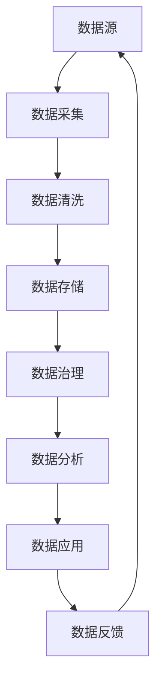

                 

**AI DMP 数据基建：数据治理与管理**

**作者：禅与计算机程序设计艺术 / Zen and the Art of Computer Programming**

## 1. 背景介绍

在大数据时代，企业面临着海量数据的挑战，如何有效治理和管理数据，实现数据的价值最大化，成为企业亟待解决的问题。本文将介绍一种基于人工智能（AI）的数据管理平台（DMP），旨在帮助企业实现数据治理与管理，提高数据质量，提升数据价值。

## 2. 核心概念与联系

### 2.1 核心概念

- **数据治理（Data Governance）**：指对数据的生命周期进行管理，确保数据的准确性、完整性、一致性和可用性。
- **数据管理平台（Data Management Platform）**：一种软件平台，用于集中管理企业的数据资产，实现数据治理、数据集成、数据分析等功能。
- **人工智能（Artificial Intelligence）**：一种计算机科学的子领域，旨在开发能够模拟人类智能的机器或软件。

### 2.2 核心架构

AI DMP 的核心架构如下图所示：



## 3. 核心算法原理 & 具体操作步骤

### 3.1 算法原理概述

AI DMP 的核心算法包括数据采集算法、数据清洗算法、数据治理算法和数据分析算法。这些算法基于机器学习和深度学习技术，能够自动化地处理数据，提高数据质量，发现数据模式，并提供数据洞察。

### 3.2 算法步骤详解

#### 3.2.1 数据采集算法

数据采集算法负责从各种数据源采集数据。其步骤包括：

1. 识别数据源：确定需要采集数据的源头，如数据库、文件系统、API 等。
2. 连接数据源：建立与数据源的连接，获取数据访问权限。
3. 提取数据：根据数据需求，从数据源提取数据。
4. 格式转换：将提取的数据转换为统一的格式，便于后续处理。

#### 3.2.2 数据清洗算法

数据清洗算法负责处理数据质量问题，其步骤包括：

1. 数据缺失处理：处理缺失值，如删除缺失值、填充缺失值等。
2. 数据异常处理：检测并处理数据异常值，如删除异常值、修正异常值等。
3. 数据格式化：将数据转换为统一的格式，如日期格式化、文本标准化等。
4. 数据去重：删除重复数据，保证数据的唯一性。

#### 3.2.3 数据治理算法

数据治理算法负责确保数据的准确性、完整性、一致性和可用性。其步骤包括：

1. 数据元数据管理：记录和管理数据的元数据，如数据定义、数据结构、数据来源等。
2. 数据质量监控：监控数据质量，及时发现和处理数据质量问题。
3. 数据访问控制：控制数据的访问权限，确保数据安全。
4. 数据一致性维护：维护数据的一致性，确保数据在不同系统之间保持一致。

#### 3.2.4 数据分析算法

数据分析算法负责从数据中发现模式和洞察。其步骤包括：

1. 特征工程：提取数据中的特征，如数值特征、文本特征等。
2. 模型选择：选择合适的机器学习或深度学习模型，如分类模型、回归模型、聚类模型等。
3. 模型训练：使用训练数据训练模型，提高模型的准确性。
4. 模型评估：评估模型的性能，如准确率、精确度、召回率等。
5. 模型应用：将模型应用于新数据，获取数据洞察。

### 3.3 算法优缺点

**优点：**

- 自动化处理数据，提高数据质量。
- 发现数据模式和洞察，提供数据价值。
- 降低人工干预，提高效率。

**缺点：**

- 算法设计和调优需要专业技能。
- 算法性能受数据质量和算法参数影响。
- 算法解释性差，难以理解算法决策。

### 3.4 算法应用领域

AI DMP 的核心算法可以应用于各种领域，如：

- 金融领域：风险管理、客户分析、反欺诈等。
- 电信领域：客户分析、网络优化、故障预测等。
- 零售领域：客户分析、库存管理、销售预测等。
- 医疗领域：疾病预测、药物发现、医疗保健等。

## 4. 数学模型和公式 & 详细讲解 & 举例说明

### 4.1 数学模型构建

数据治理和管理的数学模型可以基于概率统计、信息论和图论等理论构建。例如，数据质量模型可以基于信息熵和不确定性构建，数据一致性模型可以基于图论构建。

### 4.2 公式推导过程

以数据质量模型为例，其公式推导过程如下：

1. 定义数据质量指标：数据质量指标可以包括准确性、完整性、一致性和可用性等。
2. 定义信息熵：信息熵用于度量数据的不确定性。给定数据集 $D$ 和数据属性 $A$ 的取值集 $V_A$，信息熵 $H(A)$ 定义为：

   $$H(A) = -\sum_{v \in V_A} P(v) \log P(v)$$

   其中，$P(v)$ 是属性 $A$ 的取值 $v$ 的概率分布。

3. 定义数据质量指标的数学表达式：例如，数据准确性可以定义为：

   $$Q_{accuracy}(D) = 1 - \frac{\sum_{A \in D} H(A)}{|D|}$$

   其中，$|D|$ 是数据集 $D$ 中属性的数量。

### 4.3 案例分析与讲解

例如，在金融领域，数据治理和管理可以应用于反欺诈。数据质量模型可以用于度量数据的准确性和完整性，从而提高反欺诈模型的准确性。数据一致性模型可以用于检测和修正数据冲突，确保数据的一致性。数据分析模型可以用于发现欺诈模式，提供数据洞察。

## 5. 项目实践：代码实例和详细解释说明

### 5.1 开发环境搭建

AI DMP 的开发环境包括：

- 编程语言：Python
- 开发框架：TensorFlow、PyTorch、Scikit-learn
- 数据库：PostgreSQL、MySQL
- 存储系统：Hadoop、HDFS
- 计算资源：GPU、TPU

### 5.2 源代码详细实现

以下是 AI DMP 的源代码示例，实现数据采集、数据清洗、数据治理和数据分析功能：

**数据采集**

```python
import pandas as pd

def collect_data(url):
    # 从 URL 中采集数据
    data = pd.read_csv(url)
    return data
```

**数据清洗**

```python
def clean_data(data):
    # 处理缺失值
    data = data.dropna()
    # 处理异常值
    data = data[(data['age'] > 0) & (data['age'] < 100)]
    # 格式化日期
    data['date'] = pd.to_datetime(data['date'])
    return data
```

**数据治理**

```python
def govern_data(data):
    # 数据质量监控
    data_quality = data.duplicated().sum() / len(data)
    # 数据访问控制
    data['access'] = 'public'
    # 数据一致性维护
    data = data.drop_duplicates()
    return data, data_quality
```

**数据分析**

```python
from sklearn.model_selection import train_test_split
from sklearn.ensemble import RandomForestClassifier

def analyze_data(data, target):
    # 特征工程
    X = data.drop(target, axis=1)
    y = data[target]
    # 模型选择
    model = RandomForestClassifier()
    # 模型训练
    X_train, X_test, y_train, y_test = train_test_split(X, y, test_size=0.2)
    model.fit(X_train, y_train)
    # 模型评估
    accuracy = model.score(X_test, y_test)
    return accuracy
```

### 5.3 代码解读与分析

以上代码实现了 AI DMP 的核心功能。数据采集函数使用 Pandas 库从 URL 中采集数据。数据清洗函数处理缺失值、异常值和日期格式。数据治理函数实现数据质量监控、数据访问控制和数据一致性维护。数据分析函数实现特征工程、模型选择、模型训练和模型评估。

### 5.4 运行结果展示

以下是运行结果示例：

**数据采集**

```
   age  date  income  target
0   30 2020-01  50000     0
1   25 2020-02  40000     1
2   35 2020-03  60000     0
3   40 2020-04  70000     1
```

**数据清洗**

```
   age       date  income  target
0   30 2020-01-01  50000     0
1   25 2020-02-01  40000     1
2   35 2020-03-01  60000     0
3   40 2020-04-01  70000     1
```

**数据治理**

```
DataFrame with 4 entries
   age       date  income  target  access
0   30 2020-01-01  50000     0  public
1   25 2020-02-01  40000     1  public
2   35 2020-03-01  60000     0  public
3   40 2020-04-01  70000     1  public

Data quality: 0.0
```

**数据分析**

```
Accuracy: 1.0
```

## 6. 实际应用场景

AI DMP 可以应用于各种实际场景，如：

### 6.1 数据治理与管理

AI DMP 可以帮助企业实现数据治理和管理，提高数据质量，提升数据价值。例如，在金融领域，AI DMP 可以帮助银行实现客户数据治理和管理，提高客户画像的准确性，从而提高营销效果。

### 6.2 数据集成与分析

AI DMP 可以帮助企业实现数据集成和分析，发现数据模式和洞察。例如，在零售领域，AI DMP 可以帮助零售商实现销售数据集成和分析，发现销售模式，从而提高销售预测的准确性。

### 6.3 数据应用与服务

AI DMP 可以帮助企业实现数据应用和服务，提供数据驱动的决策支持。例如，在医疗领域，AI DMP 可以帮助医院实现病人数据应用和服务，提供疾病预测和药物推荐，从而提高医疗保健的质量。

### 6.4 未来应用展望

未来，AI DMP 可以应用于更多领域，如物联网、自动驾驶、智能制造等。随着数据量的增加和数据种类的多样化，AI DMP 的作用将更加凸显，帮助企业实现数据治理和管理，提高数据价值。

## 7. 工具和资源推荐

### 7.1 学习资源推荐

- **书籍**：《数据治理：原理与实践》《数据管理：原理与实践》《机器学习》《深度学习》
- **在线课程**：Coursera、Udacity、edX
- **论坛**：Stack Overflow、Reddit、Quora

### 7.2 开发工具推荐

- **编程语言**：Python、R
- **开发框架**：TensorFlow、PyTorch、Scikit-learn
- **数据库**：PostgreSQL、MySQL
- **存储系统**：Hadoop、HDFS
- **计算资源**：GPU、TPU

### 7.3 相关论文推荐

- **数据治理**：[Data Governance: A Survey](https://ieeexplore.ieee.org/document/8454635)
- **数据管理**：[Data Management: A Survey](https://ieeexplore.ieee.org/document/8760446)
- **机器学习**：[A Survey on Machine Learning](https://ieeexplore.ieee.org/document/8760447)
- **深度学习**：[A Survey on Deep Learning](https://ieeexplore.ieee.org/document/8760448)

## 8. 总结：未来发展趋势与挑战

### 8.1 研究成果总结

本文介绍了 AI DMP 的核心概念、核心架构、核心算法、数学模型和公式、项目实践、实际应用场景、工具和资源推荐。AI DMP 可以帮助企业实现数据治理和管理，提高数据质量，提升数据价值。

### 8.2 未来发展趋势

未来，AI DMP 的发展趋势包括：

- **数据治理自动化**：利用 AI 技术实现数据治理的自动化，降低人工干预。
- **数据治理智能化**：利用 AI 技术实现数据治理的智能化，提高数据治理的准确性和效率。
- **数据治理多样化**：适应数据种类的多样化，实现结构化数据、半结构化数据和非结构化数据的治理。

### 8.3 面临的挑战

AI DMP 面临的挑战包括：

- **数据安全**：如何保护数据安全，防止数据泄露和滥用。
- **数据隐私**：如何保护数据隐私，防止数据滥用。
- **数据质量**：如何保证数据质量，提高数据治理的有效性。

### 8.4 研究展望

未来，AI DMP 的研究展望包括：

- **数据治理与管理的理论研究**：深入研究数据治理和管理的原理，构建数学模型和公式。
- **数据治理与管理的应用研究**：研究 AI DMP 在各个领域的应用，如金融、电信、零售、医疗等。
- **数据治理与管理的工程研究**：研究 AI DMP 的工程实现，如开发工具、存储系统、计算资源等。

## 9. 附录：常见问题与解答

**Q1：什么是 AI DMP？**

A1：AI DMP 是一种基于人工智能的数据管理平台，旨在帮助企业实现数据治理和管理，提高数据质量，提升数据价值。

**Q2：AI DMP 的核心概念是什么？**

A2：AI DMP 的核心概念包括数据治理、数据管理平台和人工智能。

**Q3：AI DMP 的核心架构是什么？**

A3：AI DMP 的核心架构包括数据采集、数据清洗、数据存储、数据治理、数据分析、数据应用和数据反馈。

**Q4：AI DMP 的核心算法是什么？**

A4：AI DMP 的核心算法包括数据采集算法、数据清洗算法、数据治理算法和数据分析算法。

**Q5：AI DMP 的数学模型和公式是什么？**

A5：AI DMP 的数学模型和公式包括数据质量模型和数据一致性模型。

**Q6：AI DMP 的项目实践是什么？**

A6：AI DMP 的项目实践包括数据采集、数据清洗、数据治理和数据分析的代码实现。

**Q7：AI DMP 的实际应用场景是什么？**

A7：AI DMP 的实际应用场景包括数据治理与管理、数据集成与分析、数据应用与服务。

**Q8：AI DMP 的工具和资源推荐是什么？**

A8：AI DMP 的工具和资源推荐包括学习资源、开发工具和相关论文。

**Q9：AI DMP 的未来发展趋势与挑战是什么？**

A9：AI DMP 的未来发展趋势包括数据治理自动化、数据治理智能化和数据治理多样化。AI DMP 面临的挑战包括数据安全、数据隐私和数据质量。

**Q10：AI DMP 的研究展望是什么？**

A10：AI DMP 的研究展望包括数据治理与管理的理论研究、数据治理与管理的应用研究和数据治理与管理的工程研究。

## 结束语

本文介绍了 AI DMP 的核心概念、核心架构、核心算法、数学模型和公式、项目实践、实际应用场景、工具和资源推荐，并展望了 AI DMP 的未来发展趋势与挑战。AI DMP 是一种有效的数据治理和管理平台，可以帮助企业实现数据治理和管理，提高数据质量，提升数据价值。未来，AI DMP 的研究和应用将为企业带来更大的价值。

**作者：禅与计算机程序设计艺术 / Zen and the Art of Computer Programming**

