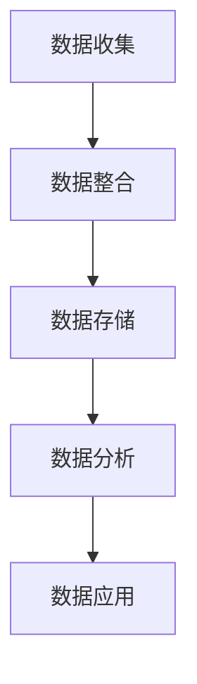

                 

**AI DMP 数据基建：构建数据驱动的营销生态**

**作者：禅与计算机程序设计艺术 / Zen and the Art of Computer Programming**

## 1. 背景介绍

在数字化转型的今天，数据已然成为企业最宝贵的资产之一。然而，如何有效地收集、存储、处理和应用这些数据，以实现真正的数据驱动决策，仍然是企业面临的挑战。本文将聚焦于**数据管理平台（Data Management Platform，DMP）**，探讨如何通过构建数据基建，打造数据驱动的营销生态。

## 2. 核心概念与联系

### 2.1 DMP 的定义与作用

DMP 是一个软件平台，用于收集、整合、存储和分析来自多个渠道的第一、二、三方数据。它为企业提供了统一的数据视图，帮助企业更好地理解客户，从而实现精准营销。

### 2.2 DMP 架构原理

DMP 的核心架构包括数据收集、数据整合、数据存储、数据分析和数据应用等模块。以下是 DMP 架构的 Mermaid 流程图：



## 3. 核心算法原理 & 具体操作步骤

### 3.1 算法原理概述

DMP 中涉及多种算法，包括数据清洗、数据整合、数据分析等。其中，机器学习算法在数据分析模块中发挥着关键作用。

### 3.2 算法步骤详解

以 K-均值聚类算法为例，其步骤如下：

1. 初始化 K 个聚类中心。
2. 计算每个数据点到各聚类中心的距离。
3. 将数据点分配给最近的聚类中心。
4. 重新计算聚类中心的位置。
5. 重复步骤 2-4，直到聚类中心不再变化。

### 3.3 算法优缺点

K-均值聚类算法优点包括简单易用、效率高，缺点包括易受初始值影响、不适合高维数据。

### 3.4 算法应用领域

K-均值聚类算法广泛应用于客户细分、用户画像等领域。

## 4. 数学模型和公式 & 详细讲解 & 举例说明

### 4.1 数学模型构建

在 DMP 中，数据分析模块常用的数学模型包括回归模型、聚类模型等。以线性回归为例，其数学模型为：

$$Y = β_0 + β_1X_1 + β_2X_2 +... + β_nX_n + ε$$

### 4.2 公式推导过程

线性回归模型的目标是最小化残差平方和，即：

$$\min \sum_{i=1}^{n} (y_i - \hat{y}_i)^2$$

其中，$\hat{y}_i$ 是模型预测的输出。

### 4.3 案例分析与讲解

假设我们要预测客户购买金额（Y）与客户年龄（X1）、客户消费频率（X2）的关系。通过构建线性回归模型，我们可以得到：

$$Y = 100 + 20X_1 + 50X_2$$

这意味着，每增加一岁，客户购买金额增加 20，每增加一次消费频率，客户购买金额增加 50。

## 5. 项目实践：代码实例和详细解释说明

### 5.1 开发环境搭建

本项目使用 Python、Pandas、Scikit-learn 等常用数据分析库。

### 5.2 源代码详细实现

以下是 K-均值聚类算法的 Python 实现：

```python
from sklearn.cluster import KMeans
import pandas as pd

# 加载数据
data = pd.read_csv('customer_data.csv')

# 初始化 KMeans 对象
kmeans = KMeans(n_clusters=3, random_state=0)

# 拟合模型
kmeans.fit(data)

# 获取聚类结果
labels = kmeans.labels_
```

### 5.3 代码解读与分析

上述代码首先导入所需库，然后加载客户数据。之后，初始化 KMeans 对象，并指定聚类数为 3。接着，使用 `fit` 方法拟合模型，最后获取聚类结果。

### 5.4 运行结果展示

运行结果为客户数据的聚类结果，每个客户都被分配到 0、1、2 之一的标签。

## 6. 实际应用场景

### 6.1 客户细分

DMP 可以帮助企业将客户细分为不同的群组，从而实现精准营销。

### 6.2 用户画像

DMP 可以帮助企业构建详细的用户画像，从而更好地理解客户需求。

### 6.3 未来应用展望

随着数据量的增加和数据种类的多样化，DMP 的作用将更加凸显。未来，DMP 将与人工智能、大数据等技术进一步结合，为企业提供更加智能化的数据服务。

## 7. 工具和资源推荐

### 7.1 学习资源推荐

推荐阅读《数据管理平台：构建数据驱动的营销生态》等相关文献。

### 7.2 开发工具推荐

推荐使用 Python、Pandas、Scikit-learn 等常用数据分析库。

### 7.3 相关论文推荐

推荐阅读《A Study on Data Management Platforms for Marketing》等相关论文。

## 8. 总结：未来发展趋势与挑战

### 8.1 研究成果总结

本文介绍了 DMP 的定义、架构、核心算法和数学模型，并提供了项目实践和实际应用场景。

### 8.2 未来发展趋势

未来，DMP 将与人工智能、大数据等技术进一步结合，为企业提供更加智能化的数据服务。

### 8.3 面临的挑战

DMP 的有效实施面临着数据安全、数据质量等挑战。

### 8.4 研究展望

未来的研究可以关注 DMP 在不同行业的应用、DMP 的安全性等问题。

## 9. 附录：常见问题与解答

**Q1：DMP 与 CDP 有何区别？**

**A1：DMP 主要用于收集、整合、存储和分析来自多个渠道的第一、二、三方数据，为企业提供统一的数据视图。而 CDP（Customer Data Platform）则侧重于收集、整合、存储和分析来自多个渠道的第一、二、三方客户数据，为企业提供统一的客户视图。**

**Q2：如何选择 DMP 供应商？**

**A2：选择 DMP 供应商时，应考虑其数据处理能力、数据安全性、数据分析能力、集成能力等因素。**

**Q3：DMP 的未来发展方向是什么？**

**A3：DMP 的未来发展方向包括与人工智能、大数据等技术进一步结合，为企业提供更加智能化的数据服务。**

**作者署名：作者：禅与计算机程序设计艺术 / Zen and the Art of Computer Programming**

