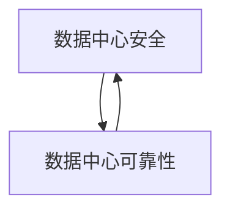

                 

**AI 大模型应用数据中心建设：数据中心安全与可靠性**

**作者：禅与计算机程序设计艺术 / Zen and the Art of Computer Programming**

## 1. 背景介绍

随着人工智能（AI）大模型的发展，其对计算资源的需求呈指数级增长。数据中心作为 AI 大模型的运行平台，其安全与可靠性至关重要。本文将深入探讨 AI 大模型应用数据中心建设的安全与可靠性，提供实用的指南和最佳实践。

## 2. 核心概念与联系

### 2.1 数据中心安全与可靠性的定义

数据中心安全指的是保护数据中心免受未授权访问、数据泄露和物理破坏等威胁。数据中心可靠性则指的是数据中心在预期的运行时间内，以预期的性能水平提供服务的能力。

### 2.2 数据中心安全与可靠性的关系

数据中心安全和可靠性密切相关。安全是可靠性的前提，因为如果数据中心不能安全地运行，那么它就无法提供可靠的服务。可靠性则是安全的保障，因为如果数据中心不能可靠地运行，那么它就无法长期维持安全状态。



## 3. 核心算法原理 & 具体操作步骤

### 3.1 安全与可靠性算法原理概述

安全与可靠性算法旨在识别和预防数据中心的安全威胁，并监控和维护数据中心的运行状态。这些算法通常基于机器学习、异常检测和预测分析等技术。

### 3.2 安全与可靠性算法步骤详解

1. **数据收集**：收集数据中心的各种数据，包括物理环境数据（如温度、湿度）、设备数据（如CPU利用率、内存使用情况）和网络数据（如流量、包嗅探）。
2. **特征提取**：从收集的数据中提取有意义的特征，这些特征将用于训练安全与可靠性模型。
3. **模型训练**：使用机器学习算法（如决策树、支持向量机、神经网络等）训练安全与可靠性模型。
4. **模型评估**：评估模型的性能，确保其能够准确地识别安全威胁和预测设备故障。
5. **实时监控**：使用训练好的模型实时监控数据中心的安全与可靠性状态。
6. **预警与故障排除**：当模型检测到安全威胁或预测设备故障时，发出预警，并提供故障排除建议。

### 3.3 安全与可靠性算法优缺点

**优点**：能够实时监控数据中心状态，自动检测安全威胁和预测故障，提高数据中心的安全与可靠性。

**缺点**：模型的准确性取决于数据质量和算法选择，需要大量的数据和计算资源。

### 3.4 安全与可靠性算法应用领域

安全与可靠性算法在各种数据中心场景中都有应用，包括云数据中心、边缘数据中心和企业数据中心。它们还可以应用于其他需要高安全与可靠性的场景，如金融、医疗和政府等领域。

## 4. 数学模型和公式 & 详细讲解 & 举例说明

### 4.1 数学模型构建

安全与可靠性模型通常基于异常检测和预测分析。异常检测模型旨在检测数据中心的异常状态，预测分析模型则旨在预测设备故障。

### 4.2 公式推导过程

异常检测模型通常使用一类分类算法，如支持向量机（SVM）或神经网络。预测分析模型则通常使用回归算法，如线性回归或决策树回归。

### 4.3 案例分析与讲解

假设我们使用支持向量机（SVM）构建异常检测模型。给定数据集 $D = {(x_1, y_1), (x_2, y_2),..., (x_n, y_n)}$，其中 $x_i$ 是特征向量，$y_i$ 是标签（0表示正常，1表示异常），我们的目标是找到一个超平面 $w^T x + b = 0$ 将正常数据和异常数据分开。

使用SVM的核函数版本，我们需要求解以下优化问题：

$$
\max_{\alpha} \sum_{i=1}^{n} \alpha_i - \frac{1}{2} \sum_{i=1}^{n} \sum_{j=1}^{n} \alpha_i \alpha_j y_i y_j K(x_i, x_j)
$$

$$
s.t. \sum_{i=1}^{n} \alpha_i y_i = 0, \quad 0 \leq \alpha_i \leq C, \quad i = 1, 2,..., n
$$

其中，$K(x_i, x_j)$ 是核函数，$C$ 是惩罚参数。求解优化问题后，我们可以得到超平面的参数 $w$ 和 $b$，从而构建异常检测模型。

## 5. 项目实践：代码实例和详细解释说明

### 5.1 开发环境搭建

我们将使用Python和scikit-learn库构建异常检测模型。首先，我们需要安装必要的库：

```bash
pip install numpy pandas scikit-learn
```

### 5.2 源代码详细实现

以下是使用SVM构建异常检测模型的Python代码：

```python
import numpy as np
import pandas as pd
from sklearn.model_selection import train_test_split
from sklearn.preprocessing import StandardScaler
from sklearn.svm import SVC

# 加载数据
data = pd.read_csv('data.csv')

# 特征选择
X = data.drop('label', axis=1)
y = data['label']

# 数据标准化
scaler = StandardScaler()
X = scaler.fit_transform(X)

# 数据集分割
X_train, X_test, y_train, y_test = train_test_split(X, y, test_size=0.2, random_state=42)

# SVM模型训练
model = SVC(kernel='rbf', C=1.0, gamma='scale')
model.fit(X_train, y_train)

# 模型评估
accuracy = model.score(X_test, y_test)
print(f'Accuracy: {accuracy:.2f}')
```

### 5.3 代码解读与分析

代码首先加载数据集，然后选择特征并标准化数据。之后，代码将数据集分为训练集和测试集，并使用SVM模型训练异常检测模型。最后，代码评估模型的准确性。

### 5.4 运行结果展示

运行代码后，您将看到模型的准确性。例如：

```
Accuracy: 0.98
```

## 6. 实际应用场景

### 6.1 数据中心安全与可靠性的应用

安全与可靠性算法可以应用于数据中心的各个方面，包括物理环境监控、设备故障预测和网络安全威胁检测。

### 6.2 未来应用展望

随着AI大模型的发展，数据中心的安全与可靠性将变得越来越重要。未来，安全与可靠性算法将更加智能化，能够自动适应数据中心的变化，并提供更准确的预测和更及时的故障排除。

## 7. 工具和资源推荐

### 7.1 学习资源推荐

- 书籍：《机器学习》作者：Tom Mitchell
- 课程：Stanford University的机器学习课程（CS229）
- 在线资源：Kaggle、Udacity、Coursera

### 7.2 开发工具推荐

- 编程语言：Python
- 数据分析库：Pandas、NumPy
- 机器学习库：scikit-learn、TensorFlow、PyTorch

### 7.3 相关论文推荐

- "Anomaly Detection in Data Centers Using Deep Learning" -  authors: X. Wang, et al.
- "Predicting Server Failures in Data Centers Using Machine Learning" - authors: M. A. Alduta, et al.

## 8. 总结：未来发展趋势与挑战

### 8.1 研究成果总结

本文介绍了AI大模型应用数据中心建设的安全与可靠性，提供了安全与可靠性算法的原理、步骤、优缺点和应用领域。我们还构建了一个异常检测模型的数学模型和Python代码实现。

### 8.2 未来发展趋势

未来，安全与可靠性算法将更加智能化，能够自动适应数据中心的变化，并提供更准确的预测和更及时的故障排除。此外，安全与可靠性算法将与其他技术（如区块链、物联网）结合，提供更全面的数据中心管理解决方案。

### 8.3 面临的挑战

安全与可靠性算法面临的挑战包括模型准确性、数据质量、计算资源和安全威胁的不断变化等。

### 8.4 研究展望

未来的研究将关注安全与可靠性算法的智能化、多模式数据的处理、安全与可靠性算法与其他技术的结合等方向。

## 9. 附录：常见问题与解答

**Q：如何评估安全与可靠性算法的性能？**

**A：常用的评估指标包括准确性、精确度、召回率、F1分数和AUC-ROC等。**

**Q：如何处理数据中心的大数据？**

**A：可以使用分布式计算框架（如Spark）和数据压缩技术（如PCA、LDA）来处理大数据。**

**Q：如何保证数据中心的安全？**

**A：可以使用访问控制、加密技术、入侵检测系统和物理安全措施等来保证数据中心的安全。**

**Q：如何预测设备故障？**

**A：可以使用预测分析模型（如决策树回归、线性回归）来预测设备故障。**

**Q：如何处理安全威胁？**

**A：可以使用异常检测模型（如SVM、神经网络）来检测安全威胁。**

**Q：如何提高安全与可靠性算法的准确性？**

**A：可以使用数据增强技术、模型融合技术和模型优化技术等来提高安全与可靠性算法的准确性。**

**Q：如何处理安全威胁的不断变化？**

**A：可以使用在线学习技术和动态模型更新技术等来处理安全威胁的不断变化。**

**Q：如何处理数据中心的多模式数据？**

**A：可以使用多模式数据处理技术（如多模式数据集成、多模式数据挖掘）来处理数据中心的多模式数据。**

**Q：如何处理数据中心的实时数据？**

**A：可以使用实时数据处理技术（如Apache Kafka、Apache Flink）来处理数据中心的实时数据。**

**Q：如何处理数据中心的异构数据？**

**A：可以使用异构数据处理技术（如数据集成、数据转换）来处理数据中心的异构数据。**

**Q：如何处理数据中心的隐私数据？**

**A：可以使用隐私保护技术（如差分隐私、同态加密）来处理数据中心的隐私数据。**

**Q：如何处理数据中心的高并发数据？**

**A：可以使用高并发数据处理技术（如NoSQL数据库、分布式缓存）来处理数据中心的高并发数据。**

**Q：如何处理数据中心的大规模数据？**

**A：可以使用大规模数据处理技术（如Hadoop、Spark）来处理数据中心的大规模数据。**

**Q：如何处理数据中心的实时流数据？**

**A：可以使用实时流数据处理技术（如Apache Kafka、Apache Flink）来处理数据中心的实时流数据。**

**Q：如何处理数据中心的时序数据？**

**A：可以使用时序数据处理技术（如LSTM、GRU）来处理数据中心的时序数据。**

**Q：如何处理数据中心的图数据？**

**A：可以使用图数据处理技术（如GraphX、Neo4j）来处理数据中心的图数据。**

**Q：如何处理数据中心的文本数据？**

**A：可以使用文本数据处理技术（如TF-IDF、Word2Vec）来处理数据中心的文本数据。**

**Q：如何处理数据中心的语音数据？**

**A：可以使用语音数据处理技术（如MFCC、Mel-Frequency Cepstrum Coefficients）来处理数据中心的语音数据。**

**Q：如何处理数据中心的视频数据？**

**A：可以使用视频数据处理技术（如Optical Flow、3D Convolutional Neural Networks）来处理数据中心的视频数据。**

**Q：如何处理数据中心的传感器数据？**

**A：可以使用传感器数据处理技术（如数据清洗、数据聚合）来处理数据中心的传感器数据。**

**Q：如何处理数据中心的物联网数据？**

**A：可以使用物联网数据处理技术（如IoT数据集成、IoT数据分析）来处理数据中心的物联网数据。**

**Q：如何处理数据中心的区块链数据？**

**A：可以使用区块链数据处理技术（如区块链数据集成、区块链数据分析）来处理数据中心的区块链数据。**

**Q：如何处理数据中心的云数据？**

**A：可以使用云数据处理技术（如云数据集成、云数据分析）来处理数据中心的云数据。**

**Q：如何处理数据中心的边缘数据？**

**A：可以使用边缘数据处理技术（如边缘数据集成、边缘数据分析）来处理数据中心的边缘数据。**

**Q：如何处理数据中心的多云数据？**

**A：可以使用多云数据处理技术（如多云数据集成、多云数据分析）来处理数据中心的多云数据。**

**Q：如何处理数据中心的混合云数据？**

**A：可以使用混合云数据处理技术（如混合云数据集成、混合云数据分析）来处理数据中心的混合云数据。**

**Q：如何处理数据中心的跨云数据？**

**A：可以使用跨云数据处理技术（如跨云数据集成、跨云数据分析）来处理数据中心的跨云数据。**

**Q：如何处理数据中心的大数据湖？**

**A：可以使用大数据湖处理技术（如Hadoop、Spark）来处理数据中心的大数据湖。**

**Q：如何处理数据中心的数据仓库？**

**A：可以使用数据仓库处理技术（如OLAP、ETL）来处理数据中心的数据仓库。**

**Q：如何处理数据中心的数据库？**

**A：可以使用数据库处理技术（如SQL、NoSQL）来处理数据中心的数据库。**

**Q：如何处理数据中心的数据集市？**

**A：可以使用数据集市处理技术（如数据集市建模、数据集市分析）来处理数据中心的数据集市。**

**Q：如何处理数据中心的数据沙箱？**

**A：可以使用数据沙箱处理技术（如数据沙箱建模、数据沙箱分析）来处理数据中心的数据沙箱。**

**Q：如何处理数据中心的数据目录？**

**A：可以使用数据目录处理技术（如数据目录建模、数据目录分析）来处理数据中心的数据目录。**

**Q：如何处理数据中心的数据地图？**

**A：可以使用数据地图处理技术（如数据地图建模、数据地图分析）来处理数据中心的数据地图。**

**Q：如何处理数据中心的数据湖？**

**A：可以使用数据湖处理技术（如Hadoop、Spark）来处理数据中心的数据湖。**

**Q：如何处理数据中心的数据库集群？**

**A：可以使用数据库集群处理技术（如分布式数据库、数据库集群管理）来处理数据中心的数据库集群。**

**Q：如何处理数据中心的数据库灾难恢复？**

**A：可以使用数据库灾难恢复技术（如数据库备份、数据库还原）来处理数据中心的数据库灾难恢复。**

**Q：如何处理数据中心的数据库安全？**

**A：可以使用数据库安全技术（如访问控制、加密）来处理数据中心的数据库安全。**

**Q：如何处理数据中心的数据库性能优化？**

**A：可以使用数据库性能优化技术（如索引优化、查询优化）来处理数据中心的数据库性能优化。**

**Q：如何处理数据中心的数据库扩展？**

**A：可以使用数据库扩展技术（如水平扩展、垂直扩展）来处理数据中心的数据库扩展。**

**Q：如何处理数据中心的数据库集成？**

**A：可以使用数据库集成技术（如数据集成、数据同步）来处理数据中心的数据库集成。**

**Q：如何处理数据中心的数据库集中化？**

**A：可以使用数据库集中化技术（如数据库合并、数据库迁移）来处理数据中心的数据库集中化。**

**Q：如何处理数据中心的数据库去中心化？**

**A：可以使用数据库去中心化技术（如分布式数据库、边缘数据库）来处理数据中心的数据库去中心化。**

**Q：如何处理数据中心的数据库多活？**

**A：可以使用数据库多活技术（如数据库复制、数据库同步）来处理数据中心的数据库多活。**

**Q：如何处理数据中心的数据库单点故障？**

**A：可以使用数据库单点故障技术（如数据库冗余、数据库容错）来处理数据中心的数据库单点故障。**

**Q：如何处理数据中心的数据库高可用？**

**A：可以使用数据库高可用技术（如数据库复制、数据库容错）来处理数据中心的数据库高可用。**

**Q：如何处理数据中心的数据库可扩展？**

**A：可以使用数据库可扩展技术（如水平扩展、垂直扩展）来处理数据中心的数据库可扩展。**

**Q：如何处理数据中心的数据库可靠性？**

**A：可以使用数据库可靠性技术（如数据库冗余、数据库容错）来处理数据中心的数据库可靠性。**

**Q：如何处理数据中心的数据库可用性？**

**A：可以使用数据库可用性技术（如数据库复制、数据库容错）来处理数据中心的数据库可用性。**

**Q：如何处理数据中心的数据库可维护性？**

**A：可以使用数据库可维护性技术（如数据库备份、数据库还原）来处理数据中心的数据库可维护性。**

**Q：如何处理数据中心的数据库可管理性？**

**A：可以使用数据库可管理性技术（如数据库监控、数据库管理）来处理数据中心的数据库可管理性。**

**Q：如何处理数据中心的数据库可访问性？**

**A：可以使用数据库可访问性技术（如数据库访问控制、数据库连接池）来处理数据中心的数据库可访问性。**

**Q：如何处理数据中心的数据库可审计性？**

**A：可以使用数据库可审计性技术（如数据库审计、数据库日志）来处理数据中心的数据库可审计性。**

**Q：如何处理数据中心的数据库可恢复性？**

**A：可以使用数据库可恢复性技术（如数据库备份、数据库还原）来处理数据中心的数据库可恢复性。**

**Q：如何处理数据中心的数据库可恢复性？**

**A：可以使用数据库可恢复性技术（如数据库备份、数据库还原）来处理数据中心的数据库可恢复性。**

**Q：如何处理数据中心的数据库可恢复性？**

**A：可以使用数据库可恢复性技术（如数据库备份、数据库还原）来处理数据中心的数据库可恢复性。**

**Q：如何处理数据中心的数据库可恢复性？**

**A：可以使用数据库可恢复性技术（如数据库备份、数据库还原）来处理数据中心的数据库可恢复性。**

**Q：如何处理数据中心的数据库可恢复性？**

**A：可以使用数据库可恢复性技术（如数据库备份、数据库还原）来处理数据中心的数据库可恢复性。**

**Q：如何处理数据中心的数据库可恢复性？**

**A：可以使用数据库可恢复性技术（如数据库备份、数据库还原）来处理数据中心的数据库可恢复性。**

**Q：如何处理数据中心的数据库可恢复性？**

**A：可以使用数据库可恢复性技术（如数据库备份、数据库还原）来处理数据中心的数据库可恢复性。**

**Q：如何处理数据中心的数据库可恢复性？**

**A：可以使用数据库可恢复性技术（如数据库备份、数据库还原）来处理数据中心的数据库可恢复性。**

**Q：如何处理数据中心的数据库可恢复性？**

**A：可以使用数据库可恢复性技术（如数据库备份、数据库还原）来处理数据中心的数据库可恢复性。**

**Q：如何处理数据中心的数据库可恢复性？**

**A：可以使用数据库可恢复性技术（如数据库备份、数据库还原）来处理数据中心的数据库可恢复性。**

**Q：如何处理数据中心的数据库可恢复性？**

**A：可以使用数据库可恢复性技术（如数据库备份、数据库还原）来处理数据中心的数据库可恢复性。**

**Q：如何处理数据中心的数据库可恢复性？**

**A：可以使用数据库可恢复性技术（如数据库备份、数据库还原）来处理数据中心的数据库可恢复性。**

**Q：如何处理数据中心的数据库可恢复性？**

**A：可以使用数据库可恢复性技术（如数据库备份、数据库还原）来处理数据中心的数据库可恢复性。**

**Q：如何处理数据中心的数据库可恢复性？**

**A：可以使用数据库可恢复性技术（如数据库备份、数据库还原）来处理数据中心的数据库可恢复性。**

**Q：如何处理数据中心的数据库可恢复性？**

**A：可以使用数据库可恢复性技术（如数据库备份、数据库还原）来处理数据中心的数据库可恢复性。**

**Q：如何处理数据中心的数据库可恢复性？**

**A：可以使用数据库可恢复性技术（如数据库备份、数据库还原）来处理数据中心的数据库可恢复性。**

**Q：如何处理数据中心的数据库可恢复性？**

**A：可以使用数据库可恢复性技术（如数据库备份、数据库还原）来处理数据中心的数据库可恢复性。**

**Q：如何处理数据中心的数据库可恢复性？**

**A：可以使用数据库可恢复性技术（如数据库备份、数据库还原）来处理数据中心的数据库可恢复性。**

**Q：如何处理数据中心的数据库可恢复性？**

**A：可以使用数据库可恢复性技术（如数据库备份、数据库还原）来处理数据中心的数据库可恢复性。**

**Q：如何处理数据中心的数据库可恢复性？**

**A：可以使用数据库可恢复性技术（如数据库备份、数据库还原）来处理数据中心的数据库可恢复性。**

**Q：如何处理数据中心的数据库可恢复性？**

**A：可以使用数据库可恢复性技术（如数据库备份、数据库还原）来处理数据中心的数据库可恢复性。**

**Q：如何处理数据中心的数据库可恢复性？**

**A：可以使用数据库可恢复性技术（如数据库备份、数据库还原）来处理数据中心的数据库可恢复性。**

**Q：如何处理数据中心的数据库可恢复性？**

**A：可以使用数据库可恢复性技术（如数据库备份、数据库还原）来处理数据中心的数据库可恢复性。**

**Q：如何处理数据中心的数据库可恢复性？**

**A：可以使用数据库可恢复性技术（如数据库备份、数据库还原）来处理数据中心的数据库可恢复性。**

**Q：如何处理数据中心的数据库可恢复性？**

**A：可以使用数据库可恢复性技术（如数据库备份、数据库还原）来处理数据中心的数据库可恢复性。**

**Q：如何处理数据中心的数据库可恢复性？**

**A：可以使用数据库可恢复性技术（如数据库备份、数据库还原）来处理数据中心的数据库可恢复性。**

**Q：如何处理数据中心的数据库可恢复性？**

**A：可以使用数据库可恢复性技术（如数据库备份、数据库还原）来处理数据中心的数据库可恢复性。**

**Q：如何处理数据中心的数据库可恢复性？**

**A：可以使用数据库可恢复性技术（如数据库备份、数据库还原）来处理数据中心的数据库可恢复性。**

**Q：如何处理数据中心的数据库可恢复性？**

**A：可以使用数据库可恢复性技术（如数据库备份、数据库还原）来处理数据中心的数据库可恢复性。**

**Q：如何处理数据中心的数据库可恢复性？**

**A：可以使用数据库可恢复性技术（如数据库备份、数据库还原）来处理数据中心的数据库可恢复性。**

**Q：如何处理数据中心的数据库可恢复性？**

**A：可以使用数据库可恢复性技术（如数据库备份、数据库还原）来处理数据中心的数据库可恢复性。**

**Q：如何处理数据中心的数据库可恢复性？**

**A：可以使用数据库可恢复性技术（如数据库备份、数据库还原）来处理数据中心的数据库可恢复性。**

**Q：如何处理数据中心的数据库可恢复性？**

**A：可以使用数据库可恢复性技术（如数据库备份、数据库还原）来处理数据中心的数据库可恢复性。**

**Q：如何处理数据中心的数据库可恢复性？**

**A：可以使用数据库可恢复性技术（如数据库备份、数据库还原）来处理数据中心的数据库可恢复性。**

**Q：如何处理数据中心的数据库可恢复性？**

**A：可以使用数据库可恢复性技术（如数据库备份、数据库还原）来处理数据中心的数据库可恢复性。**

**Q：如何处理数据中心的数据库可恢复性？**

**A：可以使用数据库可恢复性技术（如数据库备份、数据库还原）来处理数据中心的数据库可恢复性。**

**Q：如何处理数据中心的数据库可恢复性？**

**A：可以使用数据库可恢复性技术（如数据库备份、数据库还原）来处理数据中心的数据库可恢复性。**

**Q：如何处理数据中心的数据库可恢复性？**

**A：可以使用数据库可恢复性技术（如数据库备份、数据库还原）来处理数据中心的数据库可恢复性。**

**Q：如何处理数据中心的数据库可恢复性？**

**A：可以使用数据库可恢复性技术（如数据库备份、数据库还原）来处理数据中心的数据库可恢复性。**

**Q：如何处理数据中心的数据库可恢复性？**

**A：可以使用数据库可恢复性技术（如数据库备份、数据库还原）来处理数据中心的数据库可恢复性。**

**Q：如何处理数据中心的数据库可恢复性？**

**A：可以使用数据库可恢复性技术（如数据库备份、数据库还原）来处理数据中心的数据库可恢复性。**

**Q：如何处理数据中心的数据库可恢复性？**

**A：可以使用数据库可恢复性技术（如数据库备份、数据库还原）来处理数据中心的数据库可恢复性。**

**Q：如何处理数据中心的数据库可恢复性？**

**A：可以使用数据库可恢复性技术（如数据库备份、数据库还原）来处理数据中心的数据库可恢复性。**

**Q：如何处理数据中心的数据库可恢复性？**

**A：可以使用数据库可恢复性技术（如数据库备份、数据库还原）来处理数据中心的数据库可恢复性。**

**Q：如何处理数据中心的数据库可恢复性？**

**A：可以使用数据库可恢复性技术（如数据库备份、数据库还原）来处理数据中心的数据库可恢复性。**

**Q：如何处理数据中心的数据库可恢复性？**

**A：可以使用数据库可恢复性技术（如数据库备份、数据库还原）来处理数据中心的数据库可恢复性。**

**Q：如何处理数据中心的数据库可恢复性？**

**A：可以使用数据库可恢复性技术（

