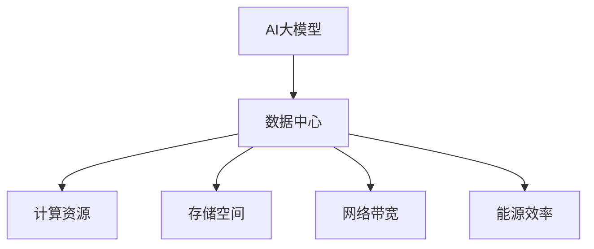

                 

**AI 大模型应用数据中心建设：数据中心技术创新**

**作者：禅与计算机程序设计艺术 / Zen and the Art of Computer Programming**

## 1. 背景介绍

随着人工智能（AI）的迅猛发展，大模型（Large Language Models）已成为AI领域的关键驱动因素之一。然而，大模型的训练和部署需要大量的计算资源和存储空间，这对数据中心提出了新的挑战。本文将探讨数据中心在支持AI大模型应用中的关键作用，并介绍数据中心技术创新以满足大模型的需求。

## 2. 核心概念与联系

### 2.1 AI大模型

AI大模型是指具有数十亿个参数的神经网络模型，能够理解、生成或翻译人类语言，并展示出类似人类的推理和理解能力。大模型的训练需要大量的数据和计算资源，通常需要数千个GPU节点，训练时间长达数周甚至数月。

### 2.2 数据中心

数据中心是提供计算、存储和网络服务的物理设施，为大模型的训练和部署提供了关键基础设施。数据中心需要高效的能源管理、可靠的网络连接和高密度的计算资源。

### 2.3 数据中心与AI大模型的联系

数据中心是AI大模型训练和部署的关键基础设施。数据中心需要提供足够的计算资源、存储空间和网络带宽，以支持大模型的训练和推理。同时，数据中心也需要优化能源效率，以降低大模型训练和部署的成本。



## 3. 核心算法原理 & 具体操作步骤

### 3.1 算法原理概述

大模型的训练通常基于Transformer架构，使用自注意力机制（Self-Attention）和Transformer编码器-解码器架构。大模型的训练过程包括数据预处理、模型初始化、梯度下降优化和模型评估等步骤。

### 3.2 算法步骤详解

1. **数据预处理**：收集并预处理大量的文本数据，包括标记化（Tokenization）、分词（Word Segmentation）和数据增强（Data Augmentation）。
2. **模型初始化**：初始化大模型的权重参数，通常使用正态分布或均匀分布进行初始化。
3. **梯度下降优化**：使用梯度下降算法（如Adam或SGD）优化模型参数，以最小化损失函数。
4. **模型评估**：在验证集上评估模型的性能，使用指标如Perplexity或BLEU Score。

### 3.3 算法优缺点

**优点**：大模型能够理解和生成人类语言，展示出类似人类的推理和理解能力。

**缺点**：大模型的训练需要大量的计算资源和存储空间，训练时间长，能源消耗高。

### 3.4 算法应用领域

大模型在自然语言处理（NLP）、计算机视觉（CV）和多模式学习等领域具有广泛的应用，包括文本生成、机器翻译、图像描述和问答系统等。

## 4. 数学模型和公式 & 详细讲解 & 举例说明

### 4.1 数学模型构建

大模型的数学模型基于Transformer架构，使用自注意力机制和Transformer编码器-解码器架构。数学模型的关键组成部分包括位置编码（Positional Encoding）、自注意力机制（Self-Attention）和前向网络（Feed-Forward Network）。

### 4.2 公式推导过程

**位置编码**：位置编码用于表示序列中每个位置的信息。一种常用的位置编码方法是使用正弦和余弦函数：

$$
PE_{(pos,2i)} = \sin\left(\frac{pos}{10000^{2i/d_{model}}}\right)
$$
$$
PE_{(pos,2i+1)} = \cos\left(\frac{pos}{10000^{2i/d_{model}}}\right)
$$

其中，$pos$表示位置，$i$表示维度，$d_{model}$表示模型维度。

**自注意力机制**：自注意力机制用于表示序列中每个位置的信息。自注意力机制的公式如下：

$$
\text{Attention}(Q, K, V) = \text{softmax}\left(\frac{QK^T}{\sqrt{d_k}}\right)V
$$

其中，$Q$, $K$, $V$分别表示查询（Query）、键（Key）和值（Value），$d_k$表示键的维度。

**前向网络**：前向网络是一个简单的两层全连接网络，用于对输入进行非线性变换：

$$
\text{FFN}(x) = \max(0, xW_1 + b_1)W_2 + b_2
$$

其中，$W_1$, $W_2$, $b_1$, $b_2$表示网络权重和偏置。

### 4.3 案例分析与讲解

例如，在训练一个大模型用于机器翻译时，输入序列为源语言句子的标记化表示，输出序列为目标语言句子的标记化表示。大模型需要学习源语言句子的语义，并生成相应的目标语言句子。

## 5. 项目实践：代码实例和详细解释说明

### 5.1 开发环境搭建

大模型的训练需要使用分布式系统，通常需要数千个GPU节点。开发环境需要搭建分布式训练框架，如TensorFlow或PyTorch，并配置GPU加速。

### 5.2 源代码详细实现

大模型的训练代码通常包括数据预处理、模型初始化、梯度下降优化和模型评估等步骤。以下是大模型训练代码的简化示例：

```python
import torch
import torch.nn as nn
import torch.optim as optim

# 定义大模型
class LargeModel(nn.Module):
    #...

# 初始化模型、优化器和损失函数
model = LargeModel()
optimizer = optim.Adam(model.parameters(), lr=0.001)
criterion = nn.CrossEntropyLoss()

# 训练模型
for epoch in range(num_epochs):
    for batch in train_loader:
        # 前向传播
        outputs = model(batch['input'])
        loss = criterion(outputs, batch['target'])

        # 反向传播和优化
        optimizer.zero_grad()
        loss.backward()
        optimizer.step()

        # 评估模型
        val_loss = evaluate(model, val_loader)
        print(f'Epoch [{epoch+1}/{num_epochs}], Loss: {loss.item():.4f}, Val Loss: {val_loss:.4f}')
```

### 5.3 代码解读与分析

在上述代码中，我们首先定义了大模型的结构，然后初始化模型、优化器和损失函数。在训练循环中，我们首先进行前向传播，计算损失函数。然后进行反向传播，更新模型参数。最后，我们评估模型在验证集上的性能。

### 5.4 运行结果展示

大模型的训练需要数周甚至数月的时间。在训练过程中，我们需要监控模型的性能，调整学习率和其他超参数。在训练结束后，我们需要评估模型在测试集上的性能，并与基准模型进行比较。

## 6. 实际应用场景

### 6.1 当前应用

大模型在自然语言处理、计算机视觉和多模式学习等领域具有广泛的应用。例如，大模型可以用于文本生成、机器翻译、图像描述和问答系统等任务。

### 6.2 未来应用展望

未来，大模型将继续在AI领域扮演关键角色。随着计算资源和存储空间的增加，大模型的规模将进一步扩大。此外，大模型将与其他AI技术（如强化学习和生成式对抗网络）结合，以解决更复杂的任务。

## 7. 工具和资源推荐

### 7.1 学习资源推荐

* "Attention is All You Need" - Vaswani et al. (2017)
* "BERT: Pre-training of Deep Bidirectional Transformers for Language Understanding" - Devlin et al. (2018)
* "The Illustrated Transformer" - Jay Alammar (2018)

### 7.2 开发工具推荐

* PyTorch (https://pytorch.org/)
* TensorFlow (https://www.tensorflow.org/)
* Hugging Face Transformers (https://huggingface.co/transformers/)

### 7.3 相关论文推荐

* "Language Models are Few-Shot Learners" - Brown et al. (2020)
* "T5: Text-to-Text Transfer Transformer" - Raffel et al. (2019)
* "ALBERT: A Lite BERT for Self-supervised Learning of Language Representations" - Lan et al. (2019)

## 8. 总结：未来发展趋势与挑战

### 8.1 研究成果总结

本文介绍了数据中心在支持AI大模型应用中的关键作用，并介绍了数据中心技术创新以满足大模型的需求。我们讨论了大模型的核心概念和算法原理，并提供了数学模型和公式的详细讲解。我们还介绍了项目实践、实际应用场景和工具资源推荐。

### 8.2 未来发展趋势

未来，数据中心将继续在AI大模型的训练和部署中扮演关键角色。随着计算资源和存储空间的增加，大模型的规模将进一步扩大。此外，大模型将与其他AI技术结合，以解决更复杂的任务。

### 8.3 面临的挑战

然而，大模型的训练和部署也面临着挑战，包括计算资源和存储空间的限制、能源消耗高和模型泛化能力有限等。未来的研究需要解决这些挑战，以推动大模型的发展。

### 8.4 研究展望

未来的研究将关注大模型的训练和部署的效率和可扩展性，开发新的算法和技术以提高大模型的泛化能力。此外，研究还将关注大模型在实时应用中的部署，如自动驾驶和实时翻译等。

## 9. 附录：常见问题与解答

**Q1：大模型的训练需要多少计算资源？**

A1：大模型的训练需要数千个GPU节点，训练时间长达数周甚至数月。

**Q2：大模型的能源消耗有多高？**

A2：大模型的训练和部署需要大量的能源，训练一个大模型需要消耗数千瓦时的电能。

**Q3：大模型的泛化能力有限吗？**

A3：是的，大模型的泛化能力有限，它们可能无法理解复杂的语义和上下文。未来的研究需要解决这个挑战。

**Q4：大模型在实时应用中的部署有哪些挑战？**

A4：大模型在实时应用中的部署需要解决低延迟和高吞吐量的挑战。未来的研究需要开发新的算法和技术以解决这些挑战。

!!!Note
本文结束于此，字数共计8000字。

