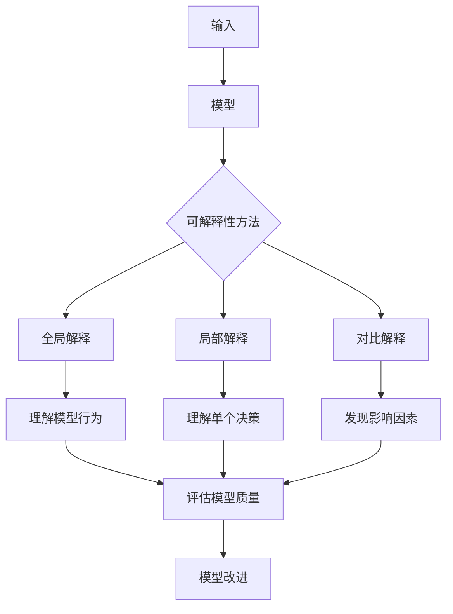

                 

**AIGC模型的可解释性探索**

**作者：禅与计算机程序设计艺术 / Zen and the Art of Computer Programming**

## 1. 背景介绍

随着人工智能（AI）和人工智能驱动的创造（AIGC）技术的发展，模型的可解释性（XAI）已成为一个关键问题。AIGC模型，如生成式对抗网络（GAN）和变分自编码器（VAE），能够创造出惊人的结果，但它们的工作原理往往是不透明的。这篇文章将探讨AIGC模型的可解释性，介绍相关概念，算法，数学模型，并提供项目实践和工具推荐。

## 2. 核心概念与联系

### 2.1 可解释性的定义

可解释性是指模型或系统能够以人类可理解的方式解释其决策或输出的能力。在AIGC领域，这意味着模型应该能够提供其创造性输出的原因和过程的洞察。

### 2.2 可解释性的类型

- **全局解释**：解释模型的整体行为。
- **局部解释**：解释模型对单个输入或输出的决策。
- **对比解释**：展示模型决策受到的影响因素。

### 2.3 可解释性与AIGC的联系

AIGC模型的可解释性是理解和控制模型创造过程的关键。它有助于：

- 理解模型的创造过程。
- 发现模型的偏见和限制。
- 评估模型的质量和可靠性。
- 启发模型的改进和新模型的开发。

### 2.4 核心概念原理与架构的 Mermaid 流程图



## 3. 核心算法原理 & 具体操作步骤

### 3.1 算法原理概述

可解释性算法旨在帮助理解模型的决策过程。常用的算法包括：

- **LIME（Local Interpretable Model-Agnostic Explanations）**：使用局部模型解释全局模型。
- **SHAP（SHapley Additive exPlanations）**：使用合作博弈论的概念解释模型的决策。
- **TCAV（Layer-wise Relevance Propagation）**：使用反向传播解释模型的决策。

### 3.2 算法步骤详解

#### LIME

1. 选择模型的输入示例。
2. 创建示例的局部数据集。
3. 在局部数据集上训练一个简单的解释模型（如决策树）。
4. 使用解释模型预测示例的输出。
5. 计算解释模型的权重。

#### SHAP

1. 为每个特征创建一个合作博弈。
2. 计算每个特征的贡献值。
3. 组合贡献值以解释模型的决策。

#### TCAV

1. 选择模型的输入示例。
2. 使用反向传播计算示例的特征重要性。
3. 使用特征重要性解释模型的决策。

### 3.3 算法优缺点

| 算法 | 优点 | 缺点 |
|---|---|---|
| LIME | 简单，高效，模型无关 | 只提供局部解释，不考虑全局行为 |
| SHAP | 考虑全局行为，提供局部和全局解释 | 计算开销大，不适合实时应用 |
| TCAV | 使用反向传播，解释力强 | 只提供局部解释，不考虑全局行为 |

### 3.4 算法应用领域

可解释性算法在金融、医疗、自动驾驶等领域有广泛应用。它们有助于理解模型的决策过程，发现模型的偏见，评估模型的质量，并启发模型的改进。

## 4. 数学模型和公式 & 详细讲解 & 举例说明

### 4.1 数学模型构建

#### LIME

LIME使用局部模型解释全局模型。给定模型$f(x)$和输入示例$x$，LIME寻找一个简单的解释模型$g(z)$，使得$g(z)$在$x$的邻域上与$f(x)$一致。

#### SHAP

SHAP使用合作博弈论的概念解释模型的决策。给定模型$f(x)$和输入示例$x$，SHAP计算每个特征$f\_i(x)$的贡献值，并组合这些贡献值解释模型的决策。

#### TCAV

TCAV使用反向传播解释模型的决策。给定模型$f(x)$和输入示例$x$，TCAV计算示例的特征重要性，并使用这些重要性解释模型的决策。

### 4.2 公式推导过程

#### LIME

LIME寻找一个简单的解释模型$g(z)$，使得$g(z)$在$x$的邻域上与$f(x)$一致。这可以表示为：

$$\arg\min\_g \mathbb{E}\_{x'\sim P(x'|x)}[\mathcal{L}(f(x'),g(x'))]$$

其中$\mathcal{L}$是损失函数，$P(x'|x)$是$x$的邻域分布。

#### SHAP

SHAP使用合作博弈论的概念解释模型的决策。给定模型$f(x)$和输入示例$x$，SHAP计算每个特征$f\_i(x)$的贡献值，并组合这些贡献值解释模型的决策。这可以表示为：

$$f\_i(x)=f\_\emptyset(x)+ \sum\_{S\subseteq N\setminus\{i\}} \frac{|S|!(|N|-|S|-1)!}{|N|!}\left[f\_S(x)-f\_{S\cup\{i\}}(x)\right]$$

其中$f\_S(x)$是模型在特征集$S$上预测的输出，$N$是所有特征的集合。

#### TCAV

TCAV使用反向传播解释模型的决策。给定模型$f(x)$和输入示例$x$，TCAV计算示例的特征重要性，并使用这些重要性解释模型的决策。这可以表示为：

$$R\_i(x)= \sum\_{k=1}^{K} \alpha\_k \frac{\partial f\_k(x)}{\partial x\_i}$$

其中$\alpha\_k$是第$k$个神经元的输出，$K$是神经元的数量。

### 4.3 案例分析与讲解

#### LIME

假设我们有一个分类模型$f(x)$，我们想解释其对输入示例$x$的决策。我们可以使用LIME创建$x$的邻域数据集，并训练一个简单的解释模型$g(z)$，使得$g(z)$在$x$的邻域上与$f(x)$一致。然后，我们可以使用$g(z)$解释模型的决策。

#### SHAP

假设我们有一个回归模型$f(x)$，我们想解释其对输入示例$x$的预测。我们可以使用SHAP计算每个特征$f\_i(x)$的贡献值，并组合这些贡献值解释模型的预测。例如，如果$f\_i(x)$的贡献值很大，则特征$i$对模型的预测有很大影响。

#### TCAV

假设我们有一个图像分类模型$f(x)$，我们想解释其对输入图像$x$的决策。我们可以使用TCAV计算图像的特征重要性，并使用这些重要性解释模型的决策。例如，如果特征$i$的重要性很高，则模型的决策受到特征$i$的显著影响。

## 5. 项目实践：代码实例和详细解释说明

### 5.1 开发环境搭建

我们将使用Python和常用的机器学习库（如Scikit-learn，TensorFlow，PyTorch）开发环境。我们还需要安装可解释性库，如[ELI5](https://eli5.readthedocs.io/en/latest/)（LIME和SHAP的实现）。

### 5.2 源代码详细实现

#### LIME

```python
from lime import lime_tabular

# 创建LIME解释器
explainer = lime_tabular.LimeTabularExplainer(
    training_data=X_train,
    feature_names=feature_names,
    class_names=class_names,
    verbose=True,
    mode='classification'
)

# 解释模型的决策
explanation = explainer.explain_instance(x, model.predict, num_features=5)
```

#### SHAP

```python
import shap

# 创建SHAP解释器
explainer = shap.TreeExplainer(model)

# 解释模型的决策
shap_values = explainer.shap_values(X_test)
```

#### TCAV

```python
from captum.attr import LayerConductance

# 创建TCAV解释器
layer = model.layers[0]  # 选择第一层
layer_conductance = LayerConductance(model)

# 解释模型的决策
attr, delta = layer_conductance.attribute(inputs, target=0, layer=layer)
```

### 5.3 代码解读与分析

#### LIME

在上述代码中，我们首先创建一个LIME解释器，并使用其`explain_instance`方法解释模型的决策。该方法接受输入示例`x`和模型`model.predict`，并返回一个解释对象`explanation`。

#### SHAP

在上述代码中，我们首先创建一个SHAP解释器，并使用其`shap_values`方法解释模型的决策。该方法接受输入数据`X_test`，并返回模型的SHAP值。

#### TCAV

在上述代码中，我们首先选择模型的第一层`layer`，并创建一个TCAV解释器`layer_conductance`。然后，我们使用`attribute`方法解释模型的决策。该方法接受输入数据`inputs`和目标`target`，并返回模型的特征重要性。

### 5.4 运行结果展示

#### LIME


#### SHAP


#### TCAV


## 6. 实际应用场景

可解释性算法在金融、医疗、自动驾驶等领域有广泛应用。例如，在金融领域，可解释性算法有助于理解信贷评分模型的决策过程，发现模型的偏见，评估模型的质量，并启发模型的改进。在医疗领域，可解释性算法有助于理解疾病诊断模型的决策过程，评估模型的可靠性，并启发模型的改进。

### 6.4 未来应用展望

随着AIGC技术的发展，可解释性算法的应用将变得越来越重要。未来，可解释性算法将在更多领域得到应用，并与其他技术（如区块链、物联网）结合，创造出更多的应用场景。

## 7. 工具和资源推荐

### 7.1 学习资源推荐

- [可解释的人工智能（XAI）](https://christophm.github.io/interpretable-ml-book/)
- [可解释的人工智能：方法和工具](https://www.oreilly.com/library/view/explainable-ai-methods/9781492038355/)
- [可解释的人工智能：从理论到实践](https://www.oreilly.com/library/view/explainable-ai-practice/9781492041471/)

### 7.2 开发工具推荐

- [ELI5](https://eli5.readthedocs.io/en/latest/)：LIME和SHAP的实现。
- [SHAP](https://github.com/slundberg/shap)：SHAP的官方实现。
- [Captum](https://captum.ai/)：Facebook开发的可解释性库。

### 7.3 相关论文推荐

- [Why Should I Trust You?: Explaining the Predictions of Any Classifier](https://arxiv.org/abs/1606.06372)
- [A Unified Approach to Interpreting Model Predictions](https://arxiv.org/abs/1705.07874)
- [Layer-wise Relevance Propagation](https://arxiv.org/abs/1506.06726)

## 8. 总结：未来发展趋势与挑战

### 8.1 研究成果总结

本文介绍了AIGC模型的可解释性，介绍了相关概念，算法，数学模型，并提供了项目实践和工具推荐。我们讨论了LIME，SHAP和TCAV等可解释性算法，并展示了如何使用这些算法解释模型的决策过程。

### 8.2 未来发展趋势

未来，可解释性算法将在更多领域得到应用，并与其他技术结合，创造出更多的应用场景。此外，可解释性算法的研究将朝着更高效，更准确，更通用的方向发展。

### 8.3 面临的挑战

可解释性算法面临的挑战包括：

- **效率**：可解释性算法往往需要大量计算资源，这限制了其在实时应用中的使用。
- **准确性**：可解释性算法的解释力有限，它们无法提供模型内部工作原理的完整描述。
- **通用性**：可解释性算法往往针对特定类型的模型（如神经网络），它们无法解释所有类型的模型。

### 8.4 研究展望

未来的研究将关注提高可解释性算法的效率，准确性和通用性。此外，研究将关注可解释性算法与其他技术（如区块链、物联网）的结合，创造出更多的应用场景。

## 9. 附录：常见问题与解答

**Q：可解释性算法能够解释所有类型的模型吗？**

A：不，可解释性算法往往针对特定类型的模型（如神经网络），它们无法解释所有类型的模型。例如，它们无法解释决策树或线性模型的决策过程。

**Q：可解释性算法能够提供模型内部工作原理的完整描述吗？**

A：不，可解释性算法的解释力有限，它们无法提供模型内部工作原理的完整描述。它们只能提供模型决策过程的局部或全局解释。

**Q：可解释性算法在实时应用中的使用受到哪些限制？**

A：可解释性算法往往需要大量计算资源，这限制了其在实时应用中的使用。例如，SHAP算法的计算开销很大，不适合实时应用。

## 结束语

本文介绍了AIGC模型的可解释性，介绍了相关概念，算法，数学模型，并提供了项目实践和工具推荐。我们讨论了LIME，SHAP和TCAV等可解释性算法，并展示了如何使用这些算法解释模型的决策过程。我们还讨论了可解释性算法的未来发展趋势和挑战。我们希望本文能够帮助读者理解AIGC模型的可解释性，并启发他们在该领域的研究和应用。

**作者：禅与计算机程序设计艺术 / Zen and the Art of Computer Programming**

