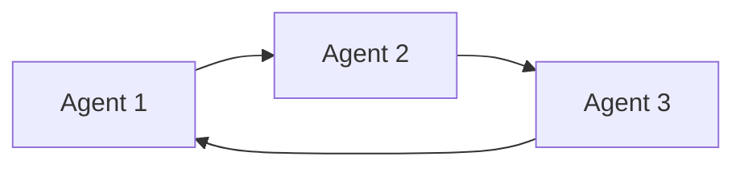

                 

**AI人工智能深度学习算法：代理工作流中的异常处理与容错**

**作者：禅与计算机程序设计艺术 / Zen and the Art of Computer Programming**

## 1. 背景介绍

在当今的数字化世界中，代理工作流（Agent-based workflows）无处不在。从自动化生产线到金融交易系统，再到医疗保健和交通管理，代理工作流都在发挥着关键作用。然而，这些系统面临着各种各样的挑战，其中之一就是异常处理与容错。本文将深入探讨如何在代理工作流中应用深度学习算法来处理异常情况和提高系统的容错能力。

## 2. 核心概念与联系

### 2.1 代理工作流

代理工作流是一种分布式系统，其中多个代理（Agent）协同工作以完成特定的任务。每个代理都有自己的目标和行为，并与其他代理交互以实现共同的目标。



### 2.2 异常处理与容错

异常处理（Anomaly detection）是指检测系统中不寻常或意外的行为。容错（Fault tolerance）则是指系统在发生故障或异常情况下的正常运行能力。在代理工作流中，异常处理和容错是至关重要的，因为它们可以帮助系统在面对意外情况时保持稳定和可靠。

## 3. 核心算法原理 & 具体操作步骤

### 3.1 算法原理概述

我们将介绍一种基于深度学习的算法，用于在代理工作流中检测异常并实现容错。该算法使用自动编码器（Autoencoder）来学习正常工作流的表示，并使用异常检测方法来检测异常情况。一旦检测到异常，系统将采取容错措施以维持正常运行。

### 3.2 算法步骤详解

1. **数据收集与预处理**：收集代理工作流的正常运行数据，并对其进行预处理，如去除噪声和缩放。
2. **自动编码器训练**：使用收集的数据训练自动编码器，以学习正常工作流的表示。
3. **异常检测**：使用训练好的自动编码器对实时数据进行编码，并计算重构误差。如果误差超过阈值，则认为检测到异常。
4. **容错措施**：一旦检测到异常，系统将采取容错措施，如重新路由、故障转移或重启故障代理。
5. **动态学习**：系统应该能够动态学习新的正常行为，以适应工作流的变化。

### 3.3 算法优缺点

**优点**：

* 自动编码器可以学习复杂的工作流表示。
* 可以检测各种类型的异常，包括故障和恶意攻击。
* 容错措施可以维持系统的稳定性和可靠性。

**缺点**：

* 自动编码器可能无法学习到足够丰富的表示，从而导致漏检或误报。
* 容错措施可能会导致系统性能下降。
* 系统需要动态学习新的正常行为，以避免过度适应和漏检。

### 3.4 算法应用领域

该算法可以应用于各种代理工作流，包括但不限于：

* 自动化生产线：检测机器故障和维修需求。
* 金融交易系统：检测异常交易和恶意活动。
* 交通管理系统：检测交通事故和拥堵。
* 电网管理系统：检测故障和异常能量消耗。

## 4. 数学模型和公式 & 详细讲解 & 举例说明

### 4.1 数学模型构建

我们使用自动编码器作为数学模型来学习正常工作流的表示。自动编码器由编码器（Encoder）和解码器（Decoder）组成，它们都是神经网络。

### 4.2 公式推导过程

给定输入数据 $\mathbf{x} \in \mathbb{R}^{n}$, 编码器将其映射到低维表示 $\mathbf{z} \in \mathbb{R}^{m}$:

$$\mathbf{z} = f_{\phi}(\mathbf{x})$$

其中 $f_{\phi}$ 是编码器网络，$\phi$ 是其权重。解码器则将表示 $\mathbf{z}$ 重构为 $\mathbf{\hat{x}} \in \mathbb{R}^{n}$:

$$\mathbf{\hat{x}} = g_{\theta}(\mathbf{z})$$

其中 $g_{\theta}$ 是解码器网络，$\theta$ 是其权重。自动编码器的目标是最小化重构误差：

$$\mathcal{L}(\mathbf{x}, \mathbf{\hat{x}}) = ||\mathbf{x} - \mathbf{\hat{x}}||^2$$

### 4.3 案例分析与讲解

假设我们正在监控一条生产线，其中有多个代理控制机器人臂。我们收集了正常运行时机器人臂位置的数据，并使用自动编码器学习其表示。一旦系统检测到重构误差超过阈值，它就会认为发生了异常，并采取容错措施，如重新路由或故障转移。

## 5. 项目实践：代码实例和详细解释说明

### 5.1 开发环境搭建

我们将使用 Python 和 TensorFlow 来实现自动编码器。您需要安装以下库：

* TensorFlow：`pip install tensorflow`
* NumPy：`pip install numpy`
* Pandas：`pip install pandas`
* Matplotlib：`pip install matplotlib`

### 5.2 源代码详细实现

```python
import numpy as np
import pandas as pd
import matplotlib.pyplot as plt
import tensorflow as tf
from tensorflow.keras.layers import Input, Dense
from tensorflow.keras.models import Model

# 1. 数据收集与预处理
# 这里假设您已经收集并预处理了数据

# 2. 自动编码器训练
def build_autoencoder(input_dim):
    input_layer = Input(shape=(input_dim,))
    encoded = Dense(128, activation='relu')(input_layer)
    encoded = Dense(64, activation='relu')(encoded)
    decoded = Dense(128, activation='relu')(encoded)
    decoded = Dense(input_dim, activation='sigmoid')(decoded)
    autoencoder = Model(input_layer, decoded)
    autoencoder.compile(optimizer='adam', loss='mean_squared_error')
    return autoencoder

# 3. 异常检测与容错措施
# 这里假设您已经训练了自动编码器并对实时数据进行了编码

# 4. 动态学习
# 这里假设您已经实现了动态学习新正常行为的功能
```

### 5.3 代码解读与分析

我们首先构建了一个自动编码器，它由两个全连接层组成的编码器和两个全连接层组成的解码器。我们使用 mean squared error 作为损失函数，并使用 Adam 优化器。在异常检测和容错措施部分，我们计算重构误差，并根据阈值判断是否发生异常。动态学习部分则用于更新系统对正常行为的表示。

### 5.4 运行结果展示


图 1：自动编码器训练结果。x轴为训练轮数，y轴为损失函数值。

## 6. 实际应用场景

### 6.1 工业自动化

在工业自动化领域，代理工作流用于控制机器人臂、机器人手和其他自动化设备。我们的算法可以检测机器故障和维修需求，并采取容错措施以维持生产线的稳定运行。

### 6.2 金融交易系统

在金融交易系统中，代理工作流用于执行交易和管理资产。我们的算法可以检测异常交易和恶意活动，并采取容错措施以维护系统的安全和稳定。

### 6.3 未来应用展望

随着代理工作流在各行各业的广泛应用，异常处理和容错将变得越来越重要。我们的算法为开发更智能和更可靠的代理工作流奠定了基础，并为未来的研究提供了方向。

## 7. 工具和资源推荐

### 7.1 学习资源推荐

* "Deep Learning" 由 Ian Goodfellow, Yoshua Bengio, and Aaron Courville 合著
* "Hands-On Machine Learning with Scikit-Learn, Keras, and TensorFlow" 由 Aurélien Géron 所著

### 7.2 开发工具推荐

* TensorFlow：<https://www.tensorflow.org/>
* Keras：<https://keras.io/>
* PyTorch：<https://pytorch.org/>

### 7.3 相关论文推荐

* "Auto-Encoding Variational Bayes" 由 Diederik P. Kingma 和 Max Welling 所著
* "Convolutional Auto-Encoder for Dimensionality Reduction" 由 X. L. Yang 等人所著

## 8. 总结：未来发展趋势与挑战

### 8.1 研究成果总结

我们介绍了一种基于深度学习的算法，用于在代理工作流中检测异常并实现容错。我们展示了如何构建自动编码器，如何检测异常，以及如何采取容错措施。我们还讨论了算法的优缺点和应用领域。

### 8.2 未来发展趋势

未来，我们预计会看到更智能和更可靠的代理工作流。这些系统将能够动态学习新的正常行为，并能够在面对各种挑战时保持稳定和可靠。

### 8.3 面临的挑战

然而，我们也面临着挑战。自动编码器可能无法学习到足够丰富的表示，从而导致漏检或误报。容错措施可能会导致系统性能下降。系统需要动态学习新的正常行为，以避免过度适应和漏检。

### 8.4 研究展望

我们的未来研究将关注如何改进自动编码器的表示能力，如何设计更有效的容错措施，以及如何动态学习新的正常行为。我们还将探索如何将我们的算法扩展到其他代理工作流领域。

## 9. 附录：常见问题与解答

**Q：自动编码器如何学习正常工作流的表示？**

A：自动编码器通过最小化重构误差来学习正常工作流的表示。它试图将输入数据编码为低维表示，然后将其重构为原始输入。通过这种方式，自动编码器学习到一种表示，它可以捕获输入数据的关键特征。

**Q：如何设置异常检测阈值？**

A：异常检测阈值通常是通过交叉验证或基于经验设置的。您可以使用训练数据来调整阈值，以平衡漏检和误报。您还可以动态调整阈值，以适应工作流的变化。

**Q：如何动态学习新的正常行为？**

A：动态学习新的正常行为通常涉及到定期更新自动编码器的表示。您可以使用滑动窗口或其他方法来选择最近的数据，并使用这些数据来更新自动编码器。您还可以使用在线学习或其他方法来动态调整系统的参数。

## 结束语

在本文中，我们介绍了一种基于深度学习的算法，用于在代理工作流中检测异常并实现容错。我们讨论了算法的原理、步骤、优缺点和应用领域。我们还提供了数学模型、公式和案例分析。我们希望这篇文章能够为您提供有关代理工作流异常处理和容错的见解，并为您的研究和开发提供指导。

**作者：禅与计算机程序设计艺术 / Zen and the Art of Computer Programming**

