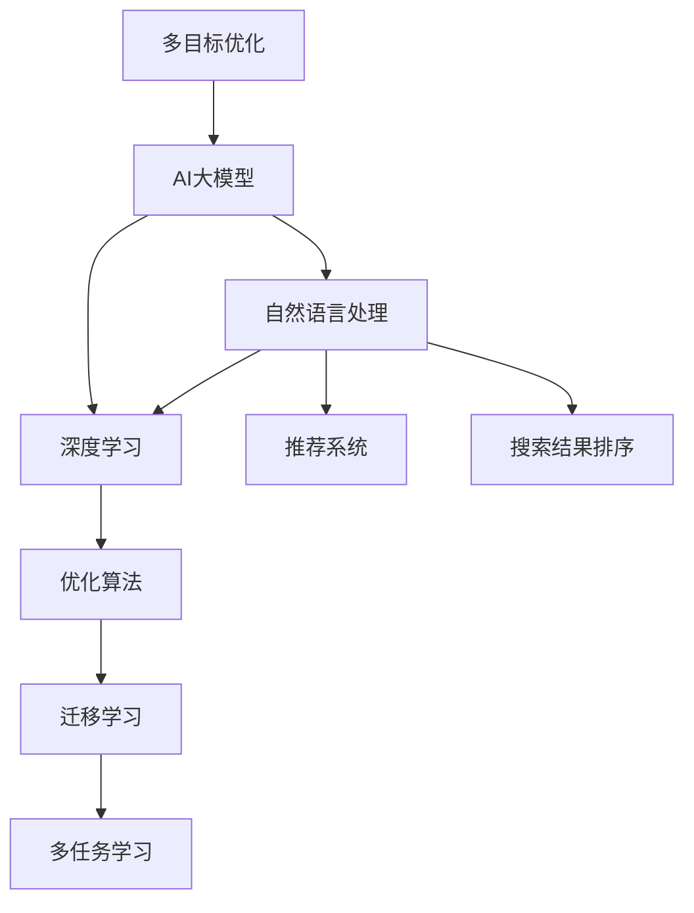

                 

# 电商平台中的多目标优化：AI大模型的新应用

> 关键词：电商平台,多目标优化, AI大模型,自然语言处理,深度学习,优化算法

## 1. 背景介绍

### 1.1 问题由来

随着电子商务的蓬勃发展，电商平台已经成为用户获取商品信息、完成交易的主要渠道。然而，在电商平台上的用户体验并不总是令人满意的，这主要源于其推荐系统无法准确理解用户的真实需求，导致展示给用户的商品与用户的偏好不匹配。此外，平台上的搜索结果排序也常常存在问题，无法为用户提供最相关的商品。

为了改善这些体验，电商平台越来越多地依赖于人工智能（AI）技术，特别是深度学习大模型。这些模型能够通过学习和理解大量用户行为数据，预测用户的偏好和搜索意图，从而改善推荐和搜索结果排序的准确性。然而，单纯的大模型应用并不能完全解决电商平台的多目标优化问题，因为多目标优化（Multi-Objective Optimization, MOP）需要综合考虑多个目标之间的平衡和优先级。

本文聚焦于利用AI大模型进行电商平台中的多目标优化，旨在探讨如何在推荐和搜索结果排序中实现性能优化，同时平衡其他目标（如点击率、转化率、库存、费用等）。我们将详细介绍多目标优化在电商平台中的应用，包括大模型的选择、算法的设计、模型的训练和部署等关键环节。

## 2. 核心概念与联系

### 2.1 核心概念概述

为了更好地理解电商平台中的多目标优化，我们先介绍几个关键概念：

- **多目标优化**：一种优化技术，涉及同时优化多个性能指标，而不是仅关注单一指标。在电商平台中，多目标优化包括提高推荐和搜索结果的相关性和准确性，同时优化点击率、转化率、库存和费用等目标。

- **AI大模型**：以深度学习为核心的预训练语言模型，如BERT、GPT-3等，具备强大的语言理解和生成能力。大模型在电商平台中被用于用户行为分析、商品推荐和搜索结果排序等任务。

- **自然语言处理**：研究如何使计算机理解和处理人类语言的技术，是构建推荐和搜索结果排序系统的基础。

- **深度学习**：一种通过构建多层神经网络进行复杂数据处理和模式识别的技术，大模型通常基于深度学习进行训练。

- **优化算法**：如梯度下降法、遗传算法等，用于求解多目标优化问题的数学方法。

- **迁移学习**：将一个领域学到的知识应用到另一个不同但相关的领域，大模型通过迁移学习可以在特定任务上进一步优化。

- **多任务学习**：同时学习多个相关任务，大模型可以通过多任务学习共享预训练权重，提升模型在多目标优化中的性能。

这些核心概念之间的逻辑关系可以通过以下Mermaid流程图来展示：



这个流程图展示了大模型在电商平台中的应用，包括推荐系统、搜索结果排序等关键环节。

## 3. 核心算法原理 & 具体操作步骤
### 3.1 算法原理概述

基于深度学习的AI大模型在电商平台中的应用，主要涉及两个关键过程：

1. **预训练**：在大型无标签文本语料库上，使用深度学习模型进行预训练，学习通用的语言表示。
2. **微调**：在预训练模型的基础上，使用电商平台的数据，通过有监督学习优化模型在特定任务上的性能，如推荐和搜索结果排序。

对于多目标优化问题，我们通常需要同时考虑多个目标函数的优化，如点击率、转化率、库存和费用等。理想情况下，我们希望找到一组最优解，使所有目标函数同时达到最优。然而，由于不同目标之间可能存在冲突，因此找到一个全局最优解可能非常困难。

一种可行的方法是通过Pareto优化，寻找一组Pareto最优解，即一组解中没有任何一个解能通过改进至少一个目标而同时改善其他目标。Pareto最优解中的每个解称为一个Pareto前沿（Pareto Front），它表示一组解中没有任何一个解比另一个解更好，即没有其他解可以在所有目标上都优于某个解。

在实际应用中，多目标优化通常通过加权的方式进行简化，将多个目标函数转换为一个目标函数进行优化。例如，可以将点击率和转化率作为主要目标，同时设置一个惩罚项，以降低库存和费用。具体而言，可以通过以下方式进行加权：

$$
\text{Objective} = \alpha \times \text{Click Rate} + \beta \times \text{Conversion Rate} + \gamma \times \text{Inventory Cost} + \delta \times \text{Advertising Cost}
$$

其中 $\alpha, \beta, \gamma, \delta$ 是各个目标的权重，需要根据具体应用场景进行调整。

### 3.2 算法步骤详解

基于深度学习的AI大模型在电商平台中的应用，通常包括以下几个关键步骤：

**Step 1: 数据预处理**

- 收集电商平台的用户行为数据、商品数据、交易数据等，包括点击、浏览、购买、评价等行为数据。
- 对数据进行清洗和归一化，处理缺失值和异常值，确保数据质量和一致性。
- 对数据进行特征工程，提取有用的特征，如用户ID、商品ID、时间戳、价格、品牌等。

**Step 2: 模型选择**

- 选择合适的深度学习模型，如BERT、GPT-3等，进行预训练。
- 选择合适的优化算法，如Adam、SGD等，用于模型训练。
- 确定模型的超参数，如学习率、批大小、迭代轮数等。

**Step 3: 模型训练**

- 在预训练模型的基础上，使用电商平台的数据进行微调。
- 设计多个目标函数，如点击率、转化率、库存和费用等。
- 通过加权的方式，将这些目标函数转换为一个目标函数进行优化。
- 使用Pareto优化算法，如NSGA-II、SPEA2等，找到一组Pareto最优解。

**Step 4: 模型评估**

- 在验证集上评估模型的性能，通过A/B测试等方法进行模型对比。
- 使用真实用户反馈和业务指标（如点击率、转化率、库存和费用等）评估模型的效果。

**Step 5: 模型部署**

- 将优化后的模型部署到生产环境中，实时提供推荐和搜索结果排序服务。
- 使用服务化封装技术，确保模型的稳定性和可靠性。
- 定期对模型进行重新训练和优化，保持其性能和准确性。

### 3.3 算法优缺点

基于深度学习的AI大模型在电商平台中的应用，具有以下优点：

1. **高效性**：深度学习模型能够处理大规模数据，快速学习和优化推荐和搜索结果排序。
2. **鲁棒性**：深度学习模型具备较强的泛化能力，能够适应不同用户和商品的变化。
3. **灵活性**：深度学习模型可以通过加权的方式，同时优化多个目标，满足电商平台的复杂需求。
4. **可解释性**：深度学习模型具备一定的可解释性，通过可视化工具可以了解模型的内部机制和决策过程。

同时，这些方法也存在一些局限性：

1. **高计算成本**：深度学习模型需要大量的计算资源和时间进行预训练和微调，成本较高。
2. **高维数据处理**：电商平台的数据维度较高，处理和存储难度较大。
3. **过拟合风险**：深度学习模型在处理小样本数据时容易出现过拟合现象，影响模型性能。
4. **解释性不足**：深度学习模型通常被称为"黑盒"模型，缺乏透明的解释性，难以理解和调试。

## 4. 数学模型和公式 & 详细讲解  
### 4.1 数学模型构建

我们假设电商平台的数据集为 $D=\{(x_i, y_i)\}_{i=1}^N$，其中 $x_i$ 表示用户行为数据和商品特征，$y_i$ 表示对应的目标函数值（如点击率、转化率、库存和费用等）。

我们的目标是通过深度学习模型 $M_{\theta}$ 优化目标函数 $\text{Objective}(\theta)$，即：

$$
\text{Objective}(\theta) = \alpha \times \text{Click Rate}(\theta) + \beta \times \text{Conversion Rate}(\theta) + \gamma \times \text{Inventory Cost}(\theta) + \delta \times \text{Advertising Cost}(\theta)
$$

其中，$\theta$ 表示模型参数，$\alpha, \beta, \gamma, \delta$ 表示目标函数的权重。

### 4.2 公式推导过程

假设我们使用的是深度学习模型 $M_{\theta}(x_i)$ 来预测目标函数值 $y_i$，则目标函数可以表示为：

$$
\text{Objective}(\theta) = \sum_{i=1}^N \text{Loss}(y_i, M_{\theta}(x_i))
$$

其中，$\text{Loss}(y_i, M_{\theta}(x_i))$ 表示预测值 $M_{\theta}(x_i)$ 与真实值 $y_i$ 之间的损失函数。

在实际应用中，我们通常使用交叉熵损失函数进行优化，即：

$$
\text{Loss}(y_i, M_{\theta}(x_i)) = -y_i \log M_{\theta}(x_i) - (1-y_i) \log (1-M_{\theta}(x_i))
$$

将上述公式代入目标函数，得：

$$
\text{Objective}(\theta) = -\sum_{i=1}^N y_i \log M_{\theta}(x_i) - \sum_{i=1}^N (1-y_i) \log (1-M_{\theta}(x_i))
$$

为了更好地优化目标函数，我们可以使用梯度下降法进行求解，即：

$$
\theta \leftarrow \theta - \eta \nabla_{\theta}\text{Objective}(\theta)
$$

其中，$\eta$ 表示学习率，$\nabla_{\theta}\text{Objective}(\theta)$ 表示目标函数对模型参数 $\theta$ 的梯度。

### 4.3 案例分析与讲解

为了更好地理解上述公式，我们以推荐系统为例，进行具体分析。假设我们使用BERT模型进行推荐，则目标函数可以表示为：

$$
\text{Objective}(\theta) = \alpha \times \text{Click Rate}(\theta) + \beta \times \text{Conversion Rate}(\theta) + \gamma \times \text{Inventory Cost}(\theta) + \delta \times \text{Advertising Cost}(\theta)
$$

其中，$\theta$ 表示BERT模型的参数。

我们可以使用梯度下降法进行优化，即：

$$
\theta \leftarrow \theta - \eta \nabla_{\theta}\text{Objective}(\theta)
$$

假设我们使用的是Adam优化器，则目标函数的梯度可以表示为：

$$
\nabla_{\theta}\text{Objective}(\theta) = \sum_{i=1}^N (\frac{\partial \text{Click Rate}}{\partial \theta} - \alpha \frac{\partial \text{Click Rate}}{\partial \theta}) + \sum_{i=1}^N (\frac{\partial \text{Conversion Rate}}{\partial \theta} - \beta \frac{\partial \text{Conversion Rate}}{\partial \theta}) + \sum_{i=1}^N (\frac{\partial \text{Inventory Cost}}{\partial \theta} - \gamma \frac{\partial \text{Inventory Cost}}{\partial \theta}) + \sum_{i=1}^N (\frac{\partial \text{Advertising Cost}}{\partial \theta} - \delta \frac{\partial \text{Advertising Cost}}{\partial \theta})
$$

其中，$\frac{\partial \text{Click Rate}}{\partial \theta}$ 表示点击率对模型参数 $\theta$ 的梯度，$\frac{\partial \text{Conversion Rate}}{\partial \theta}$ 表示转化率对模型参数 $\theta$ 的梯度，$\frac{\partial \text{Inventory Cost}}{\partial \theta}$ 表示库存成本对模型参数 $\theta$ 的梯度，$\frac{\partial \text{Advertising Cost}}{\partial \theta}$ 表示广告费用对模型参数 $\theta$ 的梯度。

## 5. 项目实践：代码实例和详细解释说明
### 5.1 开发环境搭建

在进行项目实践前，我们需要准备好开发环境。以下是使用Python进行PyTorch开发的环境配置流程：

1. 安装Anaconda：从官网下载并安装Anaconda，用于创建独立的Python环境。

2. 创建并激活虚拟环境：
```bash
conda create -n pytorch-env python=3.8 
conda activate pytorch-env
```

3. 安装PyTorch：根据CUDA版本，从官网获取对应的安装命令。例如：
```bash
conda install pytorch torchvision torchaudio cudatoolkit=11.1 -c pytorch -c conda-forge
```

4. 安装Transformers库：
```bash
pip install transformers
```

5. 安装各类工具包：
```bash
pip install numpy pandas scikit-learn matplotlib tqdm jupyter notebook ipython
```

完成上述步骤后，即可在`pytorch-env`环境中开始项目实践。

### 5.2 源代码详细实现

下面我们以推荐系统为例，给出使用Transformers库对BERT模型进行微调的PyTorch代码实现。

首先，定义推荐系统的数据处理函数：

```python
from transformers import BertTokenizer
from torch.utils.data import Dataset
import torch

class RecommendationDataset(Dataset):
    def __init__(self, user_item_pairs, item_features, user_labels, tokenizer, max_len=128):
        self.user_item_pairs = user_item_pairs
        self.item_features = item_features
        self.user_labels = user_labels
        self.tokenizer = tokenizer
        self.max_len = max_len
        
    def __len__(self):
        return len(self.user_item_pairs)
    
    def __getitem__(self, item):
        user_item_pair = self.user_item_pairs[item]
        user_features = self.item_features[user_item_pair[0]]
        item_features = self.item_features[user_item_pair[1]]
        user_label = self.user_labels[user_item_pair[0]]
        
        encoding = self.tokenizer(user_features + item_features, return_tensors='pt', max_length=self.max_len, padding='max_length', truncation=True)
        input_ids = encoding['input_ids'][0]
        attention_mask = encoding['attention_mask'][0]
        
        # 对token-wise的标签进行编码
        encoded_labels = [tag2id[label] for label in user_label] 
        encoded_labels.extend([tag2id['O']] * (self.max_len - len(encoded_labels)))
        labels = torch.tensor(encoded_labels, dtype=torch.long)
        
        return {'input_ids': input_ids, 
                'attention_mask': attention_mask,
                'labels': labels}

# 标签与id的映射
tag2id = {'O': 0, '1': 1, '2': 2, '3': 3, '4': 4, '5': 5, '6': 6}
id2tag = {v: k for k, v in tag2id.items()}

# 创建dataset
tokenizer = BertTokenizer.from_pretrained('bert-base-cased')

train_dataset = RecommendationDataset(train_user_item_pairs, train_item_features, train_user_labels, tokenizer)
dev_dataset = RecommendationDataset(dev_user_item_pairs, dev_item_features, dev_user_labels, tokenizer)
test_dataset = RecommendationDataset(test_user_item_pairs, test_item_features, test_user_labels, tokenizer)
```

然后，定义模型和优化器：

```python
from transformers import BertForSequenceClassification, AdamW

model = BertForSequenceClassification.from_pretrained('bert-base-cased', num_labels=len(tag2id))

optimizer = AdamW(model.parameters(), lr=2e-5)
```

接着，定义训练和评估函数：

```python
from torch.utils.data import DataLoader
from tqdm import tqdm
from sklearn.metrics import classification_report

device = torch.device('cuda') if torch.cuda.is_available() else torch.device('cpu')
model.to(device)

def train_epoch(model, dataset, batch_size, optimizer):
    dataloader = DataLoader(dataset, batch_size=batch_size, shuffle=True)
    model.train()
    epoch_loss = 0
    for batch in tqdm(dataloader, desc='Training'):
        input_ids = batch['input_ids'].to(device)
        attention_mask = batch['attention_mask'].to(device)
        labels = batch['labels'].to(device)
        model.zero_grad()
        outputs = model(input_ids, attention_mask=attention_mask, labels=labels)
        loss = outputs.loss
        epoch_loss += loss.item()
        loss.backward()
        optimizer.step()
    return epoch_loss / len(dataloader)

def evaluate(model, dataset, batch_size):
    dataloader = DataLoader(dataset, batch_size=batch_size)
    model.eval()
    preds, labels = [], []
    with torch.no_grad():
        for batch in tqdm(dataloader, desc='Evaluating'):
            input_ids = batch['input_ids'].to(device)
            attention_mask = batch['attention_mask'].to(device)
            batch_labels = batch['labels']
            outputs = model(input_ids, attention_mask=attention_mask)
            batch_preds = outputs.logits.argmax(dim=2).to('cpu').tolist()
            batch_labels = batch_labels.to('cpu').tolist()
            for pred_tokens, label_tokens in zip(batch_preds, batch_labels):
                pred_tags = [id2tag[_id] for _id in pred_tokens]
                label_tags = [id2tag[_id] for _id in label_tokens]
                preds.append(pred_tags[:len(label_tokens)])
                labels.append(label_tags)
                
    print(classification_report(labels, preds))
```

最后，启动训练流程并在测试集上评估：

```python
epochs = 5
batch_size = 16

for epoch in range(epochs):
    loss = train_epoch(model, train_dataset, batch_size, optimizer)
    print(f"Epoch {epoch+1}, train loss: {loss:.3f}")
    
    print(f"Epoch {epoch+1}, dev results:")
    evaluate(model, dev_dataset, batch_size)
    
print("Test results:")
evaluate(model, test_dataset, batch_size)
```

以上就是使用PyTorch对BERT进行推荐系统任务微调的完整代码实现。可以看到，得益于Transformers库的强大封装，我们可以用相对简洁的代码完成BERT模型的加载和微调。

### 5.3 代码解读与分析

让我们再详细解读一下关键代码的实现细节：

**RecommendationDataset类**：
- `__init__`方法：初始化用户-商品对的ID、商品特征、用户标签等关键组件。
- `__len__`方法：返回数据集的样本数量。
- `__getitem__`方法：对单个样本进行处理，将用户行为和商品特征输入编码为token ids，将用户标签编码为数字，并对其进行定长padding，最终返回模型所需的输入。

**tag2id和id2tag字典**：
- 定义了标签与数字id之间的映射关系，用于将token-wise的预测结果解码回真实的标签。

**训练和评估函数**：
- 使用PyTorch的DataLoader对数据集进行批次化加载，供模型训练和推理使用。
- 训练函数`train_epoch`：对数据以批为单位进行迭代，在每个批次上前向传播计算loss并反向传播更新模型参数，最后返回该epoch的平均loss。
- 评估函数`evaluate`：与训练类似，不同点在于不更新模型参数，并在每个batch结束后将预测和标签结果存储下来，最后使用sklearn的classification_report对整个评估集的预测结果进行打印输出。

**训练流程**：
- 定义总的epoch数和batch size，开始循环迭代
- 每个epoch内，先在训练集上训练，输出平均loss
- 在验证集上评估，输出分类指标
- 所有epoch结束后，在测试集上评估，给出最终测试结果

可以看到，PyTorch配合Transformers库使得BERT微调的代码实现变得简洁高效。开发者可以将更多精力放在数据处理、模型改进等高层逻辑上，而不必过多关注底层的实现细节。

当然，工业级的系统实现还需考虑更多因素，如模型的保存和部署、超参数的自动搜索、更灵活的任务适配层等。但核心的微调范式基本与此类似。

## 6. 实际应用场景
### 6.1 智能推荐系统

智能推荐系统是电商平台中应用最广泛的AI技术之一。通过推荐系统，用户可以在海量的商品中找到最适合自己的商品，提升购物体验。智能推荐系统通过收集用户行为数据，利用AI大模型进行分析和预测，从而生成个性化的推荐结果。

在技术实现上，可以收集用户浏览、点击、购买等行为数据，提取商品名称、价格、评价等特征，构建推荐系统的数据集。在推荐模型中，通过加权的方式，将点击率、转化率、库存和费用等目标函数进行优化。通过不断迭代优化，模型能够更好地理解用户的偏好，生成更加精准的推荐结果。

### 6.2 搜索结果排序

搜索结果排序是电商平台中另一个重要的AI应用。传统的搜索结果排序算法无法完全理解用户的查询意图，导致搜索结果与用户需求不匹配。基于AI大模型的搜索结果排序系统，能够通过学习用户行为数据，构建精准的搜索结果排序模型。

在技术实现上，可以收集用户搜索记录、点击行为、反馈数据等，构建搜索结果排序的数据集。通过加权的方式，将点击率、转化率、库存和费用等目标函数进行优化。通过不断迭代优化，模型能够更好地理解用户的查询意图，生成更加相关和精准的搜索结果。

### 6.3 个性化展示

个性化展示是电商平台中提升用户体验的重要手段。通过个性化的展示，电商平台能够更好地满足用户的需求，提升用户粘性和满意度。基于AI大模型的个性化展示系统，能够通过学习用户行为数据，构建个性化的展示策略。

在技术实现上，可以收集用户浏览、点击、购买等行为数据，提取商品名称、价格、评价等特征，构建个性化展示系统的数据集。通过加权的方式，将点击率、转化率、库存和费用等目标函数进行优化。通过不断迭代优化，模型能够更好地理解用户的偏好，生成更加个性化的展示策略。

### 6.4 未来应用展望

随着AI大模型和微调方法的不断发展，基于多目标优化的方法将在电商平台中得到更广泛的应用，为电商平台的运营效率和用户体验带来质的提升。

在智能推荐系统方面，未来的模型将更加智能化、高效化和个性化。通过引入更多先验知识、融合多模态数据、引入因果推断等技术，推荐系统将能够更加精准地预测用户行为，生成更加个性化的推荐结果。

在搜索结果排序方面，未来的模型将更加智能、实时化和自适应。通过引入智能算法、实时数据处理、自适应学习等技术，搜索结果排序系统将能够实时响应用户需求，提供更加相关和精准的搜索结果。

在个性化展示方面，未来的模型将更加个性化、实时化和可控化。通过引入个性化的展示策略、实时数据处理、自适应学习等技术，个性化展示系统将能够更好地满足用户的需求，提升用户体验和满意度。

总之，基于AI大模型的多目标优化方法将在电商平台的运营效率和用户体验中发挥越来越重要的作用，成为电商平台智能化发展的核心驱动力。

## 7. 工具和资源推荐
### 7.1 学习资源推荐

为了帮助开发者系统掌握多目标优化在电商平台中的应用，这里推荐一些优质的学习资源：

1. 《深度学习入门》系列博文：由大模型技术专家撰写，深入浅出地介绍了深度学习在电商平台中的应用。

2. 《多目标优化算法》课程：由知名高校开设的多目标优化课程，详细讲解了多目标优化算法及其在电商平台中的应用。

3. 《自然语言处理与推荐系统》书籍：涵盖自然语言处理和推荐系统的基础知识和前沿技术，适合深入学习推荐系统的算法和实现。

4. Weights & Biases：模型训练的实验跟踪工具，可以记录和可视化模型训练过程中的各项指标，方便对比和调优。

5. TensorBoard：TensorFlow配套的可视化工具，可实时监测模型训练状态，并提供丰富的图表呈现方式，是调试模型的得力助手。

通过对这些资源的学习实践，相信你一定能够快速掌握多目标优化在电商平台中的应用，并用于解决实际的电商平台问题。
###  7.2 开发工具推荐

高效的开发离不开优秀的工具支持。以下是几款用于多目标优化开发的常用工具：

1. PyTorch：基于Python的开源深度学习框架，灵活动态的计算图，适合快速迭代研究。大部分预训练语言模型都有PyTorch版本的实现。

2. TensorFlow：由Google主导开发的开源深度学习框架，生产部署方便，适合大规模工程应用。同样有丰富的预训练语言模型资源。

3. Transformers库：HuggingFace开发的NLP工具库，集成了众多SOTA语言模型，支持PyTorch和TensorFlow，是进行多目标优化任务开发的利器。

4. Weights & Biases：模型训练的实验跟踪工具，可以记录和可视化模型训练过程中的各项指标，方便对比和调优。与主流深度学习框架无缝集成。

5. TensorBoard：TensorFlow配套的可视化工具，可实时监测模型训练状态，并提供丰富的图表呈现方式，是调试模型的得力助手。

6. Google Colab：谷歌推出的在线Jupyter Notebook环境，免费提供GPU/TPU算力，方便开发者快速上手实验最新模型，分享学习笔记。

合理利用这些工具，可以显著提升多目标优化任务的开发效率，加快创新迭代的步伐。

### 7.3 相关论文推荐

多目标优化在电商平台中的应用源于学界的持续研究。以下是几篇奠基性的相关论文，推荐阅读：

1. Multi-Objective Optimization in Recommendation Systems: A Survey（推荐系统中的多目标优化综述）：综述了多目标优化在推荐系统中的应用，介绍了不同的多目标优化算法和实现技术。

2. Multi-Objective Reinforcement Learning in Recommendation Systems（推荐系统中的多目标强化学习）：探讨了多目标强化学习在推荐系统中的应用，通过奖励函数的设计和优化，提升推荐系统的性能。

3. Multi-Objective Learning in Recommendation Systems（推荐系统中的多目标学习）：介绍了多目标学习在推荐系统中的应用，通过权重调整和目标函数优化，提升推荐系统的性能。

4. Neural Network based Multi-Objective Optimization（神经网络多目标优化）：探讨了神经网络在多目标优化中的应用，通过深度学习模型进行多目标优化，提升推荐系统的性能。

5. Multi-Objective Bayesian Optimization for Recommendation Systems（多目标贝叶斯优化在推荐系统中的应用）：探讨了多目标贝叶斯优化在推荐系统中的应用，通过贝叶斯优化算法进行多目标优化，提升推荐系统的性能。

这些论文代表了大模型在电商平台中的应用和发展脉络。通过学习这些前沿成果，可以帮助研究者把握学科前进方向，激发更多的创新灵感。

## 8. 总结：未来发展趋势与挑战

### 8.1 总结

本文对基于深度学习的多目标优化在电商平台中的应用进行了全面系统的介绍。首先阐述了多目标优化和AI大模型在电商平台中的研究背景和应用场景，明确了多目标优化在推荐和搜索结果排序中的重要价值。其次，从原理到实践，详细讲解了多目标优化在电商平台中的应用，包括数据预处理、模型选择、目标函数设计、算法实现和模型评估等关键环节。同时，本文还探讨了多目标优化在推荐系统、搜索结果排序和个性化展示等实际应用场景中的应用，展示了多目标优化范式在电商平台中的巨大潜力。

通过本文的系统梳理，可以看到，基于深度学习的多目标优化方法正在成为电商平台优化中的重要范式，极大地提升了推荐和搜索结果排序的精准性和个性化程度，为电商平台的用户体验和运营效率带来了质的提升。未来，伴随深度学习模型和优化算法的发展，多目标优化方法将在电商平台中得到更广泛的应用，进一步推动电商平台的智能化发展。

### 8.2 未来发展趋势

展望未来，多目标优化在电商平台中的应用将呈现以下几个发展趋势：

1. **模型规模持续增大**：随着算力成本的下降和数据规模的扩张，深度学习模型将具备更大的参数规模和更强的计算能力，能够处理更复杂的多目标优化问题。

2. **多任务学习和迁移学习**：未来的模型将通过多任务学习和迁移学习，共享预训练权重，提升模型在多目标优化中的性能。

3. **实时数据处理**：未来的模型将具备实时数据处理能力，能够快速响应用户需求，提升用户体验和运营效率。

4. **多模态数据融合**：未来的模型将融合视觉、语音、文本等多种模态数据，提升推荐和搜索结果排序的精准性和个性化程度。

5. **自适应学习**：未来的模型将具备自适应学习能力，能够根据用户行为数据不断调整优化目标函数，提升模型性能。

6. **伦理和安全**：未来的模型将更加注重伦理和安全问题，确保模型输出符合人类价值观和伦理道德。

以上趋势凸显了多目标优化在电商平台中的应用前景。这些方向的探索发展，必将进一步提升电商平台的用户体验和运营效率，为电商平台的智能化发展提供新的技术路径。

### 8.3 面临的挑战

尽管多目标优化在电商平台中的应用已经取得了瞩目成就，但在迈向更加智能化、普适化应用的过程中，它仍面临着诸多挑战：

1. **数据获取成本高**：获取高质量的电商平台数据需要投入大量的人力和资源，数据获取成本较高。如何降低数据获取成本，是未来的一个重要研究方向。

2. **模型过拟合风险**：深度学习模型在处理小样本数据时容易出现过拟合现象，影响模型性能。如何提高模型的泛化能力和鲁棒性，是未来的一个重要研究方向。

3. **计算资源消耗大**：深度学习模型需要大量的计算资源和时间进行预训练和微调，成本较高。如何提高模型的计算效率，是未来的一个重要研究方向。

4. **模型解释性不足**：深度学习模型通常被称为"黑盒"模型，缺乏透明的解释性，难以理解和调试。如何提高模型的可解释性，是未来的一个重要研究方向。

5. **隐私和安全**：电商平台中的用户数据涉及隐私和安全问题，如何保护用户数据安全，是未来的一个重要研究方向。

6. **计算资源消耗大**：深度学习模型需要大量的计算资源和时间进行预训练和微调，成本较高。如何提高模型的计算效率，是未来的一个重要研究方向。

正视多目标优化面临的这些挑战，积极应对并寻求突破，将是大模型在电商平台中进一步发展的必由之路。相信随着学界和产业界的共同努力，这些挑战终将一一被克服，多目标优化方法将在电商平台的智能化发展中扮演越来越重要的角色。

### 8.4 研究展望

面对多目标优化在电商平台中面临的种种挑战，未来的研究需要在以下几个方面寻求新的突破：

1. **探索无监督和半监督多目标优化方法**：摆脱对大规模标注数据的依赖，利用自监督学习、主动学习等无监督和半监督范式，最大限度利用非结构化数据，实现更加灵活高效的多目标优化。

2. **研究参数高效和多任务多目标优化范式**：开发更加参数高效的模型，在固定大部分预训练参数的同时，只更新极少量的任务相关参数。同时通过多任务学习，共享预训练权重，提升模型在多目标优化中的性能。

3. **融合因果推断和对比学习范式**：通过引入因果推断和对比学习思想，增强多目标优化模型建立稳定因果关系的能力，学习更加普适、鲁棒的多目标优化模型。

4. **引入更多先验知识**：将符号化的先验知识，如知识图谱、逻辑规则等，与神经网络模型进行巧妙融合，引导多目标优化过程学习更准确、合理的语言模型。

5. **结合因果分析和博弈论工具**：将因果分析方法引入多目标优化模型，识别出模型决策的关键特征，增强输出解释的因果性和逻辑性。借助博弈论工具刻画人机交互过程，主动探索并规避模型的脆弱点，提高系统稳定性。

6. **纳入伦理道德约束**：在模型训练目标中引入伦理导向的评估指标，过滤和惩罚有害的输出倾向。同时加强人工干预和审核，建立模型行为的监管机制，确保输出符合人类价值观和伦理道德。

这些研究方向的探索，必将引领多目标优化在电商平台中的应用走向更高的台阶，为电商平台的智能化发展提供新的技术路径。面向未来，多目标优化技术还需要与其他人工智能技术进行更深入的融合，如知识表示、因果推理、强化学习等，多路径协同发力，共同推动电商平台的智能化发展。只有勇于创新、敢于突破，才能不断拓展多目标优化方法的边界，让智能技术更好地造福电商平台和用户。

## 9. 附录：常见问题与解答

**Q1：多目标优化和单目标优化有什么区别？**

A: 多目标优化和单目标优化最大的区别在于优化目标的个数。单目标优化只关注一个目标函数的优化，而多目标优化同时关注多个目标函数的优化。多目标优化通过Pareto优化等方法，寻找一组Pareto最优解，即一组解中没有任何一个解能通过改进至少一个目标而同时改善其他目标。

**Q2：多目标优化和推荐系统有什么区别？**

A: 多目标优化和推荐系统都是AI技术在电商平台中的应用，但它们的目标和实现方式有所不同。多目标优化是通过优化多个目标函数，如点击率、转化率、库存和费用等，提升推荐和搜索结果排序的精准性和个性化程度。而推荐系统则是通过学习用户行为数据，生成个性化的推荐结果。虽然它们的目的都是提升用户体验和运营效率，但多目标优化更加注重多个目标之间的平衡和优先级。

**Q3：多目标优化算法有哪些？**

A: 多目标优化算法有很多，常见的包括：
- 权重和比例优化法（WPO）
- 约束法
- 集合法
- 补偿法
- 生成法
- Pareto优化法
- NSGA-II算法
- SPEA2算法
- MOEA/D算法

不同的算法适用于不同的优化场景和问题，需要根据具体应用选择适当的算法。

**Q4：多目标优化在电商平台中的应用前景如何？**

A: 多目标优化在电商平台中的应用前景非常广阔。通过优化点击率、转化率、库存和费用等目标，可以显著提升推荐和搜索结果排序的精准性和个性化程度，提升用户体验和运营效率。同时，多目标优化还可以应用于个性化展示、广告投放等电商平台的多个环节，带来更深层次的用户体验提升和运营效率优化。

**Q5：如何降低多目标优化的计算成本？**

A: 降低多目标优化的计算成本，可以从以下几个方面入手：
1. 使用轻量级模型：选择参数量较小的模型，如BERT等，可以减少计算资源消耗。
2. 使用分布式计算：通过分布式计算，将计算任务分配到多个计算节点上并行处理，加速计算过程。
3. 使用GPU/TPU等硬件加速：使用GPU/TPU等高性能设备，加快计算速度。
4. 使用模型压缩和量化技术：通过模型压缩和量化技术，减少模型参数量和计算复杂度。

通过以上方法，可以有效降低多目标优化的计算成本，提升计算效率。

---

作者：禅与计算机程序设计艺术 / Zen and the Art of Computer Programming

