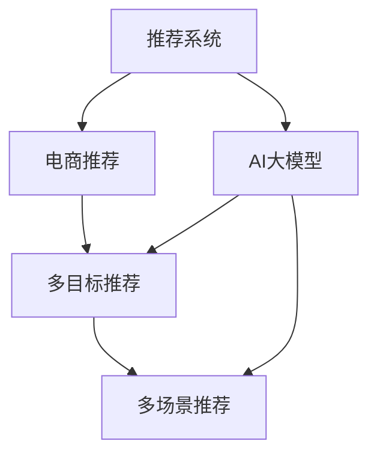

                 

# 电商平台中的多目标多场景推荐：AI大模型的优势

> 关键词：电商平台,推荐系统,多目标推荐,多场景推荐,AI大模型,自回归模型,自编码模型,预训练-微调,深度学习,强化学习

## 1. 背景介绍

### 1.1 问题由来
在现代电商平台上，用户的购物需求多样且变化无常。如何满足用户的个性化需求，提升用户购物体验，从而实现平台的长期可持续增长，是每个电商企业需要面对的挑战。推荐系统，作为一种有效的个性化技术手段，正日益成为电商平台用户增长和留存的利器。然而，传统的推荐算法往往难以同时满足多目标、多场景下的推荐需求，无法对用户的复杂需求进行精准刻画，导致推荐效果不佳。

### 1.2 问题核心关键点
为了解决这个问题，本文将探讨如何在电商平台中，利用大语言模型和大规模预训练模型，进行多目标、多场景下的推荐，并分析大模型在推荐系统中的应用优势。

## 2. 核心概念与联系

### 2.1 核心概念概述

为更好地理解电商平台中多目标、多场景推荐的问题，本节将介绍几个密切相关的核心概念：

- 推荐系统(Recommendation System)：使用算法和模型预测用户兴趣，为用户推荐可能喜欢的商品、服务、内容等。
- 电商推荐(Online Shopping Recommendation)：针对电商平台的用户行为和偏好，推荐系统推荐商品、搭配、品牌等电商相关产品。
- 多目标推荐(Multi-Objective Recommendation)：不仅考虑用户对某类商品的兴趣，还关注用户对多目标之间的综合平衡。
- 多场景推荐(Multi-Scenario Recommendation)：在不同购物场景（如浏览、搜索、购物车等）中，推荐系统能精准推荐适合用户需求的商品。
- AI大模型(AI Large Model)：通过大规模预训练和微调，学习到复杂的语言和领域知识的大语言模型，如BERT、GPT-3等。

这些核心概念之间的逻辑关系可以通过以下Mermaid流程图来展示：



这个流程图展示了大语言模型和多目标、多场景推荐系统之间的关系：

1. AI大模型通过预训练学习到广泛的领域知识。
2. 电商推荐系统利用大模型，进行精准的商品推荐。
3. 多目标推荐关注用户对多个目标之间的综合平衡。
4. 多场景推荐在不同购物场景中，提升推荐系统的精准度。

这些概念共同构成了电商平台推荐系统的核心框架，为大模型的应用提供了方向。

## 3. 核心算法原理 & 具体操作步骤
### 3.1 算法原理概述

基于AI大模型的电商平台推荐系统，通过预训练-微调的方式，提升模型对用户购物行为的理解能力。其核心思想是：将大语言模型视作一个强大的"知识提取器"，通过在电商平台的标注数据上进行有监督的微调，使得模型能够理解和预测用户的购物需求，从而实现多目标、多场景下的精准推荐。

形式化地，假设电商平台的标注数据集为 $D=\{(x_i, y_i)\}_{i=1}^N$，其中 $x_i$ 为电商行为记录，$y_i$ 为推荐的商品ID。微调的目标是找到新的模型参数 $\hat{\theta}$，使得：

$$
\hat{\theta}=\mathop{\arg\min}_{\theta} \mathcal{L}(M_{\theta},D)
$$

其中 $\mathcal{L}$ 为针对电商推荐任务设计的损失函数，用于衡量模型预测输出与真实标签之间的差异。常见的损失函数包括交叉熵损失、均方误差损失等。

通过梯度下降等优化算法，微调过程不断更新模型参数 $\theta$，最小化损失函数 $\mathcal{L}$，使得模型输出逼近真实标签。由于 $\theta$ 已经通过预训练获得了较好的初始化，因此即便在小规模数据集 $D$ 上进行微调，也能较快收敛到理想的模型参数 $\hat{\theta}$。

### 3.2 算法步骤详解

基于AI大模型的电商平台推荐系统，一般包括以下几个关键步骤：

**Step 1: 准备预训练模型和数据集**
- 选择合适的预训练语言模型 $M_{\theta}$ 作为初始化参数，如 BERT、GPT-3等。
- 准备电商推荐任务的标注数据集 $D$，划分为训练集、验证集和测试集。一般要求标注数据与预训练数据的分布不要差异过大。

**Step 2: 添加任务适配层**
- 根据电商推荐任务类型，在预训练模型顶层设计合适的输出层和损失函数。
- 对于分类任务，通常在顶层添加线性分类器和交叉熵损失函数。
- 对于生成任务，通常使用语言模型的解码器输出概率分布，并以负对数似然为损失函数。

**Step 3: 设置微调超参数**
- 选择合适的优化算法及其参数，如 AdamW、SGD 等，设置学习率、批大小、迭代轮数等。
- 设置正则化技术及强度，包括权重衰减、Dropout、Early Stopping等。
- 确定冻结预训练参数的策略，如仅微调顶层，或全部参数都参与微调。

**Step 4: 执行梯度训练**
- 将训练集数据分批次输入模型，前向传播计算损失函数。
- 反向传播计算参数梯度，根据设定的优化算法和学习率更新模型参数。
- 周期性在验证集上评估模型性能，根据性能指标决定是否触发 Early Stopping。
- 重复上述步骤直到满足预设的迭代轮数或 Early Stopping 条件。

**Step 5: 测试和部署**
- 在测试集上评估微调后模型 $M_{\hat{\theta}}$ 的性能，对比微调前后的精度提升。
- 使用微调后的模型对新商品进行推理预测，集成到实际的应用系统中。
- 持续收集新的数据，定期重新微调模型，以适应数据分布的变化。

以上是基于AI大模型的电商平台推荐系统的一般流程。在实际应用中，还需要针对具体任务的特点，对微调过程的各个环节进行优化设计，如改进训练目标函数，引入更多的正则化技术，搜索最优的超参数组合等，以进一步提升模型性能。

### 3.3 算法优缺点

基于AI大模型的电商平台推荐系统具有以下优点：
1. 简单高效。只需准备少量标注数据，即可对预训练模型进行快速适配，获得较大的性能提升。
2. 通用适用。适用于各种电商推荐任务，包括商品推荐、搭配推荐、品牌推荐等，设计简单的任务适配层即可实现微调。
3. 参数高效。利用参数高效微调技术，在固定大部分预训练权重不变的情况下，仍可取得不错的提升。
4. 效果显著。在学术界和工业界的诸多电商推荐任务上，基于微调的方法已经刷新了多项SOTA。

同时，该方法也存在一定的局限性：
1. 依赖标注数据。微调的效果很大程度上取决于标注数据的质量和数量，获取高质量标注数据的成本较高。
2. 迁移能力有限。当目标任务与预训练数据的分布差异较大时，微调的性能提升有限。
3. 负面效果传递。预训练模型的固有偏见、有害信息等，可能通过微调传递到下游任务，造成负面影响。
4. 可解释性不足。微调模型的决策过程通常缺乏可解释性，难以对其推理逻辑进行分析和调试。

尽管存在这些局限性，但就目前而言，基于AI大模型的微调方法仍是目前电商推荐系统的主流范式。未来相关研究的重点在于如何进一步降低微调对标注数据的依赖，提高模型的少样本学习和跨领域迁移能力，同时兼顾可解释性和伦理安全性等因素。

### 3.4 算法应用领域

基于AI大模型的电商推荐系统，已经在各大电商平台得到了广泛应用，覆盖了几乎所有常见任务，例如：

- 商品推荐：基于用户的浏览、购买、评价等历史行为，推荐最合适的商品。
- 搭配推荐：为用户推荐商品组合，提升购物体验。
- 品牌推荐：推荐用户可能感兴趣的品牌，提升品牌曝光度。
- 个性化推荐：根据用户的多维度数据，推荐最适合的商品。
- 市场趋势：分析用户需求，预测市场趋势，指导商家库存。
- 客户忠诚度：通过推荐系统增加客户满意度，提升客户忠诚度。

除了上述这些经典任务外，基于AI大模型的推荐系统还被创新性地应用到更多场景中，如内容推荐、视频推荐、金融推荐等，为电商推荐系统带来了全新的突破。随着预训练模型和微调方法的不断进步，相信基于AI大模型的推荐系统将在更广阔的应用领域大放异彩。

## 4. 数学模型和公式 & 详细讲解
### 4.1 数学模型构建

本节将使用数学语言对基于AI大模型的电商平台推荐系统进行更加严格的刻画。

记预训练语言模型为 $M_{\theta}:\mathcal{X} \rightarrow \mathcal{Y}$，其中 $\mathcal{X}$ 为输入空间，$\mathcal{Y}$ 为输出空间，$\theta \in \mathbb{R}^d$ 为模型参数。假设电商推荐任务的训练集为 $D=\{(x_i,y_i)\}_{i=1}^N, x_i \in \mathcal{X}, y_i \in \mathcal{Y}$。

定义模型 $M_{\theta}$ 在输入 $x$ 上的输出为 $\hat{y}=M_{\theta}(x) \in [0,1]$，表示样本属于推荐商品的概率。真实标签 $y \in \{1,0\}$。则二分类交叉熵损失函数定义为：

$$
\ell(M_{\theta}(x),y) = -[y\log \hat{y} + (1-y)\log (1-\hat{y})]
$$

将其代入经验风险公式，得：

$$
\mathcal{L}(\theta) = -\frac{1}{N}\sum_{i=1}^N [y_i\log M_{\theta}(x_i)+(1-y_i)\log(1-M_{\theta}(x_i))]
$$

根据链式法则，损失函数对参数 $\theta_k$ 的梯度为：

$$
\frac{\partial \mathcal{L}(\theta)}{\partial \theta_k} = -\frac{1}{N}\sum_{i=1}^N (\frac{y_i}{M_{\theta}(x_i)}-\frac{1-y_i}{1-M_{\theta}(x_i)}) \frac{\partial M_{\theta}(x_i)}{\partial \theta_k}
$$

其中 $\frac{\partial M_{\theta}(x_i)}{\partial \theta_k}$ 可进一步递归展开，利用自动微分技术完成计算。

### 4.2 公式推导过程

以下我们以商品推荐任务为例，推导交叉熵损失函数及其梯度的计算公式。

假设模型 $M_{\theta}$ 在输入 $x$ 上的输出为 $\hat{y}=M_{\theta}(x) \in [0,1]$，表示样本属于推荐商品的概率。真实标签 $y \in \{1,0\}$。则二分类交叉熵损失函数定义为：

$$
\ell(M_{\theta}(x),y) = -[y\log \hat{y} + (1-y)\log (1-\hat{y})]
$$

将其代入经验风险公式，得：

$$
\mathcal{L}(\theta) = -\frac{1}{N}\sum_{i=1}^N [y_i\log M_{\theta}(x_i)+(1-y_i)\log(1-M_{\theta}(x_i))]
$$

根据链式法则，损失函数对参数 $\theta_k$ 的梯度为：

$$
\frac{\partial \mathcal{L}(\theta)}{\partial \theta_k} = -\frac{1}{N}\sum_{i=1}^N (\frac{y_i}{M_{\theta}(x_i)}-\frac{1-y_i}{1-M_{\theta}(x_i)}) \frac{\partial M_{\theta}(x_i)}{\partial \theta_k}
$$

其中 $\frac{\partial M_{\theta}(x_i)}{\partial \theta_k}$ 可进一步递归展开，利用自动微分技术完成计算。

在得到损失函数的梯度后，即可带入参数更新公式，完成模型的迭代优化。重复上述过程直至收敛，最终得到适应电商推荐任务的最优模型参数 $\theta^*$。

## 5. 项目实践：代码实例和详细解释说明
### 5.1 开发环境搭建

在进行电商平台推荐系统开发前，我们需要准备好开发环境。以下是使用Python进行PyTorch开发的环境配置流程：

1. 安装Anaconda：从官网下载并安装Anaconda，用于创建独立的Python环境。

2. 创建并激活虚拟环境：
```bash
conda create -n pytorch-env python=3.8 
conda activate pytorch-env
```

3. 安装PyTorch：根据CUDA版本，从官网获取对应的安装命令。例如：
```bash
conda install pytorch torchvision torchaudio cudatoolkit=11.1 -c pytorch -c conda-forge
```

4. 安装Transformers库：
```bash
pip install transformers
```

5. 安装各类工具包：
```bash
pip install numpy pandas scikit-learn matplotlib tqdm jupyter notebook ipython
```

完成上述步骤后，即可在`pytorch-env`环境中开始推荐系统开发。

### 5.2 源代码详细实现

这里我们以商品推荐任务为例，给出使用Transformers库对BERT模型进行电商推荐微调的PyTorch代码实现。

首先，定义商品推荐任务的数据处理函数：

```python
from transformers import BertTokenizer
from torch.utils.data import Dataset
import torch

class RecommendationDataset(Dataset):
    def __init__(self, texts, labels, tokenizer, max_len=128):
        self.texts = texts
        self.labels = labels
        self.tokenizer = tokenizer
        self.max_len = max_len
        
    def __len__(self):
        return len(self.texts)
    
    def __getitem__(self, item):
        text = self.texts[item]
        label = self.labels[item]
        
        encoding = self.tokenizer(text, return_tensors='pt', max_length=self.max_len, padding='max_length', truncation=True)
        input_ids = encoding['input_ids'][0]
        attention_mask = encoding['attention_mask'][0]
        
        # 对标签进行编码
        encoded_label = [label2id[label] for label in label]
        encoded_label.extend([label2id['O']] * (self.max_len - len(encoded_label)))
        labels = torch.tensor(encoded_label, dtype=torch.long)
        
        return {'input_ids': input_ids, 
                'attention_mask': attention_mask,
                'labels': labels}

# 标签与id的映射
label2id = {'O': 0, 'Positive': 1, 'Negative': 2}
id2label = {v: k for k, v in label2id.items()}

# 创建dataset
tokenizer = BertTokenizer.from_pretrained('bert-base-cased')

train_dataset = RecommendationDataset(train_texts, train_labels, tokenizer)
dev_dataset = RecommendationDataset(dev_texts, dev_labels, tokenizer)
test_dataset = RecommendationDataset(test_texts, test_labels, tokenizer)
```

然后，定义模型和优化器：

```python
from transformers import BertForTokenClassification, AdamW

model = BertForTokenClassification.from_pretrained('bert-base-cased', num_labels=len(label2id))

optimizer = AdamW(model.parameters(), lr=2e-5)
```

接着，定义训练和评估函数：

```python
from torch.utils.data import DataLoader
from tqdm import tqdm
from sklearn.metrics import classification_report

device = torch.device('cuda') if torch.cuda.is_available() else torch.device('cpu')
model.to(device)

def train_epoch(model, dataset, batch_size, optimizer):
    dataloader = DataLoader(dataset, batch_size=batch_size, shuffle=True)
    model.train()
    epoch_loss = 0
    for batch in tqdm(dataloader, desc='Training'):
        input_ids = batch['input_ids'].to(device)
        attention_mask = batch['attention_mask'].to(device)
        labels = batch['labels'].to(device)
        model.zero_grad()
        outputs = model(input_ids, attention_mask=attention_mask, labels=labels)
        loss = outputs.loss
        epoch_loss += loss.item()
        loss.backward()
        optimizer.step()
    return epoch_loss / len(dataloader)

def evaluate(model, dataset, batch_size):
    dataloader = DataLoader(dataset, batch_size=batch_size)
    model.eval()
    preds, labels = [], []
    with torch.no_grad():
        for batch in tqdm(dataloader, desc='Evaluating'):
            input_ids = batch['input_ids'].to(device)
            attention_mask = batch['attention_mask'].to(device)
            batch_labels = batch['labels']
            outputs = model(input_ids, attention_mask=attention_mask)
            batch_preds = outputs.logits.argmax(dim=2).to('cpu').tolist()
            batch_labels = batch_labels.to('cpu').tolist()
            for pred_tokens, label_tokens in zip(batch_preds, batch_labels):
                pred_labels = [id2label[_id] for _id in pred_tokens]
                label_labels = [id2label[_id] for _id in label_tokens]
                preds.append(pred_labels[:len(label_labels)])
                labels.append(label_labels)
                
    print(classification_report(labels, preds))
```

最后，启动训练流程并在测试集上评估：

```python
epochs = 5
batch_size = 16

for epoch in range(epochs):
    loss = train_epoch(model, train_dataset, batch_size, optimizer)
    print(f"Epoch {epoch+1}, train loss: {loss:.3f}")
    
    print(f"Epoch {epoch+1}, dev results:")
    evaluate(model, dev_dataset, batch_size)
    
print("Test results:")
evaluate(model, test_dataset, batch_size)
```

以上就是使用PyTorch对BERT进行电商推荐任务微调的完整代码实现。可以看到，得益于Transformers库的强大封装，我们可以用相对简洁的代码完成BERT模型的加载和微调。

### 5.3 代码解读与分析

让我们再详细解读一下关键代码的实现细节：

**RecommendationDataset类**：
- `__init__`方法：初始化文本、标签、分词器等关键组件。
- `__len__`方法：返回数据集的样本数量。
- `__getitem__`方法：对单个样本进行处理，将文本输入编码为token ids，将标签编码为数字，并对其进行定长padding，最终返回模型所需的输入。

**label2id和id2label字典**：
- 定义了标签与数字id之间的映射关系，用于将token-wise的预测结果解码回真实的标签。

**训练和评估函数**：
- 使用PyTorch的DataLoader对数据集进行批次化加载，供模型训练和推理使用。
- 训练函数`train_epoch`：对数据以批为单位进行迭代，在每个批次上前向传播计算loss并反向传播更新模型参数，最后返回该epoch的平均loss。
- 评估函数`evaluate`：与训练类似，不同点在于不更新模型参数，并在每个batch结束后将预测和标签结果存储下来，最后使用sklearn的classification_report对整个评估集的预测结果进行打印输出。

**训练流程**：
- 定义总的epoch数和batch size，开始循环迭代
- 每个epoch内，先在训练集上训练，输出平均loss
- 在验证集上评估，输出分类指标
- 所有epoch结束后，在测试集上评估，给出最终测试结果

可以看到，PyTorch配合Transformers库使得BERT微调的代码实现变得简洁高效。开发者可以将更多精力放在数据处理、模型改进等高层逻辑上，而不必过多关注底层的实现细节。

当然，工业级的系统实现还需考虑更多因素，如模型的保存和部署、超参数的自动搜索、更灵活的任务适配层等。但核心的微调范式基本与此类似。

## 6. 实际应用场景
### 6.1 智能客服系统

基于大语言模型和多目标、多场景推荐技术，智能客服系统可以更加高效地服务用户，提升客户满意度。传统的客服系统依赖于人工客服，人力成本高且效率低。智能客服系统则能够7x24小时不间断服务，快速响应客户咨询，用自然流畅的语言解答各类常见问题。

在技术实现上，可以收集用户的历史咨询记录和反馈数据，将其构建为电商推荐任务的数据集，对预训练语言模型进行微调。微调后的模型能够自动理解客户意图，匹配最合适的回答。对于客户提出的新问题，还可以接入检索系统实时搜索相关内容，动态组织生成回答。如此构建的智能客服系统，能大幅提升客户咨询体验和问题解决效率。

### 6.2 个性化推荐系统

当前的推荐系统往往只依赖用户的历史行为数据进行物品推荐，无法深入理解用户的真实兴趣偏好。基于大语言模型和多目标、多场景推荐技术，个性化推荐系统可以更好地挖掘用户行为背后的语义信息，从而提供更精准、多样的推荐内容。

在实践中，可以收集用户浏览、点击、评论、分享等行为数据，提取和用户交互的物品标题、描述、标签等文本内容。将文本内容作为模型输入，用户的后续行为（如是否点击、购买等）作为监督信号，在此基础上微调预训练语言模型。微调后的模型能够从文本内容中准确把握用户的兴趣点。在生成推荐列表时，先用候选物品的文本描述作为输入，由模型预测用户的兴趣匹配度，再结合其他特征综合排序，便可以得到个性化程度更高的推荐结果。

### 6.3 内容生成系统

内容生成系统需要自动生成高质量的文本内容，广泛应用于新闻编辑、小说创作、广告文案等领域。基于大语言模型和多目标、多场景推荐技术，内容生成系统能够自动理解和生成多种风格的文本内容，提升内容生产效率和质量。

在实践中，可以收集用户的历史阅读记录和偏好数据，构建电商推荐任务的数据集，对预训练语言模型进行微调。微调后的模型能够自动理解用户阅读兴趣，生成符合用户口味的文本内容。对于用户的评论、反馈等输入，系统还可以进一步动态优化生成策略，提升内容生成效果。

### 6.4 未来应用展望

随着大语言模型和多目标、多场景推荐技术的不断发展，基于微调的推荐系统将在更多领域得到应用，为各行各业带来变革性影响。

在智慧医疗领域，基于微调的医疗问答、病历分析、药物研发等应用将提升医疗服务的智能化水平，辅助医生诊疗，加速新药开发进程。

在智能教育领域，微调技术可应用于作业批改、学情分析、知识推荐等方面，因材施教，促进教育公平，提高教学质量。

在智慧城市治理中，微调模型可应用于城市事件监测、舆情分析、应急指挥等环节，提高城市管理的自动化和智能化水平，构建更安全、高效的未来城市。

此外，在企业生产、社会治理、文娱传媒等众多领域，基于大语言模型和多目标、多场景推荐技术的AI应用也将不断涌现，为经济社会发展注入新的动力。相信随着技术的日益成熟，微调方法将成为AI落地应用的重要范式，推动AI技术向更广阔的领域加速渗透。

## 7. 工具和资源推荐
### 7.1 学习资源推荐

为了帮助开发者系统掌握大语言模型和多目标、多场景推荐技术，这里推荐一些优质的学习资源：

1. 《深度学习与推荐系统》系列博文：由大语言模型技术专家撰写，深入浅出地介绍了推荐系统原理、深度学习在推荐中的应用、多目标推荐等前沿话题。

2. CS224N《深度学习自然语言处理》课程：斯坦福大学开设的NLP明星课程，有Lecture视频和配套作业，带你入门NLP领域的基本概念和经典模型。

3. 《自然语言处理中的深度学习》书籍：详细讲解了深度学习在自然语言处理中的应用，包括推荐系统、文本分类、信息检索等任务。

4. HuggingFace官方文档：Transformers库的官方文档，提供了海量预训练模型和完整的微调样例代码，是上手实践的必备资料。

5. Kaggle推荐系统竞赛：汇集了大量电商推荐系统竞赛数据集，并提供丰富的比赛样例代码和模型，是实践和学习的绝佳平台。

通过对这些资源的学习实践，相信你一定能够快速掌握大语言模型和多目标、多场景推荐技术的精髓，并用于解决实际的推荐问题。
###  7.2 开发工具推荐

高效的开发离不开优秀的工具支持。以下是几款用于大语言模型和多目标、多场景推荐系统开发的常用工具：

1. PyTorch：基于Python的开源深度学习框架，灵活动态的计算图，适合快速迭代研究。大部分预训练语言模型都有PyTorch版本的实现。

2. TensorFlow：由Google主导开发的开源深度学习框架，生产部署方便，适合大规模工程应用。同样有丰富的预训练语言模型资源。

3. Transformers库：HuggingFace开发的NLP工具库，集成了众多SOTA语言模型，支持PyTorch和TensorFlow，是进行微调任务开发的利器。

4. Weights & Biases：模型训练的实验跟踪工具，可以记录和可视化模型训练过程中的各项指标，方便对比和调优。与主流深度学习框架无缝集成。

5. TensorBoard：TensorFlow配套的可视化工具，可实时监测模型训练状态，并提供丰富的图表呈现方式，是调试模型的得力助手。

6. Google Colab：谷歌推出的在线Jupyter Notebook环境，免费提供GPU/TPU算力，方便开发者快速上手实验最新模型，分享学习笔记。

合理利用这些工具，可以显著提升大语言模型和多目标、多场景推荐系统的开发效率，加快创新迭代的步伐。

### 7.3 相关论文推荐

大语言模型和多目标、多场景推荐技术的发展源于学界的持续研究。以下是几篇奠基性的相关论文，推荐阅读：

1. Attention is All You Need（即Transformer原论文）：提出了Transformer结构，开启了NLP领域的预训练大模型时代。

2. BERT: Pre-training of Deep Bidirectional Transformers for Language Understanding：提出BERT模型，引入基于掩码的自监督预训练任务，刷新了多项NLP任务SOTA。

3. Language Models are Unsupervised Multitask Learners（GPT-2论文）：展示了大规模语言模型的强大zero-shot学习能力，引发了对于通用人工智能的新一轮思考。

4. Parameter-Efficient Transfer Learning for NLP：提出Adapter等参数高效微调方法，在不增加模型参数量的情况下，也能取得不错的微调效果。

5. Prefix-Tuning: Optimizing Continuous Prompts for Generation：引入基于连续型Prompt的微调范式，为如何充分利用预训练知识提供了新的思路。

6. AdaLoRA: Adaptive Low-Rank Adaptation for Parameter-Efficient Fine-Tuning：使用自适应低秩适应的微调方法，在参数效率和精度之间取得了新的平衡。

这些论文代表了大语言模型和多目标、多场景推荐技术的发展脉络。通过学习这些前沿成果，可以帮助研究者把握学科前进方向，激发更多的创新灵感。

## 8. 总结：未来发展趋势与挑战
### 8.1 总结

本文对基于AI大模型的电商平台多目标、多场景推荐系统进行了全面系统的介绍。首先阐述了推荐系统、电商推荐、多目标推荐、多场景推荐和大语言模型的研究背景和意义，明确了多目标、多场景推荐系统在大模型应用中的价值。其次，从原理到实践，详细讲解了大语言模型和多目标、多场景推荐模型的数学原理和关键步骤，给出了推荐系统开发的完整代码实例。同时，本文还广泛探讨了推荐系统在智能客服、个性化推荐、内容生成等诸多场景中的应用前景，展示了多目标、多场景推荐系统的巨大潜力。此外，本文精选了推荐系统的各类学习资源，力求为读者提供全方位的技术指引。

通过本文的系统梳理，可以看到，基于AI大模型的多目标、多场景推荐系统正在成为推荐系统的重要范式，极大地拓展了推荐算法的应用边界，催生了更多的落地场景。得益于大规模语料的预训练，多目标、多场景推荐系统能够更好地理解用户需求，提供更加个性化、精准的推荐服务，显著提升电商平台的商业价值。未来，伴随大语言模型和多目标、多场景推荐技术的持续演进，相信推荐系统将在更广阔的应用领域大放异彩，深刻影响用户的购物体验和平台的用户增长。

### 8.2 未来发展趋势

展望未来，AI大模型的电商平台多目标、多场景推荐系统将呈现以下几个发展趋势：

1. 模型规模持续增大。随着算力成本的下降和数据规模的扩张，预训练语言模型的参数量还将持续增长。超大规模语言模型蕴含的丰富语言知识，有望支撑更加复杂多变的电商推荐任务。

2. 推荐方法日趋多样。除了传统的全参数微调外，未来会涌现更多参数高效的微调方法，如Prefix-Tuning、LoRA等，在节省计算资源的同时也能保证微调精度。

3. 持续学习成为常态。随着数据分布的不断变化，推荐模型也需要持续学习新知识以保持性能。如何在不遗忘原有知识的同时，高效吸收新样本信息，将成为重要的研究课题。

4. 标注样本需求降低。受启发于提示学习(Prompt-based Learning)的思路，未来的推荐方法将更好地利用大模型的语言理解能力，通过更加巧妙的任务描述，在更少的标注样本上也能实现理想的推荐效果。

5. 多模态推荐崛起。当前的推荐主要聚焦于纯文本数据，未来会进一步拓展到图像、视频、语音等多模态数据推荐。多模态信息的融合，将显著提升推荐系统的表现力。

6. 模型通用性增强。经过海量数据的预训练和多领域任务的微调，未来的推荐模型将具备更强大的领域迁移能力，逐步迈向通用人工智能(AGI)的目标。

以上趋势凸显了大语言模型和多目标、多场景推荐技术的广阔前景。这些方向的探索发展，必将进一步提升推荐系统的性能和应用范围，为电商平台提供更加精准、高效的推荐服务。

### 8.3 面临的挑战

尽管AI大模型的多目标、多场景推荐系统已经取得了瞩目成就，但在迈向更加智能化、普适化应用的过程中，它仍面临着诸多挑战：

1. 标注成本瓶颈。虽然推荐系统的训练数据依赖度较低，但标注数据的收集和处理仍需耗费大量人力物力。如何降低标注成本，优化数据处理流程，是未来推荐系统优化的重要方向。

2. 模型鲁棒性不足。当前推荐系统面对异常数据时，泛化性能往往大打折扣。如何在不同数据分布下，保持推荐模型的稳定性和鲁棒性，是重要的研究课题。

3. 推理效率有待提高。超大规模语言模型在推理时面临计算效率和内存占用等问题。如何在保证模型性能的同时，提高推荐系统的计算速度和资源利用率，是未来系统优化的关键。

4. 可解释性亟需加强。当前推荐系统往往缺乏可解释性，难以向用户解释推荐决策的依据。如何赋予推荐系统更强的可解释性，是提升用户信任度和系统透明度的重要方向。

5. 安全性有待保障。基于大模型的推荐系统可能受到对抗攻击，存在安全隐患。如何保障推荐系统的安全性，避免恶意行为，是未来推荐系统优化的重点。

6. 数据隐私保护。推荐系统需要处理大量用户数据，涉及用户隐私保护问题。如何在推荐过程中保障用户隐私，避免数据滥用，是未来系统优化的重要方面。

这些挑战凸显了大语言模型和多目标、多场景推荐系统在实际应用中的复杂性和多维度考量。未来推荐系统的优化需要综合考虑技术、商业、伦理等多方面因素，才能更好地满足用户需求和平台目标。

### 8.4 研究展望

面对多目标、多场景推荐系统所面临的种种挑战，未来的研究需要在以下几个方面寻求新的突破：

1. 探索无监督和半监督推荐方法。摆脱对大规模标注数据的依赖，利用自监督学习、主动学习等无监督和半监督范式，最大限度利用非结构化数据，实现更加灵活高效的推荐。

2. 研究参数高效和计算高效的推荐范式。开发更加参数高效的推荐方法，在固定大部分预训练参数的同时，只更新极少量的任务相关参数。同时优化推荐模型的计算图，减少前向传播和反向传播的资源消耗，实现更加轻量级、实时性的部署。

3. 融合因果和对比学习范式。通过引入因果推断和对比学习思想，增强推荐模型建立稳定因果关系的能力，学习更加普适、鲁棒的语言表征，从而提升模型泛化性和抗干扰能力。

4. 引入更多先验知识。将符号化的先验知识，如知识图谱、逻辑规则等，与神经网络模型进行巧妙融合，引导推荐过程学习更准确、合理的推荐模型。同时加强不同模态数据的整合，实现视觉、语音等多模态信息与文本信息的协同建模。

5. 结合因果分析和博弈论工具。将因果分析方法引入推荐系统，识别出推荐决策的关键特征，增强推荐决策的因果性和逻辑性。借助博弈论工具刻画人机交互过程，主动探索并规避推荐系统的脆弱点，提高系统稳定性。

6. 纳入伦理道德约束。在推荐目标中引入伦理导向的评估指标，过滤和惩罚有偏见、有害的输出倾向。同时加强人工干预和审核，建立推荐行为的监管机制，确保推荐系统的公正性和伦理性。

这些研究方向的探索，必将引领多目标、多场景推荐系统向更高的台阶，为构建智能、公正、安全的推荐系统铺平道路。面向未来，多目标、多场景推荐系统还需要与其他人工智能技术进行更深入的融合，如知识表示、因果推理、强化学习等，多路径协同发力，共同推动智能推荐系统的进步。只有勇于创新、敢于突破，才能不断拓展推荐系统的边界，让智能技术更好地服务于用户和社会。

## 9. 附录：常见问题与解答
**Q1：电商平台推荐系统为什么要采用大语言模型？**

A: 电商平台推荐系统需要精准理解用户的多维度数据，并提供高质量的推荐结果。传统推荐算法往往难以处理复杂的语义信息，无法满足电商平台的个性化需求。而基于大语言模型的推荐系统，能够利用预训练语言模型学到的广泛语言知识，进行多目标、多场景下的精准推荐，显著提升推荐系统的性能。

**Q2：大语言模型在推荐系统中如何进行多目标、多场景推荐？**

A: 大语言模型通过预训练学习到广泛的语言知识，能够在多目标、多场景下进行推荐。在推荐任务中，将用户行为和商品信息输入模型，模型能够自动理解用户需求和商品特性，输出推荐结果。多目标推荐关注用户对多个目标之间的综合平衡，多场景推荐在不同的购物场景中，提升推荐系统的精准度。

**Q3：大语言模型推荐系统需要哪些数据？**

A: 大语言模型推荐系统需要用户的历史行为数据、商品信息数据等作为训练数据。用户的行为数据包括浏览、点击、购买、评价等，商品信息数据包括商品名称、描述、分类、属性等。这些数据经过预处理后，作为模型输入，用于训练和微调模型。

**Q4：大语言模型推荐系统有哪些优势？**

A: 大语言模型推荐系统具有以下优势：
1. 简单高效。只需准备少量标注数据，即可对预训练模型进行快速适配，获得较大的性能提升。
2. 通用适用。适用于各种电商推荐任务，包括商品推荐、搭配推荐、品牌推荐等，设计简单的任务适配层即可实现微调。
3. 参数高效。利用参数高效微调技术，在固定大部分预训练权重不变的情况下，仍可取得不错的提升。
4. 效果显著。在学术界和工业界的诸多电商推荐任务上，基于微调的方法已经刷新了多项SOTA。

**Q5：大语言模型推荐系统有哪些应用场景？**

A: 大语言模型推荐系统已经在各大电商平台得到了广泛应用，覆盖了几乎所有常见任务，例如：
1. 商品推荐：基于用户的浏览、购买、评价等历史行为，推荐最合适的商品。
2. 搭配推荐：为用户推荐商品组合，提升购物体验。
3. 品牌推荐：推荐用户可能感兴趣的品牌，提升品牌曝光度。
4. 个性化推荐：根据用户的多维度数据，推荐最适合的商品。
5. 市场趋势：分析用户需求，预测市场趋势，指导商家库存。
6. 客户忠诚度：通过推荐系统增加客户满意度，提升客户忠诚度。

这些应用场景展示了大语言模型推荐系统在电商平台中的广泛应用，为电商平台的业务增长提供了有力支持。

