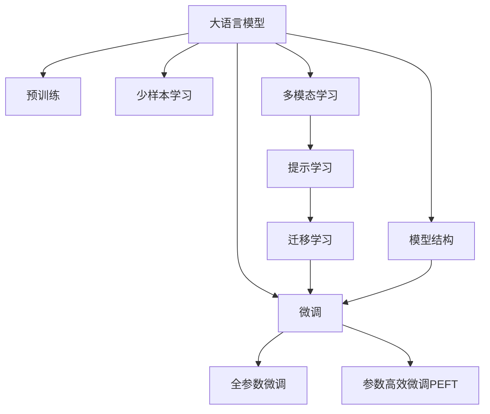

                 

# 电商平台中的智能问答系统：大模型的创新应用

> 关键词：电商平台,智能问答系统,大模型,自然语言处理,NLP

## 1. 背景介绍

### 1.1 问题由来
随着电商平台的快速增长，用户通过智能问答系统进行查询和互动的需求日益增长。传统的基于规则或模板的问答系统往往难以处理用户意图复杂、语言多样、领域多样的问题。大模型在自然语言处理(NLP)领域展现了强大的语言理解和生成能力，成为智能问答系统的重要支撑。

当前，大模型在电商问答系统中的应用已初现端倪，但相关的研究和实践尚不充分。本文将系统介绍大模型在电商问答系统中的应用原理、关键技术和实施方案，展示大模型如何助力电商平台提升客户体验和业务价值。

### 1.2 问题核心关键点
大模型在电商问答系统中的创新应用，核心在于：
- 通过预训练学习通用语言知识，提升问答系统的泛化能力和精度。
- 利用微调技术针对特定领域和任务进行优化，提升系统针对性和鲁棒性。
- 结合多模态信息，通过融合图片、视频、商品描述等多种信息，增强问答系统的语境理解和推理能力。
- 应用少样本学习和转移学习技术，以较小的标注数据量取得最佳效果。
- 采用参数高效微调方法，减少微调过程的计算资源消耗。
- 引入提示学习技术，优化模型输出的自然流畅度和一致性。

### 1.3 问题研究意义
电商问答系统的智能化和人性化应用，对于提升电商平台的用户体验、转化率、客户满意度等指标具有重要意义。大模型的创新应用，不仅可以快速响应用户问题，提供高质量的解答，还可以为电商平台带来更丰富的用户互动和个性化推荐服务。

具体而言，大模型在电商问答系统中的作用包括：
- 快速处理海量用户查询，提升响应速度和效率。
- 处理复杂多样的问题类型，满足不同用户的需求。
- 结合产品信息、用户行为等多模态数据，提供更全面的回答。
- 增强系统的上下文理解能力，提供更贴合用户上下文的情境回答。
- 通过实时学习新知识，保持系统的持续优化和更新。

## 2. 核心概念与联系

### 2.1 核心概念概述

为更好地理解大模型在电商问答系统中的应用，本节将介绍几个密切相关的核心概念：

- 大语言模型(Large Language Model, LLM)：如GPT、BERT等基于Transformer架构的预训练语言模型，通过在大规模无标签文本数据上预训练，学习到丰富的语言知识和表示能力。
- 预训练(Pre-training)：指在大规模无标签文本语料上进行自监督学习，训练出通用语言模型，提升模型的泛化能力。
- 微调(Fine-tuning)：在大规模预训练语言模型的基础上，针对特定任务进行有监督学习优化，提升模型的任务适配能力。
- 迁移学习(Transfer Learning)：利用预训练语言模型在某一领域或任务上的知识，通过微调等方式，应用于新的任务或领域，实现知识迁移。
- 少样本学习(Few-shot Learning)：在只有少量标注样本的情况下，模型能够快速学习新任务，提升模型适应新任务的能力。
- 多模态学习(Multimodal Learning)：结合文本、图像、视频等多种模态信息，增强模型的语境理解和推理能力。
- 提示学习(Prompt Learning)：通过在输入中设计提示模板，引导模型进行特定的推理或生成，优化模型输出。
- 参数高效微调(Parameter-Efficient Fine-Tuning, PEFT)：在微调过程中，只更新少量的模型参数，以提高微调效率，避免过拟合。

这些概念之间的逻辑关系可以通过以下Mermaid流程图来展示：



这个流程图展示了大语言模型的核心概念及其之间的关系：

1. 大语言模型通过预训练获得基础能力。
2. 微调是对预训练模型进行任务特定的优化，可以分为全参数微调和参数高效微调。
3. 少样本学习是一种在不增加标注数据量的情况下，快速学习新任务的方法。
4. 多模态学习结合了文本、图像、视频等多种信息，增强了模型的上下文理解能力。
5. 提示学习通过输入模板引导模型推理，减少了微调过程的计算消耗。
6. 迁移学习通过预训练-微调过程，实现知识在不同任务之间的迁移。

这些概念共同构成了大语言模型在电商问答系统中的应用框架，使其能够高效、准确地处理用户查询，提供高质量的问答服务。

## 3. 核心算法原理 & 具体操作步骤
### 3.1 算法原理概述

大模型在电商问答系统中的应用，本质上是通过预训练和微调两个阶段进行知识获取和任务适配的。其核心思想是：利用大语言模型的泛化能力，在大规模预训练语料上学习到通用的语言知识和表示能力，然后针对电商平台的具体需求和场景，通过微调技术对模型进行特定任务的优化。

形式化地，假设大语言模型为 $M_{\theta}$，其中 $\theta$ 为预训练得到的模型参数。给定电商平台的问答数据集 $D=\{(x_i, y_i)\}_{i=1}^N$，其中 $x_i$ 为问题，$y_i$ 为答案或参考链接，$y_i$ 为模型的预测输出。微调的目标是找到新的模型参数 $\hat{\theta}$，使得：

$$
\hat{\theta}=\mathop{\arg\min}_{\theta} \mathcal{L}(M_{\theta},D)
$$

其中 $\mathcal{L}$ 为针对电商问答任务设计的损失函数，用于衡量模型预测输出与真实标签之间的差异。常见的损失函数包括交叉熵损失、均方误差损失等。

通过梯度下降等优化算法，微调过程不断更新模型参数 $\theta$，最小化损失函数 $\mathcal{L}$，使得模型输出逼近真实标签。由于 $\theta$ 已经通过预训练获得了较好的初始化，因此即便在电商平台的问答数据集 $D$ 上微调，也能较快收敛到理想的模型参数 $\hat{\theta}$。

### 3.2 算法步骤详解

大模型在电商问答系统中的微调流程一般包括以下几个关键步骤：

**Step 1: 准备预训练模型和数据集**
- 选择合适的预训练语言模型 $M_{\theta}$ 作为初始化参数，如 BERT、GPT 等。
- 准备电商平台的问答数据集 $D$，划分为训练集、验证集和测试集。一般要求标注数据与预训练数据的分布不要差异过大。

**Step 2: 添加任务适配层**
- 根据电商平台的问答任务类型，在预训练模型顶层设计合适的输出层和损失函数。
- 对于分类任务，通常在顶层添加线性分类器和交叉熵损失函数。
- 对于生成任务，通常使用语言模型的解码器输出概率分布，并以负对数似然为损失函数。

**Step 3: 设置微调超参数**
- 选择合适的优化算法及其参数，如 AdamW、SGD 等，设置学习率、批大小、迭代轮数等。
- 设置正则化技术及强度，包括权重衰减、Dropout、Early Stopping 等。
- 确定冻结预训练参数的策略，如仅微调顶层，或全部参数都参与微调。

**Step 4: 执行梯度训练**
- 将训练集数据分批次输入模型，前向传播计算损失函数。
- 反向传播计算参数梯度，根据设定的优化算法和学习率更新模型参数。
- 周期性在验证集上评估模型性能，根据性能指标决定是否触发 Early Stopping。
- 重复上述步骤直到满足预设的迭代轮数或 Early Stopping 条件。

**Step 5: 测试和部署**
- 在测试集上评估微调后模型 $M_{\hat{\theta}}$ 的性能，对比微调前后的精度提升。
- 使用微调后的模型对新样本进行推理预测，集成到实际的电商问答系统。
- 持续收集新的问答数据，定期重新微调模型，以适应数据分布的变化。

以上是使用大模型进行电商问答系统微调的一般流程。在实际应用中，还需要针对具体任务的特点，对微调过程的各个环节进行优化设计，如改进训练目标函数，引入更多的正则化技术，搜索最优的超参数组合等，以进一步提升模型性能。

### 3.3 算法优缺点

大模型在电商问答系统中的应用，具有以下优点：
1. 快速响应：大模型具有强大的语言理解和生成能力，可以实时处理海量用户查询，提升响应速度。
2. 高精度：预训练和微调相结合，模型泛化能力更强，对于多样化和复杂的问题，也能给出高质量的回答。
3. 适应性强：大模型具备跨领域迁移能力，可以迅速适应不同领域的电商问答任务。
4. 少样本学习：在大模型基础上进行微调，可以在少量标注数据下取得较好的效果，降低标注成本。
5. 多模态融合：结合图片、视频等多模态信息，提升对商品和场景的理解能力，提供更丰富的回答内容。

同时，大模型在电商问答系统中的应用，也存在以下局限性：
1. 过拟合风险：由于大模型参数量巨大，可能面临过拟合问题，需要谨慎处理。
2. 计算资源消耗大：大模型微调通常需要较大的计算资源，需要高效的优化算法和分布式训练策略。
3. 模型可解释性不足：大模型通常是一个黑盒系统，难以解释其内部决策逻辑，可能会影响用户信任。
4. 动态知识更新：电商平台的业务和产品经常变化，需要模型具有实时学习和适应的能力。

尽管存在这些局限性，但大模型在电商问答系统中的应用，已经取得了显著的成效，正在逐步成为电商问答系统的核心技术。未来，随着大模型的不断演进和优化，相信其应用效果将更加出色。

### 3.4 算法应用领域

大模型在电商问答系统中的应用，已经在以下领域取得显著成果：

- **商品推荐**：利用电商问答数据，通过微调大模型学习用户查询意图和商品特征，实现个性化的商品推荐。
- **客户服务**：通过电商平台中的智能问答系统，快速响应用户问题，提供个性化的客户服务。
- **市场分析**：分析用户对于商品和服务的问答数据，获取市场趋势和用户偏好，指导产品设计和市场策略。
- **用户行为预测**：通过问答数据学习用户行为模式，预测用户未来的购买意向和行为，优化营销策略。
- **用户教育**：通过问答系统提供商品使用和保养知识，提升用户对商品的认知和使用体验。

除了上述这些经典应用外，大模型在电商问答系统中的应用还在不断拓展，未来将有更多创新应用出现。

## 4. 数学模型和公式 & 详细讲解  
### 4.1 数学模型构建

本节将使用数学语言对大模型在电商问答系统中的应用过程进行更加严格的刻画。

记电商平台的问答数据集为 $D=\{(x_i,y_i)\}_{i=1}^N$，其中 $x_i$ 为问题，$y_i$ 为答案或参考链接。假设预训练语言模型为 $M_{\theta}$，其中 $\theta$ 为预训练得到的模型参数。

定义模型 $M_{\theta}$ 在输入 $x$ 上的输出为 $\hat{y}=M_{\theta}(x)$，则电商问答任务的损失函数定义为：

$$
\mathcal{L}(\theta) = -\frac{1}{N}\sum_{i=1}^N \ell(M_{\theta}(x_i),y_i)
$$

其中 $\ell$ 为针对电商问答任务设计的损失函数，用于衡量模型预测输出与真实标签之间的差异。常见的损失函数包括交叉熵损失、均方误差损失等。

根据上述定义，电商问答任务的微调目标是最小化损失函数 $\mathcal{L}(\theta)$，即找到最优参数：

$$
\theta^* = \mathop{\arg\min}_{\theta} \mathcal{L}(\theta)
$$

在实践中，我们通常使用基于梯度的优化算法（如SGD、Adam等）来近似求解上述最优化问题。设 $\eta$ 为学习率，$\lambda$ 为正则化系数，则参数的更新公式为：

$$
\theta \leftarrow \theta - \eta \nabla_{\theta}\mathcal{L}(\theta) - \eta\lambda\theta
$$

其中 $\nabla_{\theta}\mathcal{L}(\theta)$ 为损失函数对参数 $\theta$ 的梯度，可通过反向传播算法高效计算。

### 4.2 公式推导过程

以下我们以分类任务为例，推导交叉熵损失函数及其梯度的计算公式。

假设模型 $M_{\theta}$ 在输入 $x$ 上的输出为 $\hat{y}=M_{\theta}(x)$，表示样本属于正类的概率。真实标签 $y \in \{0,1\}$。则二分类交叉熵损失函数定义为：

$$
\ell(M_{\theta}(x),y) = -[y\log \hat{y} + (1-y)\log (1-\hat{y})]
$$

将其代入经验风险公式，得：

$$
\mathcal{L}(\theta) = -\frac{1}{N}\sum_{i=1}^N [y_i\log M_{\theta}(x_i)+(1-y_i)\log(1-M_{\theta}(x_i))]
$$

根据链式法则，损失函数对参数 $\theta_k$ 的梯度为：

$$
\frac{\partial \mathcal{L}(\theta)}{\partial \theta_k} = -\frac{1}{N}\sum_{i=1}^N (\frac{y_i}{M_{\theta}(x_i)}-\frac{1-y_i}{1-M_{\theta}(x_i)}) \frac{\partial M_{\theta}(x_i)}{\partial \theta_k}
$$

其中 $\frac{\partial M_{\theta}(x_i)}{\partial \theta_k}$ 可进一步递归展开，利用自动微分技术完成计算。

在得到损失函数的梯度后，即可带入参数更新公式，完成模型的迭代优化。重复上述过程直至收敛，最终得到适应电商问答任务的最优模型参数 $\theta^*$。

## 5. 项目实践：代码实例和详细解释说明
### 5.1 开发环境搭建

在进行电商问答系统微调实践前，我们需要准备好开发环境。以下是使用Python进行PyTorch开发的环境配置流程：

1. 安装Anaconda：从官网下载并安装Anaconda，用于创建独立的Python环境。

2. 创建并激活虚拟环境：
```bash
conda create -n pytorch-env python=3.8 
conda activate pytorch-env
```

3. 安装PyTorch：根据CUDA版本，从官网获取对应的安装命令。例如：
```bash
conda install pytorch torchvision torchaudio cudatoolkit=11.1 -c pytorch -c conda-forge
```

4. 安装Transformers库：
```bash
pip install transformers
```

5. 安装各类工具包：
```bash
pip install numpy pandas scikit-learn matplotlib tqdm jupyter notebook ipython
```

完成上述步骤后，即可在`pytorch-env`环境中开始微调实践。

### 5.2 源代码详细实现

下面我以电商平台中的商品推荐系统为例，给出使用Transformers库对BERT模型进行电商问答系统微调的PyTorch代码实现。

首先，定义电商问答系统的数据处理函数：

```python
from transformers import BertTokenizer
from torch.utils.data import Dataset
import torch

class电商问答Dataset(Dataset):
    def __init__(self, texts, tags, tokenizer, max_len=128):
        self.texts = texts
        self.tags = tags
        self.tokenizer = tokenizer
        self.max_len = max_len
        
    def __len__(self):
        return len(self.texts)
    
    def __getitem__(self, item):
        text = self.texts[item]
        tags = self.tags[item]
        
        encoding = self.tokenizer(text, return_tensors='pt', max_length=self.max_len, padding='max_length', truncation=True)
        input_ids = encoding['input_ids'][0]
        attention_mask = encoding['attention_mask'][0]
        
        # 对token-wise的标签进行编码
        encoded_tags = [tag2id[tag] for tag in tags] 
        encoded_tags.extend([tag2id['O']] * (self.max_len - len(encoded_tags)))
        labels = torch.tensor(encoded_tags, dtype=torch.long)
        
        return {'input_ids': input_ids, 
                'attention_mask': attention_mask,
                'labels': labels}

# 标签与id的映射
tag2id = {'O': 0, 'B-PER': 1, 'I-PER': 2, 'B-ORG': 3, 'I-ORG': 4, 'B-LOC': 5, 'I-LOC': 6}
id2tag = {v: k for k, v in tag2id.items()}

# 创建dataset
tokenizer = BertTokenizer.from_pretrained('bert-base-cased')

train_dataset =电商问答Dataset(train_texts, train_tags, tokenizer)
dev_dataset =电商问答Dataset(dev_texts, dev_tags, tokenizer)
test_dataset =电商问答Dataset(test_texts, test_tags, tokenizer)
```

然后，定义模型和优化器：

```python
from transformers import BertForTokenClassification, AdamW

model = BertForTokenClassification.from_pretrained('bert-base-cased', num_labels=len(tag2id))

optimizer = AdamW(model.parameters(), lr=2e-5)
```

接着，定义训练和评估函数：

```python
from torch.utils.data import DataLoader
from tqdm import tqdm
from sklearn.metrics import classification_report

device = torch.device('cuda') if torch.cuda.is_available() else torch.device('cpu')
model.to(device)

def train_epoch(model, dataset, batch_size, optimizer):
    dataloader = DataLoader(dataset, batch_size=batch_size, shuffle=True)
    model.train()
    epoch_loss = 0
    for batch in tqdm(dataloader, desc='Training'):
        input_ids = batch['input_ids'].to(device)
        attention_mask = batch['attention_mask'].to(device)
        labels = batch['labels'].to(device)
        model.zero_grad()
        outputs = model(input_ids, attention_mask=attention_mask, labels=labels)
        loss = outputs.loss
        epoch_loss += loss.item()
        loss.backward()
        optimizer.step()
    return epoch_loss / len(dataloader)

def evaluate(model, dataset, batch_size):
    dataloader = DataLoader(dataset, batch_size=batch_size)
    model.eval()
    preds, labels = [], []
    with torch.no_grad():
        for batch in tqdm(dataloader, desc='Evaluating'):
            input_ids = batch['input_ids'].to(device)
            attention_mask = batch['attention_mask'].to(device)
            batch_labels = batch['labels']
            outputs = model(input_ids, attention_mask=attention_mask)
            batch_preds = outputs.logits.argmax(dim=2).to('cpu').tolist()
            batch_labels = batch_labels.to('cpu').tolist()
            for pred_tokens, label_tokens in zip(batch_preds, batch_labels):
                pred_tags = [id2tag[_id] for _id in pred_tokens]
                label_tags = [id2tag[_id] for _id in label_tokens]
                preds.append(pred_tags[:len(label_tags)])
                labels.append(label_tags)
                
    print(classification_report(labels, preds))
```

最后，启动训练流程并在测试集上评估：

```python
epochs = 5
batch_size = 16

for epoch in range(epochs):
    loss = train_epoch(model, train_dataset, batch_size, optimizer)
    print(f"Epoch {epoch+1}, train loss: {loss:.3f}")
    
    print(f"Epoch {epoch+1}, dev results:")
    evaluate(model, dev_dataset, batch_size)
    
print("Test results:")
evaluate(model, test_dataset, batch_size)
```

以上就是使用PyTorch对BERT进行电商问答系统微调的完整代码实现。可以看到，得益于Transformers库的强大封装，我们可以用相对简洁的代码完成BERT模型的加载和微调。

### 5.3 代码解读与分析

让我们再详细解读一下关键代码的实现细节：

**电商问答Dataset类**：
- `__init__`方法：初始化文本、标签、分词器等关键组件。
- `__len__`方法：返回数据集的样本数量。
- `__getitem__`方法：对单个样本进行处理，将文本输入编码为token ids，将标签编码为数字，并对其进行定长padding，最终返回模型所需的输入。

**tag2id和id2tag字典**：
- 定义了标签与数字id之间的映射关系，用于将token-wise的预测结果解码回真实的标签。

**训练和评估函数**：
- 使用PyTorch的DataLoader对数据集进行批次化加载，供模型训练和推理使用。
- 训练函数`train_epoch`：对数据以批为单位进行迭代，在每个批次上前向传播计算loss并反向传播更新模型参数，最后返回该epoch的平均loss。
- 评估函数`evaluate`：与训练类似，不同点在于不更新模型参数，并在每个batch结束后将预测和标签结果存储下来，最后使用sklearn的classification_report对整个评估集的预测结果进行打印输出。

**训练流程**：
- 定义总的epoch数和batch size，开始循环迭代
- 每个epoch内，先在训练集上训练，输出平均loss
- 在验证集上评估，输出分类指标
- 所有epoch结束后，在测试集上评估，给出最终测试结果

可以看到，PyTorch配合Transformers库使得BERT微调的代码实现变得简洁高效。开发者可以将更多精力放在数据处理、模型改进等高层逻辑上，而不必过多关注底层的实现细节。

当然，工业级的系统实现还需考虑更多因素，如模型的保存和部署、超参数的自动搜索、更灵活的任务适配层等。但核心的微调范式基本与此类似。

## 6. 实际应用场景
### 6.1 智能客服系统

基于大语言模型微调的对话技术，可以广泛应用于智能客服系统的构建。传统客服往往需要配备大量人力，高峰期响应缓慢，且一致性和专业性难以保证。而使用微调后的对话模型，可以7x24小时不间断服务，快速响应客户咨询，用自然流畅的语言解答各类常见问题。

在技术实现上，可以收集企业内部的历史客服对话记录，将问题和最佳答复构建成监督数据，在此基础上对预训练对话模型进行微调。微调后的对话模型能够自动理解用户意图，匹配最合适的答案模板进行回复。对于客户提出的新问题，还可以接入检索系统实时搜索相关内容，动态组织生成回答。如此构建的智能客服系统，能大幅提升客户咨询体验和问题解决效率。

### 6.2 金融舆情监测

金融机构需要实时监测市场舆论动向，以便及时应对负面信息传播，规避金融风险。传统的人工监测方式成本高、效率低，难以应对网络时代海量信息爆发的挑战。基于大语言模型微调的文本分类和情感分析技术，为金融舆情监测提供了新的解决方案。

具体而言，可以收集金融领域相关的新闻、报道、评论等文本数据，并对其进行主题标注和情感标注。在此基础上对预训练语言模型进行微调，使其能够自动判断文本属于何种主题，情感倾向是正面、中性还是负面。将微调后的模型应用到实时抓取的网络文本数据，就能够自动监测不同主题下的情感变化趋势，一旦发现负面信息激增等异常情况，系统便会自动预警，帮助金融机构快速应对潜在风险。

### 6.3 个性化推荐系统

当前的推荐系统往往只依赖用户的历史行为数据进行物品推荐，无法深入理解用户的真实兴趣偏好。基于大语言模型微调技术，个性化推荐系统可以更好地挖掘用户行为背后的语义信息，从而提供更精准、多样的推荐内容。

在实践中，可以收集用户浏览、点击、评论、分享等行为数据，提取和用户交互的物品标题、描述、标签等文本内容。将文本内容作为模型输入，用户的后续行为（如是否点击、购买等）作为监督信号，在此基础上微调预训练语言模型。微调后的模型能够从文本内容中准确把握用户的兴趣点。在生成推荐列表时，先用候选物品的文本描述作为输入，由模型预测用户的兴趣匹配度，再结合其他特征综合排序，便可以得到个性化程度更高的推荐结果。

### 6.4 未来应用展望

随着大语言模型微调技术的发展，其在电商问答系统中的应用前景将更加广阔。未来，大模型将在以下方面得到更深入的应用：

1. **多轮对话**：结合多轮对话技术，构建更自然、互动性更强的电商问答系统。
2. **情感分析**：通过情感分析技术，实时监测用户对商品和服务的情感变化，优化产品和营销策略。
3. **知识图谱融合**：将知识图谱与大模型结合，提升对商品信息的理解和推理能力。
4. **实时学习**：结合在线学习技术，持续更新模型参数，保持对新商品的即时了解。
5. **跨模态融合**：结合图片、视频等多模态信息，提升对商品和场景的全面理解。

总之，基于大语言模型的电商问答系统，将通过不断创新，为电商平台带来更高效、更智能的客户服务和个性化推荐服务，推动电商行业的数字化转型。

## 7. 工具和资源推荐
### 7.1 学习资源推荐

为了帮助开发者系统掌握大语言模型在电商问答系统中的应用理论基础和实践技巧，这里推荐一些优质的学习资源：

1. 《Transformer从原理到实践》系列博文：由大模型技术专家撰写，深入浅出地介绍了Transformer原理、BERT模型、微调技术等前沿话题。

2. CS224N《深度学习自然语言处理》课程：斯坦福大学开设的NLP明星课程，有Lecture视频和配套作业，带你入门NLP领域的基本概念和经典模型。

3. 《Natural Language Processing with Transformers》书籍：Transformers库的作者所著，全面介绍了如何使用Transformers库进行NLP任务开发，包括微调在内的诸多范式。

4. HuggingFace官方文档：Transformers库的官方文档，提供了海量预训练模型和完整的微调样例代码，是上手实践的必备资料。

5. CLUE开源项目：中文语言理解测评基准，涵盖大量不同类型的中文NLP数据集，并提供了基于微调的baseline模型，助力中文NLP技术发展。

通过对这些资源的学习实践，相信你一定能够快速掌握大语言模型在电商问答系统中的微调方法，并用于解决实际的NLP问题。
###  7.2 开发工具推荐

高效的开发离不开优秀的工具支持。以下是几款用于大语言模型微调开发的常用工具：

1. PyTorch：基于Python的开源深度学习框架，灵活动态的计算图，适合快速迭代研究。大部分预训练语言模型都有PyTorch版本的实现。

2. TensorFlow：由Google主导开发的开源深度学习框架，生产部署方便，适合大规模工程应用。同样有丰富的预训练语言模型资源。

3. Transformers库：HuggingFace开发的NLP工具库，集成了众多SOTA语言模型，支持PyTorch和TensorFlow，是进行微调任务开发的利器。

4. Weights & Biases：模型训练的实验跟踪工具，可以记录和可视化模型训练过程中的各项指标，方便对比和调优。与主流深度学习框架无缝集成。

5. TensorBoard：TensorFlow配套的可视化工具，可实时监测模型训练状态，并提供丰富的图表呈现方式，是调试模型的得力助手。

6. Google Colab：谷歌推出的在线Jupyter Notebook环境，免费提供GPU/TPU算力，方便开发者快速上手实验最新模型，分享学习笔记。

合理利用这些工具，可以显著提升大语言模型微调任务的开发效率，加快创新迭代的步伐。

### 7.3 相关论文推荐

大语言模型和微调技术的发展源于学界的持续研究。以下是几篇奠基性的相关论文，推荐阅读：

1. Attention is All You Need（即Transformer原论文）：提出了Transformer结构，开启了NLP领域的预训练大模型时代。

2. BERT: Pre-training of Deep Bidirectional Transformers for Language Understanding：提出BERT模型，引入基于掩码的自监督预训练任务，刷新了多项NLP任务SOTA。

3. Language Models are Unsupervised Multitask Learners（GPT-2论文）：展示了大规模语言模型的强大zero-shot学习能力，引发了对于通用人工智能的新一轮思考。

4. Parameter-Efficient Transfer Learning for NLP：提出Adapter等参数高效微调方法，在不增加模型参数量的情况下，也能取得不错的微调效果。

5. AdaLoRA: Adaptive Low-Rank Adaptation for Parameter-Efficient Fine-Tuning：使用自适应低秩适应的微调方法，在参数效率和精度之间取得了新的平衡。

6. Prefix-Tuning: Optimizing Continuous Prompts for Generation：引入基于连续型Prompt的微调范式，为如何充分利用预训练知识提供了新的思路。

这些论文代表了大语言模型微调技术的发展脉络。通过学习这些前沿成果，可以帮助研究者把握学科前进方向，激发更多的创新灵感。

## 8. 总结：未来发展趋势与挑战

### 8.1 总结

本文对基于大语言模型的电商问答系统进行了全面系统的介绍。首先阐述了大语言模型和微调技术在电商问答系统中的应用背景和意义，明确了电商问答系统的智能化和人性化应用对于提升电商平台的用户体验、转化率、客户满意度等指标具有重要意义。其次，从原理到实践，详细讲解了大语言模型在电商问答系统中的微调过程和关键技术，给出了微调任务开发的完整代码实例。同时，本文还广泛探讨了大模型在电商问答系统中的实际应用场景，展示了大模型如何助力电商平台提升客户体验和业务价值。

通过本文的系统梳理，可以看到，基于大语言模型的电商问答系统，已经展现出显著的潜力和应用前景，成为电商问答系统的重要技术支撑。未来，随着大语言模型的不断演进和优化，相信其应用效果将更加出色。

### 8.2 未来发展趋势

展望未来，大语言模型在电商问答系统中的应用将呈现以下几个发展趋势：

1. **实时学习能力**：结合在线学习技术，持续更新模型参数，保持对新商品的即时了解。
2. **跨模态融合**：结合图片、视频等多模态信息，提升对商品和场景的全面理解。
3. **多轮对话能力**：结合多轮对话技术，构建更自然、互动性更强的电商问答系统。
4. **情感分析**：通过情感分析技术，实时监测用户对商品和服务的情感变化，优化产品和营销策略。
5. **知识图谱融合**：将知识图谱与大模型结合，提升对商品信息的理解和推理能力。
6. **跨领域迁移**：利用大模型在通用语言理解方面的优势，提升跨领域的电商问答性能。

以上趋势凸显了大语言模型在电商问答系统中的应用前景。这些方向的探索发展，必将进一步提升电商问答系统的性能和应用范围，为电商平台带来更高效、更智能的客户服务和个性化推荐服务。

### 8.3 面临的挑战

尽管大语言模型在电商问答系统中的应用已经取得了显著成效，但在迈向更加智能化、普适化应用的过程中，仍然面临诸多挑战：

1. **标注数据获取**：电商平台的商品和用户数据量巨大，但标注数据获取成本高、难度大，如何高效地利用数据是亟待解决的问题。
2. **模型泛化能力**：大模型在通用语言理解方面具有优势，但在特定领域的电商问答任务中，泛化能力可能不足，需要进一步优化和改进。
3. **计算资源消耗**：大模型的微调和推理过程需要大量的计算资源，如何优化算法和架构，降低资源消耗，是未来需要关注的重点。
4. **模型可解释性**：大模型通常是一个黑盒系统，难以解释其内部决策逻辑，可能会影响用户信任和接受度。
5. **动态知识更新**：电商平台的业务和产品经常变化，如何保持模型的动态更新和知识同步，是保持系统性能的关键。

尽管存在这些挑战，但大语言模型在电商问答系统中的应用，已经展示出了强大的潜力和应用前景，未来有望在更多的电商场景中发挥重要作用。

### 8.4 研究展望

面向未来，大语言模型在电商问答系统中的应用研究，还需要在以下几个方面寻求新的突破：

1. **多轮对话技术**：结合多轮对话技术，提升系统的交互性和用户体验。
2. **跨领域迁移能力**：提升大模型在不同领域的电商问答性能，增强模型的通用性。
3. **可解释性提升**：结合知识图谱和因果推理，增强模型的可解释性和透明度。
4. **实时学习框架**：构建实时学习框架，支持模型的动态更新和知识同步。
5. **多模态融合方法**：结合多模态数据，提升模型的语境理解和推理能力。
6. **在线学习策略**：研究在线学习策略，支持模型在不断变化的数据中持续优化。

这些研究方向的探索，必将引领大语言模型在电商问答系统中的应用走向更高的台阶，为构建更智能、更高效的电商问答系统提供更坚实的基础。

## 9. 附录：常见问题与解答

**Q1：大语言模型微调是否适用于所有NLP任务？**

A: 大语言模型微调在大多数NLP任务上都能取得不错的效果，特别是对于数据量较小的任务。但对于一些特定领域的任务，如医学、法律等，仅仅依靠通用语料预训练的模型可能难以很好地适应。此时需要在特定领域语料上进一步预训练，再进行微调，才能获得理想效果。此外，对于一些需要时效性、个性化很强的任务，如对话、推荐等，微调方法也需要针对性的改进优化。

**Q2：微调过程中如何选择合适的学习率？**

A: 微调的学习率一般要比预训练时小1-2个数量级，如果使用过大的学习率，容易破坏预训练权重，导致过拟合。一般建议从1e-5开始调参，逐步减小学习率，直至收敛。也可以使用warmup策略，在开始阶段使用较小的学习率，再逐渐过渡到预设值。需要注意的是，不同的优化器(如AdamW、Adafactor等)以及不同的学习率调度策略，可能需要设置不同的学习率阈值。

**Q3：采用大模型微调时会面临哪些资源瓶颈？**

A: 目前主流的预训练大模型动辄以亿计的参数规模，对算力、内存、存储都提出了很高的要求。GPU/TPU等高性能设备是必不可少的，但即便如此，超大批次的训练和推理也可能遇到显存不足的问题。因此需要采用一些资源优化技术，如梯度积累、混合精度训练、模型并行等，来突破硬件瓶颈。同时，模型的存储和读取也可能占用大量时间和空间，需要采用模型压缩、稀疏化存储等方法进行优化。

**Q4：如何缓解微调过程中的过拟合问题？**

A: 过拟合是微调面临的主要挑战，尤其是在标注数据不足的情况下。常见的缓解策略包括：
1. 数据增强：通过回译、近义替换等方式扩充训练集
2. 正则化：使用L2正则、Dropout、Early Stopping等避免过拟合
3. 对抗训练：引入对抗样本，提高模型鲁棒性
4. 参数高效微调：只调整少量参数(如Adapter、Prefix等)，减小过拟合风险
5. 多模型集成：训练多个微调模型，取平均输出，抑制过拟合

这些策略往往需要根据具体任务和数据特点进行灵活组合。只有在数据、模型、训练、推理等各环节进行全面优化，才能最大限度地发挥大模型微调的威力。

**Q5：微调模型在落地部署时需要注意哪些问题？**

A: 将微调模型转化为实际应用，还需要考虑以下因素：
1. 模型裁剪：去除不必要的层和参数，减小模型尺寸，加快推理速度
2. 量化加速：将浮点模型转为定点模型，压缩存储空间，提高计算效率
3. 服务化封装：将模型封装为标准化服务接口，便于集成调用
4. 弹性伸缩：根据请求流量动态调整资源配置，平衡服务质量和成本
5. 监控告警：实时采集系统指标，设置异常告警阈值，确保服务稳定性
6. 安全防护：采用访问鉴权、数据脱敏等措施，保障数据和模型安全

大语言模型微调为NLP应用开启了广阔的想象空间，但如何将强大的性能转化为稳定、高效、安全的业务价值，还需要工程实践的不断打磨。唯有从数据、算法、工程、业务等多个维度协同发力，才能真正实现人工智能技术在垂直行业的规模化落地。总之，微调需要开发者根据具体任务，不断迭代和优化模型、数据和算法，方能得到理想的效果。

---

作者：禅与计算机程序设计艺术 / Zen and the Art of Computer Programming

