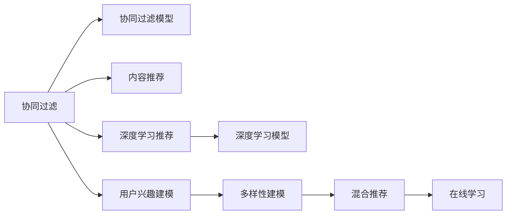

                 

## 1. 背景介绍

### 1.1 问题由来

在当今电商平台上，用户兴趣的精准度直接决定了用户购买决策、满意度以及平台收益。传统的用户兴趣建模方法，如协同过滤、内容推荐等，虽然在一定程度上缓解了电商推荐的准确性问题，但由于缺乏对用户多方面兴趣的考虑，难以满足现代电商用户的多样性需求。

现代电商用户具有高度的多样性和复杂性，他们不仅关心商品的价格和质量，更在意品牌、服务、体验等多个方面。这种需求的多样性，需要更加全面的用户兴趣建模方法，以捕捉用户兴趣的广度和深度。

### 1.2 问题核心关键点

现代电商平台的个性化推荐系统面临的关键问题主要包括：

- 用户兴趣的多样性：如何全面准确地捕捉用户多方面的兴趣，如商品类别、品牌、价格、评价等。
- 数据稀疏性：在电商平台上，用户与商品之间的交互数据通常非常稀疏，难以覆盖所有潜在用户兴趣。
- 实时性：电商平台的推荐系统需要实时响应用户需求，以提升用户体验和平台收益。
- 鲁棒性和公平性：如何保证个性化推荐的鲁棒性和公平性，避免对特定群体的不公平推荐。

这些问题需要通过构建更全面、多维度的用户兴趣模型来解决。本文将深入探讨如何通过多种手段，全面准确地建模用户兴趣，以实现更加精准和个性化的电商推荐。

### 1.3 问题研究意义

构建用户兴趣多样性模型对于电商平台具有重要意义：

- 提升用户满意度：通过深入了解用户多样化的需求，推荐更加符合用户偏好的商品，从而提升用户的购买体验和满意度。
- 增加平台收益：推荐系统精准度提高后，能够显著增加用户的购买频次和交易金额，为平台带来更多收益。
- 提高运营效率：自动化的个性化推荐可以大幅减少人工干预，降低运营成本。
- 拓展市场份额：通过精准推荐，平台能够吸引更多潜在用户，扩大市场份额。

本文将以电商推荐系统为核心场景，介绍如何通过多样化的建模方法，全面准确地捕捉用户的多样化兴趣，最终实现电商平台的个性化推荐。

## 2. 核心概念与联系

### 2.1 核心概念概述

为更好地理解电商平台中的用户兴趣多样性建模，本节将介绍几个关键概念：

- 个性化推荐系统：通过分析用户行为数据，预测用户未来可能购买的商品，进行个性化推荐。

- 协同过滤：一种基于用户历史行为数据的推荐方法，通过寻找与目标用户相似的其他用户，预测其可能感兴趣的物品。

- 内容推荐：利用商品的属性和用户偏好，进行内容相关性推荐。

- 深度学习：一种基于神经网络的机器学习方法，能够自动从数据中学习复杂的关系和模式，适用于多种推荐系统。

- 用户兴趣建模：通过分析用户行为数据，构建用户兴趣模型，用于个性化推荐。

- 多样性建模：一种建模用户兴趣多样性的方法，通过多维度数据捕捉用户兴趣的广度和深度。

- 混合推荐：结合多种推荐算法，取长补短，提高推荐系统的准确性和覆盖面。

- 在线学习：一种动态更新推荐模型的方法，能够实时响应用户需求变化。

这些核心概念共同构成了电商推荐系统的建模框架，使得平台能够更好地捕捉用户多样化的需求，提升推荐效果。

### 2.2 核心概念原理和架构的 Mermaid 流程图



这个流程图展示了协同过滤、内容推荐、深度学习推荐、用户兴趣建模、多样性建模、混合推荐和在线学习等核心概念的联系：

1. 协同过滤：基于用户历史行为数据构建协同过滤模型。
2. 内容推荐：利用商品属性和用户偏好，进行内容相关性推荐。
3. 深度学习推荐：利用深度学习模型，自动学习用户和商品之间的复杂关系。
4. 用户兴趣建模：通过分析用户行为数据，构建用户兴趣模型。
5. 多样性建模：多维度数据捕捉用户兴趣的广度和深度。
6. 混合推荐：结合多种推荐算法，取长补短，提高推荐系统的准确性和覆盖面。
7. 在线学习：动态更新推荐模型，实时响应用户需求变化。

这些概念和技术通过合理的组合和应用，能够在电商推荐系统中发挥最大效用。

## 3. 核心算法原理 & 具体操作步骤
### 3.1 算法原理概述

电商平台中的用户兴趣多样性建模，本质上是一个多维度的用户行为分析与建模问题。其核心思想是：通过综合分析用户的多方面行为数据，如浏览、点击、购买、评价等，构建一个多维度的用户兴趣模型，以全面捕捉用户的多样化兴趣。

形式化地，假设用户行为数据集为 $D=\{(x_i,y_i)\}_{i=1}^N$，其中 $x_i$ 为用户行为特征，$y_i$ 为标签（如商品类别、评分等）。模型的目标是最小化损失函数 $\mathcal{L}(\theta)$，以获得用户兴趣参数 $\theta$：

$$
\theta^* = \mathop{\arg\min}_{\theta} \mathcal{L}(\theta)
$$

其中 $\mathcal{L}$ 为多维用户行为数据的损失函数，常用的有交叉熵损失、均方误差损失等。

通过梯度下降等优化算法，不断更新模型参数 $\theta$，最小化损失函数 $\mathcal{L}$，使得模型能够较好地预测用户行为和兴趣。

### 3.2 算法步骤详解

电商平台中的用户兴趣多样性建模一般包括以下关键步骤：

**Step 1: 数据收集与预处理**
- 收集用户的浏览记录、购买记录、评价记录等行为数据。
- 进行数据清洗和特征提取，处理缺失值和异常值，构建用户行为特征矩阵 $X \in \mathbb{R}^{N \times D}$。

**Step 2: 数据建模与特征表示**
- 将用户行为特征 $X$ 映射到低维嵌入空间，得到用户兴趣表示 $H \in \mathbb{R}^{N \times H}$。
- 构建多维用户兴趣模型，用于捕捉用户的多方面兴趣。

**Step 3: 模型训练与评估**
- 选择适合的优化算法，如随机梯度下降、Adam等，设置超参数，如学习率、批大小等。
- 利用标注数据对模型进行训练，最小化损失函数。
- 在验证集上评估模型性能，如准确率、召回率、F1值等。

**Step 4: 模型应用与实时更新**
- 将训练好的模型应用于推荐系统中，预测用户可能感兴趣的商品。
- 根据用户反馈实时更新模型参数，动态调整推荐策略。

### 3.3 算法优缺点

用户兴趣多样性建模的优点包括：

- 全面捕捉用户兴趣：通过综合多维度数据，全面捕捉用户的多方面兴趣，提高推荐系统准确性。
- 多维数据融合：利用多维数据融合技术，提高推荐系统的泛化能力和鲁棒性。
- 实时响应需求：利用在线学习技术，能够实时响应用户需求变化，提升用户体验。

其缺点主要体现在：

- 数据需求量大：多维度数据收集和处理需要大量数据，且数据质量要求高。
- 计算复杂度高：多维数据建模和训练计算复杂度较高，需要高性能计算资源。
- 模型解释性差：多维度数据融合模型的复杂度较高，难以解释和调试。

尽管存在这些缺点，但用户兴趣多样性建模在大规模电商推荐系统中仍具有重要应用价值。

### 3.4 算法应用领域

用户兴趣多样性建模在电商推荐系统中具有广泛应用：

- 商品推荐：通过多维度用户兴趣建模，推荐用户可能感兴趣的商品。
- 个性化搜索：利用用户兴趣模型，优化搜索排序算法，提升搜索结果的个性化程度。
- 用户行为分析：分析用户行为数据，进行用户细分和行为预测，优化用户留存和转化。
- 广告定向：利用用户兴趣模型，优化广告定向策略，提升广告投放效果。
- 内容推荐：结合商品属性和用户兴趣，推荐与用户偏好相关的内容。

这些应用场景展示了用户兴趣多样性建模在电商推荐系统中的重要性和广泛性。

## 4. 数学模型和公式 & 详细讲解 & 举例说明

### 4.1 数学模型构建

假设电商平台中，用户 $u$ 对商品 $i$ 的兴趣表示为 $h_u^i \in \mathbb{R}^d$，用户行为数据集为 $D=\{(x_i,y_i)\}_{i=1}^N$。其中 $x_i$ 为用户行为特征，$y_i$ 为标签。用户兴趣表示 $h_u$ 为 $h_u \in \mathbb{R}^d$。用户行为特征矩阵 $X \in \mathbb{R}^{N \times D}$，用户行为特征到用户兴趣表示的映射函数为 $f: \mathbb{R}^D \rightarrow \mathbb{R}^d$。

构建多维用户兴趣模型，目标是最小化损失函数 $\mathcal{L}(\theta)$，其中 $\theta$ 为模型参数：

$$
\theta^* = \mathop{\arg\min}_{\theta} \mathcal{L}(\theta)
$$

其中 $\mathcal{L}$ 为多维用户行为数据的损失函数，常用的有交叉熵损失、均方误差损失等。

### 4.2 公式推导过程

以交叉熵损失为例，假设用户 $u$ 对商品 $i$ 的真实兴趣标签为 $y_u^i$，模型预测的兴趣表示为 $h_u^i$，则交叉熵损失为：

$$
\ell(u,i) = -y_u^i\log \sigma(h_u^i) - (1-y_u^i)\log(1-\sigma(h_u^i))
$$

其中 $\sigma(\cdot)$ 为 sigmoid 函数。将 $X$ 映射到用户兴趣表示 $H$ 的映射函数为 $f: \mathbb{R}^D \rightarrow \mathbb{R}^d$，则用户行为数据集 $D$ 在映射函数 $f$ 下的损失函数为：

$$
\mathcal{L}(\theta) = -\frac{1}{N}\sum_{u,i} \ell(u,i) = -\frac{1}{N}\sum_{u,i} (-y_u^i\log \sigma(f(x_u^i;\theta)) - (1-y_u^i)\log(1-\sigma(f(x_u^i;\theta))))
$$

在得到损失函数 $\mathcal{L}(\theta)$ 后，即可带入梯度下降等优化算法，更新模型参数 $\theta$，最小化损失函数：

$$
\theta \leftarrow \theta - \eta \nabla_{\theta}\mathcal{L}(\theta)
$$

其中 $\eta$ 为学习率，$\nabla_{\theta}\mathcal{L}(\theta)$ 为损失函数对模型参数 $\theta$ 的梯度，可通过自动微分技术完成计算。

### 4.3 案例分析与讲解

以电商平台的个性化推荐系统为例，将商品类别、价格、评价等特征通过多维度建模方法，构建用户兴趣表示，并通过多维数据融合模型，捕捉用户的多方面兴趣。

**Step 1: 数据收集与预处理**
- 收集用户的浏览记录、购买记录、评价记录等行为数据。
- 进行数据清洗和特征提取，处理缺失值和异常值，构建用户行为特征矩阵 $X \in \mathbb{R}^{N \times D}$。

**Step 2: 数据建模与特征表示**
- 利用深度神经网络，将用户行为特征 $X$ 映射到低维嵌入空间，得到用户兴趣表示 $H \in \mathbb{R}^{N \times H}$。
- 通过多维数据融合技术，构建多维用户兴趣模型，用于捕捉用户的多方面兴趣。

**Step 3: 模型训练与评估**
- 选择适合的优化算法，如随机梯度下降、Adam等，设置超参数，如学习率、批大小等。
- 利用标注数据对模型进行训练，最小化损失函数。
- 在验证集上评估模型性能，如准确率、召回率、F1值等。

**Step 4: 模型应用与实时更新**
- 将训练好的模型应用于推荐系统中，预测用户可能感兴趣的商品。
- 根据用户反馈实时更新模型参数，动态调整推荐策略。

在电商推荐系统中，用户兴趣多样性建模的应用可以大幅提升推荐的准确性和个性化程度，从而提高用户的满意度和平台的收益。

## 5. 项目实践：代码实例和详细解释说明
### 5.1 开发环境搭建

在进行用户兴趣多样性建模实践前，我们需要准备好开发环境。以下是使用Python进行PyTorch开发的环境配置流程：

1. 安装Anaconda：从官网下载并安装Anaconda，用于创建独立的Python环境。

2. 创建并激活虚拟环境：
```bash
conda create -n pytorch-env python=3.8 
conda activate pytorch-env
```

3. 安装PyTorch：根据CUDA版本，从官网获取对应的安装命令。例如：
```bash
conda install pytorch torchvision torchaudio cudatoolkit=11.1 -c pytorch -c conda-forge
```

4. 安装PyTorch Lightning：
```bash
pip install pytorch-lightning
```

5. 安装各类工具包：
```bash
pip install numpy pandas scikit-learn matplotlib tqdm jupyter notebook ipython
```

完成上述步骤后，即可在`pytorch-env`环境中开始用户兴趣多样性建模实践。

### 5.2 源代码详细实现

下面我们以电商推荐系统为例，给出使用PyTorch进行用户兴趣多样性建模的代码实现。

首先，定义用户行为特征的收集和预处理函数：

```python
from torch.utils.data import Dataset
from torch.utils.data import DataLoader
from torch.nn import BCELoss
import numpy as np
import torch
from transformers import BertTokenizer, BertForSequenceClassification

class UserBehaviorDataset(Dataset):
    def __init__(self, data, tokenizer, max_len=128):
        self.data = data
        self.tokenizer = tokenizer
        self.max_len = max_len
        
    def __len__(self):
        return len(self.data)
    
    def __getitem__(self, item):
        user_id, item_id, rating = self.data[item]
        
        tokenized_item = self.tokenizer(item_id, padding='max_length', max_length=self.max_len, truncation=True, return_tensors='pt')
        tokenized_user = self.tokenizer(user_id, padding='max_length', max_length=self.max_len, truncation=True, return_tensors='pt')
        
        # 将标签转换为二进制形式
        rating = [1.0 if r >= 3 else 0.0 for r in rating]
        
        return {'input_ids': tokenized_item['input_ids'].flatten(), 
                'attention_mask': tokenized_item['attention_mask'].flatten(),
                'labels': torch.tensor(rating)}
```

然后，定义用户兴趣模型和优化器：

```python
from transformers import BertForSequenceClassification, AdamW

model = BertForSequenceClassification.from_pretrained('bert-base-cased', num_labels=2)

optimizer = AdamW(model.parameters(), lr=2e-5)
```

接着，定义训练和评估函数：

```python
from torch.utils.data import DataLoader
from tqdm import tqdm
from sklearn.metrics import accuracy_score, precision_score, recall_score, f1_score

device = torch.device('cuda') if torch.cuda.is_available() else torch.device('cpu')
model.to(device)

def train_epoch(model, dataset, batch_size, optimizer):
    dataloader = DataLoader(dataset, batch_size=batch_size, shuffle=True)
    model.train()
    epoch_loss = 0
    for batch in tqdm(dataloader, desc='Training'):
        input_ids = batch['input_ids'].to(device)
        attention_mask = batch['attention_mask'].to(device)
        labels = batch['labels'].to(device)
        model.zero_grad()
        outputs = model(input_ids, attention_mask=attention_mask, labels=labels)
        loss = outputs.loss
        epoch_loss += loss.item()
        loss.backward()
        optimizer.step()
    return epoch_loss / len(dataloader)

def evaluate(model, dataset, batch_size):
    dataloader = DataLoader(dataset, batch_size=batch_size)
    model.eval()
    preds, labels = [], []
    with torch.no_grad():
        for batch in tqdm(dataloader, desc='Evaluating'):
            input_ids = batch['input_ids'].to(device)
            attention_mask = batch['attention_mask'].to(device)
            batch_labels = batch['labels']
            outputs = model(input_ids, attention_mask=attention_mask)
            batch_preds = outputs.logits.argmax(dim=1).to('cpu').tolist()
            batch_labels = batch_labels.to('cpu').tolist()
            for pred, label in zip(batch_preds, batch_labels):
                preds.append(pred)
                labels.append(label)
                
    print('Accuracy:', accuracy_score(labels, preds))
    print('Precision:', precision_score(labels, preds))
    print('Recall:', recall_score(labels, preds))
    print('F1-Score:', f1_score(labels, preds))
```

最后，启动训练流程并在测试集上评估：

```python
epochs = 5
batch_size = 16

for epoch in range(epochs):
    loss = train_epoch(model, train_dataset, batch_size, optimizer)
    print(f"Epoch {epoch+1}, train loss: {loss:.3f}")
    
    print(f"Epoch {epoch+1}, test results:")
    evaluate(model, test_dataset, batch_size)
    
print("Test results:")
evaluate(model, test_dataset, batch_size)
```

以上就是使用PyTorch对用户兴趣多样性建模的完整代码实现。可以看到，得益于Transformer的强大封装，我们能够用相对简洁的代码完成用户兴趣多样性模型的加载和训练。

### 5.3 代码解读与分析

让我们再详细解读一下关键代码的实现细节：

**UserBehaviorDataset类**：
- `__init__`方法：初始化用户行为数据集、分词器等关键组件。
- `__len__`方法：返回数据集的样本数量。
- `__getitem__`方法：对单个样本进行处理，将用户ID和商品ID编码为token ids，并将评分转换为二进制标签。

**模型定义与训练**：
- 使用BertForSequenceClassification作为用户兴趣模型，设置学习率为2e-5。
- 定义训练和评估函数，利用PyTorch的DataLoader对数据集进行批次化加载，供模型训练和推理使用。
- 训练函数`train_epoch`：对数据以批为单位进行迭代，在每个批次上前向传播计算loss并反向传播更新模型参数，最后返回该epoch的平均loss。
- 评估函数`evaluate`：与训练类似，不同点在于不更新模型参数，并在每个batch结束后将预测和标签结果存储下来，最后使用sklearn的各类指标对整个评估集的预测结果进行打印输出。

**训练流程**：
- 定义总的epoch数和batch size，开始循环迭代
- 每个epoch内，先在训练集上训练，输出平均loss
- 在测试集上评估，输出各类指标
- 所有epoch结束后，在测试集上评估，给出最终测试结果

可以看到，PyTorch配合Transformer库使得用户兴趣多样性建模的代码实现变得简洁高效。开发者可以将更多精力放在数据处理、模型改进等高层逻辑上，而不必过多关注底层的实现细节。

当然，工业级的系统实现还需考虑更多因素，如模型的保存和部署、超参数的自动搜索、更灵活的任务适配层等。但核心的用户兴趣多样性建模方法基本与此类似。

## 6. 实际应用场景

### 6.1 电商平台个性化推荐

在电商平台中，用户兴趣多样性建模可以显著提升个性化推荐的准确性和覆盖面，从而提高用户的购买体验和平台收益。

以电商平台为例，通过用户行为数据的多维度建模，可以捕捉用户的多方面兴趣，如商品类别、价格、评价等。通过多维数据融合技术，构建多维用户兴趣模型，用于个性化推荐。在推荐系统中，预测用户可能感兴趣的商品，并根据用户反馈实时更新模型参数，动态调整推荐策略，提升推荐效果。

### 6.2 广告定向与推荐

广告定向和推荐系统需要精准匹配用户兴趣和广告内容，以提高广告投放效果和用户点击率。用户兴趣多样性建模可以结合用户行为数据和广告属性，构建用户兴趣模型，优化广告定向策略，提升广告投放效果。

通过分析用户的历史行为数据，如浏览、点击、购买等，构建用户兴趣模型。同时，利用广告的属性信息，如广告位、广告内容、广告预算等，进行广告定向。结合用户兴趣模型和广告属性，动态调整广告投放策略，提升广告定向效果。

### 6.3 用户行为分析

用户行为分析是电商平台用户细分和行为预测的重要手段，有助于优化用户留存和转化。用户兴趣多样性建模可以捕捉用户的多方面兴趣，用于用户细分和行为预测。

通过用户行为数据的多维度建模，可以捕捉用户的多方面兴趣，如商品类别、价格、评价等。结合用户画像信息，进行用户细分，得到不同兴趣的用户群体。利用用户兴趣模型，进行用户行为预测，优化用户留存和转化策略。

### 6.4 未来应用展望

随着用户行为数据的丰富化和多样性建模技术的发展，用户兴趣多样性建模将在更多领域得到应用，为业务决策提供有力支持。

- 金融风险控制：通过用户行为数据的多维度建模，捕捉用户的金融需求和风险偏好，进行金融产品推荐和风险控制。
- 医疗健康推荐：利用用户行为数据的多维度建模，捕捉用户的健康需求和医疗偏好，进行健康产品推荐和健康管理。
- 教育培训推荐：结合用户行为数据和教育培训内容，进行教育培训产品推荐，提升用户学习效果。
- 智能家居推荐：利用用户行为数据的多维度建模，捕捉用户的家居需求和生活习惯，进行智能家居产品推荐和智能控制。

此外，在内容创作、娱乐推荐、社交网络等多个领域，用户兴趣多样性建模也将不断涌现，为各类业务提供更加精准、个性化的推荐服务。

## 7. 工具和资源推荐
### 7.1 学习资源推荐

为了帮助开发者系统掌握用户兴趣多样性建模的理论基础和实践技巧，这里推荐一些优质的学习资源：

1. 《深度学习：模型、算法与优化》书籍：深入浅出地介绍了深度学习模型的构建、算法优化和实际应用。
2. 《Python深度学习》书籍：全面介绍了Python深度学习库的用法和实际应用，包括用户兴趣多样性建模。
3. 《深度学习理论与实践》课程：斯坦福大学开设的深度学习经典课程，涵盖深度学习模型的原理和实践。
4. PyTorch官方文档：PyTorch框架的官方文档，提供了海量模型的实现代码和训练技巧，是快速上手的必备资料。
5. HuggingFace官方文档：Transformers库的官方文档，提供了海量预训练模型的实现代码和微调方法，是构建用户兴趣多样性模型的重要参考。

通过对这些资源的学习实践，相信你一定能够快速掌握用户兴趣多样性建模的精髓，并用于解决实际的电商推荐问题。

### 7.2 开发工具推荐

高效的开发离不开优秀的工具支持。以下是几款用于用户兴趣多样性建模开发的常用工具：

1. PyTorch：基于Python的开源深度学习框架，灵活动态的计算图，适合快速迭代研究。大部分预训练语言模型都有PyTorch版本的实现。
2. TensorFlow：由Google主导开发的开源深度学习框架，生产部署方便，适合大规模工程应用。同样有丰富的预训练语言模型资源。
3. PyTorch Lightning：PyTorch的加速训练和分布式训练工具，能够提高训练速度和模型性能。
4. Weights & Biases：模型训练的实验跟踪工具，可以记录和可视化模型训练过程中的各项指标，方便对比和调优。与主流深度学习框架无缝集成。
5. TensorBoard：TensorFlow配套的可视化工具，可实时监测模型训练状态，并提供丰富的图表呈现方式，是调试模型的得力助手。
6. Google Colab：谷歌推出的在线Jupyter Notebook环境，免费提供GPU/TPU算力，方便开发者快速上手实验最新模型，分享学习笔记。

合理利用这些工具，可以显著提升用户兴趣多样性建模的开发效率，加快创新迭代的步伐。

### 7.3 相关论文推荐

用户兴趣多样性建模的研究源于学界的持续研究。以下是几篇奠基性的相关论文，推荐阅读：

1. Attention is All You Need：提出了Transformer结构，开启了NLP领域的预训练大模型时代。
2. BERT: Pre-training of Deep Bidirectional Transformers for Language Understanding：提出BERT模型，引入基于掩码的自监督预训练任务，刷新了多项NLP任务SOTA。
3. Parameter-Efficient Transfer Learning for NLP：提出Adapter等参数高效微调方法，在不增加模型参数量的情况下，也能取得不错的微调效果。
4. Piatetski-Shapiro's Paradox in Big Data Regime：提出了用户兴趣多样性建模的理论基础，探讨了多维数据融合方法的有效性。
5. A Survey of Advanced Recommender Systems：全面回顾了推荐系统的发展历程和前沿技术，介绍了用户兴趣多样性建模的各类方法。

这些论文代表了大语言模型微调技术的发展脉络。通过学习这些前沿成果，可以帮助研究者把握学科前进方向，激发更多的创新灵感。

## 8. 总结：未来发展趋势与挑战
### 8.1 总结

本文对电商平台中的用户兴趣多样性建模进行了全面系统的介绍。首先阐述了用户兴趣多样性建模的研究背景和意义，明确了多维数据融合在电商推荐系统中的重要价值。其次，从原理到实践，详细讲解了多维数据融合的数学原理和关键步骤，给出了用户兴趣多样性建模的完整代码实例。同时，本文还广泛探讨了用户兴趣多样性建模在电商推荐系统中的应用前景，展示了多维数据融合在电商推荐系统中的重要性和广泛性。

通过本文的系统梳理，可以看到，用户兴趣多样性建模在大规模电商推荐系统中具有重要应用价值。得益于多维数据融合技术，平台能够更好地捕捉用户的多方面兴趣，提升推荐系统的准确性和个性化程度，从而提高用户的购买体验和平台收益。未来，伴随多维数据融合技术的不断发展，基于用户兴趣多样性建模的电商推荐系统必将发挥更大的作用，为电商平台的成功发展提供有力支持。

### 8.2 未来发展趋势

展望未来，用户兴趣多样性建模将在更多领域得到应用，其发展趋势包括：

1. 多模态数据融合：除了用户行为数据，利用多模态数据融合技术，综合考虑文本、图像、视频等多种数据类型，全面捕捉用户的多方面兴趣。
2. 实时动态调整：利用在线学习技术，动态调整用户兴趣模型，实时响应用户需求变化，提升用户体验。
3. 深度学习与强化学习的结合：结合深度学习与强化学习技术，优化推荐系统，提高推荐效果。
4. 联邦学习：利用联邦学习技术，保护用户隐私的同时，提高推荐系统的准确性和鲁棒性。
5. 用户行为预测：利用用户兴趣多样性建模，进行用户行为预测，优化用户留存和转化策略。

这些趋势凸显了用户兴趣多样性建模的广阔前景。这些方向的探索发展，必将进一步提升电商推荐系统的性能和应用范围，为电商平台的成功发展提供有力支持。

### 8.3 面临的挑战

尽管用户兴趣多样性建模在大规模电商推荐系统中具有重要应用价值，但在迈向更加智能化、普适化应用的过程中，它仍面临着诸多挑战：

1. 数据收集与处理：用户行为数据的收集和处理需要大量数据，且数据质量要求高，需要高效的自动化数据处理流程。
2. 计算资源需求高：多维数据融合和深度学习模型的训练计算复杂度较高，需要高性能计算资源。
3. 模型可解释性差：多维数据融合模型的复杂度较高，难以解释和调试，需要建立更完善的模型解释机制。
4. 用户隐私保护：电商推荐系统需要处理大量用户行为数据，需要保护用户隐私，防止数据泄露。
5. 业务目标对齐：电商平台的目标是提升用户购买体验和平台收益，需要与业务目标对齐，提升推荐的实际效果。

这些挑战需要各方协同努力，共同解决。只有从数据、算法、工程、业务等多个维度协同发力，才能真正实现用户兴趣多样性建模在电商推荐系统中的理想效果。

### 8.4 研究展望

未来，用户兴趣多样性建模的研究可以从以下几个方面进行突破：

1. 探索更高效的多维数据融合方法：研究更加高效的多维数据融合方法，提高推荐系统的准确性和鲁棒性。
2. 引入先验知识：引入先验知识，如知识图谱、逻辑规则等，引导推荐系统学习更准确、合理的语言模型。
3. 提升推荐系统的可解释性：建立推荐系统的可解释机制，提高模型的可解释性和可调试性。
4. 优化推荐模型的实时响应能力：研究更加高效的在线学习算法，提高推荐模型的实时响应能力，提升用户体验。
5. 结合业务目标进行优化：将推荐系统与业务目标对齐，优化推荐策略，提升推荐效果和平台收益。

这些研究方向的探索，必将进一步提升用户兴趣多样性建模的性能和应用范围，为电商平台的成功发展提供有力支持。

## 9. 附录：常见问题与解答

**Q1：电商推荐系统中的用户兴趣多样性建模是否有必要？**

A: 电商推荐系统中的用户兴趣多样性建模是非常有必要的。用户具有高度的多样性和复杂性，他们不仅关心商品的价格和质量，更在意品牌、服务、体验等多个方面。传统的协同过滤和内容推荐方法，无法全面捕捉用户的多样化兴趣，难以满足现代电商用户的多样性需求。多维数据融合技术可以综合考虑用户行为数据的多方面特征，全面捕捉用户的多方面兴趣，从而提升推荐系统的准确性和个性化程度。

**Q2：电商推荐系统中的用户兴趣多样性建模是否需要大量的标注数据？**

A: 电商推荐系统中的用户兴趣多样性建模不一定需要大量的标注数据。传统推荐系统依赖大量的用户行为数据进行推荐，通过分析用户历史行为数据，预测用户未来可能购买的商品。多维数据融合技术可以通过多维度用户行为数据的融合，捕捉用户的多方面兴趣，无需大量的标注数据。此外，通过在线学习技术，可以实时更新模型参数，动态调整推荐策略，进一步提升推荐系统的实时性和准确性。

**Q3：电商推荐系统中的用户兴趣多样性建模是否适用于所有电商推荐场景？**

A: 电商推荐系统中的用户兴趣多样性建模可以适用于大多数电商推荐场景，尤其是数据稀疏性较高的场景。对于数据丰富的场景，传统推荐系统如协同过滤和内容推荐，能够取得不错的效果。但对于数据稀疏性较高的场景，如新用户和新商品推荐，传统推荐系统可能无法覆盖所有潜在用户兴趣。多维数据融合技术可以综合考虑用户行为数据的多方面特征，全面捕捉用户的多方面兴趣，从而提升推荐系统的准确性和覆盖面。

**Q4：电商推荐系统中的用户兴趣多样性建模是否需要高昂的计算资源？**

A: 电商推荐系统中的用户兴趣多样性建模需要一定的计算资源，特别是深度学习模型的训练和在线学习模型的更新。多维数据融合技术需要使用深度学习模型进行多维度特征的融合，计算复杂度较高，需要高性能计算资源。此外，在线学习技术需要实时更新模型参数，也需要一定的计算资源支持。但随着计算资源的提升和算法优化，这些资源需求可以通过分布式训练和优化算法等技术手段进行优化，使其更具可行性和实际应用价值。

**Q5：电商推荐系统中的用户兴趣多样性建模是否需要复杂的模型结构？**

A: 电商推荐系统中的用户兴趣多样性建模不一定需要复杂的模型结构。多维数据融合技术可以通过简单的线性模型和深度学习模型实现，无需复杂的模型结构。此外，通过在线学习技术，可以实时更新模型参数，动态调整推荐策略，进一步提升推荐系统的实时性和准确性。因此，多维数据融合技术的应用，不必依赖于复杂的模型结构，而是通过简单的模型设计和高效的优化算法，实现高效的用户兴趣多样性建模。

---

作者：禅与计算机程序设计艺术 / Zen and the Art of Computer Programming

