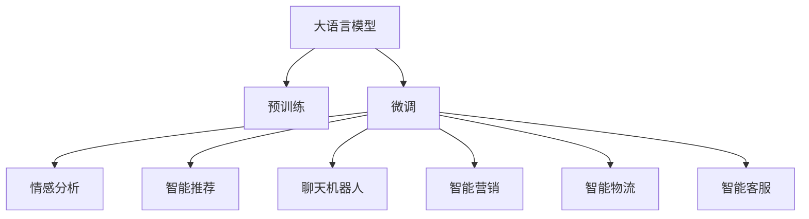
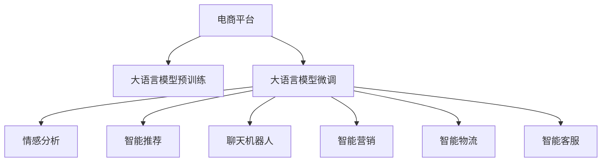

                 

# 电商平台中的自然语言处理：大模型的作用

> 关键词：自然语言处理, 大模型, 电商平台, 产品推荐, 客户服务, 情感分析, 数据挖掘, 聊天机器人, 电商智能营销, 智能客服, 电商用户画像, 智能物流, 电商供应链优化

## 1. 背景介绍

### 1.1 问题由来

随着互联网的迅猛发展，电商平台已经成为人们日常消费的主要渠道。在电商平台上，无论是商品推荐、客户服务、价格策略，还是物流管理、库存优化，自然语言处理(NLP)技术都扮演着重要角色。电商平台通过NLP技术，不仅能够提供个性化推荐，还能优化客户体验，提升销售额，增强供应链效率，从而在激烈的市场竞争中占据优势。

在电商平台的诸多NLP应用中，大语言模型(如GPT、BERT等)已经成为不可或缺的工具。大模型通过在海量文本数据上进行预训练，获得了强大的语言理解和生成能力，能够从根本上提升NLP任务的精度和效率。

### 1.2 问题核心关键点

电商平台中的NLP任务，主要包括以下几个方面：

1. **产品推荐**：根据用户历史行为和文本评论，生成个性化的商品推荐。
2. **客户服务**：处理用户咨询、投诉和建议，提升客户满意度。
3. **情感分析**：分析用户对商品和服务的情感倾向，调整产品策略。
4. **数据挖掘**：从用户评论、搜索记录中挖掘有价值的信息，用于广告投放、市场分析等。
5. **聊天机器人**：提供智能客服，解答用户问题，提升客户体验。
6. **智能营销**：通过文本分析，制定精准的营销策略，提升转化率。

这些任务往往需要大量的自然语言文本处理，传统的基于规则和统计的NLP方法难以满足需求。大语言模型以其强大的语言理解和生成能力，提供了全新的解决方案，极大地提升了电商平台的运营效率和用户体验。

### 1.3 问题研究意义

在电商平台中应用大语言模型，对于推动电商行业的智能化转型具有重要意义：

1. **提升用户满意度**：通过智能客服、个性化推荐等服务，提升用户体验，增强用户粘性。
2. **优化运营效率**：通过情感分析、智能营销等工具，优化库存管理、价格策略，提升运营效率。
3. **降低运营成本**：通过自动化客服、智能推荐等技术，减少人力成本，提高运营效率。
4. **增强竞争力**：借助先进的NLP技术，提升电商平台的差异化优势，在激烈的市场竞争中占据有利地位。
5. **拓展业务边界**：通过智能物流、智能供应链等应用，拓展电商平台的业务范围，开拓新的业务增长点。

本文将深入探讨大语言模型在电商平台中的应用，从原理到实践，全面解析其工作机制和实际效果。

## 2. 核心概念与联系

### 2.1 核心概念概述

为了更好地理解大语言模型在电商平台中的应用，我们先介绍几个核心概念：

- **大语言模型(Large Language Model, LLM)**：指通过预训练学习语言表示的大型深度神经网络，如GPT、BERT等。这些模型能够理解自然语言文本的语义，进行文本生成、分类、匹配等任务。

- **预训练(Pre-training)**：指在大规模无标签文本数据上进行自监督学习，学习语言的通用表示。常见的预训练任务包括语言建模、掩码语言建模等。

- **微调(Fine-tuning)**：指在预训练模型基础上，使用特定任务的标注数据进行有监督学习，优化模型在该任务上的性能。微调可以大幅提升模型在特定任务上的表现。

- **迁移学习(Transfer Learning)**：指将一个领域学到的知识迁移到另一个相关领域的学习过程。预训练-微调就是一种典型的迁移学习方式。

- **情感分析(Sentiment Analysis)**：指对文本情感倾向的分析和分类，判断用户对商品或服务的正面、中立或负面情感。

- **智能推荐(Recommendation System)**：根据用户历史行为和文本评论，生成个性化的商品推荐。

- **聊天机器人(Chatbot)**：通过自然语言处理技术，模拟人类对话，解答用户问题，提供客户服务。

- **智能营销(Intelligent Marketing)**：利用文本分析，制定精准的营销策略，提升转化率。

这些核心概念之间有着紧密的联系，共同构成了电商平台中大语言模型的应用框架，如图2所示：



大语言模型通过预训练学习通用的语言表示，然后通过微调适配特定任务，从而能够高效地进行情感分析、智能推荐、聊天机器人等电商平台的NLP应用。这些应用不仅提升了用户体验，还优化了运营效率，增强了电商平台的竞争力。

### 2.2 核心概念原理和架构的 Mermaid 流程图

下图展示了基于大语言模型在电商平台中的应用流程：



在这个流程中，电商平台通过大语言模型预训练学习通用的语言表示，然后通过微调适配不同任务，从而实现情感分析、智能推荐、聊天机器人等应用。这些应用不仅提升了用户体验，还优化了运营效率，增强了电商平台的竞争力。

## 3. 核心算法原理 & 具体操作步骤

### 3.1 算法原理概述

大语言模型在电商平台中的应用，主要基于预训练-微调框架。具体来说，大模型通过在大规模无标签文本数据上进行预训练，学习通用的语言表示。然后，针对特定的电商平台任务，使用小规模的标注数据对大模型进行微调，从而优化其在特定任务上的性能。

### 3.2 算法步骤详解

大语言模型在电商平台中的应用主要分为以下几个步骤：

**Step 1: 准备数据集**

- **预训练数据集**：收集大量无标签文本数据，如电商评论、商品描述、用户搜索记录等，用于大模型的预训练。
- **微调数据集**：收集特定任务的相关标注数据，如商品评论情感标签、用户意图标签等，用于模型的微调。

**Step 2: 模型初始化**

- **预训练模型选择**：选择合适的预训练语言模型，如BERT、GPT等，作为初始化参数。
- **模型适配层设计**：根据具体任务设计相应的输出层和损失函数。例如，对于情感分析任务，通常使用线性分类器和交叉熵损失函数。

**Step 3: 微调模型训练**

- **优化器选择**：选择合适的优化器，如Adam、SGD等，设置学习率、批大小、迭代轮数等超参数。
- **正则化技术**：应用L2正则、Dropout、Early Stopping等正则化技术，防止模型过拟合。
- **数据增强**：通过文本改写、回译等方式增强训练集多样性，提高模型泛化能力。
- **模型评估**：在验证集上评估模型性能，根据性能指标决定是否触发Early Stopping。

**Step 4: 应用模型**

- **应用场景选择**：根据具体任务选择合适的应用场景，如情感分析、智能推荐、聊天机器人等。
- **模型集成**：将微调后的模型集成到电商平台的各个系统中，实现自然语言处理功能。

### 3.3 算法优缺点

大语言模型在电商平台中的应用具有以下优点：

- **高效准确**：大语言模型能够高效处理自然语言文本，提升电商平台的运营效率和用户体验。
- **广泛适用**：适用于电商平台的各个环节，如推荐系统、客服系统、营销系统等。
- **灵活可调**：通过微调，可以适应不同的电商任务和数据特点，满足特定需求。
- **技术壁垒低**：大语言模型封装成熟，易于上手，降低了技术门槛。

同时，大语言模型在电商平台中也存在一些局限性：

- **数据需求高**：预训练和微调都需要大量的文本数据，对数据获取和标注成本较高。
- **模型复杂度高**：大语言模型参数量庞大，对硬件要求高，推理速度较慢。
- **解释性不足**：大语言模型黑盒性质强，难以解释其内部决策逻辑。
- **风险控制难**：大模型可能学习到有偏见的信息，传播不良影响，需进行严格的风险控制。

尽管存在这些局限性，大语言模型在电商平台中的应用仍然具有广泛的应用前景，值得深入研究。

### 3.4 算法应用领域

大语言模型在电商平台中的应用涵盖了多个方面，具体包括：

- **情感分析**：通过分析用户对商品或服务的情感倾向，优化产品策略，提升用户满意度。
- **智能推荐**：根据用户历史行为和文本评论，生成个性化的商品推荐，提升转化率。
- **聊天机器人**：通过自然语言处理技术，提供智能客服，解答用户问题，提升客户体验。
- **智能营销**：利用文本分析，制定精准的营销策略，提升转化率。
- **智能物流**：通过自然语言处理技术，优化物流管理和配送路径，提升物流效率。
- **智能客服**：通过自然语言处理技术，提升客服自动化水平，减少人力成本。
- **智能广告**：通过文本分析，优化广告投放策略，提高广告效果。

这些应用不仅提升了用户体验，还优化了运营效率，增强了电商平台的竞争力。

## 4. 数学模型和公式 & 详细讲解

### 4.1 数学模型构建

在电商平台中，情感分析任务是最典型的应用之一。我们将以情感分析为例，详细介绍大语言模型微调的数学模型构建过程。

假设预训练语言模型为 $M_{\theta}$，其中 $\theta$ 为模型参数。给定情感分析任务 $T$ 的训练集 $D=\{(x_i, y_i)\}_{i=1}^N, x_i \in \mathcal{X}, y_i \in \{0,1\}$，其中 $x_i$ 为输入文本，$y_i$ 为情感标签，$0$ 表示负面情感，$1$ 表示正面情感。

定义模型 $M_{\theta}$ 在输入 $x$ 上的输出为 $\hat{y}=M_{\theta}(x) \in [0,1]$，表示样本属于正面情感的概率。定义交叉熵损失函数为：

$$
\ell(M_{\theta}(x),y) = -[y\log \hat{y} + (1-y)\log (1-\hat{y})]
$$

则在数据集 $D$ 上的经验风险为：

$$
\mathcal{L}(\theta) = \frac{1}{N} \sum_{i=1}^N \ell(M_{\theta}(x_i),y_i)
$$

微调的优化目标是最小化经验风险，即找到最优参数：

$$
\theta^* = \mathop{\arg\min}_{\theta} \mathcal{L}(\theta)
$$

在实践中，我们通常使用基于梯度的优化算法（如SGD、Adam等）来近似求解上述最优化问题。设 $\eta$ 为学习率，$\lambda$ 为正则化系数，则参数的更新公式为：

$$
\theta \leftarrow \theta - \eta \nabla_{\theta}\mathcal{L}(\theta) - \eta\lambda\theta
$$

其中 $\nabla_{\theta}\mathcal{L}(\theta)$ 为损失函数对参数 $\theta$ 的梯度，可通过反向传播算法高效计算。

### 4.2 公式推导过程

在情感分析任务中，交叉熵损失函数的梯度计算公式为：

$$
\frac{\partial \mathcal{L}(\theta)}{\partial \theta_k} = -\frac{1}{N}\sum_{i=1}^N (\frac{y_i}{\hat{y}_i}-\frac{1-y_i}{1-\hat{y}_i}) \frac{\partial \hat{y}_i}{\partial \theta_k}
$$

其中 $\hat{y}_i$ 为模型在输入 $x_i$ 上的输出，$\frac{\partial \hat{y}_i}{\partial \theta_k}$ 可通过自动微分技术计算。

### 4.3 案例分析与讲解

以电商平台中的智能推荐系统为例，我们需要设计一个推荐模型，根据用户的历史行为和文本评论，生成个性化的商品推荐。我们将通过以下步骤实现：

1. **数据准备**：收集用户的历史浏览记录、评论、评分等文本数据，并将其转换为模型训练数据。

2. **模型选择**：选择合适的预训练语言模型，如BERT、GPT等。

3. **微调**：使用微调框架对预训练模型进行适配，优化其在推荐任务上的性能。

4. **模型评估**：在验证集上评估模型性能，根据性能指标决定是否调整模型参数。

5. **应用集成**：将微调后的模型集成到电商平台的推荐系统中，生成个性化推荐。

通过上述步骤，我们可以高效地实现电商平台中的智能推荐系统，提升用户体验和运营效率。

## 5. 项目实践：代码实例和详细解释说明

### 5.1 开发环境搭建

在进行大语言模型微调实践前，我们需要准备好开发环境。以下是使用Python进行PyTorch开发的环境配置流程：

1. 安装Anaconda：从官网下载并安装Anaconda，用于创建独立的Python环境。

2. 创建并激活虚拟环境：
```bash
conda create -n pytorch-env python=3.8 
conda activate pytorch-env
```

3. 安装PyTorch：根据CUDA版本，从官网获取对应的安装命令。例如：
```bash
conda install pytorch torchvision torchaudio cudatoolkit=11.1 -c pytorch -c conda-forge
```

4. 安装Transformers库：
```bash
pip install transformers
```

5. 安装各类工具包：
```bash
pip install numpy pandas scikit-learn matplotlib tqdm jupyter notebook ipython
```

完成上述步骤后，即可在`pytorch-env`环境中开始微调实践。

### 5.2 源代码详细实现

下面我们以情感分析任务为例，给出使用Transformers库对BERT模型进行微调的PyTorch代码实现。

首先，定义情感分析任务的数据处理函数：

```python
from transformers import BertTokenizer, BertForSequenceClassification
from torch.utils.data import Dataset
import torch

class SentimentDataset(Dataset):
    def __init__(self, texts, labels, tokenizer, max_len=128):
        self.texts = texts
        self.labels = labels
        self.tokenizer = tokenizer
        self.max_len = max_len
        
    def __len__(self):
        return len(self.texts)
    
    def __getitem__(self, item):
        text = self.texts[item]
        label = self.labels[item]
        
        encoding = self.tokenizer(text, return_tensors='pt', max_length=self.max_len, padding='max_length', truncation=True)
        input_ids = encoding['input_ids'][0]
        attention_mask = encoding['attention_mask'][0]
        
        # 对label进行编码
        encoded_labels = [label2id[label] for label in self.labels] 
        encoded_labels.extend([label2id['O']] * (self.max_len - len(encoded_labels)))
        labels = torch.tensor(encoded_labels, dtype=torch.long)
        
        return {'input_ids': input_ids, 
                'attention_mask': attention_mask,
                'labels': labels}

# 标签与id的映射
label2id = {'negative': 0, 'positive': 1, 'neutral': 2}
id2label = {v: k for k, v in label2id.items()}

# 创建dataset
tokenizer = BertTokenizer.from_pretrained('bert-base-cased')

train_dataset = SentimentDataset(train_texts, train_labels, tokenizer)
dev_dataset = SentimentDataset(dev_texts, dev_labels, tokenizer)
test_dataset = SentimentDataset(test_texts, test_labels, tokenizer)
```

然后，定义模型和优化器：

```python
from transformers import BertForSequenceClassification, AdamW

model = BertForSequenceClassification.from_pretrained('bert-base-cased', num_labels=len(label2id))

optimizer = AdamW(model.parameters(), lr=2e-5)
```

接着，定义训练和评估函数：

```python
from torch.utils.data import DataLoader
from tqdm import tqdm
from sklearn.metrics import accuracy_score, precision_score, recall_score, f1_score

device = torch.device('cuda') if torch.cuda.is_available() else torch.device('cpu')
model.to(device)

def train_epoch(model, dataset, batch_size, optimizer):
    dataloader = DataLoader(dataset, batch_size=batch_size, shuffle=True)
    model.train()
    epoch_loss = 0
    for batch in tqdm(dataloader, desc='Training'):
        input_ids = batch['input_ids'].to(device)
        attention_mask = batch['attention_mask'].to(device)
        labels = batch['labels'].to(device)
        model.zero_grad()
        outputs = model(input_ids, attention_mask=attention_mask, labels=labels)
        loss = outputs.loss
        epoch_loss += loss.item()
        loss.backward()
        optimizer.step()
    return epoch_loss / len(dataloader)

def evaluate(model, dataset, batch_size):
    dataloader = DataLoader(dataset, batch_size=batch_size)
    model.eval()
    preds, labels = [], []
    with torch.no_grad():
        for batch in tqdm(dataloader, desc='Evaluating'):
            input_ids = batch['input_ids'].to(device)
            attention_mask = batch['attention_mask'].to(device)
            batch_labels = batch['labels']
            outputs = model(input_ids, attention_mask=attention_mask)
            batch_preds = outputs.logits.argmax(dim=2).to('cpu').tolist()
            batch_labels = batch_labels.to('cpu').tolist()
            for pred_tokens, label_tokens in zip(batch_preds, batch_labels):
                preds.append(pred_tokens[:len(label_tokens)])
                labels.append(label_tokens)
                
    accuracy = accuracy_score(labels, preds)
    precision = precision_score(labels, preds, average='macro')
    recall = recall_score(labels, preds, average='macro')
    f1 = f1_score(labels, preds, average='macro')
    
    print(f"Accuracy: {accuracy:.3f}, Precision: {precision:.3f}, Recall: {recall:.3f}, F1 Score: {f1:.3f}")
```

最后，启动训练流程并在测试集上评估：

```python
epochs = 5
batch_size = 16

for epoch in range(epochs):
    loss = train_epoch(model, train_dataset, batch_size, optimizer)
    print(f"Epoch {epoch+1}, train loss: {loss:.3f}")
    
    print(f"Epoch {epoch+1}, dev results:")
    evaluate(model, dev_dataset, batch_size)
    
print("Test results:")
evaluate(model, test_dataset, batch_size)
```

以上就是使用PyTorch对BERT进行情感分析任务微调的完整代码实现。可以看到，得益于Transformers库的强大封装，我们可以用相对简洁的代码完成BERT模型的加载和微调。

### 5.3 代码解读与分析

让我们再详细解读一下关键代码的实现细节：

**SentimentDataset类**：
- `__init__`方法：初始化文本、标签、分词器等关键组件。
- `__len__`方法：返回数据集的样本数量。
- `__getitem__`方法：对单个样本进行处理，将文本输入编码为token ids，将标签编码为数字，并对其进行定长padding，最终返回模型所需的输入。

**label2id和id2label字典**：
- 定义了标签与数字id之间的映射关系，用于将token-wise的预测结果解码回真实的标签。

**训练和评估函数**：
- 使用PyTorch的DataLoader对数据集进行批次化加载，供模型训练和推理使用。
- 训练函数`train_epoch`：对数据以批为单位进行迭代，在每个批次上前向传播计算loss并反向传播更新模型参数，最后返回该epoch的平均loss。
- 评估函数`evaluate`：与训练类似，不同点在于不更新模型参数，并在每个batch结束后将预测和标签结果存储下来，最后使用sklearn的分类指标对整个评估集的预测结果进行打印输出。

**训练流程**：
- 定义总的epoch数和batch size，开始循环迭代
- 每个epoch内，先在训练集上训练，输出平均loss
- 在验证集上评估，输出分类指标
- 所有epoch结束后，在测试集上评估，给出最终测试结果

可以看到，PyTorch配合Transformers库使得BERT微调的代码实现变得简洁高效。开发者可以将更多精力放在数据处理、模型改进等高层逻辑上，而不必过多关注底层的实现细节。

当然，工业级的系统实现还需考虑更多因素，如模型的保存和部署、超参数的自动搜索、更灵活的任务适配层等。但核心的微调范式基本与此类似。

## 6. 实际应用场景

### 6.1 智能推荐系统

基于大语言模型微调的推荐系统，可以提升用户的个性化推荐体验。在电商平台上，用户每天都会产生大量的浏览、点击、搜索、评分等行为数据。通过将这些数据转换为文本数据，并使用大模型进行微调，可以学习到用户的历史偏好和语义信息，从而生成个性化的商品推荐。

具体而言，可以收集用户的历史浏览记录、评论、评分等文本数据，将其转换为推荐模型的输入。在模型训练过程中，使用交叉熵等损失函数优化模型的推荐效果。最终，将微调后的模型应用于推荐系统中，生成个性化推荐列表。

### 6.2 智能客服系统

智能客服系统是大语言模型在电商平台中的重要应用之一。通过微调大语言模型，电商平台可以实现智能客服，自动解答用户问题，提升客户体验。

智能客服系统通常包括以下几个部分：

1. **意图识别**：通过自然语言处理技术，自动识别用户咨询的意图，如询问商品信息、投诉、建议等。
2. **知识图谱**：构建商品、服务、订单等领域的知识图谱，帮助模型理解上下文关系。
3. **对话生成**：基于用户意图和上下文信息，生成适当的回复，解决用户问题。

具体实现中，可以使用预训练的语言模型（如GPT、BERT等），在电商平台的客服数据上进行微调，优化模型在对话生成、意图识别等任务上的表现。通过不断优化模型和知识图谱，提升智能客服系统的回答准确率和用户体验。

### 6.3 智能营销

智能营销是大语言模型在电商平台中的重要应用之一。通过分析用户评论、搜索记录等文本数据，可以发现用户的兴趣点和需求，制定精准的营销策略。

具体而言，可以收集用户的评论、搜索记录、点击记录等文本数据，使用大模型进行情感分析、意图识别等任务。根据分析结果，制定有针对性的营销策略，提升广告效果和转化率。例如，针对喜欢户外运动的用户，可以推送户外运动相关商品的广告；针对喜欢美妆的用户，可以推送相关商品和优惠信息。

## 7. 工具和资源推荐

### 7.1 学习资源推荐

为了帮助开发者系统掌握大语言模型在电商平台中的应用，这里推荐一些优质的学习资源：

1. 《自然语言处理入门与实践》系列博文：由大模型技术专家撰写，介绍了NLP的基本概念和经典模型，特别适合初学者。

2. 《深度学习自然语言处理》课程：斯坦福大学开设的NLP明星课程，有Lecture视频和配套作业，带你深入了解NLP的前沿技术。

3. 《自然语言处理技术及应用》书籍：全面介绍了NLP的基本概念、经典模型和技术应用，适合系统学习NLP知识。

4. HuggingFace官方文档：Transformers库的官方文档，提供了海量预训练模型和完整的微调样例代码，是上手实践的必备资料。

5. Kaggle平台：Kaggle上有大量与NLP相关的比赛和数据集，可以通过实际项目提升实战能力。

通过对这些资源的学习实践，相信你一定能够快速掌握大语言模型在电商平台中的应用，并用于解决实际的NLP问题。

### 7.2 开发工具推荐

高效的开发离不开优秀的工具支持。以下是几款用于大语言模型微调开发的常用工具：

1. PyTorch：基于Python的开源深度学习框架，灵活动态的计算图，适合快速迭代研究。大部分预训练语言模型都有PyTorch版本的实现。

2. TensorFlow：由Google主导开发的开源深度学习框架，生产部署方便，适合大规模工程应用。同样有丰富的预训练语言模型资源。

3. Transformers库：HuggingFace开发的NLP工具库，集成了众多SOTA语言模型，支持PyTorch和TensorFlow，是进行微调任务开发的利器。

4. Weights & Biases：模型训练的实验跟踪工具，可以记录和可视化模型训练过程中的各项指标，方便对比和调优。与主流深度学习框架无缝集成。

5. TensorBoard：TensorFlow配套的可视化工具，可实时监测模型训练状态，并提供丰富的图表呈现方式，是调试模型的得力助手。

6. Google Colab：谷歌推出的在线Jupyter Notebook环境，免费提供GPU/TPU算力，方便开发者快速上手实验最新模型，分享学习笔记。

合理利用这些工具，可以显著提升大语言模型微调任务的开发效率，加快创新迭代的步伐。

### 7.3 相关论文推荐

大语言模型在电商平台中的应用源于学界的持续研究。以下是几篇奠基性的相关论文，推荐阅读：

1. Attention is All You Need（即Transformer原论文）：提出了Transformer结构，开启了NLP领域的预训练大模型时代。

2. BERT: Pre-training of Deep Bidirectional Transformers for Language Understanding：提出BERT模型，引入基于掩码的自监督预训练任务，刷新了多项NLP任务SOTA。

3. Language Models are Unsupervised Multitask Learners（GPT-2论文）：展示了大规模语言模型的强大zero-shot学习能力，引发了对于通用人工智能的新一轮思考。

4. Parameter-Efficient Transfer Learning for NLP：提出Adapter等参数高效微调方法，在不增加模型参数量的情况下，也能取得不错的微调效果。

5. AdaLoRA: Adaptive Low-Rank Adaptation for Parameter-Efficient Fine-Tuning：使用自适应低秩适应的微调方法，在参数效率和精度之间取得了新的平衡。

这些论文代表了大语言模型在电商平台中的应用发展脉络。通过学习这些前沿成果，可以帮助研究者把握学科前进方向，激发更多的创新灵感。

## 8. 总结：未来发展趋势与挑战

### 8.1 总结

本文对大语言模型在电商平台中的应用进行了全面系统的介绍。首先阐述了大语言模型和微调技术的研究背景和意义，明确了微调在拓展预训练模型应用、提升下游任务性能方面的独特价值。其次，从原理到实践，详细讲解了微调的数学原理和关键步骤，给出了微调任务开发的完整代码实例。同时，本文还广泛探讨了微调方法在电商推荐、智能客服、智能营销等多个领域的应用前景，展示了微调范式的巨大潜力。

通过本文的系统梳理，可以看到，基于大语言模型的微调方法正在成为电商平台的重要范式，极大地提升了平台的运营效率和用户体验。未来，伴随预训练语言模型和微调方法的持续演进，相信电商平台中的自然语言处理技术将迎来更广阔的应用前景，深刻影响人们的消费方式和市场竞争格局。

### 8.2 未来发展趋势

展望未来，大语言模型在电商平台中的应用将呈现以下几个发展趋势：

1. **模型规模持续增大**：随着算力成本的下降和数据规模的扩张，预训练语言模型的参数量还将持续增长。超大规模语言模型蕴含的丰富语言知识，有望支撑更加复杂多变的电商任务微调。

2. **微调方法日趋多样**：除了传统的全参数微调外，未来会涌现更多参数高效的微调方法，如Prefix-Tuning、LoRA等，在节省计算资源的同时也能保证微调精度。

3. **持续学习成为常态**：随着数据分布的不断变化，微调模型也需要持续学习新知识以保持性能。如何在不遗忘原有知识的同时，高效吸收新样本信息，将成为重要的研究课题。

4. **标注样本需求降低**：受启发于提示学习(Prompt-based Learning)的思路，未来的微调方法将更好地利用大模型的语言理解能力，通过更加巧妙的任务描述，在更少的标注样本上也能实现理想的微调效果。

5. **多模态微调崛起**：当前的微调主要聚焦于纯文本数据，未来会进一步拓展到图像、视频、语音等多模态数据微调。多模态信息的融合，将显著提升语言模型对现实世界的理解和建模能力。

6. **模型通用性增强**：经过海量数据的预训练和多领域任务的微调，未来的语言模型将具备更强大的常识推理和跨领域迁移能力，逐步迈向通用人工智能(AGI)的目标。

以上趋势凸显了大语言模型在电商平台中的广泛应用前景。这些方向的探索发展，必将进一步提升电商平台的运营效率和用户体验，推动电商行业的智能化转型。

### 8.3 面临的挑战

尽管大语言模型在电商平台中的应用已经取得了显著成果，但在迈向更加智能化、普适化应用的过程中，它仍面临着诸多挑战：

1. **标注成本瓶颈**：预训练和微调都需要大量的文本数据，对数据获取和标注成本较高。如何进一步降低微调对标注样本的依赖，将是一大难题。

2. **模型鲁棒性不足**：当前微调模型面对域外数据时，泛化性能往往大打折扣。对于测试样本的微小扰动，微调模型的预测也容易发生波动。如何提高微调模型的鲁棒性，避免灾难性遗忘，还需要更多理论和实践的积累。

3. **推理效率有待提高**：大规模语言模型虽然精度高，但在实际部署时往往面临推理速度慢、内存占用大等效率问题。如何在保证性能的同时，简化模型结构，提升推理速度，优化资源占用，将是重要的优化方向。

4. **可解释性亟需加强**：当前微调模型黑盒性质强，难以解释其内部决策逻辑。对于医疗、金融等高风险应用，算法的可解释性和可审计性尤为重要。如何赋予微调模型更强的可解释性，将是亟待攻克的难题。

5. **风险控制难**：预训练语言模型难免会学习到有偏见的信息，通过微调传递到下游任务，产生误导性、歧视性的输出，给实际应用带来安全隐患。如何从数据和算法层面消除模型偏见，避免恶意用途，确保输出的安全性，也将是重要的研究课题。

6. **知识整合能力不足**：现有的微调模型往往局限于任务内数据，难以灵活吸收和运用更广泛的先验知识。如何让微调过程更好地与外部知识库、规则库等专家知识结合，形成更加全面、准确的信息整合能力，还有很大的想象空间。

正视微调面临的这些挑战，积极应对并寻求突破，将是大语言模型在电商平台中应用迈向成熟的必由之路。相信随着学界和产业界的共同努力，这些挑战终将一一被克服，大语言模型在电商平台中的应用必将在未来发挥更大的作用。

### 8.4 研究展望

面对大语言模型在电商平台中的应用所面临的挑战，未来的研究需要在以下几个方面寻求新的突破：

1. **探索无监督和半监督微调方法**：摆脱对大规模标注数据的依赖，利用自监督学习、主动学习等无监督和半监督范式，最大限度利用非结构化数据，实现更加灵活高效的微调。

2. **研究参数高效和计算高效的微调范式**：开发更加参数高效的微调方法，在固定大部分预训练参数的同时，只更新极少量的任务相关参数。同时优化微调模型的计算图，减少前向传播和反向传播的资源消耗，实现更加轻量级、实时性的部署。

3. **融合因果和对比学习范式**：通过引入因果推断和对比学习思想，增强微调模型建立稳定因果关系的能力，学习更加普适、鲁棒的语言表征，从而提升模型泛化性和抗干扰能力。

4. **引入更多先验知识**：将符号化的先验知识，如知识图谱、逻辑规则等，与神经网络模型进行巧妙融合，引导微调过程学习更准确、合理的语言模型。同时加强不同模态数据的整合，实现视觉、语音等多模态信息与文本信息的协同建模。

5. **结合因果分析和博弈论工具**：将因果分析方法引入微调模型，识别出模型决策的关键特征，增强输出解释的因果性和逻辑性。借助博弈论工具刻画人机交互过程，主动探索并规避模型的脆弱点，提高系统稳定性。

6. **纳入伦理道德约束**：在模型训练目标中引入伦理导向的评估指标，过滤和惩罚有偏见、有害的输出倾向。同时加强人工干预和审核，建立模型行为的监管机制，确保输出符合人类价值观和伦理道德。

这些研究方向的探索，必将引领大语言模型在电商平台中的应用走向更高的台阶，为构建安全、可靠、可解释、可控的智能系统铺平道路。面向未来，大语言模型在电商平台中的应用还需要与其他人工智能技术进行更深入的融合，如知识表示、因果推理、强化学习等，多路径协同发力，共同推动自然语言理解和智能交互系统的进步。只有勇于创新、敢于突破，才能不断拓展语言模型的边界，让智能技术更好地造福人类社会。

## 9. 附录：常见问题与解答

**Q1：大语言模型在电商平台中的应用是否适用于所有NLP任务？**

A: 大语言模型在电商平台中的应用主要适用于产品推荐、客户服务、情感分析、智能营销等与文本处理相关的任务。对于图像、视频等非文本数据，还需要结合其他技术进行处理。

**Q2：大语言模型在电商平台中的应用是否需要标注数据？**

A: 是的，大语言模型在电商平台中的应用需要大量的标注数据进行微调。这些标注数据通常包括用户评论、商品描述、搜索记录等文本数据，标注任务包括情感分类、意图识别等。

**Q3：大语言模型在电商平台中的应用是否需要高性能硬件支持？**

A: 是的，大语言模型在电商平台中的应用需要高性能硬件支持，如GPU、TPU等。模型的推理和训练过程对内存和计算资源的要求较高，因此需要高性能硬件才能保证效率。

**Q4：大语言模型在电商平台中的应用是否需要考虑数据隐私和安全？**

A: 是的，大语言模型在电商平台中的应用需要考虑数据隐私和安全。用户评论、搜索记录等数据通常包含敏感信息，因此需要采取措施保护用户隐私，防止数据泄露。同时，还需要防止模型输出含有偏见或有害信息，影响用户体验。

**Q5：大语言模型在电商平台中的应用是否需要考虑可解释性？**

A: 是的，大语言模型在电商平台中的应用需要考虑可解释性。模型输出的决策过程通常需要可解释，帮助用户理解模型的推理逻辑，提升用户信任度。

**Q6：大语言模型在电商平台中的应用是否需要考虑多语言支持？**

A: 是的，大语言模型在电商平台中的应用需要考虑多语言支持。电商平台通常涵盖多种语言，因此需要模型能够支持多语言处理，提升用户满意度。

**Q7：大语言模型在电商平台中的应用是否需要考虑实时性？**

A: 是的，大语言模型在电商平台中的应用需要考虑实时性。电商平台的交互需要快速响应，因此模型的推理和处理过程需要高效快速，才能满足实时性的要求。

**Q8：大语言模型在电商平台中的应用是否需要考虑跨平台兼容性？**

A: 是的，大语言模型在电商平台中的应用需要考虑跨平台兼容性。电商平台的业务可能涉及多个平台和渠道，因此模型需要在不同的平台和设备上保持一致的性能和用户体验。

**Q9：大语言模型在电商平台中的应用是否需要考虑多模态融合？**

A: 是的，大语言模型在电商平台中的应用需要考虑多模态融合。电商平台的业务不仅涉及文本数据，还包括图像、视频、语音等多模态数据，因此模型需要能够处理多种类型的数据，实现多模态融合。

通过上述Q&A，相信你对大语言模型在电商平台中的应用有了更全面的了解。只有深入理解技术原理，结合实际需求进行合理应用，才能真正发挥大语言模型在电商平台中的巨大潜力。

