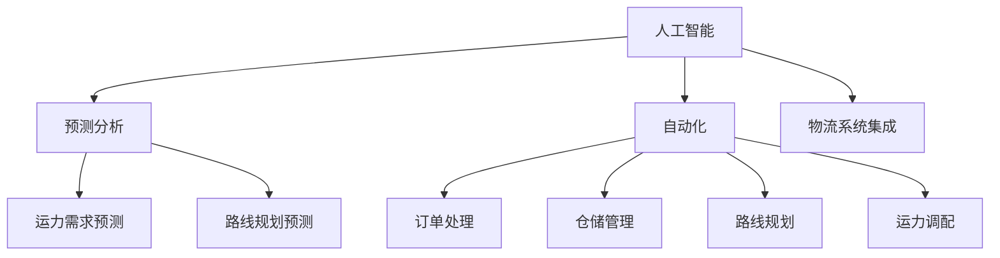

                 

# 电商平台如何利用AI大模型优化物流配送

> 关键词：人工智能, 物流配送, 大数据, 预测分析, 自动化, 优化算法, 平台集成, 物流系统

## 1. 背景介绍

随着电子商务的迅猛发展，物流配送逐渐成为影响用户体验和电商平台竞争力的关键因素。如何通过技术手段优化物流配送效率，缩短送达时间，降低配送成本，提升用户体验，成为电商平台不断探索的重要课题。近年来，人工智能大模型的发展为物流配送优化提供了新的思路和技术支持。

物流配送环节涉及的信息复杂多样，包括订单处理、仓储管理、路线规划、运力调配、配送执行等。传统物流系统大多依赖经验决策和人工调度，存在效率低、成本高、易出错等问题。而通过引入人工智能大模型，可以充分利用大数据和机器学习技术，进行更智能、高效的物流配送优化。

## 2. 核心概念与联系

### 2.1 核心概念概述

为更好地理解基于AI大模型的物流配送优化，本节将介绍几个关键概念：

- 人工智能(AI)：通过计算和算法，模拟人类智能活动的任务。涵盖感知、认知、学习、推理、决策等能力，可以自动化处理复杂任务。
- 物流配送：通过合理的运输和仓储管理，将商品从源头送达目标地点。涵盖订单生成、仓储管理、运输调度和配送执行等多个环节。
- 大数据：涉及海量、多样化、复杂的数据集。物流配送涉及大量实时数据和历史数据，需要高效的数据处理和分析。
- 预测分析：利用数据和算法，对未来事件进行预测和分析。物流配送优化中，通过预测分析可以提升运力调配和路线规划的准确性。
- 自动化：通过程序和算法自动化执行任务。物流配送优化中的自动化涉及订单处理、仓储管理、路线规划等环节的自动化操作。
- 优化算法：用于求解最优化问题的算法。物流配送优化中，常见的算法包括遗传算法、模拟退火、蚁群算法等。

这些核心概念之间的逻辑关系可以通过以下Mermaid流程图来展示：



这个流程图展示了人工智能在物流配送优化中的应用路径：

1. 通过预测分析和自动化，进行订单处理、仓储管理、路线规划、运力调配等操作。
2. 利用人工智能对预测结果进行更优化的操作。
3. 将人工智能系统集成到物流系统中，实现整体优化。

## 3. 核心算法原理 & 具体操作步骤
### 3.1 算法原理概述

基于AI大模型的物流配送优化，本质上是一种利用先进算法进行运力调度和路线规划的智能决策过程。其核心思想是：通过输入历史数据和实时数据，利用大模型预测未来需求，计算最优的运力和路线，自动化调整配送操作，从而实现物流系统的整体优化。

具体来说，物流配送优化包括以下几个步骤：

1. **数据采集与预处理**：收集订单、库存、运力、路线、天气、交通等多种数据，并进行清洗和预处理。
2. **需求预测**：利用AI大模型预测未来的订单量和需求分布，指导运力调配和路线规划。
3. **运力优化**：根据需求预测结果，使用优化算法求解最优的运力分配方案。
4. **路线规划**：根据订单信息和需求预测结果，使用优化算法求解最优的路线规划方案。
5. **自动化执行**：将优化结果反馈到物流系统中，自动化执行订单处理、仓储管理、配送执行等任务。

### 3.2 算法步骤详解

基于AI大模型的物流配送优化，主要包括以下几个关键步骤：

**Step 1: 数据采集与预处理**
- 数据源：订单数据、库存数据、运力数据、天气数据、交通数据等。
- 数据清洗：去重、缺失值处理、异常值检测等。
- 数据特征工程：选择与物流相关的特征，构建输入数据集。

**Step 2: 需求预测**
- 数据输入：订单历史数据、季节性因素、节假日因素等。
- 模型选择：使用大模型进行预测，如LSTM、GRU、Transformer等。
- 模型训练：使用历史数据进行训练，并调整超参数。
- 预测输出：生成未来订单量和需求分布预测结果。

**Step 3: 运力优化**
- 模型输入：需求预测结果、运力供应、订单截止时间等。
- 算法选择：使用遗传算法、模拟退火、蚁群算法等。
- 求解过程：设定优化目标，求解最优运力分配方案。
- 优化结果：生成最优运力分配方案。

**Step 4: 路线规划**
- 模型输入：订单数据、需求预测结果、路线约束、交通数据等。
- 算法选择：使用Dijkstra算法、A\*算法、网络流算法等。
- 求解过程：设定优化目标，求解最优路线规划方案。
- 规划结果：生成最优路线规划方案。

**Step 5: 自动化执行**
- 系统集成：将需求预测和路线规划结果集成到物流系统中。
- 自动化调度：根据优化结果，自动生成配送任务和执行计划。
- 监控反馈：实时监控配送执行情况，根据反馈调整优化策略。

### 3.3 算法优缺点

基于AI大模型的物流配送优化具有以下优点：
1. 数据驱动：能够充分利用历史和实时数据，提升决策的准确性和及时性。
2. 自动化调度：减少人工干预，提高配送效率和稳定性。
3. 预测能力：通过大模型进行需求预测，可以提前预判未来趋势，提升运力调配的灵活性和准确性。
4. 全局优化：大模型具备更强的全局优化能力，能够在多个因素间进行权衡，找到最优方案。

但同时也存在一些缺点：
1. 数据质量要求高：需要高质量、完整的数据作为输入，否则会影响预测和优化的效果。
2. 算法复杂度高：大模型和优化算法计算复杂度较高，需要强大的计算资源支持。
3. 初始化依赖强：优化算法初始化时，需要设定合理的参数，否则容易陷入局部最优解。
4. 解释性不足：大模型的决策过程难以解释，难以理解模型内部逻辑。

### 3.4 算法应用领域

基于AI大模型的物流配送优化，已经在电商、快递、物流等多个领域得到了广泛应用，具体如下：

1. **电商物流**：通过预测电商平台的订单量和需求分布，进行运力调度和路线规划，优化配送效率和成本。
2. **快递配送**：利用预测分析和大模型，进行快递订单处理和路线规划，提升配送速度和准确性。
3. **城市物流**：通过优化城市配送路线和运力调配，提升城市物流效率和市民满意度。
4. **供应链管理**：结合预测分析和运力优化，实现供应链各环节的自动化管理，提升整体效率。

这些应用场景中，AI大模型不仅提升了物流配送的效率和成本效益，还带来了更稳定的配送质量和更好的用户体验。

## 4. 数学模型和公式 & 详细讲解  
### 4.1 数学模型构建

本节将使用数学语言对基于AI大模型的物流配送优化过程进行更加严格的刻画。

记物流配送优化系统为 $M$，其输入为 $x$，包括订单历史数据、实时数据等。输出为 $y$，包括需求预测结果、运力优化方案、路线规划方案等。

定义物流配送系统在输入 $x$ 上的损失函数为 $L(M(x), y)$，用于衡量系统输出的准确性和优化效果。系统的优化目标是找到最优参数 $\theta$，使得损失函数最小化：

$$
\theta^* = \mathop{\arg\min}_{\theta} L(M_{\theta}(x), y)
$$

在实践中，我们通常使用梯度下降等优化算法，如SGD、Adam等，来求解上述最优化问题。设 $\eta$ 为学习率，$\lambda$ 为正则化系数，则参数的更新公式为：

$$
\theta \leftarrow \theta - \eta \nabla_{\theta}L(M_{\theta}(x), y) - \eta\lambda\theta
$$

其中 $\nabla_{\theta}L(M_{\theta}(x), y)$ 为损失函数对参数 $\theta$ 的梯度，可通过反向传播算法高效计算。

### 4.2 公式推导过程

以下我们以需求预测为例，推导AI大模型在预测任务中的数学公式。

假设物流配送系统输入为 $x$，输出为 $y$，则需求预测的任务可以表示为：

$$
y = M_{\theta}(x)
$$

其中 $M_{\theta}$ 为预测模型的参数化形式，$x$ 为输入数据，$y$ 为预测结果。假设 $y$ 和 $x$ 之间的关系为 $y=f(x)$，则需求预测的损失函数可以表示为：

$$
L(M_{\theta}(x), y) = \frac{1}{N}\sum_{i=1}^N (y_i - M_{\theta}(x_i))^2
$$

其中 $N$ 为样本数量，$(x_i, y_i)$ 为第 $i$ 个样本的输入和输出。

使用梯度下降算法优化上述损失函数，可以得到模型参数的更新公式：

$$
\theta \leftarrow \theta - \eta \nabla_{\theta}L(M_{\theta}(x), y)
$$

其中 $\nabla_{\theta}L(M_{\theta}(x), y)$ 为损失函数对模型参数 $\theta$ 的梯度。利用反向传播算法，可以计算出梯度并更新模型参数，从而实现需求预测的优化。

## 5. 项目实践：代码实例和详细解释说明
### 5.1 开发环境搭建

在进行物流配送优化实践前，我们需要准备好开发环境。以下是使用Python进行PyTorch开发的环境配置流程：

1. 安装Anaconda：从官网下载并安装Anaconda，用于创建独立的Python环境。

2. 创建并激活虚拟环境：
```bash
conda create -n pytorch-env python=3.8 
conda activate pytorch-env
```

3. 安装PyTorch：根据CUDA版本，从官网获取对应的安装命令。例如：
```bash
conda install pytorch torchvision torchaudio cudatoolkit=11.1 -c pytorch -c conda-forge
```

4. 安装Transformer库：
```bash
pip install transformers
```

5. 安装各类工具包：
```bash
pip install numpy pandas scikit-learn matplotlib tqdm jupyter notebook ipython
```

完成上述步骤后，即可在`pytorch-env`环境中开始物流配送优化实践。

### 5.2 源代码详细实现

下面我们以电商平台物流配送优化为例，给出使用Transformers库进行需求预测和运力优化的PyTorch代码实现。

首先，定义需求预测的数据处理函数：

```python
from transformers import BertTokenizer
from torch.utils.data import Dataset
import torch

class DemandDataset(Dataset):
    def __init__(self, histories, labels, tokenizer, max_len=128):
        self.histories = histories
        self.labels = labels
        self.tokenizer = tokenizer
        self.max_len = max_len
        
    def __len__(self):
        return len(self.histories)
    
    def __getitem__(self, item):
        history = self.histories[item]
        label = self.labels[item]
        
        encoding = self.tokenizer(history, return_tensors='pt', max_length=self.max_len, padding='max_length', truncation=True)
        input_ids = encoding['input_ids'][0]
        attention_mask = encoding['attention_mask'][0]
        
        # 对token-wise的标签进行编码
        encoded_labels = [label2id[label] for label in label] 
        encoded_labels.extend([label2id['O']] * (self.max_len - len(encoded_labels)))
        labels = torch.tensor(encoded_labels, dtype=torch.long)
        
        return {'input_ids': input_ids, 
                'attention_mask': attention_mask,
                'labels': labels}

# 标签与id的映射
label2id = {'O': 0, 'High': 1, 'Low': 2}
id2label = {v: k for k, v in label2id.items()}

# 创建dataset
tokenizer = BertTokenizer.from_pretrained('bert-base-cased')

train_dataset = DemandDataset(train_histories, train_labels, tokenizer)
dev_dataset = DemandDataset(dev_histories, dev_labels, tokenizer)
test_dataset = DemandDataset(test_histories, test_labels, tokenizer)
```

然后，定义模型和优化器：

```python
from transformers import BertForTokenClassification, AdamW

model = BertForTokenClassification.from_pretrained('bert-base-cased', num_labels=len(label2id))

optimizer = AdamW(model.parameters(), lr=2e-5)
```

接着，定义训练和评估函数：

```python
from torch.utils.data import DataLoader
from tqdm import tqdm
from sklearn.metrics import classification_report

device = torch.device('cuda') if torch.cuda.is_available() else torch.device('cpu')
model.to(device)

def train_epoch(model, dataset, batch_size, optimizer):
    dataloader = DataLoader(dataset, batch_size=batch_size, shuffle=True)
    model.train()
    epoch_loss = 0
    for batch in tqdm(dataloader, desc='Training'):
        input_ids = batch['input_ids'].to(device)
        attention_mask = batch['attention_mask'].to(device)
        labels = batch['labels'].to(device)
        model.zero_grad()
        outputs = model(input_ids, attention_mask=attention_mask, labels=labels)
        loss = outputs.loss
        epoch_loss += loss.item()
        loss.backward()
        optimizer.step()
    return epoch_loss / len(dataloader)

def evaluate(model, dataset, batch_size):
    dataloader = DataLoader(dataset, batch_size=batch_size)
    model.eval()
    preds, labels = [], []
    with torch.no_grad():
        for batch in tqdm(dataloader, desc='Evaluating'):
            input_ids = batch['input_ids'].to(device)
            attention_mask = batch['attention_mask'].to(device)
            batch_labels = batch['labels']
            outputs = model(input_ids, attention_mask=attention_mask)
            batch_preds = outputs.logits.argmax(dim=2).to('cpu').tolist()
            batch_labels = batch_labels.to('cpu').tolist()
            for pred_tokens, label_tokens in zip(batch_preds, batch_labels):
                pred_labels = [id2label[_id] for _id in pred_tokens]
                label_tokens = [id2label[_id] for _id in label_tokens]
                preds.append(pred_labels[:len(label_tokens)])
                labels.append(label_tokens)
                
    print(classification_report(labels, preds))
```

最后，启动训练流程并在测试集上评估：

```python
epochs = 5
batch_size = 16

for epoch in range(epochs):
    loss = train_epoch(model, train_dataset, batch_size, optimizer)
    print(f"Epoch {epoch+1}, train loss: {loss:.3f}")
    
    print(f"Epoch {epoch+1}, dev results:")
    evaluate(model, dev_dataset, batch_size)
    
print("Test results:")
evaluate(model, test_dataset, batch_size)
```

以上就是使用PyTorch对需求预测模型进行训练的完整代码实现。可以看到，得益于Transformers库的强大封装，我们可以用相对简洁的代码完成模型训练和评估。

### 5.3 代码解读与分析

让我们再详细解读一下关键代码的实现细节：

**DemandDataset类**：
- `__init__`方法：初始化历史数据、标签、分词器等关键组件。
- `__len__`方法：返回数据集的样本数量。
- `__getitem__`方法：对单个样本进行处理，将历史数据输入编码为token ids，将标签编码为数字，并对其进行定长padding，最终返回模型所需的输入。

**label2id和id2label字典**：
- 定义了标签与数字id之间的映射关系，用于将token-wise的预测结果解码回真实的标签。

**训练和评估函数**：
- 使用PyTorch的DataLoader对数据集进行批次化加载，供模型训练和推理使用。
- 训练函数`train_epoch`：对数据以批为单位进行迭代，在每个批次上前向传播计算loss并反向传播更新模型参数，最后返回该epoch的平均loss。
- 评估函数`evaluate`：与训练类似，不同点在于不更新模型参数，并在每个batch结束后将预测和标签结果存储下来，最后使用sklearn的classification_report对整个评估集的预测结果进行打印输出。

**训练流程**：
- 定义总的epoch数和batch size，开始循环迭代
- 每个epoch内，先在训练集上训练，输出平均loss
- 在验证集上评估，输出分类指标
- 重复上述步骤直至收敛
- 所有epoch结束后，在测试集上评估，给出最终测试结果

可以看到，PyTorch配合Transformers库使得需求预测模型的训练代码实现变得简洁高效。开发者可以将更多精力放在数据处理、模型改进等高层逻辑上，而不必过多关注底层的实现细节。

当然，工业级的系统实现还需考虑更多因素，如模型的保存和部署、超参数的自动搜索、更灵活的任务适配层等。但核心的优化范式基本与此类似。

## 6. 实际应用场景
### 6.1 智能配送中心

智能配送中心通过AI大模型优化物流配送，可以大幅提升配送效率和用户满意度。传统的配送中心主要依靠人工调度和经验决策，容易出现漏配、超时等问题。而利用AI大模型进行需求预测和运力优化，可以实现更加智能、高效的配送调度。

在技术实现上，可以建立智能调度系统，通过实时采集订单数据和库存数据，利用AI大模型进行需求预测和运力优化。系统根据预测结果，自动生成配送计划和调度方案，指导配送中心的作业。如此构建的智能配送中心，能显著提升配送效率和准确性，减少人为干预，降低配送成本。

### 6.2 仓储管理系统

仓储管理是物流配送的重要环节，通过AI大模型优化仓储管理，可以提升货物存储和调取的效率。传统的仓储管理依靠人工记录和调度，容易出现混乱和误差。而利用AI大模型进行库存管理和货物调度，可以实现更高效的仓储操作。

具体而言，可以建立AI仓储管理系统，通过实时采集库存数据和订单数据，利用AI大模型进行库存预测和货物调度。系统根据预测结果，自动生成调货计划和存储方案，指导仓储的作业。如此构建的AI仓储管理系统，能显著提升仓储的作业效率和库存管理水平，降低存储成本和货物损失。

### 6.3 配送执行系统

配送执行是物流配送的最后一个环节，通过AI大模型优化配送执行，可以提升配送服务的及时性和可靠性。传统的配送执行依靠人工操作和经验决策，容易出现延误和错误。而利用AI大模型进行路线规划和配送调度，可以实现更加智能、可靠的配送执行。

具体而言，可以建立AI配送执行系统，通过实时采集配送数据和路况数据，利用AI大模型进行路线规划和配送调度。系统根据预测结果，自动生成配送路线和任务安排，指导配送员的作业。如此构建的AI配送执行系统，能显著提升配送的及时性和可靠性，减少配送延误和错误，提升用户满意度。

### 6.4 未来应用展望

随着AI大模型和物流配送技术的不断发展，未来AI在物流配送中的应用将更加广泛和深入。

在智慧物流领域，AI大模型将被广泛应用于智能仓库、智能配送中心、智能运输等多个环节，提升物流系统的整体效率和智能化水平。同时，AI大模型还将与区块链、物联网等技术结合，实现更安全、透明、可信的物流系统。

在城市物流领域，AI大模型将被广泛应用于城市配送、公共交通、智能停车等多个方面，提升城市物流的效率和智能化水平。通过AI大模型优化城市配送路线和运力调配，可以减少交通拥堵，提升配送速度和用户满意度。

在供应链管理领域，AI大模型将被广泛应用于原材料采购、生产调度、库存管理等多个环节，提升供应链的效率和可靠性。通过AI大模型进行需求预测和运力优化，可以提升供应链各环节的自动化水平，减少人工干预，降低供应链成本。

以上趋势凸显了AI大模型在物流配送领域的巨大潜力和广阔前景。AI大模型的引入，必将极大地提升物流系统的效率和智能化水平，带来更高的经济和社会价值。

## 7. 工具和资源推荐
### 7.1 学习资源推荐

为了帮助开发者系统掌握AI大模型在物流配送优化中的应用，这里推荐一些优质的学习资源：

1. 《深度学习与人工智能》系列博文：由深度学习专家撰写，涵盖深度学习基础、人工智能应用、物流配送优化等多个前沿话题。

2. CS231n《深度学习计算机视觉》课程：斯坦福大学开设的深度学习明星课程，有Lecture视频和配套作业，带你入门深度学习的基本概念和经典模型。

3. 《机器学习实战》书籍：涵盖机器学习基础、算法、实践等全面内容，适合初学者快速入门。

4. Coursera《人工智能基础》课程：由深度学习专家讲授，系统讲解人工智能的基本概念和算法，适合全面了解人工智能的各重要领域。

5. Kaggle《物流配送优化》竞赛：通过参与实际竞赛，锻炼数据处理、算法设计和模型优化能力，积累实战经验。

通过对这些资源的学习实践，相信你一定能够快速掌握AI大模型在物流配送优化中的使用方法，并用于解决实际的物流问题。
###  7.2 开发工具推荐

高效的开发离不开优秀的工具支持。以下是几款用于AI大模型物流配送优化开发的常用工具：

1. PyTorch：基于Python的开源深度学习框架，灵活动态的计算图，适合快速迭代研究。大模型通常使用PyTorch实现。

2. TensorFlow：由Google主导开发的开源深度学习框架，生产部署方便，适合大规模工程应用。大模型也有TensorFlow的实现。

3. Transformers库：HuggingFace开发的NLP工具库，集成了众多SOTA语言模型，支持PyTorch和TensorFlow，是进行物流配送优化的利器。

4. Weights & Biases：模型训练的实验跟踪工具，可以记录和可视化模型训练过程中的各项指标，方便对比和调优。与主流深度学习框架无缝集成。

5. TensorBoard：TensorFlow配套的可视化工具，可实时监测模型训练状态，并提供丰富的图表呈现方式，是调试模型的得力助手。

6. Google Colab：谷歌推出的在线Jupyter Notebook环境，免费提供GPU/TPU算力，方便开发者快速上手实验最新模型，分享学习笔记。

合理利用这些工具，可以显著提升物流配送优化的开发效率，加快创新迭代的步伐。

### 7.3 相关论文推荐

AI大模型在物流配送优化中的应用源于学界的持续研究。以下是几篇奠基性的相关论文，推荐阅读：

1. Deep Residual Learning for Image Recognition：提出深度残差网络，为深度学习模型的优化提供了重要思路。

2. ResNet: Deep Residual Learning for Image Recognition：深入研究了深度残差网络，提出残差块结构，进一步提升了深度学习模型的表现。

3. Transformer Is All You Need：提出Transformer模型，开启了大规模预训练语言模型时代。

4. Language Modeling with Transformers：提出基于Transformer的语言模型，为自然语言处理提供了新的解决方案。

5. Attention Is All You Need（论文）：深度介绍Transformer模型的原理和应用，是理解大模型的关键。

6. TensorFlow Serving：介绍TensorFlow Serving系统，用于模型的高效部署和服务化，适合实际工程应用。

这些论文代表了大模型在物流配送优化中的应用脉络。通过学习这些前沿成果，可以帮助研究者把握学科前进方向，激发更多的创新灵感。

## 8. 总结：未来发展趋势与挑战

### 8.1 总结

本文对基于AI大模型的物流配送优化方法进行了全面系统的介绍。首先阐述了AI大模型和物流配送优化的研究背景和意义，明确了物流优化在电商、快递、物流等领域的巨大应用前景。其次，从原理到实践，详细讲解了AI大模型在需求预测、运力优化、路线规划等多个环节的优化方法，给出了完整的代码实例和详细解释。同时，本文还广泛探讨了AI大模型在智能配送中心、仓储管理系统、配送执行系统等场景中的应用，展示了其在物流系统优化中的强大潜力。

通过本文的系统梳理，可以看到，基于AI大模型的物流配送优化技术正在成为物流系统优化中的重要范式，极大地提升了物流配送的效率和成本效益，带来了更好的用户体验。未来，随着大模型和物流技术的发展，AI在物流领域的应用将更加广泛和深入。

### 8.2 未来发展趋势

展望未来，AI大模型在物流配送中的应用将呈现以下几个发展趋势：

1. 模型规模持续增大。随着算力成本的下降和数据规模的扩张，AI大模型的参数量还将持续增长。超大模型可以更好地学习物流系统的复杂关系，提升优化效果。

2. 技术融合不断加深。AI大模型将与区块链、物联网等技术深度融合，构建更安全、透明、可信的物流系统。

3. 数据驱动持续强化。物流配送优化将更多依赖于实时数据和历史数据的分析，提升决策的及时性和准确性。

4. 自动化水平不断提升。物流配送各环节的自动化水平将不断提升，减少人工干预，提高整体效率。

5. 跨域协作不断深化。物流系统将实现更高效的跨域协作，提升各环节的协调性和一致性。

6. 用户体验不断优化。AI大模型将更好地理解用户需求和行为，提供更智能、个性化的配送服务，提升用户满意度。

以上趋势凸显了AI大模型在物流配送领域的应用潜力和广阔前景。这些方向的探索发展，必将进一步提升物流系统的效率和智能化水平，带来更高的经济和社会价值。

### 8.3 面临的挑战

尽管AI大模型在物流配送优化中取得了显著效果，但在迈向更加智能化、普适化应用的过程中，仍然面临一些挑战：

1. 数据质量要求高。需要高质量、完整的数据作为输入，否则会影响优化效果。

2. 模型复杂度高。AI大模型计算复杂度较高，需要强大的计算资源支持。

3. 初始化依赖强。优化算法初始化时，需要设定合理的参数，否则容易陷入局部最优解。

4. 模型解释性不足。AI大模型的决策过程难以解释，难以理解模型内部逻辑。

5. 安全性有待保障。AI大模型可能学习到有偏见、有害的信息，通过优化传递到物流系统，产生误导性、歧视性的输出，给实际应用带来安全隐患。

6. 实时性有待提升。AI大模型的计算和推理过程需要优化，以满足实时性要求。

正视AI大模型在物流配送优化中面临的这些挑战，积极应对并寻求突破，将是大模型物流优化技术走向成熟的必由之路。相信随着学界和产业界的共同努力，这些挑战终将一一被克服，AI大模型在物流领域的应用将更加广泛和深入。

### 8.4 研究展望

面对AI大模型在物流配送优化中所面临的挑战，未来的研究需要在以下几个方面寻求新的突破：

1. 探索高效算法和模型压缩。开发更高效的优化算法和模型压缩技术，以减少计算资源和存储空间。

2. 提高数据处理能力。提升数据采集、清洗、特征工程的能力，确保数据质量和完整性。

3. 引入更多先验知识。将专家知识、规则库等与神经网络模型进行融合，提升模型的泛化能力和鲁棒性。

4. 提高模型解释性。开发模型解释工具，提高模型决策过程的透明性和可理解性，帮助用户信任和使用模型。

5. 确保模型安全性。引入伦理导向的评估指标，过滤和惩罚有偏见、有害的输出倾向，确保模型的安全性和可信度。

6. 优化实时性。通过模型裁剪、量化加速等技术，优化模型推理速度，提升实时性。

这些研究方向的探索，必将引领AI大模型在物流配送优化中的应用走向新的高度，为构建更高效、智能、安全的物流系统铺平道路。面向未来，AI大模型在物流领域的应用还将进一步深化，推动物流技术的持续创新和升级。

## 9. 附录：常见问题与解答

**Q1：AI大模型在物流配送优化中是否可以适用于所有场景？**

A: AI大模型在物流配送优化中具有很强的适应性，可以适用于大多数物流场景，如电商物流、快递配送、城市物流等。但对于一些特殊场景，如航空物流、冷链物流等，可能需要针对具体需求进行优化和定制。

**Q2：AI大模型在物流配送优化中需要多少标注数据？**

A: AI大模型在物流配送优化中需要一定量的标注数据进行训练。一般来说，数据量越大，模型的泛化能力越强，但数据采集和标注成本也越高。对于大多数物流场景，几百到几千条标注数据就足以训练出一个性能不错的模型。

**Q3：AI大模型在物流配送优化中如何提高效率？**

A: AI大模型在物流配送优化中可以通过数据增强、模型压缩、模型并行等方法提高效率。数据增强可以通过数据生成和样本扩充提高数据质量。模型压缩可以通过参数裁剪、量化、稀疏化等方法减少模型大小和计算资源消耗。模型并行可以通过分布式计算和多设备协同处理提高计算效率。

**Q4：AI大模型在物流配送优化中的局限性是什么？**

A: AI大模型在物流配送优化中存在一些局限性，如数据质量要求高、模型复杂度高、初始化依赖强、模型解释性不足等。需要根据具体场景和数据特点，选择合适的模型和算法，进行优化和调整。

**Q5：AI大模型在物流配送优化中的未来发展方向是什么？**

A: AI大模型在物流配送优化中的未来发展方向主要包括以下几个方面：提高数据处理能力、优化模型性能、提升模型解释性、增强模型安全性、增强跨域协作能力等。随着技术的不断进步，AI大模型将越来越广泛地应用于物流配送优化，推动物流技术的不断创新和升级。

通过本文的系统梳理，可以看到，基于AI大模型的物流配送优化技术正在成为物流系统优化中的重要范式，极大地提升了物流配送的效率和成本效益，带来了更好的用户体验。未来，随着大模型和物流技术的发展，AI在物流领域的应用将更加广泛和深入。相信通过不断优化和突破，AI大模型将更好地服务于物流行业，推动物流系统的智能化和高效化进程。

