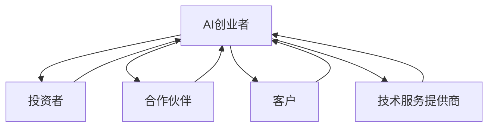

                 

## 1. 背景介绍

在当今快速发展的AI时代，创业者面临着巨大的机遇和挑战。AI技术的进步和应用领域的扩展，为各行各业带来了颠覆性的变化。然而，成功的AI创业并非易事，创业者需要具备深厚的技术功底，敏锐的商业洞察力，以及对市场需求的准确把握。本文将从AI创业者的角度出发，探讨专注于垂直领域的AI创业之路。

## 2. 核心概念与联系

### 2.1 垂直领域的定义

垂直领域（Vertical Industry）是指在特定行业或细分市场内，提供专门解决方案的企业。与水平领域（Horizontal Industry）不同，垂直领域企业深入理解特定行业的业务流程、需求和挑战，从而提供定制化的解决方案。

### 2.2 AI在垂直领域的应用

AI在垂直领域的应用，是指将AI技术应用于特定行业或细分市场，解决该领域独有的业务问题。AI技术可以帮助垂直领域企业提高效率、降低成本、改善客户体验，并开发出新的商业模式。

### 2.3 AI创业者的码头

AI创业者的码头是指AI创业者在垂直领域创业的平台和生态系统。它包括创业者、投资者、合作伙伴、客户、技术服务提供商等各方主体。在这个码头上，AI创业者可以找到资金、技术支持、市场机会，并与其他创业者和行业专家交流合作。



## 3. 核心算法原理 & 具体操作步骤

### 3.1 算法原理概述

在垂直领域应用AI时，常用的算法包括但不限于：监督学习算法（如逻辑回归、决策树、支持向量机）、非监督学习算法（如K-means、DBSCAN）、深度学习算法（如卷积神经网络、循环神经网络）、强化学习算法（如Q学习、SARSA）等。

### 3.2 算法步骤详解

以监督学习算法为例，其操作步骤如下：

1. 数据收集：收集与垂直领域相关的数据，这些数据将用于训练AI模型。
2. 数据预处理：清洗、标记、归一化等预处理操作，以提高数据质量和一致性。
3. 特征工程：提取数据中的关键特征，这些特征将用于训练AI模型。
4. 模型选择：选择适合垂直领域的监督学习算法。
5. 模型训练：使用收集的数据训练AI模型。
6. 模型评估：评估模型的性能，并进行调优。
7. 模型部署：将训练好的模型部署到生产环境中，为垂直领域提供解决方案。

### 3.3 算法优缺点

监督学习算法的优点包括：易于理解、易于实现、可以处理结构化数据。其缺点包括：需要大量标记数据、对特征工程依赖性强、可能出现过拟合等问题。

### 3.4 算法应用领域

监督学习算法在垂直领域的应用包括：预测分析（如销售预测、客户流失预测）、分类（如客户细分、产品分类）、回归（如价格预测、成本预测）等。

## 4. 数学模型和公式 & 详细讲解 & 举例说明

### 4.1 数学模型构建

在垂直领域应用AI时，常用的数学模型包括但不限于：线性回归模型、逻辑回归模型、决策树模型、支持向量机模型等。

### 4.2 公式推导过程

以线性回归模型为例，其公式推导过程如下：

1. 假设目标变量$y$与自变量$x_1, x_2,..., x_n$之间的关系为线性关系，即$y = \beta_0 + \beta_1x_1 + \beta_2x_2 +... + \beta_nx_n + \epsilon$。
2. 其中，$\beta_0, \beta_1,..., \beta_n$为回归系数，$\epsilon$为误差项。
3. 目标是找到最优的回归系数，使得误差平方和最小化，即$\min\sum_{i=1}^{n}(y_i - \hat{y}_i)^2$。
4. 使用最小二乘法求解回归系数，即$\hat{\beta} = (X^TX)^{-1}X^Ty$。
5. 其中，$X$为自变量矩阵，$y$为目标变量向量。

### 4.3 案例分析与讲解

例如，在零售行业，可以使用线性回归模型预测销售额。假设自变量$x_1$为广告支出，$x_2$为促销活动，$x_3$为产品价格，$y$为销售额。通过收集历史数据，可以训练线性回归模型，预测未来的销售额。

## 5. 项目实践：代码实例和详细解释说明

### 5.1 开发环境搭建

在垂直领域应用AI时，常用的开发环境包括：Python、TensorFlow、PyTorch、Scikit-learn等。

### 5.2 源代码详细实现

以下是使用Python和Scikit-learn实现线性回归模型的示例代码：

```python
import numpy as np
from sklearn.linear_model import LinearRegression

# 假设数据
X = np.array([[1], [2], [3], [4], [5]])
y = np.dot(X, np.array([3])) + np.random.randn(5)

# 创建线性回归模型
model = LinearRegression()

# 训练模型
model.fit(X, y)

# 预测新数据
X_new = np.array([[6], [7], [8]])
y_new = model.predict(X_new)

print(y_new)
```

### 5.3 代码解读与分析

在示例代码中，我们首先导入所需的库，并定义自变量和目标变量。然后，我们创建线性回归模型，并使用训练数据训练模型。最后，我们使用新数据预测目标变量的值。

### 5.4 运行结果展示

运行示例代码后，输出的结果为预测的新数据的目标变量值。

## 6. 实际应用场景

### 6.1 当前应用场景

AI在垂直领域的当前应用场景包括：金融行业（如风险评估、欺诈检测）、医疗行业（如疾病诊断、药物发现）、制造业（如设备维护、质量控制）、零售业（如客户细分、库存管理）等。

### 6.2 未来应用展望

未来，AI在垂直领域的应用将会更加广泛和深入。例如，在智慧城市领域，AI可以帮助优化交通、能源管理、环境监测等；在农业领域，AI可以帮助提高作物产量、改善土壤质量、优化灌溉等。

## 7. 工具和资源推荐

### 7.1 学习资源推荐

推荐阅读的书籍包括：《机器学习》《深度学习》《自然语言处理》《计算机视觉》等。推荐观看的在线课程包括：Coursera、Udacity、edX等平台上的AI相关课程。

### 7.2 开发工具推荐

推荐使用的开发工具包括：Jupyter Notebook、TensorFlow、PyTorch、Scikit-learn等。

### 7.3 相关论文推荐

推荐阅读的论文包括：《神经网络与深度学习》《图像分类的新进展》《自然语言处理的新进展》等。

## 8. 总结：未来发展趋势与挑战

### 8.1 研究成果总结

本文从AI创业者的角度出发，探讨了专注于垂直领域的AI创业之路。我们介绍了垂直领域的定义、AI在垂直领域的应用、AI创业者的码头，并详细讲解了监督学习算法的原理、步骤、优缺点和应用领域。此外，我们还介绍了数学模型和公式、项目实践、实际应用场景、工具和资源推荐等内容。

### 8.2 未来发展趋势

未来，AI在垂直领域的应用将会更加广泛和深入。AI创业者需要具备深厚的技术功底、敏锐的商业洞察力和对市场需求的准确把握。垂直领域的AI创业将会涌现出更多的创新和机遇。

### 8.3 面临的挑战

然而，AI创业者也面临着巨大的挑战。这些挑战包括：数据获取和处理、模型训练和评估、算法解释性和可靠性、隐私和安全等。

### 8.4 研究展望

未来的研究方向包括：AI与业务的深度集成、AI与人类智能的结合、AI与物联网的结合、AI与区块链的结合等。AI创业者需要不断学习和创新，才能在激烈的竞争中脱颖而出。

## 9. 附录：常见问题与解答

### 9.1 什么是垂直领域？

垂直领域是指在特定行业或细分市场内，提供专门解决方案的企业。与水平领域不同，垂直领域企业深入理解特定行业的业务流程、需求和挑战，从而提供定制化的解决方案。

### 9.2 AI在垂直领域的优势是什么？

AI在垂直领域的优势包括：提高效率、降低成本、改善客户体验、开发新的商业模式等。

### 9.3 AI创业者的码头是什么？

AI创业者的码头是指AI创业者在垂直领域创业的平台和生态系统。它包括创业者、投资者、合作伙伴、客户、技术服务提供商等各方主体。在这个码头上，AI创业者可以找到资金、技术支持、市场机会，并与其他创业者和行业专家交流合作。

!!!Note
作者：禅与计算机程序设计艺术 / Zen and the Art of Computer Programming

