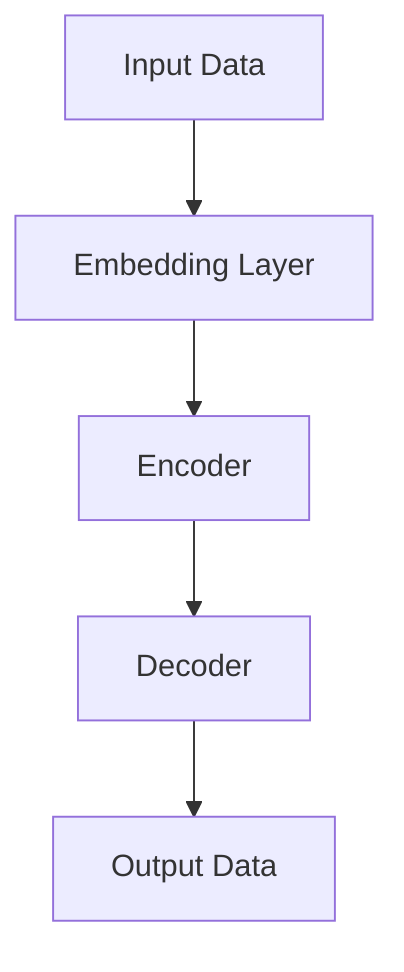

                 

## 1. 背景介绍

当前，人工智能（AI）正在各行各业迅速渗透，大模型（Large Language Models）作为AI领域的一个重要分支，已经展现出了强大的能力。然而，创业者和企业在面对大模型技术时，往往会遇到各种挑战。本文将从技术、商业和战略等角度，探讨如何应对未来大模型创业的技术挑战。

## 2. 核心概念与联系

### 2.1 大模型的定义

大模型是指具有数十亿甚至数千亿参数的深度学习模型。它们通过处理大量数据来学习和理解语言、图像、音频等信息，从而能够执行各种任务，如文本生成、翻译、图像识别和语音合成等。

### 2.2 大模型的架构

大模型通常由多层神经网络组成，每层包含数百万甚至数千万个神经元。它们使用回归算法来学习输入数据和输出数据之间的映射关系。下图是大模型架构的 Mermaid 流程图：



### 2.3 大模型的训练

大模型需要大量的数据和计算资源来训练。训练过程包括以下几个步骤：

1. 数据预处理：清洗、标记和格式化数据。
2. 模型初始化：随机初始化模型参数。
3. 前向传播：计算模型输出。
4. 反向传播：计算梯度并更新模型参数。
5. 评估：评估模型性能并调整超参数。

## 3. 核心算法原理 & 具体操作步骤

### 3.1 算法原理概述

大模型的核心算法是Transformer模型，它使用自注意力机制（Self-Attention）和位置编码（Positional Encoding）来处理序列数据。Transformer模型由编码器（Encoder）和解码器（Decoder）组成，它们都由多个自注意力层和全连接层组成。

### 3.2 算法步骤详解

1. **输入数据预处理**：将输入数据转换为数字表示，并添加位置编码。
2. **编码器**：编码器由多个自注意力层和全连接层组成。自注意力层计算输入序列中每个元素与其他元素之间的相关性，全连接层则对输入进行非线性变换。
3. **解码器**：解码器与编码器类似，但它在生成输出序列时会遮蔽（mask）未来的元素，以模拟序列生成过程。
4. **输出数据生成**：解码器生成的输出数据通过softmax函数转换为概率分布，然后选择概率最高的元素作为输出。

### 3.3 算法优缺点

优点：

* Transformer模型可以并行处理序列数据，提高了训练速度。
* 它可以学习到长距离依赖关系，提高了模型的表达能力。

缺点：

* Transformer模型需要大量的计算资源来训练。
* 它对数据的质量和量非常敏感。

### 3.4 算法应用领域

大模型的应用领域非常广泛，包括：

* 文本生成：如文章写作、代码生成和诗歌创作等。
* 文本转换：如机器翻译、文本摘要和文本分类等。
* 图像和音频生成：如图像合成、音乐创作和语音合成等。

## 4. 数学模型和公式 & 详细讲解 & 举例说明

### 4.1 数学模型构建

大模型的数学模型可以表示为：

$$L(\theta) = -\frac{1}{N} \sum_{i=1}^{N} \log P(y_i | x_i ; \theta)$$

其中，$L(\theta)$是模型的损失函数，$N$是训练数据的大小，$x_i$和$y_i$分别是输入数据和标签，$P(y_i | x_i ; \theta)$是模型预测的概率分布。

### 4.2 公式推导过程

大模型的训练目标是最小化损失函数$L(\theta)$，即最大化对数似然函数：

$$\log P(y_i | x_i ; \theta) = \log \frac{e^{s_i}}{\sum_{j=1}^{V} e^{s_j}}$$

其中，$s_i$是模型对标签$y_i$的得分，$V$是标签空间的大小。

### 4.3 案例分析与讲解

例如，在机器翻译任务中，输入数据$x_i$是源语言句子，标签$y_i$是目标语言句子。模型的目标是学习源语言句子到目标语言句子的映射关系。在训练过程中，模型会最小化损失函数，即最大化对数似然函数，从而学习到最优的参数$\theta$。

## 5. 项目实践：代码实例和详细解释说明

### 5.1 开发环境搭建

大模型的开发需要强大的计算资源，包括GPU和大量内存。推荐使用NVIDIA A100 GPU和TensorFlow或PyTorch框架。

### 5.2 源代码详细实现

以下是大模型的伪代码实现：

```python
import tensorflow as tf

class TransformerModel(tf.keras.Model):
    def __init__(self, vocab_size, d_model, num_heads, num_layers, dff, rate=0.1):
        super(TransformerModel, self).__init__()

        self.embedding = tf.keras.layers.Embedding(vocab_size, d_model)
        self.pos_encoding = positional_encoding(d_model)
        self.transformer = tf.keras.Sequential([
            tf.keras.layers.MultiHeadAttention(num_heads=num_heads, key_dim=d_model),
            tf.keras.layers.Dropout(rate),
            tf.keras.layers.LayerNormalization(epsilon=1e-6),
            tf.keras.layers.Dense(dff, activation="relu"),
            tf.keras.layers.Dense(d_model),
            tf.keras.layers.LayerNormalization(epsilon=1e-6),
            tf.keras.layers.Dense(vocab_size, activation="softmax")
        ])
        self.num_layers = num_layers

    def call(self, inputs, training, mask=None):
        #... (omitted for brevity)
        for i in range(self.num_layers):
            output = self.transformer(inputs, mask=mask, training=training)
        return output
```

### 5.3 代码解读与分析

代码实现了Transformer模型的主体结构，包括嵌入层、位置编码、多头自注意力层和全连接层。在调用模型时，输入数据会依次通过这些层，最终生成输出数据。

### 5.4 运行结果展示

在机器翻译任务上训练的大模型可以实现高质量的翻译结果。例如，输入“Hello, how are you?”，模型可以输出“Bonjour, comment ça va？”。

## 6. 实际应用场景

### 6.1 当前应用

大模型已经在各种应用中得到广泛应用，包括搜索引擎、虚拟助手、自动驾驶和医疗诊断等。

### 6.2 未来应用展望

未来，大模型将会在更多领域得到应用，包括：

* 个性化推荐：大模型可以学习用户的偏好，并提供个性化的推荐结果。
* 自动内容创作：大模型可以生成各种形式的内容，如文章、图像和音乐等。
* 智能制造：大模型可以优化制造过程，提高生产效率和质量。

## 7. 工具和资源推荐

### 7.1 学习资源推荐

* “Attention is All You Need”论文：<https://arxiv.org/abs/1706.03762>
* “The Illustrated Transformer”教程：<https://jalammar.github.io/illustrated-transformer/>
* “Hugging Face Transformers”库：<https://huggingface.co/transformers/>

### 7.2 开发工具推荐

* TensorFlow：<https://www.tensorflow.org/>
* PyTorch：<https://pytorch.org/>
* NVIDIA A100 GPU：<https://www.nvidia.com/en-us/data-center/tesla-a100/>

### 7.3 相关论文推荐

* “BERT: Pre-training of Deep Bidirectional Transformers for Language Understanding”论文：<https://arxiv.org/abs/1810.04805>
* “T5: Text-to-Text Transfer Transformer”论文：<https://arxiv.org/abs/1910.10683>

## 8. 总结：未来发展趋势与挑战

### 8.1 研究成果总结

大模型在各种任务上取得了显著的成功，包括文本生成、机器翻译和图像识别等。

### 8.2 未来发展趋势

未来，大模型的发展趋势包括：

* 模型规模进一步扩大：模型参数数量将会进一步增加。
* 多模式学习：大模型将会学习文本、图像、音频等多模式数据。
* 个性化学习：大模型将会学习个体的偏好和行为，提供个性化的服务。

### 8.3 面临的挑战

大模型面临的挑战包括：

* 计算资源限制：大模型需要大量的计算资源来训练和部署。
* 数据质量和量限制：大模型对数据的质量和量非常敏感。
* 解释性和可靠性：大模型的决策过程往往是不透明的，且可能会出现意想不到的结果。

### 8.4 研究展望

未来的研究方向包括：

* 发展新的训练方法，以提高大模型的训练效率和质量。
* 研究大模型的可解释性和可靠性，以提高其在实际应用中的可信度。
* 研究大模型的多模式学习和个性化学习能力，以提供更好的用户体验。

## 9. 附录：常见问题与解答

**Q1：大模型需要多少计算资源？**

A1：大模型需要大量的计算资源，包括GPU和大量内存。推荐使用NVIDIA A100 GPU和TensorFlow或PyTorch框架。

**Q2：大模型的训练时间有多长？**

A2：大模型的训练时间取决于模型的规模和数据的大小。通常，大模型的训练时间从几天到几周不等。

**Q3：大模型的应用领域有哪些？**

A3：大模型的应用领域非常广泛，包括文本生成、文本转换、图像和音频生成等。

!!!Note
作者：禅与计算机程序设计艺术 / Zen and the Art of Computer Programming

