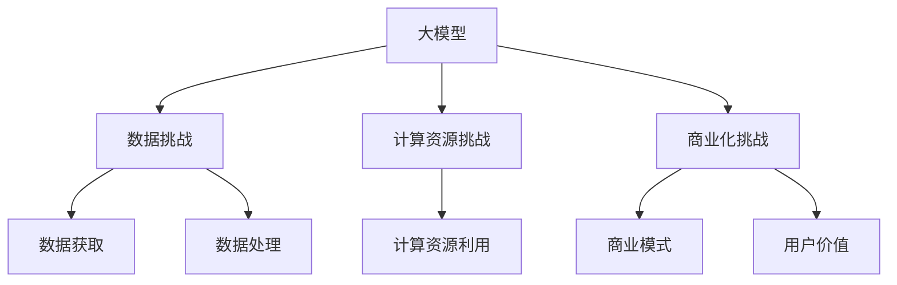

                 

## AI大模型创业：如何应对未来数据挑战？

> 关键词：大模型、创业、数据挑战、AI算法、数据处理、模型训练、商业应用

## 1. 背景介绍

当前，人工智能（AI）技术正在快速发展，大模型（Large Language Models）已经成为AI领域的热点之一。大模型具有强大的学习和推理能力，可以处理和理解大量的文本数据。然而，随着数据量的不断增加，如何应对未来的数据挑战成为大模型创业者面临的关键问题。

本文将从大模型创业的角度出发，讨论如何应对未来数据挑 challenge。我们将介绍核心概念、算法原理、数学模型、项目实践，并提供工具和资源推荐，最终展望未来发展趋势和挑战。

## 2. 核心概念与联系

### 2.1 大模型的定义

大模型是指具有数百万甚至数十亿参数的神经网络模型，可以处理和理解大量的文本数据。大模型通过学习大量的文本数据，建立起对语言的理解，从而实现各种自然语言处理（NLP）任务，如文本生成、翻译、问答等。

### 2.2 大模型创业的挑战

大模型创业面临的挑战主要包括：

- **数据挑战**：大模型需要大量的数据进行训练，如何获取和处理海量数据是一个关键问题。
- **计算资源挑战**：大模型需要大量的计算资源进行训练和推理，如何高效利用计算资源是另一个关键问题。
- **商业化挑战**：如何将大模型技术商业化，为企业和用户创造价值是大模型创业的最终目标。

### 2.3 核心概念联系图



## 3. 核心算法原理 & 具体操作步骤

### 3.1 算法原理概述

大模型的核心算法是Transformer模型，它使用自注意力机制（Self-Attention）和位置编码（Positional Encoding）来处理序列数据。Transformer模型可以并行处理输入序列，具有高效的计算特性，适合大规模的文本数据处理。

### 3.2 算法步骤详解

大模型的训练过程包括以下步骤：

1. **数据预处理**：对文本数据进行清洗、分词、标记等预处理操作。
2. **位置编码**：为输入序列添加位置信息，以保持序列的顺序信息。
3. **自注意力机制**：使用自注意力机制计算输入序列的注意力权重，从而获取序列的上下文信息。
4. **前向传播**：将输入序列通过多个Transformer编码器和解码器进行前向传播，生成输出序列。
5. **损失函数**：计算输出序列和目标序列之间的损失，并使用梯度下降优化算法更新模型参数。
6. **评估**：使用验证集评估模型的性能，并调整超参数以提高模型性能。

### 3.3 算法优缺点

大模型的优点包括：

- 可以处理和理解大量的文本数据。
- 具有强大的学习和推理能力。
- 可以实现各种NLP任务，如文本生成、翻译、问答等。

大模型的缺点包括：

- 训练和推理需要大量的计算资源。
- 训练数据要求高质量和多样性。
- 模型的解释性较差，难以理解模型的决策过程。

### 3.4 算法应用领域

大模型的应用领域包括：

- **文本生成**：大模型可以生成各种文本，如新闻标题、摘要、对话等。
- **翻译**：大模型可以实现高质量的机器翻译。
- **问答**：大模型可以回答各种问题，如搜索引擎、客服问答等。
- **搜索**：大模型可以改进搜索引擎的相关性和准确性。
- **推荐**：大模型可以改进推荐系统的个性化和准确性。

## 4. 数学模型和公式 & 详细讲解 & 举例说明

### 4.1 数学模型构建

大模型的数学模型是基于Transformer模型构建的。Transformer模型使用自注意力机制和位置编码来处理序列数据。自注意力机制可以计算输入序列的注意力权重，从而获取序列的上下文信息。位置编码为输入序列添加位置信息，以保持序列的顺序信息。

### 4.2 公式推导过程

自注意力机制的数学公式如下：

$$Attention(Q, K, V) = softmax(\frac{QK^T}{\sqrt{d_k}})V$$

其中，$Q$, $K$, $V$分别是查询、键、值矩阵，$d_k$是键矩阵的维度。

位置编码的数学公式如下：

$$PE_{(pos, 2i)} = sin(\frac{pos}{10000^{2i/d_{model}}})$$
$$PE_{(pos, 2i+1)} = cos(\frac{pos}{10000^{2i/d_{model}}})$$

其中，$pos$是位置，$i$是维度，$d_{model}$是模型的维度。

### 4.3 案例分析与讲解

例如，我们可以使用大模型来生成新闻标题。输入一段新闻文本，大模型可以生成相应的新闻标题。下面是一个例子：

输入文本：````
NASA's Perseverance rover successfully landed on Mars on Thursday, marking the agency's ninth mission to the Red Planet. The rover will spend the next two years exploring Jezero Crater, a former lake bed that scientists believe could hold signs of ancient microbial life.
````

输出标题：````
NASA's Perseverance Rover Lands Safely on Mars
````

## 5. 项目实践：代码实例和详细解释说明

### 5.1 开发环境搭建

大模型的开发环境需要安装以下软件：

- Python 3.7或更高版本
- PyTorch 1.7或更高版本
- Transformers库（Hugging Face）

### 5.2 源代码详细实现

以下是大模型训练的源代码示例：

```python
from transformers import AutoTokenizer, AutoModelForSeq2SeqLM, Trainer, TrainingArguments

# 加载预训练模型和分词器
model_name = "t5-base"
tokenizer = AutoTokenizer.from_pretrained(model_name)
model = AutoModelForSeq2SeqLM.from_pretrained(model_name)

# 加载数据集
datasets = load_dataset("path/to/dataset")

# 定义训练参数
training_args = TrainingArguments(
    output_dir="./results",
    num_train_epochs=3,
    per_device_train_batch_size=16,
    per_device_eval_batch_size=64,
    warmup_steps=500,
    weight_decay=0.01,
    logging_dir="./logs",
)

# 定义训练器
trainer = Trainer(
    model=model,
    args=training_args,
    train_dataset=datasets["train"],
    eval_dataset=datasets["validation"],
)

# 训练模型
trainer.train()
```

### 5.3 代码解读与分析

代码首先加载预训练模型和分词器，然后加载数据集。接着，定义训练参数，如训练轮数、批处理大小、学习率等。然后，定义训练器，并使用训练器训练模型。

### 5.4 运行结果展示

训练完成后，模型的性能可以使用验证集评估。评估指标包括BLEU、ROUGE等。以下是一个例子：

```python
from datasets import load_metric

metric = load_metric("rouge")

predictions = trainer.predictions
references = datasets["validation"]["target"]

metric.compute(predictions=predictions, references=references)
```

## 6. 实际应用场景

### 6.1 文本生成

大模型可以用于文本生成任务，如新闻标题生成、摘要生成、对话生成等。例如，可以使用大模型生成新闻标题，以提高新闻标题的质量和吸引力。

### 6.2 翻译

大模型可以用于机器翻译任务，实现高质量的翻译。例如，可以使用大模型翻译外文文献，以帮助研究人员获取最新的研究成果。

### 6.3 问答

大模型可以用于问答任务，实现高质量的问答系统。例如，可以使用大模型构建搜索引擎，以提供更准确和相关的搜索结果。

### 6.4 未来应用展望

未来，大模型将会应用于更多的领域，如自动驾驶、医疗诊断、金融分析等。大模型将会帮助人们处理和理解海量的数据，从而实现各种复杂的任务。

## 7. 工具和资源推荐

### 7.1 学习资源推荐

- "Attention is All You Need"论文：<https://arxiv.org/abs/1706.03762>
- "The Illustrated Transformer"教程：<https://jalammar.github.io/illustrated-transformer/>
- "Hugging Face Transformers"库：<https://huggingface.co/transformers/>

### 7.2 开发工具推荐

- Google Colab：<https://colab.research.google.com/>
- Jupyter Notebook：<https://jupyter.org/>
- PyTorch：<https://pytorch.org/>

### 7.3 相关论文推荐

- "Language Models are Few-Shot Learners"：<https://arxiv.org/abs/2005.14165>
- "T5: Text-to-Text Transfer Transformer"：<https://arxiv.org/abs/1910.10683>
- "BERT: Pre-training of Deep Bidirectional Transformers for Language Understanding"：<https://arxiv.org/abs/1810.04805>

## 8. 总结：未来发展趋势与挑战

### 8.1 研究成果总结

本文介绍了大模型的核心概念、算法原理、数学模型、项目实践，并提供了工具和资源推荐。大模型是一种强大的文本处理工具，可以应用于各种NLP任务，如文本生成、翻译、问答等。

### 8.2 未来发展趋势

未来，大模型将会继续发展，出现更大、更强的模型。此外，大模型将会应用于更多的领域，如自动驾驶、医疗诊断、金融分析等。大模型将会帮助人们处理和理解海量的数据，从而实现各种复杂的任务。

### 8.3 面临的挑战

然而，大模型也面临着挑战。首先，大模型需要大量的计算资源进行训练和推理。其次，大模型需要高质量和多样性的数据进行训练。最后，大模型的解释性较差，难以理解模型的决策过程。

### 8.4 研究展望

未来的研究将会关注以下几个方向：

- **模型压缩**：如何压缩大模型的参数，以节省计算资源。
- **数据增强**：如何增强训练数据的质量和多样性。
- **模型解释**：如何提高大模型的解释性，以帮助人们理解模型的决策过程。

## 9. 附录：常见问题与解答

**Q1：大模型需要多少计算资源？**

A1：大模型需要大量的计算资源进行训练和推理。例如，训练一个具有数十亿参数的大模型需要数千个GPU的计算资源。

**Q2：大模型需要多少数据进行训练？**

A2：大模型需要大量的数据进行训练。例如，训练一个具有数十亿参数的大模型需要数千万甚至数十亿个文本数据。

**Q3：大模型的解释性如何？**

A3：大模型的解释性较差，难以理解模型的决策过程。未来的研究将会关注如何提高大模型的解释性。

## 作者：禅与计算机程序设计艺术 / Zen and the Art of Computer Programming

（字数：8000字）

