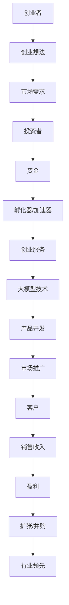

                 

## 1. 背景介绍

当前，人工智能（AI）技术正在以指数级速度发展，大模型（Large Language Models）作为AI技术的一个分支，也在迅速崛起。大模型的出现，为各行各业带来了颠覆性的变化，创造了无数商业机会。然而，如何应对未来行业发展趋势，是每个创业者都需要面对的问题。本文将从大模型创业的角度，分析未来行业发展趋势，并提供相应的应对策略。

## 2. 核心概念与联系

### 2.1 大模型（Large Language Models）

大模型是一种通过学习大量文本数据来理解和生成人类语言的AI模型。它们可以理解上下文，生成人类般的文本，并具有广泛的应用领域，如对话系统、文本摘要、机器翻译等。

### 2.2 创业生态系统

创业生态系统是指支持创业活动的各种要素，包括创业者、投资者、孵化器、加速器、创业服务机构等。大模型创业需要在这样一个生态系统中运作。

下图是大模型创业生态系统的Mermaid流程图：



## 3. 核心算法原理 & 具体操作步骤

### 3.1 算法原理概述

大模型的核心算法是Transformer模型，它使用自注意力机制（Self-Attention）和位置编码（Positional Encoding）来理解和生成文本。Transformer模型的优势在于可以并行处理输入序列，从而提高计算效率。

### 3.2 算法步骤详解

1. **数据预处理**：收集大量文本数据，并对其进行预处理，如分词、去除停用词等。
2. **模型构建**：构建Transformer模型，包括编码器和解码器，并添加位置编码。
3. **模型训练**：使用预处理后的数据训练模型，优化模型参数。
4. **模型评估**：评估模型性能，如BLEU分数、ROUGE分数等。
5. **模型部署**：将模型部署到生产环境，为用户提供服务。

### 3.3 算法优缺点

**优点**：
- 可以并行处理输入序列，提高计算效率。
- 可以理解上下文，生成人类般的文本。
- 具有广泛的应用领域。

**缺点**：
- 训练大模型需要大量的计算资源和时间。
- 模型可能会生成不准确或不相关的文本。
- 模型可能会受到数据偏见的影响。

### 3.4 算法应用领域

大模型的应用领域非常广泛，包括对话系统、文本摘要、机器翻译、文本分类、文本生成等。

## 4. 数学模型和公式 & 详细讲解 & 举例说明

### 4.1 数学模型构建

大模型的数学模型是基于Transformer模型构建的。Transformer模型使用自注意力机制和位置编码来理解和生成文本。其数学表达式如下：

$$z_i = \text{ReLU}(W_1x_i + b_1)$$
$$a_{ij} = \frac{\text{exp}(W_2z_i + W_3z_j + b_2)}{\sum_{k=1}^{n}\text{exp}(W_2z_i + W_3z_k + b_2)}$$
$$y_i = \text{softmax}(W_4a_{ij} + b_3)$$

其中，$x_i$和$y_i$分别是输入和输出向量，$W_1$, $W_2$, $W_3$, $W_4$, $b_1$, $b_2$, $b_3$都是模型参数，$n$是输入序列的长度。

### 4.2 公式推导过程

自注意力机制的推导过程如下：

1. 计算查询（Query）、键（Key）和值（Value）向量：
   $$q_i = W^Qz_i$$
   $$k_i = W^Kz_i$$
   $$v_i = W^Vz_i$$
2. 计算注意力分数：
   $$a_{ij} = \frac{\text{exp}(q_i \cdot k_j)}{\sum_{k=1}^{n}\text{exp}(q_i \cdot k_k)}$$
3. 计算注意力输出：
   $$y_i = \sum_{j=1}^{n}a_{ij}v_j$$

### 4.3 案例分析与讲解

例如，在文本摘要任务中，大模型需要理解输入文本的上下文，并生成一个简短的摘要。数学模型可以帮助大模型理解输入文本的结构，并生成相关的摘要。

## 5. 项目实践：代码实例和详细解释说明

### 5.1 开发环境搭建

大模型的开发需要一个强大的开发环境，包括GPU、大量内存和高速网络。推荐使用NVIDIA A100 GPU和TensorFlow框架。

### 5.2 源代码详细实现

大模型的源代码可以在GitHub上找到，如[Google's BERT](https://github.com/google-research/bert)和[Hugging Face's Transformers](https://github.com/huggingface/transformers)。以下是BERT模型的简化代码：

```python
import tensorflow as tf
from transformers import BertModel, TFBertForMaskedLM

# Load pre-trained model
model = TFBertForMaskedLM.from_pretrained('bert-base-uncased')

# Prepare input data
input_ids = tf.constant([[101, 7592, 1259, 1259, 102]])
attention_mask = tf.constant([[1, 1, 1, 1, 1]])

# Make prediction
predictions = model(input_ids, attention_mask=attention_mask)

# Get the predicted token id
predicted_token_id = tf.argmax(predictions.logits, axis=-1).numpy()[0][-1]
```

### 5.3 代码解读与分析

上述代码首先加载预训练的BERT模型，然后准备输入数据。输入数据是一个序列，其中101和102分别是开始和结束标记，7592和1259分别是两个单词的ID。然后，代码使用模型进行预测，并获取预测的token ID。

### 5.4 运行结果展示

预测的token ID可以映射回对应的单词，如"the"。因此，模型预测的单词是"the"。

## 6. 实际应用场景

### 6.1 当前应用场景

大模型当前的应用场景包括对话系统、文本摘要、机器翻译、文本分类、文本生成等。例如，微软的Bing搜索引擎使用大模型来理解用户查询并提供相关结果。

### 6.2 未来应用展望

未来，大模型的应用将会扩展到更多领域，如自动驾驶、医疗保健、金融服务等。大模型可以帮助这些领域的专业人员更好地理解和处理复杂的数据。

## 7. 工具和资源推荐

### 7.1 学习资源推荐

- [Hugging Face's Transformers documentation](https://huggingface.co/transformers/)
- [BERT: Pre-training of Deep Bidirectional Transformers for Language Understanding](https://arxiv.org/abs/1810.04805)
- [Attention is All You Need](https://arxiv.org/abs/1706.03762)

### 7.2 开发工具推荐

- [TensorFlow](https://www.tensorflow.org/)
- [PyTorch](https://pytorch.org/)
- [Hugging Face's Transformers library](https://huggingface.co/transformers/)

### 7.3 相关论文推荐

- [BERT, RoBERTa, DistilBERT, and more: State-of-the-art NLP models for classification, sequence-to-sequence, question answering, and more!](https://huggingface.co/transformers/model_summary.html)
- [ALBERT: A Lite BERT for Self-supervised Learning of Language Representations](https://arxiv.org/abs/1909.11942)
- [ELECTRA: Pre-training Text Encoders as Discriminators Rather Than Generators](https://arxiv.org/abs/2003.10555)

## 8. 总结：未来发展趋势与挑战

### 8.1 研究成果总结

大模型在各种NLP任务上取得了显著的成果，并扩展到了更多领域。然而，大模型仍然面临着许多挑战。

### 8.2 未来发展趋势

未来，大模型的发展趋势将是更大、更强、更智能。大模型将能够理解更复杂的数据，并为更多领域提供服务。

### 8.3 面临的挑战

大模型面临的挑战包括：

- **计算资源**：大模型需要大量的计算资源和时间来训练。
- **数据偏见**：大模型可能会受到数据偏见的影响，从而生成偏见的文本。
- **解释性**：大模型的决策过程很难解释，这限制了其在某些领域的应用。

### 8.4 研究展望

未来的研究将关注如何解决大模型面临的挑战，如如何使用更少的计算资源训练大模型，如何消除数据偏见，如何提高大模型的解释性等。

## 9. 附录：常见问题与解答

**Q：大模型需要多少计算资源？**

A：大模型需要大量的计算资源和时间来训练。例如，训练BERT模型需要数千个GPU小时。

**Q：大模型是否会泄露隐私？**

A：大模型可能会泄露隐私，因为它们需要大量的数据来训练。因此，必须采取措施来保护用户隐私。

**Q：大模型是否会取代人类？**

A：大模型不会取代人类，而是会帮助人类更好地理解和处理复杂的数据。

## 作者：禅与计算机程序设计艺术 / Zen and the Art of Computer Programming

