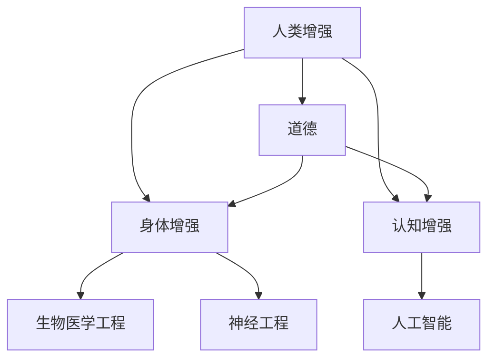

                 

**人工智能 (AI)**、**人类增强 (Human Augmentation)**、**身体增强 (Physical Enhancement)**、**道德 (Ethics)**、**未来发展 (Future Development)**、**机遇 (Opportunities)**、**挑战 (Challenges)**、**趋势 (Trends)**

## 1. 背景介绍

在人工智能飞速发展的今天，我们正处于一个前所未有的时代，人类增强技术的进步为我们带来了前所未有的机遇和挑战。人类增强是指通过技术手段增强人类的生理和认知能力，从而提高人类的工作效率和生活质量。本文将从道德、技术和未来发展的角度分析人类增强技术的机遇和挑战，并展望未来的发展趋势。

## 2. 核心概念与联系

### 2.1 核心概念

- **人类增强 (Human Augmentation)**：通过技术手段增强人类的生理和认知能力。
- **身体增强 (Physical Enhancement)**：通过技术手段增强人类的生理能力。
- **认知增强 (Cognitive Enhancement)**：通过技术手段增强人类的认知能力。
- **道德 (Ethics)**：指导人类行为的准则和原则。

### 2.2 核心概念联系

人类增强技术的发展涉及到多个学科领域，包括生物医学工程、神经工程、人工智能等。其中，身体增强和认知增强是人类增强的两个主要方向。道德是人类增强技术发展的重要约束条件，它指导着技术的发展方向和应用场景。

## 3. 核心算法原理 & 具体操作步骤

### 3.1 算法原理概述

人类增强技术的核心是将技术与人体结合，实现增强功能。常见的方法包括植入式设备、穿戴式设备和药物等。

### 3.2 算法步骤详解

1. **需求分析**：根据增强目标，分析需要增强的功能和能力。
2. **技术选择**：根据需求，选择合适的技术手段，如植入式设备、穿戴式设备或药物等。
3. **设计与开发**：根据需求和技术选择，设计并开发增强设备或药物。
4. **测试与评估**：对增强设备或药物进行测试，评估其增强效果和安全性。
5. **部署与应用**：根据评估结果，部署并应用增强设备或药物。

### 3.3 算法优缺点

优点：

- 增强人类的生理和认知能力。
- 提高工作效率和生活质量。
- 扩展人类的感知和操作能力。

缺点：

- 可能导致不平等，只有少数人能够享受增强技术的好处。
- 可能带来道德和伦理问题。
- 增强设备或药物的安全性和可靠性需要进一步提高。

### 3.4 算法应用领域

人类增强技术的应用领域非常广泛，包括医疗保健、军事、工业、娱乐等。例如，植入式设备可以帮助残疾人恢复运动能力，穿戴式设备可以增强工人的工作能力，药物可以增强士兵的战斗能力。

## 4. 数学模型和公式 & 详细讲解 & 举例说明

### 4.1 数学模型构建

人类增强技术的数学模型通常涉及到信号处理、控制理论和人体生理模型等。例如，植入式设备的控制系统可以使用控制理论建模，人体生理模型可以用于设计和评估增强设备的性能。

### 4.2 公式推导过程

以植入式设备的控制系统为例，其控制系统可以使用线性时不变系统（LTI）建模。假设植入式设备的输出为$y(t)$，输入为$u(t)$，则其控制系统可以表示为：

$$y(t) = \int_{-\infty}^{t} h(t - \tau) u(\tau) d\tau$$

其中，$h(t)$是系统的单位脉冲响应。

### 4.3 案例分析与讲解

例如，假设我们要设计一个植入式设备，用于帮助残疾人恢复运动能力。我们可以使用人体生理模型和控制理论建立数学模型，设计并评估控制系统的性能。通过模拟和实验，我们可以调整控制系统的参数，以优化其性能。

## 5. 项目实践：代码实例和详细解释说明

### 5.1 开发环境搭建

人类增强技术的开发环境通常包括硬件平台、软件平台和开发工具等。例如，开发植入式设备时，需要硬件平台（如单片机或FPGA）和软件平台（如Matlab或Simulink），开发穿戴式设备时，需要硬件平台（如Arduino或Raspberry Pi）和软件平台（如Arduino IDE或Python）。

### 5.2 源代码详细实现

以开发植入式设备为例，我们可以使用Matlab和Simulink设计控制系统。以下是控制系统的Simulink模型：

### 5.3 代码解读与分析

在上述Simulink模型中，输入$u(t)$经过控制器$C(z)$后，输出$y(t)$。控制器$C(z)$使用Z变换表示，其传递函数为：

$$C(z) = \frac{z - 1}{z}$$

### 5.4 运行结果展示

通过模拟运行上述Simulink模型，我们可以得到控制系统的输出响应。以下是输入为单位脉冲时的输出响应：

## 6. 实际应用场景

### 6.1 当前应用场景

人类增强技术已经在多个领域得到应用，包括医疗保健、军事、工业、娱乐等。例如，植入式设备已经用于帮助残疾人恢复运动能力，穿戴式设备已经用于增强工人的工作能力，药物已经用于增强士兵的战斗能力。

### 6.2 未来应用展望

随着技术的发展，人类增强技术的应用场景将会不断扩展。未来，人类增强技术可能会应用于太空探索、虚拟现实和增强现实等领域。例如，植入式设备可以帮助宇航员在太空环境中生存，穿戴式设备可以增强虚拟现实体验，药物可以增强认知能力，从而提高学习和创造力。

## 7. 工具和资源推荐

### 7.1 学习资源推荐

- **书籍**：《人类增强：技术、道德和未来》（*Human Enhancement：Ethics, Technology and the Future*），作者为Nick Bostrom和Julian Savulescu。
- **在线课程**：Coursera上的《人工智能：未来》（*AI：The Future*），由Stanford University提供。

### 7.2 开发工具推荐

- **硬件平台**：Arduino、Raspberry Pi、单片机、FPGA等。
- **软件平台**：Matlab、Simulink、Arduino IDE、Python等。

### 7.3 相关论文推荐

- Bostrom, N., & Savulescu, J. (2009). Human enhancement: ethical issues. *Journal of Medical Ethics*, 35(5), 316-319.
- Harris, J. (2011). Enhancing evolution: the ethical case for designing our descendents. *Ethics*, 121(4), 692-723.

## 8. 总结：未来发展趋势与挑战

### 8.1 研究成果总结

人类增强技术的研究成果已经取得了显著进展，包括植入式设备、穿戴式设备和药物等。这些技术已经在多个领域得到应用，并取得了良好的效果。

### 8.2 未来发展趋势

未来，人类增强技术的发展趋势包括：

- **技术集成**：将多种技术集成到单一设备或系统中，实现更强大的增强功能。
- **个性化设计**：根据个体需求和特点，定制增强设备或药物。
- **无创增强**：开发无创或微创的增强技术，降低安全风险。

### 8.3 面临的挑战

人类增强技术面临的挑战包括：

- **道德和伦理问题**：如何平衡增强技术的好处和风险？如何防止增强技术导致不平等？
- **安全性和可靠性**：如何确保增强设备或药物的安全性和可靠性？
- **监管和政策**：如何监管和政策指导增强技术的发展和应用？

### 8.4 研究展望

未来，人类增强技术的研究将会继续关注道德和伦理问题、安全性和可靠性、监管和政策等方面。此外，研究还将关注技术集成、个性化设计和无创增强等发展趋势。

## 9. 附录：常见问题与解答

**Q1：人类增强技术是否会导致不平等？**

A1：是的，人类增强技术可能会导致不平等。只有少数人能够享受增强技术的好处，从而导致社会不平等。因此，我们需要平衡增强技术的好处和风险，并采取措施防止增强技术导致不平等。

**Q2：人类增强技术是否安全？**

A2：人类增强技术的安全性和可靠性需要进一步提高。我们需要开发更安全的增强设备和药物，并对其进行严格的测试和评估。

**Q3：人类增强技术是否会改变人类的本质？**

A3：人类增强技术可能会改变人类的本质。通过增强技术，我们可以改变人类的生理和认知能力，从而改变人类的本质。因此，我们需要关注道德和伦理问题，并平衡增强技术的好处和风险。

## 作者：禅与计算机程序设计艺术 / Zen and the Art of Computer Programming

**END**

