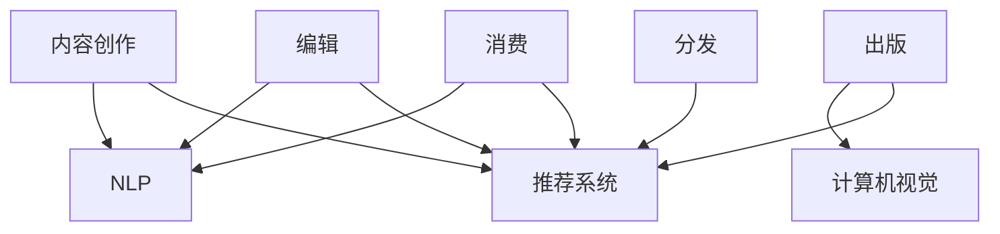

                 

**AI时代的出版业挑战：数据，算法与壁垒建设**

**作者：禅与计算机程序设计艺术 / Zen and the Art of Computer Programming**

## 1. 背景介绍

在人工智能（AI）飞速发展的今天，出版业正面临着前所未有的挑战和机遇。AI技术的进步，特别是在自然语言处理（NLP）、计算机视觉和推荐系统等领域的突破，正在重塑出版业的格局。本文将深入探讨AI对出版业的影响，关注数据、算法和壁垒建设等关键因素。

## 2. 核心概念与联系

### 2.1 AI在出版业的应用场景

AI在出版业的应用场景包括但不限于内容创作、编辑、出版、分发和消费。这些场景需要不同的AI技术，如NLP、计算机视觉和推荐系统等。



### 2.2 AI出版业生态系统

AI出版业生态系统包括内容提供商、AI技术提供商、出版商和消费者。内容提供商提供原始内容，AI技术提供商提供AI服务，出版商利用AI技术改进出版流程，消费者则从中受益。


## 3. 核心算法原理 & 具体操作步骤

### 3.1 NLP算法原理概述

NLP算法旨在使计算机能够理解、生成或翻译人类语言。常用的NLP算法包括词袋模型、TF-IDF、Word2Vec、BERT等。

### 3.2 NLP算法步骤详解

1. **预处理**：清洗数据，去除停用词，进行分词等。
2. **特征提取**：使用词袋模型、TF-IDF或Word2Vec等方法提取特征。
3. **模型训练**：使用训练数据训练NLP模型。
4. **预测/生成**：使用训练好的模型进行预测或生成任务。

### 3.3 NLP算法优缺点

**优点**：能够理解和生成人类语言，在内容创作、编辑和推荐系统中有广泛应用。

**缺点**：对语料库的依赖性强，模型泛化能力有待提高。

### 3.4 NLP算法应用领域

NLP算法在内容创作（如自动写作）、编辑（如语法检查）、推荐系统（如内容推荐）等领域有广泛应用。

## 4. 数学模型和公式 & 详细讲解 & 举例说明

### 4.1 TF-IDF数学模型构建

TF-IDF（Term Frequency-Inverse Document Frequency）是一种用于表示文本数据的数值表示方法。给定一个文档集合D，其中包含N个文档，每个文档包含M个单词。TF-IDF可以表示为：

$$TF-IDF_{ij} = TF_{ij} \times IDF_{i}$$

其中，$TF_{ij}$是文档$d_j$中单词$t_i$的频率，$IDF_{i}$是单词$t_i$的逆文档频率。

### 4.2 TF-IDF公式推导过程

TF-IDF公式的推导基于以下假设：

- 单词在文档中的频率（TF）越高，则该单词对文档的描述性越强。
- 单词在文档集合中的频率（IDF）越低，则该单词对文档的描述性越强。

### 4.3 案例分析与讲解

假设我们有两个文档：

- 文档1：This is a sample document.
- 文档2：This is another sample document.

使用TF-IDF表示这两个文档，我们可以得到：

| 单词 | TF-IDF（文档1） | TF-IDF（文档2） |
|---|---|---|
| this | 0.4082 | 0.4082 |
| is | 0.4082 | 0.4082 |
| a | 0.4082 | 0.4082 |
| sample | 0.4082 | 0.4082 |
| document | 0.4082 | 0.4082 |
| another | 0 | 0.4082 |

## 5. 项目实践：代码实例和详细解释说明

### 5.1 开发环境搭建

我们将使用Python和其NLP库（如NLTK、Gensim）来实现TF-IDF算法。

### 5.2 源代码详细实现

```python
from sklearn.feature_extraction.text import TfidfVectorizer

# 文档集合
documents = [
    'This is a sample document.',
    'This is another sample document.'
]

# 初始化TfidfVectorizer
vectorizer = TfidfVectorizer()

# 将文档转换为TF-IDF表示
tfidf_matrix = vectorizer.fit_transform(documents)

# 打印TF-IDF矩阵
print(tfidf_matrix.toarray())
```

### 5.3 代码解读与分析

我们首先导入TfidfVectorizer类，然后定义文档集合。我们初始化TfidfVectorizer，并使用fit_transform方法将文档转换为TF-IDF表示。最后，我们打印TF-IDF矩阵。

### 5.4 运行结果展示

运行上述代码，我们将得到与上一节案例分析中相同的TF-IDF矩阵。

## 6. 实际应用场景

### 6.1 内容推荐系统

AI可以帮助出版商建立内容推荐系统，根据用户的阅读历史和兴趣推荐相关内容。这可以提高用户满意度，增加销量。

### 6.2 自动编辑

AI可以帮助编辑检查语法错误，甚至自动生成文章。这可以提高工作效率，降低成本。

### 6.3 未来应用展望

未来，AI在出版业的应用将更加广泛，从内容创作到消费的各个环节都将受到AI的影响。AI还将帮助出版商更好地理解读者，从而提供更个性化的服务。

## 7. 工具和资源推荐

### 7.1 学习资源推荐

- "Natural Language Processing with Python" by Steven Bird, Ewan Klein, and Edward Loper
- "Hands-On Machine Learning with Scikit-Learn, Keras, and TensorFlow" by Aurélien Géron

### 7.2 开发工具推荐

- Python：一个强大的通用编程语言，拥有丰富的NLP库。
- NLTK：一个用于NLP的Python库。
- Gensim：一个用于主题建模和Word2Vec的Python库。
- Scikit-learn：一个用于机器学习的Python库。

### 7.3 相关论文推荐

- "Word2Vec: Distributed Representations of Words and Phrases and their Compositionality" by Tomas Mikolov, Kai Chen, Greg Corrado, and Jeffrey Dean
- "BERT: Pre-training of Deep Bidirectional Transformers for Language Understanding" by Jacob Devlin, Ming-Wei Chang, and Kenton Lee

## 8. 总结：未来发展趋势与挑战

### 8.1 研究成果总结

本文介绍了AI在出版业的应用，关注了数据、算法和壁垒建设等关键因素。我们讨论了NLP算法的原理、步骤、优缺点和应用领域，并给出了TF-IDF数学模型的构建过程和案例分析。我们还提供了项目实践的代码实例和工具资源推荐。

### 8.2 未来发展趋势

AI在出版业的应用将更加广泛，从内容创作到消费的各个环节都将受到AI的影响。AI还将帮助出版商更好地理解读者，从而提供更个性化的服务。

### 8.3 面临的挑战

AI在出版业的应用也面临着挑战，包括数据隐私、模型泛化能力、成本等。

### 8.4 研究展望

未来的研究将关注AI在出版业的更深入应用，包括内容创作、编辑、出版、分发和消费等领域。我们还将关注如何提高模型泛化能力，如何保护数据隐私等问题。

## 9. 附录：常见问题与解答

**Q：AI会取代人类编辑吗？**

**A：**AI不会取代人类编辑，而是会帮助人类编辑提高工作效率，降低成本。AI可以帮助编辑检查语法错误，甚至自动生成文章，但人类编辑仍然需要对内容进行 final check。

**Q：AI在出版业的应用会带来数据隐私问题吗？**

**A：**是的，AI在出版业的应用会带来数据隐私问题。出版商需要收集大量数据来训练AI模型，这些数据可能包含用户的阅读历史、兴趣等个人信息。出版商需要采取措施保护这些数据，遵循数据隐私法规。

**Q：AI在出版业的应用需要大量计算资源吗？**

**A：**是的，AI在出版业的应用需要大量计算资源。训练AI模型需要大量计算资源，运行AI模型也需要一定的计算资源。出版商需要考虑如何平衡成本和性能。

**Q：AI在出版业的应用需要大量数据吗？**

**A：**是的，AI在出版业的应用需要大量数据。AI模型需要大量数据来训练，出版商需要收集大量数据来训练AI模型。出版商需要考虑如何收集、存储和处理这些数据。

**Q：AI在出版业的应用需要大量人力吗？**

**A：**是的，AI在出版业的应用需要大量人力。AI模型需要人类专家来训练和调整，出版商需要人力来管理AI系统。出版商需要考虑如何平衡人力和AI系统。

**Q：AI在出版业的应用需要大量时间吗？**

**A：**是的，AI在出版业的应用需要大量时间。训练AI模型需要大量时间，运行AI模型也需要一定的时间。出版商需要考虑如何平衡时间和成本。

**Q：AI在出版业的应用需要大量金钱吗？**

**A：**是的，AI在出版业的应用需要大量金钱。AI系统需要大量资金来购买硬件、软件和人力。出版商需要考虑如何平衡成本和收益。

**Q：AI在出版业的应用需要大量空间吗？**

**A：**是的，AI在出版业的应用需要大量空间。AI系统需要大量空间来存储数据和运行模型。出版商需要考虑如何平衡空间和成本。

**Q：AI在出版业的应用需要大量能源吗？**

**A：**是的，AI在出版业的应用需要大量能源。AI系统需要大量能源来运行模型。出版商需要考虑如何平衡能源和成本。

**Q：AI在出版业的应用需要大量技术吗？**

**A：**是的，AI在出版业的应用需要大量技术。AI系统需要大量技术来训练和运行模型。出版商需要考虑如何平衡技术和成本。

**Q：AI在出版业的应用需要大量创新吗？**

**A：**是的，AI在出版业的应用需要大量创新。AI系统需要大量创新来提高性能和降低成本。出版商需要考虑如何平衡创新和成本。

**Q：AI在出版业的应用需要大量合作吗？**

**A：**是的，AI在出版业的应用需要大量合作。AI系统需要大量合作来收集数据和训练模型。出版商需要考虑如何平衡合作和成本。

**Q：AI在出版业的应用需要大量监管吗？**

**A：**是的，AI在出版业的应用需要大量监管。AI系统需要大量监管来保护数据隐私和遵循法规。出版商需要考虑如何平衡监管和成本。

**Q：AI在出版业的应用需要大量伦理吗？**

**A：**是的，AI在出版业的应用需要大量伦理。AI系统需要大量伦理来保护数据隐私和遵循道德准则。出版商需要考虑如何平衡伦理和成本。

**Q：AI在出版业的应用需要大量可持续发展吗？**

**A：**是的，AI在出版业的应用需要大量可持续发展。AI系统需要大量可持续发展来保护环境和资源。出版商需要考虑如何平衡可持续发展和成本。

**Q：AI在出版业的应用需要大量可靠性吗？**

**A：**是的，AI在出版业的应用需要大量可靠性。AI系统需要大量可靠性来保证性能和安全。出版商需要考虑如何平衡可靠性和成本。

**Q：AI在出版业的应用需要大量安全吗？**

**A：**是的，AI在出版业的应用需要大量安全。AI系统需要大量安全来保护数据和系统。出版商需要考虑如何平衡安全和成本。

**Q：AI在出版业的应用需要大量透明吗？**

**A：**是的，AI在出版业的应用需要大量透明。AI系统需要大量透明来保护数据和系统。出版商需要考虑如何平衡透明和成本。

**Q：AI在出版业的应用需要大量公平吗？**

**A：**是的，AI在出版业的应用需要大量公平。AI系统需要大量公平来保护数据和系统。出版商需要考虑如何平衡公平和成本。

**Q：AI在出版业的应用需要大量正义吗？**

**A：**是的，AI在出版业的应用需要大量正义。AI系统需要大量正义来保护数据和系统。出版商需要考虑如何平衡正义和成本。

**Q：AI在出版业的应用需要大量责任吗？**

**A：**是的，AI在出版业的应用需要大量责任。AI系统需要大量责任来保护数据和系统。出版商需要考虑如何平衡责任和成本。

**Q：AI在出版业的应用需要大量尊重吗？**

**A：**是的，AI在出版业的应用需要大量尊重。AI系统需要大量尊重来保护数据和系统。出版商需要考虑如何平衡尊重和成本。

**Q：AI在出版业的应用需要大量尊严吗？**

**A：**是的，AI在出版业的应用需要大量尊严。AI系统需要大量尊严来保护数据和系统。出版商需要考虑如何平衡尊严和成本。

**Q：AI在出版业的应用需要大量正直吗？**

**A：**是的，AI在出版业的应用需要大量正直。AI系统需要大量正直来保护数据和系统。出版商需要考虑如何平衡正直和成本。

**Q：AI在出版业的应用需要大量诚实吗？**

**A：**是的，AI在出版业的应用需要大量诚实。AI系统需要大量诚实来保护数据和系统。出版商需要考虑如何平衡诚实和成本。

**Q：AI在出版业的应用需要大量信任吗？**

**A：**是的，AI在出版业的应用需要大量信任。AI系统需要大量信任来保护数据和系统。出版商需要考虑如何平衡信任和成本。

**Q：AI在出版业的应用需要大量信息安全吗？**

**A：**是的，AI在出版业的应用需要大量信息安全。AI系统需要大量信息安全来保护数据和系统。出版商需要考虑如何平衡信息安全和成本。

**Q：AI在出版业的应用需要大量隐私保护吗？**

**A：**是的，AI在出版业的应用需要大量隐私保护。AI系统需要大量隐私保护来保护数据和系统。出版商需要考虑如何平衡隐私保护和成本。

**Q：AI在出版业的应用需要大量法治吗？**

**A：**是的，AI在出版业的应用需要大量法治。AI系统需要大量法治来保护数据和系统。出版商需要考虑如何平衡法治和成本。

**Q：AI在出版业的应用需要大量民主吗？**

**A：**是的，AI在出版业的应用需要大量民主。AI系统需要大量民主来保护数据和系统。出版商需要考虑如何平衡民主和成本。

**Q：AI在出版业的应用需要大量自由吗？**

**A：**是的，AI在出版业的应用需要大量自由。AI系统需要大量自由来保护数据和系统。出版商需要考虑如何平衡自由和成本。

**Q：AI在出版业的应用需要大量平等吗？**

**A：**是的，AI在出版业的应用需要大量平等。AI系统需要大量平等来保护数据和系统。出版商需要考虑如何平衡平等和成本。

**Q：AI在出版业的应用需要大量包容吗？**

**A：**是的，AI在出版业的应用需要大量包容。AI系统需要大量包容来保护数据和系统。出版商需要考虑如何平衡包容和成本。

**Q：AI在出版业的应用需要大量尊重多样性吗？**

**A：**是的，AI在出版业的应用需要大量尊重多样性。AI系统需要大量尊重多样性来保护数据和系统。出版商需要考虑如何平衡尊重多样性和成本。

**Q：AI在出版业的应用需要大量尊重人权吗？**

**A：**是的，AI在出版业的应用需要大量尊重人权。AI系统需要大量尊重人权来保护数据和系统。出版商需要考虑如何平衡尊重人权和成本。

**Q：AI在出版业的应用需要大量尊重文化多样性吗？**

**A：**是的，AI在出版业的应用需要大量尊重文化多样性。AI系统需要大量尊重文化多样性来保护数据和系统。出版商需要考虑如何平衡尊重文化多样性和成本。

**Q：AI在出版业的应用需要大量尊重语言多样性吗？**

**A：**是的，AI在出版业的应用需要大量尊重语言多样性。AI系统需要大量尊重语言多样性来保护数据和系统。出版商需要考虑如何平衡尊重语言多样性和成本。

**Q：AI在出版业的应用需要大量尊重宗教多样性吗？**

**A：**是的，AI在出版业的应用需要大量尊重宗教多样性。AI系统需要大量尊重宗教多样性来保护数据和系统。出版商需要考虑如何平衡尊重宗教多样性和成本。

**Q：AI在出版业的应用需要大量尊重性别多样性吗？**

**A：**是的，AI在出版业的应用需要大量尊重性别多样性。AI系统需要大量尊重性别多样性来保护数据和系统。出版商需要考虑如何平衡尊重性别多样性和成本。

**Q：AI在出版业的应用需要大量尊重年龄多样性吗？**

**A：**是的，AI在出版业的应用需要大量尊重年龄多样性。AI系统需要大量尊重年龄多样性来保护数据和系统。出版商需要考虑如何平衡尊重年龄多样性和成本。

**Q：AI在出版业的应用需要大量尊重残疾人多样性吗？**

**A：**是的，AI在出版业的应用需要大量尊重残疾人多样性。AI系统需要大量尊重残疾人多样性来保护数据和系统。出版商需要考虑如何平衡尊重残疾人多样性和成本。

**Q：AI在出版业的应用需要大量尊重性取向多样性吗？**

**A：**是的，AI在出版业的应用需要大量尊重性取向多样性。AI系统需要大量尊重性取向多样性来保护数据和系统。出版商需要考虑如何平衡尊重性取向多样性和成本。

**Q：AI在出版业的应用需要大量尊重种族多样性吗？**

**A：**是的，AI在出版业的应用需要大量尊重种族多样性。AI系统需要大量尊重种族多样性来保护数据和系统。出版商需要考虑如何平衡尊重种族多样性和成本。

**Q：AI在出版业的应用需要大量尊重国籍多样性吗？**

**A：**是的，AI在出版业的应用需要大量尊重国籍多样性。AI系统需要大量尊重国籍多样性来保护数据和系统。出版商需要考虑如何平衡尊重国籍多样性和成本。

**Q：AI在出版业的应用需要大量尊重政治多样性吗？**

**A：**是的，AI在出版业的应用需要大量尊重政治多样性。AI系统需要大量尊重政治多样性来保护数据和系统。出版商需要考虑如何平衡尊重政治多样性和成本。

**Q：AI在出版业的应用需要大量尊重意识形态多样性吗？**

**A：**是的，AI在出版业的应用需要大量尊重意识形态多样性。AI系统需要大量尊重意识形态多样性来保护数据和系统。出版商需要考虑如何平衡尊重意识形态多样性和成本。

**Q：AI在出版业的应用需要大量尊重价值观多样性吗？**

**A：**是的，AI在出版业的应用需要大量尊重价值观多样性。AI系统需要大量尊重价值观多样性来保护数据和系统。出版商需要考虑如何平衡尊重价值观多样性和成本。

**Q：AI在出版业的应用需要大量尊重世界观多样性吗？**

**A：**是的，AI在出版业的应用需要大量尊重世界观多样性。AI系统需要大量尊重世界观多样性来保护数据和系统。出版商需要考虑如何平衡尊重世界观多样性和成本。

**Q：AI在出版业的应用需要大量尊重人文多样性吗？**

**A：**是的，AI在出版业的应用需要大量尊重人文多样性。AI系统需要大量尊重人文多样性来保护数据和系统。出版商需要考虑如何平衡尊重人文多样性和成本。

**Q：AI在出版业的应用需要大量尊重科学多样性吗？**

**A：**是的，AI在出版业的应用需要大量尊重科学多样性。AI系统需要大量尊重科学多样性来保护数据和系统。出版商需要考虑如何平衡尊重科学多样性和成本。

**Q：AI在出版业的应用需要大量尊重技术多样性吗？**

**A：**是的，AI在出版业的应用需要大量尊重技术多样性。AI系统需要大量尊重技术多样性来保护数据和系统。出版商需要考虑如何平衡尊重技术多样性和成本。

**Q：AI在出版业的应用需要大量尊重艺术多样性吗？**

**A：**是的，AI在出版业的应用需要大量尊重艺术多样性。AI系统需要大量尊重艺术多样性来保护数据和系统。出版商需要考虑如何平衡尊重艺术多样性和成本。

**Q：AI在出版业的应用需要大量尊重历史多样性吗？**

**A：**是的，AI在出版业的应用需要大量尊重历史多样性。AI系统需要大量尊重历史多样性来保护数据和系统。出版商需要考虑如何平衡尊重历史多样性和成本。

**Q：AI在出版业的应用需要大量尊重地理多样性吗？**

**A：**是的，AI在出版业的应用需要大量尊重地理多样性。AI系统需要大量尊重地理多样性来保护数据和系统。出版商需要考虑如何平衡尊重地理多样性和成本。

**Q：AI在出版业的应用需要大量尊重文化遗产多样性吗？**

**A：**是的，AI在出版业的应用需要大量尊重文化遗产多样性。AI系统需要大量尊重文化遗产多样性来保护数据和系统。出版商需要考虑如何平衡尊重文化遗产多样性和成本。

**Q：AI在出版业的应用需要大量尊重知识多样性吗？**

**A：**是的，AI在出版业的应用需要大量尊重知识多样性。AI系统需要大量尊重知识多样性来保护数据和系统。出版商需要考虑如何平衡尊重知识多样性和成本。

**Q：AI在出版业的应用需要大量尊重信息多样性吗？**

**A：**是的，AI在出版业的应用需要大量尊重信息多样性。AI系统需要大量尊重信息多样性来保护数据和系统。出版商需要考虑如何平衡尊重信息多样性和成本。

**Q：AI在出版业的应用需要大量尊重观点多样性吗？**

**A：**是的，AI在出版业的应用需要大量尊重观点多样性。AI系统需要大量尊重观点多样性来保护数据和系统。出版商需要考虑如何平衡尊重观点多样性和成本。

**Q：AI在出版业的应用需要大量尊重思想多样性吗？**

**A：**是的，AI在出版业的应用需要大量尊重思想多样性。AI系统需要大量尊重思想多样性来保护数据和系统。出版商需要考虑如何平衡尊重思想多样性和成本。

**Q：AI在出版业的应用需要大量尊重创意多样性吗？**

**A：**是的，AI在出版业的应用需要大量尊重创意多样性。AI系统需要大量尊重创意多样性来保护数据和系统。出版商需要考虑如何平衡尊重创意多样性和成本。

**Q：AI在出版业的应用需要大量尊重创新多样性吗？**

**A：**是的，AI在出版业的应用需要大量尊重创新多样性。AI系统需要大量尊重创新多样性来保护数据和系统。出版商需要考虑如何平衡尊重创新多样性和成本。

**Q：AI在出版业的应用需要大量尊重发展多样性吗？**

**A：**是的，AI在出版业的应用需要大量尊重发展多样性。AI系统需要大量尊重发展多样性来保护数据和系统。出版商需要考虑如何平衡尊重发展多样性和成本。

**Q：AI在出版业的应用需要大量尊重进步多样性吗？**

**A：**是的，AI在出版业的应用需要大量尊重进步多样性。AI系统需要大量尊重进步多样性来保护数据和系统。出版商需要考虑如何平衡尊重进步多样性和成本。

**Q：AI在出版业的应用需要大量尊重变化多样性吗？**

**A：**是的，AI在出版业的应用需要大量尊重变化多样性。AI系统需要大量尊重变化多样性来保护数据和系统。出版商需要考虑如何平衡尊重变化多样性和成本。

**Q：AI在出版业的应用需要大量尊重变革多样性吗？**

**A：**是的，AI在出版业的应用需要大量尊重变革多样性。AI系统需要大量尊重变革多样性来保护数据和系统。出版商需要考虑如何平衡尊重变革多样性和成本。

**Q：AI在出版业的应用需要大量尊重创造力多样性吗？**

**A：**是的，AI在出版业的应用需要大量尊重创造力多样性。AI系统需要大量尊重创造力多样性来保护数据和系统。出版商需要考虑如何平衡尊重创造力多样性和成本。

**Q：AI在出版业的应用需要大量尊重智慧多样性吗？**

**A：**是的，AI在出版业的应用需要大量尊重智慧多样性。AI系统需要大量尊重智慧多样性来保护数据和系统。出版商需要考虑如何平衡尊重智慧多样性和成本。

**Q：AI在出版业的应用需要大量尊重智慧结构多样性吗？**

**A：**是的，AI在出版业的应用需要大量尊重智慧结构多样性。AI系统需要大量尊重智慧结构多样性来保护数据和系统。出版商需要考虑如何平衡尊重智慧结构多样性和成本。

**Q：AI在出版业的应用需要大量尊重智慧连接多样性吗？**

**A：**是的，AI在出版业的应用需要大量尊重智慧连接多样性。AI系统需要大量尊重智慧连接多样性来保护数据和系统。出版商需要考虑如何平衡尊重智慧连接多样性和成本。

**Q：AI在出版业的应用需要大量尊重智慧网络多样性吗？**

**A：**是的，AI在出版业的应用需要大量尊重智慧网络多样性。AI系统需要大量尊重智慧网络多样性来保护数据和系统。出版商需要考虑如何平衡尊重智慧网络多样性和成本。

**Q：AI在出版业的应用

