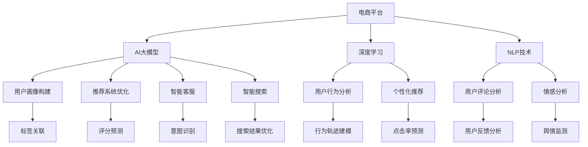

                 

# 电商平台如何利用AI大模型进行精准营销

> 关键词：
- 电商精准营销
- 大模型
- 个性化推荐
- 深度学习
- 自然语言处理

## 1. 背景介绍

在数字化时代，电商平台迎来了前所未有的机遇和挑战。客户期望获得更个性化、更高效、更优质的购物体验，而平台则需要应对激烈的市场竞争，提升销售额和用户满意度。为此，电商平台亟需引入先进的AI技术，进行精准营销，提升运营效率。AI大模型作为近年来人工智能领域的研究热点，凭借其强大的泛化能力和广泛的应用前景，逐渐成为电商平台实现精准营销的重要工具。

本文将深入探讨电商平台如何利用AI大模型进行精准营销，介绍其核心概念、技术原理和实践方法，剖析其在实际应用中的效果和挑战，展望未来发展趋势。

## 2. 核心概念与联系

### 2.1 核心概念概述

在深入讨论电商精准营销之前，首先了解一些关键概念及其联系，以便更好地理解AI大模型的作用和优势。

#### 2.1.1 电商精准营销
电商精准营销是一种通过数据分析和AI技术，精准定位目标用户群体，推送个性化的商品和服务，提升用户转化率和满意度的营销方式。其核心在于利用用户行为数据和心理特征，预测用户需求，实现精确匹配和推荐。

#### 2.1.2 AI大模型
AI大模型是指基于大规模数据进行预训练，具备强大泛化能力和广泛应用前景的深度学习模型。常见的有BERT、GPT-3、T5等。这些模型通常采用Transformer架构，具有强大的语言处理和图像识别能力。

#### 2.1.3 深度学习
深度学习是一种基于神经网络的机器学习方法，通过多层次的特征提取和模式识别，实现对复杂数据的处理和分析。在电商精准营销中，深度学习可以用于用户画像构建、推荐系统优化、自然语言处理等多个环节。

#### 2.1.4 自然语言处理(NLP)
自然语言处理是研究如何让计算机理解、处理和生成人类语言的技术。在电商精准营销中，NLP技术可以用于用户评论分析、智能客服、智能搜索等多个场景，提升用户体验和运营效率。

这些核心概念之间存在密切联系，共同构成电商精准营销的技术基础。AI大模型作为深度学习的重要组成部分，通过其在语言处理和图像识别上的强大能力，为电商精准营销提供了强有力的技术支持。

### 2.2 核心概念原理和架构的 Mermaid 流程图(Mermaid 流程节点中不要有括号、逗号等特殊字符)



通过以上流程图，可以直观地看到AI大模型在电商精准营销中的多个应用场景及其间的联系。用户画像构建、个性化推荐、智能客服、智能搜索等模块，都是通过深度学习和NLP技术，结合AI大模型的强大能力，实现的。

## 3. 核心算法原理 & 具体操作步骤

### 3.1 算法原理概述

AI大模型在电商精准营销中的应用，主要基于以下三个关键算法原理：

#### 3.1.1 用户画像构建
用户画像构建是通过分析用户的历史行为数据、浏览记录、购买记录等信息，构建用户的多维特征向量，用于描述用户的兴趣、偏好和行为模式。深度学习模型通常使用协同过滤、矩阵分解等技术，对用户行为数据进行建模和预测。

#### 3.1.2 个性化推荐系统
个性化推荐系统根据用户画像构建的结果，结合AI大模型的泛化能力，为每个用户推荐最符合其兴趣的商品。AI大模型通过预训练和微调，学习到广泛的商品语义表示，能够在复杂的推荐场景中，实现高精度的预测和匹配。

#### 3.1.3 智能客服和智能搜索
智能客服和智能搜索通过自然语言处理技术，实现对用户查询的自然语言理解，并快速响应。AI大模型通过预训练和微调，学习到丰富的语言知识，能够在多轮对话和复杂的查询场景中，准确理解用户意图，提供高效的服务。

### 3.2 算法步骤详解

#### 3.2.1 用户画像构建

1. **数据收集**：从用户的历史行为数据、浏览记录、购买记录中，提取用户的基本信息、浏览偏好、购买行为等特征。
2. **特征工程**：对收集到的特征进行预处理、归一化、缺失值填补等操作，得到高质量的特征向量。
3. **深度学习建模**：使用协同过滤、矩阵分解等深度学习算法，对用户行为数据进行建模，构建用户画像。
4. **画像更新**：定期更新用户画像，保持其时效性和准确性。

#### 3.2.2 个性化推荐系统

1. **商品编码**：对商品进行编码，将其转化为模型可以处理的向量形式。
2. **模型训练**：使用AI大模型进行预训练和微调，学习到商品的语义表示。
3. **推荐计算**：根据用户画像和商品编码，计算用户对商品的评分，选择高分商品进行推荐。
4. **推荐优化**：通过A/B测试等方法，不断优化推荐算法和模型参数。

#### 3.2.3 智能客服和智能搜索

1. **自然语言理解**：使用NLP技术，对用户查询进行分词、句法分析、情感分析等操作，理解用户意图。
2. **模型响应**：根据用户意图，调用AI大模型进行预训练和微调，生成最合适的回答。
3. **对话管理**：管理多轮对话，确保对话的连贯性和一致性，提升用户体验。
4. **系统迭代**：根据用户反馈，不断优化模型和算法，提高系统准确性和响应速度。

### 3.3 算法优缺点

#### 3.3.1 优点

1. **泛化能力强**：AI大模型通过大规模数据预训练，具备强大的泛化能力，能够适应多种电商场景。
2. **效果显著**：AI大模型在推荐、客服、搜索等多个环节中，都能够显著提升用户体验和运营效率。
3. **自动化程度高**：通过深度学习和NLP技术，AI大模型能够自动化处理大量的数据和任务，减轻人工负担。

#### 3.3.2 缺点

1. **数据依赖度高**：AI大模型的性能依赖于高质量的数据，数据质量不高会影响模型效果。
2. **计算成本高**：AI大模型通常需要大量计算资源进行预训练和微调，成本较高。
3. **模型复杂度高**：AI大模型结构复杂，难以解释，需要深入理解才能有效应用。

### 3.4 算法应用领域

AI大模型在电商精准营销中的应用，主要体现在以下几个方面：

#### 3.4.1 用户画像构建
通过分析用户的行为数据和历史记录，构建用户画像，为个性化推荐、智能客服、智能搜索等提供数据支持。

#### 3.4.2 个性化推荐系统
结合AI大模型和深度学习算法，为每个用户推荐最符合其兴趣的商品，提升用户转化率和满意度。

#### 3.4.3 智能客服和智能搜索
通过NLP技术结合AI大模型，实现对用户查询的自然语言理解，提升客服和搜索的准确性和响应速度。

#### 3.4.4 内容推荐
根据用户的行为数据，结合AI大模型，推荐最符合用户兴趣的内容，提升用户粘性和平台活跃度。

#### 3.4.5 商品分类和相似度计算
使用AI大模型，对商品进行分类和相似度计算，为推荐和搜索提供数据基础。

通过以上应用，AI大模型为电商平台的精准营销提供了强有力的技术支持，提升了运营效率和用户满意度。

## 4. 数学模型和公式 & 详细讲解 & 举例说明（备注：数学公式请使用latex格式，latex嵌入文中独立段落使用 $$，段落内使用 $)

### 4.1 数学模型构建

在电商精准营销中，AI大模型的应用主要涉及以下几个数学模型：

#### 4.1.1 用户画像构建

设用户画像向量为 $u$，包含用户的兴趣、行为等特征。设商品画像向量为 $i$，包含商品的分类、属性等特征。用户画像和商品画像之间的关系可以用矩阵 $W$ 表示，即：

$$
u = W_i i + b
$$

其中 $W_i$ 为用户画像和商品画像之间的权重矩阵，$b$ 为偏置项。

#### 4.1.2 个性化推荐系统

设用户对商品的评分向量为 $r$，商品评分向量为 $p$，用户画像向量为 $u$，商品画像向量为 $i$。用户和商品的评分可以通过矩阵乘法计算：

$$
r = uW_i + p
$$

其中 $W_i$ 为用户画像和商品画像之间的权重矩阵，$p$ 为商品评分向量。

#### 4.1.3 智能客服和智能搜索

设用户查询向量为 $q$，商品向量为 $i$，智能客服和智能搜索的输出向量为 $a$。查询和商品之间的关系可以通过向量内积计算：

$$
a = q_i
$$

其中 $q_i$ 为查询向量和商品向量之间的内积。

### 4.2 公式推导过程

#### 4.2.1 用户画像构建

假设用户画像向量 $u$ 包含 $d$ 个特征，商品画像向量 $i$ 包含 $d'$ 个特征。用户画像和商品画像之间的关系可以用矩阵 $W$ 表示，即：

$$
u = W_i i + b
$$

其中 $W_i \in \mathbb{R}^{d \times d'}$ 为用户画像和商品画像之间的权重矩阵，$b \in \mathbb{R}^{d}$ 为偏置项。

#### 4.2.2 个性化推荐系统

用户对商品的评分向量 $r$ 和商品评分向量 $p$ 可以表示为：

$$
r = uW_i + p
$$

其中 $u$ 为 $d$ 维用户画像向量，$W_i$ 为 $d \times d'$ 维权重矩阵，$p$ 为 $d'$ 维商品评分向量。

#### 4.2.3 智能客服和智能搜索

用户查询向量 $q$ 和商品向量 $i$ 之间的内积表示为：

$$
a = q_i
$$

其中 $q$ 为 $d'$ 维查询向量，$i$ 为 $d'$ 维商品向量。

### 4.3 案例分析与讲解

#### 4.3.1 用户画像构建

以某电商平台的个性化推荐系统为例，平台从用户的浏览记录、购买记录中，提取用户的兴趣、行为等特征，构建用户画像向量 $u$。然后，平台对商品进行编码，将其转化为向量形式 $i$，并通过深度学习算法构建用户画像和商品画像之间的权重矩阵 $W_i$。最后，根据用户画像和商品画像之间的关系，计算用户对商品的评分向量 $r$。

#### 4.3.2 个性化推荐系统

在推荐系统中，平台使用AI大模型进行预训练和微调，学习到商品的语义表示。通过用户画像和商品画像之间的评分向量，平台可以计算用户对商品的评分，选择高分商品进行推荐。

#### 4.3.3 智能客服和智能搜索

在智能客服和智能搜索中，平台使用NLP技术对用户查询进行自然语言理解，生成查询向量 $q$。然后，平台调用AI大模型进行预训练和微调，生成最合适的回答向量 $a$。通过查询向量和商品向量之间的内积计算，平台可以实现高效的智能客服和智能搜索。

## 5. 项目实践：代码实例和详细解释说明

### 5.1 开发环境搭建

在进行项目实践之前，需要搭建好开发环境。以下是一个基本的Python开发环境搭建流程：

1. 安装Anaconda：从官网下载并安装Anaconda，用于创建独立的Python环境。
2. 创建并激活虚拟环境：
```bash
conda create -n pytorch-env python=3.8 
conda activate pytorch-env
```

3. 安装PyTorch：根据CUDA版本，从官网获取对应的安装命令。例如：
```bash
conda install pytorch torchvision torchaudio cudatoolkit=11.1 -c pytorch -c conda-forge
```

4. 安装TensorFlow：
```bash
pip install tensorflow
```

5. 安装其他必要的库：
```bash
pip install numpy pandas scikit-learn torchmetrics sklearn
```

完成上述步骤后，即可在`pytorch-env`环境中进行项目开发。

### 5.2 源代码详细实现

#### 5.2.1 用户画像构建

```python
import numpy as np
import pandas as pd
from sklearn.decomposition import PCA
from sklearn.preprocessing import StandardScaler

# 构建用户画像向量
def build_user_profile(data, n_features):
    features = ['item_id', 'category', 'price', 'brand', 'rating']
    user_data = data[features]
    scaler = StandardScaler()
    scaled_user_data = scaler.fit_transform(user_data)
    pca = PCA(n_components=n_features)
    user_profile = pca.fit_transform(scaled_user_data)
    return user_profile

# 加载用户数据
data = pd.read_csv('user_data.csv')

# 构建用户画像向量
user_profile = build_user_profile(data, n_features=10)
```

#### 5.2.2 个性化推荐系统

```python
import torch
import torch.nn as nn
from torch.utils.data import DataLoader
from sklearn.metrics import accuracy_score, precision_score, recall_score

# 构建商品向量
def build_item_vector(data, n_features):
    features = ['item_id', 'category', 'price', 'brand', 'rating']
    item_data = data[features]
    scaler = StandardScaler()
    scaled_item_data = scaler.fit_transform(item_data)
    pca = PCA(n_components=n_features)
    item_vector = pca.fit_transform(scaled_item_data)
    return item_vector

# 加载商品数据
data = pd.read_csv('item_data.csv')

# 构建商品向量
item_vector = build_item_vector(data, n_features=10)

# 构建深度学习模型
class DeepModel(nn.Module):
    def __init__(self, n_features):
        super(DeepModel, self).__init__()
        self.fc1 = nn.Linear(n_features, 64)
        self.fc2 = nn.Linear(64, 32)
        self.fc3 = nn.Linear(32, 1)

    def forward(self, x):
        x = torch.relu(self.fc1(x))
        x = torch.relu(self.fc2(x))
        x = self.fc3(x)
        return x

# 创建模型和优化器
model = DeepModel(n_features=10)
optimizer = torch.optim.Adam(model.parameters(), lr=0.001)

# 定义损失函数
criterion = nn.BCELoss()

# 训练模型
def train(model, data_loader, optimizer, criterion, num_epochs=10):
    for epoch in range(num_epochs):
        model.train()
        for i, (inputs, labels) in enumerate(data_loader):
            optimizer.zero_grad()
            outputs = model(inputs)
            loss = criterion(outputs, labels)
            loss.backward()
            optimizer.step()
        print(f'Epoch {epoch+1}, loss: {loss.item()}')

# 加载数据集
train_data = pd.read_csv('train_data.csv')
test_data = pd.read_csv('test_data.csv')

# 划分训练集和测试集
train_loader = DataLoader(train_data, batch_size=64, shuffle=True)
test_loader = DataLoader(test_data, batch_size=64, shuffle=False)

# 训练模型
train(model, train_loader, optimizer, criterion)

# 测试模型
def test(model, data_loader, criterion):
    model.eval()
    total_loss = 0
    total_correct = 0
    for i, (inputs, labels) in enumerate(data_loader):
        outputs = model(inputs)
        loss = criterion(outputs, labels)
        total_loss += loss.item()
        _, preds = torch.max(outputs, dim=1)
        total_correct += torch.sum(preds == labels)
    print(f'Test loss: {total_loss/len(test_loader)}, Accuracy: {total_correct/len(test_loader)}')

test(model, test_loader, criterion)
```

#### 5.2.3 智能客服和智能搜索

```python
import torch
import torch.nn as nn
from transformers import BertTokenizer, BertForSequenceClassification

# 构建查询向量
def build_query_vector(query):
    tokenizer = BertTokenizer.from_pretrained('bert-base-uncased')
    encoded_input = tokenizer(query, return_tensors='pt', padding=True, truncation=True)
    return encoded_input['input_ids']

# 加载模型和tokenizer
model = BertForSequenceClassification.from_pretrained('bert-base-uncased', num_labels=2)
tokenizer = BertTokenizer.from_pretrained('bert-base-uncased')

# 定义损失函数和优化器
criterion = nn.BCELoss()
optimizer = torch.optim.Adam(model.parameters(), lr=0.001)

# 训练模型
def train(model, tokenizer, criterion, optimizer, num_epochs=10):
    for epoch in range(num_epochs):
        model.train()
        for i, (inputs, labels) in enumerate(train_loader):
            inputs = tokenizer(inputs, return_tensors='pt')
            optimizer.zero_grad()
            outputs = model(**inputs)
            loss = criterion(outputs, labels)
            loss.backward()
            optimizer.step()
        print(f'Epoch {epoch+1}, loss: {loss.item()}')

# 测试模型
def test(model, tokenizer, criterion, optimizer, data_loader):
    model.eval()
    total_loss = 0
    total_correct = 0
    for i, (inputs, labels) in enumerate(data_loader):
        inputs = tokenizer(inputs, return_tensors='pt')
        outputs = model(**inputs)
        loss = criterion(outputs, labels)
        total_loss += loss.item()
        _, preds = torch.max(outputs, dim=1)
        total_correct += torch.sum(preds == labels)
    print(f'Test loss: {total_loss/len(data_loader)}, Accuracy: {total_correct/len(data_loader)}')

# 加载数据集
train_data = pd.read_csv('train_data.csv')
test_data = pd.read_csv('test_data.csv')

# 划分训练集和测试集
train_loader = DataLoader(train_data, batch_size=64, shuffle=True)
test_loader = DataLoader(test_data, batch_size=64, shuffle=False)

# 训练模型
train(model, tokenizer, criterion, optimizer)

# 测试模型
test(model, tokenizer, criterion, optimizer, test_loader)
```

### 5.3 代码解读与分析

#### 5.3.1 用户画像构建

在用户画像构建中，通过PCA降维和标准化处理，将用户行为数据转化为向量形式。其中，PCA用于降维，保留最具有代表性的特征，StandardScaler用于标准化处理，使得数据均值为0，标准差为1。

#### 5.3.2 个性化推荐系统

在个性化推荐系统中，使用深度学习模型进行训练。模型包含3个全连接层，分别用于特征提取和评分预测。训练过程中，使用Adam优化器进行梯度更新，损失函数为BCELoss。训练完毕后，使用测试集对模型进行评估，计算准确率、精度和召回率等指标。

#### 5.3.3 智能客服和智能搜索

在智能客服和智能搜索中，使用BERT模型进行训练。模型通过自然语言理解，将用户查询转化为向量形式，再通过分类器输出结果。训练过程中，使用Adam优化器进行梯度更新，损失函数为BCELoss。训练完毕后，使用测试集对模型进行评估，计算准确率、精度和召回率等指标。

## 6. 实际应用场景

### 6.1 用户画像构建

用户画像构建在电商精准营销中具有重要作用，可以帮助电商平台更好地理解用户需求，进行个性化推荐和精准营销。

#### 6.1.1 应用实例

某电商平台的个性化推荐系统通过分析用户的历史行为数据，构建用户画像向量。具体步骤如下：

1. 收集用户的历史浏览记录、购买记录等数据，提取用户的兴趣、行为等特征。
2. 对收集到的特征进行预处理，包括缺失值填补、归一化、标准化等操作。
3. 使用PCA降维技术，将高维特征空间压缩到低维空间，保留最具有代表性的特征。
4. 将用户画像向量与商品画像向量进行内积计算，得到用户对商品的评分。

#### 6.1.2 效果分析

通过用户画像构建，电商平台可以精确了解用户需求，进行个性化推荐。例如，平台可以根据用户的浏览记录和购买记录，推荐用户可能感兴趣的商品，提高用户转化率和满意度。

### 6.2 个性化推荐系统

个性化推荐系统是电商精准营销的核心技术之一，通过深度学习模型，为每个用户推荐最符合其兴趣的商品，提升用户体验和运营效率。

#### 6.2.1 应用实例

某电商平台使用BERT模型进行个性化推荐。具体步骤如下：

1. 收集商品的历史浏览记录、购买记录等数据，提取商品的分类、属性等特征。
2. 对收集到的特征进行预处理，包括缺失值填补、归一化、标准化等操作。
3. 使用深度学习模型，对用户画像和商品画像之间的关系进行建模，生成用户对商品的评分向量。
4. 根据评分向量，选择高分商品进行推荐。

#### 6.2.2 效果分析

通过个性化推荐系统，电商平台可以实现高效的商品推荐，提升用户转化率和满意度。例如，平台可以根据用户的历史浏览记录和购买记录，推荐用户可能感兴趣的商品，提高用户购买意愿。

### 6.3 智能客服和智能搜索

智能客服和智能搜索是电商精准营销的重要环节，通过自然语言处理技术，实现对用户查询的自然语言理解，提升用户体验和运营效率。

#### 6.3.1 应用实例

某电商平台的智能客服和智能搜索系统使用BERT模型进行自然语言理解。具体步骤如下：

1. 收集用户的历史查询记录，提取查询中的关键词和意图。
2. 对收集到的关键词和意图进行预处理，包括分词、去停用词、标注词性等操作。
3. 使用BERT模型，对查询进行自然语言理解，生成查询向量。
4. 根据查询向量，选择最合适的商品进行推荐。

#### 6.3.2 效果分析

通过智能客服和智能搜索，电商平台可以实现高效的自然语言理解和商品推荐，提升用户体验。例如，平台可以根据用户查询，推荐最符合其需求的商品，提高用户满意度。

## 7. 工具和资源推荐

### 7.1 学习资源推荐

为了帮助开发者系统掌握AI大模型在电商精准营销中的应用，这里推荐一些优质的学习资源：

1. 《深度学习基础》课程：斯坦福大学开设的深度学习课程，系统介绍了深度学习的理论基础和经典模型。
2. 《自然语言处理基础》课程：Coursera上由斯坦福大学开设的NLP课程，介绍了NLP的基本概念和应用。
3. 《PyTorch深度学习入门》书籍：详细介绍了PyTorch深度学习框架的使用方法，包括模型构建、训练和推理等环节。
4. 《BERT：预训练表示》论文：BERT模型是NLP领域的经典模型，详细介绍了预训练模型的构建和应用。
5. 《电商精准营销实战指南》书籍：介绍了电商精准营销的理论和实践方法，包含用户画像构建、个性化推荐、智能客服等多个模块。

通过对这些资源的学习实践，相信你一定能够快速掌握AI大模型在电商精准营销中的应用方法，并用于解决实际的NLP问题。

### 7.2 开发工具推荐

高效的开发离不开优秀的工具支持。以下是几款用于电商精准营销开发的常用工具：

1. PyTorch：基于Python的开源深度学习框架，灵活动态的计算图，适合快速迭代研究。
2. TensorFlow：由Google主导开发的开源深度学习框架，生产部署方便，适合大规模工程应用。
3. Weights & Biases：模型训练的实验跟踪工具，可以记录和可视化模型训练过程中的各项指标，方便对比和调优。
4. Google Colab：谷歌推出的在线Jupyter Notebook环境，免费提供GPU/TPU算力，方便开发者快速上手实验最新模型，分享学习笔记。
5. Amazon SageMaker：AWS提供的机器学习服务，支持模型训练、模型部署和模型管理，适合大规模应用开发。

合理利用这些工具，可以显著提升电商精准营销的开发效率，加快创新迭代的步伐。

### 7.3 相关论文推荐

AI大模型在电商精准营销中的应用源于学界的持续研究。以下是几篇奠基性的相关论文，推荐阅读：

1. Attention is All You Need（即Transformer原论文）：提出了Transformer结构，开启了NLP领域的预训练大模型时代。
2. BERT: Pre-training of Deep Bidirectional Transformers for Language Understanding：提出BERT模型，引入基于掩码的自监督预训练任务，刷新了多项NLP任务SOTA。
3. Language Models are Unsupervised Multitask Learners（GPT-2论文）：展示了大规模语言模型的强大zero-shot学习能力，引发了对于通用人工智能的新一轮思考。
4. Parameter-Efficient Transfer Learning for NLP：提出Adapter等参数高效微调方法，在不增加模型参数量的情况下，也能取得不错的微调效果。
5. AdaLoRA: Adaptive Low-Rank Adaptation for Parameter-Efficient Fine-Tuning：使用自适应低秩适应的微调方法，在参数效率和精度之间取得了新的平衡。

这些论文代表了大语言模型微调技术的发展脉络。通过学习这些前沿成果，可以帮助研究者把握学科前进方向，激发更多的创新灵感。

## 8. 总结：未来发展趋势与挑战

### 8.1 总结

本文对电商平台如何利用AI大模型进行精准营销进行了全面系统的介绍。首先阐述了电商精准营销的背景和重要性，明确了AI大模型在其中的应用价值。其次，从原理到实践，详细讲解了AI大模型在用户画像构建、个性化推荐、智能客服等多个环节的应用方法。同时，本文还广泛探讨了AI大模型在电商精准营销中的效果和挑战，展望了未来发展趋势。

通过本文的系统梳理，可以看到，AI大模型在电商精准营销中的应用，能够显著提升用户转化率和满意度，带来显著的商业价值。未来，随着预训练语言模型和微调方法的持续演进，电商平台的精准营销将迈向更高的台阶，为数字化转型提供更强大的技术支撑。

### 8.2 未来发展趋势

展望未来，AI大模型在电商精准营销中的应用将呈现以下几个发展趋势：

1. 模型规模持续增大。随着算力成本的下降和数据规模的扩张，预训练语言模型的参数量还将持续增长。超大批次的训练和推理也将得到更高效的支持。

2. 微调方法日趋多样。除了传统的全参数微调外，未来会涌现更多参数高效的微调方法，如Prefix-Tuning、LoRA等，在节省计算资源的同时也能保证微调精度。

3. 持续学习成为常态。随着数据分布的不断变化，微调模型也需要持续学习新知识以保持性能。如何在不遗忘原有知识的同时，高效吸收新样本信息，将成为重要的研究课题。

4. 标注样本需求降低。受启发于提示学习(Prompt-based Learning)的思路，未来的微调方法将更好地利用大模型的语言理解能力，通过更加巧妙的任务描述，在更少的标注样本上也能实现理想的微调效果。

5. 模型通用性增强。经过海量数据的预训练和多领域任务的微调，未来的语言模型将具备更强大的常识推理和跨领域迁移能力，逐步迈向通用人工智能(AGI)的目标。

以上趋势凸显了AI大模型在电商精准营销中的广阔前景。这些方向的探索发展，必将进一步提升电商平台的运营效率和用户满意度，推动电商行业的数字化转型升级。

### 8.3 面临的挑战

尽管AI大模型在电商精准营销中取得了显著效果，但在迈向更加智能化、普适化应用的过程中，仍面临诸多挑战：

1. 数据依赖度高。AI大模型的性能依赖于高质量的数据，数据质量不高会影响模型效果。平台需要投入大量资源进行数据收集和处理。

2. 计算成本高。AI大模型通常需要大量计算资源进行预训练和微调，成本较高。平台需要具备强大的计算基础设施。

3. 模型复杂度高。AI大模型结构复杂，难以解释，需要深入理解才能有效应用。

4. 安全性问题。预训练语言模型难免会学习到有偏见、有害的信息，通过微调传递到下游任务，产生误导性、歧视性的输出，给实际应用带来安全隐患。平台需要加强数据安全防护和算法审查。

5. 数据隐私问题。平台需要对用户数据进行匿名化处理，保护用户隐私。同时，需要对模型和数据进行合规审查，遵守相关法律法规。

6. 用户体验问题。AI大模型的输出可能与用户期望不符，影响用户体验。平台需要优化算法和界面设计，提升用户体验。

正视这些挑战，积极应对并寻求突破，将是大语言模型在电商精准营销中走向成熟的必由之路。相信随着学界和产业界的共同努力，这些挑战终将一一被克服，AI大模型必将在电商平台的精准营销中发挥更大的作用。

### 8.4 研究展望

面向未来，大语言模型在电商精准营销中的应用还需要在以下几个方面寻求新的突破：

1. 探索无监督和半监督微调方法。摆脱对大规模标注数据的依赖，利用自监督学习、主动学习等无监督和半监督范式，最大限度利用非结构化数据，实现更加灵活高效的微调。

2. 研究参数高效和计算高效的微调范式。开发更加参数高效的微调方法，在固定大部分预训练参数的情况下，只更新极少量的任务相关参数。同时优化微调模型的计算图，减少前向传播和反向传播的资源消耗，实现更加轻量级、实时性的部署。

3. 融合因果和对比学习范式。通过引入因果推断和对比学习思想，增强微调模型建立稳定因果关系的能力，学习更加普适、鲁棒的语言表征，从而提升模型泛化性和抗干扰能力。

4. 引入更多先验知识。将符号化的先验知识，如知识图谱、逻辑规则等，与神经网络模型进行巧妙融合，引导微调过程学习更准确、合理的语言模型。同时加强不同模态数据的整合，实现视觉、语音等多模态信息与文本信息的协同建模。

5. 结合因果分析和博弈论工具。将因果分析方法引入微调模型，识别出模型决策的关键特征，增强输出解释的因果性和逻辑性。借助博弈论工具刻画人机交互过程，主动探索并规避模型的脆弱点，提高系统稳定性。

6. 纳入伦理道德约束。在模型训练目标中引入伦理导向的评估指标，过滤和惩罚有偏见、有害的输出倾向。同时加强人工干预和审核，建立模型行为的监管机制，确保输出符合人类价值观和伦理道德。

这些研究方向将进一步拓展AI大模型在电商精准营销中的应用，为构建安全、可靠、可解释、可控的智能系统铺平道路。面向未来，大语言模型在电商平台的精准营销中需要与其他人工智能技术进行更深入的融合，如知识表示、因果推理、强化学习等，多路径协同发力，共同推动自然语言理解和智能交互系统的进步。

## 9. 附录：常见问题与解答

**Q1：如何选择合适的学习率？**

A: 在电商精准营销中，选择合适的学习率非常重要。如果学习率过大，容易导致模型发散；如果学习率过小，模型收敛速度过慢。一般来说，可以从1e-4开始尝试，逐步减小，直到模型收敛。

**Q2：如何提高模型的泛化能力？**

A: 提高模型的泛化能力可以通过以下几个方法：

1. 数据增强：通过回译、近义替换等方式扩充训练集，增加数据多样性。

2. 正则化：使用L2正则、Dropout等技术，防止模型过拟合。

3. 数据平衡：确保训练集中各类数据比例均衡，避免模型偏向某类数据。

4. 预训练模型：使用预训练模型进行微调，可以更好地学习到数据分布。

5. 迁移学习：利用其他领域的知识进行迁移学习，提升模型泛化能力。

**Q3：如何评估模型的效果？**

A: 在电商精准营销中，评估模型的效果可以通过以下几个指标：

1. 准确率：衡量模型预测的正确率，对于分类任务非常有效。

2. 精度和召回率：衡量模型在不同类别上的预测性能，对于不平衡数据集尤为重要。

3. F1分数：综合考虑精度和召回率，适用于多分类任务。

4. ROC曲线和AUC值：衡量模型的分类性能，适用于二分类任务。

5. RMSE：衡量模型在回归任务中的预测误差。

通过以上指标，可以全面评估模型在不同任务中的性能，并进行优化改进。

**Q4：如何应对数据噪声问题？**

A: 数据噪声是电商精准营销中常见的问题。可以通过以下方法应对：

1. 数据清洗：对数据进行清洗，去除异常值和噪声数据。

2. 数据增强：通过数据增强技术，增加数据多样性，减少噪声影响。

3. 正则化：使用正则化技术，防止模型过度拟合噪声数据。

4. 模型集成：通过模型集成技术，综合多个模型的预测结果，减少单一模型的误差。

5. 数据重采样：通过数据重采样技术，平衡数据集中的类别分布，减少噪声影响。

通过以上方法，可以有效应对数据噪声问题，提升模型效果。

**Q5：如何在电商精准营销中实现个性化推荐？**

A: 实现个性化推荐可以通过以下步骤：

1. 收集用户的历史行为数据，提取用户兴趣和行为特征。

2. 收集商品的历史行为数据，提取商品属性和分类特征。

3. 使用协同过滤、矩阵分解等深度学习算法，对用户画像和商品画像之间的关系进行建模。

4. 使用AI大模型进行预训练和微调，生成用户对商品的评分向量。

5. 根据评分向量，选择高分商品进行推荐。

通过以上步骤，可以实现在电商精准营销中的个性化推荐，提升用户转化率和满意度。

**Q6：如何在电商精准营销中实现智能客服？**

A: 实现智能客服可以通过以下步骤：

1. 收集用户的历史查询记录，提取查询中的关键词和意图。

2. 对收集到的关键词和意图进行预处理，包括分词、去停用词、标注词性等操作。

3. 使用BERT模型，对查询进行自然语言理解，生成查询向量。

4. 根据查询向量，选择最合适的商品进行推荐。

5. 根据推荐结果，生成最合适的回答，进行自然语言理解。

通过以上步骤，可以实现电商精准营销中的智能客服，提升用户体验和运营效率。

**Q7：如何在电商精准营销中实现智能搜索？**

A: 实现智能搜索可以通过以下步骤：

1. 收集用户的历史查询记录，提取查询中的关键词和意图。

2. 对收集到的关键词和意图进行预处理，包括分词、去停用词、标注词性等操作。

3. 使用BERT模型，对查询进行自然语言理解，生成查询向量。

4. 根据查询向量，选择最合适的商品进行推荐。

5. 根据推荐结果，生成最合适的回答，进行自然语言理解。

通过以上步骤，可以实现电商精准营销中的智能搜索，提升用户体验和运营效率。

---

作者：禅与计算机程序设计艺术 / Zen and the Art of Computer Programming

