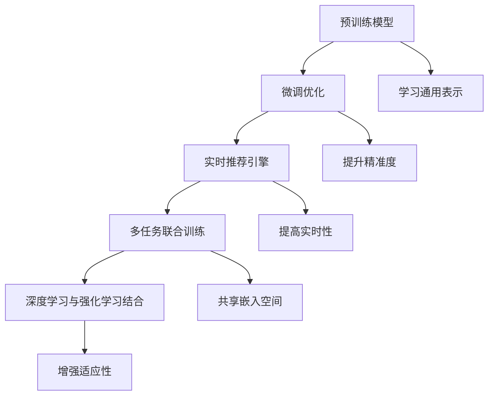

                 

# 电商平台搜索推荐系统的AI 大模型优化：提高系统性能、准确率与实时性

## 1. 背景介绍

### 1.1 问题由来
随着电子商务市场的迅猛发展，电商平台需要对海量商品信息进行高效、准确的搜索和推荐，以提升用户体验和转化率。传统的搜索推荐系统主要基于规则、统计、协同过滤等方法，虽然在某些场景下表现尚可，但在大规模、复杂化的电商数据环境中，其性能和可扩展性逐渐受到挑战。

为了解决这些问题，研究者引入AI大模型优化方法，利用深度学习技术提升搜索推荐系统的准确性和实时性。这种基于大模型的推荐系统，能够自动学习用户和商品的语义表示，构建用户与商品之间的隐式关联，从而提供更个性化、高质量的搜索和推荐服务。

### 1.2 问题核心关键点
AI大模型优化的关键点包括：
- **大规模预训练模型**：如BERT、GPT等，通过大规模无标签数据预训练，学习通用的语言和语义表示。
- **微调优化**：在大模型基础上，使用有标签数据进行微调，针对特定电商任务进行优化，提升推荐系统的精准度。
- **实时推荐引擎**：通过构建高效的推荐引擎，实现快速响应用户搜索和浏览行为，提高系统实时性。
- **多任务联合训练**：将搜索和推荐任务联合训练，共享嵌入空间，提升整体性能。
- **深度学习与强化学习结合**：结合深度学习模型的预测能力和强化学习算法，增强模型的学习能力和适应性。

### 1.3 问题研究意义
AI大模型优化在电商搜索推荐系统中具有重要意义：
- **提升用户体验**：通过精准的搜索和个性化推荐，减少用户搜索时间，提升购物体验。
- **增加转化率**：通过推荐精准的商品，增加用户购买意愿，提高转化率。
- **降低运营成本**：减少人工干预和规则调整，降低运营成本。
- **促进业务创新**：通过深度学习技术，发现新的用户行为和商品关联，为业务创新提供数据支持。

## 2. 核心概念与联系

### 2.1 核心概念概述

为更好地理解AI大模型优化在电商搜索推荐系统中的应用，本节将介绍几个核心概念及其联系：

- **预训练模型**：如BERT、GPT等，通过大规模无标签数据预训练，学习通用的语言和语义表示。
- **微调优化**：在大模型基础上，使用有标签数据进行微调，针对特定电商任务进行优化，提升推荐系统的精准度。
- **实时推荐引擎**：通过构建高效的推荐引擎，实现快速响应用户搜索和浏览行为，提高系统实时性。
- **多任务联合训练**：将搜索和推荐任务联合训练，共享嵌入空间，提升整体性能。
- **深度学习与强化学习结合**：结合深度学习模型的预测能力和强化学习算法，增强模型的学习能力和适应性。

这些概念之间的逻辑关系可以通过以下Mermaid流程图来展示：



这个流程图展示了大模型优化的核心概念及其之间的关系：
- 预训练模型通过大规模数据学习通用表示。
- 微调优化在大模型基础上针对电商任务进行优化，提升精准度。
- 实时推荐引擎通过高效的计算实现快速响应，提高实时性。
- 多任务联合训练和深度学习与强化学习的结合，进一步提升性能和适应性。

## 3. 核心算法原理 & 具体操作步骤
### 3.1 算法原理概述

AI大模型优化的核心思想是：通过预训练模型学习通用表示，在大规模电商数据上进行微调，构建个性化搜索推荐系统。该方法的核心算法包括：

- **编码器-解码器结构**：将搜索和推荐任务映射到预训练模型中，使用编码器学习用户和商品表示，使用解码器进行推荐和搜索。
- **联合训练**：将搜索和推荐任务联合训练，共享嵌入空间，提高整体性能。
- **序列模型**：使用序列模型（如RNN、LSTM等）捕捉用户和商品之间的时序关系，提升推荐效果。
- **强化学习**：结合强化学习算法，根据用户反馈动态调整推荐策略，提高推荐效果和用户体验。

### 3.2 算法步骤详解

AI大模型优化的具体操作步骤包括以下几个关键步骤：

**Step 1: 准备预训练模型和数据集**
- 选择合适的预训练语言模型（如BERT、GPT等），作为初始化参数。
- 准备电商领域的相关数据集，包括用户搜索记录、商品描述、用户行为数据等。

**Step 2: 添加任务适配层**
- 在预训练模型顶层设计合适的输出层和损失函数，如交叉熵损失、均方误差损失等。
- 根据具体任务需求，在模型中加入相关任务相关的层，如用户意图分类、商品评分预测等。

**Step 3: 设置微调超参数**
- 选择合适的优化算法及其参数，如AdamW、SGD等，设置学习率、批大小、迭代轮数等。
- 设置正则化技术及强度，包括权重衰减、Dropout、Early Stopping等。
- 确定冻结预训练参数的策略，如仅微调顶层，或全部参数都参与微调。

**Step 4: 执行梯度训练**
- 将训练集数据分批次输入模型，前向传播计算损失函数。
- 反向传播计算参数梯度，根据设定的优化算法和学习率更新模型参数。
- 周期性在验证集上评估模型性能，根据性能指标决定是否触发 Early Stopping。
- 重复上述步骤直到满足预设的迭代轮数或 Early Stopping 条件。

**Step 5: 测试和部署**
- 在测试集上评估微调后模型，对比微调前后的精度提升。
- 使用微调后的模型对新样本进行推理预测，集成到实际的应用系统中。
- 持续收集新的数据，定期重新微调模型，以适应数据分布的变化。

以上是AI大模型优化的详细步骤，每一步都需要根据具体应用场景进行调整和优化。

### 3.3 算法优缺点

AI大模型优化的优点包括：
- **高效性能**：大模型通过大规模预训练学习通用表示，微调时只需要少量标注数据即可提升性能。
- **灵活适应**：模型可以根据电商领域特定的任务需求进行定制化微调，提升推荐系统的精准度和实时性。
- **可解释性强**：大模型通过学习用户和商品的语义表示，可以提供较为可解释的推荐逻辑。

同时，该方法也存在一些局限性：
- **计算资源需求高**：大规模预训练模型和微调过程需要大量的计算资源，可能难以在中小型电商平台上部署。
- **过拟合风险**：在大规模电商数据上进行微调时，可能存在过拟合的风险，需要引入正则化技术来缓解。
- **模型复杂度**：复杂的模型结构和参数调整增加了系统的复杂性，可能影响模型的实时响应性能。

### 3.4 算法应用领域

AI大模型优化在电商平台搜索推荐系统中有着广泛的应用，例如：

- **商品推荐**：基于用户浏览、购买历史等数据，通过预训练模型进行个性化推荐。
- **搜索排序**：根据用户搜索关键词，使用模型预测相关商品，进行排序和推荐。
- **个性化广告**：根据用户行为数据，动态调整广告投放策略，提高广告效果。
- **库存管理**：通过预测商品需求，优化库存管理，减少缺货和积压。
- **用户画像**：通过分析用户行为和商品反馈，构建用户画像，提升用户粘性和满意度。

除了上述这些经典应用外，AI大模型优化还在电商搜索推荐系统中不断探索新的应用场景，如内容生成、供应链优化、智能客服等，为电商平台的业务创新提供了新的动力。

## 4. 数学模型和公式 & 详细讲解
### 4.1 数学模型构建

本节将使用数学语言对AI大模型优化在电商平台搜索推荐系统中的应用进行更加严格的刻画。

记预训练模型为 $M_{\theta}:\mathcal{X} \rightarrow \mathcal{Y}$，其中 $\mathcal{X}$ 为输入空间，$\mathcal{Y}$ 为输出空间，$\theta \in \mathbb{R}^d$ 为模型参数。假设电商领域的任务为商品推荐，输入为 $(x_i, y_i)$，其中 $x_i$ 为商品描述，$y_i$ 为推荐标签。

定义模型 $M_{\theta}$ 在输入 $(x_i,y_i)$ 上的损失函数为 $\ell(M_{\theta}(x_i),y_i)$，则在数据集 $D=\{(x_i,y_i)\}_{i=1}^N$ 上的经验风险为：

$$
\mathcal{L}(\theta) = \frac{1}{N} \sum_{i=1}^N \ell(M_{\theta}(x_i),y_i)
$$

微调的优化目标是最小化经验风险，即找到最优参数：

$$
\theta^* = \mathop{\arg\min}_{\theta} \mathcal{L}(\theta)
$$

在实践中，我们通常使用基于梯度的优化算法（如SGD、Adam等）来近似求解上述最优化问题。设 $\eta$ 为学习率，$\lambda$ 为正则化系数，则参数的更新公式为：

$$
\theta \leftarrow \theta - \eta \nabla_{\theta}\mathcal{L}(\theta) - \eta\lambda\theta
$$

其中 $\nabla_{\theta}\mathcal{L}(\theta)$ 为损失函数对参数 $\theta$ 的梯度，可通过反向传播算法高效计算。

### 4.2 公式推导过程

以下我们以商品推荐任务为例，推导交叉熵损失函数及其梯度的计算公式。

假设模型 $M_{\theta}$ 在输入 $x_i$ 上的输出为 $\hat{y}=M_{\theta}(x_i)$，表示商品推荐的概率分布。真实标签 $y_i \in \{0,1\}$。则二分类交叉熵损失函数定义为：

$$
\ell(M_{\theta}(x_i),y_i) = -[y_i\log \hat{y} + (1-y_i)\log (1-\hat{y})]
$$

将其代入经验风险公式，得：

$$
\mathcal{L}(\theta) = -\frac{1}{N}\sum_{i=1}^N [y_i\log M_{\theta}(x_i)+(1-y_i)\log(1-M_{\theta}(x_i))]
$$

根据链式法则，损失函数对参数 $\theta_k$ 的梯度为：

$$
\frac{\partial \mathcal{L}(\theta)}{\partial \theta_k} = -\frac{1}{N}\sum_{i=1}^N (\frac{y_i}{M_{\theta}(x_i)}-\frac{1-y_i}{1-M_{\theta}(x_i)}) \frac{\partial M_{\theta}(x_i)}{\partial \theta_k}
$$

其中 $\frac{\partial M_{\theta}(x_i)}{\partial \theta_k}$ 可进一步递归展开，利用自动微分技术完成计算。

在得到损失函数的梯度后，即可带入参数更新公式，完成模型的迭代优化。重复上述过程直至收敛，最终得到适应电商领域商品推荐任务的最优模型参数 $\theta^*$。

## 5. 项目实践：代码实例和详细解释说明
### 5.1 开发环境搭建

在进行AI大模型优化实践前，我们需要准备好开发环境。以下是使用Python进行PyTorch开发的环境配置流程：

1. 安装Anaconda：从官网下载并安装Anaconda，用于创建独立的Python环境。

2. 创建并激活虚拟环境：
```bash
conda create -n pytorch-env python=3.8 
conda activate pytorch-env
```

3. 安装PyTorch：根据CUDA版本，从官网获取对应的安装命令。例如：
```bash
conda install pytorch torchvision torchaudio cudatoolkit=11.1 -c pytorch -c conda-forge
```

4. 安装Transformers库：
```bash
pip install transformers
```

5. 安装各类工具包：
```bash
pip install numpy pandas scikit-learn matplotlib tqdm jupyter notebook ipython
```

完成上述步骤后，即可在`pytorch-env`环境中开始AI大模型优化的实践。

### 5.2 源代码详细实现

下面我们以电商平台商品推荐任务为例，给出使用Transformers库对BERT模型进行AI大模型优化的PyTorch代码实现。

首先，定义商品推荐任务的数据处理函数：

```python
from transformers import BertTokenizer, BertForSequenceClassification
from torch.utils.data import Dataset
import torch

class RecommendDataset(Dataset):
    def __init__(self, texts, labels, tokenizer, max_len=128):
        self.texts = texts
        self.labels = labels
        self.tokenizer = tokenizer
        self.max_len = max_len
        
    def __len__(self):
        return len(self.texts)
    
    def __getitem__(self, item):
        text = self.texts[item]
        label = self.labels[item]
        
        encoding = self.tokenizer(text, return_tensors='pt', max_length=self.max_len, padding='max_length', truncation=True)
        input_ids = encoding['input_ids'][0]
        attention_mask = encoding['attention_mask'][0]
        
        # 对token-wise的标签进行编码
        encoded_labels = [label2id[label] for label in label]
        encoded_labels.extend([label2id['O']] * (self.max_len - len(encoded_labels)))
        labels = torch.tensor(encoded_labels, dtype=torch.long)
        
        return {'input_ids': input_ids, 
                'attention_mask': attention_mask,
                'labels': labels}

# 标签与id的映射
label2id = {'O': 0, 'recommended': 1}
id2label = {v: k for k, v in label2id.items()}

# 创建dataset
tokenizer = BertTokenizer.from_pretrained('bert-base-cased')

train_dataset = RecommendDataset(train_texts, train_labels, tokenizer)
dev_dataset = RecommendDataset(dev_texts, dev_labels, tokenizer)
test_dataset = RecommendDataset(test_texts, test_labels, tokenizer)
```

然后，定义模型和优化器：

```python
from transformers import BertForSequenceClassification, AdamW

model = BertForSequenceClassification.from_pretrained('bert-base-cased', num_labels=len(label2id))

optimizer = AdamW(model.parameters(), lr=2e-5)
```

接着，定义训练和评估函数：

```python
from torch.utils.data import DataLoader
from tqdm import tqdm
from sklearn.metrics import classification_report

device = torch.device('cuda') if torch.cuda.is_available() else torch.device('cpu')
model.to(device)

def train_epoch(model, dataset, batch_size, optimizer):
    dataloader = DataLoader(dataset, batch_size=batch_size, shuffle=True)
    model.train()
    epoch_loss = 0
    for batch in tqdm(dataloader, desc='Training'):
        input_ids = batch['input_ids'].to(device)
        attention_mask = batch['attention_mask'].to(device)
        labels = batch['labels'].to(device)
        model.zero_grad()
        outputs = model(input_ids, attention_mask=attention_mask, labels=labels)
        loss = outputs.loss
        epoch_loss += loss.item()
        loss.backward()
        optimizer.step()
    return epoch_loss / len(dataloader)

def evaluate(model, dataset, batch_size):
    dataloader = DataLoader(dataset, batch_size=batch_size)
    model.eval()
    preds, labels = [], []
    with torch.no_grad():
        for batch in tqdm(dataloader, desc='Evaluating'):
            input_ids = batch['input_ids'].to(device)
            attention_mask = batch['attention_mask'].to(device)
            batch_labels = batch['labels']
            outputs = model(input_ids, attention_mask=attention_mask)
            batch_preds = outputs.logits.argmax(dim=2).to('cpu').tolist()
            batch_labels = batch_labels.to('cpu').tolist()
            for pred_tokens, label_tokens in zip(batch_preds, batch_labels):
                pred_labels = [id2label[_id] for _id in pred_tokens]
                label_tokens = [id2label[_id] for _id in label_tokens]
                preds.append(pred_labels[:len(label_tokens)])
                labels.append(label_tokens)
                
    print(classification_report(labels, preds))
```

最后，启动训练流程并在测试集上评估：

```python
epochs = 5
batch_size = 16

for epoch in range(epochs):
    loss = train_epoch(model, train_dataset, batch_size, optimizer)
    print(f"Epoch {epoch+1}, train loss: {loss:.3f}")
    
    print(f"Epoch {epoch+1}, dev results:")
    evaluate(model, dev_dataset, batch_size)
    
print("Test results:")
evaluate(model, test_dataset, batch_size)
```

以上就是使用PyTorch对BERT进行电商平台商品推荐任务AI大模型优化的完整代码实现。可以看到，得益于Transformers库的强大封装，我们可以用相对简洁的代码完成BERT模型的加载和优化。

### 5.3 代码解读与分析

让我们再详细解读一下关键代码的实现细节：

**RecommendDataset类**：
- `__init__`方法：初始化文本、标签、分词器等关键组件。
- `__len__`方法：返回数据集的样本数量。
- `__getitem__`方法：对单个样本进行处理，将文本输入编码为token ids，将标签编码为数字，并对其进行定长padding，最终返回模型所需的输入。

**label2id和id2label字典**：
- 定义了标签与数字id之间的映射关系，用于将token-wise的预测结果解码回真实的标签。

**训练和评估函数**：
- 使用PyTorch的DataLoader对数据集进行批次化加载，供模型训练和推理使用。
- 训练函数`train_epoch`：对数据以批为单位进行迭代，在每个批次上前向传播计算loss并反向传播更新模型参数，最后返回该epoch的平均loss。
- 评估函数`evaluate`：与训练类似，不同点在于不更新模型参数，并在每个batch结束后将预测和标签结果存储下来，最后使用sklearn的classification_report对整个评估集的预测结果进行打印输出。

**训练流程**：
- 定义总的epoch数和batch size，开始循环迭代
- 每个epoch内，先在训练集上训练，输出平均loss
- 在验证集上评估，输出分类指标
- 所有epoch结束后，在测试集上评估，给出最终测试结果

可以看到，PyTorch配合Transformers库使得BERT微调的代码实现变得简洁高效。开发者可以将更多精力放在数据处理、模型改进等高层逻辑上，而不必过多关注底层的实现细节。

当然，工业级的系统实现还需考虑更多因素，如模型的保存和部署、超参数的自动搜索、更灵活的任务适配层等。但核心的微调范式基本与此类似。

## 6. 实际应用场景
### 6.1 智能客服系统

基于AI大模型优化的搜索推荐技术，可以广泛应用于智能客服系统的构建。传统客服往往需要配备大量人力，高峰期响应缓慢，且一致性和专业性难以保证。而使用AI大模型优化的搜索推荐系统，可以7x24小时不间断服务，快速响应客户咨询，用自然流畅的语言解答各类常见问题。

在技术实现上，可以收集企业内部的历史客服对话记录，将问题和最佳答复构建成监督数据，在此基础上对预训练模型进行AI大模型优化。优化后的模型能够自动理解用户意图，匹配最合适的答复模板进行回复。对于客户提出的新问题，还可以接入检索系统实时搜索相关内容，动态组织生成回答。如此构建的智能客服系统，能大幅提升客户咨询体验和问题解决效率。

### 6.2 金融舆情监测

金融机构需要实时监测市场舆论动向，以便及时应对负面信息传播，规避金融风险。传统的人工监测方式成本高、效率低，难以应对网络时代海量信息爆发的挑战。基于AI大模型优化的文本分类和情感分析技术，为金融舆情监测提供了新的解决方案。

具体而言，可以收集金融领域相关的新闻、报道、评论等文本数据，并对其进行主题标注和情感标注。在此基础上对预训练语言模型进行AI大模型优化，使其能够自动判断文本属于何种主题，情感倾向是正面、中性还是负面。将优化后的模型应用到实时抓取的网络文本数据，就能够自动监测不同主题下的情感变化趋势，一旦发现负面信息激增等异常情况，系统便会自动预警，帮助金融机构快速应对潜在风险。

### 6.3 个性化推荐系统

当前的推荐系统往往只依赖用户的历史行为数据进行物品推荐，无法深入理解用户的真实兴趣偏好。基于AI大模型优化的推荐系统可以更好地挖掘用户行为背后的语义信息，从而提供更个性化、高质量的推荐内容。

在实践中，可以收集用户浏览、点击、评论、分享等行为数据，提取和用户交互的物品标题、描述、标签等文本内容。将文本内容作为模型输入，用户的后续行为（如是否点击、购买等）作为监督信号，在此基础上对预训练语言模型进行AI大模型优化。优化后的模型能够从文本内容中准确把握用户的兴趣点。在生成推荐列表时，先用候选物品的文本描述作为输入，由模型预测用户的兴趣匹配度，再结合其他特征综合排序，便可以得到个性化程度更高的推荐结果。

### 6.4 未来应用展望

随着AI大模型优化的不断发展，基于搜索推荐技术的应用领域将不断扩展，为各个行业带来新的变革。

在智慧医疗领域，基于AI大模型优化的医疗问答、病历分析、药物研发等应用将提升医疗服务的智能化水平，辅助医生诊疗，加速新药开发进程。

在智能教育领域，AI大模型优化的内容生成、学情分析、知识推荐等应用将提升教学质量，促进教育公平，提高学生学习效果。

在智慧城市治理中，AI大模型优化的城市事件监测、舆情分析、应急指挥等应用将提高城市管理的自动化和智能化水平，构建更安全、高效的未来城市。

此外，在企业生产、社会治理、文娱传媒等众多领域，基于AI大模型优化的搜索推荐技术也将不断涌现，为经济社会发展注入新的动力。相信随着技术的日益成熟，AI大模型优化必将在构建人机协同的智能时代中扮演越来越重要的角色。

## 7. 工具和资源推荐
### 7.1 学习资源推荐

为了帮助开发者系统掌握AI大模型优化的理论基础和实践技巧，这里推荐一些优质的学习资源：

1. 《深度学习入门：基于Python的理论与实现》系列博文：由深度学习专家撰写，全面介绍了深度学习的基本概念和实现方法，包括AI大模型优化。

2. CS231n《卷积神经网络》课程：斯坦福大学开设的计算机视觉明星课程，有Lecture视频和配套作业，带你入门深度学习领域。

3. 《深度学习理论与实践》书籍：全面介绍了深度学习的基础理论和经典模型，包括AI大模型优化的理论基础和实践技巧。

4. PyTorch官方文档：PyTorch框架的官方文档，提供了丰富的深度学习模型和工具，是AI大模型优化的必备资料。

5. HuggingFace官方文档：Transformers库的官方文档，提供了海量预训练模型和完整的AI大模型优化样例代码，是上手实践的必备资料。

通过对这些资源的学习实践，相信你一定能够快速掌握AI大模型优化的精髓，并用于解决实际的搜索推荐问题。
###  7.2 开发工具推荐

高效的开发离不开优秀的工具支持。以下是几款用于AI大模型优化的常用工具：

1. PyTorch：基于Python的开源深度学习框架，灵活动态的计算图，适合快速迭代研究。大部分预训练语言模型都有PyTorch版本的实现。

2. TensorFlow：由Google主导开发的开源深度学习框架，生产部署方便，适合大规模工程应用。同样有丰富的预训练语言模型资源。

3. Transformers库：HuggingFace开发的NLP工具库，集成了众多SOTA语言模型，支持PyTorch和TensorFlow，是进行AI大模型优化的利器。

4. Weights & Biases：模型训练的实验跟踪工具，可以记录和可视化模型训练过程中的各项指标，方便对比和调优。与主流深度学习框架无缝集成。

5. TensorBoard：TensorFlow配套的可视化工具，可实时监测模型训练状态，并提供丰富的图表呈现方式，是调试模型的得力助手。

6. Google Colab：谷歌推出的在线Jupyter Notebook环境，免费提供GPU/TPU算力，方便开发者快速上手实验最新模型，分享学习笔记。

合理利用这些工具，可以显著提升AI大模型优化的开发效率，加快创新迭代的步伐。

### 7.3 相关论文推荐

AI大模型优化的发展源于学界的持续研究。以下是几篇奠基性的相关论文，推荐阅读：

1. Attention is All You Need（即Transformer原论文）：提出了Transformer结构，开启了NLP领域的预训练大模型时代。

2. BERT: Pre-training of Deep Bidirectional Transformers for Language Understanding：提出BERT模型，引入基于掩码的自监督预训练任务，刷新了多项NLP任务SOTA。

3. Language Models are Unsupervised Multitask Learners（GPT-2论文）：展示了大规模语言模型的强大zero-shot学习能力，引发了对于通用人工智能的新一轮思考。

4. Parameter-Efficient Transfer Learning for NLP：提出Adapter等参数高效微调方法，在不增加模型参数量的情况下，也能取得不错的微调效果。

5. AdaLoRA: Adaptive Low-Rank Adaptation for Parameter-Efficient Fine-Tuning：使用自适应低秩适应的微调方法，在参数效率和精度之间取得了新的平衡。

6. Transfer Learning with Multi-task Learning and Memory Banks：提出多任务学习与记忆银行(Memory Banks)结合的方法，提升模型迁移能力。

这些论文代表了大模型优化的发展脉络。通过学习这些前沿成果，可以帮助研究者把握学科前进方向，激发更多的创新灵感。

## 8. 总结：未来发展趋势与挑战

### 8.1 总结

本文对AI大模型优化在电商平台搜索推荐系统中的应用进行了全面系统的介绍。首先阐述了AI大模型优化的研究背景和意义，明确了其在大规模电商数据上提升搜索推荐系统性能和实时性的独特价值。其次，从原理到实践，详细讲解了AI大模型优化的数学原理和关键步骤，给出了AI大模型优化的完整代码实例。同时，本文还广泛探讨了AI大模型优化在智能客服、金融舆情、个性化推荐等多个行业领域的应用前景，展示了AI大模型优化的巨大潜力。此外，本文精选了AI大模型优化的各类学习资源，力求为读者提供全方位的技术指引。

通过本文的系统梳理，可以看到，AI大模型优化技术在电商搜索推荐系统中具有重要的应用价值，其高效性能、灵活适应能力和可解释性强等优点，使其在多个实际场景中表现出色。未来，伴随预训练语言模型和AI大模型优化方法的持续演进，相信电商平台的搜索推荐系统将不断提升用户体验和运营效率，为电商行业的智能化转型提供新的动力。

### 8.2 未来发展趋势

展望未来，AI大模型优化技术将呈现以下几个发展趋势：

1. **模型规模持续增大**：随着算力成本的下降和数据规模的扩张，预训练语言模型的参数量还将持续增长。超大规模语言模型蕴含的丰富语言知识，有望支撑更加复杂多变的电商搜索推荐任务。

2. **多任务联合训练**：除了商品推荐，未来的AI大模型优化还将涵盖搜索、客服、广告等更多任务，通过联合训练，共享嵌入空间，提高整体性能。

3. **深度学习与强化学习结合**：结合深度学习模型的预测能力和强化学习算法，增强模型的学习能力和适应性，提升搜索推荐系统的实时性和精准度。

4. **少样本学习和迁移学习**：通过利用预训练模型，结合少样本学习和迁移学习，可以在更少的标注样本上实现高效的AI大模型优化。

5. **多模态融合**：将文本、图像、语音等多模态信息融合，提升模型的泛化能力和适应性。

6. **增强可解释性**：引入可解释性技术，如可视化、对抗攻击、因果分析等，增强搜索推荐系统的透明度和可理解性。

以上趋势凸显了AI大模型优化技术的广阔前景。这些方向的探索发展，必将进一步提升电商搜索推荐系统的性能和用户体验，为电商平台的业务创新提供新的动力。

### 8.3 面临的挑战

尽管AI大模型优化技术已经取得了瞩目成就，但在迈向更加智能化、普适化应用的过程中，它仍面临着诸多挑战：

1. **计算资源需求高**：大规模预训练模型和微调过程需要大量的计算资源，可能难以在中小型电商平台上部署。

2. **过拟合风险**：在大规模电商数据上进行微调时，可能存在过拟合的风险，需要引入正则化技术来缓解。

3. **实时性问题**：复杂的模型结构和参数调整增加了系统的复杂性，可能影响模型的实时响应性能。

4. **数据隐私和安全**：电商平台需要处理大量用户数据，如何保护用户隐私和安全，是一个重要的挑战。

5. **用户适应性**：不同用户对搜索推荐结果的偏好不同，如何设计个性化的推荐策略，提升用户满意度，是一个复杂的任务。

6. **多任务协同**：多个AI大模型优化任务之间可能存在冲突，如何设计合理的协同机制，是一个亟待解决的问题。

正视AI大模型优化面临的这些挑战，积极应对并寻求突破，将是大模型优化技术走向成熟的必由之路。相信随着学界和产业界的共同努力，这些挑战终将一一被克服，AI大模型优化必将在构建人机协同的智能时代中扮演越来越重要的角色。

### 8.4 研究展望

面对AI大模型优化所面临的挑战，未来的研究需要在以下几个方面寻求新的突破：

1. **探索无监督和半监督学习**：摆脱对大规模标注数据的依赖，利用自监督学习、主动学习等无监督和半监督范式，最大限度利用非结构化数据，实现更加灵活高效的AI大模型优化。

2. **研究参数高效和计算高效的微调范式**：开发更加参数高效的微调方法，如Prefix-Tuning、LoRA等，在节省计算资源的同时也能保证微调精度。

3. **融合因果和对比学习范式**：通过引入因果推断和对比学习思想，增强模型的学习能力和泛化性，学习更加普适、鲁棒的语言表征。

4. **引入更多先验知识**：将符号化的先验知识，如知识图谱、逻辑规则等，与神经网络模型进行巧妙融合，引导AI大模型优化的过程学习更准确、合理的语言模型。

5. **结合因果分析和博弈论工具**：将因果分析方法引入AI大模型优化的过程中，识别出模型决策的关键特征，增强输出的因果性和逻辑性。借助博弈论工具刻画人机交互过程，主动探索并规避模型的脆弱点，提高系统稳定性。

6. **纳入伦理道德约束**：在模型训练目标中引入伦理导向的评估指标，过滤和惩罚有偏见、有害的输出倾向。同时加强人工干预和审核，建立模型行为的监管机制，确保输出符合人类价值观和伦理道德。

这些研究方向的探索，必将引领AI大模型优化技术迈向更高的台阶，为构建安全、可靠、可解释、可控的智能系统铺平道路。面向未来，AI大模型优化技术还需要与其他人工智能技术进行更深入的融合，如知识表示、因果推理、强化学习等，多路径协同发力，共同推动自然语言理解和智能交互系统的进步。只有勇于创新、敢于突破，才能不断拓展语言模型的边界，让智能技术更好地造福人类社会。

## 9. 附录：常见问题与解答

**Q1：AI大模型优化是否适用于所有电商搜索推荐任务？**

A: AI大模型优化在大多数电商搜索推荐任务上都能取得不错的效果，特别是对于数据量较小的任务。但对于一些特定领域的任务，如医学、法律等，仅仅依靠通用语料预训练的模型可能难以很好地适应。此时需要在特定领域语料上进一步预训练，再进行微调，才能获得理想效果。此外，对于一些需要时效性、个性化很强的任务，如对话、推荐等，AI大模型优化方法也需要针对性的改进优化。

**Q2：AI大模型优化过程中如何选择合适的学习率？**

A: AI大模型优化的学习率一般要比预训练时小1-2个数量级，如果使用过大的学习率，容易破坏预训练权重，导致过拟合。一般建议从1e-5开始调参，逐步减小学习率，直至收敛。也可以使用warmup策略，在开始阶段使用较小的学习率，再逐渐过渡到预设值。需要注意的是，不同的优化器(如AdamW、Adafactor等)以及不同的学习率调度策略，可能需要设置不同的学习率阈值。

**Q3：采用AI大模型优化时会面临哪些资源瓶颈？**

A: 当前主流的预训练大模型动辄以亿计的参数规模，对算力、内存、存储都提出了很高的要求。GPU/TPU等高性能设备是必不可少的，但即便如此，超大批次的训练和推理也可能遇到显存不足的问题。因此需要采用一些资源优化技术，如梯度积累、混合精度训练、模型并行等，来突破硬件瓶颈。同时，模型的存储和读取也可能占用大量时间和空间，需要采用模型压缩、稀疏化存储等方法进行优化。

**Q4：如何缓解AI大模型优化过程中的过拟合问题？**

A: 过拟合是AI大模型优化面临的主要挑战，尤其是在标注数据不足的情况下。常见的缓解策略包括：
1. 数据增强：通过回译、近义替换等方式扩充训练集
2. 正则化：使用L2正则、Dropout、Early Stopping等避免过拟合
3. 对抗训练：引入对抗样本，提高模型鲁棒性
4. 参数高效微调：只调整少量参数(如Adapter、Prefix等)，减小过拟合风险
5. 多模型集成：训练多个AI大模型优化模型，取平均输出，抑制过拟合

这些策略往往需要根据具体任务和数据特点进行灵活组合。只有在数据、模型、训练、推理等各环节进行全面优化，才能最大限度地发挥AI大模型优化的威力。

**Q5：AI大模型优化在落地部署时需要注意哪些问题？**

A: 将AI大模型优化的模型转化为实际应用，还需要考虑以下因素：
1. 模型裁剪：去除不必要的层和参数，减小模型尺寸，加快推理速度
2. 量化加速：将浮点模型转为定点模型，压缩存储空间，提高计算效率
3. 服务化封装：将模型封装为标准化服务接口，便于集成调用
4. 弹性伸缩：根据请求流量动态调整资源配置，平衡服务质量和成本
5. 监控告警：实时采集系统指标，设置异常告警阈值，确保服务稳定性
6. 安全防护：采用访问鉴权、数据脱敏等措施，保障数据和模型安全

AI大模型优化的搜索推荐系统需要在数据、模型、训练、推理、部署等多个环节进行全面优化，才能真正实现高效、准确、实时的高质量推荐。只有从多个维度协同发力，才能不断提升用户体验和业务价值。

---

作者：禅与计算机程序设计艺术 / Zen and the Art of Computer Programming

