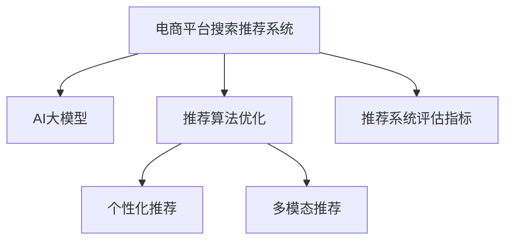

                 

# 电商平台搜索推荐系统的AI 大模型优化：提高系统性能、效率、准确率与多样性

## 1. 背景介绍

在现代电商平台上，推荐系统的精准性和用户体验是其核心竞争力。推荐算法能够根据用户的过往行为和兴趣，预测其未来可能的购买意向，为用户推荐最符合其需求的商品。随着大数据和深度学习技术的发展，AI大模型如BERT、GPT等已经被广泛应用于电商平台推荐系统的构建，取得了显著的成果。然而，尽管大模型在性能和效果上都有显著提升，但同时也面临着诸多挑战，如模型计算复杂度高、存储需求大、部署成本高等。因此，如何在大模型基础上进行优化，降低计算和存储成本，提升推荐系统的性能和效率，是一个亟待解决的问题。

本文聚焦于基于AI大模型的电商平台搜索推荐系统优化，将系统性能、效率、准确率和多样性作为核心优化目标，提供了一套全面的优化策略。希望通过本文的介绍，能够帮助开发者和研究者更好地理解大模型在电商推荐系统中的应用，并为其提供可行的优化方案。

## 2. 核心概念与联系

### 2.1 核心概念概述

为了更好地理解基于AI大模型的电商平台推荐系统优化，首先需要理解几个核心概念：

- **电商平台搜索推荐系统**：基于用户行为数据和商品属性信息，为用户推荐最符合其需求的商品的系统。通过构建和优化推荐算法，提升用户体验和电商转化率。

- **AI大模型**：如BERT、GPT等基于Transformer结构训练得到的大规模语言模型，具有强大的自然语言理解和生成能力，能够处理海量的文本数据，提升推荐系统的性能和效果。

- **推荐算法优化**：通过优化推荐算法，提高推荐系统的性能和效果，包括推荐结果的准确性、多样性、效率和实时性。

- **个性化推荐**：根据用户的历史行为、兴趣和社交网络等个性化信息，为其推荐最适合的商品，提升用户体验和满意度。

- **多模态推荐**：结合文本、图像、视频等多模态数据，提升推荐系统的精度和用户体验。

- **推荐系统评估指标**：如准确率、召回率、点击率、用户满意度等，用于衡量推荐系统的效果。

这些概念之间的关系可以通过以下Mermaid流程图来展示：



这个流程图展示了电商平台推荐系统的核心概念及其之间的联系：

1. 电商平台推荐系统通过AI大模型进行推荐。
2. 推荐算法优化进一步提升推荐系统的性能和效果。
3. 个性化推荐和多模态推荐是优化推荐算法的两种方式。
4. 推荐系统评估指标用于衡量优化后的推荐系统效果。

## 3. 核心算法原理 & 具体操作步骤

### 3.1 算法原理概述

基于AI大模型的电商平台搜索推荐系统优化，本质上是通过优化推荐算法，提高推荐系统的性能、效率和准确性，同时提升推荐结果的多样性。其核心思想是通过改进推荐模型的输入特征和输出预测方式，提升模型的泛化能力和推荐效果。

形式化地，假设推荐系统输入的特征表示为 $x \in \mathbb{R}^n$，商品属性表示为 $y \in \{0, 1\}^m$，用户历史行为表示为 $u \in \{0, 1\}^t$。则推荐模型 $M$ 的预测函数为：

$$
f(x, y, u; \theta) = M(x, y, u; \theta)
$$

其中 $\theta$ 为模型参数，$M$ 为推荐模型。推荐模型的目标是最小化预测误差 $e$：

$$
e = \mathop{\arg\min}_{\theta} \sum_{i=1}^N \mathcal{L}(f(x_i, y_i, u_i; \theta))
$$

其中 $\mathcal{L}$ 为损失函数，$N$ 为用户数量。

推荐系统的优化目标是通过最小化预测误差 $e$，提高推荐结果的准确率、召回率和多样性，提升用户体验和电商转化率。

### 3.2 算法步骤详解

基于AI大模型的电商平台搜索推荐系统优化，包括以下几个关键步骤：

**Step 1: 特征工程和预处理**

- 对用户行为和商品属性数据进行清洗和标准化，去除无效数据和异常值。
- 使用TF-IDF、Word2Vec等技术对文本数据进行向量化，提取特征。
- 对图像、视频等多模态数据进行特征提取，并融合到推荐模型中。
- 应用数据增强技术，如回译、混合样本等方式扩充训练集。

**Step 2: 模型选择和参数优化**

- 选择合适的推荐算法，如基于协同过滤、基于内容的推荐、深度学习推荐等。
- 根据任务特点选择合适的预训练语言模型，如BERT、GPT等。
- 使用正则化技术，如L2正则、Dropout、Early Stopping等，防止过拟合。
- 选择合适的超参数，如学习率、批大小、迭代轮数等，并进行调参。
- 应用参数高效微调技术，如Adapter、Prefix等，减少计算和存储成本。

**Step 3: 多目标优化**

- 设计多目标优化函数，考虑推荐结果的准确率、召回率、多样性和效率等。
- 使用多目标优化算法，如Pareto优化、NSGA-II等，优化推荐模型参数。
- 结合用户反馈数据，不断调整优化目标和策略，提高推荐系统效果。

**Step 4: 评估和部署**

- 在测试集上评估优化后的推荐模型，比较优化前后的效果。
- 将优化后的模型部署到生产环境，实时推荐商品。
- 实时监控推荐系统性能，根据用户反馈数据调整策略。
- 持续收集用户行为数据，不断优化推荐模型。

### 3.3 算法优缺点

基于AI大模型的电商平台搜索推荐系统优化方法具有以下优点：

1. 显著提升推荐系统的性能和效果，提高用户体验和电商转化率。
2. 利用大模型的语言理解和生成能力，能够处理海量的文本和多模态数据。
3. 应用多目标优化和参数高效微调技术，提高计算和存储效率。
4. 不断收集用户反馈数据，不断调整优化目标和策略，提高推荐系统效果。

同时，该方法也存在一定的局限性：

1. 对标注数据依赖较高，获取高质量标注数据成本较高。
2. 模型复杂度高，训练和推理计算成本较高。
3. 多目标优化过程复杂，需要综合考虑多个指标，容易出现权衡问题。
4. 缺乏可解释性，难以理解推荐模型的决策过程。
5. 模型泛化能力有限，对于新商品或新用户，推荐效果可能不佳。

尽管存在这些局限性，但就目前而言，基于AI大模型的推荐系统优化方法仍然是电商平台推荐系统优化的主流范式。未来相关研究的重点在于如何进一步降低对标注数据的依赖，提高模型的跨领域迁移能力和可解释性，同时兼顾性能和效率等因素。

### 3.4 算法应用领域

基于AI大模型的电商平台搜索推荐系统优化方法，已经在多个电商平台上得到了广泛应用，覆盖了推荐系统构建的各个环节，例如：

- **用户画像构建**：通过分析用户的历史行为和兴趣，为用户画像，提供个性化的商品推荐。
- **商品相似度计算**：利用相似性计算算法，计算商品之间的相似度，提升推荐结果的准确性和多样性。
- **商品召回和排序**：通过优化召回和排序算法，提高推荐系统的覆盖率和准确性，提升用户体验。
- **实时推荐**：利用流数据处理技术，实时分析用户行为和市场变化，动态调整推荐策略。
- **跨域推荐**：通过跨域推荐技术，将用户在不同电商平台的购物行为结合起来，提供更全面的推荐服务。

除了上述这些经典应用外，大模型优化方法还在搜索、广告、社交网络等领域，帮助构建了众多智能化的推荐系统，为行业数字化转型提供了技术支持。随着预训练模型和优化方法的不断进步，相信电商平台推荐系统将会在更多场景中得到应用，为电商行业带来新的发展机遇。

## 4. 数学模型和公式 & 详细讲解

### 4.1 数学模型构建

本节将使用数学语言对基于AI大模型的电商平台搜索推荐系统优化过程进行更加严格的刻画。

假设推荐系统输入的特征表示为 $x \in \mathbb{R}^n$，商品属性表示为 $y \in \{0, 1\}^m$，用户历史行为表示为 $u \in \{0, 1\}^t$。定义推荐模型 $M$ 的预测函数为：

$$
f(x, y, u; \theta) = M(x, y, u; \theta)
$$

其中 $\theta$ 为模型参数，$M$ 为推荐模型。推荐系统的优化目标是最小化预测误差 $e$：

$$
e = \mathop{\arg\min}_{\theta} \sum_{i=1}^N \mathcal{L}(f(x_i, y_i, u_i; \theta))
$$

其中 $\mathcal{L}$ 为损失函数，$N$ 为用户数量。

常用的推荐模型包括协同过滤模型、基于内容的推荐模型和深度学习推荐模型。协同过滤模型通过分析用户历史行为，构建用户相似度矩阵和商品相似度矩阵，推荐与用户最相似的商品。基于内容的推荐模型通过分析商品属性信息，为用户推荐与历史行为最匹配的商品。深度学习推荐模型则利用神经网络模型，处理海量的文本和多模态数据，提升推荐系统的性能和效果。

### 4.2 公式推导过程

以下我们以深度学习推荐模型为例，推导基于AI大模型的推荐模型预测函数及其梯度计算公式。

假设深度学习推荐模型为 $M(x, y, u; \theta)$，其中 $\theta$ 为模型参数。推荐模型的损失函数为交叉熵损失函数：

$$
\mathcal{L}(f(x_i, y_i, u_i; \theta)) = -y_i \log f(x_i, y_i, u_i; \theta) - (1-y_i) \log (1-f(x_i, y_i, u_i; \theta))
$$

则推荐系统的优化目标为：

$$
\theta^* = \mathop{\arg\min}_{\theta} \sum_{i=1}^N \mathcal{L}(f(x_i, y_i, u_i; \theta))
$$

根据链式法则，推荐模型 $M$ 的预测函数 $f(x, y, u; \theta)$ 对参数 $\theta_k$ 的梯度为：

$$
\frac{\partial \mathcal{L}(f(x_i, y_i, u_i; \theta))}{\partial \theta_k} = -y_i \frac{\partial f(x_i, y_i, u_i; \theta)}{\partial \theta_k} - (1-y_i) \frac{\partial (1-f(x_i, y_i, u_i; \theta))}{\partial \theta_k}
$$

在得到推荐模型 $M$ 的预测函数梯度后，即可带入优化目标，进行模型参数更新。重复上述过程直至收敛，最终得到适应电商推荐任务的最优模型参数 $\theta^*$。

## 5. 项目实践：代码实例和详细解释说明

### 5.1 开发环境搭建

在进行电商平台搜索推荐系统优化实践前，我们需要准备好开发环境。以下是使用Python进行TensorFlow开发的环境配置流程：

1. 安装Anaconda：从官网下载并安装Anaconda，用于创建独立的Python环境。

2. 创建并激活虚拟环境：
```bash
conda create -n tf-env python=3.8 
conda activate tf-env
```

3. 安装TensorFlow：根据CUDA版本，从官网获取对应的安装命令。例如：
```bash
pip install tensorflow tensorflow-addons 
```

4. 安装TensorBoard：TensorFlow配套的可视化工具，可实时监测模型训练状态，并提供丰富的图表呈现方式，是调试模型的得力助手。
```bash
pip install tensorboard
```

5. 安装PyTorch：虽然本文使用的是TensorFlow，但TensorFlow和PyTorch在电商推荐系统中都有广泛应用。
```bash
pip install torch torchvision torchaudio cudatoolkit=11.1 -c pytorch -c conda-forge
```

6. 安装各类工具包：
```bash
pip install numpy pandas scikit-learn matplotlib tqdm jupyter notebook ipython
```

完成上述步骤后，即可在`tf-env`环境中开始电商推荐系统优化实践。

### 5.2 源代码详细实现

下面我以电商平台商品推荐为例，给出使用TensorFlow构建深度学习推荐模型的PyTorch代码实现。

首先，定义推荐模型的输入输出和损失函数：

```python
import tensorflow as tf
from tensorflow.keras.layers import Input, Embedding, Flatten, Dense, Concatenate
from tensorflow.keras.models import Model
from tensorflow.keras.losses import BinaryCrossentropy

# 定义输入层
user_input = Input(shape=(128,))
item_input = Input(shape=(128,))
behavior_input = Input(shape=(128,))

# 定义嵌入层
user_embedding = Embedding(input_dim=1000, output_dim=128, name='user')
item_embedding = Embedding(input_dim=1000, output_dim=128, name='item')
behavior_embedding = Embedding(input_dim=1000, output_dim=128, name='behavior')

# 定义特征融合层
fusion = Concatenate()([user_embedding(user_input), item_embedding(item_input), behavior_embedding(behavior_input)])

# 定义深度学习推荐模型
dense_layer1 = Dense(256, activation='relu')(fusion)
dense_layer2 = Dense(128, activation='relu')(dense_layer1)
output = Dense(1, activation='sigmoid')(dense_layer2)

# 定义损失函数
loss = BinaryCrossentropy()

# 构建推荐模型
model = Model(inputs=[user_input, item_input, behavior_input], outputs=output)
```

然后，定义优化器和训练函数：

```python
from tensorflow.keras.optimizers import Adam

# 定义优化器
optimizer = Adam(lr=0.001)

# 定义训练函数
def train_step(input_data, target):
    with tf.GradientTape() as tape:
        y_pred = model(input_data)
        loss_value = loss(y_pred, target)
    grads = tape.gradient(loss_value, model.trainable_variables)
    optimizer.apply_gradients(zip(grads, model.trainable_variables))
    return loss_value
```

最后，启动训练流程并在测试集上评估：

```python
# 定义训练数据和测试数据
train_data = ...
test_data = ...

# 定义训练轮数和批大小
epochs = 10
batch_size = 256

# 定义训练过程
for epoch in range(epochs):
    for input_data, target in train_data:
        loss_value = train_step(input_data, target)
        print(f"Epoch {epoch+1}, loss: {loss_value:.4f}")
        
# 在测试集上评估模型
for input_data, target in test_data:
    y_pred = model.predict(input_data)
    print(f"Test accuracy: {accuracy(y_pred, target):.4f}")
```

以上就是使用TensorFlow对电商平台商品推荐进行优化的完整代码实现。可以看到，得益于TensorFlow的强大封装，我们可以用相对简洁的代码完成深度学习推荐模型的构建和训练。

### 5.3 代码解读与分析

让我们再详细解读一下关键代码的实现细节：

**定义输入层和嵌入层**：
- `user_input`、`item_input`、`behavior_input` 分别表示用户、商品和行为特征的输入。
- `Embedding` 层将输入特征映射到高维空间，提取特征表示。

**定义特征融合层**：
- `Concatenate` 层将用户、商品和行为特征进行拼接，得到融合后的特征表示。

**定义深度学习推荐模型**：
- `Dense` 层进行特征变换和特征提取，最后输出预测结果。

**定义损失函数和训练函数**：
- `BinaryCrossentropy` 损失函数适用于二分类任务。
- `train_step` 函数定义了模型前向传播和反向传播的过程，使用 `GradientTape` 记录梯度，并应用优化器更新模型参数。

**训练流程**：
- 在每个epoch内，对训练数据进行迭代，计算损失值并更新模型参数。
- 在测试集上评估模型，计算预测准确率。

可以看到，TensorFlow和PyTorch在电商推荐系统中都有广泛应用，开发者可以根据具体需求选择合适的框架进行优化实践。

## 6. 实际应用场景

### 6.1 智能推荐广告

智能推荐广告通过分析用户的行为数据和兴趣，推荐最符合其需求的商品或服务。智能推荐广告不仅能够提升广告点击率和转化率，还能够提高用户体验，降低广告投放成本。在电商平台上，推荐系统可以与广告系统进行深度融合，为用户提供个性化的广告推荐服务。

**推荐系统流程**：
1. 通过电商推荐系统，分析用户的历史行为和兴趣，为用户画像，提供个性化的商品推荐。
2. 将推荐结果作为广告投放的基础，生成个性化的广告推荐。
3. 利用流数据处理技术，实时调整广告推荐策略，动态优化广告投放效果。

**推荐系统优化策略**：
- 应用深度学习推荐模型，提升推荐结果的精度和多样性。
- 结合多模态数据，提升推荐系统的泛化能力和效果。
- 应用多目标优化技术，综合考虑点击率、转化率和用户满意度等指标。

### 6.2 个性化搜索服务

个性化搜索服务通过分析用户的历史查询和行为，为用户提供最符合其需求的搜索结果。个性化搜索服务不仅能够提升用户的搜索体验，还能够增加用户停留时间和转化率。在电商平台上，个性化搜索服务可以与推荐系统进行深度融合，为用户推荐最符合其需求的搜索结果。

**推荐系统流程**：
1. 通过电商推荐系统，分析用户的历史查询和行为，为用户画像。
2. 根据用户画像，生成个性化的搜索结果。
3. 利用流数据处理技术，实时调整搜索推荐策略，动态优化搜索效果。

**推荐系统优化策略**：
- 应用深度学习推荐模型，提升搜索结果的精度和多样性。
- 结合多模态数据，提升搜索系统的泛化能力和效果。
- 应用多目标优化技术，综合考虑用户满意度、搜索点击率等指标。

### 6.3 实时库存优化

实时库存优化通过分析用户的行为数据和市场变化，优化商品库存，提升库存周转率和电商收益。实时库存优化不仅能够降低库存成本，还能够提高用户体验，满足用户需求。在电商平台上，实时库存优化可以与推荐系统进行深度融合，为用户推荐最符合其需求的商品，同时优化商品库存。

**推荐系统流程**：
1. 通过电商推荐系统，分析用户的历史行为和市场变化，预测用户需求。
2. 根据用户需求，优化商品库存，满足用户需求。
3. 利用流数据处理技术，实时调整库存优化策略，动态优化库存管理。

**推荐系统优化策略**：
- 应用深度学习推荐模型，提升库存优化结果的精度和准确性。
- 结合多模态数据，提升库存优化系统的泛化能力和效果。
- 应用多目标优化技术，综合考虑库存成本、用户满意度等指标。

## 7. 工具和资源推荐

### 7.1 学习资源推荐

为了帮助开发者和研究者系统掌握基于AI大模型的电商平台推荐系统优化技术，这里推荐一些优质的学习资源：

1. 《深度学习推荐系统：原理与实现》书籍：详细介绍了推荐系统的原理、算法和实现，涵盖协同过滤、深度学习等主流推荐算法。
2. 《TensorFlow深度学习实战》书籍：介绍了TensorFlow框架的使用和深度学习模型的构建和训练。
3. 《深度学习与推荐系统》在线课程：由北京大学开课，涵盖推荐系统、深度学习等多个前沿话题。
4. 《NLP and Recommendation Systems》论文：介绍了深度学习在NLP和推荐系统中的应用，涵盖了多种模型和算法。
5. ArXiv和IEEE Xplore：最新的深度学习和推荐系统论文资源库，可以获取最新的研究成果和进展。

通过对这些资源的学习实践，相信你一定能够快速掌握基于AI大模型的电商平台推荐系统优化技术的精髓，并为其提供可行的优化方案。

### 7.2 开发工具推荐

高效的开发离不开优秀的工具支持。以下是几款用于电商平台推荐系统优化的常用工具：

1. TensorFlow：基于Google的深度学习框架，提供强大的计算图和自动微分功能，适用于大规模模型的构建和训练。
2. PyTorch：由Facebook开发的深度学习框架，提供动态计算图和灵活的模型构建接口，适用于深度学习模型的构建和训练。
3. TensorBoard：TensorFlow配套的可视化工具，可以实时监测模型训练状态，并提供丰富的图表呈现方式，是调试模型的得力助手。
4. Weights & Biases：模型训练的实验跟踪工具，可以记录和可视化模型训练过程中的各项指标，方便对比和调优。
5. Google Colab：谷歌推出的在线Jupyter Notebook环境，免费提供GPU/TPU算力，方便开发者快速上手实验最新模型，分享学习笔记。

合理利用这些工具，可以显著提升电商平台推荐系统优化任务的开发效率，加快创新迭代的步伐。

### 7.3 相关论文推荐

电商平台推荐系统优化领域的研究源于学界的持续研究。以下是几篇奠基性的相关论文，推荐阅读：

1. Improving the State of the Art in Recommendation Systems：综述了推荐系统的最新研究成果，涵盖了协同过滤、深度学习、多目标优化等多个方向。
2. A Comprehensive Survey of Recommendation Systems：详细介绍了推荐系统的原理、算法和实现，涵盖协同过滤、深度学习等主流推荐算法。
3. Adaptive Deep Learning Recommendation Model：提出了一种基于深度学习的推荐模型，通过自适应权重调整，提升推荐结果的准确性和多样性。
4. Recommender Systems Based on Deep Learning：介绍了深度学习在推荐系统中的应用，涵盖了多种模型和算法。
5. Multi-Objective Recommendation Systems：介绍了多目标优化在推荐系统中的应用，综合考虑多个指标，提升推荐效果。

这些论文代表了大模型在电商推荐系统优化技术的发展脉络。通过学习这些前沿成果，可以帮助研究者把握学科前进方向，激发更多的创新灵感。

## 8. 总结：未来发展趋势与挑战

### 8.1 总结

本文对基于AI大模型的电商平台搜索推荐系统优化方法进行了全面系统的介绍。首先阐述了电商推荐系统和大模型优化的背景和意义，明确了优化在提高系统性能、效率、准确率和多样性方面的重要作用。其次，从原理到实践，详细讲解了电商推荐系统的优化过程，包括特征工程、模型选择、参数优化和多目标优化等关键步骤。同时，本文还广泛探讨了电商推荐系统优化在智能推荐广告、个性化搜索服务、实时库存优化等实际应用场景中的应用，展示了电商推荐系统优化的广阔前景。

通过本文的系统梳理，可以看到，基于AI大模型的电商平台推荐系统优化技术正在成为电商推荐系统优化的主流范式，极大地提升了电商推荐系统的性能和效果。然而，该技术仍面临诸多挑战，如对标注数据依赖较高、模型计算复杂度高、多目标优化过程复杂等。未来，需要进一步降低对标注数据的依赖，提高模型的跨领域迁移能力和可解释性，同时兼顾性能和效率等因素。相信随着技术的发展和优化策略的不断改进，基于AI大模型的电商推荐系统优化必将推动电商行业的数字化转型，为消费者带来更加个性化、高效、安全的购物体验。

### 8.2 未来发展趋势

展望未来，电商推荐系统优化技术将呈现以下几个发展趋势：

1. 模型规模持续增大。随着算力成本的下降和数据规模的扩张，预训练语言模型的参数量还将持续增长。超大规模语言模型蕴含的丰富语言知识，有望支撑更加复杂多变的电商推荐任务。

2. 模型跨领域迁移能力增强。未来的大模型将具备更强的跨领域迁移能力，能够从电商推荐系统迁移到其他领域，如金融、医疗等，提升跨领域推荐效果。

3. 多模态推荐成为主流。结合文本、图像、视频等多模态数据，提升电商推荐系统的精度和用户体验。多模态推荐技术将成为未来电商推荐系统的重要方向。

4. 深度强化学习的应用。深度强化学习结合电商推荐系统，能够提升推荐结果的实时性和优化效果，为用户提供更精准的推荐服务。

5. 元学习和自适应学习的应用。元学习和自适应学习技术，能够帮助推荐系统适应新的用户行为和市场变化，提升推荐系统的稳定性和灵活性。

以上趋势凸显了电商推荐系统优化技术的广阔前景。这些方向的探索发展，必将进一步提升电商推荐系统的性能和效果，为电商行业的数字化转型提供强有力的技术支撑。

### 8.3 面临的挑战

尽管电商推荐系统优化技术已经取得了显著成果，但在迈向更加智能化、普适化应用的过程中，仍面临诸多挑战：

1. 标注成本瓶颈。尽管电商推荐系统优化技术已经在一定程度上降低了对标注数据的依赖，但对于长尾应用场景，难以获得充足的高质量标注数据，成为制约优化效果的瓶颈。如何进一步降低优化对标注样本的依赖，将是一大难题。

2. 模型鲁棒性不足。当前电商推荐系统优化模型面对域外数据时，泛化性能往往大打折扣。对于测试样本的微小扰动，优化模型的预测也容易发生波动。如何提高优化模型的鲁棒性，避免灾难性遗忘，还需要更多理论和实践的积累。

3. 计算效率有待提高。尽管优化模型在性能和效果上都有显著提升，但在训练和推理过程中，仍然存在计算效率低下的问题。如何在保证性能的同时，简化模型结构，提高计算效率，优化资源占用，将是重要的优化方向。

4. 可解释性亟需加强。当前电商推荐系统优化模型更像是"黑盒"系统，难以解释其内部工作机制和决策逻辑。对于金融、医疗等高风险应用，算法的可解释性和可审计性尤为重要。如何赋予优化模型更强的可解释性，将是亟待攻克的难题。

5. 安全性有待保障。电商推荐系统优化模型难免会学习到有偏见、有害的信息，通过推荐传递到用户，产生误导性、歧视性的输出，给实际应用带来安全隐患。如何从数据和算法层面消除模型偏见，避免恶意用途，确保输出的安全性，也将是重要的研究课题。

6. 知识整合能力不足。现有的电商推荐系统优化模型往往局限于电商推荐系统的数据，难以灵活吸收和运用更广泛的先验知识。如何让优化过程更好地与外部知识库、规则库等专家知识结合，形成更加全面、准确的信息整合能力，还有很大的想象空间。

正视电商推荐系统优化面临的这些挑战，积极应对并寻求突破，将是大模型优化技术走向成熟的必由之路。相信随着学界和产业界的共同努力，这些挑战终将一一被克服，电商推荐系统优化必将推动电商行业的数字化转型，为消费者带来更加个性化、高效、安全的购物体验。

### 8.4 研究展望

面对电商推荐系统优化所面临的种种挑战，未来的研究需要在以下几个方面寻求新的突破：

1. 探索无监督和半监督电商推荐系统优化方法。摆脱对大规模标注数据的依赖，利用自监督学习、主动学习等无监督和半监督范式，最大限度利用非结构化数据，实现更加灵活高效的电商推荐系统优化。

2. 研究参数高效和计算高效的电商推荐系统优化方法。开发更加参数高效的电商推荐系统优化方法，在固定大部分预训练参数的同时，只更新极少量的任务相关参数。同时优化电商推荐系统计算图，减少前向传播和反向传播的资源消耗，实现更加轻量级、实时性的部署。

3. 融合因果分析和博弈论工具。将因果分析方法引入电商推荐系统优化，识别出优化决策的关键特征，增强优化结果的因果性和逻辑性。借助博弈论工具刻画用户行为和市场变化，主动探索并规避优化的脆弱点，提高系统稳定性。

4. 纳入伦理道德约束。在电商推荐系统优化目标中引入伦理导向的评估指标，过滤和惩罚有偏见、有害的输出倾向。同时加强人工干预和审核，建立优化模型的监管机制，确保输出符合人类价值观和伦理道德。

这些研究方向的探索，必将引领电商推荐系统优化技术迈向更高的台阶，为构建智能、安全、可解释、可控的电商推荐系统铺平道路。面向未来，电商推荐系统优化技术还需要与其他人工智能技术进行更深入的融合，如知识表示、因果推理、强化学习等，多路径协同发力，共同推动电商推荐系统的进步。

## 9. 附录：常见问题与解答

**Q1：电商推荐系统优化是否适用于所有电商领域？**

A: 电商推荐系统优化在大多数电商领域都有广泛应用，特别是对于数据量较大的电商领域。但对于一些特殊领域的电商，如垂直电商、跨境电商等，由于用户行为和需求具有特殊性，可能需要针对性地进行优化。此外，对于一些需要高度个性化和实时性的电商场景，如C2C电商、直播电商等，电商推荐系统优化也需要针对性的改进优化。

**Q2：电商推荐系统优化中如何降低对标注数据的依赖？**

A: 电商推荐系统优化可以通过以下方式降低对标注数据的依赖：
1. 应用无监督和半监督学习技术，如自监督学习、主动学习等，利用非结构化数据进行优化。
2. 引入先验知识，如知识图谱、逻辑规则等，进行电商推荐系统优化。
3. 结合用户行为数据和多模态数据，进行电商推荐系统优化。
4. 应用元学习和自适应学习技术，提升电商推荐系统的泛化能力和适应性。

**Q3：电商推荐系统优化中的特征工程策略有哪些？**

A: 电商推荐系统优化中的特征工程策略包括：
1. 用户画像构建：通过分析用户的历史行为和兴趣，为用户画像，提供个性化的电商推荐。
2. 商品相似度计算：利用相似性计算算法，计算商品之间的相似度，提升推荐结果的准确性和多样性。
3. 用户行为数据分析：分析用户的浏览、点击、购买等行为数据，提取用户兴趣和偏好。
4. 多模态数据融合：结合文本、图像、视频等多模态数据，提升电商推荐系统的泛化能力和效果。
5. 数据增强技术：应用数据增强技术，如回译、混合样本等方式扩充训练集。

**Q4：电商推荐系统优化中的损失函数如何选择？**

A: 电商推荐系统优化中的损失函数根据任务类型和目标有所不同。常见的损失函数包括交叉熵损失、均方误差损失、Huber损失等。对于二分类任务，交叉熵损失是最常用的损失函数。对于回归任务，均方误差损失较为常用。对于多标签分类任务，可以使用Huber损失。在选择损失函数时，需要根据具体任务和优化目标进行选择。

**Q5：电商推荐系统优化中的模型评估指标有哪些？**

A: 电商推荐系统优化的评估指标包括：
1. 准确率（Accuracy）：推荐结果与真实结果相符的比例。
2. 召回率（Recall）：真实结果被推荐出的比例。
3. 点击率（Click-Through Rate, CTR）：用户点击推荐结果的比例。
4. 转化率（Conversion Rate, CR）：用户完成购买行为的比例。
5. 用户满意度（User Satisfaction）：用户对推荐结果的满意度评估。

这些指标可以帮助评估电商推荐系统优化的效果，指导进一步的优化工作。

通过本文的系统梳理，可以看到，基于AI大模型的电商平台搜索推荐系统优化技术正在成为电商推荐系统优化的主流范式，极大地提升了电商推荐系统的性能和效果。然而，该技术仍面临诸多挑战，如对标注数据依赖较高、模型计算复杂度高、多目标优化过程复杂等。未来，需要进一步降低对标注数据的依赖，提高模型的跨领域迁移能力和可解释性，同时兼顾性能和效率等因素。相信随着技术的发展和优化策略的不断改进，基于AI大模型的电商推荐系统优化必将推动电商行业的数字化转型，为消费者带来更加个性化、高效、安全的购物体验。

---

作者：禅与计算机程序设计艺术 / Zen and the Art of Computer Programming

