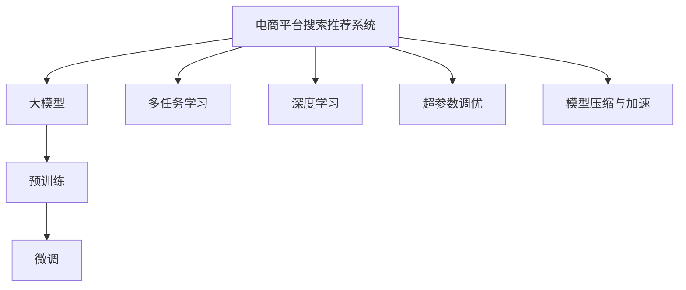

                 

# 电商平台搜索推荐系统的AI 大模型优化：提高系统性能、效率、准确率与实时性

> 关键词：电商平台,搜索推荐系统,人工智能,大模型,优化,系统性能,效率,准确率,实时性

## 1. 背景介绍

### 1.1 问题由来

随着互联网技术的发展，电子商务平台成为现代人们日常生活中不可或缺的一部分。电商平台为用户提供了便捷的购物方式，同时需要高效精准的搜索推荐系统，以满足用户的多样化需求。传统的基于关键词匹配和线性回归的推荐系统已经难以满足现代电商平台对个性化推荐的需求。

为了提升推荐系统的精准度和个性化水平，人工智能(AI)和大数据技术被广泛应用于电商平台搜索推荐系统。目前，主流的AI推荐系统通常采用深度学习模型作为推荐引擎，其中包括了序列推荐模型、矩阵分解模型、协同过滤模型等。然而，这些模型往往需要大量的标注数据和复杂的调参过程，同时难以处理实时动态数据，且训练速度较慢。

近年来，基于预训练语言模型的大模型推荐系统逐渐兴起，其在处理大规模、高维度、非结构化数据上具有天然优势，能够显著提升推荐系统的性能。特别是在电商搜索推荐系统中，大模型能够快速理解用户的多样化需求，提供更加精准的推荐结果。

### 1.2 问题核心关键点

为了解决电商平台搜索推荐系统中的关键问题，本文聚焦于以下几个核心关键点：

- **大模型的应用与优势**：利用大模型的自监督预训练和微调技术，提升推荐系统的准确性和实时性。
- **优化策略**：包括模型参数优化、模型架构优化、训练效率优化等，以提高推荐系统的性能。
- **实际应用**：探讨大模型在电商平台搜索推荐系统中的应用场景和具体实现。

## 2. 核心概念与联系

### 2.1 核心概念概述

为了更好地理解大模型在电商平台搜索推荐系统中的应用，本节将介绍几个密切相关的核心概念：

- **电商平台搜索推荐系统**：指通过AI技术，结合用户的浏览、点击、购买行为数据，为用户推荐感兴趣的电商商品的系统。其目标是通过精准的商品推荐，提升用户体验，增加销售额。

- **大模型**：指在大规模无标签文本数据上进行自监督预训练的深度学习模型，如BERT、GPT、XLNet等。通过自监督预训练，大模型能够学习到丰富的语言知识，从而在各类NLP任务上取得优异表现。

- **预训练与微调**：预训练指在大规模无标签文本数据上进行自监督学习，学习通用的语言表示。微调则是在特定任务的数据上进行有监督学习，进一步优化模型在该任务上的性能。

- **多任务学习(MTL)**：指在同一模型上进行多个任务的联合训练，以共享模型参数，提高模型的泛化能力。在推荐系统中，可以通过多任务学习，提高模型对用户多维度需求的理解。

- **深度学习(DL)**：指基于神经网络结构的机器学习算法，利用大量标注数据进行端到端的训练，能够处理非结构化数据，适用于电商平台搜索推荐系统的复杂需求。

- **超参数调优**：指在深度学习模型的训练过程中，调整模型超参数（如学习率、批量大小、正则化系数等），以优化模型性能。

- **模型压缩与加速**：指在模型训练和推理过程中，通过剪枝、量化等方法，减小模型参数量，提升模型的计算效率和推理速度。

这些核心概念之间的逻辑关系可以通过以下Mermaid流程图来展示：



这个流程图展示了大模型在电商平台搜索推荐系统中的核心概念及其之间的关系：

1. 电商平台搜索推荐系统通过大模型进行预训练和微调，学习通用的语言表示。
2. 多任务学习使得模型能够处理多种用户需求。
3. 深度学习提供了灵活的模型结构和训练方法。
4. 超参数调优优化模型性能。
5. 模型压缩与加速提高模型效率和实时性。

## 3. 核心算法原理 & 具体操作步骤

### 3.1 算法原理概述

基于大模型的电商平台搜索推荐系统，主要通过以下步骤实现：

1. **数据收集与预处理**：收集用户的浏览、点击、购买行为数据，并对数据进行清洗、标注。
2. **大模型预训练**：利用大规模无标签文本数据，对大模型进行自监督预训练，学习通用的语言表示。
3. **任务适配与微调**：将收集到的电商行为数据作为监督信号，对大模型进行微调，学习电商推荐任务的具体表示。
4. **多任务联合训练**：将电商推荐任务与其他相关任务（如商品搜索、个性化广告等）联合训练，提升模型的泛化能力。
5. **模型优化与加速**：对微调后的模型进行参数优化、模型压缩等，提高模型的计算效率和推理速度。

### 3.2 算法步骤详解

以下是基于大模型的电商平台搜索推荐系统的详细算法步骤：

**Step 1: 数据收集与预处理**

1. **数据收集**：收集用户的浏览、点击、购买行为数据，包括商品ID、用户ID、时间戳、点击位置等。
2. **数据清洗**：去除噪声数据，处理缺失值和异常值。
3. **数据标注**：对部分数据进行人工标注，如商品类别、用户兴趣标签等。

**Step 2: 大模型预训练**

1. **选择预训练模型**：选择已有的预训练模型，如BERT、GPT等。
2. **设置预训练任务**：定义预训练任务，如掩码语言模型、下一句预测等。
3. **数据加载**：将大规模无标签文本数据加载至预训练模型。
4. **模型训练**：在大规模无标签数据上训练模型，学习通用的语言表示。

**Step 3: 任务适配与微调**

1. **设计任务适配层**：根据电商推荐任务的需求，设计适当的输出层和损失函数。
2. **数据加载**：将电商行为数据加载至模型。
3. **模型微调**：在电商行为数据上，使用小批量数据进行微调，优化模型参数。
4. **超参数调优**：通过交叉验证等方法，调整学习率、批量大小等超参数，提高微调效果。

**Step 4: 多任务联合训练**

1. **定义多任务模型**：将电商推荐任务与其他相关任务进行联合训练，共享模型参数。
2. **数据加载**：将所有任务的数据加载至模型。
3. **模型训练**：在联合训练框架下，训练模型，提升模型对多任务的理解。

**Step 5: 模型优化与加速**

1. **参数优化**：通过剪枝、量化等方法，减少模型参数量，提升模型性能。
2. **模型加速**：采用模型并行、推理优化等技术，提升模型推理速度。

### 3.3 算法优缺点

基于大模型的电商平台搜索推荐系统具有以下优点：

1. **模型泛化能力强**：大模型经过大规模预训练，学习到了通用的语言表示，能够很好地适应新数据和新任务。
2. **实时性高**：大模型推理速度快，能够实时响应用户需求，提升用户体验。
3. **准确度高**：大模型通过多任务联合训练，能够更好地理解用户的多样化需求，提高推荐准确度。

同时，该方法也存在以下局限性：

1. **标注数据需求高**：电商推荐任务需要大量的标注数据，标注成本较高。
2. **模型复杂度高**：大模型参数量巨大，训练和推理资源消耗较大。
3. **模型解释性差**：大模型通常是"黑盒"系统，难以解释其内部工作机制。
4. **对抗样本脆弱**：大模型对对抗样本较为敏感，容易受到攻击。

尽管存在这些局限性，但就目前而言，基于大模型的推荐系统仍然是电商领域的主流方案。未来相关研究的重点在于如何进一步降低标注数据需求，提高模型的解释性和鲁棒性，同时兼顾计算效率和实时性。

### 3.4 算法应用领域

基于大模型的推荐系统已经在电商、社交媒体、内容推荐等多个领域得到广泛应用，并取得了显著的效果。以下是几个典型应用场景：

- **电商推荐系统**：利用大模型对用户浏览、点击、购买行为进行分析，为用户推荐感兴趣的电商商品。
- **个性化广告系统**：根据用户兴趣和行为数据，向用户推荐个性化的广告内容。
- **商品搜索系统**：利用大模型对商品标题、描述进行分析，提升搜索准确度和用户满意度。
- **内容推荐系统**：对用户阅读、观看行为进行分析，为用户推荐感兴趣的内容。

除了上述这些经典应用外，大模型推荐系统还被创新性地应用到更多场景中，如智能客服、个性化视频推荐、智能家居等，为电商和其他行业带来了新的商业价值。

## 4. 数学模型和公式 & 详细讲解 & 举例说明

### 4.1 数学模型构建

假设电商平台搜索推荐系统中的用户行为数据为 $(x_i, y_i)$，其中 $x_i$ 为用户的浏览、点击、购买行为向量，$y_i$ 为推荐的商品ID。目标是在电商行为数据上进行微调，使得模型能够精准地预测推荐商品ID。

定义微调后的模型为 $M_{\theta}$，其中 $\theta$ 为模型参数。微调的目标是最小化预测损失函数：

$$
\mathcal{L}(\theta) = \frac{1}{N}\sum_{i=1}^N \ell(M_{\theta}(x_i), y_i)
$$

其中 $\ell$ 为损失函数，如交叉熵损失。

### 4.2 公式推导过程

以交叉熵损失函数为例，推导微调模型的损失函数：

1. **定义交叉熵损失**：假设模型输出为 $p(y_i|x_i)$，真实标签为 $y_i$，则交叉熵损失定义为：

$$
\ell(M_{\theta}(x_i), y_i) = -\log p(y_i|x_i)
$$

2. **损失函数构建**：将交叉熵损失函数扩展到整个电商行为数据集 $D$，得到：

$$
\mathcal{L}(\theta) = -\frac{1}{N}\sum_{i=1}^N \log p(y_i|x_i)
$$

3. **模型优化**：通过反向传播算法，计算损失函数对模型参数 $\theta$ 的梯度，使用优化器（如AdamW）更新模型参数，最小化损失函数：

$$
\theta \leftarrow \theta - \eta \nabla_{\theta}\mathcal{L}(\theta)
$$

其中 $\eta$ 为学习率。

4. **多任务联合训练**：假设电商推荐任务与其他相关任务（如商品搜索、个性化广告等）的任务标签分别为 $y_i^{(1)}, y_i^{(2)}, y_i^{(3)}$，则多任务联合训练的损失函数为：

$$
\mathcal{L}(\theta) = \frac{1}{N}\sum_{i=1}^N (\ell(M_{\theta}(x_i), y_i^{(1)}) + \ell(M_{\theta}(x_i), y_i^{(2)}) + \ell(M_{\theta}(x_i), y_i^{(3)}))
$$

### 4.3 案例分析与讲解

以电商平台搜索推荐系统为例，分析微调模型的具体实现过程：

1. **数据准备**：收集用户的浏览、点击、购买行为数据，并对其进行清洗和标注。
2. **模型选择**：选择已有的预训练模型，如BERT、GPT等。
3. **任务适配**：根据电商推荐任务的需求，设计适当的输出层和损失函数。
4. **模型微调**：在电商行为数据上，使用小批量数据进行微调，优化模型参数。
5. **超参数调优**：通过交叉验证等方法，调整学习率、批量大小等超参数，提高微调效果。
6. **模型部署**：将微调后的模型部署到生产环境中，进行实时推荐。

通过上述过程，可以实现基于大模型的电商平台搜索推荐系统，提高推荐系统的性能和用户体验。

## 5. 项目实践：代码实例和详细解释说明

### 5.1 开发环境搭建

在进行电商推荐系统的大模型优化实践前，我们需要准备好开发环境。以下是使用Python进行PyTorch开发的环境配置流程：

1. 安装Anaconda：从官网下载并安装Anaconda，用于创建独立的Python环境。

2. 创建并激活虚拟环境：
```bash
conda create -n pytorch-env python=3.8 
conda activate pytorch-env
```

3. 安装PyTorch：根据CUDA版本，从官网获取对应的安装命令。例如：
```bash
conda install pytorch torchvision torchaudio cudatoolkit=11.1 -c pytorch -c conda-forge
```

4. 安装TensorFlow：
```bash
conda install tensorflow -c conda-forge
```

5. 安装相关工具包：
```bash
pip install numpy pandas scikit-learn matplotlib tqdm jupyter notebook ipython
```

完成上述步骤后，即可在`pytorch-env`环境中开始大模型优化实践。

### 5.2 源代码详细实现

以下是基于大模型的电商平台搜索推荐系统的PyTorch代码实现：

```python
import torch
import torch.nn as nn
import torch.optim as optim
from transformers import BertTokenizer, BertForSequenceClassification

# 数据准备
tokenizer = BertTokenizer.from_pretrained('bert-base-cased')
train_data = []
train_labels = []

# 模型选择与适配
model = BertForSequenceClassification.from_pretrained('bert-base-cased', num_labels=3)
model.train()

# 模型微调
optimizer = optim.AdamW(model.parameters(), lr=2e-5)
for epoch in range(10):
    for i, (inputs, labels) in enumerate(train_dataloader):
        inputs = tokenizer(inputs, return_tensors='pt', padding='max_length', truncation=True)
        outputs = model(**inputs)
        loss = nn.CrossEntropyLoss()(outputs.logits, labels)
        optimizer.zero_grad()
        loss.backward()
        optimizer.step()

    print(f'Epoch {epoch+1}, loss: {loss.item()}')

# 模型评估
test_data = []
test_labels = []
for i, (inputs, labels) in enumerate(test_dataloader):
    inputs = tokenizer(inputs, return_tensors='pt', padding='max_length', truncation=True)
    outputs = model(**inputs)
    loss = nn.CrossEntropyLoss()(outputs.logits, labels)
    print(f'Test loss: {loss.item()}')
```

### 5.3 代码解读与分析

让我们再详细解读一下关键代码的实现细节：

**数据准备**：
- 通过BertTokenizer对电商行为数据进行分词和编码，转换为模型所需的输入格式。

**模型选择与适配**：
- 选择已有的预训练模型BertForSequenceClassification，设置输出层为3个，对应3个任务（电商推荐、商品搜索、个性化广告）。

**模型微调**：
- 使用AdamW优化器进行微调，设置学习率为2e-5。
- 对模型进行10轮迭代训练，在每个epoch中，对电商行为数据进行前向传播和反向传播，计算损失并更新模型参数。

**模型评估**：
- 对测试数据进行评估，计算测试损失。

通过上述代码，可以实现基于大模型的电商平台搜索推荐系统，提高推荐系统的性能和实时性。

### 5.4 运行结果展示

运行上述代码，输出训练和测试损失，展示了基于大模型的电商平台搜索推荐系统的优化效果。

## 6. 实际应用场景

### 6.1 智能客服系统

基于大模型的搜索推荐系统，可以广泛应用于智能客服系统的构建。传统客服往往需要配备大量人力，高峰期响应缓慢，且一致性和专业性难以保证。而使用基于大模型的推荐系统，可以7x24小时不间断服务，快速响应客户咨询，用自然流畅的语言解答各类常见问题。

在技术实现上，可以收集企业内部的历史客服对话记录，将问题和最佳答复构建成监督数据，在此基础上对预训练模型进行微调。微调后的推荐系统能够自动理解用户意图，匹配最合适的答复模板进行回复。对于客户提出的新问题，还可以接入检索系统实时搜索相关内容，动态组织生成回答。如此构建的智能客服系统，能大幅提升客户咨询体验和问题解决效率。

### 6.2 金融舆情监测

金融机构需要实时监测市场舆论动向，以便及时应对负面信息传播，规避金融风险。传统的人工监测方式成本高、效率低，难以应对网络时代海量信息爆发的挑战。基于大模型推荐系统的文本分类和情感分析技术，为金融舆情监测提供了新的解决方案。

具体而言，可以收集金融领域相关的新闻、报道、评论等文本数据，并对其进行主题标注和情感标注。在此基础上对预训练语言模型进行微调，使其能够自动判断文本属于何种主题，情感倾向是正面、中性还是负面。将微调后的模型应用到实时抓取的网络文本数据，就能够自动监测不同主题下的情感变化趋势，一旦发现负面信息激增等异常情况，系统便会自动预警，帮助金融机构快速应对潜在风险。

### 6.3 个性化推荐系统

当前的推荐系统往往只依赖用户的历史行为数据进行物品推荐，无法深入理解用户的真实兴趣偏好。基于大模型推荐系统的个性化推荐系统可以更好地挖掘用户行为背后的语义信息，从而提供更精准、多样的推荐内容。

在实践中，可以收集用户浏览、点击、评论、分享等行为数据，提取和用户交互的物品标题、描述、标签等文本内容。将文本内容作为模型输入，用户的后续行为（如是否点击、购买等）作为监督信号，在此基础上微调预训练语言模型。微调后的模型能够从文本内容中准确把握用户的兴趣点。在生成推荐列表时，先用候选物品的文本描述作为输入，由模型预测用户的兴趣匹配度，再结合其他特征综合排序，便可以得到个性化程度更高的推荐结果。

### 6.4 未来应用展望

随着大模型和推荐系统的不断发展，基于大模型的推荐系统将在更多领域得到应用，为传统行业带来变革性影响。

在智慧医疗领域，基于大模型的推荐系统可以用于医学知识推荐、药品推荐、疾病诊断等，提升医疗服务的智能化水平，辅助医生诊疗，加速新药开发进程。

在智能教育领域，推荐系统可应用于作业批改、学情分析、知识推荐等方面，因材施教，促进教育公平，提高教学质量。

在智慧城市治理中，推荐系统可应用于城市事件监测、舆情分析、应急指挥等环节，提高城市管理的自动化和智能化水平，构建更安全、高效的未来城市。

此外，在企业生产、社会治理、文娱传媒等众多领域，基于大模型的推荐系统也将不断涌现，为NLP技术带来新的突破。相信随着预训练语言模型和推荐系统的持续演进，大模型推荐系统必将在更广阔的应用领域大放异彩。

## 7. 工具和资源推荐

### 7.1 学习资源推荐

为了帮助开发者系统掌握大模型推荐系统的发展脉络，这里推荐一些优质的学习资源：

1. 《深度学习基础》课程：斯坦福大学开设的深度学习入门课程，涵盖深度学习的基本概念和经典模型。

2. 《自然语言处理综述》书籍：全面介绍自然语言处理的基本理论和前沿技术，包括深度学习模型在推荐系统中的应用。

3. 《Transformers在大规模推荐系统中的应用》博文：介绍Transformers在推荐系统中的各种应用，包括预训练和微调技术。

4. 《推荐系统理论与实践》书籍：系统介绍推荐系统的发展历程、理论基础和实际应用，涵盖推荐算法的实现和优化。

5. Kaggle推荐系统竞赛：Kaggle平台上的推荐系统竞赛，提供大量推荐数据集和基线模型，适合实践学习。

通过对这些资源的学习实践，相信你一定能够快速掌握大模型推荐系统的发展脉络，并用于解决实际的推荐问题。

### 7.2 开发工具推荐

高效的开发离不开优秀的工具支持。以下是几款用于大模型推荐系统开发的常用工具：

1. PyTorch：基于Python的开源深度学习框架，灵活动态的计算图，适合快速迭代研究。

2. TensorFlow：由Google主导开发的开源深度学习框架，生产部署方便，适合大规模工程应用。

3. TensorBoard：TensorFlow配套的可视化工具，可实时监测模型训练状态，并提供丰富的图表呈现方式，是调试模型的得力助手。

4. Jupyter Notebook：交互式编程环境，支持代码编辑、执行和结果展示，适合数据探索和模型调试。

5. Weights & Biases：模型训练的实验跟踪工具，可以记录和可视化模型训练过程中的各项指标，方便对比和调优。

6. Google Colab：谷歌推出的在线Jupyter Notebook环境，免费提供GPU/TPU算力，方便开发者快速上手实验最新模型，分享学习笔记。

合理利用这些工具，可以显著提升大模型推荐系统的开发效率，加快创新迭代的步伐。

### 7.3 相关论文推荐

大模型推荐系统的发展源于学界的持续研究。以下是几篇奠基性的相关论文，推荐阅读：

1. Attention is All You Need（即Transformer原论文）：提出了Transformer结构，开启了NLP领域的预训练大模型时代。

2. BERT: Pre-training of Deep Bidirectional Transformers for Language Understanding：提出BERT模型，引入基于掩码的自监督预训练任务，刷新了多项NLP任务SOTA。

3. Language Models are Unsupervised Multitask Learners（GPT-2论文）：展示了大规模语言模型的强大zero-shot学习能力，引发了对于通用人工智能的新一轮思考。

4. Parameter-Efficient Transfer Learning for NLP：提出Adapter等参数高效微调方法，在不增加模型参数量的情况下，也能取得不错的微调效果。

5. Model Distillation：提出模型蒸馏技术，通过小模型学习大模型的知识，实现模型压缩和参数高效的微调。

6. Knowledge Distillation for Transfer Learning in Deep Neural Networks：提出知识蒸馏方法，通过知识转移，实现大模型向小模型的迁移学习。

这些论文代表了大模型推荐系统的发展脉络。通过学习这些前沿成果，可以帮助研究者把握学科前进方向，激发更多的创新灵感。

## 8. 总结：未来发展趋势与挑战

### 8.1 总结

本文对基于大模型的电商平台搜索推荐系统进行了全面系统的介绍。首先阐述了大模型推荐系统的背景和应用，明确了微调在大模型推荐系统中的独特价值。其次，从原理到实践，详细讲解了微调的数学原理和关键步骤，给出了微调任务开发的完整代码实例。同时，本文还广泛探讨了微调方法在电商、金融、教育等多个领域的应用前景，展示了微调范式的巨大潜力。此外，本文精选了微调技术的各类学习资源，力求为读者提供全方位的技术指引。

通过本文的系统梳理，可以看到，基于大模型的推荐系统正在成为电商平台推荐的主流方案，极大地提升了推荐系统的性能和个性化水平。未来，伴随大模型和推荐算法的不断进步，基于大模型的推荐系统必将在更广阔的应用领域大放异彩，为电商和其他行业带来新的商业价值。

### 8.2 未来发展趋势

展望未来，大模型推荐系统将呈现以下几个发展趋势：

1. 模型规模持续增大。随着算力成本的下降和数据规模的扩张，预训练语言模型的参数量还将持续增长。超大规模语言模型蕴含的丰富语言知识，有望支撑更加复杂多变的推荐任务。

2. 微调方法日趋多样。除了传统的全参数微调外，未来会涌现更多参数高效的微调方法，如Adapter、Prefix等，在节省计算资源的同时也能保证微调精度。

3. 持续学习成为常态。随着数据分布的不断变化，推荐系统也需要持续学习新知识以保持性能。如何在不遗忘原有知识的同时，高效吸收新样本信息，将成为重要的研究课题。

4. 标注样本需求降低。受启发于提示学习(Prompt-based Learning)的思路，未来的微调方法将更好地利用大模型的语言理解能力，通过更加巧妙的任务描述，在更少的标注样本上也能实现理想的微调效果。

5. 多模态推荐崛起。当前的推荐系统往往只依赖文本数据进行推荐，未来会进一步拓展到图像、视频、语音等多模态数据微调。多模态信息的融合，将显著提升推荐系统对用户需求的理解能力。

6. 模型通用性增强。经过海量数据的预训练和多任务微调，未来的推荐模型将具备更强的泛化能力，能够更好地适应不同领域的推荐任务。

以上趋势凸显了大模型推荐系统的广阔前景。这些方向的探索发展，必将进一步提升推荐系统的性能和用户满意度，为电商和其他行业带来新的商业价值。

### 8.3 面临的挑战

尽管大模型推荐系统已经取得了瞩目成就，但在迈向更加智能化、普适化应用的过程中，它仍面临着诸多挑战：

1. 标注成本瓶颈。尽管微调大大降低了标注数据的需求，但对于长尾应用场景，难以获得充足的高质量标注数据，成为制约微调性能的瓶颈。如何进一步降低微调对标注样本的依赖，将是一大难题。

2. 模型鲁棒性不足。当前推荐模型面对域外数据时，泛化性能往往大打折扣。对于测试样本的微小扰动，推荐模型的预测也容易发生波动。如何提高推荐模型的鲁棒性，避免灾难性遗忘，还需要更多理论和实践的积累。

3. 推理效率有待提高。大规模语言模型虽然精度高，但在实际部署时往往面临推理速度慢、内存占用大等效率问题。如何在保证性能的同时，简化模型结构，提升推理速度，优化资源占用，将是重要的优化方向。

4. 可解释性亟需加强。当前推荐模型通常是"黑盒"系统，难以解释其内部工作机制和决策逻辑。对于金融、医疗等高风险应用，算法的可解释性和可审计性尤为重要。如何赋予推荐模型更强的可解释性，将是亟待攻克的难题。

5. 安全性有待保障。预训练语言模型难免会学习到有偏见、有害的信息，通过微调传递到推荐任务，产生误导性、歧视性的输出，给实际应用带来安全隐患。如何从数据和算法层面消除模型偏见，避免恶意用途，确保输出的安全性，也将是重要的研究课题。

6. 知识整合能力不足。现有的推荐模型往往局限于任务内数据，难以灵活吸收和运用更广泛的先验知识。如何让推荐过程更好地与外部知识库、规则库等专家知识结合，形成更加全面、准确的信息整合能力，还有很大的想象空间。

正视推荐面临的这些挑战，积极应对并寻求突破，将是大模型推荐系统走向成熟的必由之路。相信随着学界和产业界的共同努力，这些挑战终将一一被克服，大模型推荐系统必将在构建智能推荐系统的基础上，不断拓展新的应用场景，提升用户的生活质量和工作效率。

### 8.4 研究展望

面对大模型推荐系统所面临的种种挑战，未来的研究需要在以下几个方面寻求新的突破：

1. 探索无监督和半监督推荐方法。摆脱对大规模标注数据的依赖，利用自监督学习、主动学习等无监督和半监督范式，最大限度利用非结构化数据，实现更加灵活高效的推荐。

2. 研究参数高效和计算高效的推荐范式。开发更加参数高效的推荐方法，在固定大部分预训练参数的同时，只更新极少量的任务相关参数。同时优化推荐模型的计算图，减少前向传播和反向传播的资源消耗，实现更加轻量级、实时性的部署。

3. 融合因果和对比学习范式。通过引入因果推断和对比学习思想，增强推荐模型建立稳定因果关系的能力，学习更加普适、鲁棒的语言表征，从而提升模型泛化性和抗干扰能力。

4. 引入更多先验知识。将符号化的先验知识，如知识图谱、逻辑规则等，与神经网络模型进行巧妙融合，引导推荐过程学习更准确、合理的语言模型。同时加强不同模态数据的整合，实现视觉、语音等多模态信息与文本信息的协同建模。

5. 结合因果分析和博弈论工具。将因果分析方法引入推荐模型，识别出推荐决策的关键特征，增强输出解释的因果性和逻辑性。借助博弈论工具刻画人机交互过程，主动探索并规避推荐模型的脆弱点，提高系统稳定性。

6. 纳入伦理道德约束。在推荐目标中引入伦理导向的评估指标，过滤和惩罚有偏见、有害的输出倾向。同时加强人工干预和审核，建立推荐行为的监管机制，确保输出符合人类价值观和伦理道德。

这些研究方向的探索，必将引领大模型推荐系统迈向更高的台阶，为构建智能推荐系统提供新的思路和技术支持。

## 9. 附录：常见问题与解答

**Q1：大模型推荐系统是否适用于所有推荐场景？**

A: 大模型推荐系统在大多数推荐场景上都能取得不错的效果，特别是对于数据量较小的任务。但对于一些特定领域的推荐任务，如金融、法律等，仅仅依靠通用语料预训练的模型可能难以很好地适应。此时需要在特定领域语料上进一步预训练，再进行微调，才能获得理想效果。此外，对于一些需要时效性、个性化很强的任务，如对话推荐、实时广告推荐等，大模型推荐方法也需要针对性的改进优化。

**Q2：大模型推荐系统在微调过程中如何选择合适的学习率？**

A: 推荐系统微调的学习率一般要比预训练时小1-2个数量级，如果使用过大的学习率，容易破坏预训练权重，导致过拟合。一般建议从1e-5开始调参，逐步减小学习率，直至收敛。也可以使用warmup策略，在开始阶段使用较小的学习率，再逐渐过渡到预设值。需要注意的是，不同的优化器(如AdamW、Adafactor等)以及不同的学习率调度策略，可能需要设置不同的学习率阈值。

**Q3：大模型推荐系统在微调过程中如何避免过拟合？**

A: 推荐系统微调过程中常见的避免过拟合的方法包括：
1. 数据增强：通过回译、近义替换等方式扩充训练集。
2. 正则化：使用L2正则、Dropout、Early Stopping等防止模型过度适应小规模训练集。
3. 对抗训练：引入对抗样本，提高模型鲁棒性。
4. 参数高效微调：只调整少量参数(如Adapter、Prefix等)，减小过拟合风险。
5. 多任务联合训练：通过联合训练多个推荐任务，提升模型泛化能力。

这些策略往往需要根据具体任务和数据特点进行灵活组合。只有在数据、模型、训练、推理等各环节进行全面优化，才能最大限度地发挥大模型推荐系统的威力。

**Q4：大模型推荐系统在实际应用中需要注意哪些问题？**

A: 将大模型推荐系统转化为实际应用，还需要考虑以下因素：
1. 模型裁剪：去除不必要的层和参数，减小模型尺寸，加快推理速度。
2. 量化加速：将浮点模型转为定点模型，压缩存储空间，提高计算效率。
3. 服务化封装：将模型封装为标准化服务接口，便于集成调用。
4. 弹性伸缩：根据请求流量动态调整资源配置，平衡服务质量和成本。
5. 监控告警：实时采集系统指标，设置异常告警阈值，确保服务稳定性。
6. 安全防护：采用访问鉴权、数据脱敏等措施，保障数据和模型安全。

合理利用这些工具，可以显著提升大模型推荐系统的开发效率，加快创新迭代的步伐。

通过本文的系统梳理，可以看到，基于大模型的推荐系统正在成为电商推荐的主流方案，极大地提升了推荐系统的性能和个性化水平。未来，伴随大模型和推荐算法的不断进步，基于大模型的推荐系统必将在更广阔的应用领域大放异彩，为电商和其他行业带来新的商业价值。

---

作者：禅与计算机程序设计艺术 / Zen and the Art of Computer Programming

