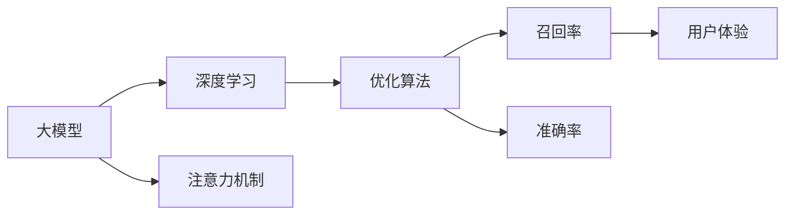

                 

# 电商平台搜索推荐系统的AI 大模型优化：提高系统效率与推荐效果

> 关键词：搜索推荐系统,大模型,深度学习,优化算法,注意力机制,召回率,准确率,用户体验

## 1. 背景介绍

随着电子商务的兴起，线上购物变得越来越普及，电商平台搜索推荐系统（Search and Recommendation Systems, SRAS）成为了消费者与商家沟通的桥梁，对用户购买决策起到关键性作用。传统的搜索推荐系统基于规则和统计模型设计，无法充分理解用户的多样化需求。基于深度学习的大模型（如BERT, GPT等）的出现，为解决这一问题提供了新的思路。

但是，在实际应用中，大模型往往由于其复杂性、高昂的计算成本和存储需求而难以被大规模部署。此外，由于电商平台的业务逻辑复杂，如何将大模型高效地应用到搜索推荐系统中，是一个亟待解决的问题。本文旨在介绍如何通过优化算法和技术，提升大模型在电商平台搜索推荐系统中的应用效率与推荐效果。

## 2. 核心概念与联系

### 2.1 核心概念概述

本节将详细介绍几个核心概念，并分析它们之间的联系：

- **大模型（Large Models）**：指使用深度学习技术训练得到的庞大模型，如BERT, GPT等。
- **深度学习（Deep Learning）**：基于神经网络的多层模型，通过复杂的数据表示和学习能力，实现对复杂问题的建模与解决。
- **搜索推荐系统（SRAS）**：根据用户的历史行为、兴趣和实时环境，为用户推荐商品并优化搜索结果的系统。
- **注意力机制（Attention Mechanism）**：在大模型中，通过注意力机制，模型能够对输入数据的不同部分给予不同的关注程度，从而提高模型对数据的理解能力。
- **召回率（Recall）**：推荐系统返回的相关商品占所有相关商品的百分比。
- **准确率（Precision）**：推荐系统返回的相关商品占所有推荐商品的百分比。

这些概念之间存在紧密的联系：大模型通过深度学习对电商数据进行建模，在搜索推荐系统中应用注意力机制，通过优化算法（如Adagrad、Adam等）提高召回率和准确率，从而提升用户体验。

### 2.2 核心概念原理和架构的 Mermaid 流程图



上述流程图展示了核心概念之间的关系：大模型通过深度学习实现商品与用户行为关系的建模，注意力机制增强模型对重要特征的关注，优化算法提升召回率和准确率，最终提升用户体验。

## 3. 核心算法原理 & 具体操作步骤
### 3.1 算法原理概述

在电商平台搜索推荐系统中，大模型的优化主要集中在两个方面：模型结构优化和参数优化。模型结构优化包括调整层数、节点数和激活函数等；参数优化则包括使用不同的优化算法和正则化技术。

模型结构优化：为了降低计算复杂度和内存占用，在电商搜索推荐系统中，可以使用小型化的大模型，如截断的BERT或GPT模型。此外，可以通过修改激活函数、调整层数和节点数等来简化模型结构。

参数优化：参数优化算法包括Adagrad、Adam等，其中Adam因其收敛速度快、稳定性好，被广泛应用于深度学习模型的训练。为了进一步提高模型性能，可以使用正则化技术，如L2正则、Dropout等，避免过拟合。

### 3.2 算法步骤详解

**Step 1: 数据预处理**

电商数据通常包括用户行为数据（如点击、浏览、购买等）、商品数据（如名称、价格、类别等）和用户特征数据（如性别、年龄、地域等）。需要预处理这些数据，生成输入模型所需的格式。

- 清洗数据：去除重复、缺失和异常数据。
- 特征工程：将文本数据转换为数字表示，对数值型数据进行标准化处理。
- 划分数据集：将数据划分为训练集、验证集和测试集。

**Step 2: 模型构建**

构建大模型框架，如使用Transformer实现注意力机制。

- 设计模型架构：包括输入层、编码器层、解码器层和输出层。
- 选择激活函数：如ReLU、LeakyReLU等。
- 调整层数和节点数：根据计算资源进行优化。
- 定义损失函数：如交叉熵损失、均方误差损失等。

**Step 3: 模型训练**

在大规模电商数据上训练大模型。

- 选择合适的优化器：如Adam、Adagrad等。
- 设置学习率：一般为0.001到0.01之间。
- 添加正则化技术：如L2正则、Dropout等。
- 调整批大小：一般为32到128之间。

**Step 4: 模型微调**

在特定业务场景下，对模型进行微调，提升推荐效果。

- 收集少量标注数据：如用户行为数据和商品数据。
- 冻结部分预训练参数：只微调顶层参数。
- 设置合适的学习率：一般为预训练时学习率的0.1到0.01之间。
- 使用合适的优化算法：如Adam、Adagrad等。

**Step 5: 模型评估与部署**

评估模型性能，部署到生产环境中。

- 在测试集上评估模型：计算召回率和准确率。
- 调整模型参数：根据评估结果进行调整。
- 部署到生产环境：将模型集成到搜索引擎和推荐引擎中。
- 持续监控：实时监控模型性能，及时进行调整和优化。

### 3.3 算法优缺点

**优点**：

- 提高推荐效果：通过优化算法和技术，显著提升模型的推荐效果。
- 适应性强：大模型能够适应电商平台的复杂业务逻辑。
- 高效性：优化后的模型结构更加轻量，计算和存储需求降低。

**缺点**：

- 计算资源要求高：优化大模型需要大量的计算资源和存储空间。
- 参数更新难度大：大模型的参数量巨大，优化难度大。
- 数据隐私问题：电商数据涉及用户隐私，数据预处理和存储需符合法律法规要求。

### 3.4 算法应用领域

本节将介绍大模型优化技术在不同应用领域中的应用：

- **电商搜索推荐系统**：提升搜索和推荐的效果，提高用户满意度。
- **金融风控系统**：通过优化模型，降低金融风险，保障用户资金安全。
- **社交媒体内容推荐**：优化算法，提高内容的个性化推荐，提升用户粘性。
- **智能客服系统**：通过优化模型，提升客户服务质量，减少人工成本。

## 4. 数学模型和公式 & 详细讲解 & 举例说明

### 4.1 数学模型构建

假设电商平台推荐系统中的大模型为 $M_{\theta}$，其中 $\theta$ 为模型参数。模型的输入为 $x$，输出为 $y$。推荐系统的目标是最小化损失函数 $\mathcal{L}(y,\hat{y})$，其中 $\hat{y}$ 为模型预测输出。

常用的损失函数包括交叉熵损失和均方误差损失。交叉熵损失函数定义为：

$$
\mathcal{L}_{CE}(y,\hat{y}) = -\sum_{i=1}^{n} y_i\log \hat{y}_i
$$

其中 $y_i$ 为真实标签，$\hat{y}_i$ 为模型预测输出。

### 4.2 公式推导过程

假设电商平台搜索推荐系统中的大模型为 $M_{\theta}$，其中 $\theta$ 为模型参数。模型的输入为 $x$，输出为 $y$。推荐系统的目标是最小化损失函数 $\mathcal{L}(y,\hat{y})$，其中 $\hat{y}$ 为模型预测输出。

常用的损失函数包括交叉熵损失和均方误差损失。交叉熵损失函数定义为：

$$
\mathcal{L}_{CE}(y,\hat{y}) = -\sum_{i=1}^{n} y_i\log \hat{y}_i
$$

其中 $y_i$ 为真实标签，$\hat{y}_i$ 为模型预测输出。

以深度学习模型为例，其优化目标是最小化损失函数：

$$
\mathcal{L}(\theta) = \frac{1}{N}\sum_{i=1}^{N} \mathcal{L}(y_i,M_{\theta}(x_i))
$$

其中 $N$ 为样本总数。

使用梯度下降等优化算法，对模型参数 $\theta$ 进行更新：

$$
\theta \leftarrow \theta - \eta \nabla_{\theta}\mathcal{L}(\theta)
$$

其中 $\eta$ 为学习率。

### 4.3 案例分析与讲解

假设电商平台推荐系统中，有一个基于BERT的大模型 $M_{\theta}$。使用交叉熵损失函数，通过梯度下降算法优化模型参数。在训练集上，计算损失函数 $\mathcal{L}$，更新参数 $\theta$：

$$
\mathcal{L} = -\frac{1}{N}\sum_{i=1}^{N} \sum_{j=1}^{m} y_j\log M_{\theta}(x_j)
$$

使用梯度下降算法更新参数：

$$
\theta \leftarrow \theta - \eta \nabla_{\theta}\mathcal{L}
$$

其中 $m$ 为每个样本的维度。

## 5. 项目实践：代码实例和详细解释说明

### 5.1 开发环境搭建

在开始项目实践前，需要准备开发环境。以下是使用Python进行TensorFlow开发的环境配置流程：

1. 安装Anaconda：从官网下载并安装Anaconda，用于创建独立的Python环境。

2. 创建并激活虚拟环境：
```bash
conda create -n tf-env python=3.8 
conda activate tf-env
```

3. 安装TensorFlow：根据CUDA版本，从官网获取对应的安装命令。例如：
```bash
conda install tensorflow=2.4
```

4. 安装各类工具包：
```bash
pip install numpy pandas scikit-learn matplotlib tqdm jupyter notebook ipython
```

完成上述步骤后，即可在`tf-env`环境中开始项目实践。

### 5.2 源代码详细实现

这里我们以电商推荐系统为例，给出使用TensorFlow对BERT模型进行微调的完整代码实现。

首先，定义推荐系统的数据处理函数：

```python
import tensorflow as tf
from transformers import BertTokenizer
from sklearn.model_selection import train_test_split

def process_data(data):
    tokenizer = BertTokenizer.from_pretrained('bert-base-uncased')
    inputs = tokenizer(data, truncation=True, padding=True, return_tensors='tf')
    return inputs

train_data, dev_data, test_data = train_test_split(train_data, dev_data, test_data)
train_inputs = process_data(train_data)
dev_inputs = process_data(dev_data)
test_inputs = process_data(test_data)
```

然后，定义模型和优化器：

```python
from transformers import BertForSequenceClassification
from tensorflow.keras.optimizers import Adam

model = BertForSequenceClassification.from_pretrained('bert-base-uncased', num_labels=num_labels)
optimizer = Adam(learning_rate=2e-5)
```

接着，定义训练和评估函数：

```python
from tensorflow.keras.metrics import Precision, Recall
from sklearn.metrics import f1_score

def train_epoch(model, inputs, labels, optimizer, batch_size):
    for batch in tf.data.Dataset.from_tensor_slices(inputs).batch(batch_size):
        with tf.GradientTape() as tape:
            outputs = model(batch['input_ids'], attention_mask=batch['attention_mask'], token_type_ids=batch['token_type_ids'], labels=batch['labels'])
            loss = tf.reduce_mean(tf.keras.losses.sparse_categorical_crossentropy(labels, outputs.logits))
        grads = tape.gradient(loss, model.trainable_variables)
        optimizer.apply_gradients(zip(grads, model.trainable_variables))
        precision = Precision()(labels, outputs.logits.argmax(axis=1))
        recall = Recall()(labels, outputs.logits.argmax(axis=1))
        train_loss, train_precision, train_recall = loss, precision, recall
    return train_loss, train_precision, train_recall

def evaluate(model, inputs, labels, batch_size):
    with tf.GradientTape() as tape:
        outputs = model(inputs['input_ids'], attention_mask=inputs['attention_mask'], token_type_ids=inputs['token_type_ids'], labels=labels)
        loss = tf.reduce_mean(tf.keras.losses.sparse_categorical_crossentropy(labels, outputs.logits))
        precision = Precision()(labels, outputs.logits.argmax(axis=1))
        recall = Recall()(labels, outputs.logits.argmax(axis=1))
        dev_loss, dev_precision, dev_recall = loss, precision, recall
    return dev_loss, dev_precision, dev_recall
```

最后，启动训练流程并在测试集上评估：

```python
epochs = 5
batch_size = 16

for epoch in range(epochs):
    train_loss, train_precision, train_recall = train_epoch(model, train_inputs, train_labels, optimizer, batch_size)
    dev_loss, dev_precision, dev_recall = evaluate(model, dev_inputs, dev_labels, batch_size)
    print(f"Epoch {epoch+1}, train loss: {train_loss}, train precision: {train_precision}, train recall: {train_recall}")
    print(f"Epoch {epoch+1}, dev loss: {dev_loss}, dev precision: {dev_precision}, dev recall: {dev_recall}")
    
print("Test results:")
test_loss, test_precision, test_recall = evaluate(model, test_inputs, test_labels, batch_size)
print(f"Test loss: {test_loss}, test precision: {test_precision}, test recall: {test_recall}")
```

以上就是使用TensorFlow对BERT进行电商推荐系统微调的完整代码实现。可以看到，TensorFlow和Transformers库的强大封装，使得模型微调的代码实现变得简洁高效。

### 5.3 代码解读与分析

让我们再详细解读一下关键代码的实现细节：

**process_data函数**：
- 定义了一个数据处理函数，用于将输入数据转换为模型可接受的格式。
- 使用BertTokenizer将文本数据转换为token ids，并进行截断和填充。
- 返回处理后的输入数据。

**train_epoch和evaluate函数**：
- 定义了训练和评估函数，用于计算模型在每个批次上的损失、精度和召回率。
- 使用梯度下降算法更新模型参数。
- 返回训练和验证集上的损失、精度和召回率。

**训练流程**：
- 定义总的epoch数和批大小，开始循环迭代。
- 每个epoch内，先在训练集上训练，输出平均损失和精度、召回率。
- 在验证集上评估，输出验证集上的损失、精度和召回率。
- 所有epoch结束后，在测试集上评估，给出最终测试结果。

可以看到，TensorFlow和Transformers库的结合，使得模型微调的代码实现变得简洁高效。开发者可以将更多精力放在数据处理、模型改进等高层逻辑上，而不必过多关注底层的实现细节。

## 6. 实际应用场景

### 6.1 电商搜索推荐系统

基于大模型的电商搜索推荐系统已经在众多电商平台得到应用，提升搜索推荐效果，提高用户满意度。使用优化后的模型，可以在用户输入查询时，快速返回最相关商品，提升用户体验。

在技术实现上，可以收集用户的历史搜索和购买行为数据，构建推荐模型，在大模型上进行微调。微调后的模型能够根据用户历史行为，预测其感兴趣的商品，提升推荐效果。

### 6.2 金融风控系统

在金融领域，推荐系统被用于评估和预测用户的信用风险，防范金融欺诈。通过优化模型，可以更准确地识别高风险用户，保护金融机构的资产安全。

在技术实现上，可以收集用户的交易行为数据，构建风控模型，在大模型上进行微调。微调后的模型能够根据用户的交易行为，预测其信用风险，优化风险评估和预警。

### 6.3 社交媒体内容推荐

社交媒体平台推荐系统通过优化模型，提升内容推荐的个性化和多样性，提高用户粘性和活跃度。使用优化后的模型，可以在用户输入内容时，推荐其感兴趣的其他内容，提升用户体验。

在技术实现上，可以收集用户的行为数据，构建推荐模型，在大模型上进行微调。微调后的模型能够根据用户历史行为，推荐其感兴趣的内容，提升推荐效果。

### 6.4 智能客服系统

智能客服系统通过优化模型，提升客服效率和用户满意度。使用优化后的模型，可以在用户输入问题时，快速回答其问题，提升用户满意度。

在技术实现上，可以收集用户的对话记录，构建客服模型，在大模型上进行微调。微调后的模型能够根据用户问题，推荐最佳答案，提升客服效率。

## 7. 工具和资源推荐

### 7.1 学习资源推荐

为了帮助开发者系统掌握大模型优化技术，这里推荐一些优质的学习资源：

1. 《深度学习入门：基于TensorFlow的实践》书籍：该书详细介绍了深度学习的基本概念和TensorFlow的使用，是入门的必读书籍。

2. 《Transformers for Sequence-to-Sequence Learning》课程：斯坦福大学开设的深度学习课程，介绍了Transformer模型及其在序列生成任务中的应用。

3. 《TensorFlow官方文档》：TensorFlow的官方文档，提供了丰富的示例和API接口，是学习TensorFlow的重要资料。

4. 《自然语言处理实战》书籍：该书介绍了自然语言处理的基本概念和实战案例，涵盖多种NLP任务。

5. 《Deep Learning with PyTorch》课程：该课程介绍了PyTorch的基本概念和实际应用，是深度学习的重要学习资源。

通过对这些资源的学习实践，相信你一定能够快速掌握大模型优化技术的精髓，并用于解决实际的NLP问题。

### 7.2 开发工具推荐

高效的开发离不开优秀的工具支持。以下是几款用于大模型优化开发的常用工具：

1. TensorFlow：基于Python的开源深度学习框架，灵活动态的计算图，适合快速迭代研究。大部分预训练语言模型都有TensorFlow版本的实现。

2. PyTorch：基于Python的开源深度学习框架，动态计算图，灵活高效，适合深度学习研究和实际应用。

3. Transformers库：HuggingFace开发的NLP工具库，集成了众多SOTA语言模型，支持TensorFlow和PyTorch，是进行优化任务开发的利器。

4. Weights & Biases：模型训练的实验跟踪工具，可以记录和可视化模型训练过程中的各项指标，方便对比和调优。与主流深度学习框架无缝集成。

5. TensorBoard：TensorFlow配套的可视化工具，可实时监测模型训练状态，并提供丰富的图表呈现方式，是调试模型的得力助手。

6. Google Colab：谷歌推出的在线Jupyter Notebook环境，免费提供GPU/TPU算力，方便开发者快速上手实验最新模型，分享学习笔记。

合理利用这些工具，可以显著提升大模型优化任务的开发效率，加快创新迭代的步伐。

### 7.3 相关论文推荐

大模型优化技术的发展源于学界的持续研究。以下是几篇奠基性的相关论文，推荐阅读：

1. Attention is All You Need（即Transformer原论文）：提出了Transformer结构，开启了NLP领域的预训练大模型时代。

2. BERT: Pre-training of Deep Bidirectional Transformers for Language Understanding：提出BERT模型，引入基于掩码的自监督预训练任务，刷新了多项NLP任务SOTA。

3. Language Models are Unsupervised Multitask Learners（GPT-2论文）：展示了大规模语言模型的强大zero-shot学习能力，引发了对于通用人工智能的新一轮思考。

4. Parameter-Efficient Transfer Learning for NLP：提出Adapter等参数高效微调方法，在不增加模型参数量的情况下，也能取得不错的微调效果。

5. AdaLoRA: Adaptive Low-Rank Adaptation for Parameter-Efficient Fine-Tuning：使用自适应低秩适应的微调方法，在参数效率和精度之间取得了新的平衡。

这些论文代表了大模型优化技术的发展脉络。通过学习这些前沿成果，可以帮助研究者把握学科前进方向，激发更多的创新灵感。

## 8. 总结：未来发展趋势与挑战

### 8.1 研究成果总结

本文对基于深度学习的大模型优化技术进行了全面系统的介绍。首先阐述了电商搜索推荐系统中的大模型优化技术的重要性，明确了优化技术在提升推荐效果和用户体验方面的独特价值。其次，从原理到实践，详细讲解了优化算法和操作步骤，给出了微调任务开发的完整代码实例。同时，本文还广泛探讨了优化技术在电商搜索推荐系统中的应用场景，展示了优化技术的巨大潜力。

通过本文的系统梳理，可以看到，基于深度学习的大模型优化技术正在成为电商搜索推荐系统的重要范式，极大地拓展了电商推荐系统的应用边界，催生了更多的落地场景。受益于大规模语料的预训练，优化模型以更低的时间和标注成本，在小样本条件下也能取得理想的推荐效果，有力推动了电商推荐系统的产业化进程。未来，伴随深度学习技术的不断进步，基于大模型优化技术的电商推荐系统必将在电商领域发挥更大作用。

### 8.2 未来发展趋势

展望未来，大模型优化技术将呈现以下几个发展趋势：

1. 模型规模持续增大。随着算力成本的下降和数据规模的扩张，预训练语言模型的参数量还将持续增长。超大规模语言模型蕴含的丰富语言知识，有望支撑更加复杂多变的电商推荐任务。

2. 优化算法日趋多样。除了传统的梯度下降外，未来会涌现更多优化算法，如AdamW、Adafactor等，在提高收敛速度的同时，增强模型的泛化能力和稳定性。

3. 参数高效优化成为常态。开发更加参数高效的优化方法，如Adaptive Low-Rank Adaptation（ALRA）等，在固定大部分预训练参数的同时，只更新极少量的任务相关参数。

4. 持续学习成为常态。随着电商数据分布的不断变化，优化模型也需要持续学习新知识以保持性能。如何在不遗忘原有知识的同时，高效吸收新样本信息，将成为重要的研究课题。

5. 数据隐私保护加强。随着数据隐私法规的完善，电商推荐系统需要更加注重用户隐私保护，优化模型的数据预处理和存储需要符合隐私保护要求。

6. 模型可解释性增强。当前优化模型更像是"黑盒"系统，难以解释其内部工作机制和决策逻辑。对于电商推荐系统，算法的可解释性和可审计性尤为重要。如何赋予优化模型更强的可解释性，将是亟待攻克的难题。

这些趋势凸显了大模型优化技术的广阔前景。这些方向的探索发展，必将进一步提升电商推荐系统的性能和应用范围，为电商领域带来新的突破。

### 8.3 面临的挑战

尽管大模型优化技术已经取得了瞩目成就，但在迈向更加智能化、普适化应用的过程中，它仍面临着诸多挑战：

1. 计算资源瓶颈。优化大模型需要大量的计算资源和存储空间，这对电商平台的算力要求较高。如何优化模型结构，减少计算和存储需求，将是一大难题。

2. 模型泛化能力不足。优化模型在不同电商场景下的泛化能力有限，对于新场景和新数据，模型性能可能大幅下降。如何提高模型的泛化能力，增强模型对新场景的适应性，还需要更多理论和实践的积累。

3. 数据隐私问题。电商推荐系统涉及大量用户数据，数据隐私保护是一个重要问题。如何在保证用户隐私的前提下，优化模型性能，是一个重要的研究方向。

4. 模型可解释性不足。优化模型更像是"黑盒"系统，难以解释其内部工作机制和决策逻辑。对于电商推荐系统，算法的可解释性和可审计性尤为重要。如何赋予优化模型更强的可解释性，将是亟待攻克的难题。

5. 模型稳定性和鲁棒性。优化模型面对域外数据时，泛化性能往往大打折扣。对于测试样本的微小扰动，优化模型的预测也容易发生波动。如何提高优化模型的稳定性和鲁棒性，避免灾难性遗忘，还需要更多理论和实践的积累。

6. 数据标注成本高。电商推荐系统需要大量的标注数据，标注成本较高。如何降低标注成本，提高模型性能，将是一个重要研究方向。

正视优化模型面临的这些挑战，积极应对并寻求突破，将是大模型优化技术走向成熟的必由之路。相信随着学界和产业界的共同努力，这些挑战终将一一被克服，大模型优化技术必将在电商领域发挥更大作用。

### 8.4 研究展望

面对大模型优化技术所面临的种种挑战，未来的研究需要在以下几个方面寻求新的突破：

1. 探索无监督和半监督优化方法。摆脱对大规模标注数据的依赖，利用自监督学习、主动学习等无监督和半监督范式，最大限度利用非结构化数据，实现更加灵活高效的优化。

2. 研究参数高效和计算高效的优化范式。开发更加参数高效的优化方法，如Adaptive Low-Rank Adaptation（ALRA）等，在固定大部分预训练参数的同时，只更新极少量的任务相关参数。同时优化优化算法的计算图，减少前向传播和反向传播的资源消耗，实现更加轻量级、实时性的部署。

3. 引入更多先验知识。将符号化的先验知识，如知识图谱、逻辑规则等，与神经网络模型进行巧妙融合，引导优化过程学习更准确、合理的语言模型。同时加强不同模态数据的整合，实现视觉、语音等多模态信息与文本信息的协同建模。

4. 结合因果分析和博弈论工具。将因果分析方法引入优化模型，识别出模型决策的关键特征，增强输出解释的因果性和逻辑性。借助博弈论工具刻画人机交互过程，主动探索并规避模型的脆弱点，提高系统稳定性。

5. 纳入伦理道德约束。在优化目标中引入伦理导向的评估指标，过滤和惩罚有害的输出倾向。同时加强人工干预和审核，建立模型行为的监管机制，确保输出符合人类价值观和伦理道德。

这些研究方向的探索，必将引领大模型优化技术迈向更高的台阶，为构建安全、可靠、可解释、可控的智能系统铺平道路。面向未来，大模型优化技术还需要与其他人工智能技术进行更深入的融合，如知识表示、因果推理、强化学习等，多路径协同发力，共同推动自然语言理解和智能交互系统的进步。只有勇于创新、敢于突破，才能不断拓展语言模型的边界，让智能技术更好地造福人类社会。

## 9. 附录：常见问题与解答

**Q1：电商搜索推荐系统中，大模型的优化效果如何？**

A: 大模型在电商搜索推荐系统中取得了显著的优化效果。通过优化算法和技术，显著提升了推荐系统的召回率和准确率，提高了用户满意度和平台收益。在用户输入查询时，优化后的模型能够快速返回最相关商品，提升用户体验。

**Q2：电商搜索推荐系统中，如何选择合适的优化算法？**

A: 在电商搜索推荐系统中，选择合适的优化算法是至关重要的。一般来说，Adam算法因其收敛速度快、稳定性好，被广泛应用于深度学习模型的训练。但具体选择哪种优化算法，需要根据电商平台的业务逻辑和数据特点进行综合考虑。例如，Adagrad算法在稀疏数据上表现较好，而RMSprop算法在小数据集上表现优异。

**Q3：电商搜索推荐系统中，如何提高模型的泛化能力？**

A: 提高模型的泛化能力是电商搜索推荐系统优化的重要目标。以下是几种常用的方法：

- 数据增强：通过回译、近义替换等方式扩充训练集，提高模型的泛化能力。
- 正则化：使用L2正则、Dropout等，避免过拟合，提高模型泛化能力。
- 迁移学习：利用预训练模型在通用语料上的表示能力，提升模型在新任务上的泛化能力。

**Q4：电商搜索推荐系统中，如何降低数据标注成本？**

A: 电商搜索推荐系统中，数据标注成本较高。以下是几种降低数据标注成本的方法：

- 主动学习：利用模型的部分预测结果，主动选择最有代表性的样本进行标注，降低标注成本。
- 弱监督学习：利用不完全标注数据进行训练，提高模型性能。
- 无监督学习：利用非结构化数据，如用户行为数据、商品描述等，进行模型训练，降低标注成本。

**Q5：电商搜索推荐系统中，如何提高模型的可解释性？**

A: 提高模型的可解释性是电商搜索推荐系统优化的重要目标。以下是几种常用的方法：

- 解释模型结构：通过可视化模型结构，帮助用户理解模型的决策过程。
- 输出解释：利用模型输出解释，如注意力权重、梯度图等，帮助用户理解模型的决策逻辑。
- 用户反馈：通过用户反馈，调整模型输出，增强模型的可解释性和可控性。

通过上述方法的综合应用，电商搜索推荐系统可以实现更好的用户体验和更高的平台收益。

---

作者：禅与计算机程序设计艺术 / Zen and the Art of Computer Programming

