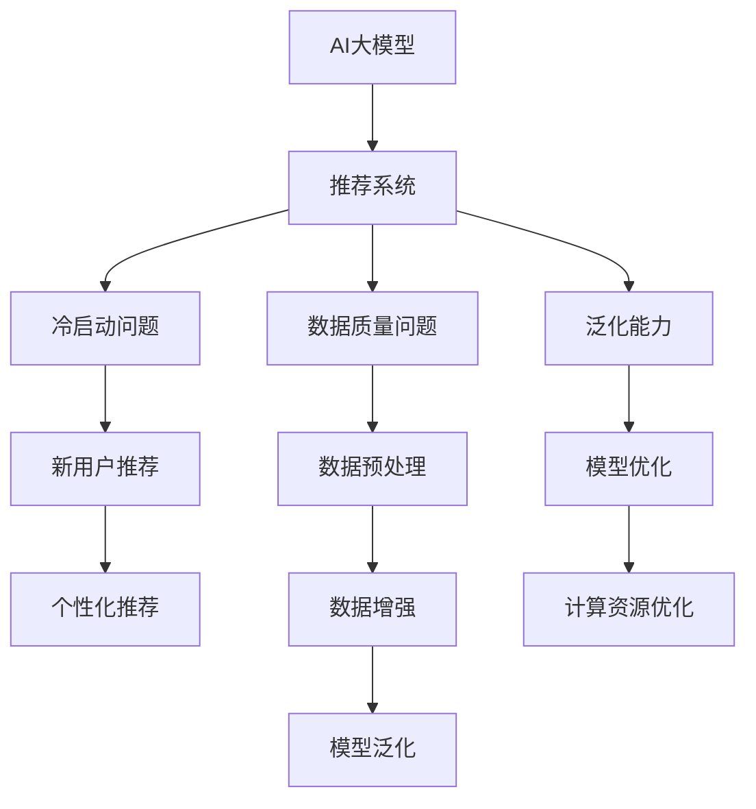

                 

# 电商平台搜索推荐系统的AI 大模型实践：应对冷启动与数据质量挑战

## 1. 背景介绍

### 1.1 问题由来

随着电商平台的迅猛发展，搜索推荐系统已经成为支撑用户购物体验的关键。通过个性化推荐，电商平台能够有效提升用户满意度、增加用户粘性、提高转化率。然而，现实中的搜索推荐系统面临着诸多挑战，尤其是冷启动和数据质量问题，严重制约了系统的性能和用户体验。

冷启动问题指的是用户在进行首次操作时，系统无法提供个性化的推荐服务。数据质量问题则涉及用户行为数据、商品标签数据、用户画像等，数据缺失、噪声、不平衡等问题会严重影响模型的训练和效果。这些问题会导致推荐结果不准确、用户体验不佳，进而影响平台整体的商业价值。

为了应对这些挑战，电商搜索推荐系统引入了一系列先进技术，如深度学习、自然语言处理、知识图谱等。其中，AI大模型由于其强大的表征能力和泛化能力，被广泛用于电商平台搜索推荐系统中。

### 1.2 问题核心关键点

冷启动和数据质量问题主要集中在以下几个方面：

- **冷启动问题**：系统无法根据新用户的历史行为数据生成个性化推荐，导致用户初期体验差，难以吸引用户继续使用。
- **数据质量问题**：用户行为数据、商品标签数据等存在缺失、噪声、不平衡等问题，影响模型训练效果，导致推荐结果准确性差。
- **模型泛化能力**：由于数据分布变化或用户行为模式的变化，模型泛化能力不足，导致推荐结果不稳定。
- **计算资源消耗**：大模型训练和推理计算资源消耗大，需要高效的模型压缩和优化方法。

解决这些问题，需要从模型训练、数据处理、系统架构等多方面入手，采用先进的AI大模型技术，构建稳定、高效的电商平台搜索推荐系统。

## 2. 核心概念与联系

### 2.1 核心概念概述

为更好地理解AI大模型在电商搜索推荐系统中的应用，本节将介绍几个密切相关的核心概念：

- **AI大模型**：基于Transformer架构，结合大规模无标签数据进行预训练，具有强大表征能力的深度学习模型。如BERT、GPT、DALL-E等。
- **推荐系统**：根据用户历史行为、商品属性等数据，生成个性化推荐，提升用户满意度，增加平台商业价值的系统。
- **冷启动问题**：新用户或新商品进入平台时，系统无法提供个性化推荐，用户体验差。
- **数据质量问题**：用户行为数据、商品标签数据等存在缺失、噪声、不平衡等问题，影响模型训练和效果。
- **泛化能力**：模型能够对新数据、新场景进行良好适应的能力。
- **计算资源优化**：模型压缩、模型量化、分布式训练等方法，提升模型训练和推理效率。

这些概念之间的逻辑关系可以通过以下Mermaid流程图来展示：



这个流程图展示了AI大模型在推荐系统中的作用及其与冷启动、数据质量等问题的联系：

1. AI大模型通过预训练学习到丰富的语言和知识表示。
2. 推荐系统基于大模型的表征能力，生成个性化推荐。
3. 冷启动问题需要通过数据预处理和模型优化解决。
4. 数据质量问题需要通过数据增强和模型泛化解决。
5. 计算资源优化使得大规模模型在推荐系统中部署成为可能。

这些概念共同构成了电商平台搜索推荐系统的核心框架，使得系统能够高效、稳定地运行。

## 3. 核心算法原理 & 具体操作步骤
### 3.1 算法原理概述

基于AI大模型的电商平台推荐系统，主要通过两个步骤进行推荐：预训练和微调。预训练通过大规模无标签数据学习通用知识表示，微调则通过下游任务数据进行特定领域优化，生成个性化推荐。

预训练过程通常使用自监督任务，如语言建模、掩码语言模型等。预训练模型通过大量无标签数据学习到丰富的语言和知识表示，具备强大的泛化能力。微调过程则使用标注数据进行有监督学习，根据用户的个性化需求生成推荐。

形式化地，设预训练模型为 $M_{\theta}$，下游推荐任务为 $T$。预训练过程可以表示为：

$$
\theta_{pretrain} = \mathop{\arg\min}_{\theta} \mathcal{L}_{pretrain}(\theta)
$$

微调过程则可以表示为：

$$
\theta_{fine} = \mathop{\arg\min}_{\theta} \mathcal{L}_{fine}(\theta)
$$

其中 $\mathcal{L}_{pretrain}$ 为预训练损失函数，$\mathcal{L}_{fine}$ 为微调损失函数。最终推荐模型的参数 $\theta$ 通过预训练和微调结合的方式得到：

$$
\theta = \theta_{pretrain} + \theta_{fine}
$$

### 3.2 算法步骤详解

基于AI大模型的电商平台推荐系统，通常包括以下关键步骤：

**Step 1: 数据预处理**

- 收集用户行为数据、商品标签数据、用户画像等，进行清洗、归一化等预处理。
- 对缺失数据进行补全，对噪声数据进行过滤。
- 对不平衡数据进行重采样或使用重加权方法。

**Step 2: 构建推荐模型**

- 选择合适的预训练模型，如BERT、GPT等，进行预训练。
- 设计合适的推荐模型结构，如基于Attention的推荐系统。
- 选择合适的微调任务，如点击率预测、推荐评分等。

**Step 3: 微调模型**

- 将预训练模型作为初始化参数，在标注数据上进行微调。
- 选择合适的优化器，如AdamW，设置合适的学习率。
- 使用正则化技术，如L2正则、Dropout等，防止过拟合。
- 使用对抗训练等技术，提高模型鲁棒性。

**Step 4: 测试与部署**

- 在验证集和测试集上评估微调后模型的性能。
- 使用微调后的模型进行实时推荐。
- 持续收集用户反馈和行为数据，定期重新微调模型。

### 3.3 算法优缺点

基于AI大模型的电商平台推荐系统具有以下优点：

- **泛化能力强**：预训练模型在大规模无标签数据上学习到丰富的知识表示，具备强大的泛化能力。
- **推荐效果佳**：微调过程能够根据特定任务进行优化，生成高精度的个性化推荐。
- **计算资源可控**：通过参数高效微调技术，可以只更新少量参数，减少计算资源消耗。
- **高效部署**：使用分布式训练和推理技术，能够高效地部署大规模模型。

同时，该方法也存在以下局限性：

- **数据依赖**：推荐系统的性能很大程度上取决于标注数据的数量和质量，数据缺失和噪声可能导致性能下降。
- **模型复杂度**：预训练模型参数量庞大，计算资源消耗较大，需要高效的模型压缩和优化方法。
- **对抗样本脆弱**：对抗样本可能对推荐结果产生干扰，需要加强模型的鲁棒性。
- **解释性不足**：推荐系统的决策过程缺乏可解释性，难以调试和优化。

尽管存在这些局限性，但就目前而言，基于AI大模型的推荐系统仍是目前电商搜索推荐领域的最佳实践。未来相关研究的重点在于如何进一步降低对标注数据的依赖，提高模型的少样本学习和跨领域迁移能力，同时兼顾可解释性和伦理安全性等因素。

### 3.4 算法应用领域

基于AI大模型的电商平台推荐系统，已经在商品推荐、广告推荐、个性化推荐等多个领域得到了广泛应用。例如：

- 商品推荐：根据用户历史浏览、购买行为，生成个性化商品推荐。
- 广告推荐：根据用户兴趣和行为，生成广告投放推荐。
- 个性化推荐：根据用户画像和需求，生成定制化的服务推荐。

除了这些经典任务外，AI大模型还被创新性地应用于内容生成、知识图谱构建、智能客服等领域，为电商平台的智能化转型提供了新的技术路径。

## 4. 数学模型和公式 & 详细讲解 & 举例说明（备注：数学公式请使用latex格式，latex嵌入文中独立段落使用 $$，段落内使用 $)
### 4.1 数学模型构建

本节将使用数学语言对基于AI大模型的电商平台推荐系统进行更加严格的刻画。

设用户行为数据为 $x \in \mathcal{X}$，商品标签数据为 $y \in \mathcal{Y}$，预训练模型为 $M_{\theta}$。推荐任务为 $T$，微调损失函数为 $\ell$。微调过程可以表示为：

$$
\theta^* = \mathop{\arg\min}_{\theta} \mathcal{L}(M_{\theta},D)
$$

其中 $\mathcal{L}(M_{\theta},D)$ 为微调损失函数，通常为交叉熵损失、均方误差损失等。微调过程通过优化算法不断更新模型参数 $\theta$，最小化损失函数 $\mathcal{L}(M_{\theta},D)$，使模型输出逼近真实标签。

### 4.2 公式推导过程

以下我们以点击率预测任务为例，推导基于AI大模型的推荐系统微调过程。

设点击行为 $y=1$，不点击行为 $y=0$。推荐模型 $M_{\theta}$ 在输入 $x$ 上的输出为 $\hat{y}=M_{\theta}(x)$。点击率预测任务可以表示为二分类任务，即：

$$
\hat{y} = M_{\theta}(x) \in [0,1]
$$

推荐模型 $M_{\theta}$ 在输入 $x$ 上的点击率预测结果 $\hat{y}$ 与真实标签 $y$ 之间的交叉熵损失函数为：

$$
\ell(y,\hat{y}) = -y\log \hat{y} - (1-y)\log (1-\hat{y})
$$

将其代入微调损失函数，得：

$$
\mathcal{L}(M_{\theta},D) = -\frac{1}{N}\sum_{i=1}^N \ell(y_i,\hat{y}_i)
$$

其中 $N$ 为标注样本数，$(x_i,y_i)$ 为第 $i$ 个样本。

根据链式法则，微调损失函数对参数 $\theta_k$ 的梯度为：

$$
\frac{\partial \mathcal{L}(M_{\theta},D)}{\partial \theta_k} = -\frac{1}{N}\sum_{i=1}^N (\frac{y_i}{\hat{y}_i}-\frac{1-y_i}{1-\hat{y}_i}) \frac{\partial M_{\theta}(x_i)}{\partial \theta_k}
$$

其中 $\frac{\partial M_{\theta}(x_i)}{\partial \theta_k}$ 可进一步递归展开，利用自动微分技术完成计算。

在得到微调损失函数的梯度后，即可带入优化算法进行模型迭代优化。重复上述过程直至收敛，最终得到适应推荐任务的最优模型参数 $\theta^*$。

## 5. 项目实践：代码实例和详细解释说明
### 5.1 开发环境搭建

在进行推荐系统开发前，我们需要准备好开发环境。以下是使用Python进行PyTorch开发的环境配置流程：

1. 安装Anaconda：从官网下载并安装Anaconda，用于创建独立的Python环境。

2. 创建并激活虚拟环境：
```bash
conda create -n pytorch-env python=3.8 
conda activate pytorch-env
```

3. 安装PyTorch：根据CUDA版本，从官网获取对应的安装命令。例如：
```bash
conda install pytorch torchvision torchaudio cudatoolkit=11.1 -c pytorch -c conda-forge
```

4. 安装Transformers库：
```bash
pip install transformers
```

5. 安装各类工具包：
```bash
pip install numpy pandas scikit-learn matplotlib tqdm jupyter notebook ipython
```

完成上述步骤后，即可在`pytorch-env`环境中开始推荐系统开发。

### 5.2 源代码详细实现

下面我们以商品推荐任务为例，给出使用Transformers库对BERT模型进行微调的PyTorch代码实现。

首先，定义推荐任务的数据处理函数：

```python
from transformers import BertTokenizer
from torch.utils.data import Dataset
import torch

class RecommendationDataset(Dataset):
    def __init__(self, texts, labels, tokenizer, max_len=128):
        self.texts = texts
        self.labels = labels
        self.tokenizer = tokenizer
        self.max_len = max_len
        
    def __len__(self):
        return len(self.texts)
    
    def __getitem__(self, item):
        text = self.texts[item]
        label = self.labels[item]
        
        encoding = self.tokenizer(text, return_tensors='pt', max_length=self.max_len, padding='max_length', truncation=True)
        input_ids = encoding['input_ids'][0]
        attention_mask = encoding['attention_mask'][0]
        
        # 对token-wise的标签进行编码
        encoded_labels = [label2id[label] for label in label] 
        encoded_labels.extend([label2id['0']] * (self.max_len - len(encoded_labels)))
        labels = torch.tensor(encoded_labels, dtype=torch.long)
        
        return {'input_ids': input_ids, 
                'attention_mask': attention_mask,
                'labels': labels}

# 标签与id的映射
label2id = {'1': 1, '0': 0}
id2label = {v: k for k, v in label2id.items()}

# 创建dataset
tokenizer = BertTokenizer.from_pretrained('bert-base-cased')

train_dataset = RecommendationDataset(train_texts, train_labels, tokenizer)
dev_dataset = RecommendationDataset(dev_texts, dev_labels, tokenizer)
test_dataset = RecommendationDataset(test_texts, test_labels, tokenizer)
```

然后，定义模型和优化器：

```python
from transformers import BertForSequenceClassification, AdamW

model = BertForSequenceClassification.from_pretrained('bert-base-cased', num_labels=2)

optimizer = AdamW(model.parameters(), lr=2e-5)
```

接着，定义训练和评估函数：

```python
from torch.utils.data import DataLoader
from tqdm import tqdm
from sklearn.metrics import accuracy_score

device = torch.device('cuda') if torch.cuda.is_available() else torch.device('cpu')
model.to(device)

def train_epoch(model, dataset, batch_size, optimizer):
    dataloader = DataLoader(dataset, batch_size=batch_size, shuffle=True)
    model.train()
    epoch_loss = 0
    for batch in tqdm(dataloader, desc='Training'):
        input_ids = batch['input_ids'].to(device)
        attention_mask = batch['attention_mask'].to(device)
        labels = batch['labels'].to(device)
        model.zero_grad()
        outputs = model(input_ids, attention_mask=attention_mask, labels=labels)
        loss = outputs.loss
        epoch_loss += loss.item()
        loss.backward()
        optimizer.step()
    return epoch_loss / len(dataloader)

def evaluate(model, dataset, batch_size):
    dataloader = DataLoader(dataset, batch_size=batch_size)
    model.eval()
    preds, labels = [], []
    with torch.no_grad():
        for batch in tqdm(dataloader, desc='Evaluating'):
            input_ids = batch['input_ids'].to(device)
            attention_mask = batch['attention_mask'].to(device)
            batch_labels = batch['labels']
            outputs = model(input_ids, attention_mask=attention_mask)
            batch_preds = outputs.logits.argmax(dim=2).to('cpu').tolist()
            batch_labels = batch_labels.to('cpu').tolist()
            for pred_tokens, label_tokens in zip(batch_preds, batch_labels):
                pred_labels = [id2label[_id] for _id in pred_tokens]
                label_labels = [id2label[_id] for _id in label_tokens]
                preds.append(pred_labels[:len(label_labels)])
                labels.append(label_labels)
                
    return accuracy_score(labels, preds)
```

最后，启动训练流程并在测试集上评估：

```python
epochs = 5
batch_size = 16

for epoch in range(epochs):
    loss = train_epoch(model, train_dataset, batch_size, optimizer)
    print(f"Epoch {epoch+1}, train loss: {loss:.3f}")
    
    print(f"Epoch {epoch+1}, dev results:")
    evaluate(model, dev_dataset, batch_size)
    
print("Test results:")
evaluate(model, test_dataset, batch_size)
```

以上就是使用PyTorch对BERT进行商品推荐任务微调的完整代码实现。可以看到，得益于Transformers库的强大封装，我们可以用相对简洁的代码完成BERT模型的加载和微调。

### 5.3 代码解读与分析

让我们再详细解读一下关键代码的实现细节：

**RecommendationDataset类**：
- `__init__`方法：初始化文本、标签、分词器等关键组件。
- `__len__`方法：返回数据集的样本数量。
- `__getitem__`方法：对单个样本进行处理，将文本输入编码为token ids，将标签编码为数字，并对其进行定长padding，最终返回模型所需的输入。

**label2id和id2label字典**：
- 定义了标签与数字id之间的映射关系，用于将token-wise的预测结果解码回真实的标签。

**训练和评估函数**：
- 使用PyTorch的DataLoader对数据集进行批次化加载，供模型训练和推理使用。
- 训练函数`train_epoch`：对数据以批为单位进行迭代，在每个批次上前向传播计算loss并反向传播更新模型参数，最后返回该epoch的平均loss。
- 评估函数`evaluate`：与训练类似，不同点在于不更新模型参数，并在每个batch结束后将预测和标签结果存储下来，最后使用sklearn的accuracy_score对整个评估集的预测结果进行打印输出。

**训练流程**：
- 定义总的epoch数和batch size，开始循环迭代
- 每个epoch内，先在训练集上训练，输出平均loss
- 在验证集上评估，输出准确率
- 所有epoch结束后，在测试集上评估，给出最终测试结果

可以看到，PyTorch配合Transformers库使得BERT微调的代码实现变得简洁高效。开发者可以将更多精力放在数据处理、模型改进等高层逻辑上，而不必过多关注底层的实现细节。

当然，工业级的系统实现还需考虑更多因素，如模型的保存和部署、超参数的自动搜索、更灵活的任务适配层等。但核心的微调范式基本与此类似。

## 6. 实际应用场景
### 6.1 智能客服系统

基于大模型微调的推荐系统，可以广泛应用于智能客服系统的构建。传统客服往往需要配备大量人力，高峰期响应缓慢，且一致性和专业性难以保证。而使用微调后的推荐系统，可以7x24小时不间断服务，快速响应客户咨询，用自然流畅的语言解答各类常见问题。

在技术实现上，可以收集企业内部的历史客服对话记录，将问题和最佳答复构建成监督数据，在此基础上对预训练推荐系统进行微调。微调后的推荐系统能够自动理解用户意图，匹配最合适的答复模板进行回复。对于客户提出的新问题，还可以接入检索系统实时搜索相关内容，动态组织生成回答。如此构建的智能客服系统，能大幅提升客户咨询体验和问题解决效率。

### 6.2 金融舆情监测

金融机构需要实时监测市场舆论动向，以便及时应对负面信息传播，规避金融风险。传统的人工监测方式成本高、效率低，难以应对网络时代海量信息爆发的挑战。基于大模型微调的文本分类和情感分析技术，为金融舆情监测提供了新的解决方案。

具体而言，可以收集金融领域相关的新闻、报道、评论等文本数据，并对其进行主题标注和情感标注。在此基础上对预训练语言模型进行微调，使其能够自动判断文本属于何种主题，情感倾向是正面、中性还是负面。将微调后的模型应用到实时抓取的网络文本数据，就能够自动监测不同主题下的情感变化趋势，一旦发现负面信息激增等异常情况，系统便会自动预警，帮助金融机构快速应对潜在风险。

### 6.3 个性化推荐系统

当前的推荐系统往往只依赖用户的历史行为数据进行物品推荐，无法深入理解用户的真实兴趣偏好。基于大模型微调技术，个性化推荐系统可以更好地挖掘用户行为背后的语义信息，从而提供更精准、多样的推荐内容。

在实践中，可以收集用户浏览、点击、评论、分享等行为数据，提取和用户交互的物品标题、描述、标签等文本内容。将文本内容作为模型输入，用户的后续行为（如是否点击、购买等）作为监督信号，在此基础上微调预训练语言模型。微调后的模型能够从文本内容中准确把握用户的兴趣点。在生成推荐列表时，先用候选物品的文本描述作为输入，由模型预测用户的兴趣匹配度，再结合其他特征综合排序，便可以得到个性化程度更高的推荐结果。

### 6.4 未来应用展望

随着大模型和微调方法的不断发展，基于微调范式将在更多领域得到应用，为传统行业带来变革性影响。

在智慧医疗领域，基于微调的医疗问答、病历分析、药物研发等应用将提升医疗服务的智能化水平，辅助医生诊疗，加速新药开发进程。

在智能教育领域，微调技术可应用于作业批改、学情分析、知识推荐等方面，因材施教，促进教育公平，提高教学质量。

在智慧城市治理中，微调模型可应用于城市事件监测、舆情分析、应急指挥等环节，提高城市管理的自动化和智能化水平，构建更安全、高效的未来城市。

此外，在企业生产、社会治理、文娱传媒等众多领域，基于大模型微调的人工智能应用也将不断涌现，为经济社会发展注入新的动力。相信随着技术的日益成熟，微调方法将成为人工智能落地应用的重要范式，推动人工智能技术向更广阔的领域加速渗透。

## 7. 工具和资源推荐
### 7.1 学习资源推荐

为了帮助开发者系统掌握大模型微调的理论基础和实践技巧，这里推荐一些优质的学习资源：

1. 《Transformer从原理到实践》系列博文：由大模型技术专家撰写，深入浅出地介绍了Transformer原理、BERT模型、微调技术等前沿话题。

2. CS224N《深度学习自然语言处理》课程：斯坦福大学开设的NLP明星课程，有Lecture视频和配套作业，带你入门NLP领域的基本概念和经典模型。

3. 《Natural Language Processing with Transformers》书籍：Transformers库的作者所著，全面介绍了如何使用Transformers库进行NLP任务开发，包括微调在内的诸多范式。

4. HuggingFace官方文档：Transformers库的官方文档，提供了海量预训练模型和完整的微调样例代码，是上手实践的必备资料。

5. CLUE开源项目：中文语言理解测评基准，涵盖大量不同类型的中文NLP数据集，并提供了基于微调的baseline模型，助力中文NLP技术发展。

通过对这些资源的学习实践，相信你一定能够快速掌握大模型微调的精髓，并用于解决实际的NLP问题。
###  7.2 开发工具推荐

高效的开发离不开优秀的工具支持。以下是几款用于大模型微调开发的常用工具：

1. PyTorch：基于Python的开源深度学习框架，灵活动态的计算图，适合快速迭代研究。大部分预训练语言模型都有PyTorch版本的实现。

2. TensorFlow：由Google主导开发的开源深度学习框架，生产部署方便，适合大规模工程应用。同样有丰富的预训练语言模型资源。

3. Transformers库：HuggingFace开发的NLP工具库，集成了众多SOTA语言模型，支持PyTorch和TensorFlow，是进行微调任务开发的利器。

4. Weights & Biases：模型训练的实验跟踪工具，可以记录和可视化模型训练过程中的各项指标，方便对比和调优。与主流深度学习框架无缝集成。

5. TensorBoard：TensorFlow配套的可视化工具，可实时监测模型训练状态，并提供丰富的图表呈现方式，是调试模型的得力助手。

6. Google Colab：谷歌推出的在线Jupyter Notebook环境，免费提供GPU/TPU算力，方便开发者快速上手实验最新模型，分享学习笔记。

合理利用这些工具，可以显著提升大模型微调任务的开发效率，加快创新迭代的步伐。

### 7.3 相关论文推荐

大语言模型和微调技术的发展源于学界的持续研究。以下是几篇奠基性的相关论文，推荐阅读：

1. Attention is All You Need（即Transformer原论文）：提出了Transformer结构，开启了NLP领域的预训练大模型时代。

2. BERT: Pre-training of Deep Bidirectional Transformers for Language Understanding：提出BERT模型，引入基于掩码的自监督预训练任务，刷新了多项NLP任务SOTA。

3. Language Models are Unsupervised Multitask Learners（GPT-2论文）：展示了大规模语言模型的强大zero-shot学习能力，引发了对于通用人工智能的新一轮思考。

4. Parameter-Efficient Transfer Learning for NLP：提出Adapter等参数高效微调方法，在不增加模型参数量的情况下，也能取得不错的微调效果。

5. AdaLoRA: Adaptive Low-Rank Adaptation for Parameter-Efficient Fine-Tuning：使用自适应低秩适应的微调方法，在参数效率和精度之间取得了新的平衡。

这些论文代表了大模型微调技术的发展脉络。通过学习这些前沿成果，可以帮助研究者把握学科前进方向，激发更多的创新灵感。

## 8. 总结：未来发展趋势与挑战

### 8.1 总结

本文对基于AI大模型的电商平台推荐系统进行了全面系统的介绍。首先阐述了冷启动和数据质量问题，明确了这些问题的关键点。然后从原理到实践，详细讲解了推荐系统的数学模型和关键步骤，给出了微调任务开发的完整代码实例。同时，本文还广泛探讨了推荐系统在智能客服、金融舆情、个性化推荐等多个领域的应用前景，展示了微调范式的巨大潜力。此外，本文精选了微调技术的各类学习资源，力求为读者提供全方位的技术指引。

通过本文的系统梳理，可以看到，基于AI大模型的推荐系统正在成为电商搜索推荐领域的最佳实践，极大地拓展了推荐系统的应用边界，提升了用户的购物体验。得益于大规模语料的预训练，推荐系统具备强大的泛化能力，能够生成高精度的个性化推荐。未来，伴随预训练语言模型和微调方法的持续演进，基于微调范式的推荐系统必将在更广泛的领域得到应用，为传统行业带来变革性影响。

### 8.2 未来发展趋势

展望未来，基于AI大模型的电商平台推荐系统将呈现以下几个发展趋势：

1. 模型规模持续增大。随着算力成本的下降和数据规模的扩张，预训练语言模型的参数量还将持续增长。超大规模语言模型蕴含的丰富知识表示，有望支撑更加复杂多变的推荐系统。

2. 推荐系统多样化。推荐系统将不仅仅局限于商品推荐，还将扩展到更多领域，如金融推荐、教育推荐等。推荐算法也将从静态推荐走向动态推荐，实现对用户行为的时序建模。

3. 多模态推荐系统。推荐系统将融合视觉、语音、时间等多种模态数据，实现更加全面、精准的推荐。推荐模型的训练也将利用多模态数据，提升推荐效果。

4. 基于知识图谱的推荐。推荐系统将引入知识图谱和符号化知识，实现基于领域知识的推荐。推荐模型将与知识图谱进行联合训练，提升推荐系统的解释性和可控性。

5. 跨领域知识迁移。推荐系统将利用跨领域知识迁移技术，实现领域之间的知识共享，提升推荐系统的泛化能力。推荐系统将能够更好地适应新领域和新任务，降低数据依赖。

6. 持续学习推荐。推荐系统将具备持续学习能力，能够根据用户行为和商品变化的动态调整推荐策略，提升推荐系统的稳定性和鲁棒性。

以上趋势凸显了大模型微调在推荐系统中的广阔前景。这些方向的探索发展，必将进一步提升推荐系统的性能和应用范围，为电商平台的智能化转型提供新的技术路径。

### 8.3 面临的挑战

尽管基于AI大模型的推荐系统已经取得了瞩目成就，但在迈向更加智能化、普适化应用的过程中，它仍面临着诸多挑战：

1. 数据隐私与安全。用户行为数据的隐私保护和安全是推荐系统的重要挑战。如何在保证数据隐私的前提下，获取高质量的用户行为数据，是推荐系统面临的一大难题。

2. 模型复杂度与计算资源。大模型和复杂推荐算法需要大量的计算资源，如何平衡模型复杂度和计算资源，是推荐系统的重要问题。

3. 推荐系统的公平性与透明度。推荐系统的决策过程缺乏透明度，容易导致不公平和歧视性。如何提升推荐系统的可解释性和公平性，是推荐系统的重要研究方向。

4. 推荐系统的伦理与社会影响。推荐系统可能被用于操控用户行为，推广有害信息，引发社会伦理问题。如何确保推荐系统的伦理和安全，是推荐系统的重要课题。

5. 推荐系统的长尾问题。长尾商品和用户占据推荐系统的一小部分，但可能对用户满意度有很大影响。如何平衡热门商品和长尾商品的推荐，是推荐系统的重要问题。

6. 推荐系统的鲁棒性与稳定性。推荐系统可能面临对抗样本和数据异常的攻击，如何提升推荐系统的鲁棒性和稳定性，是推荐系统的重要挑战。

正视推荐系统面临的这些挑战，积极应对并寻求突破，将是大模型微调走向成熟的必由之路。相信随着学界和产业界的共同努力，这些挑战终将一一被克服，大模型微调必将在构建安全、可靠、可解释、可控的智能系统铺平道路。

### 8.4 研究展望

面对大模型微调在推荐系统中的挑战，未来的研究需要在以下几个方面寻求新的突破：

1. 探索多模态数据融合的推荐方法。推荐系统将利用多模态数据，实现更加全面、精准的推荐。多模态数据的融合将提升推荐系统的性能和用户满意度。

2. 研究跨领域知识迁移的推荐方法。推荐系统将利用跨领域知识迁移技术，实现领域之间的知识共享，提升推荐系统的泛化能力。

3. 融合因果分析和博弈论工具。将因果分析方法引入推荐系统，识别出推荐决策的关键特征，增强推荐系统的解释性和逻辑性。借助博弈论工具刻画人机交互过程，主动探索并规避推荐系统的脆弱点，提高系统稳定性。

4. 引入更多先验知识。推荐系统将利用先验知识，如知识图谱、逻辑规则等，进行联合训练，提升推荐系统的解释性和可控性。

5. 研究推荐系统的因果分析。推荐系统将引入因果分析方法，识别出推荐决策的关键特征，增强推荐系统的解释性和逻辑性。

6. 纳入伦理道德约束。在推荐系统训练目标中引入伦理导向的评估指标，过滤和惩罚有害推荐输出，确保推荐系统的公平性。

这些研究方向的探索，必将引领大模型微调在推荐系统中的技术进步，为推荐系统的智能化和普适化提供新的技术路径。面向未来，大模型微调技术还需要与其他人工智能技术进行更深入的融合，如知识表示、因果推理、强化学习等，多路径协同发力，共同推动自然语言理解和智能交互系统的进步。只有勇于创新、敢于突破，才能不断拓展语言模型的边界，让智能技术更好地造福人类社会。

## 9. 附录：常见问题与解答

**Q1：如何优化大模型的推荐系统？**

A: 优化大模型的推荐系统需要从多个方面入手：

1. 数据预处理：对数据进行清洗、归一化、补全等处理，减少数据噪声和缺失。
2. 模型结构设计：选择合适的推荐算法和模型结构，如基于Attention的推荐系统。
3. 参数高效微调：使用参数高效微调方法，如Adapter，只更新少量参数，减少计算资源消耗。
4. 超参数调优：选择合适的学习率、批大小、迭代轮数等超参数，提升模型效果。
5. 对抗训练：引入对抗样本，提高模型鲁棒性。
6. 知识图谱融合：利用知识图谱和符号化知识，提升推荐系统的解释性和可控性。

**Q2：大模型推荐系统的计算资源消耗大，如何解决？**

A: 大模型推荐系统的计算资源消耗主要集中在模型训练和推理阶段。可以采用以下方法进行优化：

1. 模型压缩：使用模型剪枝、知识蒸馏、模型量化等方法，减小模型参数量，降低计算资源消耗。
2. 分布式训练：利用分布式训练技术，在多个GPU/TPU上并行训练，提高训练效率。
3. 延迟计算：将部分计算任务推迟到推理阶段，降低实时计算资源消耗。
4. 硬件加速：使用GPU/TPU等高性能设备，加速模型训练和推理。
5. 推理优化：使用推理优化技术，如剪枝、量化、编译器优化等，提高推理效率。

**Q3：如何提升推荐系统的公平性？**

A: 提升推荐系统的公平性可以从以下几个方面入手：

1. 数据公平性：确保训练数据和测试数据的分布一致，避免数据偏见。
2. 模型公平性：设计公平性评估指标，监控推荐系统的公平性。
3. 推荐策略公平性：优化推荐策略，确保推荐结果对所有用户公平。
4. 用户隐私保护：确保用户行为数据的隐私安全，避免数据泄露。

**Q4：如何提升推荐系统的解释性？**

A: 提升推荐系统的解释性需要从多个方面入手：

1. 模型可解释性：使用可解释性强的推荐算法，如基于规则的推荐、因果分析等。
2. 用户解释性：提供推荐结果的详细解释，如推荐理由、推荐依据等。
3. 推荐可视化：使用可视化工具，展示推荐系统的决策过程和推荐结果。

**Q5：如何应对推荐系统的长尾问题？**

A: 应对推荐系统的长尾问题可以从以下几个方面入手：

1. 长尾商品推荐：利用长尾推荐算法，如基于内容的多级推荐、基于协同过滤的多级推荐等。
2. 长尾用户推荐：利用长尾推荐算法，如基于时间的多级推荐、基于兴趣的多级推荐等。
3. 推荐策略优化：优化推荐策略，确保热门商品和长尾商品推荐的平衡。

这些方法可以帮助推荐系统更好地处理长尾问题和提升推荐效果。

**Q6：如何应对推荐系统的对抗样本攻击？**

A: 应对推荐系统的对抗样本攻击可以从以下几个方面入手：

1. 模型鲁棒性：使用对抗训练等技术，提高模型的鲁棒性，避免对抗样本干扰。
2. 数据预处理：对数据进行预处理，去除对抗样本噪声。
3. 用户监控：监控用户行为，及时发现和处理对抗样本攻击。

通过这些方法，可以有效应对推荐系统的对抗样本攻击，提升系统的鲁棒性和安全性。

**Q7：如何应对推荐系统的数据隐私和安全问题？**

A: 应对推荐系统的数据隐私和安全问题可以从以下几个方面入手：

1. 数据匿名化：对用户行为数据进行匿名化处理，保护用户隐私。
2. 数据加密：对用户行为数据进行加密处理，确保数据安全。
3. 访问控制：限制数据访问权限，防止数据泄露。
4. 隐私保护技术：使用隐私保护技术，如差分隐私、联邦学习等，保护用户隐私。

通过这些方法，可以有效应对推荐系统的数据隐私和安全问题，保障用户数据的安全和隐私。

**Q8：如何优化推荐系统的实时性？**

A: 优化推荐系统的实时性需要从多个方面入手：

1. 推理优化：使用推理优化技术，如剪枝、量化、编译器优化等，提高推理效率。
2. 缓存技术：使用缓存技术，降低实时计算资源消耗。
3. 延迟计算：将部分计算任务推迟到离线阶段，降低实时计算资源消耗。
4. 分布式计算：利用分布式计算技术，提高计算效率。

通过这些方法，可以有效提升推荐系统的实时性，满足用户对实时推荐的需求。

通过这些方法，可以有效提升推荐系统的实时性，满足用户对实时推荐的需求。

---

作者：禅与计算机程序设计艺术 / Zen and the Art of Computer Programming

