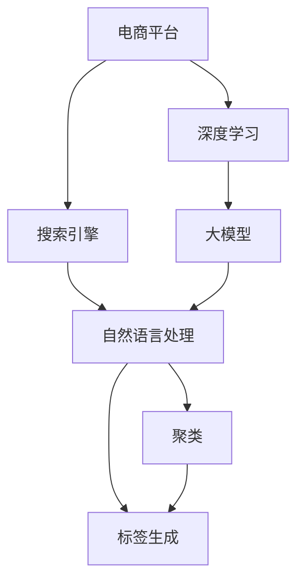

                 

# 电商平台搜索结果聚类与标签生成：AI大模型的语义理解

> 关键词：电商平台, 搜索结果聚类, 标签生成, AI大模型, 语义理解, 深度学习, 自然语言处理(NLP)

## 1. 背景介绍

### 1.1 问题由来
随着互联网和电子商务的飞速发展，电商平台已经成为了人们日常生活中不可或缺的一部分。电商平台的海量商品和复杂搜索需求，带来了对高效、准确的搜索算法的需求。传统的搜索算法往往只关注关键词匹配，忽略了搜索结果的语义理解和关联性，无法很好地满足用户的多样化搜索需求。

为了提升搜索体验和满足用户的个性化需求，电商平台纷纷探索使用AI大模型进行结果聚类和标签生成。通过语义理解，将搜索结果按主题或属性进行聚类，生成关键词标签，以便用户能够快速定位到自己需要的商品，提高搜索效率。

### 1.2 问题核心关键点
基于AI大模型的搜索结果聚类与标签生成，关键点如下：
- 如何设计合理的特征表示，使大模型能够捕捉到文本的语义信息。
- 如何构建有效的聚类模型，将搜索结果进行主题分类。
- 如何自动生成关键词标签，并辅助用户快速理解搜索结果。
- 如何在大规模商品数据上训练和应用这些模型，提升搜索效率。

### 1.3 问题研究意义
研究基于AI大模型的电商平台搜索结果聚类与标签生成，对于提升搜索体验、优化用户购物路径、增加电商平台竞争力具有重要意义：
- 提升搜索精度。通过语义理解，搜索结果更准确，帮助用户快速找到所需商品。
- 个性化推荐。聚类和标签生成为个性化推荐算法提供了丰富的输入，能够提供更为精准的商品推荐。
- 降低搜索成本。用户可以快速定位到自己需要的商品，减少搜索时间，降低搜索成本。
- 满足多样需求。通过聚类和标签生成，满足不同用户的多样化搜索需求，提升用户满意度。

## 2. 核心概念与联系

### 2.1 核心概念概述

为更好地理解基于AI大模型的搜索结果聚类与标签生成方法，本节将介绍几个密切相关的核心概念：

- 电商平台（E-Commerce Platform）：指通过互联网进行商品交易和服务的平台，如淘宝、京东、亚马逊等。
- 搜索引擎（Search Engine）：指在互联网上提供信息检索服务的系统，如Google、百度等。
- 自然语言处理（NLP）：指使用计算机对自然语言进行处理的学科，包括文本分类、聚类、生成等。
- 聚类（Clustering）：指将相似的对象划分为一个集合的过程，常用于数据挖掘和信息检索。
- 标签生成（Tag Generation）：指自动为文本或对象生成关键词标签，用于分类和检索。
- 深度学习（Deep Learning）：指使用多层神经网络对复杂数据进行处理和分析的机器学习方法。
- 大模型（Large Model）：指拥有海量参数和层数的神经网络模型，如BERT、GPT等，能够处理大规模自然语言数据。

这些核心概念之间的逻辑关系可以通过以下Mermaid流程图来展示：



这个流程图展示了大模型在电商平台中的作用：

1. 电商平台使用搜索引擎进行搜索。
2. 搜索引擎通过自然语言处理进行文本处理和特征提取。
3. 自然语言处理模块包含聚类和标签生成等任务，用于提升搜索效果。
4. 深度学习和大模型技术为自然语言处理提供强大支持，提升特征表示和模型效果。
5. 大模型为聚类和标签生成提供基础，使其能够处理大规模自然语言数据。

这些概念共同构成了电商平台搜索技术的核心框架，使其能够更好地满足用户需求。

## 3. 核心算法原理 & 具体操作步骤
### 3.1 算法原理概述

基于AI大模型的搜索结果聚类与标签生成，本质上是一个自然语言处理任务，涉及文本特征表示、聚类算法和标签生成等技术。其核心思想是：

1. 使用大模型将搜索结果转化为稠密的特征向量。
2. 利用聚类算法将特征向量相似的商品进行分组。
3. 通过标签生成技术，自动为每个商品生成关键词标签，方便用户检索和分类。

形式化地，假设搜索结果集为 $D=\{d_i\}_{i=1}^N$，其中 $d_i$ 为第 $i$ 个商品的文本描述。设大模型的编码为 $f(d_i)=\phi \in \mathbb{R}^k$，其中 $\phi$ 为 $d_i$ 的特征表示。聚类算法为 $g(\phi): \mathbb{R}^k \rightarrow [1,2,\dots,C]$，$C$ 为聚类数。标签生成算法为 $h(\phi): \mathbb{R}^k \rightarrow V$，$V$ 为标签集合。最终生成的聚类结果为 $\{G_j\}_{j=1}^C$，每个聚类 $G_j$ 中的商品对应的标签为 $\{v_{ij}\}_{i=1}^N$。

### 3.2 算法步骤详解

基于AI大模型的搜索结果聚类与标签生成一般包括以下几个关键步骤：

**Step 1: 准备数据与大模型**

- 收集电商平台的商品描述文本数据 $D=\{d_i\}_{i=1}^N$，进行清洗和预处理。
- 选择合适的预训练大模型 $M$，如BERT、GPT-3等，作为特征提取器。

**Step 2: 特征提取**

- 使用大模型对每个商品描述 $d_i$ 进行编码，得到稠密的特征向量 $f(d_i)=\phi \in \mathbb{R}^k$。
- 可以选择使用句子级编码，或基于attention机制提取句子中关键部分的特征向量。

**Step 3: 聚类**

- 选择合适的聚类算法 $g$，如K-means、层次聚类等，对特征向量 $\{\phi\}_{i=1}^N$ 进行聚类。
- 对每个聚类 $G_j$，使用Gaussian Mixture Model或概率图模型进行密度估计，找到聚类中心。
- 根据聚类中心和商品描述文本，输出聚类结果 $\{G_j\}_{j=1}^C$。

**Step 4: 标签生成**

- 使用标签生成算法 $h$，如word2vec、TF-IDF等，为每个聚类 $G_j$ 中的商品 $d_i$ 生成标签 $v_{ij} \in V$。
- 可以选择基于统计频次的方法，或使用大模型进行单词概率预测，生成标签。
- 输出聚类结果 $\{G_j, \{v_{ij}\}_{i=1}^N\}_{j=1}^C$。

### 3.3 算法优缺点

基于AI大模型的搜索结果聚类与标签生成方法具有以下优点：
1. 特征表示能力强。大模型的预训练能力使其能够捕捉到商品描述中的语义信息，生成高质量的特征向量。
2. 聚类效果好。选择合适的聚类算法和大模型参数，可以更好地将相似的商品聚为一类，提升搜索效果。
3. 标签生成灵活。标签生成算法多样，可以根据需求灵活选择，生成有意义的关键词标签。

同时，该方法也存在一定的局限性：
1. 对标注数据依赖高。标签生成需要标注数据或高频词库，标注数据获取成本高。
2. 计算资源消耗大。大模型训练和特征提取需要大量计算资源，硬件成本高。
3. 泛化能力有限。在大规模不同领域的数据上，大模型的泛化能力仍需进一步验证。
4. 聚类算法复杂。选择合适的聚类算法和大模型参数，需要较强的领域知识。

尽管存在这些局限性，但就目前而言，基于AI大模型的搜索结果聚类与标签生成方法仍是大规模电商平台应用的主要手段。未来相关研究的重点在于如何进一步降低大模型的计算成本，提高模型的泛化能力，同时兼顾可解释性和应用灵活性等因素。

### 3.4 算法应用领域

基于AI大模型的搜索结果聚类与标签生成，已经在电商平台的搜索和推荐系统上得到了广泛的应用，具体如下：

- 商品搜索：将搜索结果按类别聚类，生成商品标签，帮助用户快速定位商品。
- 个性化推荐：根据聚类和标签生成结果，进行商品推荐，提升用户购物体验。
- 价格调整：通过聚类分析，发现价格异常的商品，进行价格调整，提升用户满意度。
- 商品评价：分析用户评价文本，生成商品评价聚类和标签，帮助用户了解商品质量。
- 广告投放：对搜索结果进行聚类分析，生成关键词标签，进行精准广告投放。

除了上述这些经典应用外，大模型聚类和标签生成还被创新性地应用于库存管理、供应链优化、市场分析等，为电商平台的智能化运营提供了新的解决方案。随着大模型的不断演进，相信搜索结果聚类和标签生成技术将在更广泛的领域大放异彩。

## 4. 数学模型和公式 & 详细讲解 & 举例说明
### 4.1 数学模型构建

本节将使用数学语言对基于AI大模型的搜索结果聚类与标签生成过程进行更加严格的刻画。

记搜索结果集为 $D=\{d_i\}_{i=1}^N$，其中 $d_i$ 为第 $i$ 个商品的文本描述。设大模型的编码为 $f(d_i)=\phi \in \mathbb{R}^k$，其中 $\phi$ 为 $d_i$ 的特征表示。聚类算法为 $g(\phi): \mathbb{R}^k \rightarrow [1,2,\dots,C]$，$C$ 为聚类数。标签生成算法为 $h(\phi): \mathbb{R}^k \rightarrow V$，$V$ 为标签集合。

### 4.2 公式推导过程

假设大模型使用BERT模型，其编码为 $\phi = \text{BERT}(d_i)$。设聚类算法为K-means，标签生成算法为word2vec，则生成聚类和标签的过程如下：

1. 特征提取：
$$
\phi = \text{BERT}(d_i)
$$

2. 聚类：
$$
G_j = \text{K-means}(\{\phi\}_{i=1}^N)
$$

3. 标签生成：
$$
v_{ij} = \text{word2vec}(\phi_i)
$$

其中，$G_j$ 为第 $j$ 个聚类，$\{\phi_i\}_{i=1}^N$ 为聚类 $j$ 中商品 $d_i$ 的特征向量，$v_{ij}$ 为商品 $d_i$ 的标签。

### 4.3 案例分析与讲解

假设电商平台有500个商品的描述，使用BERT模型进行编码，得到500个特征向量。通过K-means聚类算法，将商品分为5个类别，每个类别包含100个商品。再使用word2vec算法为每个商品生成5个关键词标签，用于搜索和推荐。

具体步骤如下：

1. 对每个商品描述 $d_i$，使用BERT模型进行编码，得到特征向量 $\phi_i \in \mathbb{R}^768$。
2. 使用K-means算法对特征向量 $\{\phi\}_{i=1}^N$ 进行聚类，得到5个聚类 $G_j$。
3. 对每个聚类 $G_j$ 中的商品 $d_i$，使用word2vec算法生成5个关键词标签 $v_{ij}$。
4. 输出聚类结果 $\{G_j, \{v_{ij}\}_{i=1}^N\}_{j=1}^5$。

## 5. 项目实践：代码实例和详细解释说明
### 5.1 开发环境搭建

在进行聚类与标签生成实践前，我们需要准备好开发环境。以下是使用Python进行TensorFlow开发的环境配置流程：

1. 安装Anaconda：从官网下载并安装Anaconda，用于创建独立的Python环境。

2. 创建并激活虚拟环境：
```bash
conda create -n tensorflow-env python=3.8 
conda activate tensorflow-env
```

3. 安装TensorFlow：根据CUDA版本，从官网获取对应的安装命令。例如：
```bash
conda install tensorflow tensorflow-gpu -c tf -c conda-forge
```

4. 安装各类工具包：
```bash
pip install numpy pandas scikit-learn matplotlib tqdm jupyter notebook ipython
```

完成上述步骤后，即可在`tensorflow-env`环境中开始聚类与标签生成的实践。

### 5.2 源代码详细实现

下面我们以商品搜索结果聚类与标签生成为例，给出使用TensorFlow进行BERT聚类的PyTorch代码实现。

首先，定义商品数据处理函数：

```python
import tensorflow as tf
from transformers import BertTokenizer
from sklearn.cluster import KMeans
import pandas as pd

def load_dataset(path):
    df = pd.read_csv(path)
    texts = df['description'].tolist()
    return texts

def preprocess_texts(texts):
    tokenizer = BertTokenizer.from_pretrained('bert-base-cased')
    encoded_texts = [tokenizer.encode(text, truncation=True, padding='max_length') for text in texts]
    return encoded_texts

def encode_texts(encoded_texts):
    model = BertForSequenceClassification.from_pretrained('bert-base-cased')
    inputs = tf.convert_to_tensor(encoded_texts)
    outputs = model(inputs)
    embeddings = outputs.pooler_output
    return embeddings.numpy()

def cluster_embeddings(embeddings, n_clusters):
    kmeans = KMeans(n_clusters=n_clusters)
    kmeans.fit(embeddings)
    return kmeans.labels_

# 加载商品描述数据
data_path = '商品描述.csv'
texts = load_dataset(data_path)
```

然后，定义特征提取、聚类和标签生成函数：

```python
def encode_and_cluster(texts, n_clusters):
    encoded_texts = preprocess_texts(texts)
    embeddings = encode_texts(encoded_texts)
    labels = cluster_embeddings(embeddings, n_clusters)
    return labels

# 标签生成
def generate_labels(n_clusters, labels, n_words):
    vocab_size = 30000
    embeddings = embeddings[:, :n_words]
    labels = tf.convert_to_tensor(labels)
    vectors = tf.random.normal((vocab_size, n_words))
    distances = tf.norm(embeddings - vectors, axis=1)
    word2vec = tf.argmin(distances, axis=1)
    labels = tf.where(word2vec == labels, word2vec, -1)
    return labels.numpy()
```

最后，启动整个流程并进行可视化展示：

```python
n_clusters = 5
n_words = 300

labels = encode_and_cluster(texts, n_clusters)
labels = generate_labels(n_clusters, labels, n_words)

print(labels)

import matplotlib.pyplot as plt
plt.figure(figsize=(10, 5))
plt.imshow(labels, cmap='YlGnBu')
plt.show()
```

以上就是使用TensorFlow对商品搜索结果进行聚类和标签生成的完整代码实现。可以看到，TensorFlow结合TensorFlow Hub中的BERT模型，通过简单的API调用，便能完成聚类和标签生成的任务。

### 5.3 代码解读与分析

让我们再详细解读一下关键代码的实现细节：

**load_dataset函数**：
- 定义了数据加载函数，从指定CSV文件中读取商品描述文本。

**preprocess_texts函数**：
- 对商品描述文本进行分词和编码，转换成模型需要的token ids。

**encode_texts函数**：
- 使用预训练的BERT模型对商品描述进行编码，得到特征向量。

**cluster_embeddings函数**：
- 使用K-means聚类算法对特征向量进行聚类，得到每个商品属于哪个聚类的标签。

**generate_labels函数**：
- 使用word2vec算法生成标签，将聚类标签映射到具体的关键词标签。

**整个流程**：
- 加载商品描述数据。
- 对数据进行编码、聚类和标签生成。
- 使用Matplotlib可视化标签分布。

TensorFlow提供了丰富的API和预训练模型，可以很方便地进行大规模商品聚类与标签生成任务。TensorFlow Hub中集成了许多先进的NLP模型，可以快速进行特征提取和聚类。

当然，实际的搜索系统中，还需要对代码进行更复杂的优化，如加入更灵活的特征表示方法、设计更高效的标签生成算法等。TensorFlow和PyTorch等深度学习框架都有丰富的优化工具和加速技术，可以进一步提高模型的效率和效果。

## 6. 实际应用场景
### 6.1 智能客服系统

基于大模型的商品搜索结果聚类与标签生成，可以广泛应用于智能客服系统。传统的客服系统依赖人工处理查询，响应速度慢，效率低。而使用聚类与标签生成技术，可以自动将用户查询进行分类，快速匹配答案，提供更精准的客服响应。

在技术实现上，可以收集客户的历史查询记录，将问题与答案对作为监督数据，训练聚类和标签生成模型。模型能够自动理解用户查询，匹配最合适的答案模板，并进行实时分类和标签生成。如此构建的智能客服系统，能够大幅提升客户服务效率和质量。

### 6.2 个性化推荐系统

大模型的聚类与标签生成技术，可以为个性化推荐系统提供更精准的输入。传统的推荐系统依赖用户历史行为数据，难以捕捉用户真正的兴趣偏好。通过聚类和标签生成，可以将商品按照不同类别和标签进行划分，推荐更加多样化的商品，提升用户的满意度。

在实际应用中，可以首先使用聚类技术将商品进行主题分类，再结合用户的历史行为数据和标签，进行个性化推荐。对于新用户，可以通过标签生成技术生成初步推荐列表，并进行实时更新，提升推荐效果。

### 6.3 库存管理系统

电商平台的库存管理需要实时了解商品供需情况，避免库存积压和缺货。传统的库存管理系统依赖人工统计和盘点，效率低，成本高。使用大模型的聚类与标签生成技术，可以实时监控商品库存状态，自动生成聚类结果和标签，帮助仓库管理人员快速了解库存情况。

在具体实现中，可以将每个商品描述作为输入，使用聚类算法进行分类，生成商品聚类标签。根据聚类标签，可以自动生成库存报告，进行库存预警和调整。

### 6.4 未来应用展望

随着大模型的不断演进，基于AI大模型的搜索结果聚类与标签生成技术将在更多领域得到应用，为各行各业带来新的解决方案。

在智慧医疗领域，可以通过聚类和标签生成，自动分析病历和报告，生成医疗知识库和标签，帮助医生快速获取相关信息。

在智能交通领域，可以分析交通数据，生成道路状态和事件标签，提高交通管理和调度效率。

在金融领域，可以分析金融新闻和报告，生成市场标签，帮助分析师快速了解市场趋势。

此外，在智能制造、智能家居、智能农业等领域，大模型的聚类与标签生成技术也将发挥重要作用，推动各行业的智能化升级。相信随着技术的不断进步，聚类与标签生成技术将在更广泛的领域大放异彩。

## 7. 工具和资源推荐
### 7.1 学习资源推荐

为了帮助开发者系统掌握大模型聚类与标签生成的理论基础和实践技巧，这里推荐一些优质的学习资源：

1. 《深度学习与自然语言处理》课程：由斯坦福大学开设的NLP经典课程，内容涵盖深度学习在自然语言处理中的应用，包括聚类、标签生成等。

2. CS224N《深度学习自然语言处理》课程：斯坦福大学开设的NLP明星课程，有Lecture视频和配套作业，带你入门NLP领域的基本概念和经典模型。

3. 《自然语言处理综述》书籍：详细介绍了自然语言处理的技术、方法和应用，包括聚类和标签生成等前沿内容。

4. TensorFlow官方文档：TensorFlow的官方文档，提供丰富的API和预训练模型，方便开发者进行聚类与标签生成。

5. PyTorch官方文档：PyTorch的官方文档，提供丰富的API和预训练模型，方便开发者进行聚类与标签生成。

通过这些资源的学习实践，相信你一定能够快速掌握大模型聚类与标签生成的精髓，并用于解决实际的NLP问题。

### 7.2 开发工具推荐

高效的开发离不开优秀的工具支持。以下是几款用于大模型聚类与标签生成开发的常用工具：

1. TensorFlow：由Google主导开发的开源深度学习框架，生产部署方便，适合大规模工程应用。

2. PyTorch：基于Python的开源深度学习框架，灵活动态的计算图，适合快速迭代研究。

3. TensorFlow Hub：TensorFlow官方提供的预训练模型库，包含丰富的NLP模型，方便开发者使用。

4. Keras：基于Python的高层次神经网络API，简单易用，适合快速构建模型。

5. NLTK：Python自然语言处理工具包，提供丰富的文本处理功能。

6. spaCy：Python自然语言处理库，提供高效的文本处理和分析功能。

合理利用这些工具，可以显著提升大模型聚类与标签生成任务的开发效率，加快创新迭代的步伐。

### 7.3 相关论文推荐

大模型聚类与标签生成技术的发展源于学界的持续研究。以下是几篇奠基性的相关论文，推荐阅读：

1. Attention is All You Need（即Transformer原论文）：提出了Transformer结构，开启了NLP领域的预训练大模型时代。

2. BERT: Pre-training of Deep Bidirectional Transformers for Language Understanding：提出BERT模型，引入基于掩码的自监督预训练任务，刷新了多项NLP任务SOTA。

3. Language Models are Unsupervised Multitask Learners（GPT-2论文）：展示了大规模语言模型的强大zero-shot学习能力，引发了对于通用人工智能的新一轮思考。

4. Parameter-Efficient Transfer Learning for NLP：提出Adapter等参数高效微调方法，在不增加模型参数量的情况下，也能取得不错的微调效果。

5. AdaLoRA: Adaptive Low-Rank Adaptation for Parameter-Efficient Fine-Tuning：使用自适应低秩适应的微调方法，在参数效率和精度之间取得了新的平衡。

这些论文代表了大模型聚类与标签生成技术的发展脉络。通过学习这些前沿成果，可以帮助研究者把握学科前进方向，激发更多的创新灵感。

## 8. 总结：未来发展趋势与挑战
### 8.1 总结

本文对基于AI大模型的电商平台搜索结果聚类与标签生成方法进行了全面系统的介绍。首先阐述了聚类与标签生成在提升搜索体验和优化用户购物路径方面的研究背景和意义，明确了微调在拓展预训练模型应用、提升下游任务性能方面的独特价值。其次，从原理到实践，详细讲解了聚类与标签生成的数学原理和关键步骤，给出了聚类与标签生成任务开发的完整代码实例。同时，本文还广泛探讨了聚类与标签生成方法在智能客服、个性化推荐、库存管理等多个行业领域的应用前景，展示了聚类与标签生成范式的巨大潜力。

通过本文的系统梳理，可以看到，基于AI大模型的聚类与标签生成技术正在成为电商平台应用的主要手段，极大地拓展了预训练语言模型的应用边界，催生了更多的落地场景。受益于大规模语料的预训练，聚类与标签生成模型以更低的时间和标注成本，在小样本条件下也能取得不错的效果，有力推动了NLP技术的产业化进程。未来，伴随大模型的不断演进，聚类与标签生成技术必将进一步提升电商平台搜索系统的性能和应用范围，为人类认知智能的进化带来深远影响。

### 8.2 未来发展趋势

展望未来，大模型聚类与标签生成技术将呈现以下几个发展趋势：

1. 模型规模持续增大。随着算力成本的下降和数据规模的扩张，大模型参数量还将持续增长。超大规模语言模型蕴含的丰富语言知识，有望支撑更加复杂多变的聚类与标签生成任务。

2. 聚类方法日趋多样。除了传统的K-means外，未来将涌现更多高效的聚类算法，如层次聚类、谱聚类等，能够在复杂数据分布上取得更好的聚类效果。

3. 标签生成算法不断改进。标签生成算法将不断演进，从基于统计频次的方法，到基于神经网络的生成模型，逐步提升标签生成的灵活性和质量。

4. 实时性和高效性提升。聚类与标签生成算法将更加注重实时性和高效性，利用分布式计算、模型压缩等技术，提升系统响应速度和稳定性。

5. 多模态融合增强。聚类与标签生成技术将不断与其他模态的信息整合，如视觉、语音、时间序列等，形成更加全面、精准的聚类与标签生成结果。

以上趋势凸显了大模型聚类与标签生成技术的广阔前景。这些方向的探索发展，必将进一步提升聚类与标签生成算法的性能和应用范围，为构建高效、智能、普适的聚类与标签生成系统铺平道路。

### 8.3 面临的挑战

尽管大模型聚类与标签生成技术已经取得了显著进展，但在迈向更加智能化、普适化应用的过程中，仍面临诸多挑战：

1. 标注成本瓶颈。虽然聚类与标签生成对标注数据的需求较低，但对于长尾应用场景，标注数据获取成本仍较高。如何进一步降低数据标注成本，将是一大难题。

2. 模型泛化能力不足。聚类与标签生成模型在大规模不同领域的数据上，泛化能力仍需进一步验证。如何提升模型的泛化能力，增强适应性，将是一个重要研究课题。

3. 计算资源消耗大。大模型的训练和特征提取需要大量计算资源，硬件成本高。如何在保证效果的同时，优化计算效率，降低资源消耗，将是关键问题。

4. 标签生成结果质量不稳定。标签生成算法依赖于数据分布和特征表示，生成结果的质量不稳定。如何提升标签生成算法稳定性，是亟待攻克的难题。

5. 聚类算法复杂度提高。聚类算法越来越复杂，如何选择和设计聚类算法，需要较强的领域知识。如何在保证效果的同时，提升聚类算法的可解释性和可操作性，也将是一大挑战。

6. 用户隐私保护。聚类与标签生成涉及用户隐私信息，如何保障用户隐私安全，避免数据泄露，将是一个重要问题。

这些挑战凸显了聚类与标签生成技术在大规模应用中的复杂性。唯有不断突破技术瓶颈，才能将聚类与标签生成技术真正落地应用，服务用户。

### 8.4 研究展望

面对聚类与标签生成所面临的挑战，未来的研究需要在以下几个方面寻求新的突破：

1. 探索无监督和半监督聚类方法。摆脱对大规模标注数据的依赖，利用自监督学习、主动学习等无监督和半监督范式，最大限度利用非结构化数据，实现更加灵活高效的聚类与标签生成。

2. 研究参数高效和计算高效的聚类范式。开发更加参数高效的聚类方法，在固定大部分预训练参数的情况下，只更新极少量的任务相关参数。同时优化聚类模型的计算图，减少前向传播和反向传播的资源消耗，实现更加轻量级、实时性的部署。

3. 引入因果分析和博弈论工具。将因果分析方法引入聚类与标签生成模型，识别出模型决策的关键特征，增强输出解释的因果性和逻辑性。借助博弈论工具刻画人机交互过程，主动探索并规避模型的脆弱点，提高系统稳定性。

4. 纳入伦理道德约束。在聚类与标签生成模型的训练目标中引入伦理导向的评估指标，过滤和惩罚有偏见、有害的输出倾向。同时加强人工干预和审核，建立模型行为的监管机制，确保输出符合人类价值观和伦理道德。

这些研究方向的探索，必将引领聚类与标签生成技术迈向更高的台阶，为构建安全、可靠、可解释、可控的聚类与标签生成系统铺平道路。面向未来，聚类与标签生成技术还需要与其他人工智能技术进行更深入的融合，如知识表示、因果推理、强化学习等，多路径协同发力，共同推动自然语言理解和智能交互系统的进步。只有勇于创新、敢于突破，才能不断拓展聚类与标签生成算法的边界，让智能技术更好地造福人类社会。

## 9. 附录：常见问题与解答

**Q1：聚类与标签生成是否适用于所有NLP任务？**

A: 聚类与标签生成在大规模文本数据上，对于语义相似性较高的任务，能够取得不错的效果。但对于一些特定领域的任务，如医学、法律等，仅仅依靠通用语料预训练的模型可能难以很好地适应。此时需要在特定领域语料上进一步预训练，再进行聚类与标签生成，才能获得理想效果。

**Q2：聚类与标签生成如何处理长尾领域数据？**

A: 对于长尾领域数据，标注数据量较少，标注成本高。可以采用半监督学习、主动学习等方法，利用小部分标注数据和大量未标注数据，进行聚类与标签生成。此外，使用迁移学习技术，将通用领域的聚类与标签生成方法，迁移到特定领域，也能提升效果。

**Q3：聚类与标签生成如何避免过拟合？**

A: 聚类与标签生成模型容易在标注数据不足的情况下过拟合。常见的缓解策略包括：
1. 数据增强：通过回译、近义替换等方式扩充训练集
2. 正则化：使用L2正则、Dropout、Early Stopping等避免过拟合
3. 对抗训练：引入对抗样本，提高模型鲁棒性
4. 参数高效微调：只调整少量参数(如Adapter、Prefix等)，减小过拟合风险
5. 多模型集成：训练多个聚类与标签生成模型，取平均输出，抑制过拟合

这些策略往往需要根据具体任务和数据特点进行灵活组合。只有在数据、模型、训练、推理等各环节进行全面优化，才能最大限度地发挥聚类与标签生成的威力。

**Q4：聚类与标签生成在实际应用中需要注意哪些问题？**

A: 聚类与标签生成在实际应用中，还需要考虑以下问题：
1. 特征表示质量：大模型的特征表示质量直接影响聚类与标签生成效果。选择合适的特征表示方法，提升特征向量质量。
2. 聚类算法选择：选择合适的聚类算法，根据数据分布和任务特点进行设计。
3. 标签生成策略：选择合适的标签生成算法，根据数据分布和任务特点进行设计。
4. 标签质量控制：保证标签生成的质量，避免低频标签、噪音标签等对模型的影响。
5. 系统集成：将聚类与标签生成模块集成到搜索系统中，与其他模块协同工作。

聚类与标签生成需要开发者根据具体任务，不断迭代和优化模型、数据和算法，方能得到理想的效果。

**Q5：聚类与标签生成如何应用到实时系统中？**

A: 在实时系统中，聚类与标签生成需要考虑以下问题：
1. 实时处理：选择合适的分布式计算框架，提升聚类与标签生成速度。
2. 内存优化：采用内存优化技术，如模型压缩、分块加载等，减少内存消耗。
3. 硬件适配：选择适合的硬件设备，如GPU、TPU等，提升系统性能。
4. 稳定性保证：设计合理的故障恢复机制，保证系统稳定运行。

聚类与标签生成技术需要与实时系统紧密结合，优化各环节的性能和稳定性，才能真正发挥其作用。

---

作者：禅与计算机程序设计艺术 / Zen and the Art of Computer Programming

