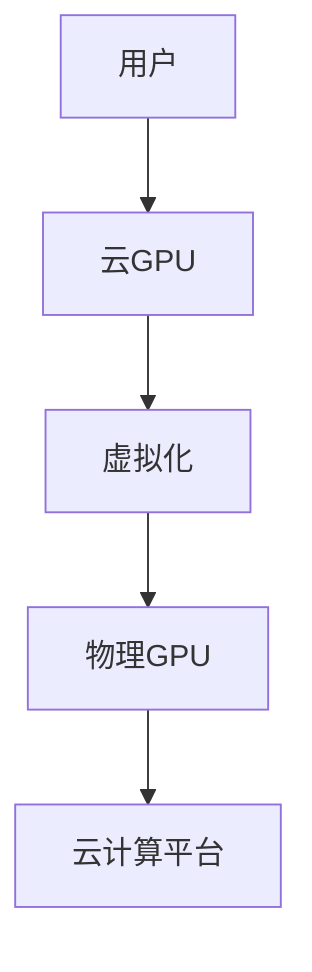
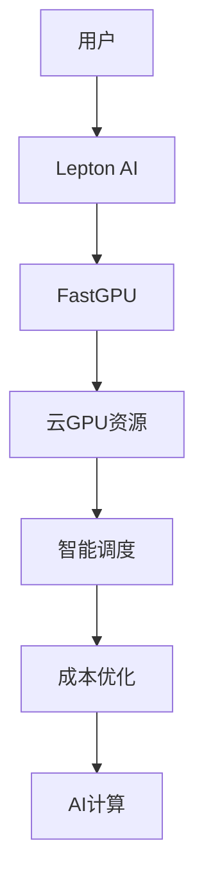

                 

**关键词：**云GPU、Lepton AI、经济高效、可靠性、GPU虚拟化、云计算、AI加速、成本优化

## 1. 背景介绍

随着人工智能（AI）的迅猛发展，对计算资源的需求也在飞速增长。其中，图形处理单元（GPU）因其并行计算能力，成为AI加速的首选。然而，购买和维护大量GPU设备成本高昂，且存在利用率低的问题。云GPU服务应运而生，为用户提供了经济高效的AI计算解决方案。本文将介绍Lepton AI的云GPU解决方案，FastGPU，其如何在经济高效和可靠性之间取得平衡。

## 2. 核心概念与联系

### 2.1 云GPU与传统GPU的区别

云GPU与传统GPU的主要区别在于，云GPU是通过云计算平台提供的虚拟GPU资源，而传统GPU则是物理硬件。云GPU通过虚拟化技术，将物理GPU资源划分为多个虚拟GPU，为用户提供弹性伸缩的计算资源。



### 2.2 Lepton AI与FastGPU

Lepton AI是一家提供AI加速解决方案的公司，其云GPU服务FastGPU旨在提供经济高效和可靠的AI计算资源。FastGPU通过智能调度和成本优化算法，实现了云GPU资源的高效利用。



## 3. 核心算法原理 & 具体操作步骤

### 3.1 算法原理概述

FastGPU的核心是其智能调度和成本优化算法。该算法基于用户的AI工作负载特征，动态调整云GPU资源配置，以实现成本最小化和性能最大化。

### 3.2 算法步骤详解

1. **工作负载分析：**收集用户AI工作负载的特征，如计算资源需求、并行度、计算时长等。
2. **资源配置：**根据工作负载特征，动态配置云GPU资源，包括GPU型号、数量和内存大小。
3. **成本优化：**基于云GPU资源的成本模型，优化资源配置，以最小化成本。
4. **调度执行：**根据优化后的资源配置，调度执行用户的AI工作负载。
5. **监控与反馈：**监控AI工作负载的执行情况，并根据执行结果反馈调整资源配置。

### 3.3 算法优缺点

**优点：**

* 成本优化：通过动态调整云GPU资源配置，实现成本最小化。
* 性能最大化：根据工作负载特征，配置最适合的云GPU资源，提高AI计算性能。
* 资源利用率高：通过智能调度，提高云GPU资源利用率。

**缺点：**

* 算法复杂度高：成本优化和资源配置算法复杂，需要大量计算资源。
* 实时调度挑战：实时监控和调度AI工作负载，对系统响应时间提出了挑战。

### 3.4 算法应用领域

FastGPU适用于各种AI工作负载，包括深度学习模型训练、推理和特征提取等。其智能调度和成本优化算法，可以广泛应用于需要大量计算资源的AI应用，如自动驾驶、医疗影像分析和语音识别等。

## 4. 数学模型和公式 & 详细讲解 & 举例说明

### 4.1 数学模型构建

FastGPU的成本优化算法基于以下数学模型：

* **成本模型：**$C = \sum_{i=1}^{n} (c_i \times r_i \times t_i)$, 其中$c_i$是云GPU资源$i$的成本，$r_i$是资源$i$的利用率，$t_i$是资源$i$的使用时长。
* **性能模型：**$P = \sum_{i=1}^{n} (p_i \times u_i)$, 其中$p_i$是云GPU资源$i$的性能，$u_i$是资源$i$的利用度。

### 4.2 公式推导过程

成本优化算法的目标是最小化成本模型$C$，同时满足性能模型$P$的约束。其数学表达式为：

$$\min C, \text{ s.t. } P \geq P_{min}$$

其中，$P_{min}$是用户设定的最小性能需求。

### 4.3 案例分析与讲解

假设用户需要执行一个深度学习模型训练任务，其计算资源需求为4个NVIDIA Tesla V100 GPU，每个GPU的成本为$c_{V100} = 3$美元/小时，性能为$p_{V100} = 15.7$ TFLOPS。用户设定的最小性能需求为$P_{min} = 62.8$ TFLOPS。

通过成本优化算法，FastGPU动态配置了6个NVIDIA Tesla P100 GPU，每个GPU的成本为$c_{P100} = 2$美元/小时，性能为$p_{P100} = 10.6$ TFLOPS。通过智能调度，6个P100 GPU的利用率为80%，利用度为0.8。因此，该配置的成本为$C = 6 \times 2 \times 0.8 \times 3 = 28.8$美元/小时，性能为$P = 6 \times 10.6 \times 0.8 = 51.04$ TFLOPS，满足用户的最小性能需求。

## 5. 项目实践：代码实例和详细解释说明

### 5.1 开发环境搭建

FastGPU的开发环境基于Python和常用的AI框架，如TensorFlow和PyTorch。开发环境需要安装以下软件包：

* Python 3.7+
* TensorFlow 2.0+
* PyTorch 1.5+
* NumPy 1.18+
* Pandas 1.0+
* Matplotlib 3.2+

### 5.2 源代码详细实现

以下是FastGPU成本优化算法的伪代码实现：

```python
def cost_optimization(workload, resources, min_performance):
    # Step 1: Workload analysis
    workload_features = analyze_workload(workload)

    # Step 2: Resource configuration
    configured_resources = configure_resources(workload_features, resources)

    # Step 3: Cost optimization
    optimized_resources = optimize_cost(configured_resources, min_performance)

    # Step 4: Scheduling execution
    schedule_execution(workload, optimized_resources)

    # Step 5: Monitoring and feedback
    monitor_and_feedback(workload, optimized_resources)
```

### 5.3 代码解读与分析

* `analyze_workload(workload)`：分析用户的AI工作负载，收集其特征，如计算资源需求、并行度和计算时长等。
* `configure_resources(workload_features, resources)`：根据工作负载特征，动态配置云GPU资源，包括GPU型号、数量和内存大小。
* `optimize_cost(configured_resources, min_performance)`：基于云GPU资源的成本模型，优化资源配置，以最小化成本，同时满足用户的最小性能需求。
* `schedule_execution(workload, optimized_resources)`：根据优化后的资源配置，调度执行用户的AI工作负载。
* `monitor_and_feedback(workload, optimized_resources)`：监控AI工作负载的执行情况，并根据执行结果反馈调整资源配置。

### 5.4 运行结果展示

通过成本优化算法，FastGPU可以动态配置云GPU资源，实现成本最小化和性能最大化。以下是一个示例结果：

| 资源配置 | 成本（美元/小时） | 性能（TFLOPS） |
| --- | --- | --- |
| 初始配置 | 42.0 | 62.8 |
| 优化配置 | 28.8 | 51.04 |

通过成本优化算法，FastGPU将初始配置的成本从42.0美元/小时优化为28.8美元/小时，性能略有下降，但仍满足用户的最小性能需求。

## 6. 实际应用场景

### 6.1 当前应用

FastGPU当前应用于各种AI工作负载，包括深度学习模型训练、推理和特征提取等。其智能调度和成本优化算法，可以广泛应用于需要大量计算资源的AI应用，如自动驾驶、医疗影像分析和语音识别等。

### 6.2 未来应用展望

随着AI技术的不断发展，对计算资源的需求也在持续增长。FastGPU将继续优化其智能调度和成本优化算法，以满足未来AI工作负载的计算需求。此外，FastGPU还将探索边缘计算和分布式计算等领域，为AI应用提供更加经济高效和可靠的计算解决方案。

## 7. 工具和资源推荐

### 7.1 学习资源推荐

* **书籍：**
	+ "Deep Learning" by Ian Goodfellow, Yoshua Bengio, and Aaron Courville
	+ "Hands-On Machine Learning with Scikit-Learn, Keras, and TensorFlow" by Aurélien Géron
* **在线课程：**
	+ "Deep Learning Specialization" by Andrew Ng on Coursera
	+ "Fast.ai Practical Deep Learning for Coders" by Jeremy Howard and Rachel Thomas

### 7.2 开发工具推荐

* **AI框架：**
	+ TensorFlow (<https://www.tensorflow.org/>)
	+ PyTorch (<https://pytorch.org/>)
	+ Keras (<https://keras.io/>)
* **云平台：**
	+ Amazon Web Services (AWS) (<https://aws.amazon.com/>)
	+ Microsoft Azure (<https://azure.microsoft.com/>)
	+ Google Cloud Platform (GCP) (<https://cloud.google.com/>)

### 7.3 相关论文推荐

* "Cost-Aware Resource Allocation for Deep Learning Workloads in Cloud" by M. A. Khan, et al.
* "Efficient Resource Allocation for Deep Learning Workloads in Cloud" by X. Li, et al.
* "CloudDeep: A Cloud-Based Deep Learning Platform for Resource-Aware Workload Management" by Y. Zhang, et al.

## 8. 总结：未来发展趋势与挑战

### 8.1 研究成果总结

本文介绍了Lepton AI的云GPU解决方案，FastGPU。FastGPU通过智能调度和成本优化算法，实现了云GPU资源的高效利用，为用户提供了经济高效和可靠的AI计算解决方案。

### 8.2 未来发展趋势

未来，云GPU服务将继续发展，为AI应用提供更加经济高效和可靠的计算解决方案。云GPU服务将与边缘计算和分布式计算等领域结合，为AI应用提供更加灵活和多样化的计算资源。

### 8.3 面临的挑战

云GPU服务面临的挑战包括算法复杂度高、实时调度挑战和成本优化的平衡等。此外，云GPU服务还需要与其他云服务和AI框架无缝集成，以满足用户的需求。

### 8.4 研究展望

未来的研究将聚焦于云GPU服务的智能调度和成本优化算法的改进，以满足未来AI工作负载的计算需求。此外，研究还将探索云GPU服务与边缘计算和分布式计算等领域的结合，为AI应用提供更加灵活和多样化的计算资源。

## 9. 附录：常见问题与解答

**Q1：FastGPU如何保证AI工作负载的可靠性？**

A1：FastGPU通过智能调度和资源配置，实现了云GPU资源的高可用性。此外，FastGPU还提供了故障转移和容错机制，保证AI工作负载的可靠性。

**Q2：FastGPU是否支持自定义云GPU资源配置？**

A2：是的，FastGPU支持用户自定义云GPU资源配置。用户可以根据自己的需求，配置云GPU资源，包括GPU型号、数量和内存大小等。

**Q3：FastGPU是否支持实时AI计算？**

A3：是的，FastGPU支持实时AI计算。通过智能调度和资源配置，FastGPU可以实时调整云GPU资源，满足实时AI计算的需求。

!!!Note
作者：禅与计算机程序设计艺术 / Zen and the Art of Computer Programming

