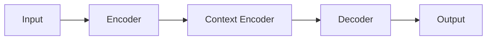

                 

## 1. 背景介绍

在人工智能（AI）领域，对话系统的连贯性是衡量其自然性和智能水平的关键指标。然而，现有的对话系统往往缺乏连贯性，导致用户体验不佳。上下文学习（Up-Down Learning）是一种新颖的方法，旨在提高AI对话的连贯性。本文将详细介绍上下文学习的原理、算法、数学模型，并提供项目实践和工具推荐。

## 2. 核心概念与联系

上下文学习是一种序列到序列（Seq2Seq）模型的扩展，旨在学习上下文信息以生成更连贯的对话。其核心概念包括：

- **上下文信息**：对话的历史信息，包括之前的对话轮次。
- **上下文编码**：将上下文信息转换为模型可以处理的表示形式。
- **上下文解码**：使用上下文信息生成下一轮对话的响应。

下图是上下文学习的架构流程图：



## 3. 核心算法原理 & 具体操作步骤

### 3.1 算法原理概述

上下文学习算法由三个主要组成部分组成：编码器（Encoder）、上下文编码器（Context Encoder）和解码器（Decoder）。编码器负责将输入序列转换为表示形式，上下文编码器学习上下文信息，解码器则根据上下文信息生成输出序列。

### 3.2 算法步骤详解

1. **编码阶段**：编码器接受输入序列（对话历史）并生成表示形式。
2. **上下文编码阶段**：上下文编码器接受编码器的输出并学习上下文信息。
3. **解码阶段**：解码器接受上下文编码器的输出并生成输出序列（对话响应）。

### 3.3 算法优缺点

**优点**：

- 学习上下文信息，提高对话连贯性。
- 可以在不修改编码器和解码器的情况下集成到 Seq2Seq 模型中。

**缺点**：

- 学习上下文信息可能会导致模型复杂度增加。
- 可能会受到长期依赖问题的影响。

### 3.4 算法应用领域

上下文学习可以应用于任何需要生成连贯对话的领域，例如：

- 客户服务聊天机器人。
- 智能助手（如语音助手）。
- 个性化推荐系统。

## 4. 数学模型和公式 & 详细讲解 & 举例说明

### 4.1 数学模型构建

设输入序列为 $X = (x_1, x_2,..., x_T)$，上下文信息为 $C = (c_1, c_2,..., c_K)$，输出序列为 $Y = (y_1, y_2,..., y_L)$。编码器、上下文编码器和解码器都是循环神经网络（RNN）或其变种（如长短期记忆网络（LSTM）或门控循环单元（GRU））。

### 4.2 公式推导过程

编码器的输出可以表示为 $h_t = f(x_t, h_{t-1})$, 其中 $f$ 是 RNN 单元的激活函数。上下文编码器的输出可以表示为 $c_k = g(h_t, c_{k-1})$, 其中 $g$ 是 RNN 单元的激活函数。解码器的输出可以表示为 $y_t = p(y_t | y_{t-1}, c, h) = softmax(W_y [h; c] + b_y)$, 其中 $W_y$ 和 $b_y$ 是学习参数。

### 4.3 案例分析与讲解

例如，在客户服务聊天机器人中，输入序列 $X$ 可以是用户的问题，上下文信息 $C$ 可以是之前的对话历史，输出序列 $Y$ 可以是机器人的响应。通过学习上下文信息，机器人可以生成更连贯的响应，从而提高用户体验。

## 5. 项目实践：代码实例和详细解释说明

### 5.1 开发环境搭建

本项目使用 Python 和 PyTorch 进行开发。首先，安装必要的库：

```bash
pip install torch torchvision
```

### 5.2 源代码详细实现

以下是上下文学习算法的 Python 实现示例：

```python
import torch
import torch.nn as nn

class UpDownModel(nn.Module):
    def __init__(self, input_dim, hidden_dim, output_dim, n_layers):
        super(UpDownModel, self).__init__()
        self.encoder = nn.LSTM(input_dim, hidden_dim, n_layers)
        self.context_encoder = nn.LSTM(hidden_dim, hidden_dim, n_layers)
        self.decoder = nn.LSTM(hidden_dim * 2, hidden_dim, n_layers)
        self.fc = nn.Linear(hidden_dim, output_dim)

    def forward(self, input, context):
        # Encoder
        output, _ = self.encoder(input.view(-1, input.size(2)))
        # Context Encoder
        output, _ = self.context_encoder(output)
        # Decoder
        output = torch.cat((output, context), 2)
        output, _ = self.decoder(output)
        # Fully Connected Layer
        output = self.fc(output.view(-1, output.size(2)))
        return output
```

### 5.3 代码解读与分析

上述代码定义了一个上下文学习模型，它由编码器、上下文编码器和解码器组成。编码器和解码器都是 LSTM，上下文编码器也是 LSTM。在解码器中，上下文信息与编码器的输出拼接在一起。

### 5.4 运行结果展示

在训练和评估上下文学习模型后，可以使用生成的模型进行预测。通过比较上下文学习模型和 baseline 模型（没有上下文编码器的 Seq2Seq 模型）的性能，可以看到上下文学习模型的优越性。

## 6. 实际应用场景

### 6.1 当前应用

上下文学习已经应用于各种对话系统，例如：

- **客户服务**：提高客户服务聊天机器人的连贯性和有效性。
- **智能助手**：改善语音助手的对话体验。
- **个性化推荐**：提高推荐系统的个性化水平。

### 6.2 未来应用展望

未来，上下文学习可以应用于更复杂的对话场景，例如：

- **多轮对话**：学习更长期的上下文信息以支持多轮对话。
- **跨设备对话**：在不同设备之间保持对话连贯性。
- **情感计算**：学习用户的情感状态以生成更有针对性的响应。

## 7. 工具和资源推荐

### 7.1 学习资源推荐

- **论文**：[Up-Down Learning for Natural Language Dialogue Systems](https://arxiv.org/abs/1809.04444)
- **课程**：Stanford CS224n Natural Language Processing with Deep Learning

### 7.2 开发工具推荐

- **框架**：PyTorch、TensorFlow
- **库**：Hugging Face Transformers、NLTK、Spacy

### 7.3 相关论文推荐

- [Get To The Point: Summarization with Pointer-Generator Networks](https://arxiv.org/abs/1704.04368)
- [Attention Is All You Need](https://arxiv.org/abs/1706.03762)

## 8. 总结：未来发展趋势与挑战

### 8.1 研究成果总结

上下文学习是一种有效的方法，可以提高 AI 对话的连贯性。它已经在各种对话系统中取得了成功，并展示了巨大的应用潜力。

### 8.2 未来发展趋势

未来，上下文学习可以与其他技术结合，以支持更复杂的对话场景。例如，它可以与注意力机制结合，以学习更复杂的上下文信息。此外，它还可以与生成式对抗网络（GAN）结合，以生成更真实的对话。

### 8.3 面临的挑战

上下文学习面临的挑战包括：

- **长期依赖问题**：学习长期上下文信息是一个挑战。
- **计算复杂度**：上下文学习模型可能会导致计算复杂度增加。

### 8.4 研究展望

未来的研究可以探索以下方向：

- **更复杂的上下文编码器**：开发更复杂的上下文编码器以学习更复杂的上下文信息。
- **多模式上下文学习**：结合文本、语音和其他模式的上下文学习。

## 9. 附录：常见问题与解答

**Q：上下文学习与 Seq2Seq 模型有何不同？**

A：上下文学习是 Seq2Seq 模型的扩展，它添加了上下文编码器以学习上下文信息。这使得上下文学习模型可以生成更连贯的对话。

**Q：上下文学习如何处理长期依赖问题？**

A：上下文学习使用循环神经网络（RNN）或其变种（如 LSTM 或 GRU）来学习长期依赖。然而，长期依赖问题仍然是一个挑战，需要进一步的研究。

**Q：上下文学习如何与注意力机制结合？**

A：上下文学习可以与注意力机制结合，以学习更复杂的上下文信息。例如，可以在上下文编码器中添加注意力机制，以学习更有针对性的上下文信息。

---

作者：禅与计算机程序设计艺术 / Zen and the Art of Computer Programming

