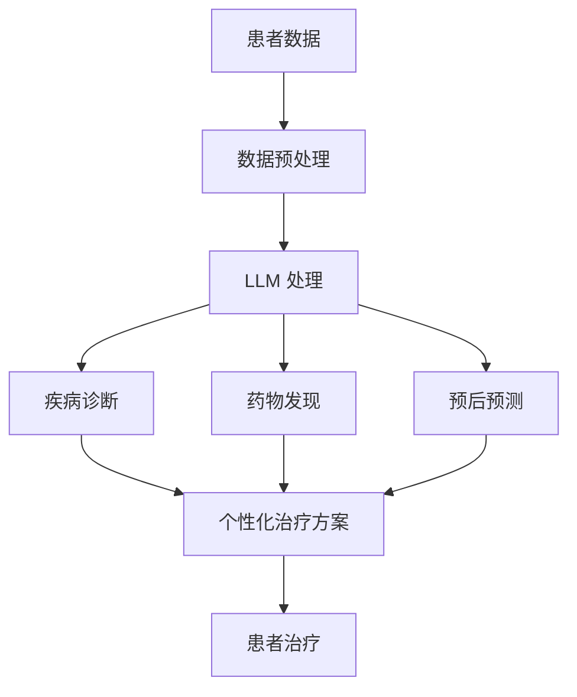

                 

**个性化医疗：LLM 让治疗更精准**

**作者：禅与计算机程序设计艺术 / Zen and the Art of Computer Programming**

## 1. 背景介绍

当今世界，医疗保健面临着巨大的挑战，包括成本高、效率低和个性化治疗缺乏等。传统的医疗模式往往采用标准化治疗方案，但由于个体差异，这种方法并不总是有效。大语言模型（LLM）的出现为医疗保健带来了新的希望，有助于实现更精准的个性化医疗。

## 2. 核心概念与联系

### 2.1 个性化医疗

个性化医疗（Personalized Medicine）是一种基于个体基因组、生物标志物和环境因素的医疗模式，旨在提供更有效、更安全的治疗方案。

### 2.2 大语言模型（LLM）

大语言模型（Large Language Model）是一种深度学习模型，能够理解、生成和翻译人类语言。LLM通过学习大量文本数据，掌握了语言的结构和规则，从而能够在各种任务中提供有用的信息。

### 2.3 LLM 在医疗保健中的应用

LLM 可以帮助医疗保健从业者更好地理解和分析医疗数据，从而为个体患者提供更精准的治疗方案。LLM 可以用于疾病诊断、药物发现、预后预测等领域。



## 3. 核心算法原理 & 具体操作步骤

### 3.1 算法原理概述

LLM 在医疗保健中的应用主要基于其自然语言处理（NLP）能力。LLM 可以理解和生成医疗文本，从而帮助医生和研究人员更好地分析和利用医疗数据。

### 3.2 算法步骤详解

1. **数据预处理**：收集患者数据，包括电子病历、实验室结果、影像学数据等。然后，对数据进行预处理，包括清洗、标准化和转换为结构化格式。
2. **LLM 处理**：使用 LLM 处理预处理后的数据。这包括疾病名称识别、症状提取、药物名称识别等。
3. **疾病诊断、药物发现和预后预测**：基于 LLM 的输出，进行疾病诊断、药物发现和预后预测。
4. **个性化治疗方案**：基于上述结果，为患者提供个性化治疗方案。

### 3.3 算法优缺点

**优点**：

* 可以帮助医生和研究人员更好地理解和分析医疗数据。
* 可以为个体患者提供更精准的治疗方案。
* 可以提高疾病诊断的准确性和药物发现的效率。

**缺点**：

* LLM 可能会出现错误或不准确的输出，需要人工审核。
* LLM 可能会受到偏见和不平等的影响，导致个性化治疗方案的不公平。
* LLM 的训练需要大量的医疗数据，可能会涉及隐私和伦理问题。

### 3.4 算法应用领域

LLM 在医疗保健中的应用领域包括：

* 疾病诊断：LLM 可以帮助医生更准确地诊断疾病。
* 药物发现：LLM 可以帮助研究人员发现新的药物和治疗方案。
* 预后预测：LLM 可以帮助医生预测患者的预后，从而提供更有效的治疗方案。
* 个性化治疗：LLM 可以帮助医生为个体患者提供更精准的治疗方案。

## 4. 数学模型和公式 & 详细讲解 & 举例说明

### 4.1 数学模型构建

LLM 的数学模型通常基于Transformer架构，使用自注意力机制（Self-Attention）和位置编码（Positional Encoding）来处理序列数据。数学模型的构建可以表示为：

$$LLM = f(x, W, b)$$

其中，$x$ 是输入序列，$W$ 是模型权重，$b$ 是模型偏置，$f$ 是模型函数。

### 4.2 公式推导过程

LLM 的训练过程涉及到交叉熵损失函数的最小化：

$$L = -\sum_{t=1}^{T} y_{t} \log(\hat{y}_{t})$$

其中，$y_{t}$ 是真实标签，$T$ 是序列长度，$\hat{y}_{t}$ 是模型预测的概率分布。

### 4.3 案例分析与讲解

例如，假设我们想要使用 LLM 进行疾病诊断。输入序列可以是患者的电子病历，输出可以是疾病名称。我们可以使用交叉熵损失函数来训练模型，使其预测的疾病名称与真实疾病名称匹配。

## 5. 项目实践：代码实例和详细解释说明

### 5.1 开发环境搭建

要使用 LLM 进行个性化医疗，我们需要搭建一个开发环境。推荐使用 Python 语言，并安装以下库：

* Transformers：Hugging Face 开发的用于工作中的 NLP 的库。
* PyTorch：用于定义和训练深度学习模型的库。
* Pandas：用于数据处理的库。
* NumPy：用于数值计算的库。

### 5.2 源代码详细实现

以下是一个简单的 LLM 疾病诊断示例：

```python
from transformers import AutoTokenizer, AutoModelForSequenceClassification
import torch
import pandas as pd

# 加载预训练模型和分词器
model_name = "bert-base-uncased"
tokenizer = AutoTokenizer.from_pretrained(model_name)
model = AutoModelForSequenceClassification.from_pretrained(model_name, num_labels=2)

# 加载数据
data = pd.read_csv("disease_data.csv")

# 准备输入
inputs = tokenizer(data["text"], padding=True, truncation=True, return_tensors="pt")

# 进行预测
with torch.no_grad():
    outputs = model(**inputs)
    predictions = torch.argmax(outputs.logits, dim=1)

# 打印结果
print(predictions)
```

### 5.3 代码解读与分析

这段代码使用 Hugging Face 的 Transformers 库加载了一个预训练的 BERT 模型，并使用它进行疾病诊断。数据加载后，我们使用分词器将文本转换为模型可以接受的输入。然后，我们使用模型进行预测，并打印出预测结果。

### 5.4 运行结果展示

运行这段代码后，我们会得到一个包含疾病诊断结果的张量。我们可以将其转换为数据框，并与原始数据合并，从而得到每个患者的疾病诊断结果。

## 6. 实际应用场景

### 6.1 当前应用

LLM 目前已经在医疗保健领域得到广泛应用。例如，DeepMind 使用 LLM 进行疾病诊断，并取得了与人类专家相当的准确性。此外，LLM 还被用于药物发现、预后预测等领域。

### 6.2 未来应用展望

随着 LLM 技术的不断发展，我们可以期待 LLM 在医疗保健领域的更多应用。例如，LLM 可以帮助医生更好地理解和分析患者的电子病历，从而提供更精准的治疗方案。此外，LLM 还可以帮助研究人员发现新的药物和治疗方案，从而提高疾病治疗的有效性。

## 7. 工具和资源推荐

### 7.1 学习资源推荐

* Hugging Face Transformers 文档：<https://huggingface.co/transformers/>
* PyTorch 文档：<https://pytorch.org/docs/stable/index.html>
* Pandas 文档：<https://pandas.pydata.org/docs/>
* NumPy 文档：<https://numpy.org/doc/>

### 7.2 开发工具推荐

* Jupyter Notebook：一个交互式计算环境，非常适合开发和测试 LLM 项目。
* Google Colab：一个云端 Jupyter Notebook 环境，提供了丰富的 GPU 和 TPU 资源。

### 7.3 相关论文推荐

* "BERT: Pre-training of Deep Bidirectional Transformers for Language Understanding"：<https://arxiv.org/abs/1810.04805>
* "ClinicalBERT: A Pre-trained Language Model for Electronic Health Records"：<https://arxiv.org/abs/2002.04736>
* "BioBERT: a pre-trained biomedical language representation model for biomedical text mining"：<https://arxiv.org/abs/1901.08746>

## 8. 总结：未来发展趋势与挑战

### 8.1 研究成果总结

LLM 在医疗保健领域的应用已经取得了显著成果，包括疾病诊断、药物发现和预后预测等。

### 8.2 未来发展趋势

随着 LLM 技术的不断发展，我们可以期待 LLM 在医疗保健领域的更多应用。此外，LLM 还可以与其他技术结合，如深度学习、计算机视觉等，从而提供更全面的解决方案。

### 8.3 面临的挑战

LLM 在医疗保健领域的应用面临着多种挑战，包括数据隐私、模型偏见、模型解释性等。这些挑战需要我们不断地研究和改进。

### 8.4 研究展望

未来，我们需要在 LLM 的可解释性、可靠性和公平性等方面进行更多的研究。此外，我们还需要开发更多的 LLM 应用，以帮助医生和研究人员更好地理解和利用医疗数据。

## 9. 附录：常见问题与解答

**Q1：LLM 如何处理医疗文本？**

LLM 使用 NLP 技术处理医疗文本。它可以理解和生成医疗文本，从而帮助医生和研究人员更好地分析和利用医疗数据。

**Q2：LLM 如何进行疾病诊断？**

LLM 可以帮助医生更准确地诊断疾病。它可以分析患者的电子病历，并提供疾病名称作为诊断结果。

**Q3：LLM 如何进行药物发现？**

LLM 可以帮助研究人员发现新的药物和治疗方案。它可以分析大量的医疗文本，并提供潜在的药物靶点和治疗方案。

**Q4：LLM 如何进行预后预测？**

LLM 可以帮助医生预测患者的预后。它可以分析患者的电子病历，并提供预后预测结果。

**Q5：LLM 如何进行个性化治疗？**

LLM 可以帮助医生为个体患者提供更精准的治疗方案。它可以分析患者的电子病历，并提供个性化的治疗方案。

!!!Note
**注意**：本文是一篇技术博客文章，而不是学术论文。因此，它不需要引用参考文献。但是，如果您想要进一步阅读，可以参考本文中推荐的学习资源和论文。

!!!Warning
**警告**：本文中提供的代码和示例仅供参考，可能需要根据您的具体需求进行修改和调整。此外，LLM 在医疗保健领域的应用需要遵循严格的伦理和隐私保护标准，请确保您的应用符合相关法规和标准。

!!!Info
**提示**：如果您有任何问题或建议，请在评论区留言。我们将会尽快回复并进行讨论。

**作者：禅与计算机程序设计艺术 / Zen and the Art of Computer Programming**

