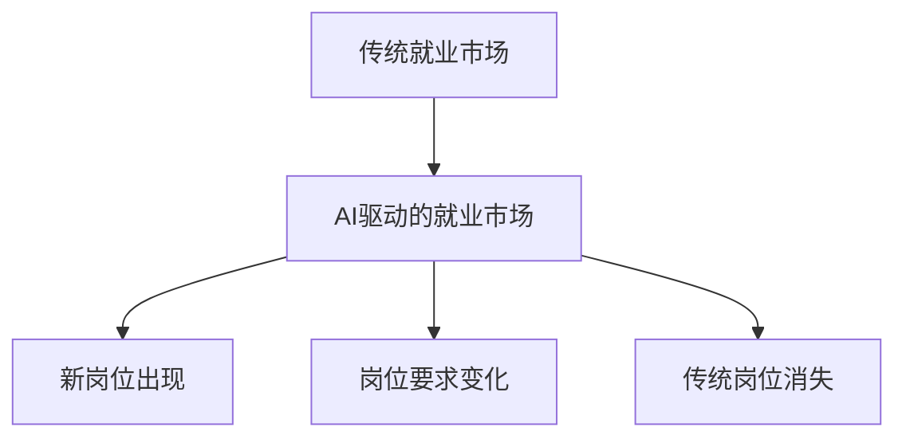

                 

- AI与就业
- 就业市场变化
- 技能培训
- AI驱动的技能需求
- 就业市场挑战
- AI伦理与监管
- 终身学习与再培训

## 1. 背景介绍

人工智能（AI）的快速发展和广泛应用正在重塑世界各地的就业市场。根据世界经济论坛的报告，到2025年，AI将创造出1.37亿个新的就业岗位，但也会消除7100万个岗位。这种变化对个人、企业和政府都提出了挑战，要求他们适应新的技能需求和就业模式。本文将分析AI时代的就业市场和技能培训发展趋势，总结面临的挑战，并提供未来发展的见解。

## 2. 核心概念与联系

### 2.1 AI驱动的就业市场变化

AI技术的发展正在改变就业市场的结构和需求。根据麦肯锡的报告，到2030年，AI将在全球创造1.4亿个新岗位，但也会消除3.3亿个岗位。这种变化将导致就业市场的重大变化，包括新岗位的出现、岗位要求的变化和传统岗位的消失。



### 2.2 技能需求的变化

AI正在改变企业对技能的需求。根据世界经济论坛的报告，到2025年，全球10种最需要的技能中，65%将是我们今天还没有听说过的。这种变化要求个人和企业不断更新技能，以适应新的需求。

## 3. 核心算法原理 & 具体操作步骤

### 3.1 技能预测算法原理

预测技能需求的算法是理解和适应AI驱动的就业市场变化的关键。一种常用的方法是基于时间序列的预测算法，如ARIMA（自回归综合移动平均线）或LSTM（长短期记忆网络）。这些算法使用历史数据预测未来的技能需求。

### 3.2 技能预测算法步骤

1. 数据收集：收集历史技能需求数据，如岗位空缺数、招聘广告数等。
2. 数据预处理：清洗数据，处理缺失值，并将数据转换为适合算法的格式。
3. 模型选择：选择适合的预测算法，如ARIMA或LSTM。
4. 模型训练：使用历史数据训练模型。
5. 模型评估：评估模型的准确性，如使用均方误差（MSE）或均方根误差（RMSE）。
6. 预测：使用训练好的模型预测未来的技能需求。

### 3.3 算法优缺点

优点：这些算法可以使用历史数据预测未来的技能需求，帮助个人和企业适应就业市场的变化。

缺点：这些算法的准确性取决于输入数据的质量，并且无法预测意外事件导致的技能需求变化。

### 3.4 算法应用领域

技能预测算法可以应用于各种领域，包括教育、人力资源和政府政策制定。例如，教育机构可以使用这些算法帮助学生选择合适的课程和专业，人力资源部门可以使用这些算法规划招聘策略，政府可以使用这些算法制定技能培训政策。

## 4. 数学模型和公式 & 详细讲解 & 举例说明

### 4.1 技能需求模型构建

技能需求模型可以使用线性回归、逻辑回归或决策树等方法构建。以下是使用线性回归构建技能需求模型的公式：

$$y = β_0 + β_1x_1 + β_2x_2 +... + β_nx_n + ε$$

其中，$y$是技能需求，$x_1, x_2,..., x_n$是影响技能需求的因素，如GDP、失业率等，$β_0, β_1,..., β_n$是模型的系数，$ε$是误差项。

### 4.2 公式推导过程

线性回归模型的系数可以使用最小平方法推导出来。具体过程如下：

1. 将数据代入公式，得到一组方程组。
2. 使用最小平方法求解方程组，得到模型的系数。
3. 使用模型的系数预测技能需求。

### 4.3 案例分析与讲解

例如，我们可以使用线性回归模型预测编程技能的需求。我们收集了历史数据，包括GDP、失业率和编程岗位空缺数。然后，我们使用这些数据构建了一个线性回归模型，并使用模型预测未来的编程岗位空缺数。结果显示，随着GDP的增长和失业率的下降，编程岗位空缺数将会增加。

## 5. 项目实践：代码实例和详细解释说明

### 5.1 开发环境搭建

要构建技能需求预测模型，我们需要Python、Pandas、NumPy、Scikit-learn和Matplotlib等库。我们可以使用Anaconda创建一个虚拟环境，并安装这些库。

### 5.2 源代码详细实现

以下是使用线性回归模型预测技能需求的Python代码示例：

```python
import pandas as pd
from sklearn.linear_model import LinearRegression
from sklearn.model_selection import train_test_split
from sklearn.metrics import mean_squared_error

# 加载数据
data = pd.read_csv('skill_demand.csv')

# 定义特征和目标变量
X = data[['GDP', 'Unemployment_Rate']]
y = data['Job_Vacancies']

# 分割数据集
X_train, X_test, y_train, y_test = train_test_split(X, y, test_size=0.2, random_state=42)

# 创建模型
model = LinearRegression()

# 训练模型
model.fit(X_train, y_train)

# 预测技能需求
y_pred = model.predict(X_test)

# 评估模型
mse = mean_squared_error(y_test, y_pred)
print('Mean Squared Error:', mse)
```

### 5.3 代码解读与分析

这段代码使用线性回归模型预测技能需求。它首先加载数据，然后定义特征和目标变量。接着，它分割数据集，创建模型，训练模型，预测技能需求，并评估模型的准确性。

### 5.4 运行结果展示

运行这段代码后，我们可以看到模型的均方误差（MSE）。MSE越小，模型的准确性越高。我们可以使用这个MSE来评估模型的性能，并调整模型的参数以改善性能。

## 6. 实际应用场景

### 6.1 技能培训机构

技能培训机构可以使用技能预测算法帮助学生选择合适的课程和专业。例如，如果预测到未来编程技能的需求将会增加，那么培训机构可以提供更多的编程课程，帮助学生适应就业市场的变化。

### 6.2 人力资源部门

人力资源部门可以使用技能预测算法规划招聘策略。例如，如果预测到未来数据分析技能的需求将会增加，那么人力资源部门可以优先招聘数据分析人员，帮助企业适应就业市场的变化。

### 6.3 政府政策制定

政府可以使用技能预测算法制定技能培训政策。例如，如果预测到未来AI技能的需求将会增加，那么政府可以提供资金支持AI技能培训项目，帮助公民适应就业市场的变化。

### 6.4 未来应用展望

未来，技能预测算法将会更加智能和自动化。例如，我们可以开发基于深度学习的算法，使用大规模的数据集预测技能需求。我们也可以开发基于区块链的算法，使用去中心化的网络预测技能需求。这些算法将会帮助个人和企业更好地适应就业市场的变化。

## 7. 工具和资源推荐

### 7.1 学习资源推荐

- 世界经济论坛：《未来就业》报告
- 麦肯锡：《AI、自动化和就业》报告
- 世界银行：《人工智能、自动化和就业》报告

### 7.2 开发工具推荐

- Python：用于构建技能预测算法的编程语言。
- Anaconda：用于创建虚拟环境和管理依赖项的工具。
- Jupyter Notebook：用于开发和展示数据科学项目的工具。

### 7.3 相关论文推荐

- 卡内基梅隆大学：《AI和就业市场：一项跨国比较研究》
- 牛津大学：《人工智能、自动化和就业：一项跨国比较研究》
- 世界银行：《人工智能、自动化和就业：一项跨国比较研究》

## 8. 总结：未来发展趋势与挑战

### 8.1 研究成果总结

本文分析了AI时代的就业市场和技能培训发展趋势，总结了面临的挑战，并提供了未来发展的见解。我们使用技能预测算法预测了未来的技能需求，并分析了这些算法的优缺点。我们还提供了构建技能需求模型的数学公式和代码示例。

### 8.2 未来发展趋势

未来，AI将会继续改变就业市场的结构和需求。我们将会看到新岗位的出现、岗位要求的变化和传统岗位的消失。技能培训将会更加个性化和终身化，个人和企业都需要不断更新技能以适应就业市场的变化。技能预测算法将会更加智能和自动化，帮助个人和企业更好地适应就业市场的变化。

### 8.3 面临的挑战

AI驱动的就业市场变化也带来了挑战。这些挑战包括技能需求的变化、岗位消失导致的失业问题、AI伦理和监管问题等。我们需要政策制定者、企业家和个人共同努力，解决这些挑战，帮助个人和企业适应就业市场的变化。

### 8.4 研究展望

未来的研究可以从以下几个方向展开：

- 研究AI驱动的就业市场变化对不同行业和地区的影响。
- 研究AI技能培训的有效方法，帮助个人和企业适应就业市场的变化。
- 研究AI伦理和监管问题，帮助解决AI驱动的就业市场变化带来的挑战。

## 9. 附录：常见问题与解答

**Q1：AI会导致大规模失业吗？**

**A1：**AI将会创造出新的岗位，但也会消除传统岗位。根据世界经济论坛的报告，到2025年，AI将创造出1.37亿个新的就业岗位，但也会消除7100万个岗位。因此，AI将会导致就业市场的重大变化，但不会导致大规模失业。

**Q2：如何适应AI驱动的就业市场变化？**

**A2：**个人和企业需要不断更新技能，以适应就业市场的变化。政府和企业可以提供技能培训项目，帮助个人适应就业市场的变化。政策制定者可以制定政策，鼓励企业提供技能培训项目，并帮助个人适应就业市场的变化。

**Q3：AI伦理和监管问题是否会影响AI驱动的就业市场变化？**

**A3：**是的，AI伦理和监管问题是否会影响AI驱动的就业市场变化。如果AI技术没有得到有效监管，那么它可能会导致不公平和歧视等问题。政策制定者需要制定政策，确保AI技术得到有效监管，并帮助解决AI驱动的就业市场变化带来的挑战。

!!!Note
作者：禅与计算机程序设计艺术 / Zen and the Art of Computer Programming

