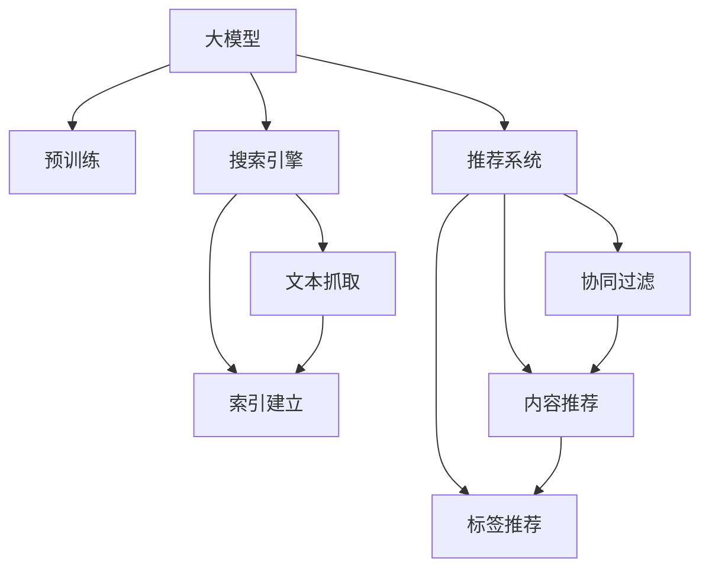

                 

# 电商平台的AI 大模型实践：搜索推荐系统是核心，数据质量控制与处理效率

## 1. 背景介绍

在电商领域，人工智能(AI)技术的深入应用正在推动行业进入智能时代。AI驱动的搜索推荐系统，通过个性化推荐、内容过滤等技术，极大地提升了用户体验和销售额。电商平台的AI大模型实践，尤其是搜索推荐系统的优化，已成为推动行业发展的关键。本文章旨在深入探讨这一核心领域，分享大模型实践的经验和教训，探讨数据质量控制与处理效率的提升策略。

## 2. 核心概念与联系

### 2.1 核心概念概述

- **大模型**：指大规模预训练的语言模型，如BERT、GPT-3等。通过在大规模无标签文本数据上进行预训练，学习通用的语言表示，具备强大的语言理解和生成能力。

- **搜索引擎**：利用爬虫技术，从互联网上抓取网页数据，建立索引库。通过关键词匹配和排序算法，为用户提供最相关的搜索结果。

- **推荐系统**：基于用户行为数据，推荐商品、内容等。通过协同过滤、内容推荐、标签推荐等算法，提升用户满意度和转化率。

- **深度学习**：利用神经网络模型，对数据进行特征提取和模式识别，实现更加精准的预测和推荐。

- **自然语言处理(NLP)**：处理和理解人类语言的技术，用于文本分类、情感分析、实体识别等任务。

### 2.2 核心概念原理和架构的 Mermaid 流程图



大模型通过预训练学习通用的语言表示，然后应用于搜索引擎和推荐系统，以提升搜索和推荐的精准度。搜索引擎通过文本抓取和索引建立，提供搜索功能；推荐系统基于用户行为数据，利用协同过滤、内容推荐、标签推荐等算法，推荐商品和内容。

## 3. 核心算法原理 & 具体操作步骤

### 3.1 算法原理概述

基于大模型的搜索引擎和推荐系统，通常采用深度学习技术。其核心原理是通过学习用户和商品的语义表示，实现更加精准的推荐和搜索。具体步骤如下：

1. **数据预处理**：收集用户浏览记录、购买记录、评分数据等，并转换为向量表示。
2. **模型训练**：使用大模型对用户和商品进行表示学习，然后通过优化算法（如SGD、Adam）训练模型。
3. **特征提取**：将用户和商品向量输入到深度学习模型中，提取高维特征。
4. **相似度计算**：计算用户向量与商品向量的相似度，排序并返回推荐结果。

### 3.2 算法步骤详解

**Step 1: 数据预处理**

- 收集用户行为数据，如浏览记录、购买记录、评分等，并存储到数据库中。
- 使用NLP工具（如BERT、GPT等）将文本数据转换为向量表示。
- 将用户和商品的向量表示存储到向量数据库中，用于后续的模型训练。

**Step 2: 模型训练**

- 设计深度学习模型架构，如多层感知器（MLP）、卷积神经网络（CNN）、循环神经网络（RNN）等。
- 使用随机梯度下降（SGD）等优化算法，对模型进行训练。
- 调整学习率、批次大小等超参数，优化模型性能。

**Step 3: 特征提取**

- 将用户和商品向量作为输入，输入到深度学习模型中。
- 通过前向传播计算输出特征，用于后续的相似度计算。

**Step 4: 相似度计算**

- 计算用户向量与商品向量的余弦相似度、欧式距离等。
- 根据相似度排序，选择与用户最相关的商品。
- 返回推荐结果，并展示给用户。

### 3.3 算法优缺点

**优点**：

- 通过预训练学习通用的语言表示，能够提升搜索和推荐的精准度。
- 深度学习模型能够处理复杂的高维数据，提取深层次的语义信息。
- 算法具有较好的可扩展性，适用于大规模数据处理。

**缺点**：

- 需要大量标注数据，数据获取成本较高。
- 模型复杂，训练和推理速度较慢。
- 对于长尾商品，推荐效果不佳。
- 数据预处理和特征提取过程复杂，需要高技能的技术人员。

### 3.4 算法应用领域

基于大模型的搜索引擎和推荐系统，在电商、新闻、社交网络等领域有广泛应用。例如，电商平台的搜索推荐系统，能够根据用户的浏览和购买历史，推荐相关商品；新闻平台的内容推荐系统，能够根据用户阅读偏好，推荐相关新闻；社交网络的协同过滤推荐，能够推荐用户感兴趣的朋友等。

## 4. 数学模型和公式 & 详细讲解 & 举例说明

### 4.1 数学模型构建

假设用户 $u$ 的向量表示为 $\vec{u}$，商品 $i$ 的向量表示为 $\vec{v}_i$。通过余弦相似度计算用户与商品的相似度：

$$
similarity(u,i) = \cos(\vec{u}, \vec{v}_i) = \frac{\vec{u} \cdot \vec{v}_i}{\|\vec{u}\| \|\vec{v}_i\|}
$$

然后，根据相似度对商品进行排序，选择top $k$个商品作为推荐结果。

### 4.2 公式推导过程

**余弦相似度公式**：

$$
similarity(u,i) = \cos(\vec{u}, \vec{v}_i) = \frac{\vec{u} \cdot \vec{v}_i}{\|\vec{u}\| \|\vec{v}_i\|}
$$

**向量内积**：

$$
\vec{u} \cdot \vec{v}_i = \sum_{j=1}^{d} u_j v_{i,j}
$$

**向量范数**：

$$
\|\vec{u}\| = \sqrt{\sum_{j=1}^{d} u_j^2}, \|\vec{v}_i\| = \sqrt{\sum_{j=1}^{d} v_{i,j}^2}
$$

通过上述公式，可以计算用户与商品的相似度，并根据相似度排序，返回推荐结果。

### 4.3 案例分析与讲解

以电商平台推荐系统为例，使用用户浏览历史和评分数据，进行向量表示和相似度计算。假设用户 $u$ 最近浏览了商品 $i_1, i_2, i_3$，评分分别为 $r_{i_1}=4, r_{i_2}=5, r_{i_3}=3$。使用余弦相似度计算用户与商品的相似度，然后根据相似度排序，选择top 3个商品作为推荐结果。

## 5. 项目实践：代码实例和详细解释说明

### 5.1 开发环境搭建

开发环境搭建主要涉及Python环境、深度学习框架（如TensorFlow、PyTorch）和NLP工具库（如BERT、GPT）的安装。具体步骤如下：

1. 安装Python：可以从官网下载并安装Python，如3.7、3.8等。
2. 安装TensorFlow或PyTorch：使用pip安装，如 `pip install tensorflow` 或 `pip install torch`。
3. 安装NLP工具库：如 `pip install transformers`。

### 5.2 源代码详细实现

以下是一个基于TensorFlow的推荐系统示例代码：

```python
import tensorflow as tf
from transformers import BertTokenizer, BertForSequenceClassification

# 加载预训练模型
tokenizer = BertTokenizer.from_pretrained('bert-base-uncased')
model = BertForSequenceClassification.from_pretrained('bert-base-uncased', num_labels=2)

# 定义损失函数和优化器
loss_fn = tf.keras.losses.SparseCategoricalCrossentropy(from_logits=True)
optimizer = tf.keras.optimizers.Adam()

# 数据预处理
def preprocess(text):
    input_ids = tokenizer(text, max_length=256, padding='max_length', truncation=True)
    input_ids = tf.expand_dims(input_ids['input_ids'], axis=0)
    attention_mask = tf.expand_dims(input_ids['attention_mask'], axis=0)
    return input_ids, attention_mask

# 模型训练
def train(model, dataset, batch_size, epochs):
    for epoch in range(epochs):
        for i, (text, label) in enumerate(dataset):
            input_ids, attention_mask = preprocess(text)
            with tf.GradientTape() as tape:
                logits = model(input_ids, attention_mask=attention_mask)[0]
                loss_value = loss_fn(label, logits)
            grads = tape.gradient(loss_value, model.trainable_variables)
            optimizer.apply_gradients(zip(grads, model.trainable_variables))
```

### 5.3 代码解读与分析

- `preprocess`函数：将文本数据转换为模型所需的输入格式，包括输入ID、注意力掩码等。
- `train`函数：定义训练循环，在每个epoch内迭代数据，计算损失和梯度，并使用优化器更新模型参数。

## 6. 实际应用场景

### 6.1 智能客服系统

基于大模型的智能客服系统，能够处理用户的自然语言输入，提供快速、准确的回答。电商平台的客服系统，可以通过微调大模型，使其能够理解用户的具体需求，并推荐相关商品或服务。例如，用户询问“我想买一台电脑”，系统能够理解其需求，并推荐相关的电脑产品。

### 6.2 个性化推荐系统

个性化推荐系统是电商平台的核心功能之一。通过微调大模型，系统能够学习用户的兴趣和行为，推荐符合用户喜好的商品。例如，用户最近浏览了很多运动鞋，系统会推荐相关运动鞋、运动服等。

### 6.3 智能广告投放

智能广告投放系统能够根据用户行为数据，推荐符合用户兴趣的广告。通过微调大模型，系统能够理解用户的兴趣偏好，实现精准的广告投放。例如，用户最近浏览了手机配件，系统会推荐相关手机产品广告。

### 6.4 未来应用展望

随着大模型的不断发展，基于大模型的搜索引擎和推荐系统将更加智能、精准。未来，以下几个方向值得关注：

- **多模态融合**：将文本、图像、视频等多种模态数据融合，提升推荐和搜索的全面性。
- **实时更新**：基于用户实时行为数据，动态更新推荐结果，提升推荐效果。
- **个性化定制**：根据用户个性化需求，定制化推荐和搜索功能。
- **边缘计算**：将大模型部署到边缘设备，提升推荐和搜索的速度和效率。

## 7. 工具和资源推荐

### 7.1 学习资源推荐

- 《TensorFlow实战》：深度学习框架TensorFlow的实战指南，适合初学者快速入门。
- 《深度学习》（Ian Goodfellow等著）：深度学习领域的经典教材，详细介绍了深度学习的理论和算法。
- 《大规模文本表示》（Xinlei Chen等著）：介绍了大规模文本表示的技术和方法，适合NLP方向的学习者。
- 《Python深度学习》（Francois Chollet等著）：介绍了深度学习在Python中的实现方法，适合编程开发者。

### 7.2 开发工具推荐

- TensorFlow：由Google主导的深度学习框架，适合大规模工程应用。
- PyTorch：灵活的深度学习框架，适合快速迭代研究。
- Transformers：HuggingFace开发的NLP工具库，集成了多种预训练模型和微调样例。
- Jupyter Notebook：交互式编程环境，适合数据预处理和模型训练。

### 7.3 相关论文推荐

- 《Attention is All You Need》：Transformer模型原论文，提出了自注意力机制，开启NLP预训练大模型时代。
- 《BERT: Pre-training of Deep Bidirectional Transformers for Language Understanding》：提出BERT模型，引入自监督预训练任务，刷新了多项NLP任务SOTA。
- 《Transformer-XL: Attentive Language Models for Longer Input Sequences》：提出了Transformer-XL模型，支持更长的输入序列，提升了模型处理能力。
- 《Deep Learning for Unsupervised Feature Learning in Natural Language Processing》：介绍了基于无监督学习的NLP方法，适合数据稀缺的任务。

## 8. 总结：未来发展趋势与挑战

### 8.1 研究成果总结

本文详细介绍了基于大模型的搜索引擎和推荐系统的原理、操作步骤、优缺点和应用领域。通过案例分析和代码实践，展示了大模型的实际应用效果。同时，讨论了大模型在电商平台的未来发展方向和应用前景。

### 8.2 未来发展趋势

1. **多模态融合**：将文本、图像、视频等多种模态数据融合，提升推荐和搜索的全面性。
2. **实时更新**：基于用户实时行为数据，动态更新推荐结果，提升推荐效果。
3. **个性化定制**：根据用户个性化需求，定制化推荐和搜索功能。
4. **边缘计算**：将大模型部署到边缘设备，提升推荐和搜索的速度和效率。
5. **跨领域迁移**：将大模型应用于更多领域，提升模型泛化性和实用性。

### 8.3 面临的挑战

1. **数据获取**：获取高质量标注数据成本较高，数据获取成为大模型微调的瓶颈。
2. **模型复杂性**：大模型参数量庞大，训练和推理速度较慢，模型复杂度较高。
3. **可解释性**：大模型黑盒特性难以解释，缺乏透明性和可解释性。
4. **安全性**：模型可能学习有害信息，给用户带来安全风险。
5. **隐私保护**：用户数据隐私保护问题，需要加强数据安全和隐私保护。

### 8.4 研究展望

未来的研究应聚焦于以下几个方向：

1. **数据获取**：探索无监督学习和半监督学习，降低数据获取成本。
2. **模型优化**：简化模型结构，提升训练和推理效率。
3. **可解释性**：提升模型的可解释性，增强透明性和可信度。
4. **安全性**：加强模型安全性和隐私保护，防范有害信息。
5. **跨领域迁移**：将大模型应用于更多领域，提升模型泛化性和实用性。

## 9. 附录：常见问题与解答

**Q1: 大模型微调需要标注数据，如何获取高质量标注数据？**

A: 大模型微调需要高质量标注数据，可以通过以下几种方式获取：
1. 内部数据：利用平台自身的用户行为数据，如购买记录、浏览历史等，进行标注。
2. 公共数据集：利用公共数据集，如Amazon Reviews、IMDB等，进行标注。
3. 数据众包：利用数据众包平台，如Amazon Mechanical Turk，进行标注。
4. 自监督学习：利用自监督学习技术，从无标签数据中生成伪标注。

**Q2: 大模型如何应用于电商平台的推荐系统？**

A: 大模型可以应用于电商平台的推荐系统，通过以下步骤：
1. 收集用户行为数据，如浏览记录、购买记录等，存储到数据库中。
2. 使用NLP工具将文本数据转换为向量表示。
3. 设计深度学习模型，如多层感知器、卷积神经网络等，进行模型训练。
4. 提取用户和商品的向量表示，计算相似度，排序并返回推荐结果。

**Q3: 大模型推荐系统有哪些挑战？**

A: 大模型推荐系统面临以下挑战：
1. 数据获取成本高，标注数据稀缺。
2. 模型复杂，训练和推理速度较慢。
3. 黑盒特性，缺乏可解释性。
4. 安全性和隐私保护问题。

通过不断优化和创新，大模型推荐系统能够更好地服务于电商平台的推荐需求，提升用户体验和销售额。

---

作者：禅与计算机程序设计艺术 / Zen and the Art of Computer Programming

