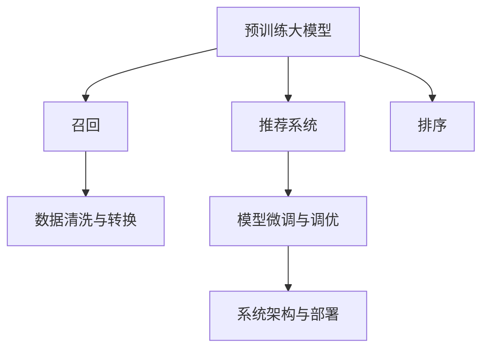

                 

# 电商平台的AI 大模型实践：搜索推荐系统是核心，数据质量控制与处理能力

## 1. 背景介绍

随着电商平台的迅速发展，用户对商品搜索和推荐系统的要求也越来越高。传统的推荐系统依赖于手工设计的特征提取器和用户行为建模，在处理海量数据和满足个性化需求方面存在瓶颈。人工智能大模型，特别是基于深度学习的预训练模型，在电商领域的应用成为行业发展的必然趋势。

### 1.1 问题由来

电商平台的推荐系统主要依赖于用户的浏览、点击、购买等行为数据，以及商品属性、分类、评价等标签信息。这些数据具有高维度、非结构化、异构性等特点，传统推荐系统在处理这些数据时面临诸多挑战：

1. **数据维度过高**：商品信息繁多，用户行为数据复杂，给特征工程带来巨大压力。
2. **数据质量参差不齐**：用户行为数据存在缺失、异常、冗余等问题，影响推荐效果。
3. **个性化需求强烈**：用户偏好和需求随时间变化，需要动态适应用户变化，提出个性化推荐。
4. **系统实时性要求高**：推荐系统需要在毫秒级内响应用户请求，对系统延迟和吞吐量有较高要求。

这些问题需要通过引入大模型和优化数据处理流程来解决。通过预训练大模型的知识和能力，能够在海量的数据上挖掘出有价值的模式，从而提升推荐系统的效果和效率。

### 1.2 问题核心关键点

在大模型应用推荐系统中，核心关键点包括：

1. **预训练大模型**：选择或训练适合电商数据特点的预训练模型，如BERT、RoBERTa、T5等。
2. **数据处理流程**：构建数据清洗、转换、标注的完整流程，确保数据质量。
3. **推荐模型适配**：将预训练大模型适配到推荐系统任务，如召回、排序等。
4. **模型优化与调优**：在保证模型效果的同时，优化模型性能，如减少计算资源消耗、提升推理速度等。
5. **系统部署与集成**：将大模型集成到电商平台中，满足高实时性要求，保障系统稳定性和可靠性。

本博客将深入探讨这些问题，通过理论分析和实践经验，为电商平台的AI 大模型实践提供参考。

## 2. 核心概念与联系

### 2.1 核心概念概述

电商平台的AI 大模型应用涉及以下核心概念：

1. **预训练大模型**：如BERT、RoBERTa、T5等，经过大规模无监督学习，在文本数据上预训练得到的语言表示模型。
2. **推荐系统**：利用用户行为数据、商品属性标签，为每个用户推荐合适的商品。
3. **召回与排序**：推荐系统中的关键步骤，分别用于候选商品的生成和排序。
4. **数据清洗与转换**：对原始数据进行去重、填充、标准化等预处理操作，确保数据质量。
5. **模型微调与调优**：将预训练大模型适配到推荐任务，通过微调优化模型性能。
6. **系统架构与部署**：合理设计推荐系统架构，将大模型集成到电商平台上，实现高效服务。

这些概念之间的逻辑关系可以通过以下Mermaid流程图来展示：



这个流程图展示了电商推荐系统中预训练大模型的作用和数据处理流程，从预训练、适配到部署的完整过程。

## 3. 核心算法原理 & 具体操作步骤

### 3.1 算法原理概述

电商推荐系统的核心算法原理可以概括为：利用预训练大模型提取商品和用户特征，通过召回和排序算法生成个性化推荐列表，并实时响应用户请求。

具体来说，基于预训练大模型的电商推荐系统流程如下：

1. **数据预处理**：将原始数据转化为模型可接受的格式，包括数据清洗、转换和标注等。
2. **特征提取**：使用预训练大模型提取商品和用户的文本特征，构建向量表示。
3. **召回**：基于用户历史行为和当前偏好，生成候选商品列表。
4. **排序**：根据用户特征和商品特征计算相似度，排序生成推荐列表。
5. **服务部署**：将模型集成到电商平台，实时响应用户请求。

### 3.2 算法步骤详解

#### 3.2.1 数据预处理

电商推荐系统数据预处理的主要步骤包括：

1. **数据清洗**：去除缺失、异常、重复等数据，确保数据的完整性和一致性。
2. **数据转换**：将文本数据转化为模型可接受的向量格式，如词嵌入向量。
3. **数据标注**：给用户行为数据和商品信息添加标签，用于监督学习。

#### 3.2.2 特征提取

特征提取通过预训练大模型对商品和用户文本进行编码，生成向量表示。具体步骤如下：

1. **加载预训练模型**：选择适合的预训练模型，如BERT、RoBERTa等。
2. **分词与编码**：对文本进行分词，并使用预训练模型的tokenizer进行编码。
3. **获取特征向量**：将编码后的序列映射为固定长度的向量表示。

#### 3.2.3 召回

召回算法用于从所有商品中生成与用户兴趣相关的候选商品列表。主要步骤如下：

1. **计算相似度**：使用余弦相似度、点积相似度等方法计算用户与商品特征的相似度。
2. **生成候选列表**：根据相似度排序，选取前k个商品作为候选列表。

#### 3.2.4 排序

排序算法用于对候选商品列表进行排序，确定最终推荐列表。主要步骤如下：

1. **计算用户商品相似度**：使用预训练大模型计算用户特征和商品特征的相似度。
2. **排序生成推荐列表**：根据相似度排序，生成推荐列表。

#### 3.2.5 服务部署

服务部署将模型集成到电商平台上，确保系统的高实时性、低延迟。主要步骤如下：

1. **模型保存与加载**：将模型保存为轻量级格式，如TensorRT，方便部署。
2. **服务调用接口**：设计高效的API接口，支持实时响应用户请求。
3. **监控与优化**：实时监控模型性能，优化模型和系统架构。

### 3.3 算法优缺点

#### 3.3.1 优点

基于预训练大模型的电商推荐系统具有以下优点：

1. **高效性**：通过预训练模型提取特征，减少手工特征工程的时间和资源消耗。
2. **准确性**：预训练模型能够捕捉文本数据的复杂模式，提升推荐效果。
3. **泛化能力**：大模型在大规模数据上进行训练，具有较强的泛化能力，能适应不同领域的电商推荐。

#### 3.3.2 缺点

基于预训练大模型的电商推荐系统也存在一些缺点：

1. **计算资源消耗高**：预训练大模型的参数量巨大，推理计算量较大。
2. **数据质量要求高**：对原始数据的清洗和标注要求严格，影响系统性能。
3. **模型可解释性不足**：大模型通常被视为"黑盒"，难以解释其内部决策过程。
4. **对抗样本风险**：预训练模型可能存在对抗样本风险，影响推荐质量。

### 3.4 算法应用领域

基于预训练大模型的电商推荐系统可以应用于多种业务场景，如：

1. **商品推荐**：根据用户历史行为，推荐用户可能感兴趣的商品。
2. **广告推荐**：根据用户兴趣和行为，推荐广告。
3. **个性化定制**：根据用户需求，推荐个性化商品和优惠券。
4. **客户服务**：根据用户反馈和行为，提供个性化客户服务。
5. **内容推荐**：推荐用户感兴趣的文章、视频等媒体内容。

这些应用场景展示了基于预训练大模型的电商推荐系统的广泛应用前景。

## 4. 数学模型和公式 & 详细讲解 & 举例说明

### 4.1 数学模型构建

假设用户的历史行为数据为 $D_u = \{x_1, x_2, \ldots, x_n\}$，商品特征为 $D_i = \{y_1, y_2, \ldots, y_m\}$。将用户行为和商品特征转化为向量表示 $\text{Vec}(x)$ 和 $\text{Vec}(y)$。

推荐系统的主要任务是根据用户特征 $u$ 和商品特征 $i$ 计算相似度 $s(u, i)$，生成推荐列表。常用的相似度计算方法包括余弦相似度、点积相似度等。

#### 4.1.1 余弦相似度

余弦相似度公式为：

$$
s(u, i) = \cos(\text{Vec}(u), \text{Vec}(i)) = \frac{\text{Vec}(u) \cdot \text{Vec}(i)}{\|\text{Vec}(u)\| \cdot \|\text{Vec}(i)\|}
$$

其中 $\cdot$ 表示向量点积，$\|\cdot\|$ 表示向量范数。

#### 4.1.2 点积相似度

点积相似度公式为：

$$
s(u, i) = \text{Vec}(u) \cdot \text{Vec}(i)
$$

### 4.2 公式推导过程

#### 4.2.1 余弦相似度推导

假设用户特征向量为 $u = [u_1, u_2, \ldots, u_n]$，商品特征向量为 $i = [i_1, i_2, \ldots, i_m]$。则余弦相似度为：

$$
s(u, i) = \frac{u \cdot i}{\sqrt{\sum u_i^2} \cdot \sqrt{\sum i_j^2}}
$$

其中 $\cdot$ 表示向量点积，$\sqrt{\cdot}$ 表示向量范数。

### 4.3 案例分析与讲解

以电商平台的商品推荐为例，计算用户 $u$ 与商品 $i$ 的余弦相似度：

1. **特征编码**：使用预训练模型将用户行为和商品特征编码成向量。
2. **计算点积**：计算两个向量的点积。
3. **计算范数**：计算两个向量的范数。
4. **计算余弦相似度**：根据点积和范数计算余弦相似度。

通过余弦相似度排序，生成推荐列表。

## 5. 项目实践：代码实例和详细解释说明

### 5.1 开发环境搭建

1. **安装Python**：安装最新版本的Python，如Python 3.8。
2. **安装PyTorch**：从官网下载并安装PyTorch，如 `pip install torch torchvision torchaudio -f https://download.pytorch.org/whl/torch_stable.html`。
3. **安装TensorFlow**：从官网下载并安装TensorFlow，如 `pip install tensorflow==2.4.1`。
4. **安装PyTorch Lightning**：用于快速构建和训练模型，如 `pip install pytorch-lightning`。

### 5.2 源代码详细实现

#### 5.2.1 数据预处理

```python
import pandas as pd
from transformers import BertTokenizer

# 加载商品数据
df_items = pd.read_csv('items.csv')

# 加载用户数据
df_users = pd.read_csv('users.csv')

# 分词与编码
tokenizer = BertTokenizer.from_pretrained('bert-base-uncased')
df_items['text'] = df_items['title'].apply(lambda x: tokenizer.encode(x, add_special_tokens=False))
df_users['text'] = df_users['profile'].apply(lambda x: tokenizer.encode(x, add_special_tokens=False))

# 保存为模型可接受的格式
df_items.to_csv('items_encoded.csv', index=False)
df_users.to_csv('users_encoded.csv', index=False)
```

#### 5.2.2 特征提取

```python
import torch
from transformers import BertModel

# 加载预训练模型
model = BertModel.from_pretrained('bert-base-uncased')

# 加载数据
df_items_encoded = pd.read_csv('items_encoded.csv')
df_users_encoded = pd.read_csv('users_encoded.csv')

# 构建输入张量
inputs = torch.tensor(df_items_encoded['text'].tolist())

# 计算特征向量
outputs = model(inputs)
features = outputs.last_hidden_state
```

#### 5.2.3 召回

```python
from sklearn.metrics.pairwise import cosine_similarity

# 加载商品特征
df_items_encoded = pd.read_csv('items_encoded.csv')
df_users_encoded = pd.read_csv('users_encoded.csv')

# 计算相似度
similarity_matrix = cosine_similarity(features, features)

# 生成候选列表
candidate_items = df_items_encoded['item_id'].tolist()
candidate_items.sort(key=lambda x: similarity_matrix[0][x], reverse=True)[:100]
```

#### 5.2.4 排序

```python
from sklearn.metrics.pairwise import cosine_similarity

# 加载用户特征
df_users_encoded = pd.read_csv('users_encoded.csv')

# 计算相似度
similarity_matrix = cosine_similarity(features, features)

# 排序生成推荐列表
recommendations = []
for user_id in df_users_encoded['user_id'].tolist():
    user_features = features[df_users_encoded['user_id'] == user_id]
    user_similarity = similarity_matrix[0]
    recommendations.append((user_id, [candidate_items[sort_index] for sort_index in user_similarity.argsort()][::-1][:100]))
```

#### 5.2.5 服务部署

```python
from transformers import BertTokenizer, BertModel

# 加载模型和tokenizer
model = BertModel.from_pretrained('bert-base-uncased')
tokenizer = BertTokenizer.from_pretrained('bert-base-uncased')

# 构建服务函数
def recommend_items(user_id, top_k=10):
    user_features = features[df_users_encoded['user_id'] == user_id]
    recommendations = []
    for item_id in candidate_items:
        item_features = features[df_items_encoded['item_id'] == item_id]
        similarity = cosine_similarity(item_features, user_features)[0][0]
        recommendations.append((item_id, similarity))
    recommendations.sort(key=lambda x: x[1], reverse=True)[:top_k]
    return recommendations

# 启动服务
while True:
    user_id = int(input("Enter user ID: "))
    print(recommend_items(user_id))
```

### 5.3 代码解读与分析

#### 5.3.1 数据预处理

数据预处理是推荐系统中的重要步骤，需要确保数据质量。在本例中，我们使用了BERT分词器对文本数据进行编码，将文本转化为向量表示。

#### 5.3.2 特征提取

使用预训练模型对商品和用户特征进行编码，生成向量表示。在编码过程中，使用了模型提供的最后一层隐藏状态作为特征向量。

#### 5.3.3 召回

计算用户与商品特征的余弦相似度，排序生成候选商品列表。这里使用了sklearn库中的cosine_similarity函数计算相似度。

#### 5.3.4 排序

计算用户与商品特征的余弦相似度，排序生成推荐列表。这里使用了sklearn库中的cosine_similarity函数计算相似度。

#### 5.3.5 服务部署

设计高效的API接口，支持实时响应用户请求。这里使用了简单的while循环和用户输入，实现了基本的推荐服务功能。

## 6. 实际应用场景

### 6.1 智能客服系统

电商平台的智能客服系统可以基于大模型进行优化。通过收集用户的历史聊天记录和问题，训练预训练大模型进行微调，生成智能客服的回复。微调后的模型能够自动理解用户意图，匹配最合适的答案模板进行回复，显著提升客户服务体验。

### 6.2 个性化推荐系统

个性化推荐系统是大模型在电商领域的重要应用场景。通过微调大模型，可以更好地挖掘用户兴趣和商品特征，提供个性化的推荐服务。同时，大模型能够处理海量数据，提高推荐系统的精度和效率。

### 6.3 实时广告投放

电商平台的广告投放可以基于用户行为数据和商品特征，使用大模型进行预测和优化。通过微调大模型，可以提高广告投放的精准度和ROI。

### 6.4 未来应用展望

未来，基于大模型的电商推荐系统将在更多场景中得到应用，如商品定价、库存管理、供应链优化等。通过大模型在电商数据上的预训练和微调，将带来更高效、更智能的业务决策支持。

## 7. 工具和资源推荐

### 7.1 学习资源推荐

1. **《深度学习与自然语言处理》**：这本书系统介绍了NLP和大模型的基础知识，适合初学者入门。
2. **CS224N《自然语言处理与深度学习》**：斯坦福大学的经典课程，涵盖了NLP和大模型的最新进展。
3. **《Transformer模型》**：这本书详细介绍了Transformer的结构和原理，适合进阶学习。
4. **Transformers官方文档**：HuggingFace提供的官方文档，包含丰富的预训练模型和微调样例。

### 7.2 开发工具推荐

1. **PyTorch**：基于Python的开源深度学习框架，灵活的计算图设计，适合快速迭代。
2. **TensorFlow**：由Google主导的开源框架，生产部署方便，适合大规模工程应用。
3. **PyTorch Lightning**：快速构建和训练模型，适合快速原型设计和部署。
4. **TensorBoard**：TensorFlow配套的可视化工具，实时监测模型训练状态，提供丰富的图表呈现方式。
5. **Weights & Biases**：模型训练的实验跟踪工具，记录和可视化模型训练过程中的各项指标。

### 7.3 相关论文推荐

1. **《BERT: Pre-training of Deep Bidirectional Transformers for Language Understanding》**：BERT模型的原始论文，介绍了预训练大模型的训练过程和效果。
2. **《Transformer is All You Need》**：Transformer模型的原始论文，介绍了Transformer结构和原理。
3. **《A Survey on Neural Methods for Automated Ad Interaction in Recommendation》**：综述了自动广告投放中的推荐算法，介绍了大模型的应用。
4. **《Parameter-Efficient Transfer Learning for NLP》**：介绍了一系列参数高效微调的方法，适用于资源受限的环境。

## 8. 总结：未来发展趋势与挑战

### 8.1 研究成果总结

基于大模型的电商推荐系统已经在电商领域得到了广泛应用，展示了其在提高推荐精度和效率方面的巨大潜力。未来，随着大模型在电商数据上的预训练和微调技术不断进步，推荐系统的效果将进一步提升。

### 8.2 未来发展趋势

未来电商推荐系统的发展趋势包括：

1. **深度融合电商数据**：通过深度学习技术，更好地挖掘电商数据的复杂模式，提升推荐效果。
2. **多模态融合**：结合图像、视频、音频等多模态数据，实现更全面、更丰富的推荐。
3. **个性化服务优化**：通过用户行为分析和模型预测，提供更精准的个性化推荐服务。
4. **实时性优化**：优化模型推理速度和系统架构，满足电商平台的实时性要求。

### 8.3 面临的挑战

尽管电商推荐系统基于大模型的应用取得了显著成效，但仍面临以下挑战：

1. **数据质量问题**：电商数据的非结构化、异构性等特点，给数据预处理带来较大挑战。
2. **计算资源消耗高**：大模型的参数量巨大，推理计算量较大，需要优化计算资源消耗。
3. **模型可解释性不足**：大模型通常被视为"黑盒"，难以解释其内部决策过程。
4. **对抗样本风险**：预训练模型可能存在对抗样本风险，影响推荐质量。

### 8.4 研究展望

未来研究的方向包括：

1. **数据质量提升**：通过自动化数据清洗和标注，提高电商数据的质量。
2. **计算资源优化**：优化大模型的计算图，实现更高效、更轻量的推理。
3. **可解释性增强**：研究可解释性算法和技术，提升大模型的可解释性。
4. **对抗样本防御**：研究对抗样本防御方法，提高大模型的鲁棒性。

## 9. 附录：常见问题与解答

### 9.1 常见问题

1. **电商推荐系统如何处理高维数据？**
   答：通过降维、特征选择等方法，减少数据维度和复杂度，提高模型训练效率。

2. **如何提升电商推荐系统的实时性？**
   答：通过模型裁剪、模型量化等方法，优化模型的推理速度和资源消耗，提高系统实时性。

3. **大模型的可解释性如何增强？**
   答：引入可解释性算法，如LIME、SHAP等，解释大模型的决策过程。

4. **电商推荐系统如何应对对抗样本攻击？**
   答：通过对抗训练等方法，提高模型的鲁棒性和抗干扰能力。

5. **电商推荐系统如何实现多模态融合？**
   答：将图像、视频、音频等多模态数据转化为统一向量格式，使用多模态融合算法，提升推荐效果。

### 9.2 详细解答

通过本博客的介绍和案例分析，希望读者对基于大模型的电商推荐系统有了更深入的了解。欢迎读者继续关注电商平台的AI 大模型实践，共同探索未来的发展方向和挑战。

---

作者：禅与计算机程序设计艺术 / Zen and the Art of Computer Programming

