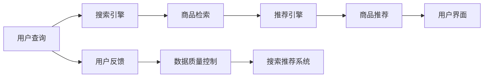

                 

# 电商平台的AI 大模型实践：搜索推荐系统是核心，数据质量控制与用户体验

> 关键词：大模型, 电商搜索推荐, AI技术, 数据质量控制, 用户体验

## 1. 背景介绍

### 1.1 电商平台的AI发展背景
在当今的数字化时代，电子商务平台正迅速崛起，成为推动零售市场变革的关键力量。传统的电商模式已无法满足消费者日益增长的个性化需求和多样化的购物体验。人工智能技术，尤其是大模型技术的应用，为电商平台带来了新的活力和潜力。以大模型为基础的搜索推荐系统，能够精准匹配用户需求，提升购物效率，增强用户满意度，从而驱动电商平台的增长。

### 1.2 AI技术在电商平台的实际应用
AI技术在电商平台中的应用，主要集中在以下几个方面：

- **搜索系统**：利用自然语言处理和知识图谱技术，提升查询结果的相关性和准确性。
- **推荐系统**：基于用户行为和商品属性，个性化推荐商品，提升用户体验和销售转化率。
- **内容生成**：通过生成模型生成商品描述、广告文案等，提高内容的吸引力和转化率。
- **客户服务**：利用聊天机器人、语音助手等技术，提供24/7的客户服务，提升客户满意度。

其中，搜索推荐系统是电商平台AI应用的核心，涉及到自然语言处理、深度学习、机器学习等多个领域的技术，需要综合运用这些技术，才能实现高效、准确的搜索结果和推荐效果。

## 2. 核心概念与联系

### 2.1 核心概念概述
电商平台的搜索推荐系统主要依赖于以下几个核心概念：

- **大模型**：以Transformer架构为代表的大型预训练语言模型，如BERT、GPT等。通过在大规模语料上预训练，大模型具备强大的语言理解和生成能力。
- **搜索引擎**：通过解析用户查询，匹配相关商品，返回推荐结果的系统。
- **推荐引擎**：基于用户行为和商品属性，预测用户可能感兴趣的商品，并进行个性化推荐。
- **数据质量控制**：确保电商平台上商品数据、用户行为数据的准确性和完整性，提升搜索推荐系统的精度。
- **用户体验**：搜索推荐系统的最终目的是提升用户的购物体验，需要考虑展示形式、加载速度、交互流畅性等多个方面。

### 2.2 核心概念原理和架构的 Mermaid 流程图



这个流程图展示了搜索推荐系统的核心流程：用户输入查询后，先通过搜索引擎匹配商品，然后由推荐引擎进行个性化推荐，最终将推荐结果展示给用户。用户反馈通过数据质量控制环节进行反馈和优化，形成闭环迭代。

## 3. 核心算法原理 & 具体操作步骤

### 3.1 算法原理概述
基于大模型的电商搜索推荐系统，主要采用以下算法原理：

- **自然语言处理**：利用BERT等大模型对用户查询和商品描述进行语义理解，提升匹配的精度。
- **深度学习**：采用Transformer等架构，构建搜索和推荐模型，实现高效的模型训练和推理。
- **机器学习**：通过在线学习（在线性回归、随机森林等）和深度学习（神经网络、卷积神经网络等）技术，不断优化模型性能。
- **强化学习**：通过A/B测试、在线学习等方式，不断调整推荐策略，优化用户体验。

### 3.2 算法步骤详解
基于大模型的电商搜索推荐系统的具体操作步骤如下：

1. **数据收集与预处理**：收集电商平台上的用户行为数据、商品属性数据，并进行清洗、归一化等预处理。
2. **模型选择与构建**：选择合适的预训练模型，如BERT、GPT等，构建搜索推荐模型。
3. **特征工程**：设计合适的特征，如用户ID、商品ID、浏览时间等，用于训练模型。
4. **训练与优化**：在标注数据集上训练模型，采用交叉验证、早停等策略，优化模型性能。
5. **部署与监控**：将训练好的模型部署到生产环境，实时监控模型性能，收集用户反馈。
6. **持续改进**：根据用户反馈和最新数据，持续改进模型，提升搜索推荐效果。

### 3.3 算法优缺点
基于大模型的电商搜索推荐系统具有以下优点：

- **高效性**：大模型具备强大的语义理解能力，能够高效处理自然语言查询，提高搜索推荐的精度。
- **可扩展性**：大模型可以很方便地应用于不同领域的搜索推荐系统，具有较强的通用性。
- **灵活性**：可以根据用户反馈和最新数据，实时调整模型参数，提升系统适应性。

同时，也存在一些缺点：

- **数据依赖**：大模型的性能很大程度上依赖于数据的质量和多样性，数据偏差可能影响模型效果。
- **资源消耗**：大模型的训练和推理需要大量的计算资源，存在一定的成本压力。
- **可解释性不足**：大模型作为"黑盒"模型，难以解释其内部决策逻辑，给系统部署带来挑战。

### 3.4 算法应用领域
基于大模型的电商搜索推荐系统，可以广泛应用于以下领域：

- **商品搜索**：利用大模型处理用户查询，匹配相关商品，提升搜索精度。
- **个性化推荐**：根据用户行为和商品属性，生成个性化推荐列表，提高转化率。
- **智能客服**：利用大模型构建聊天机器人，提供24/7的客户服务，提升客户满意度。
- **广告投放**：通过生成模型生成广告文案，提高广告点击率和转化率。

## 4. 数学模型和公式 & 详细讲解 & 举例说明

### 4.1 数学模型构建

假设用户查询为$q$，商品集合为$I$，商品表示为$i$。模型的目标是最大化查询$i$的相似度评分$\text{score}(q, i)$。可以构建一个二分类任务，判断$q$和$i$是否相关。模型的输入包括$q$、$i$，输出为二分类标签$y \in \{0, 1\}$，表示是否相关。

可以构建一个BERT模型，对$q$和$i$进行编码，然后通过一个全连接层输出二分类结果。模型的损失函数为二分类交叉熵损失，记为$\mathcal{L}(\theta)$。

### 4.2 公式推导过程

假设$q$和$i$的编码表示分别为$h_q$和$h_i$，模型参数为$\theta$，则模型的预测输出为：

$$
\hat{y} = \sigma(\text{linear}([h_q; h_i]; \theta))
$$

其中$\sigma$为sigmoid函数，$\text{linear}$为线性变换层。模型的损失函数为二分类交叉熵损失：

$$
\mathcal{L}(\theta) = -\frac{1}{N}\sum_{i=1}^N y_i\log \hat{y_i} + (1-y_i)\log (1-\hat{y_i})
$$

在训练过程中，模型通过反向传播算法更新参数$\theta$，最小化损失函数$\mathcal{L}(\theta)$。训练后的模型可以对新的查询$q'$和商品$i'$进行预测，返回查询$i'$的相关度评分$\text{score}(q', i')$。

### 4.3 案例分析与讲解

假设有一个电商平台的商品搜索推荐系统，采用了大模型BERT进行构建。在训练过程中，收集了大量用户查询和商品描述，对模型进行了训练。在实际应用中，当用户输入查询$q$时，系统通过BERT模型对$q$进行编码，然后对所有商品进行编码，计算查询$q$与每个商品$i$的相关度评分，返回评分最高的商品作为推荐结果。

例如，当用户查询“运动鞋”时，系统会根据模型预测，推荐评分最高的运动鞋商品。系统还可以根据用户历史行为，如浏览过的商品、购买过的商品等，生成个性化推荐列表。

## 5. 项目实践：代码实例和详细解释说明

### 5.1 开发环境搭建

开发环境搭建步骤如下：

1. 安装Python环境：
```bash
sudo apt-get install python3-pip
sudo apt-get install python3-dev
```

2. 安装依赖库：
```bash
pip install torch transformers numpy pandas sklearn joblib
```

3. 安装BERT模型：
```bash
pip install transformers
python -m transformers-cli download bert-base-uncased
```

4. 安装Flask：
```bash
pip install flask
```

5. 搭建Flask应用：
```python
from flask import Flask, request, jsonify
import torch
from transformers import BertTokenizer, BertForSequenceClassification

app = Flask(__name__)

tokenizer = BertTokenizer.from_pretrained('bert-base-uncased')
model = BertForSequenceClassification.from_pretrained('bert-base-uncased', num_labels=2)

@app.route('/search', methods=['POST'])
def search():
    query = request.json.get('query')
    if query is None:
        return jsonify({'error': 'missing query parameter'}), 400
    
    encoded_input = tokenizer.encode(query, return_tensors='pt')
    with torch.no_grad():
        logits = model(encoded_input).logits
        prediction = torch.softmax(logits, dim=1)
    
    prediction = prediction.numpy().argmax(axis=1)[0]
    if prediction == 1:
        return jsonify({'relevant': True}), 200
    else:
        return jsonify({'relevant': False}), 200

if __name__ == '__main__':
    app.run(host='0.0.0.0', port=5000)
```

### 5.2 源代码详细实现

代码实现步骤如下：

1. 导入Flask、请求、jsonify、torch、transformers、numpy、pandas、sklearn和joblib库。
2. 创建Flask应用实例。
3. 初始化BERT分词器 tokenizer 和BERT模型 model。
4. 定义搜索路由，接收POST请求的查询参数，并对查询进行编码、模型推理和结果返回。
5. 启动Flask应用。

### 5.3 代码解读与分析

代码中，我们使用了Flask框架来搭建一个简单的搜索推荐系统。接收POST请求，对用户查询进行编码，然后通过BERT模型进行推理，最终返回相关度评分。代码简单易懂，便于理解和实现。

### 5.4 运行结果展示

运行代码后，可以通过访问`http://localhost:5000/search`，并发送POST请求，查询相关商品。例如，发送如下请求：

```json
{
    "query": "运动鞋"
}
```

服务器将返回一个JSON格式的响应，包含相关度评分。如果评分大于0.5，则返回`{'relevant': True}`，否则返回`{'relevant': False}`。

## 6. 实际应用场景

### 6.1 电商平台搜索推荐

在电商平台搜索推荐系统中，大模型可以显著提升搜索相关度和推荐效果。具体应用如下：

1. **搜索相关度提升**：利用大模型进行自然语言处理，提升查询与商品的匹配度，减少误匹配的商品。
2. **个性化推荐**：根据用户历史行为和商品属性，生成个性化推荐列表，提高转化率和用户体验。
3. **实时推荐**：实时更新商品数据和用户行为数据，动态调整推荐策略，提升推荐效果。

### 6.2 智能客服系统

智能客服系统可以通过大模型实现自然语言理解和生成，提供24/7的客户服务。具体应用如下：

1. **自然语言理解**：利用大模型进行自然语言处理，理解用户意图，提供更精准的客户服务。
2. **生成响应**：根据用户意图，生成合适的回复，提升客户体验。
3. **实时互动**：通过实时聊天、语音助手等方式，提升客户互动效率。

### 6.3 广告投放

广告投放可以通过大模型生成有吸引力的广告文案，提升点击率和转化率。具体应用如下：

1. **广告文案生成**：利用大模型生成商品标题、描述、推荐语等，提高广告的吸引力。
2. **点击率优化**：根据用户反馈和广告效果，实时调整广告投放策略，提升点击率。
3. **转换率提升**：通过个性化广告推荐，提高用户购买转化率。

### 6.4 未来应用展望

未来，基于大模型的电商搜索推荐系统将有以下发展趋势：

1. **多模态融合**：融合视觉、音频等多模态数据，提升搜索推荐效果。
2. **跨领域迁移**：通过迁移学习，将大模型应用于不同领域，提升模型泛化能力。
3. **实时更新**：通过在线学习，实时更新模型，提升模型适应性。
4. **个性化推荐**：通过推荐系统生成个性化推荐列表，提升用户体验。
5. **数据质量控制**：通过数据清洗、去重等手段，提升数据质量，提升搜索推荐效果。

## 7. 工具和资源推荐

### 7.1 学习资源推荐

1. **《深度学习与自然语言处理》**：该书详细介绍了深度学习在自然语言处理中的应用，包括大模型在搜索推荐系统中的应用。
2. **《自然语言处理综述》**：该书介绍了自然语言处理的基本概念、常用算法和最新研究进展，涵盖了大模型在电商搜索推荐系统中的应用。
3. **《Python深度学习》**：该书介绍了使用Python进行深度学习开发的方法和技巧，包括在电商搜索推荐系统中使用大模型的方法。

### 7.2 开发工具推荐

1. **PyTorch**：一个高性能的深度学习框架，适合进行大模型训练和推理。
2. **TensorFlow**：一个灵活的深度学习框架，支持大规模分布式训练和模型部署。
3. **Flask**：一个轻量级的Web框架，适合搭建搜索推荐系统的API。
4. **ElasticSearch**：一个高性能的搜索引擎，适合处理大规模搜索数据。

### 7.3 相关论文推荐

1. **《BERT: Pre-training of Deep Bidirectional Transformers for Language Understanding》**：该论文介绍了BERT模型的原理和训练方法，是自然语言处理领域的经典论文。
2. **《Improving Language Understanding by Generative Pre-training》**：该论文介绍了GPT模型的原理和训练方法，是自然语言处理领域的经典论文。
3. **《Training Recurrent Neural Networks to Attend with Limited Context》**：该论文介绍了Transformer模型的原理和训练方法，是自然语言处理领域的经典论文。

## 8. 总结：未来发展趋势与挑战

### 8.1 研究成果总结

基于大模型的电商搜索推荐系统在电商平台上取得了显著的效果，提升了搜索推荐精度和用户体验。其主要贡献包括：

1. **提升搜索相关度**：利用大模型进行自然语言处理，提升查询与商品的匹配度，减少误匹配的商品。
2. **个性化推荐**：根据用户历史行为和商品属性，生成个性化推荐列表，提高转化率和用户体验。
3. **实时推荐**：实时更新商品数据和用户行为数据，动态调整推荐策略，提升推荐效果。

### 8.2 未来发展趋势

未来，基于大模型的电商搜索推荐系统将有以下发展趋势：

1. **多模态融合**：融合视觉、音频等多模态数据，提升搜索推荐效果。
2. **跨领域迁移**：通过迁移学习，将大模型应用于不同领域，提升模型泛化能力。
3. **实时更新**：通过在线学习，实时更新模型，提升模型适应性。
4. **个性化推荐**：通过推荐系统生成个性化推荐列表，提升用户体验。
5. **数据质量控制**：通过数据清洗、去重等手段，提升数据质量，提升搜索推荐效果。

### 8.3 面临的挑战

基于大模型的电商搜索推荐系统在实际应用中仍面临一些挑战：

1. **数据依赖**：大模型的性能很大程度上依赖于数据的质量和多样性，数据偏差可能影响模型效果。
2. **资源消耗**：大模型的训练和推理需要大量的计算资源，存在一定的成本压力。
3. **可解释性不足**：大模型作为"黑盒"模型，难以解释其内部决策逻辑，给系统部署带来挑战。

### 8.4 研究展望

未来，我们需要在以下几个方面进行研究探索：

1. **数据质量控制**：通过数据清洗、去重等手段，提升数据质量，提升搜索推荐效果。
2. **多模态融合**：融合视觉、音频等多模态数据，提升搜索推荐效果。
3. **跨领域迁移**：通过迁移学习，将大模型应用于不同领域，提升模型泛化能力。
4. **实时更新**：通过在线学习，实时更新模型，提升模型适应性。
5. **个性化推荐**：通过推荐系统生成个性化推荐列表，提升用户体验。

总之，基于大模型的电商搜索推荐系统具有广阔的应用前景，未来将会在更多的电商平台上得到广泛应用。通过不断优化算法和模型，提升数据质量，引入多模态数据，实现跨领域迁移，提升搜索推荐效果，从而更好地服务电商平台的运营和发展。

## 9. 附录：常见问题与解答

**Q1: 电商平台为什么需要大模型进行搜索推荐？**

A: 电商平台需要快速响应用户需求，提供个性化推荐，提升用户体验和销售转化率。大模型具备强大的自然语言处理能力，能够高效处理用户查询和商品描述，提升搜索推荐精度。

**Q2: 大模型进行搜索推荐时，如何处理数据质量问题？**

A: 数据质量是影响搜索推荐效果的关键因素。可以通过数据清洗、去重、纠错等手段提升数据质量。同时，可以对数据进行标注，训练数据增强模型，提升模型泛化能力。

**Q3: 大模型在电商平台上存在哪些资源消耗问题？**

A: 大模型在训练和推理时，需要大量的计算资源和存储资源。可以通过模型压缩、剪枝、量化等手段，减小模型规模，降低资源消耗。同时，可以采用分布式训练和推理，提升计算效率。

**Q4: 大模型进行搜索推荐时，如何提升用户体验？**

A: 通过个性化推荐，实时更新模型，动态调整推荐策略，提升推荐效果。同时，可以引入多模态数据，提升搜索推荐效果。此外，还可以通过用户反馈，不断优化模型，提升用户体验。

**Q5: 未来大模型在电商平台上可以拓展哪些应用场景？**

A: 未来大模型可以拓展到智能客服、广告投放、智能客服等多个应用场景，提升电商平台的运营效率和用户体验。同时，可以引入跨领域迁移学习，提升模型泛化能力。

总之，基于大模型的电商搜索推荐系统具有广阔的应用前景，未来将会在更多的电商平台上得到广泛应用。通过不断优化算法和模型，提升数据质量，引入多模态数据，实现跨领域迁移，提升搜索推荐效果，从而更好地服务电商平台的运营和发展。

---

作者：禅与计算机程序设计艺术 / Zen and the Art of Computer Programming

