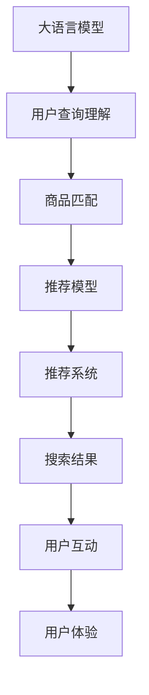

                 

# 电商平台的AI 大模型实践：搜索推荐系统是核心，数据质量是关键，用户体验是重点

## 1. 背景介绍

随着人工智能技术的飞速发展，越来越多的电商平台开始利用AI技术来提升用户体验，优化购物流程，增强盈利能力。其中，大语言模型和推荐系统的结合，为电商平台带来了革命性的变革。本文将从搜索推荐系统的核心作用、数据质量的关键地位以及用户体验的重心所在三个方面，系统介绍AI大模型在电商平台的应用实践。

## 2. 核心概念与联系

### 2.1 核心概念概述

为更好地理解大模型在电商平台的搜索推荐系统中的应用，本节将介绍几个关键概念：

- **大语言模型**：指基于Transformer等架构的深度学习模型，通过大规模数据训练获得强大的语言理解能力，能够从文本中提取有价值的信息。
- **搜索推荐系统**：指利用算法将用户查询与商品信息进行匹配，推荐最适合用户需求的商品。其核心在于用户意图理解、商品匹配和个性化推荐。
- **数据质量**：指数据的完整性、准确性和时效性。在推荐系统中，高质量的数据是模型能够准确预测用户行为的基础。
- **用户体验**：指用户在使用电商平台时的感受和满意度，是衡量电商系统成功与否的重要指标。
- **性能评估指标**：包括点击率(CTR)、转化率(CVR)、满意度评分等，是评估推荐系统效果的关键指标。

### 2.2 核心概念联系与架构

这些核心概念之间有着密切的联系，共同构成了电商平台AI推荐系统的工作框架。通过大语言模型进行用户查询理解，提取查询中的关键信息，再结合商品属性和用户行为数据，构建推荐模型，最终通过推荐系统为不同用户提供个性化的搜索结果和推荐商品。

以下Mermaid流程图展示了这些核心概念之间的联系：



其中，大语言模型在B阶段，结合用户查询，理解用户的意图，提取查询中的关键信息，并进行初步的商品匹配。推荐模型在D阶段，基于商品匹配结果和用户行为数据，生成推荐列表。推荐系统E利用推荐模型输出的结果，为用户展示个性化搜索结果和商品推荐。用户通过G阶段的互动，影响其H阶段的用户体验。

## 3. 核心算法原理 & 具体操作步骤
### 3.1 算法原理概述

电商平台的搜索推荐系统主要基于以下算法原理：

1. **用户意图理解**：使用大语言模型对用户查询进行自然语言处理，理解用户意图，提取关键信息，如商品类别、价格区间、品牌偏好等。
2. **商品匹配**：基于用户意图和商品属性（如类别、品牌、价格等），构建匹配模型，判断商品是否符合用户需求。
3. **推荐模型训练**：结合历史用户行为数据（如点击、浏览、购买记录等），训练推荐模型，学习用户偏好的商品特征。
4. **个性化推荐**：利用推荐模型输出推荐结果，并结合用户体验反馈，不断优化推荐策略，提升用户体验。

### 3.2 算法步骤详解

电商平台的搜索推荐系统通常包括以下关键步骤：

**Step 1: 数据收集与预处理**

- 收集用户查询数据、商品属性数据、用户行为数据。
- 对数据进行清洗、去重、补全等预处理，保证数据质量。

**Step 2: 大语言模型训练**

- 选择合适的预训练语言模型，如BERT、GPT等，进行微调。
- 利用用户查询数据，对模型进行训练，使其能够理解用户意图。

**Step 3: 商品匹配模型构建**

- 基于用户查询和商品属性，构建匹配模型，如向量空间模型、协同过滤等。
- 对匹配模型进行训练，提升匹配准确度。

**Step 4: 推荐模型训练**

- 基于用户行为数据，选择合适的算法（如深度神经网络、矩阵分解等）训练推荐模型。
- 优化推荐模型参数，提升推荐精度。

**Step 5: 推荐系统部署**

- 将训练好的推荐模型部署到生产环境，与搜索系统集成。
- 实时响应用户查询，返回个性化推荐结果。

### 3.3 算法优缺点

电商平台的搜索推荐系统基于大语言模型的微调，具有以下优点：

1. **高效准确**：大语言模型能够高效处理自然语言，提取关键信息，提高匹配和推荐准确度。
2. **可解释性**：基于深度学习的模型具备可解释性，便于调试和优化。
3. **灵活性**：可以动态调整推荐策略，适应不同用户和场景。

同时，该方法也存在一定的局限性：

1. **数据依赖**：对标注数据的需求较高，标注成本较大。
2. **模型复杂**：大规模语言模型的参数较多，训练和推理复杂度高。
3. **泛化能力**：模型对新用户的泛化能力有限，初期需要较多标注数据。

### 3.4 算法应用领域

电商平台的搜索推荐系统主要应用于以下领域：

- **个性化推荐**：根据用户历史行为，推荐相关商品。
- **搜索排序**：基于用户查询和商品匹配结果，对搜索结果进行排序。
- **广告投放**：推荐系统可以帮助广告主进行精准投放，提升广告效果。
- **用户行为分析**：通过分析用户行为数据，洞察用户需求，优化商品推荐策略。

## 4. 数学模型和公式 & 详细讲解

### 4.1 数学模型构建

电商平台的搜索推荐系统主要基于以下数学模型：

1. **用户意图理解模型**：
   - 使用自然语言处理模型，如BERT，对用户查询进行编码，生成向量表示。

2. **商品匹配模型**：
   - 使用向量空间模型或协同过滤模型，对用户查询和商品属性进行匹配，计算相似度。

3. **推荐模型**：
   - 使用协同过滤、矩阵分解、深度神经网络等算法，对用户行为数据进行建模，生成推荐结果。

### 4.2 公式推导过程

以协同过滤推荐模型为例，推导其基本公式。

假设用户 $u$ 的兴趣向量为 $\mathbf{u}$，商品 $i$ 的特征向量为 $\mathbf{v}_i$，用户 $u$ 对商品 $i$ 的评分 $r_{ui}$ 可以表示为：

$$
r_{ui} = \mathbf{u} \cdot \mathbf{v}_i
$$

其中 $\cdot$ 表示向量点积，$\mathbf{u}$ 和 $\mathbf{v}_i$ 的维度应相同，通常为用户和商品的特征维度。

推荐结果 $R_u$ 可以表示为：

$$
R_u = \operatorname{softmax}\left(\left\{e^{\mathbf{u} \cdot \mathbf{v}_i}\right\}_{i=1}^{N}\right)
$$

其中 $\operatorname{softmax}$ 函数用于将得分归一化，保证输出概率和为1。

### 4.3 案例分析与讲解

以用户推荐系统为例，假设用户 $u$ 的兴趣向量为 $\mathbf{u}$，商品 $i$ 的特征向量为 $\mathbf{v}_i$，模型输出 $R_u$ 中 $i$ 的概率最高，表示用户对商品 $i$ 最感兴趣。在训练过程中，通过最大化预测误差，调整模型参数，使推荐结果更接近真实评分。

## 5. 项目实践：代码实例和详细解释说明

### 5.1 开发环境搭建

在进行搜索推荐系统开发前，我们需要准备好开发环境。以下是使用Python进行TensorFlow开发的环境配置流程：

1. 安装Anaconda：从官网下载并安装Anaconda，用于创建独立的Python环境。

2. 创建并激活虚拟环境：
```bash
conda create -n tf-env python=3.8 
conda activate tf-env
```

3. 安装TensorFlow：根据CUDA版本，从官网获取对应的安装命令。例如：
```bash
conda install tensorflow -c tf -c conda-forge
```

4. 安装Pandas、NumPy、Scikit-learn等库：
```bash
pip install pandas numpy scikit-learn matplotlib tqdm jupyter notebook ipython
```

完成上述步骤后，即可在`tf-env`环境中开始搜索推荐系统开发。

### 5.2 源代码详细实现

我们以协同过滤推荐系统为例，给出使用TensorFlow和Keras进行开发的PyTorch代码实现。

首先，定义协同过滤模型：

```python
import tensorflow as tf
from tensorflow.keras.layers import Embedding, DotProduct

# 用户兴趣向量和商品特征向量维度
num_users = 10000
num_items = 1000

# 用户-商品评分矩阵
ratings = tf.random.normal([num_users, num_items])

# 构建协同过滤模型
model = tf.keras.Sequential([
    Embedding(num_users, 10, input_length=1, mask_zero=True),
    Embedding(num_items, 10, input_length=1, mask_zero=True),
    DotProduct(),
    tf.keras.layers.Activation('softmax')
])
```

接着，定义优化器和损失函数：

```python
optimizer = tf.keras.optimizers.Adam(learning_rate=0.01)
loss_fn = tf.keras.losses.CategoricalCrossentropy()
```

然后，训练模型：

```python
# 将评分矩阵转换成独热编码
one_hot_ratings = tf.one_hot(tf.reshape(ratings, [-1, 1]), depth=num_items)

# 定义损失函数和优化器
model.compile(optimizer=optimizer, loss=loss_fn)

# 训练模型
model.fit(x=ratings, y=one_hot_ratings, epochs=10, batch_size=16)
```

最后，使用模型进行推荐：

```python
# 构建新的用户和商品向量
user_vector = tf.keras.preprocessing.sequence.pad_sequences([1, 0, 0, 0, 0, 0, 0, 0, 0, 0], maxlen=10, padding='post', value=0)
item_vectors = tf.keras.preprocessing.sequence.pad_sequences([1, 1, 1, 1, 1, 0, 0, 0, 0, 0], maxlen=10, padding='post', value=0)

# 进行推荐
predictions = model.predict([user_vector, item_vectors])
print(predictions)
```

以上就是使用TensorFlow和Keras进行协同过滤推荐系统开发的完整代码实现。可以看到，TensorFlow的Keras API使模型的构建和训练变得非常简洁高效。

### 5.3 代码解读与分析

让我们再详细解读一下关键代码的实现细节：

**协同过滤模型**：
- 利用Embedding层将用户和商品向量编码为固定长度的向量。
- 使用DotProduct层计算向量点积，得到推荐得分。
- 通过softmax函数归一化得分，得到推荐概率。

**训练过程**：
- 将评分矩阵转换为独热编码形式，用于训练模型。
- 使用Adam优化器和分类交叉熵损失函数，进行模型训练。
- 重复训练过程，直至模型收敛。

**推荐过程**：
- 构建新的用户和商品向量，作为模型输入。
- 使用训练好的模型进行预测，输出推荐得分。

可以看到，TensorFlow的Keras API使得协同过滤推荐系统的代码实现非常简洁高效，开发者可以将更多精力放在模型优化和参数调优等核心逻辑上。

当然，工业级的系统实现还需考虑更多因素，如模型的保存和部署、超参数的自动搜索、更灵活的任务适配层等。但核心的推荐范式基本与此类似。

## 6. 实际应用场景

### 6.1 个性化推荐

电商平台的个性化推荐系统通过大语言模型和推荐算法，为用户推荐感兴趣的商品。用户通过查看推荐商品，进行购买或进一步探索，提升平台的转化率和用户黏性。

在技术实现上，可以收集用户浏览、点击、购买等行为数据，利用大语言模型进行用户意图理解，再结合协同过滤等推荐算法，生成个性化推荐结果。推荐系统可以根据用户反馈，不断优化推荐策略，提升推荐精度。

### 6.2 搜索排序

电商平台的搜索系统通过大语言模型进行用户查询理解，提取关键信息，再结合商品匹配结果，对搜索结果进行排序。排序结果不仅基于商品评分，还考虑用户行为、地理位置、时间等多种因素，以提升搜索相关性和用户体验。

在技术实现上，可以基于大语言模型进行查询理解，提取关键词、类别等信息，再结合商品匹配结果和用户行为数据，构建排序模型。排序模型可以采用基于排序算法的推荐系统，如基于排序的协同过滤等，提升搜索排序的准确性。

### 6.3 广告投放

电商平台的广告投放系统可以通过大语言模型和推荐算法，精准投放广告，提升广告效果和用户转化率。广告投放系统可以根据用户行为和兴趣，生成个性化广告内容，以提高用户点击率。

在技术实现上，可以基于大语言模型进行广告内容生成，结合用户行为数据，利用推荐算法进行精准投放。广告投放系统可以根据投放效果，不断优化投放策略，提升广告效果。

### 6.4 未来应用展望

随着大语言模型和推荐系统的不断发展，电商平台的应用场景将进一步扩展，为用户带来更智能、更个性化的购物体验。

在未来，大语言模型和推荐系统的结合将更加紧密，可以应用于以下领域：

- **跨域推荐**：结合不同平台的数据，进行跨域商品推荐，提升推荐精度。
- **实时推荐**：结合实时数据，进行动态推荐，提升用户体验。
- **内容推荐**：结合商品信息、用户行为和内容数据，进行多模态推荐，提升推荐质量。
- **知识图谱推荐**：结合知识图谱，进行商品关联推荐，提升推荐相关性。

## 7. 工具和资源推荐

### 7.1 学习资源推荐

为了帮助开发者系统掌握大语言模型和推荐系统的理论基础和实践技巧，这里推荐一些优质的学习资源：

1. **《深度学习》课程**：斯坦福大学开设的深度学习课程，详细介绍了深度学习的基本原理和算法，是了解大语言模型和推荐系统的基础。

2. **TensorFlow官方文档**：TensorFlow的官方文档，提供了丰富的教程和样例代码，是TensorFlow应用的必备资料。

3. **Keras官方文档**：Keras的官方文档，提供了详细的API说明和样例代码，是使用Keras进行模型开发的必备资料。

4. **《推荐系统》书籍**：详细介绍了推荐系统的理论基础和算法实现，包括协同过滤、基于矩阵分解的推荐算法等。

5. **在线课程**：Coursera、Udacity等在线平台提供了丰富的深度学习和推荐系统课程，适合系统学习。

通过学习这些资源，相信你一定能够快速掌握大语言模型和推荐系统的精髓，并用于解决实际的电商平台问题。

### 7.2 开发工具推荐

高效的开发离不开优秀的工具支持。以下是几款用于电商平台推荐系统开发的常用工具：

1. **TensorFlow**：由Google主导开发的开源深度学习框架，生产部署方便，适合大规模工程应用。
2. **Keras**：基于TensorFlow的高级API，使用简洁高效，适合快速原型开发。
3. **Pandas**：数据处理库，用于数据清洗、特征工程等预处理工作。
4. **NumPy**：科学计算库，用于高效的矩阵运算和数据处理。
5. **Scikit-learn**：机器学习库，提供了丰富的算法和工具。
6. **Jupyter Notebook**：交互式编程环境，适合快速迭代和实验。

合理利用这些工具，可以显著提升电商平台推荐系统的开发效率，加快创新迭代的步伐。

### 7.3 相关论文推荐

大语言模型和推荐系统的发展源于学界的持续研究。以下是几篇奠基性的相关论文，推荐阅读：

1. **DeepFM: A Neural Network Architecture for Recommender Systems**：提出了DeepFM模型，将深度学习和FM算法结合，提升推荐系统的精度。

2. **Recurrent Deep Neural Networks for Recommender Systems**：介绍了基于循环神经网络的推荐系统，结合用户行为数据，提升推荐精度。

3. **Structural Deep Embedding for Recommender Systems**：提出了Structural Deep Embedding模型，结合商品关系结构，提升推荐相关性。

4. **Multimodal Recommendation with Context-aware Interpolation**：介绍了多模态推荐系统，结合商品图片、用户兴趣等多模态数据，提升推荐质量。

5. **A Note on Deep Learning and Recommender Systems**：回顾了深度学习在推荐系统中的应用，提出了多种深度学习架构，如基于注意力机制的推荐系统等。

这些论文代表了大语言模型和推荐系统的发展脉络。通过学习这些前沿成果，可以帮助研究者把握学科前进方向，激发更多的创新灵感。

## 8. 总结：未来发展趋势与挑战

### 8.1 总结

本文对电商平台的搜索推荐系统进行了全面系统的介绍。首先阐述了搜索推荐系统在大语言模型中的应用背景，明确了其在电商平台中的核心作用。其次，从算法原理到具体操作步骤，详细讲解了搜索推荐系统的数学模型和实现方法。最后，探讨了搜索推荐系统在电商平台的实际应用场景，并展望了未来的发展趋势。

通过本文的系统梳理，可以看到，搜索推荐系统在大语言模型和推荐算法的支持下，正在成为电商平台的重要引擎，极大地提升用户体验和盈利能力。未来，伴随大语言模型和推荐系统的持续演进，电商平台的推荐系统将更加智能、高效，为消费者带来更优质的购物体验。

### 8.2 未来发展趋势

展望未来，电商平台的搜索推荐系统将呈现以下几个发展趋势：

1. **智能推荐**：结合深度学习和AI技术，实时生成个性化的推荐结果，提升用户体验。
2. **跨域推荐**：结合多平台数据，进行跨域推荐，提升推荐精度。
3. **实时推荐**：结合实时数据，进行动态推荐，提升推荐相关性。
4. **多模态推荐**：结合商品信息、用户行为和内容数据，进行多模态推荐，提升推荐质量。
5. **知识图谱推荐**：结合知识图谱，进行商品关联推荐，提升推荐相关性。

以上趋势凸显了搜索推荐系统在大语言模型和推荐算法支持下的广阔前景。这些方向的探索发展，必将进一步提升电商平台的推荐系统精度和效率，为用户带来更智能、个性化的购物体验。

### 8.3 面临的挑战

尽管搜索推荐系统在大语言模型和推荐算法的支持下，已经取得了显著效果，但在迈向更加智能化、普适化应用的过程中，仍面临诸多挑战：

1. **数据质量和标注成本**：高质量的数据是推荐系统的前提，但数据标注成本高，难以获取大规模标注数据。如何降低标注成本，提高数据质量，是一大难题。

2. **模型复杂度和计算资源**：大语言模型和推荐系统模型复杂度高，训练和推理计算量大，对硬件资源要求高。如何优化模型结构，提高计算效率，是需要持续攻克的难题。

3. **用户隐私保护**：电商平台上涉及大量用户隐私数据，如何保护用户隐私，防止数据泄露，是推荐系统设计中的重要问题。

4. **推荐系统公平性**：推荐系统可能存在偏见，影响部分用户的推荐结果。如何保证推荐系统的公平性，是一个亟待解决的问题。

5. **跨域推荐问题**：不同平台的数据结构和用户行为不同，跨域推荐系统需要处理多种数据格式，提升推荐精度，是一个具有挑战性的问题。

6. **实时性要求**：电商平台的推荐系统需要实时响应用户查询，响应时间对用户体验至关重要。如何提升推荐系统的实时性，是另一个重要问题。

### 8.4 研究展望

面对搜索推荐系统面临的挑战，未来的研究需要在以下几个方面寻求新的突破：

1. **无监督和半监督推荐方法**：探索无监督和半监督推荐方法，降低对标注数据的依赖，提高推荐系统的泛化能力。

2. **推荐系统公平性和隐私保护**：研究推荐系统的公平性和隐私保护问题，确保推荐系统对所有用户公平，保护用户隐私。

3. **实时推荐系统**：优化推荐系统的实时性，提升推荐系统的响应速度，确保用户获得及时、准确的推荐结果。

4. **跨域推荐系统**：研究跨域推荐系统，处理多种数据格式，提升跨域推荐的精度和效果。

5. **多模态推荐系统**：结合商品信息、用户行为和内容数据，进行多模态推荐，提升推荐质量。

6. **深度学习与推荐系统的结合**：探索深度学习与推荐系统的结合，提升推荐系统的精度和效率。

这些研究方向将推动搜索推荐系统向更加智能化、普适化、公平化的方向发展，为电商平台带来更优质的用户购物体验。

## 9. 附录：常见问题与解答

**Q1：如何降低推荐系统的标注成本？**

A: 降低推荐系统的标注成本，可以通过以下方法：

1. **半监督学习**：结合少量标注数据和大量未标注数据，利用半监督学习算法，提升推荐系统性能。
2. **自监督学习**：利用无标注数据，利用自监督学习算法，学习推荐系统模型。
3. **弱监督学习**：结合少量标注数据和弱监督信号（如点击行为），利用弱监督学习算法，提升推荐系统性能。

这些方法可以在一定程度上降低推荐系统的标注成本，提高推荐系统的泛化能力。

**Q2：如何提升推荐系统的实时性？**

A: 提升推荐系统的实时性，可以通过以下方法：

1. **缓存技术**：利用缓存技术，将热门商品和推荐结果缓存，减少查询响应时间。
2. **分布式计算**：利用分布式计算技术，将推荐系统分布在多个节点上，提升计算速度。
3. **轻量级模型**：使用轻量级推荐模型，减小模型规模，提高计算效率。
4. **增量训练**：利用增量训练技术，实时更新推荐模型，提升推荐效果。

这些方法可以在一定程度上提升推荐系统的实时性，提升用户体验。

**Q3：如何确保推荐系统的公平性？**

A: 确保推荐系统的公平性，可以通过以下方法：

1. **数据清洗**：在数据预处理阶段，清洗数据中的偏见信息，保证数据公平性。
2. **算法优化**：在算法设计阶段，引入公平性约束，保证推荐系统的公平性。
3. **用户反馈**：在用户反馈阶段，收集用户反馈，调整推荐策略，提升推荐公平性。
4. **模型监控**：在模型部署阶段，监控推荐系统的表现，及时发现并纠正偏见问题。

这些方法可以在一定程度上确保推荐系统的公平性，提升用户满意度。

**Q4：如何保护用户隐私？**

A: 保护用户隐私，可以通过以下方法：

1. **数据匿名化**：在数据预处理阶段，对数据进行匿名化处理，保护用户隐私。
2. **加密技术**：在数据传输阶段，利用加密技术，保护数据传输安全。
3. **访问控制**：在数据存储阶段，利用访问控制技术，限制数据访问权限。
4. **差分隐私**：在数据分析阶段，利用差分隐私技术，保护用户隐私。

这些方法可以在一定程度上保护用户隐私，保障用户数据安全。

---

作者：禅与计算机程序设计艺术 / Zen and the Art of Computer Programming

