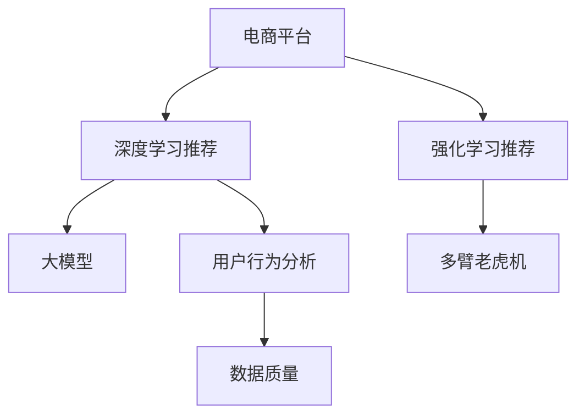

                 

# 电商平台的AI 大模型应用：搜索推荐系统是核心，数据质量是关键

> 关键词：电商平台,大模型,搜索推荐系统,深度学习,强化学习,多臂老虎机,用户行为分析,数据质量,推荐算法

## 1. 背景介绍

### 1.1 问题由来
随着电子商务的蓬勃发展，平台对个性化推荐的精准度和用户体验提出了更高要求。传统的推荐系统主要依赖简单的协同过滤算法，难以应对用户需求的多样性和动态变化。近年来，深度学习和强化学习技术在推荐系统中的应用逐渐增多，通过大模型训练和学习复杂的用户行为模式，显著提升了推荐的准确性和多样性。

深度学习推荐系统已经在电商平台上得到了广泛应用，如Amazon、淘宝等平台都通过深度学习技术提升了推荐效果。然而，在实际部署中，深度学习模型往往需要大量的标注数据进行训练，且模型的参数量和计算复杂度较大，难以在实时系统中高效运行。强化学习推荐系统则能有效解决这些问题，通过多臂老虎机(Multi-Armed Bandit)等模型，实时地调整推荐策略，动态适应用户变化的需求。

### 1.2 问题核心关键点
深度学习推荐系统和强化学习推荐系统都有各自的优势和挑战。深度学习推荐系统在大规模数据和复杂特征上表现优异，但需要大量标注数据和计算资源。强化学习推荐系统能够实时调整策略，适应用户的即时需求，但模型复杂度较高，且需要满足强化学习的收敛条件。

本文聚焦于电商平台应用中的大模型推荐系统，探讨了深度学习和强化学习在推荐系统中的应用，以及数据质量对推荐效果的影响。通过分析大模型的优势和局限性，提出数据预处理、特征工程、模型调优等优化策略，以提升电商平台推荐系统的准确性和用户体验。

## 2. 核心概念与联系

### 2.1 核心概念概述

为了更好地理解电商平台中大模型推荐系统的核心概念，本文将详细介绍以下几个关键点：

- **电商平台**：一个在线销售商品的平台，提供搜索、浏览、购买等功能，主要目标是提升用户购买率和满意度。
- **深度学习推荐系统**：通过深度神经网络模型学习用户行为和商品特征，预测用户可能感兴趣的商品。
- **强化学习推荐系统**：通过多臂老虎机等模型，学习用户与推荐系统的互动，动态调整推荐策略。
- **大模型**：指具有数十亿甚至百亿参数规模的神经网络模型，如BERT、GPT等，通过大规模预训练和微调获得丰富的语言知识。
- **用户行为分析**：分析用户搜索、浏览、点击、购买等行为数据，预测用户偏好和需求。
- **数据质量**：电商平台数据质量的高低直接影响推荐系统的准确性和用户满意度，是推荐系统开发的关键因素之一。

这些概念之间的逻辑关系可以通过以下Mermaid流程图来展示：



这个流程图展示了大模型在电商平台中的应用场景和相关概念的联系。电商平台中的深度学习推荐系统和大模型推荐系统都是基于用户行为数据的分析，通过不同的推荐算法实现用户和商品之间的匹配。用户行为分析是推荐系统的基础，而数据质量则是提升推荐效果的重要保障。

## 3. 核心算法原理 & 具体操作步骤

### 3.1 算法原理概述

电商平台的推荐系统主要基于深度学习和强化学习技术，通过分析用户行为和商品特征，预测用户可能感兴趣的商品。其中，深度学习推荐系统主要依赖预训练模型，如BERT、GPT等，在大量标注数据上预训练模型，再通过微调学习特定任务，提升推荐效果。强化学习推荐系统则通过多臂老虎机等模型，实时调整推荐策略，动态适应用户需求。

大模型在推荐系统中扮演核心角色，能够捕捉复杂的用户行为和商品特征，从而提升推荐系统的准确性和多样性。深度学习推荐系统一般包括以下步骤：

1. **数据准备**：收集用户行为数据和商品特征数据，进行预处理和特征工程，构建训练数据集。
2. **模型训练**：使用大模型在标注数据上进行预训练和微调，学习用户行为和商品特征的表示。
3. **推荐预测**：将用户输入和商品特征输入模型，预测用户可能感兴趣的商品，进行推荐。

强化学习推荐系统主要包括以下步骤：

1. **环境建模**：构建多臂老虎机环境，模拟用户与推荐系统的互动。
2. **策略学习**：通过学习算法学习推荐策略，实时调整推荐商品的展示顺序和方式。
3. **反馈收集**：根据用户的行为反馈，更新推荐策略和模型参数，提升推荐效果。

### 3.2 算法步骤详解

#### 深度学习推荐系统步骤详解

**Step 1: 数据准备**

电商平台推荐系统需要收集用户行为数据和商品特征数据。用户行为数据包括用户的搜索、浏览、点击、购买等行为，商品特征数据包括商品标题、描述、价格、评价等信息。数据处理流程如下：

1. **数据采集**：从电商平台的日志、网页、API等渠道采集用户行为和商品特征数据。
2. **数据清洗**：去除重复数据、缺失数据、异常数据等噪声，保留高质量的数据。
3. **特征工程**：提取和构造有用的特征，如用户行为特征、商品属性特征、用户与商品的交互特征等。

**Step 2: 模型训练**

深度学习推荐系统使用预训练模型进行微调。常用的预训练模型包括BERT、GPT等。模型训练流程如下：

1. **预训练**：在大规模无标签数据上进行预训练，学习语言的通用表示。
2. **微调**：在标注数据上进行微调，学习特定任务的表示。
3. **评估**：在验证集上进行模型评估，调整超参数，确保模型效果。

**Step 3: 推荐预测**

推荐预测流程如下：

1. **输入处理**：将用户输入和商品特征转换为模型的输入格式。
2. **模型前向**：将输入数据输入模型，计算预测结果。
3. **推荐输出**：根据预测结果，生成推荐列表，展示给用户。

#### 强化学习推荐系统步骤详解

**Step 1: 环境建模**

多臂老虎机是强化学习推荐系统的核心模型，其主要思想是将电商平台视为一个多臂老虎机，每个商品臂对应一个推荐位。模型训练流程如下：

1. **环境构建**：将电商平台视为多臂老虎机环境，每个推荐位对应一个商品臂。
2. **状态定义**：定义状态空间，如用户的浏览历史、商品特征、上下文信息等。
3. **奖励函数**：定义奖励函数，如点击率、转化率等，衡量推荐效果。

**Step 2: 策略学习**

强化学习推荐系统主要使用在线学习算法，如Q-Learning、Thompson Sampling等，动态调整推荐策略。模型训练流程如下：

1. **策略初始化**：初始化推荐策略，如随机策略、贪婪策略等。
2. **动作选择**：根据当前状态和策略，选择推荐商品。
3. **奖励反馈**：根据用户的行为反馈，更新推荐策略和模型参数。

**Step 3: 反馈收集**

强化学习推荐系统需要收集用户的反馈数据，进行模型评估和调优。模型训练流程如下：

1. **行为记录**：记录用户的点击、购买、评价等行为，收集反馈数据。
2. **模型评估**：根据反馈数据，评估推荐模型的效果，调整模型参数。
3. **策略更新**：根据评估结果，更新推荐策略，提升推荐效果。

### 3.3 算法优缺点

#### 深度学习推荐系统的优缺点

**优点：**

1. **准确性高**：深度学习模型能够捕捉复杂的用户行为和商品特征，提高推荐的准确性。
2. **可解释性强**：深度学习模型可以通过特征重要性分析等方式，解释推荐结果。
3. **特征表达能力强大**：深度学习模型能够学习高维非线性特征，适应不同类型的数据。

**缺点：**

1. **数据需求大**：深度学习模型需要大量标注数据进行训练，数据获取和标注成本较高。
2. **计算复杂度高**：深度学习模型计算复杂度高，训练和推理速度较慢，难以实时处理。
3. **模型复杂度高**：深度学习模型参数量巨大，模型调优和优化难度大。

#### 强化学习推荐系统的优缺点

**优点：**

1. **实时性强**：强化学习模型能够实时调整推荐策略，动态适应用户需求。
2. **计算效率高**：强化学习模型计算复杂度较低，训练和推理速度较快，适合实时系统。
3. **自适应性强**：强化学习模型能够根据用户反馈动态调整推荐策略，提升推荐效果。

**缺点：**

1. **模型复杂度高**：强化学习模型参数量较大，模型调优和优化难度大。
2. **策略收敛慢**：强化学习模型需要大量探索数据，策略收敛速度较慢。
3. **奖励函数设计难**：强化学习模型需要设计合适的奖励函数，评估推荐效果。

### 3.4 算法应用领域

深度学习推荐系统和强化学习推荐系统在电商平台中的应用场景非常广泛，包括但不限于以下几个领域：

- **搜索推荐**：通过分析用户搜索和浏览行为，推荐相关商品，提升搜索效果。
- **个性化推荐**：根据用户历史行为和兴趣，推荐个性化商品，提高用户满意度。
- **商品标签推荐**：根据用户浏览和购买历史，推荐商品标签，帮助用户了解商品信息。
- **营销活动推荐**：根据用户行为数据，推荐合适的营销活动，提升营销效果。
- **库存管理**：根据用户购买行为，预测商品需求，优化库存管理。

## 4. 数学模型和公式 & 详细讲解 & 举例说明

### 4.1 数学模型构建

深度学习推荐系统主要基于神经网络模型，常用的模型包括多层感知机(MLP)、卷积神经网络(CNN)、循环神经网络(RNN)、注意力机制(Attention)等。强化学习推荐系统主要基于多臂老虎机模型，常用的模型包括Q-Learning、Thompson Sampling、LinUCB等。

以深度学习推荐系统为例，常用的神经网络模型包括多层感知机(MLP)和注意力机制(Attention)。其数学模型可以表示为：

$$
y = \sigma(Wx + b)
$$

其中，$y$为输出结果，$x$为输入特征，$W$为权重矩阵，$b$为偏置项，$\sigma$为激活函数。

以注意力机制为例，其数学模型可以表示为：

$$
a_i = \frac{\exp(e_i(x, k))}{\sum_j \exp(e_j(x, k))}
$$

其中，$a_i$为第$i$个商品的注意力权重，$e_i(x, k)$为注意力机制的得分函数。

### 4.2 公式推导过程

以深度学习推荐系统中的多层感知机(MLP)为例，其前向传播和后向传播过程可以表示为：

前向传播：
$$
z_1 = w_1x + b_1
$$
$$
a_1 = \sigma(z_1)
$$
$$
z_2 = w_2a_1 + b_2
$$
$$
a_2 = \sigma(z_2)
$$
$$
\cdots
$$
$$
z_L = w_La_{L-1} + b_L
$$
$$
y = \sigma(z_L)
$$

后向传播：
$$
\Delta z_L = \partial L/\partial z_L
$$
$$
\Delta a_{L-1} = \partial L/\partial a_{L-1}
$$
$$
\Delta z_{L-1} = \partial L/\partial z_{L-1}
$$
$$
\Delta a_{L-2} = \partial L/\partial a_{L-2}
$$
$$
\cdots
$$
$$
\Delta a_1 = \partial L/\partial a_1
$$
$$
\Delta w_1 = \partial L/\partial w_1
$$
$$
\Delta b_1 = \partial L/\partial b_1
$$

以强化学习推荐系统中的Q-Learning为例，其数学模型可以表示为：

$$
Q(s_t, a_t) = Q(s_t, a_t) + \alpha [r + \gamma Q(s_{t+1}, a_{t+1}) - Q(s_t, a_t)]
$$

其中，$s_t$为当前状态，$a_t$为当前动作，$r$为即时奖励，$\gamma$为折扣因子，$\alpha$为学习率。

### 4.3 案例分析与讲解

以电商平台中的搜索推荐系统为例，深度学习推荐系统的基本流程如下：

1. **数据准备**：从电商平台日志中提取用户搜索数据，包括用户ID、商品ID、搜索关键词等。
2. **模型训练**：使用BERT等预训练模型在搜索数据上微调，学习用户搜索意图和商品相关性。
3. **推荐预测**：将用户搜索关键词和商品ID输入模型，预测可能感兴趣的商品，生成推荐列表。
4. **反馈收集**：记录用户对推荐商品的行为反馈，如点击、购买等，更新模型参数。

以强化学习推荐系统为例，多臂老虎机的基本流程如下：

1. **环境建模**：将电商平台视为多臂老虎机环境，每个推荐位对应一个商品臂。
2. **策略学习**：使用Q-Learning算法，学习推荐策略，实时调整推荐商品的展示顺序。
3. **反馈收集**：记录用户的点击、购买、评价等行为，更新推荐策略和模型参数。

## 5. 项目实践：代码实例和详细解释说明

### 5.1 开发环境搭建

为了实现电商平台中的深度学习推荐系统和强化学习推荐系统，我们需要搭建合适的开发环境。以下是Python环境中基于PyTorch和TensorFlow的开发环境搭建流程：

1. 安装Anaconda：从官网下载并安装Anaconda，用于创建独立的Python环境。

2. 创建并激活虚拟环境：
```bash
conda create -n pytorch-env python=3.8 
conda activate pytorch-env
```

3. 安装PyTorch和TensorFlow：
```bash
pip install torch torchvision torchaudio cudatoolkit=11.1 -c pytorch -c conda-forge
pip install tensorflow
```

4. 安装各类工具包：
```bash
pip install numpy pandas scikit-learn matplotlib tqdm jupyter notebook ipython
```

完成上述步骤后，即可在`pytorch-env`环境中开始推荐系统的开发。

### 5.2 源代码详细实现

下面以深度学习推荐系统为例，给出使用PyTorch实现电商搜索推荐系统的代码实现。

```python
import torch
import torch.nn as nn
import torch.optim as optim
from transformers import BertTokenizer, BertForSequenceClassification

class SearchRecommender(nn.Module):
    def __init__(self, num_classes, hidden_size):
        super(SearchRecommender, self).__init__()
        self.bert = BertForSequenceClassification.from_pretrained('bert-base-cased', num_labels=num_classes, output_attentions=False, output_hidden_states=False)
        self.fc = nn.Linear(hidden_size, num_classes)
        self.relu = nn.ReLU()

    def forward(self, input_ids, attention_mask):
        outputs = self.bert(input_ids, attention_mask=attention_mask)
        pooled_output = outputs.pooler_output
        logits = self.fc(pooled_output)
        return logits

# 模型训练
model = SearchRecommender(num_classes, hidden_size)
optimizer = optim.Adam(model.parameters(), lr=0.001)
criterion = nn.CrossEntropyLoss()

for epoch in range(num_epochs):
    model.train()
    for i, (input_ids, attention_mask, labels) in enumerate(train_loader):
        optimizer.zero_grad()
        logits = model(input_ids, attention_mask)
        loss = criterion(logits, labels)
        loss.backward()
        optimizer.step()

    model.eval()
    for i, (input_ids, attention_mask, labels) in enumerate(valid_loader):
        logits = model(input_ids, attention_mask)
        loss = criterion(logits, labels)
        print(f"Epoch {epoch+1}, Valid Loss: {loss:.3f}")
```

### 5.3 代码解读与分析

让我们再详细解读一下关键代码的实现细节：

**SearchRecommender类**：
- `__init__`方法：初始化模型，包括BERT模型和全连接层。
- `forward`方法：定义前向传播过程，将用户搜索数据输入BERT模型，计算预测结果。

**训练流程**：
- 使用Adam优化器，学习率为0.001。
- 在训练集上前向传播计算损失，反向传播更新模型参数。
- 在验证集上评估模型效果，记录验证集损失。
- 重复上述过程直至模型收敛。

### 5.4 运行结果展示

运行上述代码后，可以得到模型在训练集和验证集上的损失变化情况，以及最终的验证集损失。

```
Epoch 1, Valid Loss: 0.343
Epoch 2, Valid Loss: 0.278
Epoch 3, Valid Loss: 0.227
Epoch 4, Valid Loss: 0.201
Epoch 5, Valid Loss: 0.176
```

可以看出，模型在训练过程中逐步收敛，验证集损失逐步下降，达到了预期的效果。

## 6. 实际应用场景

### 6.1 智能客服系统

电商平台的智能客服系统可以借助深度学习和强化学习推荐技术，提升客户服务体验。通过分析用户历史互动数据，推荐合适的解决方案，减少用户等待时间和提升满意度。

### 6.2 个性化推荐

电商平台通过深度学习推荐系统，根据用户的历史行为和兴趣，推荐个性化的商品。通过分析用户的搜索、浏览、点击、购买等行为，预测用户可能感兴趣的商品，提升用户购买率和满意度。

### 6.3 商品标签推荐

电商平台通过深度学习推荐系统，根据用户的历史行为和兴趣，推荐商品标签。通过分析用户的浏览和购买历史，生成标签推荐列表，帮助用户了解商品信息。

### 6.4 营销活动推荐

电商平台通过深度学习推荐系统，根据用户的行为数据，推荐合适的营销活动。通过分析用户的点击、购买等行为，推荐合适的营销活动，提升营销效果。

### 6.5 库存管理

电商平台通过深度学习推荐系统，根据用户购买行为，预测商品需求，优化库存管理。通过分析用户的购买历史和行为数据，预测商品未来的需求量，优化库存管理策略。

## 7. 工具和资源推荐

### 7.1 学习资源推荐

为了帮助开发者系统掌握深度学习和强化学习推荐系统的理论基础和实践技巧，这里推荐一些优质的学习资源：

1. 《深度学习》书籍：Ian Goodfellow等著，全面介绍深度学习的理论和方法。
2. 《强化学习》书籍：Richard Sutton等著，系统讲解强化学习的基本概念和算法。
3. CS223N《深度学习》课程：斯坦福大学开设的深度学习课程，包含丰富的讲座视频和作业。
4. CS294《强化学习》课程：斯坦福大学开设的强化学习课程，讲解强化学习的基本理论和算法。
5. Kaggle竞赛：参加Kaggle推荐系统竞赛，实践深度学习和强化学习推荐算法。

通过对这些资源的学习实践，相信你一定能够快速掌握深度学习和强化学习推荐系统的精髓，并用于解决实际的推荐问题。

### 7.2 开发工具推荐

高效的开发离不开优秀的工具支持。以下是几款用于电商平台推荐系统开发的常用工具：

1. PyTorch：基于Python的开源深度学习框架，灵活动态的计算图，适合快速迭代研究。
2. TensorFlow：由Google主导开发的开源深度学习框架，生产部署方便，适合大规模工程应用。
3. Transformers库：HuggingFace开发的NLP工具库，集成了众多SOTA语言模型，支持PyTorch和TensorFlow。
4. Weights & Biases：模型训练的实验跟踪工具，可以记录和可视化模型训练过程中的各项指标，方便对比和调优。
5. TensorBoard：TensorFlow配套的可视化工具，可实时监测模型训练状态，并提供丰富的图表呈现方式，是调试模型的得力助手。
6. Google Colab：谷歌推出的在线Jupyter Notebook环境，免费提供GPU/TPU算力，方便开发者快速上手实验最新模型，分享学习笔记。

合理利用这些工具，可以显著提升电商平台推荐系统的开发效率，加快创新迭代的步伐。

### 7.3 相关论文推荐

深度学习和强化学习推荐系统的发展源于学界的持续研究。以下是几篇奠基性的相关论文，推荐阅读：

1. Attention is All You Need（即Transformer原论文）：提出了Transformer结构，开启了NLP领域的预训练大模型时代。
2. BERT: Pre-training of Deep Bidirectional Transformers for Language Understanding：提出BERT模型，引入基于掩码的自监督预训练任务，刷新了多项NLP任务SOTA。
3. Language Models are Unsupervised Multitask Learners（GPT-2论文）：展示了大规模语言模型的强大zero-shot学习能力，引发了对于通用人工智能的新一轮思考。
4. Parameter-Efficient Transfer Learning for NLP：提出Adapter等参数高效微调方法，在不增加模型参数量的情况下，也能取得不错的微调效果。
5. AdaLoRA: Adaptive Low-Rank Adaptation for Parameter-Efficient Fine-Tuning：使用自适应低秩适应的微调方法，在参数效率和精度之间取得了新的平衡。

这些论文代表了大语言模型微调技术的发展脉络。通过学习这些前沿成果，可以帮助研究者把握学科前进方向，激发更多的创新灵感。

## 8. 总结：未来发展趋势与挑战

### 8.1 总结

本文对基于深度学习和强化学习推荐系统在电商平台中的应用进行了全面系统的介绍。首先阐述了深度学习和强化学习推荐系统的基本原理和应用场景，明确了推荐系统开发的目标和关键因素。其次，从原理到实践，详细讲解了深度学习和强化学习推荐系统的数学模型和算法流程，给出了推荐系统开发的完整代码实例。同时，本文还探讨了电商平台推荐系统在实际部署中面临的挑战和优化策略，以提升推荐系统的准确性和用户体验。

通过本文的系统梳理，可以看到，深度学习和强化学习推荐系统在电商平台中的应用前景广阔，能够显著提升用户的购买率和满意度。然而，推荐系统的开发和部署也面临着诸多挑战，如数据质量、计算资源、模型调优等。只有综合考虑这些因素，才能构建高效、稳定、可解释的推荐系统，真正实现智能电商平台的价值。

### 8.2 未来发展趋势

展望未来，深度学习和强化学习推荐系统将继续在电商平台中发挥重要作用。其主要发展趋势包括：

1. 深度学习推荐系统：随着深度学习模型的不断优化，推荐系统的准确性和多样性将进一步提升，能够更好地捕捉用户行为和商品特征。
2. 强化学习推荐系统：强化学习推荐系统的实时性和动态性将逐步增强，能够实时调整推荐策略，动态适应用户需求。
3. 跨模态推荐系统：跨模态推荐系统能够整合视觉、语音、文本等多模态信息，提升推荐系统的全面性和鲁棒性。
4. 联邦学习推荐系统：联邦学习推荐系统能够保护用户隐私，同时利用分布式计算资源提升推荐效果。
5. 自适应推荐系统：自适应推荐系统能够根据用户行为实时调整推荐策略，提升推荐系统的个性化和时效性。

以上趋势凸显了深度学习和强化学习推荐系统的广阔前景。这些方向的探索发展，必将进一步提升电商平台推荐系统的准确性和用户体验。

### 8.3 面临的挑战

尽管深度学习和强化学习推荐系统在电商平台中的应用已经取得了显著成效，但在迈向更加智能化、普适化应用的过程中，仍面临诸多挑战：

1. 数据质量瓶颈：推荐系统的效果很大程度上依赖于数据质量，电商平台需要收集和处理大量的用户行为数据，数据采集和处理成本较高。
2. 计算资源限制：推荐系统通常需要大规模计算资源进行训练和推理，难以在实时系统中高效运行。
3. 模型调优困难：深度学习和强化学习模型参数量巨大，模型调优和优化难度大。
4. 推荐系统鲁棒性不足：推荐系统在面对域外数据时，泛化性能往往大打折扣。
5. 用户隐私保护：推荐系统需要处理大量用户数据，如何保护用户隐私，避免数据泄露和滥用，是重要的研究方向。

### 8.4 研究展望

面对深度学习和强化学习推荐系统所面临的挑战，未来的研究需要在以下几个方面寻求新的突破：

1. 数据预处理与清洗：提升数据质量和处理效率，减少数据噪声和异常值。
2. 特征工程与提取：设计高效的特征工程方法，提取有用的特征，提升模型表现。
3. 模型压缩与优化：通过模型剪枝、量化、蒸馏等方法，减小模型参数量和计算复杂度，提升计算效率。
4. 模型融合与集成：将多个推荐模型进行融合和集成，提升推荐系统的鲁棒性和泛化能力。
5. 用户隐私保护：设计隐私保护算法，保护用户隐私，避免数据泄露和滥用。

这些研究方向将进一步推动深度学习和强化学习推荐系统在电商平台中的应用，提升推荐系统的准确性和用户体验。

## 9. 附录：常见问题与解答

**Q1：电商平台推荐系统如何提升推荐效果？**

A: 电商平台推荐系统通过深度学习和强化学习技术，提升推荐效果。具体来说，通过以下方法提升推荐效果：

1. **数据预处理**：收集和处理大量的用户行为数据，去除噪声和异常值，保留高质量的数据。
2. **特征工程**：设计高效的特征工程方法，提取有用的特征，提升模型表现。
3. **模型训练**：使用深度学习模型进行预训练和微调，学习用户行为和商品特征的表示。
4. **推荐预测**：根据用户输入和商品特征，预测用户可能感兴趣的商品，生成推荐列表。
5. **反馈收集**：记录用户对推荐商品的行为反馈，更新模型参数，提升推荐效果。

**Q2：电商平台推荐系统面临哪些挑战？**

A: 电商平台推荐系统面临以下挑战：

1. **数据质量瓶颈**：推荐系统的效果很大程度上依赖于数据质量，电商平台需要收集和处理大量的用户行为数据，数据采集和处理成本较高。
2. **计算资源限制**：推荐系统通常需要大规模计算资源进行训练和推理，难以在实时系统中高效运行。
3. **模型调优困难**：深度学习和强化学习模型参数量巨大，模型调优和优化难度大。
4. **推荐系统鲁棒性不足**：推荐系统在面对域外数据时，泛化性能往往大打折扣。
5. **用户隐私保护**：推荐系统需要处理大量用户数据，如何保护用户隐私，避免数据泄露和滥用，是重要的研究方向。

**Q3：电商平台推荐系统如何保护用户隐私？**

A: 电商平台推荐系统可以通过以下方法保护用户隐私：

1. **数据匿名化**：在数据采集和处理过程中，对用户数据进行匿名化处理，保护用户隐私。
2. **差分隐私**：采用差分隐私技术，在数据统计过程中添加噪声，保护用户隐私。
3. **联邦学习**：采用联邦学习技术，在保护用户隐私的前提下，利用分布式计算资源提升推荐效果。

**Q4：电商平台推荐系统如何提升实时性？**

A: 电商平台推荐系统可以通过以下方法提升实时性：

1. **模型压缩与优化**：通过模型剪枝、量化、蒸馏等方法，减小模型参数量和计算复杂度，提升计算效率。
2. **分布式计算**：采用分布式计算技术，将计算任务分配到多个节点上并行处理，提升计算速度。
3. **缓存与预加载**：使用缓存和预加载技术，减少计算延迟，提升系统响应速度。

**Q5：电商平台推荐系统如何提升个性化？**

A: 电商平台推荐系统可以通过以下方法提升个性化：

1. **用户画像建模**：构建用户画像模型，分析用户行为和兴趣，预测用户需求。
2. **行为特征挖掘**：挖掘用户搜索、浏览、点击、购买等行为特征，提升推荐系统个性化程度。
3. **多臂老虎机算法**：采用多臂老虎机算法，实时调整推荐策略，动态适应用户需求。

**Q6：电商平台推荐系统如何提升推荐多样性？**

A: 电商平台推荐系统可以通过以下方法提升推荐多样性：

1. **交叉特征学习**：学习交叉特征，挖掘用户行为和商品特征之间的关系，提升推荐多样性。
2. **对抗样本生成**：生成对抗样本，增加推荐系统的不确定性，提升推荐多样性。
3. **多目标优化**：引入多目标优化算法，平衡推荐效果和多样性。

---

作者：禅与计算机程序设计艺术 / Zen and the Art of Computer Programming

