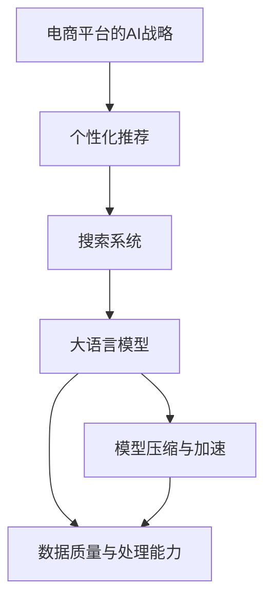

                 

# 电商平台的AI 大模型战略：搜索推荐系统是核心，数据质量与处理能力并重

## 1. 背景介绍

随着电商平台的迅猛发展，利用人工智能(AI)技术优化用户体验和提升转化率，成为各大电商平台的重要战略方向。AI驱动的个性化推荐和搜索结果排序系统，已经成为电商平台的竞争力关键。作为电商平台的AI战略核心，搜索推荐系统正在经历着快速的技术迭代和应用拓展。

为了满足用户的多样化需求和平台的复杂业务场景，搜索推荐系统需要处理海量的数据和复杂的计算，这对AI模型的计算效率和数据质量提出了更高的要求。同时，随着模型复杂度的增加，算力成本和模型的推理速度也逐渐成为制约系统性能的主要瓶颈。

大语言模型作为当前AI领域的热门技术，以其强大的自然语言理解和生成能力，正在被广泛应用到搜索推荐系统中。本文将深入探讨大语言模型在搜索推荐系统中的应用，分析数据质量与处理能力在其中的重要性，并展望未来的技术趋势和挑战。

## 2. 核心概念与联系

### 2.1 核心概念概述

1. **大语言模型(Large Language Model, LLM)**：以自回归模型（如GPT系列）或自编码模型（如BERT系列）为代表，通过在大规模无标签文本语料上进行预训练，学习通用的语言表示，具备强大的语言理解和生成能力。

2. **推荐系统(Recommendation System)**：通过分析用户行为数据和商品属性，预测用户可能感兴趣的商品，并向用户推荐，从而提升用户体验和平台转化率。

3. **搜索系统(Search System)**：根据用户输入的查询词，通过自然语言理解和处理技术，匹配最相关的商品，提高用户查询的准确性和效率。

4. **模型压缩与加速(Compression and Acceleration)**：在保证模型性能的前提下，通过模型压缩和加速技术，减少模型推理的资源消耗和计算时间。

5. **数据质量与处理能力(Data Quality and Processing Capability)**：推荐系统和搜索系统对数据质量有高要求，需要及时清洗、更新和聚合数据，并采用高效的数据处理技术，保证推荐和搜索结果的准确性和相关性。

### 2.2 核心概念原理和架构的 Mermaid 流程图



这个流程图展示了电商平台AI战略的核心组件及其之间的联系：

1. 大语言模型从大规模无标签数据中学习语言表示。
2. 个性化推荐和搜索系统使用大语言模型进行自然语言理解和商品匹配。
3. 模型压缩与加速技术优化大语言模型，提升推理效率。
4. 数据质量与处理能力确保推荐和搜索结果的准确性和相关性。

## 3. 核心算法原理 & 具体操作步骤

### 3.1 算法原理概述

大语言模型在搜索推荐系统中的应用，主要体现在两个方面：

1. **自然语言理解**：利用大语言模型的预训练知识，分析用户查询意图，理解搜索关键词的自然语言含义。
2. **商品匹配**：将用户查询与商品信息进行匹配，筛选出最相关的商品，生成个性化推荐结果。

具体来说，大语言模型在搜索推荐系统中主要进行以下几个步骤：

1. 预训练大语言模型，学习语言知识。
2. 在推荐系统中，使用预训练模型进行文本处理，提取查询和商品的语义特征。
3. 计算查询与商品的相似度，选择最相关的商品。
4. 根据用户历史行为数据，生成个性化推荐结果。

### 3.2 算法步骤详解

1. **预训练大语言模型**：使用大规模无标签文本数据进行预训练，学习语言表示。
2. **文本处理**：利用预训练模型对用户查询和商品描述进行编码，提取语义特征。
3. **相似度计算**：通过相似度计算方法（如余弦相似度、Jaccard相似度等），匹配用户查询与商品特征。
4. **推荐结果生成**：根据用户历史行为数据和商品匹配结果，生成个性化推荐列表。

### 3.3 算法优缺点

**优点**：
- 强大的语言理解能力：大语言模型可以理解自然语言查询和商品描述，提升推荐和搜索的准确性。
- 灵活性：可以根据不同的业务需求，灵活调整模型结构，适应多样化的应用场景。
- 可扩展性：模型可以通过微调等方式，适应不断变化的用户需求和市场环境。

**缺点**：
- 计算资源消耗大：大语言模型的参数量庞大，推理过程中需要消耗大量的计算资源。
- 数据质量要求高：推荐和搜索结果的质量高度依赖于输入数据的质量。
- 部署复杂：需要高性能计算资源和复杂的部署环境。

### 3.4 算法应用领域

大语言模型在电商平台的搜索推荐系统中的应用，主要集中在以下几个方面：

1. **个性化推荐**：根据用户历史行为和兴趣，生成个性化商品推荐列表。
2. **智能搜索**：通过自然语言理解技术，实现用户查询的商品匹配。
3. **广告投放**：根据用户搜索行为和浏览历史，智能推荐广告。
4. **客户服务**：利用自然语言生成技术，自动回复用户咨询，提升客服效率。

## 4. 数学模型和公式 & 详细讲解 & 举例说明

### 4.1 数学模型构建

在搜索推荐系统中，大语言模型的数学模型可以表示为：

$$
M(x; \theta) = \text{softmax}(W_xx + b_x)
$$

其中，$x$ 表示用户查询或商品描述的向量表示，$\theta$ 为模型参数，$W_x$ 和 $b_x$ 分别为权重和偏置向量。

### 4.2 公式推导过程

假设用户查询和商品描述的向量表示分别为 $x_q$ 和 $x_i$，则相似度计算公式为：

$$
similarity(x_q, x_i) = \frac{M(x_q; \theta) \cdot M(x_i; \theta)}{\|M(x_q; \theta)\|_2 \cdot \|M(x_i; \theta)\|_2}
$$

其中，$\cdot$ 表示向量点乘，$\|\cdot\|_2$ 表示向量范数。

### 4.3 案例分析与讲解

以一个简单的电商商品推荐系统为例，展示大语言模型在其中的应用：

1. **预训练大语言模型**：使用大规模电商商品描述和用户评论数据进行预训练。
2. **文本处理**：将用户查询和商品描述编码为向量表示，使用预训练模型进行语义理解。
3. **相似度计算**：计算用户查询和每个商品的相似度，选择最相关的商品。
4. **推荐结果生成**：根据用户历史行为数据和商品匹配结果，生成个性化推荐列表。

## 5. 项目实践：代码实例和详细解释说明

### 5.1 开发环境搭建

1. **安装Python**：确保Python 3.8及以上版本安装。
2. **安装Pip**：确保Pip安装。
3. **安装TensorFlow**：使用以下命令安装：

   ```bash
   pip install tensorflow
   ```

4. **安装PyTorch**：使用以下命令安装：

   ```bash
   pip install torch torchtext
   ```

5. **安装TensorBoard**：用于可视化模型训练过程，使用以下命令安装：

   ```bash
   pip install tensorboard
   ```

### 5.2 源代码详细实现

以下是一个简单的电商商品推荐系统的代码实现，使用TensorFlow构建大语言模型：

```python
import tensorflow as tf
import tensorflow_hub as hub

# 加载预训练的大语言模型
module_url = "https://tfhub.dev/google/lm-bert-uncased-L6Hief/2"
language_model = hub.load(module_url)

# 定义文本编码器
def text_encoder(text):
    return language_model.encode(text)

# 定义推荐系统模型
def recommendation_model(query, products):
    query_embeddings = text_encoder(query)
    product_embeddings = [text_encoder(product) for product in products]
    similarities = tf.matmul(query_embeddings, product_embeddings, transpose_b=True)
    return tf.nn.softmax(similarities)

# 使用模型进行推荐
query = "手机"
products = ["小米手机", "三星手机", "华为手机", "苹果手机"]
recommendations = recommendation_model(query, products)
```

### 5.3 代码解读与分析

- **文本编码器**：使用预训练的大语言模型对查询和商品进行编码，提取语义特征。
- **推荐系统模型**：计算查询和商品的相似度，使用softmax函数输出推荐概率。
- **代码实现**：利用TensorFlow的高阶API和预训练模型模块，实现快速构建和训练推荐系统。

### 5.4 运行结果展示

运行上述代码，可以得到一个包含每个商品推荐概率的向量。以小米手机为例，其推荐概率可能较高，因为查询中包含“手机”这个词，而小米手机是一个与查询高度相关的商品。

## 6. 实际应用场景

### 6.1 个性化推荐

电商平台的个性化推荐系统，可以根据用户历史行为和兴趣，生成个性化商品推荐列表。例如，一个用户曾经购买过手机和耳机，系统会根据这些历史行为，推荐相关的手机和耳机配件。

### 6.2 智能搜索

通过自然语言理解技术，智能搜索系统可以解析用户查询，匹配最相关的商品信息。例如，用户输入“购买iPhone 12”，系统可以理解查询意图，推荐iPhone 12相关的配件和配件。

### 6.3 广告投放

利用推荐系统中的用户行为数据，电商广告投放系统可以精准推送用户感兴趣的商品广告。例如，针对喜欢购买数码产品的用户，系统可以推送最新的手机和电脑广告。

### 6.4 未来应用展望

未来，大语言模型在电商平台的搜索推荐系统中将发挥更加重要的作用。随着模型的不断优化和技术的进步，推荐和搜索系统将具备更强的自适应能力和灵活性，提升用户体验和平台转化率。

## 7. 工具和资源推荐

### 7.1 学习资源推荐

1. **《深度学习与自然语言处理》**：介绍深度学习在自然语言处理中的应用，包括预训练模型和大语言模型。
2. **TensorFlow官方文档**：提供TensorFlow的详细文档和教程，涵盖推荐系统和搜索系统的开发和部署。
3. **《Python深度学习》**：讲解深度学习框架的实现，包括TensorFlow和PyTorch。
4. **Kaggle平台**：提供丰富的电商推荐系统竞赛数据集和模型，方便学习者进行实践。
5. **《自然语言处理综论》**：介绍自然语言处理的基本概念和技术，包括文本表示和语义理解。

### 7.2 开发工具推荐

1. **TensorFlow**：深度学习框架，支持分布式计算和大规模模型训练。
2. **PyTorch**：深度学习框架，灵活性高，适用于研究和实验。
3. **TensorBoard**：可视化工具，实时监测模型训练和推理过程。
4. **Jupyter Notebook**：交互式开发环境，方便编写和调试代码。
5. **AWS SageMaker**：云端AI平台，提供高效的模型训练和部署服务。

### 7.3 相关论文推荐

1. **《Attention is All You Need》**：介绍Transformer模型，是预训练大语言模型的基础。
2. **《BERT: Pre-training of Deep Bidirectional Transformers for Language Understanding》**：介绍BERT模型，是预训练语言模型中的经典之作。
3. **《Parameter-Efficient Transfer Learning for NLP》**：介绍参数高效微调方法，优化大语言模型推理效率。
4. **《Recommender Systems》**：介绍推荐系统的理论和实践，包括电商推荐系统的应用。

## 8. 总结：未来发展趋势与挑战

### 8.1 研究成果总结

本文介绍了大语言模型在电商平台的搜索推荐系统中的应用，分析了数据质量与处理能力的重要性，并展望了未来的技术趋势和挑战。通过详细的案例分析和代码实现，展示了大语言模型的实用性和灵活性。

### 8.2 未来发展趋势

1. **模型压缩与加速**：随着模型规模的增大，模型压缩和加速技术将更加重要，减少计算资源消耗。
2. **跨模态融合**：将视觉、听觉等多模态数据与文本数据融合，提升推荐和搜索的准确性。
3. **实时计算**：实现实时推荐和搜索，提升用户体验。
4. **边缘计算**：在设备端进行推理计算，减少延迟，提高响应速度。
5. **联邦学习**：通过分布式计算，保护用户隐私，提升推荐系统安全性和隐私性。

### 8.3 面临的挑战

1. **计算资源消耗**：大语言模型的参数量庞大，推理过程中需要消耗大量的计算资源。
2. **数据质量要求高**：推荐和搜索结果的质量高度依赖于输入数据的质量。
3. **部署复杂**：需要高性能计算资源和复杂的部署环境。
4. **用户隐私保护**：在推荐系统中，如何保护用户隐私是一个重要问题。
5. **模型公平性**：避免模型偏见，确保推荐系统公平、公正。

### 8.4 研究展望

未来的研究需要关注以下几个方面：

1. **数据质量管理**：建立数据质量管理体系，确保输入数据的多样性和准确性。
2. **跨模态融合**：研究如何将视觉、听觉等多模态数据与文本数据融合，提升推荐和搜索的准确性。
3. **联邦学习**：通过分布式计算，保护用户隐私，提升推荐系统安全性和隐私性。
4. **模型公平性**：避免模型偏见，确保推荐系统公平、公正。
5. **实时计算**：实现实时推荐和搜索，提升用户体验。

## 9. 附录：常见问题与解答

### Q1: 大语言模型在推荐系统中如何处理数据质量问题？

A: 大语言模型在推荐系统中处理数据质量问题，主要通过以下方法：

1. **数据清洗**：去除噪声数据和不完整数据，确保数据的一致性和完整性。
2. **数据增强**：通过回译、改写等方式扩充训练数据集，提升模型泛化能力。
3. **数据聚合**：将分散的数据源聚合起来，提高数据的代表性。
4. **模型验证**：使用验证集和测试集评估模型性能，及时发现和修正数据质量问题。

### Q2: 大语言模型在推荐系统中的推理效率如何优化？

A: 优化大语言模型在推荐系统中的推理效率，主要通过以下方法：

1. **模型压缩**：通过量化、剪枝等技术，减少模型参数量，加速推理。
2. **模型并行**：使用分布式计算框架，提升计算效率。
3. **推理加速**：使用GPU、TPU等高性能计算资源，提升推理速度。
4. **模型优化**：使用剪枝、蒸馏等技术，优化模型结构，减少推理时间。

### Q3: 如何构建一个高效的电商推荐系统？

A: 构建一个高效的电商推荐系统，需要考虑以下几个方面：

1. **数据质量管理**：确保输入数据的多样性和准确性，及时清洗和更新数据。
2. **模型选择和优化**：选择合适的预训练模型，并进行模型压缩和优化。
3. **推荐算法设计**：设计高效的推荐算法，如协同过滤、基于内容的推荐等。
4. **用户反馈机制**：建立用户反馈机制，不断优化推荐算法和模型。
5. **实时计算和部署**：实现实时推荐和搜索，提高用户满意度。

### Q4: 大语言模型在推荐系统中的部署方案有哪些？

A: 大语言模型在推荐系统中的部署方案，主要通过以下方法：

1. **云平台部署**：利用云服务提供商如AWS、阿里云等，实现模型部署和推理。
2. **本地部署**：在本地服务器上部署模型，提供高效的推理服务。
3. **边缘计算**：在设备端进行推理计算，减少延迟，提高响应速度。
4. **容器化部署**：使用Docker等容器技术，实现模型部署和管理。

---

作者：禅与计算机程序设计艺术 / Zen and the Art of Computer Programming

