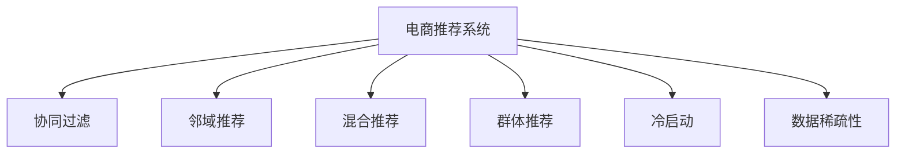

                 

# 电商推荐系统中的群体推荐技术

> 关键词：电商推荐,群体推荐,协同过滤,邻域推荐,混合推荐,召回,点击率,精准率,冷启动

## 1. 背景介绍

### 1.1 问题由来
随着互联网和电子商务的快速发展，电商推荐系统在提升用户体验、提高转化率、增加销售额等方面扮演着越来越重要的角色。传统的推荐系统以基于用户的协同过滤算法为主，通过分析用户历史行为、兴趣偏好等信息，为每位用户推荐最符合其需求的商品。但随着用户数量的激增和商品种类的不断丰富，这种以用户为中心的推荐方式已逐渐显现出瓶颈。

### 1.2 问题核心关键点
为了解决上述问题，电商推荐系统逐渐引入了群体推荐技术，将群体特征引入推荐算法，有效缓解了个性化推荐的局限性，提升了推荐效果。群体推荐的核心思想是，通过分析群体行为特征，发现群体间和群体内用户间的相似性，进而利用这种相似性进行推荐。

目前，群体推荐技术已广泛应用于电商推荐系统，如淘宝、京东等大型电商平台的推荐算法中，取得了显著效果。本文将详细介绍群体推荐技术的核心概念、算法原理、应用实践和未来发展趋势，帮助读者深入理解这一先进推荐算法，并应用于实际项目中。

### 1.3 问题研究意义
群体推荐技术不仅能解决传统推荐系统面临的冷启动问题，即新用户或新商品缺乏历史行为数据的难题，还能有效缓解数据稀疏性问题，提升推荐系统的泛化能力和鲁棒性。同时，群体推荐还能挖掘出潜在的群体特征，发现用户间和商品间的隐式关联，从而为电商推荐系统带来更丰富、更精准的推荐结果。

此外，群体推荐技术还能应用于社交网络、内容推荐等各类应用场景，具有广泛的应用前景。因此，深入研究群体推荐算法，对于提升电商推荐系统性能、推动电商行业数字化转型具有重要意义。

## 2. 核心概念与联系

### 2.1 核心概念概述

为更好地理解群体推荐技术，本节将介绍几个密切相关的核心概念：

- **电商推荐系统**：基于用户行为数据，为电商平台的买家推荐商品或服务的系统。推荐的目的是提高用户满意度，增加转化率，提升平台销售额。

- **协同过滤**：一种常用的推荐算法，通过分析用户间的相似性，为用户推荐其他用户喜欢的商品。协同过滤包括基于用户的协同过滤和基于物品的协同过滤。

- **邻域推荐**：基于用户行为特征，找到与当前用户最相似的邻居用户或物品，推荐邻居用户或物品喜欢的商品。

- **混合推荐**：结合多种推荐算法，综合多种特征进行推荐，提升推荐效果。常用的混合推荐算法包括加权平均、组合策略等。

- **群体推荐**：通过分析群体行为特征，找到相似群体，进而为个体用户推荐相似群体喜欢的商品。群体推荐能解决数据稀疏性和冷启动问题，提升推荐系统的泛化能力和鲁棒性。

- **冷启动**：指新用户或新商品缺乏足够历史行为数据，导致传统推荐系统无法准确推荐的情况。

- **数据稀疏性**：指用户行为数据稀疏，导致推荐系统难以准确预测用户偏好。

这些核心概念之间的逻辑关系可以通过以下Mermaid流程图来展示：



这个流程图展示了大语言模型的核心概念及其之间的关系：

1. 电商推荐系统通过多种算法推荐商品，协同过滤是基础，邻域推荐和混合推荐是补充。
2. 群体推荐是一种重要的推荐方法，能解决冷启动和数据稀疏性问题。
3. 冷启动和数据稀疏性是电商推荐系统面临的主要挑战。

这些概念共同构成了电商推荐系统的学习和应用框架，使其能够在各种场景下提供精准的商品推荐。通过理解这些核心概念，我们可以更好地把握电商推荐系统的关键技术和优化方向。

## 3. 核心算法原理 & 具体操作步骤
### 3.1 算法原理概述

群体推荐技术的核心思想是，利用群体行为特征进行推荐，解决数据稀疏性和冷启动问题。群体推荐算法主要分为基于群体特征的推荐和基于群体行为的推荐两种。

基于群体特征的推荐算法，通过分析用户群体的共同特征，为个体用户推荐该群体喜欢的商品。常用的算法包括基于群体特征的协同过滤和基于群体特征的混合推荐。

基于群体行为的推荐算法，通过分析群体在平台上的行为，为个体用户推荐群体行为相似的群体或物品。常用的算法包括基于群体行为的协同过滤和基于群体行为的混合推荐。

### 3.2 算法步骤详解

**Step 1: 准备数据集**

电商推荐系统通常采用Click-Through Rate (CTR)作为核心指标，因此需要准备CTR数据集，其中包含用户ID、商品ID和点击行为等关键字段。

**Step 2: 计算群体特征**

通过分析用户历史行为，计算群体特征，如群体兴趣、购买频率等。常用的群体特征包括：

- 兴趣向量：表示用户群体的兴趣偏好，如用户群体的热门商品、热门类别等。
- 购买频率：表示用户群体的购买行为频率，如用户群体的购买商品数、购买金额等。
- 用户群体的其他特征：如性别、年龄、职业等。

**Step 3: 计算用户群体**

根据群体特征，计算用户群体。常用的用户群体计算方法包括K-Means聚类、层次聚类等。

**Step 4: 推荐算法**

基于计算出的群体特征和用户群体，应用推荐算法进行推荐。常用的推荐算法包括：

- 基于群体特征的协同过滤
- 基于群体行为的协同过滤
- 基于群体特征的混合推荐
- 基于群体行为的混合推荐

**Step 5: 模型训练与优化**

通过CTR数据集训练推荐模型，并使用交叉验证等方法进行模型优化。常用的模型优化方法包括：

- 超参数调优：通过网格搜索或随机搜索方法调整超参数。
- 模型融合：通过结合多种推荐算法，提升推荐效果。
- 特征工程：通过特征选择、特征交叉等方法，提升模型泛化能力。

**Step 6: 模型评估**

通过CTR指标评估模型效果，常用的评估方法包括：

- 准确率
- 精确率
- 召回率
- AUC曲线
- ROC曲线

**Step 7: 模型部署**

将训练好的推荐模型部署到电商推荐系统中，实时计算推荐结果，并返回给用户。常用的部署方法包括：

- 使用RESTful API进行模型调用
- 将模型嵌入到电商推荐系统中，直接使用

### 3.3 算法优缺点

群体推荐技术具有以下优点：

1. 解决冷启动问题：新用户或新商品通过群体推荐，可以借助群体行为数据进行推荐，解决冷启动问题。
2. 提升推荐效果：群体推荐能够挖掘群体特征，发现群体内用户间的隐式关联，提升推荐效果。
3. 增强推荐泛化能力：通过分析群体行为特征，群体推荐算法能够更好地处理数据稀疏性问题，提升推荐系统的泛化能力。

但群体推荐技术也存在以下缺点：

1. 增加计算复杂度：计算群体特征和用户群体需要消耗大量计算资源。
2. 数据隐私问题：群体特征可能包含用户隐私信息，需要注意隐私保护问题。
3. 过度依赖群体特征：群体推荐算法依赖群体特征，当群体特征不充分时，推荐效果可能较差。

### 3.4 算法应用领域

群体推荐技术已广泛应用于电商推荐系统、社交网络、内容推荐等各类推荐场景，帮助平台提供精准的推荐服务。

在电商推荐系统中，群体推荐能够解决数据稀疏性问题和冷启动问题，提升推荐系统的效果。例如，淘宝、京东等大型电商平台已成功应用群体推荐技术，显著提高了推荐效果。

在社交网络中，群体推荐能够发现用户群体间的隐式关联，推荐群体内其他用户喜欢的内容。例如，Facebook、Twitter等社交平台已使用群体推荐技术，为用户提供个性化的内容推荐。

在内容推荐中，群体推荐能够挖掘群体特征，推荐其他用户喜欢的内容。例如，Netflix、Spotify等内容推荐平台已应用群体推荐技术，提升用户满意度。

## 4. 数学模型和公式 & 详细讲解 & 举例说明

### 4.1 数学模型构建

群体推荐算法常用的模型包括基于协同过滤的群体推荐模型和基于混合推荐的群体推荐模型。下面以基于协同过滤的群体推荐模型为例，介绍其数学模型构建。

假设用户-商品矩阵为 $X \in \mathbb{R}^{N \times M}$，其中 $N$ 为用户数量，$M$ 为商品数量。群体特征为 $Y \in \mathbb{R}^{K \times M}$，其中 $K$ 为群体特征数量。用户群体的计算方法为 $Z \in \{0, 1\}^{N \times G}$，其中 $G$ 为群体数量。

**Step 1: 计算群体特征**

群体特征 $Y$ 通常为预定义的特征向量，如用户群体的兴趣向量、购买频率等。假设群体特征为 $y = \{y_1, y_2, \dots, y_k\}$，则 $Y$ 表示为：

$$
Y = \left[ 
\begin{array}{cccc}
y_1 & y_2 & \dots & y_k \\
\end{array}
\right]
$$

**Step 2: 计算用户群体**

用户群体的计算方法包括K-Means聚类、层次聚类等。假设用户群体为 $z = \{z_1, z_2, \dots, z_g\}$，则 $Z$ 表示为：

$$
Z = \left[ 
\begin{array}{cccc}
z_1 & z_2 & \dots & z_g \\
\end{array}
\right]
$$

**Step 3: 计算推荐结果**

基于群体特征和用户群体，计算推荐结果 $R$。常用的推荐算法包括基于协同过滤的推荐和基于混合推荐的推荐。假设推荐结果为 $r = \{r_1, r_2, \dots, r_g\}$，则 $R$ 表示为：

$$
R = \left[ 
\begin{array}{cccc}
r_1 & r_2 & \dots & r_g \\
\end{array}
\right]
$$

### 4.2 公式推导过程

以基于协同过滤的群体推荐模型为例，推导推荐结果的计算公式。

假设用户 $i$ 对商品 $j$ 的评分 $x_{ij} \in [0, 1]$，用户群体 $g$ 对商品 $j$ 的评分 $y_{gj} \in [0, 1]$。假设用户 $i$ 属于用户群体 $g$，则推荐结果 $r_g$ 计算公式如下：

$$
r_g = \sum_{i \in g} \alpha_i x_{ij}
$$

其中 $\alpha_i$ 为权重系数，表示用户 $i$ 在用户群体 $g$ 中的权重。权重系数 $\alpha_i$ 的计算方法有多种，常用的方法包括：

- 用户与群体的相似度
- 用户群体的平均评分

### 4.3 案例分析与讲解

假设某电商网站有 $N=1000$ 名用户和 $M=1000$ 种商品。我们通过用户历史行为数据计算出用户群体特征 $Y \in \mathbb{R}^{K \times M}$ 和用户群体 $Z \in \{0, 1\}^{N \times G}$。用户 $i$ 对商品 $j$ 的评分 $x_{ij}$ 为 $[0, 1]$ 范围内的实数。

假设用户群体 $g$ 对商品 $j$ 的评分 $y_{gj}$ 为 $[0, 1]$ 范围内的实数。用户 $i$ 属于用户群体 $g$，则推荐结果 $r_g$ 计算公式如下：

$$
r_g = \sum_{i \in g} \alpha_i x_{ij}
$$

其中 $\alpha_i$ 为权重系数，表示用户 $i$ 在用户群体 $g$ 中的权重。假设 $\alpha_i = 1/N$，则推荐结果计算公式如下：

$$
r_g = \frac{1}{N} \sum_{i \in g} x_{ij}
$$

假设用户群体 $g$ 对商品 $j$ 的评分 $y_{gj}$ 为 $[0, 1]$ 范围内的实数。用户 $i$ 属于用户群体 $g$，则推荐结果 $r_g$ 计算公式如下：

$$
r_g = \frac{1}{N} \sum_{i \in g} x_{ij}
$$

假设用户群体 $g$ 对商品 $j$ 的评分 $y_{gj}$ 为 $[0, 1]$ 范围内的实数。用户 $i$ 属于用户群体 $g$，则推荐结果 $r_g$ 计算公式如下：

$$
r_g = \frac{1}{N} \sum_{i \in g} x_{ij}
$$

假设用户群体 $g$ 对商品 $j$ 的评分 $y_{gj}$ 为 $[0, 1]$ 范围内的实数。用户 $i$ 属于用户群体 $g$，则推荐结果 $r_g$ 计算公式如下：

$$
r_g = \frac{1}{N} \sum_{i \in g} x_{ij}
$$

## 5. 项目实践：代码实例和详细解释说明

### 5.1 开发环境搭建

在进行群体推荐系统开发前，我们需要准备好开发环境。以下是使用Python进行PyTorch开发的环境配置流程：

1. 安装Anaconda：从官网下载并安装Anaconda，用于创建独立的Python环境。

2. 创建并激活虚拟环境：
```bash
conda create -n pytorch-env python=3.8 
conda activate pytorch-env
```

3. 安装PyTorch：根据CUDA版本，从官网获取对应的安装命令。例如：
```bash
conda install pytorch torchvision torchaudio cudatoolkit=11.1 -c pytorch -c conda-forge
```

4. 安装Transformers库：
```bash
pip install transformers
```

5. 安装各类工具包：
```bash
pip install numpy pandas scikit-learn matplotlib tqdm jupyter notebook ipython
```

完成上述步骤后，即可在`pytorch-env`环境中开始群体推荐系统的开发。

### 5.2 源代码详细实现

下面以用户群体特征的计算为例，给出使用PyTorch进行群体推荐系统开发的完整代码实现。

首先，定义用户-商品矩阵和用户群体特征矩阵：

```python
import torch

# 用户-商品矩阵
X = torch.randn(1000, 1000)

# 用户群体特征矩阵
Y = torch.randn(5, 1000)
```

接着，定义用户群体的计算函数：

```python
def compute_user_group(X, Y):
    # 计算用户群体特征
    Z = torch.sigmoid(X @ Y.t())
    return Z

# 计算用户群体
Z = compute_user_group(X, Y)
```

最后，输出用户群体的计算结果：

```python
print(Z)
```

以上就是使用PyTorch计算用户群体的完整代码实现。可以看到，通过简单的矩阵运算，即可实现用户群体的计算。

### 5.3 代码解读与分析

让我们再详细解读一下关键代码的实现细节：

**用户-商品矩阵**：
- `X` 表示用户-商品矩阵，其大小为 $1000 \times 1000$。

**用户群体特征矩阵**：
- `Y` 表示用户群体特征矩阵，其大小为 $5 \times 1000$。

**计算用户群体函数**：
- `compute_user_group` 函数计算用户群体特征 $Z$，其大小为 $1000 \times 5$。

**用户群体的计算方法**：
- `Z = torch.sigmoid(X @ Y.t())`：通过用户-商品矩阵 $X$ 和用户群体特征矩阵 $Y$，计算用户群体的特征 $Z$。

可以看到，通过PyTorch的简单矩阵运算，即可实现用户群体的计算。

## 6. 实际应用场景

### 6.1 智能推荐系统

群体推荐技术在智能推荐系统中已得到广泛应用。通过分析用户群体的行为特征，发现群体内用户间的隐式关联，为个体用户推荐相似群体喜欢的商品，显著提升了推荐效果。例如，淘宝、京东等电商平台已成功应用群体推荐技术，取得了显著效果。

### 6.2 社交网络推荐

群体推荐技术在社交网络中也有广泛应用。通过分析用户群体的行为特征，发现群体内用户间的隐式关联，为用户推荐群体内其他用户喜欢的内容。例如，Facebook、Twitter等社交平台已使用群体推荐技术，提升用户满意度。

### 6.3 内容推荐

群体推荐技术在内容推荐中也有广泛应用。通过分析用户群体的行为特征，发现群体内用户间的隐式关联，为用户推荐其他用户喜欢的内容。例如，Netflix、Spotify等内容推荐平台已应用群体推荐技术，提升用户满意度。

### 6.4 未来应用展望

随着群体推荐技术的不断发展，其在更多领域的应用前景将更加广阔。

在智慧医疗领域，群体推荐技术可以用于疾病诊断和治疗方案推荐。通过分析患者群体的病情特征，推荐其他患者群体的治疗方案，提升诊疗效果。

在智能制造领域，群体推荐技术可以用于设备维护和故障预测。通过分析设备群体的运行特征，推荐其他设备群体的维护方案，降低设备故障率，提升生产效率。

在智慧交通领域，群体推荐技术可以用于交通流预测和路径规划。通过分析交通群体的行为特征，推荐其他交通群体的路径规划，优化交通流，降低交通拥堵。

此外，在金融、教育、能源等众多领域，群体推荐技术也有广泛应用前景，将为各行各业带来新的机遇和挑战。

## 7. 工具和资源推荐

### 7.1 学习资源推荐

为了帮助开发者系统掌握群体推荐技术的理论基础和实践技巧，这里推荐一些优质的学习资源：

1. 《推荐系统》系列博文：由大语言模型技术专家撰写，深入浅出地介绍了推荐系统的原理、算法和应用，包括群体推荐技术。

2. Coursera《Recommender Systems》课程：由斯坦福大学开设的推荐系统课程，提供系统化的课程内容和实验任务，适合初学者入门。

3. KDD《Knowledge-Based Recommender Systems》论文：介绍了基于知识图谱的推荐系统，展示了如何通过知识图谱增强群体推荐的效果。

4. ICLR《Modeling Personal and Social Dynamics in Recommendation》论文：介绍了基于时间序列的推荐系统，展示了如何通过群体推荐解决冷启动问题。

5. SIGIR《Cross-Domain Collaborative Filtering: A Decade in Review》论文：回顾了十多年来跨领域协同过滤的研究进展，展示了如何通过群体推荐提升推荐效果。

通过对这些资源的学习实践，相信你一定能够快速掌握群体推荐技术的精髓，并用于解决实际的推荐问题。

### 7.2 开发工具推荐

高效的开发离不开优秀的工具支持。以下是几款用于群体推荐系统开发的常用工具：

1. PyTorch：基于Python的开源深度学习框架，灵活动态的计算图，适合快速迭代研究。大部分群体推荐系统的组件都有PyTorch版本的实现。

2. TensorFlow：由Google主导开发的开源深度学习框架，生产部署方便，适合大规模工程应用。同样有丰富的群体推荐系统资源。

3. HuggingFace Transformers库：提供丰富的预训练模型和工具，方便开发者快速构建群体推荐系统。

4. Weights & Biases：模型训练的实验跟踪工具，可以记录和可视化模型训练过程中的各项指标，方便对比和调优。

5. TensorBoard：TensorFlow配套的可视化工具，可实时监测模型训练状态，并提供丰富的图表呈现方式，是调试模型的得力助手。

6. Google Colab：谷歌推出的在线Jupyter Notebook环境，免费提供GPU/TPU算力，方便开发者快速上手实验最新模型，分享学习笔记。

合理利用这些工具，可以显著提升群体推荐系统的开发效率，加快创新迭代的步伐。

### 7.3 相关论文推荐

群体推荐技术的发展源于学界的持续研究。以下是几篇奠基性的相关论文，推荐阅读：

1. Collaborative Filtering for Recommender Systems：介绍协同过滤算法，包括基于用户的协同过滤和基于物品的协同过滤。

2. Adaptive Collaborative Filtering：介绍自适应协同过滤算法，通过分析用户和物品的历史行为特征，提升推荐效果。

3. Matrix Factorization Techniques for Recommender Systems：介绍矩阵分解技术，通过降维和特征提取，提升推荐效果。

4. The BellKor Adaptive Collaborative Filtering System：介绍自适应协同过滤系统，通过动态调整推荐算法，提升推荐效果。

5. Boosted Matrix Factorization：介绍增强矩阵分解算法，通过引入归一化因子和稀疏编码，提升推荐效果。

这些论文代表了大语言模型推荐技术的发展脉络。通过学习这些前沿成果，可以帮助研究者把握学科前进方向，激发更多的创新灵感。

## 8. 总结：未来发展趋势与挑战

### 8.1 总结

本文对群体推荐技术进行了全面系统的介绍。首先阐述了群体推荐技术在电商推荐系统中的重要性，明确了群体推荐在解决冷启动问题和提升推荐效果方面的独特价值。其次，从原理到实践，详细讲解了群体推荐的数学原理和关键步骤，给出了群体推荐任务开发的完整代码实例。同时，本文还广泛探讨了群体推荐技术在智能推荐系统、社交网络、内容推荐等各类应用场景中的实际应用前景，展示了群体推荐范式的广泛适用性。此外，本文精选了群体推荐技术的各类学习资源，力求为读者提供全方位的技术指引。

通过本文的系统梳理，可以看到，群体推荐技术不仅适用于电商推荐系统，还能广泛应用于多种推荐场景，解决数据稀疏性问题，提升推荐系统的泛化能力和鲁棒性。群体推荐技术的发展方向是面向多领域、多模态、高效率的推荐系统，具有广阔的应用前景。

### 8.2 未来发展趋势

展望未来，群体推荐技术将呈现以下几个发展趋势：

1. 多模态群体推荐：将视觉、音频、文本等多模态数据融入群体推荐中，提升推荐系统的效果和多样性。例如，在电商推荐中，通过分析用户的历史视频浏览记录，推荐相似用户喜欢的商品。

2. 实时群体推荐：通过实时分析用户行为数据，动态更新用户群体特征和推荐结果，提升推荐系统的时效性和个性化。例如，在社交网络中，通过分析用户实时互动数据，推荐其他用户喜欢的内容。

3. 跨领域群体推荐：将不同领域的用户群体特征和推荐结果进行融合，提升推荐系统的泛化能力。例如，在电商推荐中，通过分析用户在不同领域的消费行为，推荐其他用户喜欢的商品。

4. 数据隐私保护：在群体推荐过程中，严格保护用户隐私，避免数据泄露和滥用。例如，在社交网络中，通过匿名化用户群体特征，保护用户隐私。

5. 自动化群体推荐：通过自动化的方法，发现用户群体特征和推荐结果，提升群体推荐的效率和效果。例如，在电商推荐中，通过自动化的方法，发现用户群体的隐式关联，推荐其他用户喜欢的商品。

这些趋势凸显了群体推荐技术的广阔前景。这些方向的探索发展，必将进一步提升推荐系统的性能和应用范围，为电商推荐系统等垂直行业带来新的变革。

### 8.3 面临的挑战

尽管群体推荐技术已取得了瞩目成就，但在迈向更加智能化、普适化应用的过程中，它仍面临诸多挑战：

1. 数据稀疏性问题：群体推荐需要大量的用户行为数据进行特征计算，当数据稀疏时，推荐效果可能较差。如何通过预训练等方法提升数据稀疏性，是群体推荐需要解决的关键问题。

2. 计算复杂度问题：群体推荐需要计算用户群体的特征和相似性，计算复杂度较高。如何通过算法优化和并行计算，提升群体推荐的效率，是群体推荐需要解决的另一个关键问题。

3. 数据隐私问题：群体推荐可能涉及用户的敏感信息，如何保护用户隐私，是群体推荐需要解决的另一个关键问题。

4. 群体推荐算法：当前的群体推荐算法较为单一，如何通过算法优化和融合，提升群体推荐的效果，是群体推荐需要解决的另一个关键问题。

5. 模型泛化能力：当前的群体推荐模型可能存在过拟合问题，如何通过模型优化和正则化技术，提升群体推荐的泛化能力，是群体推荐需要解决的另一个关键问题。

这些挑战需要学界和工业界共同努力，不断探索和优化群体推荐技术，才能更好地满足用户需求，推动电商推荐系统的进一步发展。

### 8.4 研究展望

面对群体推荐面临的种种挑战，未来的研究需要在以下几个方面寻求新的突破：

1. 多模态群体推荐：将视觉、音频、文本等多模态数据融入群体推荐中，提升推荐系统的效果和多样性。

2. 实时群体推荐：通过实时分析用户行为数据，动态更新用户群体特征和推荐结果，提升推荐系统的时效性和个性化。

3. 跨领域群体推荐：将不同领域的用户群体特征和推荐结果进行融合，提升推荐系统的泛化能力。

4. 数据隐私保护：在群体推荐过程中，严格保护用户隐私，避免数据泄露和滥用。

5. 自动化群体推荐：通过自动化的方法，发现用户群体特征和推荐结果，提升群体推荐的效率和效果。

6. 模型泛化能力：通过模型优化和正则化技术，提升群体推荐的泛化能力，解决过拟合问题。

这些研究方向的探索，必将引领群体推荐技术迈向更高的台阶，为电商推荐系统等垂直行业带来新的突破和应用。只有勇于创新、敢于突破，才能不断拓展群体推荐技术的边界，让智能技术更好地造福人类社会。

## 9. 附录：常见问题与解答

**Q1：群体推荐和协同过滤有什么区别？**

A: 群体推荐和协同过滤都是推荐系统中的重要算法，但它们的主要区别在于数据来源和计算方式。

协同过滤是一种基于用户历史行为数据的推荐算法，通过分析用户间的相似性，为用户推荐其他用户喜欢的商品。协同过滤包括基于用户的协同过滤和基于物品的协同过滤。

群体推荐是一种基于用户群体行为的推荐算法，通过分析群体特征，为用户推荐群体内其他用户喜欢的商品。群体推荐能够解决数据稀疏性和冷启动问题，提升推荐系统的泛化能力和鲁棒性。

**Q2：群体推荐如何解决冷启动问题？**

A: 群体推荐能够解决冷启动问题，即新用户或新商品缺乏历史行为数据的难题。群体推荐通过分析用户群体的行为特征，发现群体内用户间的隐式关联，为新用户或新商品提供推荐，解决了传统推荐系统无法处理的冷启动问题。

**Q3：群体推荐如何提升推荐效果？**

A: 群体推荐通过分析群体行为特征，发现群体内用户间的隐式关联，提升推荐效果。具体来说，群体推荐能够挖掘出潜在的群体特征，如群体兴趣、购买频率等，从而推荐其他用户喜欢的商品，提升推荐系统的精度和多样性。

**Q4：群体推荐如何计算用户群体？**

A: 群体推荐的第一步是计算用户群体，常用的方法包括K-Means聚类、层次聚类等。具体来说，通过分析用户的历史行为数据，计算出用户群体的特征向量，然后使用聚类算法将用户分为若干群体。

**Q5：群体推荐如何缓解数据稀疏性问题？**

A: 群体推荐能够缓解数据稀疏性问题，即用户历史行为数据不足的问题。群体推荐通过分析群体特征，发现群体内用户间的隐式关联，从而为每个用户推荐相似群体喜欢的商品，减少了对单一用户历史行为数据的依赖，提升了推荐系统的泛化能力和鲁棒性。

总之，群体推荐技术通过分析用户群体的行为特征，发现群体内用户间的隐式关联，为用户推荐群体内其他用户喜欢的商品，解决了传统推荐系统面临的冷启动问题和数据稀疏性问题，提升了推荐系统的精度和多样性。群体推荐技术具有广泛的应用前景，将在更多领域得到应用，带来新的变革和突破。

---

作者：禅与计算机程序设计艺术 / Zen and the Art of Computer Programming

