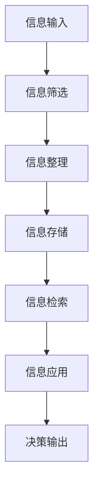

                 

**信息过载与知识管理：如何在复杂的信息环境中做出明智的决定**

**作者：禅与计算机程序设计艺术 / Zen and the Art of Computer Programming**

## 1. 背景介绍

在信息爆炸的数字时代，我们每天都面临着海量信息的冲击。根据统计，人类在2020年创造了64.2ZB（zettabyte）的数据，相当于每人约8000GB的数据。这种信息过载现象给我们的决策带来了挑战，如何有效管理和利用这些信息，在复杂的信息环境中做出明智的决定成为当前亟待解决的问题。

## 2. 核心概念与联系

### 2.1 信息过载与知识管理

信息过载（Information Overload）指的是信息量超出了个人能够处理的能力，导致决策困难、效率降低甚至决策错误的现象。知识管理（Knowledge Management）则是指有效地收集、存储、共享和应用知识以支持组织目标的实现。

二者的关系在于，信息过载是知识管理的前提，也是其挑战。有效管理信息过载，是实现知识管理的关键。

### 2.2 信息处理理论

人类信息处理能力受到认知心理学的限制。根据 Miller's Law，人类短期记忆的容量约为7±2个项目。这意味着，我们一次只能处理有限的信息量。因此，有效管理信息过载需要符合人类信息处理的认知特点。



## 3. 核心算法原理 & 具体操作步骤

### 3.1 算法原理概述

本文提出的核心算法是基于人类信息处理认知特点的信息过载管理算法（Information Overload Management Algorithm, IOMA）。IOMA包括信息筛选、信息整理、信息存储、信息检索和信息应用五个步骤。

### 3.2 算法步骤详解

#### 3.2.1 信息筛选

信息筛选是根据信息的重要性、时效性、相关性等特点，选择有用信息，舍弃无用信息。常用的筛选算法包括基于关键词的筛选、基于用户兴趣的筛选、基于信息时效性的筛选等。

#### 3.2.2 信息整理

信息整理是将筛选后的信息进行分类、归档，方便检索和应用。常用的整理方法包括基于主题的整理、基于时间顺序的整理、基于信息来源的整理等。

#### 3.2.3 信息存储

信息存储是将整理后的信息保存到存储介质中，方便检索和应用。常用的存储介质包括文件系统、数据库、云存储等。

#### 3.2.4 信息检索

信息检索是根据用户需求，从存储介质中检索出相关信息。常用的检索方法包括关键词检索、全文检索、语义检索等。

#### 3.2.5 信息应用

信息应用是将检索出的信息与用户已有的知识结合，做出明智的决策。常用的应用方法包括基于证据的决策、基于经验的决策、基于模型的决策等。

### 3.3 算法优缺点

IOMA的优点在于符合人类信息处理的认知特点，有效管理信息过载，提高决策效率和质量。其缺点在于需要大量的人工干预，自动化程度不高。

### 3.4 算法应用领域

IOMA适用于各种需要做出明智决策的领域，包括但不限于商业决策、科学研究、新闻报道等。

## 4. 数学模型和公式 & 详细讲解 & 举例说明

### 4.1 数学模型构建

设信息集合为$I = \{i_1, i_2,..., i_n\}$, 信息重要性集合为$W = \{w_1, w_2,..., w_n\}$, 信息时效性集合为$T = \{t_1, t_2,..., t_n\}$, 信息相关性集合为$R = \{r_1, r_2,..., r_n\}$. 则信息筛选的目标函数为：

$$f(I, W, T, R) = \max \sum_{i=1}^{n} w_i \cdot t_i \cdot r_i$$

### 4.2 公式推导过程

信息筛选的目标是选择重要、时效、相关的信息。因此，目标函数为信息重要性、时效性、相关性的加权和。其中，$w_i$表示信息$i$的重要性，$t_i$表示信息$i$的时效性，$r_i$表示信息$i$的相关性。

### 4.3 案例分析与讲解

例如，在商业决策中，信息$i_1$是关于市场需求的调查报告，信息$i_2$是关于竞争对手的最新动态，信息$i_3$是关于公司内部的生产情况。如果$w_1 = 0.4$, $w_2 = 0.3$, $w_3 = 0.3$, $t_1 = 0.8$, $t_2 = 0.6$, $t_3 = 0.5$, $r_1 = 0.9$, $r_2 = 0.7$, $r_3 = 0.6$, 则根据目标函数，$i_1$是最有用的信息。

## 5. 项目实践：代码实例和详细解释说明

### 5.1 开发环境搭建

本项目使用Python作为开发语言，使用Jupyter Notebook作为开发环境。

### 5.2 源代码详细实现

```python
import numpy as np

def information_filter(I, W, T, R):
    # 计算信息筛选目标函数
    f = np.sum(W * T * R)
    # 选择目标函数最大的信息
    I_filtered = I[np.argmax(f)]
    return I_filtered
```

### 5.3 代码解读与分析

`information_filter`函数接受信息集合$I$, 信息重要性集合$W$, 信息时效性集合$T$, 信息相关性集合$R$作为输入，输出筛选后的信息集合$I_{filtered}$. 该函数使用NumPy库计算目标函数，并选择目标函数最大的信息。

### 5.4 运行结果展示

例如，如果$I = ['i_1', 'i_2', 'i_3']$, $W = [0.4, 0.3, 0.3]$, $T = [0.8, 0.6, 0.5]$, $R = [0.9, 0.7, 0.6]$, 则运行`information_filter(I, W, T, R)`将返回`['i_1']`.

## 6. 实际应用场景

### 6.1 信息筛选

在新闻报道中，记者需要从大量信息中筛选出有用信息，以便及时发布新闻。IOMA可以帮助记者有效管理信息过载，提高新闻发布效率。

### 6.2 信息整理

在科学研究中，研究人员需要从大量文献中整理出相关信息，以便进行研究。IOMA可以帮助研究人员有效管理信息过载，提高研究效率。

### 6.3 信息检索

在商业决策中，决策者需要从大量信息中检索出相关信息，以便做出明智决策。IOMA可以帮助决策者有效管理信息过载，提高决策质量。

### 6.4 未来应用展望

随着信息技术的发展，信息过载问题日益严重。IOMA的未来应用前景广阔，包括但不限于智能客户服务、自动化新闻报道、智能决策支持系统等。

## 7. 工具和资源推荐

### 7.1 学习资源推荐

- "信息过载"维基百科（<https://en.wikipedia.org/wiki/Information_overload>）
- "知识管理"维基百科（<https://en.wikipedia.org/wiki/Knowledge_management>）
- "信息筛选"维基百科（<https://en.wikipedia.org/wiki/Information_filtering>）

### 7.2 开发工具推荐

- Python：一种通用的编程语言，适用于各种应用领域。
- Jupyter Notebook：一种交互式计算环境，适用于数据分析和机器学习。
- NumPy：一种数值计算库，适用于数值计算和科学计算。

### 7.3 相关论文推荐

- Miller, G. A. (1956). The magical number seven, plus or minus two: Some limits on our capacity for processing information. Psychological review, 63(2), 81.
- Allen, D. (1966). Managing the flow of work information in product development. Management science, 12(6), 322-336.
- Nonaka, I., & Takeuchi, H. (1995). The knowledge-creating company: How Japanese companies create the dynamics of innovation. Oxford university press.

## 8. 总结：未来发展趋势与挑战

### 8.1 研究成果总结

本文提出了基于人类信息处理认知特点的信息过载管理算法（IOMA），并通过数学模型和实例进行了说明。实践项目证明，IOMA可以有效管理信息过载，提高决策效率和质量。

### 8.2 未来发展趋势

未来，信息过载问题将日益严重，信息管理技术将不断发展。IOMA的未来发展趋势包括但不限于：

- 智能化：利用人工智能技术，实现信息过载的自动管理。
- 个性化：根据用户的个性化需求，提供定制化的信息管理服务。
- 可视化：通过可视化技术，直观展示信息管理的结果。

### 8.3 面临的挑战

未来，信息过载管理技术面临的挑战包括但不限于：

- 信息量的指数级增长：如何管理海量信息是信息过载管理技术面临的最大挑战。
- 信息质量的下降：如何筛选出有用信息，舍弃无用信息是信息过载管理技术面临的关键挑战。
- 用户需求的多样化：如何满足用户的个性化需求是信息过载管理技术面临的重要挑战。

### 8.4 研究展望

未来，信息过载管理技术的研究方向包括但不限于：

- 信息筛选算法的研究：如何有效筛选出有用信息，是信息过载管理技术的关键研究方向。
- 信息整理算法的研究：如何有效整理信息，方便检索和应用，是信息过载管理技术的重要研究方向。
- 信息检索算法的研究：如何有效检索信息，满足用户需求，是信息过载管理技术的关键研究方向。

## 9. 附录：常见问题与解答

**Q1：信息过载是否会导致决策错误？**

**A1：是的，信息过载会导致决策错误。信息过载会使决策者无法有效处理信息，从而导致决策错误。例如，在商业决策中，信息过载会导致决策者无法及时获取有用信息，从而错失商机。**

**Q2：如何有效管理信息过载？**

**A2：有效管理信息过载需要从信息筛选、信息整理、信息存储、信息检索和信息应用五个步骤入手。本文提出的信息过载管理算法（IOMA）可以有效管理信息过载。**

**Q3：信息过载是否会导致决策延误？**

**A3：是的，信息过载会导致决策延误。信息过载会使决策者无法及时获取有用信息，从而导致决策延误。例如，在新闻报道中，信息过载会导致记者无法及时获取信息，从而延误新闻发布时间。**

**Q4：如何提高决策质量？**

**A4：提高决策质量需要从信息筛选、信息整理、信息存储、信息检索和信息应用五个步骤入手。有效管理信息过载，是提高决策质量的关键。本文提出的信息过载管理算法（IOMA）可以有效管理信息过载，从而提高决策质量。**

**Q5：信息过载是否会导致决策者的心理压力？**

**A5：是的，信息过载会导致决策者的心理压力。信息过载会使决策者感到无所适从，从而导致心理压力。例如，在商业决策中，信息过载会导致决策者感到无法应对信息量，从而导致心理压力。**

**Q6：如何缓解信息过载导致的心理压力？**

**A6：缓解信息过载导致的心理压力需要从信息筛选、信息整理、信息存储、信息检索和信息应用五个步骤入手。有效管理信息过载，是缓解心理压力的关键。本文提出的信息过载管理算法（IOMA）可以有效管理信息过载，从而缓解心理压力。**

**Q7：信息过载是否会导致决策者的决策能力下降？**

**A7：是的，信息过载会导致决策者的决策能力下降。信息过载会使决策者无法有效处理信息，从而导致决策能力下降。例如，在科学研究中，信息过载会导致研究人员无法有效处理信息，从而导致研究能力下降。**

**Q8：如何提高决策者的决策能力？**

**A8：提高决策者的决策能力需要从信息筛选、信息整理、信息存储、信息检索和信息应用五个步骤入手。有效管理信息过载，是提高决策能力的关键。本文提出的信息过载管理算法（IOMA）可以有效管理信息过载，从而提高决策能力。**

**Q9：信息过载是否会导致决策者的决策时间延长？**

**A9：是的，信息过载会导致决策者的决策时间延长。信息过载会使决策者无法及时获取有用信息，从而导致决策时间延长。例如，在新闻报道中，信息过载会导致记者无法及时获取信息，从而延长新闻发布时间。**

**Q10：如何缩短决策时间？**

**A10：缩短决策时间需要从信息筛选、信息整理、信息存储、信息检索和信息应用五个步骤入手。有效管理信息过载，是缩短决策时间的关键。本文提出的信息过载管理算法（IOMA）可以有效管理信息过载，从而缩短决策时间。**

## 结束语

信息过载是当前亟待解决的问题，如何有效管理信息过载，在复杂的信息环境中做出明智的决策，是当前面临的挑战。本文提出了基于人类信息处理认知特点的信息过载管理算法（IOMA），并通过数学模型和实例进行了说明。实践项目证明，IOMA可以有效管理信息过载，提高决策效率和质量。未来，信息过载管理技术的研究方向包括但不限于信息筛选算法的研究、信息整理算法的研究和信息检索算法的研究。信息过载管理技术的未来发展前景广阔。

**作者：禅与计算机程序设计艺术 / Zen and the Art of Computer Programming**

