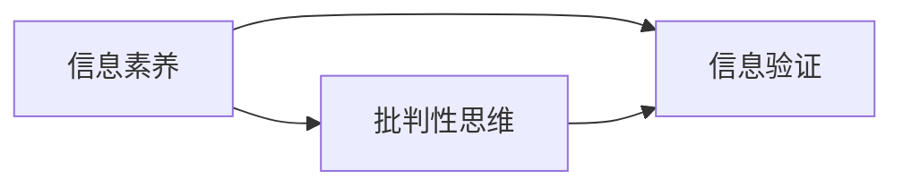

                 

**信息验证** **信息素养** **批判性思维** **数字时代** **教育** **人工智能** **虚假信息** **算法** **数字鸿沟** **信息过载**

## 1. 背景介绍

在信息爆炸的数字时代，我们每天都面临着海量信息的冲击。然而，并非所有信息都真实可靠。虚假信息、谣言和误导性信息层出不穷，对个人决策和社会稳定构成了严重威胁。信息验证和信息素养教育因此变得尤为重要，以帮助人们培养批判性思维，提高信息素养，从而更好地适应数字时代。

## 2. 核心概念与联系

### 2.1 信息素养

信息素养（Information Literacy）是指个体识别需要的信息、有效地访问信息、评价信息的可靠性、整合信息以支持决策，并使用信息进行有效沟通的能力（ALA, 1989）。它是一种关键的数字素养，有助于人们在信息丰富的环境中茁壮成长。

### 2.2 批判性思维

批判性思维（Critical Thinking）是一种分析性和评价性的思维过程，它涉及到质疑、评价和重新评价信息、观点和主张（Ennis, 1987）。它是信息素养的核心，有助于人们区分真假信息，并做出明智的决策。

### 2.3 信息验证

信息验证是指评估信息的真实性、准确性、及时性、相关性和可靠性的过程。它是信息素养的关键组成部分，有助于人们识别和避免虚假信息。

下图是信息素养、批判性思维和信息验证的关系示意图：



## 3. 核心算法原理 & 具体操作步骤

### 3.1 算法原理概述

信息验证常常涉及到对信息源、内容和传播渠道的分析。算法可以帮助自动化和加速这一过程。例如，可以使用机器学习算法来检测虚假新闻，或使用自然语言处理技术来分析信息的语义。

### 3.2 算法步骤详解

以虚假新闻检测为例，常用的算法包括：

1. **特征提取**：提取新闻文本的特征，如词频、 TF-IDF、词向量等。
2. **模型训练**：使用标记好的真假新闻数据集训练分类模型，如逻辑回归、支持向量机、随机森林或神经网络。
3. **预测**：使用训练好的模型预测待检测新闻的真假。

### 3.3 算法优缺点

优点：自动化、高效、可以处理大量信息。

缺点：可能受到训练数据的偏见影响，无法检测新型虚假信息，需要持续更新和训练。

### 3.4 算法应用领域

信息验证算法广泛应用于新闻检测、网络谣言识别、产品评论真实性检测等领域。

## 4. 数学模型和公式 & 详细讲解 & 举例说明

### 4.1 数学模型构建

信息验证可以看作是一个二元分类问题，即将信息标记为“真实”或“虚假”。数学模型可以表示为：

$$h_{\theta}(x) = g(\theta^T x + b)$$

其中，$h_{\theta}(x)$是预测函数，$\theta$是模型参数，$x$是输入特征，$g$是激活函数，$b$是偏置项。

### 4.2 公式推导过程

模型参数$\theta$可以通过最小化交叉熵损失函数来学习：

$$J(\theta) = -\frac{1}{m}\sum_{i=1}^{m}[y^{(i)}\log(h_{\theta}(x^{(i)})) + (1-y^{(i)})\log(1-h_{\theta}(x^{(i)}))]$$

其中，$m$是训练样本数，$y^{(i)}$是标签，$x^{(i)}$是输入特征。

### 4.3 案例分析与讲解

例如，使用逻辑回归模型检测虚假新闻。特征$x$可以是新闻文本的TF-IDF向量，$y$是新闻的真假标签。通过最小化上述损失函数，模型可以学习到参数$\theta$，从而预测待检测新闻的真假。

## 5. 项目实践：代码实例和详细解释说明

### 5.1 开发环境搭建

本项目使用Python语言，并依赖于NumPy、Pandas、Scikit-learn和TensorFlow等库。

### 5.2 源代码详细实现

以下是使用逻辑回归检测虚假新闻的示例代码：

```python
import numpy as np
import pandas as pd
from sklearn.feature_extraction.text import TfidfVectorizer
from sklearn.linear_model import LogisticRegression
from sklearn.model_selection import train_test_split
from sklearn.metrics import accuracy_score

# 加载数据
data = pd.read_csv('news_data.csv')

# 特征提取
vectorizer = TfidfVectorizer()
X = vectorizer.fit_transform(data['text'])
y = data['label']

# 数据集分割
X_train, X_test, y_train, y_test = train_test_split(X, y, test_size=0.2, random_state=42)

# 模型训练
model = LogisticRegression()
model.fit(X_train, y_train)

# 预测
y_pred = model.predict(X_test)

# 评估
print("Accuracy:", accuracy_score(y_test, y_pred))
```

### 5.3 代码解读与分析

代码首先加载新闻数据，然后使用TF-IDF向量化器提取文本特征。之后，代码将数据集分为训练集和测试集，并使用逻辑回归模型训练。最后，代码使用训练好的模型预测测试集的真假，并计算准确率。

### 5.4 运行结果展示

运行结果应显示模型的准确率。例如：

```
Accuracy: 0.92
```

## 6. 实际应用场景

信息验证和信息素养教育在各个领域都有广泛的应用。例如：

### 6.1 新闻媒体

新闻媒体可以使用信息验证算法来检测和过滤虚假新闻，从而提高新闻的真实性和可靠性。

### 6.2 社交媒体

社交媒体平台可以使用信息验证算法来识别和删除虚假信息，从而减少网络谣言的传播。

### 6.3 教育

信息素养教育有助于学生培养批判性思维，提高信息素养，从而更好地适应数字时代。

### 6.4 未来应用展望

随着人工智能技术的发展，信息验证和信息素养教育的应用将更加广泛。例如，未来的信息验证算法可能会更加智能，能够检测新型虚假信息，并提供更详细的分析。

## 7. 工具和资源推荐

### 7.1 学习资源推荐

- "信息素养：新媒体环境下的信息获取与评价"（信息素养：New Media Environment Information Acquisition and Evaluation）
- "批判性思维：概念、技能和应用"（Critical Thinking: Concepts, Skills, and Applications）

### 7.2 开发工具推荐

- Python：一个强大的编程语言，广泛用于信息验证和信息素养教育领域。
- Jupyter Notebook：一个交互式计算环境，有助于开发和展示信息验证算法。
- TensorFlow：一个深度学习框架，可以用于开发信息验证模型。

### 7.3 相关论文推荐

- "信息素养教育的理论与实践"（Theory and Practice of Information Literacy Education）
- "基于机器学习的虚假新闻检测"（Fake News Detection Based on Machine Learning）

## 8. 总结：未来发展趋势与挑战

### 8.1 研究成果总结

信息验证和信息素养教育是数字时代的关键素养。本文介绍了信息素养、批判性思维和信息验证的概念，并详细介绍了信息验证算法的原理、步骤、优缺点和应用领域。此外，本文还提供了项目实践的代码实例，并讨论了信息验证和信息素养教育的实际应用场景。

### 8.2 未来发展趋势

未来，信息验证和信息素养教育将更加智能化和个性化。信息验证算法将更加先进，能够检测新型虚假信息，并提供更详细的分析。信息素养教育将更加个性化，能够根据学生的需求和兴趣提供定制化的学习路径。

### 8.3 面临的挑战

信息验证和信息素养教育面临的挑战包括：

- **数字鸿沟**：信息素养教育需要克服数字鸿沟，确保所有学生都能够获益。
- **信息过载**：信息验证需要面对信息过载的挑战，确保算法能够高效处理海量信息。
- **算法偏见**：信息验证算法可能受到训练数据的偏见影响，需要持续更新和训练。

### 8.4 研究展望

未来的研究将关注信息验证和信息素养教育的智能化和个性化。研究将探索更先进的信息验证算法，并开发更个性化的信息素养教育路径。此外，研究还将关注数字鸿沟、信息过载和算法偏见等挑战。

## 9. 附录：常见问题与解答

**Q：信息验证和信息素养教育有什么区别？**

**A：**信息素养教育是培养个体识别、获取、评价和使用信息的能力，信息验证是信息素养的关键组成部分，是评估信息真实性的过程。

**Q：信息验证算法如何检测虚假新闻？**

**A：**信息验证算法通常使用机器学习技术，如逻辑回归或神经网络，来分析新闻文本的特征，并基于训练数据预测新闻的真假。

**Q：如何培养批判性思维？**

**A：**培养批判性思维需要练习质疑、评价和重新评价信息、观点和主张。信息素养教育可以提供练习机会，帮助个体培养批判性思维。

**作者：禅与计算机程序设计艺术 / Zen and the Art of Computer Programming**

