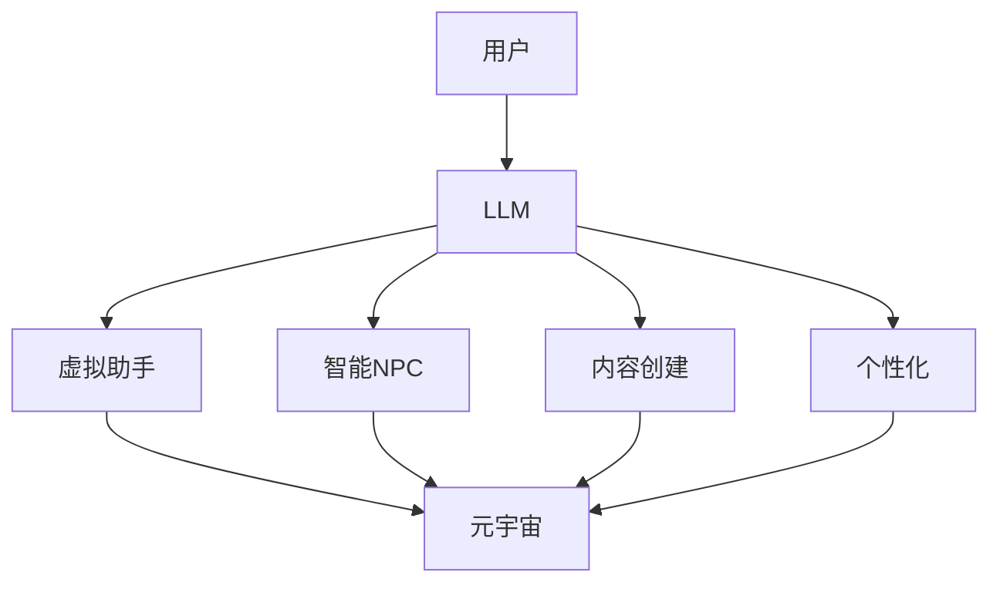

                 

**元宇宙建设者：LLM 打造虚拟世界**

**作者：禅与计算机程序设计艺术 / Zen and the Art of Computer Programming**

## 1. 背景介绍

元宇宙（Metaverse）是一个由虚拟现实、增强现实、人工智能、物联网、区块链等技术驱动的新型互联网，它正在重新定义我们的数字生活和未来。大型语言模型（LLM）是一种强大的工具，可以帮助我们构建和塑造这个虚拟世界。本文将深入探讨LLM在元宇宙建设中的作用，并提供实践指南。

## 2. 核心概念与联系

### 2.1 大型语言模型（LLM）

LLM是一种深度学习模型，旨在理解、生成或翻译人类语言。它通过处理大量文本数据来学习语言规则和上下文，从而能够生成相似的文本。

### 2.2 元宇宙（Metaverse）

元宇宙是一个虚拟世界的集合，它提供了一个沉浸式的、三维的、实时交互的数字环境。用户可以通过虚拟现实头盔、增强现实眼镜或计算机屏幕访问元宇宙。

### 2.3 LLM在元宇宙中的作用

LLM可以在元宇宙中扮演多种角色，从虚拟助手到智能NPC（非玩家角色），再到内容创建和个性化。它可以帮助构建更智能、更互动、更个性化的虚拟世界。



## 3. 核心算法原理 & 具体操作步骤

### 3.1 算法原理概述

LLM的核心是Transformer模型，它使用自注意力机制（Self-Attention）和位置编码（Positional Encoding）来处理输入序列。Transformer模型的架构如下：


### 3.2 算法步骤详解

1. **输入嵌入**：将输入文本转换为数值表示。
2. **位置编码**：为序列中的每个位置添加位置信息。
3. **编码器**：使用自注意力机制和前馈网络（Feed-Forward Network）处理输入序列。
4. **解码器**：生成输出序列，并使用自注意力机制和前馈网络处理输入和输出序列。

### 3.3 算法优缺点

**优点**：
- 可以处理长序列，因为它不依赖于循环神经网络（RNN）的循环状态。
- 可以并行处理输入序列，提高了训练速度。

**缺点**：
- 计算复杂度高，需要大量的计算资源。
- 训练数据要求高，需要大量的、高质量的文本数据。

### 3.4 算法应用领域

LLM的应用领域包括自然语言处理（NLP）、机器翻译、文本生成、问答系统等。在元宇宙中，它可以用于创建智能NPC、虚拟助手、个性化内容等。

## 4. 数学模型和公式 & 详细讲解 & 举例说明

### 4.1 数学模型构建

LLM的数学模型基于Transformer模型。给定输入序列$x=(x_1, x_2,..., x_n)$，输出序列$y=(y_1, y_2,..., y_m)$，模型的目标是最大化对数似然函数：

$$L(\theta) = \frac{1}{n} \sum_{i=1}^{n} \log P(y_i | y_{<i}, x; \theta)$$

其中$\theta$是模型的参数， $P(y_i | y_{<i}, x; \theta)$是条件概率分布。

### 4.2 公式推导过程

自注意力机制的公式如下：

$$Attention(Q, K, V) = softmax\left(\frac{QK^T}{\sqrt{d_k}}\right)V$$

其中$Q$, $K$, $V$是查询、键、值矩阵，分别来自输入序列的不同表示。$d_k$是键矩阵的维度。

### 4.3 案例分析与讲解

例如，在元宇宙中创建一个智能NPC。我们可以使用LLM来生成NPC的对话。输入是用户的问题，输出是NPC的回答。我们可以使用交叉熵损失函数来训练模型：

$$L(\theta) = -\frac{1}{n} \sum_{i=1}^{n} \log P(y_i | x; \theta)$$

其中$y_i$是目标回答， $x$是输入问题。

## 5. 项目实践：代码实例和详细解释说明

### 5.1 开发环境搭建

我们将使用Python和PyTorch来实现LLM。首先，安装必要的库：

```bash
pip install torch torchvision
```

### 5.2 源代码详细实现

以下是一个简单的LLM实现，它使用Transformer模型来生成文本：

```python
import torch
import torch.nn as nn
import torch.optim as optim
import math

class PositionalEncoding(nn.Module):
    def __init__(self, d_model, dropout=0.1, max_len=5000):
        super(PositionalEncoding, self).__init__()
        self.dropout = nn.Dropout(p=dropout)

        pe = torch.zeros(max_len, d_model)
        position = torch.arange(0, max_len, dtype=torch.float).unsqueeze(1)
        div_term = torch.exp(torch.arange(0, d_model, 2).float() * (-math.log(10000.0) / d_model))
        pe[:, 0::2] = torch.sin(position * div_term)
        pe[:, 1::2] = torch.cos(position * div_term)
        pe = pe.unsqueeze(0)
        self.register_buffer('pe', pe)

    def forward(self, x):
        x = x + self.pe[:, :x.size(1)]
        return self.dropout(x)

class TransformerModel(nn.Module):
    def __init__(self, n_token, d_model, n_head, dropout=0.1):
        super(TransformerModel, self).__init__()
        self.embedding = nn.Embedding(n_token, d_model)
        self.pos_encoding = PositionalEncoding(d_model, dropout)
        self.transformer = nn.Transformer(d_model, n_head)
        self.linear = nn.Linear(d_model, n_token)

    def forward(self, src):
        src = self.embedding(src) * math.sqrt(self.embedding.embedding_dim)
        src = self.pos_encoding(src)
        output = self.transformer(src)
        output = self.linear(output)
        return output

# 示例：创建一个有10000个token，512维表示，8个注意力头的模型
model = TransformerModel(10000, 512, 8)
```

### 5.3 代码解读与分析

我们首先定义了位置编码类`PositionalEncoding`，然后定义了Transformer模型类`TransformerModel`。在`TransformerModel`中，我们首先将输入文本转换为数值表示，然后添加位置编码，最后使用Transformer模型处理输入序列并生成输出。

### 5.4 运行结果展示

在训练和推理过程中，我们可以使用交叉熵损失函数来监控模型的性能。以下是一个示例：

```python
criterion = nn.CrossEntropyLoss()
optimizer = optim.Adam(model.parameters(), lr=0.001)

# 示例：训练模型
for epoch in range(10):
    for i, data in enumerate(train_loader, 0):
        inputs, labels = data
        optimizer.zero_grad()
        outputs = model(inputs)
        loss = criterion(outputs.view(-1, n_token), labels.view(-1))
        loss.backward()
        optimizer.step()

    print(f'Epoch {epoch+1}, Loss: {loss.item():.4f}')
```

## 6. 实际应用场景

### 6.1 智能NPC

LLM可以用于创建智能NPC，它们可以与用户进行对话，提供信息，甚至可以根据用户的行为和偏好进行个性化互动。

### 6.2 虚拟助手

LLM可以用于创建虚拟助手，它们可以帮助用户导航元宇宙，提供帮助和指南。

### 6.3 内容创建

LLM可以用于创建虚拟世界的内容，从虚拟建筑到虚拟艺术品，再到虚拟商品。

### 6.4 未来应用展望

随着技术的发展，LLM在元宇宙中的应用将会更加丰富和多样。我们可以期待更智能、更互动、更个性化的虚拟世界。

## 7. 工具和资源推荐

### 7.1 学习资源推荐

- "Attention is All You Need"：这篇论文介绍了Transformer模型，它是LLM的基础。
- "The Illustrated Transformer"：这是一篇博客文章，它用可视化的方式解释了Transformer模型。

### 7.2 开发工具推荐

- PyTorch：这是一个流行的深度学习框架，我们在项目实践中使用了它。
- Hugging Face Transformers：这是一个开源的Transformers库，它提供了预训练的LLM模型。

### 7.3 相关论文推荐

- "Language Models are Few-Shot Learners"：这篇论文介绍了LLM在少样本学习中的应用。
- "T5: Text-to-Text Transfer Transformer"：这篇论文介绍了T5模型，它是一种预训练的LLM模型。

## 8. 总结：未来发展趋势与挑战

### 8.1 研究成果总结

我们已经介绍了LLM在元宇宙中的作用，并提供了实践指南。我们还讨论了LLM的数学模型、公式推导过程，并提供了项目实践的代码实例。

### 8.2 未来发展趋势

LLM在元宇宙中的应用将会越来越多，我们可以期待更智能、更互动、更个性化的虚拟世界。

### 8.3 面临的挑战

LLM的计算复杂度高，需要大量的计算资源。此外，LLM需要大量的、高质量的文本数据来训练。

### 8.4 研究展望

未来的研究可以关注如何降低LLM的计算复杂度，如何使用少样本学习来训练LLM，如何使用LLM来创建更智能、更互动、更个性化的虚拟世界。

## 9. 附录：常见问题与解答

**Q：LLM需要多少计算资源？**

**A：LLM的计算复杂度高，需要大量的计算资源。具体需要多少计算资源取决于模型的大小和训练数据的规模。**

**Q：LLM需要多少文本数据来训练？**

**A：LLM需要大量的、高质量的文本数据来训练。具体需要多少数据取决于模型的大小和任务的复杂度。**

**Q：LLM可以用于创建什么样的虚拟世界？**

**A：LLM可以用于创建智能NPC、虚拟助手、个性化内容等。它可以帮助构建更智能、更互动、更个性化的虚拟世界。**

**作者：禅与计算机程序设计艺术 / Zen and the Art of Computer Programming**

