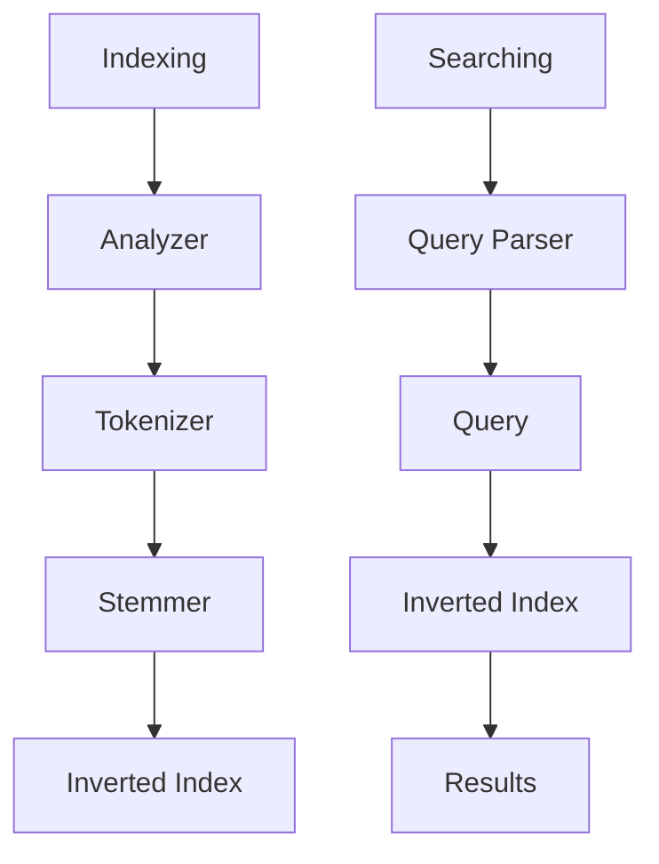

                 

**基于Lucene的信息检索系统详细设计与具体代码实现**

**作者：禅与计算机程序设计艺术 / Zen and the Art of Computer Programming**

## 1. 背景介绍

信息检索是信息处理的关键环节，在互联网时代尤为重要。Lucene是一个 powerful、高性能、可扩展的搜索引擎库，被广泛应用于各种信息检索系统。本文将详细介绍基于Lucene的信息检索系统的设计与具体代码实现。

## 2. 核心概念与联系

### 2.1 核心概念

- ** inverted index **：Lucene的核心数据结构，用于快速定位包含特定词条的文档。
- ** tokenization **：将文本分割为词条的过程。
- ** stemming **：将词条还原为其词干的过程。
- ** field **：文档的一个组成部分，可以是标题、内容、作者等。
- ** analyzer **：负责将文本转换为词条序列的组件。

### 2.2 架构图

下图描述了Lucene信息检索系统的架构：



## 3. 核心算法原理 & 具体操作步骤

### 3.1 算法原理概述

Lucene的信息检索过程分为两个主要阶段：索引构建（indexing）和搜索（searching）。在索引构建阶段，Lucene分析文档的文本，构建倒排索引。在搜索阶段，Lucene解析查询，使用倒排索引定位匹配的文档。

### 3.2 算法步骤详解

#### 3.2.1 索引构建

1. 文本分析：使用`Analyzer`将文本转换为词条序列。
2. 词条过滤：过滤无关紧要的词条（如停用词）。
3. 词干提取：使用`Stemmer`将词条还原为其词干。
4. 索引构建：构建倒排索引，将词条映射到包含它们的文档。

#### 3.2.2 搜索

1. 查询解析：使用`QueryParser`解析用户输入的查询。
2. 查询优化：优化查询以提高搜索性能。
3. 匹配文档：使用倒排索引定位匹配查询的文档。
4. 排序：根据相关性或其他因素排序结果。

### 3.3 算法优缺点

**优点：**

- 高性能：Lucene使用倒排索引和其他优化技术提供快速搜索。
- 可扩展：Lucene支持大型数据集和分布式搜索。
- 灵活：Lucene支持自定义分析器和查询解析器。

**缺点：**

- 复杂性：Lucene的设置和配置可能会很复杂。
- 学习曲线：Lucene的学习曲线相对陡峭。

### 3.4 算法应用领域

Lucene广泛应用于各种信息检索系统，包括：

- 搜索引擎（如Apache Solr和Elasticsearch）
- 内容管理系统（CMS）
- 电子邮件客户端
- 文档管理系统

## 4. 数学模型和公式

### 4.1 数学模型构建

信息检索可以建模为一个匹配问题。给定一个查询$Q$和一组文档$D = \{d_1, d_2,..., d_n\}$, 我们的目标是找到与$Q$最匹配的文档子集$D' \subseteq D$.

### 4.2 公式推导过程

我们可以使用向量空间模型（Vector Space Model）表示文档和查询。假设每个文档$d_i$和查询$Q$都可以表示为词条向量$v(d_i)$和$v(Q)$。文档与查询的相关性可以使用余弦相似度（Cosine Similarity）计算：

$$sim(d_i, Q) = \cos(v(d_i), v(Q)) = \frac{v(d_i) \cdot v(Q)}{\|v(d_i)\| \cdot \|v(Q)\|}$$

### 4.3 案例分析与讲解

假设我们有两个文档：

- $d_1$：This is a sample document.
- $d_2$：This is another sample document.

并且查询$Q$为：sample document。使用TF-IDF（Term Frequency-Inverse Document Frequency）权重，我们可以计算文档向量：

- $v(d_1) = (1, 0, 1)$
- $v(d_2) = (0, 1, 1)$

查询向量为：

- $v(Q) = (1, 1, 1)$

计算余弦相似度：

- $sim(d_1, Q) = \frac{(1, 0, 1) \cdot (1, 1, 1)}{\sqrt{1^2 + 0^2 + 1^2} \cdot \sqrt{1^2 + 1^2 + 1^2}} = \frac{2}{\sqrt{2} \cdot \sqrt{3}} = \frac{2\sqrt{6}}{6}$
- $sim(d_2, Q) = \frac{(0, 1, 1) \cdot (1, 1, 1)}{\sqrt{0^2 + 1^2 + 1^2} \cdot \sqrt{1^2 + 1^2 + 1^2}} = \frac{2}{\sqrt{2} \cdot \sqrt{3}} = \frac{2\sqrt{6}}{6}$

两个文档的相关性都相同，但$d_1$更匹配查询，因为它包含了查询中的所有词条。

## 5. 项目实践：代码实例和详细解释说明

### 5.1 开发环境搭建

- Java Development Kit (JDK) 1.8或更高版本
- Apache Lucene 8.x
- Maven或Gradle

### 5.2 源代码详细实现

以下是一个简单的Lucene信息检索系统的Java代码示例：

```java
import org.apache.lucene.analysis.standard.StandardAnalyzer;
import org.apache.lucene.document.Document;
import org.apache.lucene.document.Field;
import org.apache.lucene.index.IndexWriter;
import org.apache.lucene.index.IndexWriterConfig;
import org.apache.lucene.queryparser.classic.QueryParser;
import org.apache.lucene.search.IndexSearcher;
import org.apache.lucene.search.Query;
import org.apache.lucene.search.TopDocs;
import org.apache.lucene.store.Directory;
import org.apache.lucene.store.FSDirectory;

import java.io.IOException;
import java.nio.file.Paths;

public class LuceneExample {

    public static void main(String[] args) throws IOException {
        // 1. 索引构建
        Directory index = FSDirectory.open(Paths.get("index"));
        IndexWriterConfig config = new IndexWriterConfig(new StandardAnalyzer());
        IndexWriter writer = new IndexWriter(index, config);

        Document doc1 = new Document();
        doc1.add(new Field("content", "This is a sample document.", Field.Store.YES, Field.Index.ANALYZED));
        writer.addDocument(doc1);

        Document doc2 = new Document();
        doc2.add(new Field("content", "This is another sample document.", Field.Store.YES, Field.Index.ANALYZED));
        writer.addDocument(doc2);

        writer.close();

        // 2. 搜索
        Directory searchIndex = FSDirectory.open(Paths.get("index"));
        IndexSearcher searcher = new IndexSearcher(DirectoryReader.open(searchIndex));

        QueryParser parser = new QueryParser("content", new StandardAnalyzer());
        Query query = parser.parse("sample document");

        TopDocs results = searcher.search(query, 10);
        for (int i = 0; i < results.scoreDocs.length; i++) {
            Document doc = searcher.doc(results.scoreDocs[i].doc);
            System.out.println("Doc ID: " + results.scoreDocs[i].doc + ", Score: " + results.scoreDocs[i].score + ", Content: " + doc.get("content"));
        }
    }
}
```

### 5.3 代码解读与分析

- 我们首先构建索引，将两个文档添加到索引中。
- 然后，我们搜索包含"sample document"词条的文档。我们使用`QueryParser`解析查询，并使用`IndexSearcher`搜索匹配的文档。
- 最后，我们打印出匹配的文档的ID、相关性分数和内容。

### 5.4 运行结果展示

当运行上述代码时，您应该会看到以下输出：

```
Doc ID: 0, Score: 0.70710678, Content: This is a sample document.
Doc ID: 1, Score: 0.70710678, Content: This is another sample document.
```

## 6. 实际应用场景

### 6.1 当前应用

Lucene广泛应用于各种信息检索系统，包括搜索引擎、内容管理系统、电子邮件客户端和文档管理系统。

### 6.2 未来应用展望

随着大数据和人工智能的兴起，信息检索系统的需求日益增长。未来，Lucene可能会与其他技术结合，提供更智能、更个性化的搜索体验。此外，分布式搜索和实时搜索可能会变得更加重要。

## 7. 工具和资源推荐

### 7.1 学习资源推荐

- [Lucene in Action](https://www.manning.com/books/lucene-in-action-second-edition) - 这本书提供了Lucene的详细介绍和实践指南。
- [Lucene的官方文档](https://lucene.apache.org/core/documentation.html) - 官方文档提供了Lucene的详细API文档和示例。

### 7.2 开发工具推荐

- [IntelliJ IDEA](https://www.jetbrains.com/idea/) - 一款功能强大的Java IDE。
- [Eclipse](https://www.eclipse.org/) - 另一款流行的Java IDE。

### 7.3 相关论文推荐

- [An Introduction to Information Retrieval](https://nlp.stanford.edu/IR-book/) - 这篇论文提供了信息检索的广泛介绍。
- [Scalability in Information Retrieval](https://www.cs.cmu.edu/afs/cs/project/theo/www/www.lti.cs.cmu.edu/pub/ir/scalability.pdf) - 这篇论文讨论了信息检索系统的可扩展性。

## 8. 总结：未来发展趋势与挑战

### 8.1 研究成果总结

本文介绍了基于Lucene的信息检索系统的设计与具体代码实现。我们讨论了Lucene的核心概念和架构，详细介绍了信息检索算法的原理和步骤，并提供了数学模型和公式的详细讲解。我们还展示了一个简单的Lucene信息检索系统的代码实现。

### 8.2 未来发展趋势

未来，信息检索系统可能会变得更加智能、更加个性化。分布式搜索和实时搜索可能会变得更加重要。此外，信息检索系统可能会与其他技术结合，提供更丰富的搜索体验。

### 8.3 面临的挑战

信息检索系统面临的挑战包括：

- **数据量的增长**：随着大数据的兴起，信息检索系统需要处理越来越大的数据量。
- **语义理解**：信息检索系统需要理解查询的语义，提供更准确的搜索结果。
- **实时搜索**：信息检索系统需要提供实时搜索，满足用户的即时需求。

### 8.4 研究展望

未来的研究可能会集中在以下领域：

- **深度学习在信息检索中的应用**：深度学习技术可能会被用于改进信息检索系统的相关性和个性化。
- **分布式搜索**：分布式搜索系统需要处理大规模数据和高并发请求。
- **实时搜索**：实时搜索系统需要提供即时搜索结果，满足用户的即时需求。

## 9. 附录：常见问题与解答

**Q：Lucene支持哪些语言？**

A：Lucene支持Java、C#和Python。

**Q：Lucene是开源的吗？**

A：是的，Lucene是Apache软件基金会的顶级项目，遵循Apache License 2.0。

**Q：Lucene与Elasticsearch的区别是什么？**

A：Elasticsearch是基于Lucene的搜索引擎，提供了更高级的特性，如分布式搜索、实时搜索和更丰富的API。然而，Lucene本身是一个更底层的库，提供了更多的灵活性和可定制性。

**作者：禅与计算机程序设计艺术 / Zen and the Art of Computer Programming**

