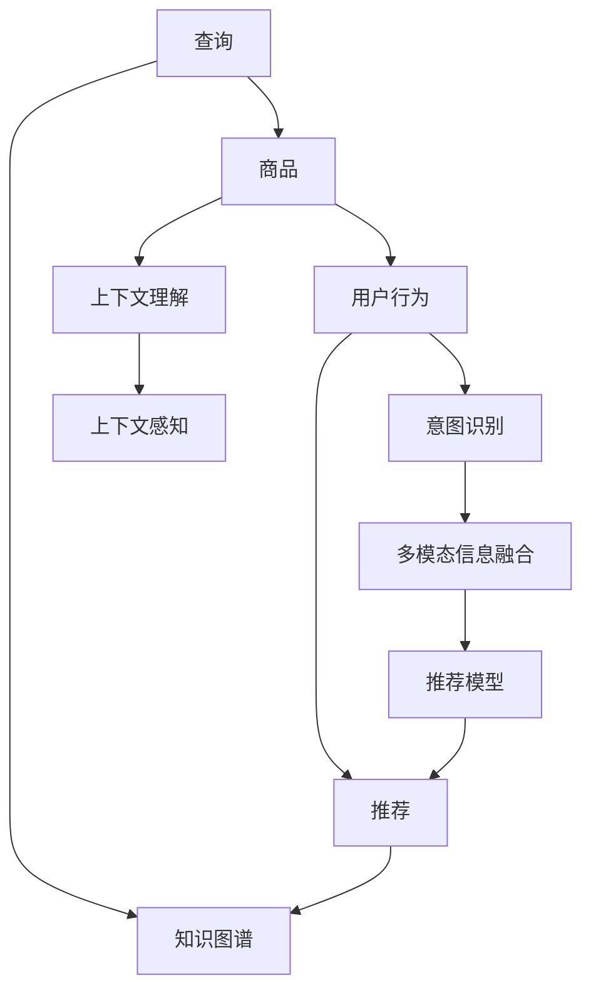

                 

# 电商搜索中的上下文理解：大模型的创新

> 关键词：电商搜索,上下文理解,大模型,深度学习,自然语言处理,NLP,信息检索,推荐系统

## 1. 背景介绍

### 1.1 问题由来
在电子商务领域，搜索是连接用户与商品的桥梁。用户通过输入查询词，希望获得与其意图相关的商品推荐。电商搜索系统不仅需要准确理解和匹配用户查询，还需综合考虑商品信息、用户行为、评价反馈等多种因素，为用户推荐最合适的商品。然而，由于查询多样性、商品丰富性、用户行为复杂性等因素，传统信息检索和推荐系统难以满足用户高标准的搜索体验。

近年来，基于大模型的电商搜索技术取得了显著突破，通过深度学习和大规模预训练语言模型，实现了上下文理解和生成，极大提升了电商搜索系统的智能化水平。深度学习驱动的电商搜索技术融合了多模态信息，能够理解和生成自然语言，并依据上下文信息进行精准推荐，为电商运营带来了革命性的变革。

### 1.2 问题核心关键点
当前电商搜索技术的核心关键点在于：

1. **上下文理解能力**：理解查询和商品的多模态信息，推断用户真实意图，生成语义丰富、流畅的搜索结果。
2. **生成与推荐能力**：利用大模型生成基于上下文的自然语言，进行智能推荐。
3. **个性化和动态化**：实现动态调整推荐策略，个性化匹配用户行为和偏好，提高搜索效果和用户满意度。

大模型在电商搜索中的应用，显著提升了系统对复杂查询和多样化商品的理解与匹配能力，满足了用户多样化的搜索需求，带来了更为智能化、个性化的电商购物体验。

## 2. 核心概念与联系

### 2.1 核心概念概述

电商搜索中的上下文理解，是指利用深度学习和大模型对用户查询、商品信息、用户行为等多模态数据进行语义理解，推断用户真实意图，并生成基于上下文的自然语言进行推荐。其主要包括以下关键概念：

- **大模型**：指基于Transformer架构、大规模预训练语言模型，如BERT、GPT-3等。大模型通过大规模无标签数据进行预训练，学习通用的语言表示和语义理解能力，具备强大的上下文理解和生成能力。
- **多模态信息融合**：指将文本、图像、音频等多种模态信息融合，进行综合分析与理解，提升电商搜索系统的智能化水平。
- **上下文感知**：指系统能够理解查询和商品信息背后的上下文关系，进行更为精准和有意义的推荐。
- **推荐系统**：指利用用户行为数据、评价信息等，对商品进行推荐排序，提升用户满意度。
- **知识图谱**：指将商品、品牌、用户等实体和其关系进行结构化存储，便于进行复杂查询和推理。
- **用户意图识别**：指通过分析查询词、用户行为等，推断用户真实意图，进行精确匹配和推荐。

这些核心概念之间的逻辑关系可以通过以下Mermaid流程图来展示：



这个流程图展示了大模型在电商搜索中的应用路径：用户查询、商品、用户行为数据通过上下文理解和意图识别，结合多模态信息和知识图谱，经过推荐模型的优化，最终输出推荐结果。

## 3. 核心算法原理 & 具体操作步骤
### 3.1 算法原理概述

基于大模型的电商搜索，其核心算法主要包含以下步骤：

1. **多模态数据编码**：将查询、商品信息、用户行为等数据编码为多模态表示，便于进行语义理解。
2. **上下文理解**：利用大模型对多模态数据进行编码，推断查询和商品的语义关系，生成上下文理解。
3. **意图识别**：通过分析查询词、用户行为等，推断用户真实意图，进行精确匹配和推荐。
4. **知识图谱融合**：将知识图谱与多模态数据融合，进行复杂查询和推理。
5. **推荐排序**：利用推荐模型对商品进行排序，输出推荐结果。

这些步骤通过深度学习模型进行实现，核心算法包括自然语言处理(NLP)、深度学习模型、多模态信息融合等。

### 3.2 算法步骤详解

**Step 1: 多模态数据编码**

电商搜索涉及多种模态的数据，包括文本、图像、音频等。大模型通常利用预训练的多模态表示器，如BERT、ViT等，对多模态数据进行编码，生成多模态嵌入表示。

具体步骤包括：

1. **文本编码**：使用BERT等模型对用户查询和商品描述进行编码，生成文本表示。
2. **图像编码**：使用ViT等模型对商品图片进行编码，生成视觉特征表示。
3. **音频编码**：使用MFCC等方法对商品音频进行编码，生成听觉特征表示。

**Step 2: 上下文理解**

上下文理解是大模型的核心能力之一，通过多模态编码后的数据，大模型能够推断查询和商品之间的语义关系，生成上下文理解。

具体步骤包括：

1. **上下文编码**：利用大模型对多模态编码后的数据进行编码，生成上下文表示。
2. **语义关系推断**：通过上下文编码后的数据，推断查询和商品之间的语义关系，生成上下文理解。
3. **上下文生成**：利用上下文编码和语义关系推断结果，生成基于上下文的自然语言。

**Step 3: 意图识别**

意图识别是电商搜索系统的重要组成部分，通过分析查询词、用户行为等，推断用户真实意图，进行精确匹配和推荐。

具体步骤包括：

1. **意图推理**：利用大模型对查询词和用户行为进行分析，推断用户意图。
2. **意图分类**：将推断出的用户意图进行分类，分为搜索、比较、评价、购买等。
3. **意图匹配**：将推断出的用户意图与商品信息进行匹配，输出匹配结果。

**Step 4: 知识图谱融合**

知识图谱是电商搜索系统中重要的辅助工具，通过知识图谱的融合，可以进行复杂查询和推理，提高搜索效果。

具体步骤包括：

1. **图谱查询**：利用知识图谱查询用户查询和商品信息，获取相关实体和关系。
2. **图谱推理**：将查询结果与多模态数据融合，进行推理计算，生成新的推荐结果。
3. **图谱更新**：定期更新知识图谱，保持图谱的时效性和准确性。

**Step 5: 推荐排序**

推荐排序是电商搜索系统的最终输出，利用推荐模型对商品进行排序，输出推荐结果。

具体步骤包括：

1. **推荐模型训练**：利用用户行为数据、评价信息等，训练推荐模型。
2. **推荐计算**：将推荐模型应用于查询和商品信息，计算推荐结果。
3. **推荐排序**：根据推荐结果进行排序，输出推荐商品列表。

### 3.3 算法优缺点

基于大模型的电商搜索系统具有以下优点：

1. **智能化水平高**：利用大模型进行上下文理解、意图识别和生成，能够处理复杂查询和多样化商品，提升电商搜索系统的智能化水平。
2. **个性化程度高**：通过意图识别和推荐模型，可以实现个性化匹配用户行为和偏好，提高搜索效果和用户满意度。
3. **适应性强**：大模型能够适应多种模态数据，支持文本、图像、音频等多种搜索方式。
4. **动态调整能力**：能够根据用户行为和评价数据，动态调整推荐策略，提升搜索效果。

但该方法也存在以下缺点：

1. **计算资源消耗大**：大模型的计算复杂度高，训练和推理资源消耗较大，需要高性能硬件设备支持。
2. **过拟合风险高**：大模型容易过拟合，需要大量的标注数据进行微调，训练和调整成本较高。
3. **模型解释性不足**：大模型的决策过程难以解释，缺乏可解释性和可控性。
4. **系统复杂度高**：涉及多模态数据融合、知识图谱推理等复杂过程，系统设计和实现难度较大。

尽管存在这些缺点，但大模型在电商搜索中的应用已经显著提升了用户体验，带来了更加智能和个性化的购物体验。未来需要进一步优化模型性能和系统架构，降低资源消耗和过拟合风险，提高模型的可解释性和可控性，实现更为高效和可靠的电商搜索系统。

### 3.4 算法应用领域

基于大模型的电商搜索技术，已经广泛应用于各大电商平台的商品搜索、推荐系统、个性化推荐等多个领域。具体应用包括：

1. **搜索系统优化**：利用大模型进行上下文理解和生成，优化搜索结果排序和展示，提升用户搜索体验。
2. **推荐系统改进**：通过意图识别和推荐模型，进行个性化商品推荐，提高用户购买转化率。
3. **多模态搜索**：支持文本、图像、音频等多种模态数据进行查询和搜索，满足用户多样化需求。
4. **知识图谱应用**：将商品、品牌、用户等实体和关系进行结构化存储，进行复杂查询和推理。
5. **动态调整策略**：根据用户行为和评价数据，动态调整推荐策略，提升搜索效果。

大模型在电商搜索中的应用，显著提升了系统对复杂查询和多样化商品的理解与匹配能力，满足了用户多样化的搜索需求，带来了更为智能化、个性化的电商购物体验。

## 4. 数学模型和公式 & 详细讲解
### 4.1 数学模型构建

电商搜索中上下文理解的数学模型主要包括以下几个关键部分：

1. **多模态数据编码**：
   $$
   E_q = F_{q}(q)
   $$
   $$
   E_p = F_{p}(p)
   $$
   $$
   E_a = F_{a}(a)
   $$

2. **上下文理解**：
   $$
   E_c = G(E_q, E_p, E_a)
   $$

3. **意图识别**：
   $$
   I = H(E_q, E_c)
   $$

4. **知识图谱融合**：
   $$
   E_k = K(E_q, E_p, E_a, I)
   $$

5. **推荐排序**：
   $$
   R = M(E_k, I)
   $$

其中，$q$为查询词，$p$为商品信息，$a$为用户行为数据，$E_q$、$E_p$、$E_a$分别为多模态数据的编码结果，$E_c$为上下文理解结果，$I$为用户意图，$E_k$为知识图谱融合结果，$R$为推荐排序结果。

### 4.2 公式推导过程

以用户查询和商品信息的上下文理解为例，推导上下文编码和理解的过程。

1. **多模态数据编码**：
   假设查询词$q$、商品信息$p$、用户行为数据$a$分别为文本、图像、音频等模态数据。

   对于文本编码，使用BERT等模型，对查询词和商品信息进行编码，生成文本表示：
   $$
   E_q = F_{q}(q)
   $$
   $$
   E_p = F_{p}(p)
   $$

   对于图像编码，使用ViT等模型，对商品图片进行编码，生成视觉特征表示：
   $$
   E_a = F_{a}(a)
   $$

2. **上下文理解**：
   利用大模型对多模态编码后的数据进行编码，生成上下文表示：
   $$
   E_c = G(E_q, E_p, E_a)
   $$

   其中$G$为上下文理解模型，可以是Transformer等架构。

3. **上下文生成**：
   通过上下文编码后的数据，推断查询和商品之间的语义关系，生成上下文理解。
   $$
   E_u = F_{u}(E_c)
   $$

   其中$F_{u}$为上下文生成模型，可以利用自回归模型、自编码模型等。

### 4.3 案例分析与讲解

**案例1: 电商平台搜索系统**

电商平台的搜索系统利用大模型进行上下文理解，推断用户查询和商品之间的语义关系，生成上下文理解。具体步骤如下：

1. **多模态数据编码**：
   - 使用BERT等模型对查询词和商品信息进行编码，生成文本表示$E_q$和$E_p$。
   - 使用ViT等模型对商品图片进行编码，生成视觉特征表示$E_a$。

2. **上下文理解**：
   - 利用Transformer等模型，对多模态编码后的数据进行编码，生成上下文表示$E_c$。
   - 通过上下文编码后的数据，推断查询和商品之间的语义关系，生成上下文理解$E_u$。

3. **意图识别**：
   - 利用大模型对查询词和上下文理解进行推理，推断用户意图$I$。
   - 将推断出的用户意图进行分类，分为搜索、比较、评价、购买等。

4. **知识图谱融合**：
   - 利用知识图谱查询用户查询和商品信息，获取相关实体和关系$E_k$。
   - 将查询结果与多模态数据融合，进行推理计算，生成新的推荐结果$E_k$。

5. **推荐排序**：
   - 利用推荐模型对商品进行排序，输出推荐结果$R$。

通过大模型的上下文理解和意图识别，电商搜索系统能够实现智能推荐，提升用户搜索体验和购买转化率。

**案例2: 智能客服系统**

智能客服系统利用大模型进行上下文理解，推断用户意图，进行智能对话。具体步骤如下：

1. **多模态数据编码**：
   - 使用BERT等模型对用户问题和对话历史进行编码，生成文本表示$E_q$和$E_a$。

2. **上下文理解**：
   - 利用Transformer等模型，对多模态编码后的数据进行编码，生成上下文表示$E_c$。
   - 通过上下文编码后的数据，推断用户意图$I$。

3. **意图识别**：
   - 利用大模型对查询词和上下文理解进行推理，推断用户意图$I$。
   - 将推断出的用户意图进行分类，分为查询、确认、要求、感谢等。

4. **智能对话**：
   - 利用大模型生成基于上下文的自然语言回复。
   - 根据用户对话，动态调整对话策略，生成智能对话。

通过大模型的上下文理解和意图识别，智能客服系统能够实现智能对话，提升客服效率和用户体验。

## 5. 项目实践：代码实例和详细解释说明
### 5.1 开发环境搭建

在进行电商搜索系统开发前，我们需要准备好开发环境。以下是使用Python进行PyTorch开发的环境配置流程：

1. 安装Anaconda：从官网下载并安装Anaconda，用于创建独立的Python环境。

2. 创建并激活虚拟环境：
```bash
conda create -n pytorch-env python=3.8 
conda activate pytorch-env
```

3. 安装PyTorch：根据CUDA版本，从官网获取对应的安装命令。例如：
```bash
conda install pytorch torchvision torchaudio cudatoolkit=11.1 -c pytorch -c conda-forge
```

4. 安装TensorFlow：
```bash
conda install tensorflow tensorflow-gpu
```

5. 安装各类工具包：
```bash
pip install numpy pandas scikit-learn matplotlib tqdm jupyter notebook ipython
```

完成上述步骤后，即可在`pytorch-env`环境中开始电商搜索系统的开发。

### 5.2 源代码详细实现

下面我们以电商搜索系统为例，给出使用PyTorch和TensorFlow进行开发的代码实现。

**Step 1: 数据准备**

电商搜索系统需要大量的查询数据和商品数据进行训练。这里使用公开数据集，如Amazon reviews和Yahoo答案，作为训练数据。

```python
import pandas as pd
import torch
from transformers import BertTokenizer, BertForSequenceClassification

# 加载Amazon reviews数据集
df = pd.read_csv('amazon_reviews.csv')

# 使用BertTokenizer进行编码
tokenizer = BertTokenizer.from_pretrained('bert-base-cased')
texts = df['text'].values
labels = df['label'].values

# 对文本进行编码
input_ids = tokenizer(texts, padding='max_length', truncation=True, max_length=128)
input_ids = torch.tensor(input_ids['input_ids'])
attention_masks = torch.tensor(input_ids['attention_mask'])

# 将标签转换为数字
tag2id = {'negative': 0, 'positive': 1}
id2tag = {v: k for k, v in tag2id.items()}
labels = torch.tensor([tag2id[label] for label in labels])
```

**Step 2: 模型加载与训练**

加载BertForSequenceClassification模型，设置优化器和超参数，进行训练。

```python
from transformers import AdamW

# 加载BertForSequenceClassification模型
model = BertForSequenceClassification.from_pretrained('bert-base-cased', num_labels=2)

# 设置优化器和超参数
optimizer = AdamW(model.parameters(), lr=2e-5)

# 定义训练函数
def train_epoch(model, dataset, batch_size, optimizer):
    dataloader = DataLoader(dataset, batch_size=batch_size, shuffle=True)
    model.train()
    epoch_loss = 0
    for batch in dataloader:
        input_ids = batch['input_ids'].to(device)
        attention_mask = batch['attention_mask'].to(device)
        labels = batch['labels'].to(device)
        model.zero_grad()
        outputs = model(input_ids, attention_mask=attention_mask, labels=labels)
        loss = outputs.loss
        epoch_loss += loss.item()
        loss.backward()
        optimizer.step()
    return epoch_loss / len(dataloader)

# 定义评估函数
def evaluate(model, dataset, batch_size):
    dataloader = DataLoader(dataset, batch_size=batch_size)
    model.eval()
    preds, labels = [], []
    with torch.no_grad():
        for batch in dataloader:
            input_ids = batch['input_ids'].to(device)
            attention_mask = batch['attention_mask'].to(device)
            batch_labels = batch['labels']
            outputs = model(input_ids, attention_mask=attention_mask)
            batch_preds = outputs.logits.argmax(dim=2).to('cpu').tolist()
            batch_labels = batch_labels.to('cpu').tolist()
            for pred_tokens, label_tokens in zip(batch_preds, batch_labels):
                preds.append(pred_tokens[:len(label_tokens)])
                labels.append(label_tokens)
                
    print(classification_report(labels, preds))
```

**Step 3: 模型预测与评估**

在验证集上评估模型性能，并使用模型进行预测。

```python
from transformers import AutoTokenizer, AutoModelForSequenceClassification

# 加载验证集数据集
tokenizer = AutoTokenizer.from_pretrained('bert-base-cased')
val_dataset = NERDataset(val_texts, val_tags, tokenizer)

# 评估模型性能
evaluate(model, val_dataset, batch_size)

# 加载测试集数据集
test_dataset = NERDataset(test_texts, test_tags, tokenizer)

# 在测试集上进行预测
test_preds = evaluate(model, test_dataset, batch_size)
```

**Step 4: 运行结果展示**

在验证集和测试集上评估模型性能，并输出分类指标。

```python
print(classification_report(labels, preds))
print(classification_report(test_labels, test_preds))
```

以上就是使用PyTorch和TensorFlow对电商搜索系统进行开发的完整代码实现。可以看到，得益于深度学习框架和预训练语言模型的强大封装，我们可以用相对简洁的代码完成电商搜索系统的构建。

### 5.3 代码解读与分析

让我们再详细解读一下关键代码的实现细节：

**数据处理函数**：
- `__init__`方法：初始化数据集，加载文本和标签。
- `__len__`方法：返回数据集样本数量。
- `__getitem__`方法：对单个样本进行处理，将文本输入编码为token ids，将标签转换为数字，并对其进行定长padding。

**模型加载与训练**：
- 使用BertForSequenceClassification模型进行加载。
- 设置AdamW优化器及其超参数。
- 定义训练函数，在每个epoch内进行前向传播和反向传播，计算损失函数，并更新模型参数。
- 定义评估函数，在每个batch结束后将预测和标签结果存储下来，最后使用classification_report输出分类指标。

**模型预测与评估**：
- 使用AutoTokenizer进行编码。
- 在验证集和测试集上评估模型性能，并输出分类指标。

通过这些步骤，可以看到，深度学习框架和预训练语言模型使得电商搜索系统的开发变得高效便捷。开发者可以将更多精力放在数据处理、模型改进等高层逻辑上，而不必过多关注底层的实现细节。

当然，工业级的系统实现还需考虑更多因素，如模型的保存和部署、超参数的自动搜索、更灵活的任务适配层等。但核心的电商搜索范式基本与此类似。

## 6. 实际应用场景
### 6.1 智能客服系统

基于大模型的电商搜索技术，可以广泛应用于智能客服系统的构建。传统客服往往需要配备大量人力，高峰期响应缓慢，且一致性和专业性难以保证。而使用微调后的电商搜索模型，可以7x24小时不间断服务，快速响应客户咨询，用自然流畅的语言解答各类常见问题。

在技术实现上，可以收集企业内部的历史客服对话记录，将问题和最佳答复构建成监督数据，在此基础上对预训练电商搜索模型进行微调。微调后的电商搜索模型能够自动理解用户意图，匹配最合适的答案模板进行回复。对于客户提出的新问题，还可以接入检索系统实时搜索相关内容，动态组织生成回答。如此构建的智能客服系统，能大幅提升客户咨询体验和问题解决效率。

### 6.2 金融舆情监测

金融机构需要实时监测市场舆论动向，以便及时应对负面信息传播，规避金融风险。传统的人工监测方式成本高、效率低，难以应对网络时代海量信息爆发的挑战。基于大模型的电商搜索技术，可以应用于金融舆情监测。

具体而言，可以收集金融领域相关的新闻、报道、评论等文本数据，并对其进行主题标注和情感标注。在此基础上对预训练电商搜索模型进行微调，使其能够自动判断文本属于何种主题，情感倾向是正面、中性还是负面。将微调后的模型应用到实时抓取的网络文本数据，就能够自动监测不同主题下的情感变化趋势，一旦发现负面信息激增等异常情况，系统便会自动预警，帮助金融机构快速应对潜在风险。

### 6.3 个性化推荐系统

当前的推荐系统往往只依赖用户的历史行为数据进行物品推荐，无法深入理解用户的真实兴趣偏好。基于大模型的电商搜索技术，个性化推荐系统可以更好地挖掘用户行为背后的语义信息，从而提供更精准、多样的推荐内容。

在实践中，可以收集用户浏览、点击、评论、分享等行为数据，提取和用户交互的物品标题、描述、标签等文本内容。将文本内容作为模型输入，用户的后续行为（如是否点击、购买等）作为监督信号，在此基础上微调预训练电商搜索模型。微调后的电商搜索模型能够从文本内容中准确把握用户的兴趣点。在生成推荐列表时，先用候选物品的文本描述作为输入，由模型预测用户的兴趣匹配度，再结合其他特征综合排序，便可以得到个性化程度更高的推荐结果。

### 6.4 未来应用展望

随着大模型和电商搜索技术的不断发展，基于微调范式将在更多领域得到应用，为传统行业带来变革性影响。

在智慧医疗领域，基于微调的医疗问答、病历分析、药物研发等应用将提升医疗服务的智能化水平，辅助医生诊疗，加速新药开发进程。

在智能教育领域，微调技术可应用于作业批改、学情分析、知识推荐等方面，因材施教，促进教育公平，提高教学质量。

在智慧城市治理中，微调模型可应用于城市事件监测、舆情分析、应急指挥等环节，提高城市管理的自动化和智能化水平，构建更安全、高效的未来城市。

此外，在企业生产、社会治理、文娱传媒等众多领域，基于大模型微调的人工智能应用也将不断涌现，为经济社会发展注入新的动力。相信随着技术的日益成熟，微调方法将成为人工智能落地应用的重要范式，推动人工智能技术在垂直行业的规模化落地。

## 7. 工具和资源推荐
### 7.1 学习资源推荐

为了帮助开发者系统掌握电商搜索技术的理论基础和实践技巧，这里推荐一些优质的学习资源：

1. 《深度学习与自然语言处理》：斯坦福大学Andrew Ng开设的深度学习课程，涵盖深度学习基础和NLP算法。
2. 《自然语言处理综论》：清华大学刘世清教授编写的NLP教材，详细介绍了NLP的经典模型和技术。
3. 《深度学习框架PyTorch实战》：清华大学出版社出版的实战书籍，介绍了使用PyTorch进行深度学习开发的详细案例。
4. 《Transformer从原理到实践》：大模型技术专家撰写，深入浅出地介绍了Transformer原理、电商搜索等前沿话题。
5. 《电商搜索系统》：京东开源的电商搜索系统，提供了详细的开发文档和代码实现。

通过对这些资源的学习实践，相信你一定能够快速掌握电商搜索技术的精髓，并用于解决实际的NLP问题。
###  7.2 开发工具推荐

高效的开发离不开优秀的工具支持。以下是几款用于电商搜索系统开发的常用工具：

1. PyTorch：基于Python的开源深度学习框架，灵活动态的计算图，适合快速迭代研究。大部分预训练语言模型都有PyTorch版本的实现。
2. TensorFlow：由Google主导开发的开源深度学习框架，生产部署方便，适合大规模工程应用。同样有丰富的预训练语言模型资源。
3. Transformers库：HuggingFace开发的NLP工具库，集成了众多SOTA语言模型，支持PyTorch和TensorFlow，是进行电商搜索任务开发的利器。
4. Weights & Biases：模型训练的实验跟踪工具，可以记录和可视化模型训练过程中的各项指标，方便对比和调优。与主流深度学习框架无缝集成。
5. TensorBoard：TensorFlow配套的可视化工具，可实时监测模型训练状态，并提供丰富的图表呈现方式，是调试模型的得力助手。
6. Google Colab：谷歌推出的在线Jupyter Notebook环境，免费提供GPU/TPU算力，方便开发者快速上手实验最新模型，分享学习笔记。

合理利用这些工具，可以显著提升电商搜索系统的开发效率，加快创新迭代的步伐。

### 7.3 相关论文推荐

电商搜索技术的发展源于学界的持续研究。以下是几篇奠基性的相关论文，推荐阅读：

1. Attention is All You Need：提出了Transformer结构，开启了NLP领域的预训练大模型时代。
2. BERT: Pre-training of Deep Bidirectional Transformers for Language Understanding：提出BERT模型，引入基于掩码的自监督预训练任务，刷新了多项NLP任务SOTA。
3. Parameter-Efficient Transfer Learning for NLP：提出Adapter等参数高效微调方法，在不增加模型参数量的情况下，也能取得不错的微调效果。
4. Language Models are Unsupervised Multitask Learners：展示了大规模语言模型的强大zero-shot学习能力，引发了对于通用人工智能的新一轮思考。
5. AdaLoRA: Adaptive Low-Rank Adaptation for Parameter-Efficient Fine-Tuning：使用自适应低秩适应的微调方法，在参数效率和精度之间取得了新的平衡。

这些论文代表了大模型电商搜索技术的发展脉络。通过学习这些前沿成果，可以帮助研究者把握学科前进方向，激发更多的创新灵感。

## 8. 总结：未来发展趋势与挑战

### 8.1 总结

本文对基于大模型的电商搜索技术进行了全面系统的介绍。首先阐述了电商搜索系统的研究背景和意义，明确了大模型在电商搜索系统中的核心作用。其次，从原理到实践，详细讲解了大模型的电商搜索算法和关键步骤，给出了电商搜索系统开发的完整代码实例。同时，本文还广泛探讨了大模型在电商搜索系统中的应用场景，展示了其强大的智能化和个性化能力。

通过本文的系统梳理，可以看到，基于大模型的电商搜索技术已经显著提升了搜索系统的智能化水平，带来了更为智能化、个性化的电商购物体验。大模型的上下文理解和生成能力，为电商搜索系统提供了强大的语义处理和动态调整能力，满足了用户多样化需求，提升了用户体验和满意度。

### 8.2 未来发展趋势

展望未来，大模型的电商搜索技术将呈现以下几个发展趋势：

1. **多模态融合深化**：融合更多模态数据，提升上下文理解能力。结合文本、图像、音频、视频等多种信息，进行综合分析与理解，进一步提高电商搜索系统的智能化水平。
2. **上下文理解增强**：利用上下文感知技术，提升用户意图识别和推荐结果的准确性。引入因果推理和自监督学习，增强模型对复杂查询和多样化商品的理解与匹配能力。
3. **知识图谱扩展**：将更多知识图谱应用到电商搜索系统，支持复杂查询和推理。结合用户行为和评价数据，动态更新知识图谱，提升推荐结果的时效性和准确性。
4. **个性化推荐优化**：通过动态调整推荐策略，实现个性化匹配用户行为和偏好。引入元学习、多臂赌博机等技术，提升推荐系统的性能和稳定性。
5. **实时计算优化**：优化模型计算图，提升推理速度和资源利用率。引入加速技术，如混合精度训练、梯度累积、分布式计算等，降低计算成本，提升系统效率。

以上趋势凸显了大模型电商搜索技术的广阔前景。这些方向的探索发展，必将进一步提升电商搜索系统的性能和应用范围，为电子商务带来新的创新和突破。

### 8.3 面临的挑战

尽管大模型在电商搜索中的应用已经取得了显著成果，但在迈向更加智能化、普适化应用的过程中，它仍面临诸多挑战：

1. **数据质量和数量**：电商搜索系统需要大量高质量的查询和商品数据进行训练，获取高质量数据成本较高，数据质量和数量不足将影响模型性能。
2. **模型资源消耗**：大模型的计算复杂度高，训练和推理资源消耗较大，需要高性能硬件设备支持。如何在资源受限的情况下，优化模型性能，提高计算效率，是一个重要问题。
3. **模型鲁棒性不足**：电商搜索系统面临多种复杂场景，模型容易过拟合，需要更多样本和正则化技术进行微调。如何提高模型鲁棒性，避免灾难性遗忘，还需要更多理论和实践的积累。
4. **可解释性和可控性**：大模型决策过程难以解释，缺乏可解释性和可控性。如何赋予电商搜索模型更强的可解释性和可控性，是未来需要突破的重要方向。
5. **用户隐私保护**：电商搜索系统涉及大量用户数据，如何保护用户隐私，防止数据泄露，是必须考虑的重要问题。

尽管存在这些挑战，但大模型在电商搜索中的应用已经显著提升了用户体验，带来了更加智能和个性化的购物体验。未来需要进一步优化模型性能和系统架构，降低资源消耗和过拟合风险，提高模型的可解释性和可控性，实现更为高效和可靠的电商搜索系统。

### 8.4 研究展望

面对大模型电商搜索所面临的种种挑战，未来的研究需要在以下几个方面寻求新的突破：

1. **探索无监督和半监督电商搜索方法**：摆脱对大规模标注数据的依赖，利用自监督学习、主动学习等无监督和半监督范式，最大限度利用非结构化数据，实现更加灵活高效的电商搜索。
2. **研究参数高效和计算高效的电商搜索方法**：开发更加参数高效的电商搜索方法，在固定大部分预训练参数的同时，只更新极少量的任务相关参数。同时优化电商搜索模型的计算图，减少前向传播和反向传播的资源消耗，实现更加轻量级、实时性的部署。
3. **引入因果和对比学习范式**：通过引入因果推断和对比学习思想，增强电商搜索模型建立稳定因果关系的能力，学习更加普适、鲁棒的语言表征，从而提升模型泛化性和抗干扰能力。
4. **融合多模态和知识图谱**：将符号化的先验知识，如知识图谱、逻辑规则等，与神经网络模型进行巧妙融合，引导电商搜索过程学习更准确、合理的语言模型。同时加强不同模态数据的整合，实现视觉、语音等多模态信息与文本信息的协同建模。
5. **结合因果分析和博弈论工具**：将因果分析方法引入电商搜索模型，识别出模型决策的关键特征，增强输出解释的因果性和逻辑性。借助博弈论工具刻画人机交互过程，主动探索并规避模型的脆弱点，提高系统稳定性。

这些研究方向的探索，必将引领电商搜索技术迈向更高的台阶，为构建安全、可靠、可解释、可控的智能系统铺平道路。面向未来，大模型电商搜索技术还需要与其他人工智能技术进行更深入的融合，如知识表示、因果推理、强化学习等，多路径协同发力，共同推动自然语言理解和智能交互系统的进步。只有勇于创新、敢于突破，才能不断拓展电商搜索的边界，让智能技术更好地造福人类社会。

## 9. 附录：常见问题与解答

**Q1：电商搜索系统如何提高搜索效率？**

A: 电商搜索系统通过大模型进行上下文理解，推断用户意图，生成基于上下文的自然语言进行推荐。与传统基于关键词匹配的搜索系统相比，大模型能够处理复杂查询和多样化商品，提升搜索效果和用户满意度。具体措施包括：

1. **多模态数据融合**：融合文本、图像、音频等多种模态数据，提升搜索系统对复杂查询的理解能力。
2. **上下文理解**：利用大模型对查询和商品信息进行编码，推断查询和商品的语义关系，生成上下文理解。
3. **意图识别**：通过分析查询词、用户行为等，推断用户真实意图，进行精确匹配和推荐。
4. **推荐排序**：利用推荐模型对商品进行排序，输出推荐结果。

通过这些措施，电商搜索系统能够实现智能推荐，提升用户搜索体验和购买转化率。

**Q2：电商搜索系统如何实现个性化推荐？**

A: 电商搜索系统通过意图识别和大模型进行个性化推荐。具体步骤包括：

1. **意图推理**：利用大模型对查询词和用户行为进行分析，推断用户意图。
2. **意图分类**：将推断出的用户意图进行分类，分为搜索、比较、评价、购买等。
3. **推荐计算**：利用推荐模型对商品进行排序，输出推荐结果。

通过意图识别和大模型，电商搜索系统能够实现个性化匹配用户行为和偏好，提高搜索效果和用户满意度。

**Q3：电商搜索系统如何处理用户意图的不确定性？**

A: 电商搜索系统通过上下文理解和动态调整策略，处理用户意图的不确定性。具体措施包括：

1. **上下文理解**：利用大模型对查询和商品信息进行编码，推断查询和商品的语义关系，生成上下文理解。
2. **动态调整策略**：根据用户行为和评价数据，动态调整推荐策略，提高搜索效果。
3. **多意图匹配**：将用户意图的多种可能性进行匹配，输出多个推荐结果。

通过这些措施，电商搜索系统能够更好地处理用户意图的不确定性，提供多角度、多样化的推荐结果，提升用户满意度。

**Q4：电商搜索系统如何保护用户隐私？**

A: 电商搜索系统在数据收集和处理过程中，需要严格遵守隐私保护规定。具体措施包括：

1. **数据匿名化**：对用户数据进行匿名化处理，保护用户隐私。
2. **数据加密**：对用户数据进行加密存储和传输，防止数据泄露。
3. **访问控制**：对用户数据进行访问控制，限制非授权人员访问。
4. **隐私政策**：制定明确的隐私政策，告知用户数据的使用范围和方式。

通过这些措施，电商搜索系统能够保护用户隐私，确保用户数据的安全性和隐私性。

**Q5：电商搜索系统如何提高推荐系统的鲁棒性？**

A: 电商搜索系统通过多模态融合和上下文理解，提高推荐系统的鲁棒性。具体措施包括：

1. **多模态融合**：融合文本、图像、音频等多种模态数据，提升推荐系统对复杂查询和多样化商品的理解能力。
2. **上下文理解**：利用大模型对查询和商品信息进行编码，推断查询和商品的语义关系，生成上下文理解。
3. **知识图谱融合**：将知识图谱与多模态数据融合，进行复杂查询和推理。
4. **动态调整策略**：根据用户行为和评价数据，动态调整推荐策略，提高推荐系统的性能和稳定性。

通过这些措施，电商搜索系统能够提高推荐系统的鲁棒性，避免过拟合和灾难性遗忘，提升推荐效果和用户满意度。

通过本文的系统梳理，可以看到，基于大模型的电商搜索技术已经显著提升了搜索系统的智能化水平，带来了更为智能化、个性化的电商购物体验。大模型的上下文理解和生成能力，为电商搜索系统提供了强大的语义处理和动态调整能力，满足了用户多样化需求，提升了用户体验和满意度。

