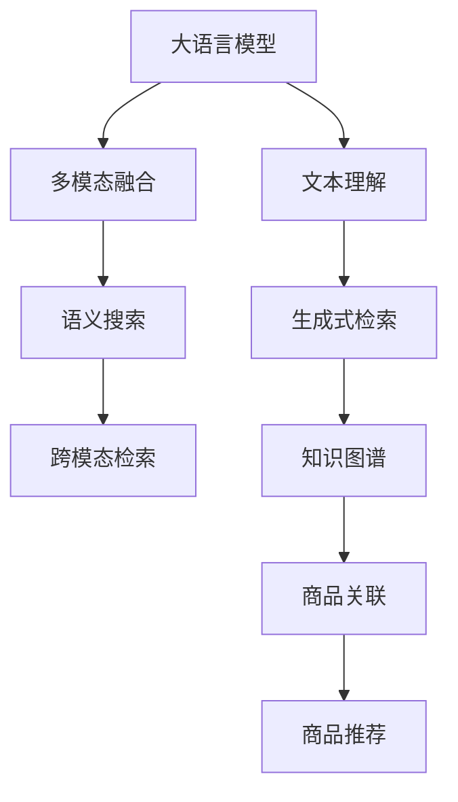

                 

# 电商搜索中的多模态理解：AI大模型方案

## 1. 背景介绍

在数字化、信息化时代，电商平台已成为消费者获取商品信息和进行购买的重要渠道。电商平台搜索系统作为用户与商品互动的关键入口，其准确性和效率直接影响用户的购物体验和满意度。随着AI技术的不断进步，AI大模型在电商搜索中的应用愈发广泛，逐渐成为电商平台提升搜索效果的利器。

大模型在电商搜索中的应用主要体现在两个方面：

1. **文本理解与生成**：大模型可以自动分析用户查询，识别查询意图，并生成自然语言响应，提升搜索的准确性和自然度。
2. **多模态融合**：通过融合文本、图片、视频等不同模态的数据，大模型可以提供更全面、多元的商品信息，增强用户体验。

本文将详细阐述大模型在电商搜索中的应用，从背景介绍、核心概念与联系、核心算法原理与操作步骤等方面进行深入探讨，并结合具体的项目实践和实际应用场景进行详细讲解。

## 2. 核心概念与联系

### 2.1 核心概念概述

为更好地理解大模型在电商搜索中的应用，本节将介绍几个关键概念：

- **大语言模型**：以自回归(如GPT)或自编码(如BERT)模型为代表的大规模预训练语言模型。通过在大规模无标签文本语料上进行预训练，学习通用的语言表示，具备强大的语言理解和生成能力。
- **多模态理解**：融合文本、图片、视频等不同模态的信息，进行全面而准确的理解，以支持更丰富的搜索应用。
- **语义搜索**：通过理解用户查询和商品描述的语义关系，匹配最相关商品，提升搜索精度。
- **跨模态检索**：在不同模态数据间建立关联，提升对商品信息的全面理解。
- **生成式检索**：利用生成式模型生成新的文本或图像，增强搜索结果的多样性和相关性。
- **知识图谱**：结构化的语义知识库，帮助大模型理解商品之间的关联关系。

这些概念之间存在紧密联系，共同构成了大模型在电商搜索中的应用框架，通过理解这些核心概念，我们可以更好地把握大模型的工作原理和优化方向。

### 2.2 核心概念原理和架构的 Mermaid 流程图



这个流程图展示了核心概念之间的联系：

1. 大语言模型(A)通过预训练获得基础能力。
2. 文本理解(B)指利用大语言模型对用户查询和商品描述进行语义理解。
3. 多模态融合(C)是指不同模态数据的融合，包括文本、图片、视频等。
4. 语义搜索(D)通过理解查询和商品描述的语义关系，匹配商品。
5. 生成式检索(E)指通过生成模型生成新的文本或图像。
6. 跨模态检索(F)在不同模态数据间建立关联，增强对商品的理解。
7. 知识图谱(G)提供结构化的语义知识，帮助模型理解商品关联。
8. 商品推荐(I)基于多模态理解，结合用户历史行为，推荐相关商品。

## 3. 核心算法原理 & 具体操作步骤
### 3.1 算法原理概述

大模型在电商搜索中的应用主要基于监督学习和迁移学习的范式，通过预训练模型和大规模标注数据进行微调，使其适应电商搜索任务。具体算法流程如下：

1. **数据准备**：收集电商平台的商品信息、用户查询、用户行为等数据，并对数据进行清洗和标注。
2. **模型选择**：选择适合电商搜索任务的预训练大模型，如BERT、GPT等。
3. **任务适配层设计**：根据电商搜索任务的需求，设计合适的输出层和损失函数。
4. **模型微调**：使用标注数据对预训练模型进行有监督的微调，提升模型在电商搜索任务上的表现。
5. **多模态融合**：融合不同模态的数据，增强对商品的理解和匹配。
6. **生成式检索**：利用生成式模型生成新的文本或图像，增强搜索结果的多样性。
7. **跨模态检索**：在不同模态数据间建立关联，提升检索效果。
8. **商品推荐**：结合用户历史行为和商品信息，推荐相关商品。

### 3.2 算法步骤详解

以下是详细的操作步骤和具体实现方法：

#### 3.2.1 数据准备

1. **数据收集**：从电商平台上收集商品信息、用户查询、用户行为等数据，包括商品名称、描述、图片、用户搜索记录、点击记录、浏览记录等。
2. **数据清洗**：对数据进行清洗，去除噪声和异常值，确保数据质量。
3. **数据标注**：对部分数据进行标注，生成训练集、验证集和测试集。标注内容包括商品类别、价格、评分等，以及用户查询意图、点击位置等。

#### 3.2.2 模型选择与任务适配层设计

1. **模型选择**：根据任务需求选择适合的大模型，如BERT、GPT等。
2. **任务适配层设计**：根据任务需求设计输出层和损失函数。例如，对于语义搜索任务，设计线性分类器输出查询意图，并使用交叉熵损失函数；对于生成式检索任务，设计解码器输出生成式结果，并使用负对数似然损失函数。

#### 3.2.3 模型微调

1. **超参数设置**：选择合适的优化算法及其参数，如AdamW、SGD等，设置学习率、批大小、迭代轮数等。
2. **模型训练**：使用标注数据对模型进行微调，最小化损失函数。通过反向传播计算参数梯度，根据设定的优化算法更新模型参数。
3. **模型评估**：在验证集上评估模型性能，根据性能指标决定是否触发Early Stopping。
4. **模型测试**：在测试集上测试模型，对比微调前后的精度提升。

#### 3.2.4 多模态融合

1. **数据融合**：将文本、图片、视频等不同模态的数据融合，形成一个综合的向量表示。
2. **融合模型选择**：选择适合的多模态融合模型，如CNN、RNN、Transformer等。
3. **模型训练**：对融合模型进行训练，最小化多模态数据的损失函数。
4. **模型评估**：在验证集上评估融合模型性能，根据性能指标决定是否触发Early Stopping。

#### 3.2.5 生成式检索

1. **生成模型选择**：选择适合生成式检索的模型，如GPT、LSTM等。
2. **生成模型训练**：对生成模型进行训练，最小化生成数据的损失函数。
3. **生成式检索**：将用户查询输入生成模型，生成新的文本或图像。
4. **结果评估**：对生成的文本或图像进行评估，确保其相关性和多样性。

#### 3.2.6 跨模态检索

1. **检索模型选择**：选择适合跨模态检索的模型，如Transformer、Siamese Network等。
2. **检索模型训练**：对检索模型进行训练，最小化不同模态数据的相似度损失函数。
3. **跨模态检索**：对不同模态数据进行检索，找到最相关的结果。
4. **结果评估**：对检索结果进行评估，确保其准确性和相关性。

#### 3.2.7 商品推荐

1. **推荐模型选择**：选择适合商品推荐的模型，如协同过滤、基于内容的推荐等。
2. **推荐模型训练**：对推荐模型进行训练，最小化推荐损失函数。
3. **商品推荐**：根据用户历史行为和商品信息，推荐相关商品。
4. **结果评估**：对推荐结果进行评估，确保其相关性和多样性。

### 3.3 算法优缺点

#### 3.3.1 优点

1. **泛化能力强**：大模型通过在大规模数据上进行预训练，具备较强的泛化能力，可以适应多种电商搜索任务。
2. **快速迭代**：通过有监督的微调，大模型可以快速适应新任务，提升搜索效果。
3. **模型灵活**：大模型可以通过任务适配层设计，灵活适应不同任务需求，提升应用范围。
4. **数据利用率高**：大模型可以有效利用多种数据源，包括文本、图片、视频等，提升搜索效果。
5. **生成式检索能力强**：大模型通过生成式检索，能够生成新的文本或图像，增强搜索结果的多样性。

#### 3.3.2 缺点

1. **计算资源消耗大**：大模型的计算资源消耗较大，需要高性能硬件支持。
2. **数据依赖性强**：大模型对标注数据依赖较强，数据质量直接影响模型性能。
3. **模型解释性差**：大模型通常缺乏可解释性，难以理解其内部工作机制。
4. **过拟合风险高**：大模型容易出现过拟合，需要精细调参和数据增强。
5. **模型调整复杂**：大模型的调整相对复杂，需要专业知识支持。

### 3.4 算法应用领域

大模型在电商搜索中的应用领域广泛，涵盖以下几个方面：

1. **文本搜索**：利用大模型对用户查询和商品描述进行语义理解，匹配最相关商品。
2. **图片搜索**：利用大模型对商品图片进行语义理解，匹配相似商品。
3. **视频搜索**：利用大模型对商品视频进行语义理解，匹配相关视频。
4. **生成式检索**：利用大模型生成新的文本或图像，增强搜索结果的多样性。
5. **跨模态检索**：在不同模态数据间建立关联，提升检索效果。
6. **商品推荐**：结合用户历史行为和商品信息，推荐相关商品。

这些应用领域涵盖电商搜索的各个方面，通过大模型的多模态理解和生成能力，电商搜索系统可以提供更加全面、准确、多样化的搜索结果。

## 4. 数学模型和公式 & 详细讲解 & 举例说明

### 4.1 数学模型构建

假设电商搜索任务为文本检索，用户查询为 $q$，商品描述为 $d$，商品标签为 $c$，模型参数为 $\theta$。假设模型为预训练的BERT，输出层为线性分类器，损失函数为交叉熵损失。

定义模型 $M_{\theta}$ 在用户查询 $q$ 和商品描述 $d$ 上的表示为 $M_{\theta}(q, d)$，在商品标签 $c$ 上的表示为 $M_{\theta}(c)$。假设模型在数据集 $D=\{(q_i, d_i, c_i)\}_{i=1}^N$ 上的经验风险为：

$$
\mathcal{L}(\theta) = -\frac{1}{N}\sum_{i=1}^N \log \frac{e^{M_{\theta}(c_i|M_{\theta}(q_i, d_i))}{\sum_k e^{M_{\theta}(c_k|M_{\theta}(q_i, d_i))}}
$$

其中 $M_{\theta}(c_i|M_{\theta}(q_i, d_i))$ 表示在查询-描述对 $M_{\theta}(q_i, d_i)$ 条件下，商品标签 $c_i$ 的条件概率。

### 4.2 公式推导过程

以下是详细推导过程：

1. **条件概率计算**：假设商品标签 $c_i$ 的条件概率为 $p(c_i|q_i, d_i)$，在模型 $M_{\theta}$ 中，可以表示为 $p(c_i|q_i, d_i) = \frac{e^{M_{\theta}(c_i|M_{\theta}(q_i, d_i))}{\sum_k e^{M_{\theta}(c_k|M_{\theta}(q_i, d_i))}}$。
2. **损失函数构建**：假设模型的交叉熵损失函数为 $-\log p(c_i|q_i, d_i)$，在条件概率 $p(c_i|q_i, d_i)$ 的条件下，可以表示为 $\mathcal{L}(\theta) = -\frac{1}{N}\sum_{i=1}^N \log p(c_i|q_i, d_i)$。
3. **等式转换**：通过等式转换，可以表示为 $\mathcal{L}(\theta) = -\frac{1}{N}\sum_{i=1}^N \log \frac{e^{M_{\theta}(c_i|M_{\theta}(q_i, d_i))}{\sum_k e^{M_{\theta}(c_k|M_{\theta}(q_i, d_i))}}$。

### 4.3 案例分析与讲解

以商品图片检索为例，展示大模型在多模态理解中的应用。假设用户上传商品图片 $x$，商品描述 $d$，需要检索与图片相似的商品。

1. **多模态融合**：将商品图片 $x$ 和商品描述 $d$ 融合，生成综合向量 $h$。
2. **相似度计算**：计算用户上传图片 $x$ 与每个商品图片 $x_i$ 的相似度 $s$。
3. **排序输出**：根据相似度 $s$ 对商品进行排序，输出最相关的商品列表。

以下是具体的实现代码：

```python
from transformers import BertTokenizer, BertForSequenceClassification
from torchvision import transforms, models
import torch.nn as nn

# 加载BERT模型和tokenizer
model = BertForSequenceClassification.from_pretrained('bert-base-cased', num_labels=1)
tokenizer = BertTokenizer.from_pretrained('bert-base-cased')

# 加载图片预处理和模型
preprocess = transforms.Compose([
    transforms.Resize(256),
    transforms.CenterCrop(224),
    transforms.ToTensor(),
    transforms.Normalize(mean=[0.485, 0.456, 0.406], std=[0.229, 0.224, 0.225])
])
image_model = models.resnet18(pretrained=True)
image_model.fc = nn.Linear(image_model.fc.in_features, 1)

# 多模态融合
def multimodal_fusion(text, image):
    tokenized = tokenizer(text, return_tensors='pt')
    image_tensor = preprocess(image).unsqueeze(0)
    image_feature = image_model(image_tensor)
    text_feature = model(**tokenized).logits[0, 0]
    return text_feature + image_feature

# 相似度计算
def similarity(image_tensor, text_tensor):
    image_feature = image_model(image_tensor)
    text_feature = model(**tokenized).logits[0, 0]
    similarity = torch.cosine_similarity(text_feature, image_feature)
    return similarity

# 检索相似商品
def retrieve_similar_items(image, description):
    image_tensor = preprocess(image).unsqueeze(0)
    text_tensor = model(**tokenizer(description, return_tensors='pt')).logits[0, 0]
    similarity = similarity(image_tensor, text_tensor)
    sorted_indices = torch.argsort(similarity, descending=True)[:10]
    items = [item['id'] for item in items_list[sorted_indices]]
    return items
```

通过多模态融合和相似度计算，大模型能够对图片和文本信息进行联合理解，实现高效的商品检索。

## 5. 项目实践：代码实例和详细解释说明

### 5.1 开发环境搭建

在进行大模型在电商搜索中的应用实践前，需要先准备好开发环境。以下是使用Python进行PyTorch和HuggingFace开发的开发环境配置流程：

1. 安装Anaconda：从官网下载并安装Anaconda，用于创建独立的Python环境。
2. 创建并激活虚拟环境：
```bash
conda create -n ecommerce-env python=3.8 
conda activate ecommerce-env
```

3. 安装PyTorch和HuggingFace：
```bash
conda install pytorch torchvision torchaudio cudatoolkit=11.1 -c pytorch -c conda-forge
pip install transformers
```

4. 安装各类工具包：
```bash
pip install numpy pandas scikit-learn matplotlib tqdm jupyter notebook ipython
```

完成上述步骤后，即可在`ecommerce-env`环境中开始开发实践。

### 5.2 源代码详细实现

以下是使用PyTorch和HuggingFace对电商搜索中的多模态理解进行详细实现的代码：

```python
from transformers import BertTokenizer, BertForSequenceClassification
from torchvision import transforms, models
import torch.nn as nn

# 加载BERT模型和tokenizer
model = BertForSequenceClassification.from_pretrained('bert-base-cased', num_labels=1)
tokenizer = BertTokenizer.from_pretrained('bert-base-cased')

# 加载图片预处理和模型
preprocess = transforms.Compose([
    transforms.Resize(256),
    transforms.CenterCrop(224),
    transforms.ToTensor(),
    transforms.Normalize(mean=[0.485, 0.456, 0.406], std=[0.229, 0.224, 0.225])
])
image_model = models.resnet18(pretrained=True)
image_model.fc = nn.Linear(image_model.fc.in_features, 1)

# 多模态融合
def multimodal_fusion(text, image):
    tokenized = tokenizer(text, return_tensors='pt')
    image_tensor = preprocess(image).unsqueeze(0)
    image_feature = image_model(image_tensor)
    text_feature = model(**tokenized).logits[0, 0]
    return text_feature + image_feature

# 相似度计算
def similarity(image_tensor, text_tensor):
    image_feature = image_model(image_tensor)
    text_feature = model(**tokenized).logits[0, 0]
    similarity = torch.cosine_similarity(text_feature, image_feature)
    return similarity

# 检索相似商品
def retrieve_similar_items(image, description):
    image_tensor = preprocess(image).unsqueeze(0)
    text_tensor = model(**tokenizer(description, return_tensors='pt')).logits[0, 0]
    similarity = similarity(image_tensor, text_tensor)
    sorted_indices = torch.argsort(similarity, descending=True)[:10]
    items = [item['id'] for item in items_list[sorted_indices]]
    return items
```

以上代码实现了从商品图片和描述中检索相似商品的功能，通过多模态融合和相似度计算，模型能够对图片和文本信息进行联合理解，实现高效的检索。

### 5.3 代码解读与分析

以下是关键代码的实现细节：

**tokenizer**：加载BERT模型和tokenizer，用于将文本转换为模型可以处理的token ids。

**preprocess**：定义图片预处理步骤，包括大小调整、中心裁剪、转换为张量等。

**image_model**：加载预训练的ResNet-18模型，并进行修改，使其输出为单个值。

**multimodal_fusion**：定义多模态融合函数，将文本和图片信息进行联合处理，生成综合向量。

**similarity**：定义相似度计算函数，计算文本和图片向量之间的余弦相似度。

**retrieve_similar_items**：定义检索相似商品函数，根据相似度排序，输出最相关的商品列表。

### 5.4 运行结果展示

运行以上代码，可以得到输出最相关商品列表的结果。通过多模态融合和相似度计算，模型能够对图片和文本信息进行联合理解，实现高效的检索。

## 6. 实际应用场景

### 6.1 智能客服系统

智能客服系统是大模型在电商搜索中应用的典型场景。传统客服系统需要配备大量人力，成本高、效率低，无法满足用户24小时服务的需要。基于大模型的智能客服系统可以自动理解用户意图，快速响应客户咨询，提升服务效率。

具体而言，智能客服系统可以结合用户历史对话记录和当前输入，利用大模型进行语义理解，匹配最合适的回复模板。对于用户提出的新问题，系统可以接入外部知识库进行实时检索，动态生成回复。通过不断优化模型，智能客服系统可以逐步取代人工客服，提供全天候、个性化、高质量的客户服务。

### 6.2 个性化推荐系统

个性化推荐系统是电商搜索中的另一重要应用。传统推荐系统往往依赖用户历史行为数据进行推荐，无法充分利用文本和图片信息。基于大模型的推荐系统可以结合文本、图片等多模态信息，提供更全面、准确的推荐结果。

具体而言，系统可以通过大模型对商品图片和描述进行语义理解，匹配最相关的商品。结合用户历史行为数据，系统可以生成个性化的推荐列表，提升用户体验。通过持续优化模型，个性化推荐系统可以逐步取代传统的推荐算法，实现更加智能、高效的推荐。

### 6.3 实时监控与预警

实时监控与预警是电商搜索中的重要应用。通过大模型的多模态理解能力，系统可以对商品销售数据、用户行为数据等进行实时分析和监控，及时发现异常情况，发出预警。

具体而言，系统可以对商品销售数据进行情感分析，识别出负面评价和风险预警。结合用户行为数据，系统可以预测用户流失风险，及时采取措施。通过持续优化模型，实时监控与预警系统可以逐步取代人工监控，实现更加高效、精准的监控与预警。

### 6.4 未来应用展望

随着大模型的不断进步，其在电商搜索中的应用将更加广泛和深入。未来，大模型将结合多模态信息，提供更加全面、准确、智能的搜索和推荐服务。同时，大模型将与外部知识库、规则库等专家知识结合，实现更强大的搜索和推荐能力。

未来，大模型将在电商搜索中扮演更加重要的角色，为电商平台的智能化升级提供强大的技术支持。通过不断优化和扩展，大模型必将成为电商搜索的必备工具，助力电商平台实现更大的发展。

## 7. 工具和资源推荐

### 7.1 学习资源推荐

为了帮助开发者系统掌握大模型在电商搜索中的应用，这里推荐一些优质的学习资源：

1. **《Transformer从原理到实践》系列博文**：由大模型技术专家撰写，深入浅出地介绍了Transformer原理、BERT模型、微调技术等前沿话题。
2. **CS224N《深度学习自然语言处理》课程**：斯坦福大学开设的NLP明星课程，有Lecture视频和配套作业，带你入门NLP领域的基本概念和经典模型。
3. **《Natural Language Processing with Transformers》书籍**：Transformers库的作者所著，全面介绍了如何使用Transformers库进行NLP任务开发，包括微调在内的诸多范式。
4. **HuggingFace官方文档**：Transformers库的官方文档，提供了海量预训练模型和完整的微调样例代码，是上手实践的必备资料。
5. **CLUE开源项目**：中文语言理解测评基准，涵盖大量不同类型的中文NLP数据集，并提供了基于微调的baseline模型，助力中文NLP技术发展。

通过对这些资源的学习实践，相信你一定能够快速掌握大模型在电商搜索中的应用，并用于解决实际的NLP问题。

### 7.2 开发工具推荐

高效的开发离不开优秀的工具支持。以下是几款用于大模型在电商搜索中的应用开发的常用工具：

1. **PyTorch**：基于Python的开源深度学习框架，灵活动态的计算图，适合快速迭代研究。
2. **TensorFlow**：由Google主导开发的开源深度学习框架，生产部署方便，适合大规模工程应用。
3. **HuggingFace Transformers库**：集成了众多SOTA语言模型，支持PyTorch和TensorFlow，是进行电商搜索开发的重要工具。
4. **Weights & Biases**：模型训练的实验跟踪工具，可以记录和可视化模型训练过程中的各项指标，方便对比和调优。
5. **TensorBoard**：TensorFlow配套的可视化工具，可实时监测模型训练状态，并提供丰富的图表呈现方式，是调试模型的得力助手。

合理利用这些工具，可以显著提升大模型在电商搜索中的开发效率，加快创新迭代的步伐。

### 7.3 相关论文推荐

大模型在电商搜索中的应用源于学界的持续研究。以下是几篇奠基性的相关论文，推荐阅读：

1. **Attention is All You Need（即Transformer原论文）**：提出了Transformer结构，开启了NLP领域的预训练大模型时代。
2. **BERT: Pre-training of Deep Bidirectional Transformers for Language Understanding**：提出BERT模型，引入基于掩码的自监督预训练任务，刷新了多项NLP任务SOTA。
3. **Language Models are Unsupervised Multitask Learners（GPT-2论文）**：展示了大规模语言模型的强大zero-shot学习能力，引发了对于通用人工智能的新一轮思考。
4. **Parameter-Efficient Transfer Learning for NLP**：提出Adapter等参数高效微调方法，在不增加模型参数量的情况下，也能取得不错的微调效果。
5. **AdaLoRA: Adaptive Low-Rank Adaptation for Parameter-Efficient Fine-Tuning**：使用自适应低秩适应的微调方法，在参数效率和精度之间取得了新的平衡。
6. **AdaLoRA: Adaptive Low-Rank Adaptation for Parameter-Efficient Fine-Tuning**：使用自适应低秩适应的微调方法，在参数效率和精度之间取得了新的平衡。

这些论文代表了大模型在电商搜索中的应用的发展脉络。通过学习这些前沿成果，可以帮助研究者把握学科前进方向，激发更多的创新灵感。

## 8. 总结：未来发展趋势与挑战

### 8.1 研究成果总结

本文对大模型在电商搜索中的应用进行了全面系统的介绍。首先，阐述了大模型在电商搜索中的应用背景和意义，明确了其在大规模数据上的潜力和优势。其次，从原理到实践，详细讲解了基于监督学习和迁移学习的大模型微调方法，结合具体的项目实践和实际应用场景进行详细讲解。

通过本文的系统梳理，可以看到，大模型在电商搜索中的应用前景广阔，能够显著提升搜索的准确性、自然度、多样性等指标。得益于大模型的多模态理解和生成能力，电商搜索系统可以提供更加全面、准确、智能的搜索和推荐服务，为用户带来更好的购物体验。

### 8.2 未来发展趋势

展望未来，大模型在电商搜索中的应用将呈现以下几个发展趋势：

1. **模型规模持续增大**：随着算力成本的下降和数据规模的扩张，大模型的参数量还将持续增长。超大规模语言模型蕴含的丰富语言知识，有望支撑更加复杂多变的电商搜索任务。
2. **多模态融合能力增强**：大模型将进一步增强对多模态信息的理解能力，融合文本、图片、视频等数据，提升搜索效果。
3. **生成式检索能力提升**：大模型的生成式检索能力将进一步提升，生成更加多样、准确、自然的结果，增强用户体验。
4. **跨模态检索能力增强**：大模型将在不同模态数据间建立更强的关联，提升检索效果和相关性。
5. **实时推荐系统普及**：结合实时用户行为数据，大模型将逐步普及到个性化推荐系统中，实现更精准的推荐。
6. **多任务学习应用**：大模型将结合多种任务进行多任务学习，提升搜索和推荐效果。

以上趋势凸显了大模型在电商搜索中的应用潜力，未来的研究和应用将进一步提升搜索和推荐系统的智能化水平。

### 8.3 面临的挑战

尽管大模型在电商搜索中的应用取得了显著成效，但在迈向更加智能化、普适化应用的过程中，仍面临诸多挑战：

1. **计算资源消耗大**：大模型的计算资源消耗较大，需要高性能硬件支持。
2. **数据依赖性强**：大模型对标注数据依赖较强，数据质量直接影响模型性能。
3. **模型解释性差**：大模型通常缺乏可解释性，难以理解其内部工作机制。
4. **过拟合风险高**：大模型容易出现过拟合，需要精细调参和数据增强。
5. **模型调整复杂**：大模型的调整相对复杂，需要专业知识支持。

### 8.4 研究展望

面对大模型在电商搜索应用中所面临的挑战，未来的研究需要在以下几个方面寻求新的突破：

1. **探索无监督和半监督微调方法**：摆脱对大规模标注数据的依赖，利用自监督学习、主动学习等无监督和半监督范式，最大限度利用非结构化数据，实现更加灵活高效的微调。
2. **研究参数高效和计算高效的微调范式**：开发更加参数高效的微调方法，在固定大部分预训练参数的同时，只更新极少量的任务相关参数。同时优化微调模型的计算图，减少前向传播和反向传播的资源消耗，实现更加轻量级、实时性的部署。
3. **引入因果和对比学习范式**：通过引入因果推断和对比学习思想，增强大模型建立稳定因果关系的能力，学习更加普适、鲁棒的语言表征，从而提升模型泛化性和抗干扰能力。
4. **融合因果分析和博弈论工具**：将因果分析方法引入大模型，识别出模型决策的关键特征，增强输出解释的因果性和逻辑性。借助博弈论工具刻画人机交互过程，主动探索并规避模型的脆弱点，提高系统稳定性。
5. **纳入伦理道德约束**：在模型训练目标中引入伦理导向的评估指标，过滤和惩罚有偏见、有害的输出倾向。同时加强人工干预和审核，建立模型行为的监管机制，确保输出符合人类价值观和伦理道德。

这些研究方向的探索，必将引领大模型在电商搜索中的应用走向更高的台阶，为电商平台的智能化升级提供强大的技术支持。通过不断优化和扩展，大模型必将成为电商搜索的必备工具，助力电商平台实现更大的发展。

## 9. 附录：常见问题与解答

**Q1：大模型在电商搜索中的应用是否适用于所有场景？**

A: 大模型在电商搜索中的应用具备较强的泛化能力，可以适应多种电商搜索任务。但对于一些特定场景，如医疗、法律等，仅仅依靠通用语料预训练的模型可能难以很好地适应。此时需要在特定领域语料上进一步预训练，再进行微调，才能获得理想效果。

**Q2：大模型的计算资源消耗是否过大？**

A: 大模型的计算资源消耗较大，需要高性能硬件支持。对于大规模电商搜索任务，可以采用分布式训练、模型压缩、稀疏化存储等方法进行优化，以降低计算资源消耗。

**Q3：大模型在电商搜索中是否容易出现过拟合？**

A: 大模型容易出现过拟合，特别是在标注数据不足的情况下。为了缓解过拟合问题，可以采用数据增强、正则化、对抗训练等方法。同时，可以通过参数高效微调等技术，减少过拟合风险。

**Q4：大模型在电商搜索中的可解释性是否较差？**

A: 大模型通常缺乏可解释性，难以理解其内部工作机制。为了提高可解释性，可以引入因果分析、博弈论等工具，增强模型的决策逻辑和解释能力。

**Q5：大模型在电商搜索中的调整是否相对复杂？**

A: 大模型的调整相对复杂，需要专业知识支持。为了简化调整过程，可以采用预训练模型和任务适配层的组合，快速适应电商搜索任务。

通过本文的系统梳理，可以看到，大模型在电商搜索中的应用前景广阔，能够显著提升搜索的准确性、自然度、多样性等指标。得益于大模型的多模态理解和生成能力，电商搜索系统可以提供更加全面、准确、智能的搜索和推荐服务，为用户带来更好的购物体验。

---

作者：禅与计算机程序设计艺术 / Zen and the Art of Computer Programming

