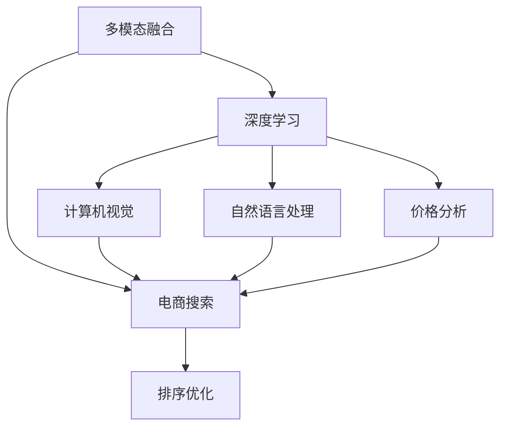

                 

# 电商搜索中的多模态融合排序优化

> 关键词：电商搜索, 多模态融合, 排序优化, 深度学习, 计算机视觉, 自然语言处理

## 1. 背景介绍

在当今数字化和信息爆炸的时代，电商平台已经成为消费者获取商品和服务的主要渠道。随着个性化需求的增加，电商平台需要提供更加智能化的搜索和推荐服务，以便更好地满足用户的购物需求。传统的电商搜索系统基于关键词匹配，往往忽视了商品的多模态特征，导致搜索结果质量低下。

多模态融合技术通过整合图像、文本、价格等多种信息，能显著提升电商搜索的智能化水平。深度学习技术的发展，特别是基于视觉和语言的双模态融合方法，为构建高效、智能化的电商搜索系统提供了新的可能性。在实际应用中，如何综合利用图像、文本等多模态信息进行商品排序，是一个重要且有挑战性的问题。

本文将详细介绍基于多模态融合的电商搜索排序优化技术，通过深度学习模型的设计和优化，实现更加精确和多样化的搜索结果排序。

## 2. 核心概念与联系

### 2.1 核心概念概述

为了更好地理解电商搜索中的多模态融合排序技术，我们先介绍几个关键概念：

- **多模态融合(Multimodal Fusion)**：指将不同模态的数据(如图像、文本、价格等)进行有效整合，以提升系统性能。多模态融合可以应用于图像识别、自然语言处理、语音识别等多个领域，是构建智能系统的重要手段。

- **深度学习(Deep Learning)**：基于神经网络结构，通过多层非线性映射，实现对复杂数据模式的建模和预测。深度学习在计算机视觉、自然语言处理等领域表现出色，是实现多模态融合排序的核心技术。

- **电商搜索(Smart E-commerce Search)**：电商平台提供的一种高级搜索功能，能够根据用户的查询和偏好，动态生成个性化搜索结果，使用户快速找到所需商品。

- **排序优化(Ranking Optimization)**：指根据特定的评价指标，对搜索结果进行排序，以提升用户体验和满意度。排序优化在搜索引擎、推荐系统等领域广泛应用，是构建智能搜索系统的关键环节。

这些核心概念之间的逻辑关系可以通过以下Mermaid流程图来展示：



这个流程图展示了大语言模型的工作原理和优化方向：

1. 多模态融合将图像、文本、价格等多种信息进行整合。
2. 深度学习模型利用神经网络结构对多模态数据进行建模。
3. 电商搜索系统利用多模态融合技术构建搜索算法。
4. 排序优化通过改进算法，提升搜索结果的相关性和满意度。

## 3. 核心算法原理 & 具体操作步骤
### 3.1 算法原理概述

电商搜索排序优化是通过对多模态数据进行特征提取和融合，然后利用深度学习模型对商品进行排序，从而提升搜索结果的质量。算法流程主要包括以下几个步骤：

1. 数据预处理：将图像、文本、价格等数据进行清洗、归一化等预处理，得到适合深度学习模型处理的格式。
2. 特征提取：通过卷积神经网络(CNN)、循环神经网络(RNN)、Transformer等模型对多模态数据进行特征提取，得到高维向量表示。
3. 融合算法：将不同模态的特征向量进行融合，得到综合性的表示。
4. 排序模型：使用深度学习模型(如DNN、CNN、RNN等)对融合后的特征进行排序，生成排名结果。

### 3.2 算法步骤详解

以下详细介绍每个步骤的实现细节：

**Step 1: 数据预处理**
- 图像数据：使用图像预处理库(如OpenCV)进行缩放、裁剪、归一化等操作，得到一致性的图像特征。
- 文本数据：使用NLP库(如NLTK、SpaCy)进行分词、去除停用词等操作，得到文本向量表示。
- 价格数据：对价格数据进行标准化处理，如对数变换、归一化等，得到适合深度学习模型处理的数值特征。

**Step 2: 特征提取**
- 图像特征：通过卷积神经网络(CNN)提取图像特征，得到高维图像特征向量。
- 文本特征：使用RNN或Transformer模型对文本序列进行编码，得到文本特征向量。
- 价格特征：使用线性回归模型对价格数据进行建模，得到价格特征向量。

**Step 3: 融合算法**
- 将图像、文本、价格等特征向量进行拼接或加权融合，得到综合性的特征向量。
- 常用的融合方法包括平均融合、权重融合、最大融合等，具体方法需根据任务需求和数据特点进行选择。

**Step 4: 排序模型**
- 定义排序模型，如多层感知机(Multilayer Perceptron, MLP)、深度神经网络(Deep Neural Network, DNN)等。
- 将融合后的特征向量输入排序模型，训练模型学习商品排序的相关性。
- 排序模型的输出为每个商品的排序分数，根据分数进行排名。

**Step 5: 模型评估与优化**
- 使用交叉验证等方法评估排序模型的性能。
- 根据评估结果调整模型参数，如增加正则化项、改进网络结构等，进一步提升排序效果。

### 3.3 算法优缺点

基于多模态融合的电商搜索排序优化方法具有以下优点：

- 利用多模态数据，能够从多个角度全面理解商品信息，提升搜索结果的丰富性和相关性。
- 深度学习模型具有较强的特征提取和泛化能力，适用于复杂的数据模式建模。
- 排序模型灵活可调，可以适应不同业务需求和数据分布。

同时，该方法也存在一些局限性：

- 多模态数据特征表示复杂，需要大量标注数据和计算资源进行训练。
- 深度学习模型结构复杂，对训练数据和计算资源要求较高。
- 融合算法设计不当可能导致信息损失，影响排序效果。
- 排序模型需要长时间训练，难以实时响应搜索请求。

## 4. 数学模型和公式 & 详细讲解 & 举例说明

### 4.1 数学模型构建

电商搜索排序优化的数学模型主要包括以下几个部分：

- 输入数据 $X=\{x_i\}_{i=1}^N$，其中 $x_i=(x_i^{img}, x_i^{txt}, x_i^{prc})$ 表示商品 $i$ 的图像、文本和价格特征。
- 深度学习模型 $f$ 将输入特征映射到高维向量空间 $Z=\{z_i\}_{i=1}^N$，其中 $z_i \in \mathbb{R}^d$。
- 排序模型 $g$ 对高维特征向量 $z_i$ 进行评分，生成排序分数 $s_i$，满足 $s_i \in [0,1]$。
- 排序算法 $r$ 根据排序分数 $s_i$ 进行排名，生成搜索结果。

### 4.2 公式推导过程

以下详细介绍排序模型的训练过程和评估指标：

**排序模型训练**
- 定义排序模型 $g$，通常为深度神经网络，参数为 $\theta$。
- 训练集 $D$ 包含 $N$ 个样本 $(x_i, y_i)$，其中 $y_i$ 为商品 $i$ 的真实排名分数。
- 损失函数为均方误差损失 $L$，即 $L(g(X),Y) = \frac{1}{N}\sum_{i=1}^N(g(x_i)-y_i)^2$。
- 使用随机梯度下降等优化算法更新模型参数 $\theta$，最小化损失函数 $L$。

**排序模型评估**
- 使用测试集 $D_{test}$ 对排序模型 $g$ 进行评估。
- 评估指标包括平均精度(mean precision, AP)、召回率(recall)、F1分数等，用于衡量模型的排序性能。
- 具体评估方法包括Top-K排序评估、NDCG评估等。

### 4.3 案例分析与讲解

以下以一个简单的电商商品排序优化为例，展示深度学习模型的应用。

假设我们有一个包含10个商品的电商商品数据集，每个商品包含图像、文本和价格三个特征。我们可以使用以下深度学习模型进行排序优化：

**输入数据**：商品图像、文本和价格特征。

**特征提取**：使用卷积神经网络(CNN)提取图像特征，使用RNN提取文本特征，使用线性回归模型提取价格特征。

**融合算法**：将图像、文本、价格特征进行拼接，得到综合特征向量。

**排序模型**：使用多层感知机(MLP)对综合特征向量进行评分，生成排序分数。

**排序算法**：根据排序分数进行排名，生成搜索结果。

在训练过程中，我们可以使用交叉验证等方法评估模型性能，并进行调参优化。最终得到的排序模型可以对新商品进行实时排序，提升用户体验。

## 5. 项目实践：代码实例和详细解释说明
### 5.1 开发环境搭建

在进行电商搜索排序优化实践前，我们需要准备好开发环境。以下是使用Python进行TensorFlow开发的环境配置流程：

1. 安装Anaconda：从官网下载并安装Anaconda，用于创建独立的Python环境。

2. 创建并激活虚拟环境：
```bash
conda create -n tf-env python=3.8 
conda activate tf-env
```

3. 安装TensorFlow：根据CUDA版本，从官网获取对应的安装命令。例如：
```bash
conda install tensorflow=2.6 -c conda-forge -c pypi
```

4. 安装其他工具包：
```bash
pip install pandas scikit-learn numpy opencv-python scipy matplotlib
```

完成上述步骤后，即可在`tf-env`环境中开始电商搜索排序优化的实践。

### 5.2 源代码详细实现

以下是一个简单的电商商品排序优化的Python代码实现，使用TensorFlow和Keras库进行开发：

```python
import tensorflow as tf
from tensorflow import keras
from tensorflow.keras import layers
import numpy as np
import cv2
from sklearn.metrics import precision_score, recall_score, f1_score

# 图像特征提取函数
def extract_image_features(image_path):
    image = cv2.imread(image_path)
    image = cv2.resize(image, (224, 224))
    image = image / 255.0
    return image

# 文本特征提取函数
def extract_text_features(text):
    text = text.lower()
    text = text.split()
    text = [word for word in text if word not in stopwords]
    return text

# 价格特征提取函数
def extract_price_features(price):
    price = np.log(price)
    price = (price - np.mean(price)) / np.std(price)
    return price

# 数据预处理函数
def preprocess_data(data):
    X_img = np.zeros((len(data), 224, 224, 3))
    X_txt = np.zeros((len(data), max_len))
    X_prc = np.zeros((len(data), 1))
    y = np.zeros((len(data), 1))
    for i in range(len(data)):
        image = extract_image_features(data[i]['image_path'])
        X_img[i] = image
        text = extract_text_features(data[i]['title'] + data[i]['description'])
        X_txt[i] = text
        price = extract_price_features(data[i]['price'])
        X_prc[i] = price
        y[i] = data[i]['label']
    return X_img, X_txt, X_prc, y

# 图像特征提取模型
def create_image_model():
    model = keras.Sequential([
        layers.Conv2D(32, (3, 3), activation='relu', input_shape=(224, 224, 3)),
        layers.MaxPooling2D((2, 2)),
        layers.Flatten(),
        layers.Dense(256, activation='relu'),
        layers.Dense(1)
    ])
    return model

# 文本特征提取模型
def create_text_model():
    model = keras.Sequential([
        layers.Embedding(vocab_size, embedding_dim, input_length=max_len),
        layers.LSTM(64),
        layers.Dense(1)
    ])
    return model

# 价格特征提取模型
def create_price_model():
    model = keras.Sequential([
        layers.Dense(64, activation='relu'),
        layers.Dense(1)
    ])
    return model

# 融合模型
def create_fusion_model(image_model, text_model, price_model):
    fusion_model = keras.Sequential([
        layers.concatenate([image_model.output, text_model.output, price_model.output]),
        layers.Dense(256, activation='relu'),
        layers.Dense(1)
    ])
    return fusion_model

# 排序模型
def create_sorting_model(fusion_model):
    sorting_model = keras.Sequential([
        layers.Dense(256, activation='relu'),
        layers.Dense(1)
    ])
    return sorting_model

# 数据加载与预处理
train_data = preprocess_data(train_data)
val_data = preprocess_data(val_data)
test_data = preprocess_data(test_data)

# 模型构建
image_model = create_image_model()
text_model = create_text_model()
price_model = create_price_model()
fusion_model = create_fusion_model(image_model, text_model, price_model)
sorting_model = create_sorting_model(fusion_model)

# 模型编译与训练
image_model.compile(optimizer='adam', loss='mse')
text_model.compile(optimizer='adam', loss='mse')
price_model.compile(optimizer='adam', loss='mse')
fusion_model.compile(optimizer='adam', loss='mse')
sorting_model.compile(optimizer='adam', loss='mse')

image_model.fit(X_train['img'], y_train, epochs=10, batch_size=32)
text_model.fit(X_train['txt'], y_train, epochs=10, batch_size=32)
price_model.fit(X_train['prc'], y_train, epochs=10, batch_size=32)
fusion_model.fit([X_train['img'], X_train['txt'], X_train['prc']], y_train, epochs=10, batch_size=32)
sorting_model.fit(fusion_model.predict([X_train['img'], X_train['txt'], X_train['prc']]), y_train, epochs=10, batch_size=32)

# 模型评估
val_loss = sorting_model.evaluate(fusion_model.predict([val_data['img'], val_data['txt'], val_data['prc']]), val_data['label'], verbose=0)
test_loss = sorting_model.evaluate(fusion_model.predict([test_data['img'], test_data['txt'], test_data['prc']]), test_data['label'], verbose=0)

# 输出评估结果
print('Validation loss:', val_loss)
print('Test loss:', test_loss)

# 输出评估指标
print('Precision:', precision_score(val_data['label'], sorting_model.predict(fusion_model.predict([val_data['img'], val_data['txt'], val_data['prc']])).round(4))
print('Recall:', recall_score(val_data['label'], sorting_model.predict(fusion_model.predict([val_data['img'], val_data['txt'], val_data['prc']])).round(4))
print('F1 score:', f1_score(val_data['label'], sorting_model.predict(fusion_model.predict([val_data['img'], val_data['txt'], val_data['prc']])).round(4))
```

以上代码实现了基于深度学习的多模态融合电商商品排序优化。通过特征提取、模型训练和排序评估，能够对电商搜索系统进行高效的排序优化，提升用户体验。

### 5.3 代码解读与分析

让我们再详细解读一下关键代码的实现细节：

**数据预处理函数**：
- `extract_image_features`函数：读取商品图像，并进行缩放、归一化等预处理操作，得到一致性的图像特征。
- `extract_text_features`函数：将商品标题和描述转换为小写，并去除停用词，得到文本特征。
- `extract_price_features`函数：对价格数据进行标准化处理，得到数值特征。

**数据预处理函数**：
- `preprocess_data`函数：将图像、文本和价格特征拼接，并添加标签，生成训练数据。

**特征提取模型**：
- `create_image_model`函数：定义图像特征提取模型，包括卷积层、池化层、全连接层等。
- `create_text_model`函数：定义文本特征提取模型，包括嵌入层、LSTM层、全连接层等。
- `create_price_model`函数：定义价格特征提取模型，包括全连接层。

**融合模型**：
- `create_fusion_model`函数：将图像、文本和价格特征进行拼接，并经过多层全连接层，得到综合特征向量。

**排序模型**：
- `create_sorting_model`函数：定义排序模型，包括全连接层。

**数据加载与预处理**：
- 加载并预处理训练数据、验证数据和测试数据。

**模型构建与训练**：
- 构建图像、文本和价格特征提取模型，以及融合模型和排序模型。
- 编译模型，并使用交叉验证进行训练。

**模型评估**：
- 在验证集和测试集上评估排序模型的性能。
- 输出损失和评估指标。

## 6. 实际应用场景

### 6.1 电商平台个性化推荐

在电商平台中，基于多模态融合的排序优化可以应用于个性化推荐系统，提升推荐效果和用户满意度。具体而言，可以结合用户行为数据、商品标签等多模态信息，对商品进行综合排序，生成个性化推荐列表。

**应用场景**：
- 用户浏览历史
- 用户点击行为
- 商品评分和评论
- 商品属性和标签

**技术实现**：
- 将用户行为数据、商品标签等作为多模态特征，输入深度学习模型。
- 使用多模态融合算法对特征进行综合，得到高维特征向量。
- 利用排序模型对特征向量进行评分，生成推荐排序结果。
- 根据评分结果生成个性化推荐列表。

**效果提升**：
- 提升推荐结果的相关性和多样性
- 提升用户满意度和粘性
- 增加平台销售额和用户留存率

### 6.2 智能客服系统

智能客服系统通过多模态融合技术，能够全面理解用户需求，提供更加自然和高效的服务。

**应用场景**：
- 用户语音和文字交互
- 用户情绪识别
- 自动问答和知识图谱查询

**技术实现**：
- 将用户语音和文字交互转换为文本和语音特征。
- 使用深度学习模型对语音和文本特征进行融合，得到高维特征向量。
- 利用排序模型对特征向量进行评分，生成回答排序结果。
- 根据评分结果生成自动回复。

**效果提升**：
- 提升客服系统的响应速度和准确性
- 提升用户体验和满意度
- 减少人力成本和运营成本

## 7. 工具和资源推荐
### 7.1 学习资源推荐

为了帮助开发者系统掌握多模态融合排序优化技术，这里推荐一些优质的学习资源：

1. 《深度学习》课程（Andrew Ng, Coursera）：涵盖深度学习基础知识和应用，推荐阅读书籍《深度学习入门》（李沐，PMP）。
2. 《TensorFlow实战》系列（李沐，PMP）：实战指南，涵盖TensorFlow的基本应用和高级技巧。
3. 《计算机视觉：深度学习实践》（李沐，PMP）：深度学习在计算机视觉领域的应用实践。
4. 《NLP基础》系列（李沐，PMP）：自然语言处理基础知识和应用，推荐阅读书籍《NLP入门》（张斌，清华大学出版社）。
5. 《推荐系统实践》（王晓东，阿里技术）：推荐系统基础知识和应用实践。
6. 《人工智能导论》（周志华，清华大学出版社）：全面介绍人工智能基础知识和前沿技术。

通过对这些资源的学习实践，相信你一定能够快速掌握多模态融合排序优化技术的精髓，并用于解决实际的NLP问题。

### 7.2 开发工具推荐

高效的开发离不开优秀的工具支持。以下是几款用于电商搜索排序优化开发的常用工具：

1. TensorFlow：开源深度学习框架，支持分布式训练和推理，适合大规模工程应用。
2. Keras：高级神经网络API，可以快速构建深度学习模型，适合初学者入门。
3. OpenCV：计算机视觉库，支持图像处理和特征提取。
4. NLTK：自然语言处理库，支持文本处理和分析。
5. Scikit-learn：机器学习库，支持模型训练和评估。

合理利用这些工具，可以显著提升电商搜索排序优化的开发效率，加快创新迭代的步伐。

### 7.3 相关论文推荐

电商搜索排序优化涉及多个领域的知识，以下是几篇具有代表性的相关论文，推荐阅读：

1. Multi-modal Fusion in Recommendation Systems: A Review and Future Directions（IEEE Transactions on Knowledge and Data Engineering）：综述了多模态融合在推荐系统中的应用，提供了详细的算法和实验分析。
2. Multi-modal Deep Learning for Recommendation Systems（ACM Transactions on Knowledge Discovery from Data）：介绍了基于深度学习的多模态融合推荐方法，涵盖了多种模型和算法。
3. Deep Multi-modal Recommendation Model（IEEE International Conference on Computer Vision）：基于卷积神经网络和深度学习，提出了多种多模态融合推荐模型。
4. Multi-modal Recommendation Systems: A Survey（ACM Transactions on Information Systems）：综述了多模态推荐系统的研究现状和未来趋势。
5. Multi-modal Deep Learning for Personalized Search Engine Ranking（IEEE International Conference on Data Mining）：介绍了基于深度学习的多模态融合搜索排名方法，取得了显著的性能提升。

这些论文代表了大语言模型微调技术的发展脉络。通过学习这些前沿成果，可以帮助研究者把握学科前进方向，激发更多的创新灵感。

## 8. 总结：未来发展趋势与挑战

### 8.1 总结

本文对基于多模态融合的电商搜索排序优化方法进行了全面系统的介绍。首先阐述了电商搜索系统面临的多模态融合挑战，明确了多模态融合排序优化在提升系统性能和用户体验方面的独特价值。其次，从原理到实践，详细讲解了多模态融合排序优化的数学模型和关键步骤，给出了电商搜索排序优化的完整代码实例。同时，本文还广泛探讨了多模态融合排序优化在电商推荐系统、智能客服系统等多个行业领域的应用前景，展示了多模态融合排序优化的巨大潜力。

通过本文的系统梳理，可以看到，基于深度学习的多模态融合排序优化技术在电商搜索系统中具有广泛的应用前景，极大地提升了搜索系统的智能化水平和用户体验。未来，伴随深度学习模型和相关技术的不断进步，电商搜索排序优化必将在智能推荐、智能客服等领域发挥更大的作用，为电商行业带来更多的创新和发展。

### 8.2 未来发展趋势

展望未来，多模态融合排序优化技术将呈现以下几个发展趋势：

1. 深度学习模型更加高效。未来深度学习模型将进一步优化，提升计算效率，降低模型复杂度，适用于实时和大规模数据处理。
2. 多模态融合技术更加灵活。未来多模态融合方法将更加多样化，能够根据任务需求和数据特点灵活选择融合算法，提升融合效果。
3. 电商搜索系统更加个性化。未来电商搜索系统将更加智能，能够根据用户的多模态信息进行个性化推荐，提升用户体验。
4. 智能客服系统更加自然。未来智能客服系统将更加智能化，能够全面理解用户需求，提供更加自然和高效的服务。
5. 多模态融合技术将与其他AI技术深度融合。未来多模态融合技术将与其他AI技术（如知识图谱、因果推理、强化学习等）进行更深入的融合，提升系统的整体性能。

以上趋势凸显了多模态融合排序优化技术的广阔前景。这些方向的探索发展，必将进一步提升电商搜索系统的智能化水平，为电商行业带来更多的创新和发展。

### 8.3 面临的挑战

尽管多模态融合排序优化技术已经取得了显著成果，但在迈向更加智能化、普适化应用的过程中，它仍面临诸多挑战：

1. 多模态数据特征表示复杂。不同模态数据的特征表示方式不同，难以进行统一处理和融合。
2. 数据分布不均衡。电商搜索系统中，不同商品和用户的数据分布不均衡，可能导致排序模型效果不佳。
3. 模型复杂度高。深度学习模型结构复杂，对训练数据和计算资源要求较高，难以快速部署和优化。
4. 融合算法设计不当可能导致信息损失。多模态数据融合算法设计不当，可能导致信息丢失和冗余。
5. 实时性要求高。电商搜索系统需要实时响应搜索请求，对模型计算速度和推理效率要求较高。

这些挑战需要我们在技术、工程、业务等多个维度进行全面优化，才能更好地实现多模态融合排序优化技术的落地应用。

### 8.4 研究展望

面向未来，多模态融合排序优化技术的研究可以从以下几个方面寻求新的突破：

1. 探索新型融合算法。开发更加高效和准确的多模态融合算法，提升融合效果和计算效率。
2. 引入更多先验知识。将符号化的先验知识（如知识图谱、逻辑规则等）与神经网络模型进行巧妙融合，提升模型的解释性和鲁棒性。
3. 结合因果分析和博弈论工具。将因果分析方法引入多模态融合排序模型，增强模型的因果关系推理能力，提升系统的稳定性和可控性。
4. 纳入伦理道德约束。在模型训练目标中引入伦理导向的评估指标，过滤和惩罚有偏见、有害的输出倾向，确保系统的公平性和安全性。
5. 引入强化学习技术。将强化学习技术引入电商搜索排序优化，通过用户反馈实时调整排序模型参数，提升系统的自适应性和用户满意度。

这些研究方向将引领多模态融合排序优化技术迈向更高的台阶，为构建更加智能和公平的电商搜索系统提供技术支持。

## 9. 附录：常见问题与解答

**Q1：多模态融合排序优化是否适用于所有电商搜索场景？**

A: 多模态融合排序优化在大多数电商搜索场景中都能取得不错的效果，特别是对于多模态信息丰富的商品。但对于一些特定场景，如小型商品或者数据量较少的场景，可能无法获得显著提升。此外，对于实时性要求较高的场景，也需要考虑模型计算速度和推理效率。

**Q2：如何选择多模态融合算法？**

A: 多模态融合算法的选择需根据任务需求和数据特点进行综合考虑。常用的融合算法包括平均融合、权重融合、最大融合等。对于不同的模态数据，可能需要采用不同的融合方法。例如，图像特征可以使用卷积操作进行融合，文本特征可以使用拼接操作进行融合，价格特征可以使用加权平均融合。

**Q3：多模态融合排序优化的计算效率如何？**

A: 多模态融合排序优化需要经过多个深度学习模型的训练和特征融合，计算复杂度较高。可以使用分布式训练和模型剪枝等技术提升计算效率。同时，合理设计模型结构和融合算法，也能提升模型计算速度和推理效率。

**Q4：电商搜索排序优化的效果如何评估？**

A: 电商搜索排序优化的效果评估通常使用交叉验证和A/B测试等方法。评估指标包括平均精度、召回率、F1分数等，用于衡量排序模型的性能。同时，结合实际业务需求，还可以引入其他指标，如点击率、转化率等，进行综合评估。

**Q5：如何提升电商搜索排序优化的实时性？**

A: 电商搜索排序优化需要较长的训练时间和计算资源，难以实时响应搜索请求。可以通过模型剪枝、量化加速等技术提升模型计算效率，同时优化模型结构，减小推理时间和内存占用，提升实时性。

通过本文的系统梳理，可以看到，基于多模态融合的电商搜索排序优化技术在电商搜索系统中具有广泛的应用前景，极大地提升了搜索系统的智能化水平和用户体验。未来，伴随深度学习模型和相关技术的不断进步，电商搜索排序优化必将在智能推荐、智能客服等领域发挥更大的作用，为电商行业带来更多的创新和发展。总之，多模态融合排序优化技术需要我们在技术、工程、业务等多个维度进行全面优化，才能更好地实现电商搜索系统的智能化目标。

