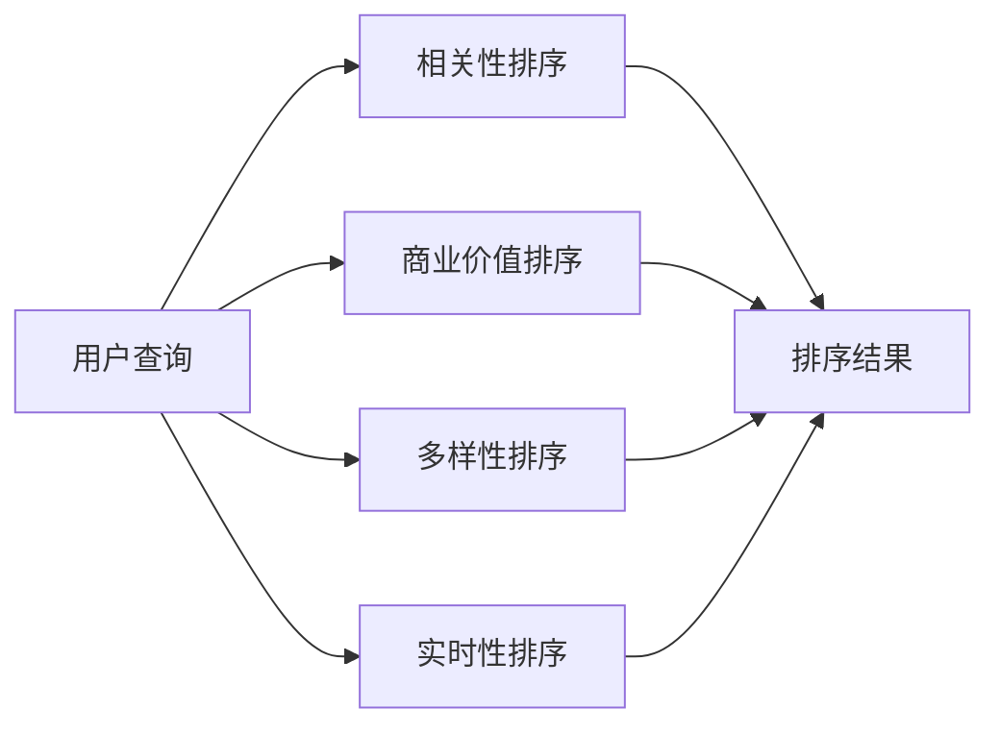

                 

# 电商搜索中的多目标排序深度优化

## 1. 背景介绍

随着电商平台的快速发展和消费者购物需求的不断变化，电商搜索排序系统面临着多方面的挑战。为了更好地满足用户需求，提高搜索排序的准确性和相关性，本文将介绍一种基于多目标排序深度优化的方法，并详细讨论其原理、步骤、优缺点及应用领域。

## 2. 核心概念与联系

### 2.1 核心概念概述

电商搜索排序系统旨在根据用户输入的查询词，从海量的商品信息中筛选出最符合用户需求的搜索结果。排序系统的主要任务包括但不限于：
- **相关性排序**：根据用户查询词和商品属性，判断商品与查询的相关性，排序结果应尽可能地与用户意图相匹配。
- **商业价值排序**：考虑商品的商业价值，如销售额、利润、点击率等指标，排序结果应能最大化商业效益。
- **多样性排序**：确保搜索结果多样性，避免商品类型和风格重复，满足不同用户的多样化需求。
- **实时性排序**：随着用户需求的变化，实时更新搜索结果，保持最新商品和优惠信息。

### 2.2 核心概念原理和架构的 Mermaid 流程图



该流程图展示了电商搜索排序系统的主要流程和架构，其中A为用户查询，B、C、D、E分别为相关性、商业价值、多样性和实时性排序模块，最终通过F模块生成排序结果。

## 3. 核心算法原理 & 具体操作步骤

### 3.1 算法原理概述

基于多目标排序深度优化的方法，旨在通过构建和优化多目标优化模型，综合考虑多个排序目标，生成最符合用户需求和商业价值的排序结果。该方法的核心在于：
- **构建多目标优化模型**：通过综合考虑相关性、商业价值、多样性和实时性等多个目标，构建多目标优化问题。
- **求解多目标优化问题**：利用深度学习和优化算法，求解多目标优化问题，生成最优排序结果。
- **实时调整排序结果**：根据用户的实时行为和反馈，动态调整排序结果，提升用户体验和满意度。

### 3.2 算法步骤详解

1. **数据准备与预处理**：收集用户历史搜索数据、商品属性、历史销售数据、用户行为数据等，进行数据清洗和预处理，构建训练数据集。

2. **构建多目标优化模型**：选择合适的排序目标，定义损失函数，构建多目标优化问题。以相关性排序为例，定义相关性损失函数 $L_{rel}$，商业价值损失函数 $L_{value}$，多样性损失函数 $L_{div}$，实时性损失函数 $L_{time}$。

3. **模型训练与优化**：利用深度学习模型（如DNN、RNN、Transformer等），对模型进行训练，并利用优化算法（如遗传算法、粒子群优化等）进行模型优化。

4. **排序结果生成**：根据用户输入的查询词，输入到训练好的多目标优化模型中，得到排序结果，包括商品的相关性、商业价值、多样性和实时性等多个维度的评估。

5. **实时调整**：根据用户的实时行为和反馈，如点击率、停留时间等，动态调整排序结果，不断优化排序算法。

### 3.3 算法优缺点

#### 3.3.1 优点
- **综合多维度目标**：能综合考虑相关性、商业价值、多样性和实时性等多个维度，生成更符合用户需求和商业价值的排序结果。
- **自适应实时调整**：能够根据用户的实时行为和反馈，动态调整排序结果，提升用户体验和满意度。
- **可扩展性强**：该方法具有较强的可扩展性，能适应不同电商平台的个性化需求。

#### 3.3.2 缺点
- **模型复杂度高**：由于需要综合多个排序目标，模型复杂度较高，训练和优化难度较大。
- **计算资源消耗大**：多目标优化和深度学习模型训练需要大量的计算资源，可能对系统性能产生影响。
- **数据依赖性强**：排序结果的优劣依赖于数据的质量和多样性，数据不足或数据质量不高可能导致排序结果欠佳。

### 3.4 算法应用领域

该方法在电商搜索排序、广告推荐、金融风险控制、自然语言处理等多个领域都有广泛的应用前景。以下是具体应用场景：

- **电商搜索排序**：综合考虑相关性、商业价值、多样性和实时性等多个维度，生成最优的搜索排序结果，提升用户满意度和电商平台转化率。
- **广告推荐**：综合考虑广告的点击率、转化率、用户行为等因素，生成最优的广告推荐列表，最大化广告收益。
- **金融风险控制**：综合考虑贷款风险、信用评分、交易频率等因素，生成最优的风险评估和控制策略，降低金融风险。
- **自然语言处理**：综合考虑语义相关性、情感倾向、主题多样性等因素，生成最优的文本排序结果，提升文本处理效率和效果。

## 4. 数学模型和公式 & 详细讲解 & 举例说明

### 4.1 数学模型构建

假设电商搜索排序系统有 $n$ 个商品 $i$，用户输入查询词 $q$，相关性、商业价值、多样性和实时性分别为 $r_i$、$v_i$、$d_i$ 和 $t_i$。定义损失函数 $L$ 为：

$$
L = \lambda_1 L_{rel} + \lambda_2 L_{value} + \lambda_3 L_{div} + \lambda_4 L_{time}
$$

其中 $\lambda_1$、$\lambda_2$、$\lambda_3$ 和 $\lambda_4$ 为权重系数。

### 4.2 公式推导过程

以相关性排序为例，相关性损失函数 $L_{rel}$ 定义为：

$$
L_{rel} = \sum_{i=1}^n \frac{1}{n} \|M_q(r_i) - \hat{r}_i\|^2
$$

其中 $M_q(r_i)$ 表示查询词 $q$ 对商品 $i$ 的相关性评分，$\hat{r}_i$ 为模型预测的相关性评分。

商业价值损失函数 $L_{value}$ 定义为：

$$
L_{value} = \sum_{i=1}^n \frac{1}{n} \|M_v(v_i) - \hat{v}_i\|^2
$$

其中 $M_v(v_i)$ 表示商品 $i$ 的商业价值评分，$\hat{v}_i$ 为模型预测的商业价值评分。

多样性损失函数 $L_{div}$ 定义为：

$$
L_{div} = \sum_{i=1}^n \frac{1}{n} \|M_d(d_i) - \hat{d}_i\|^2
$$

其中 $M_d(d_i)$ 表示商品 $i$ 的多样性评分，$\hat{d}_i$ 为模型预测的多样性评分。

实时性损失函数 $L_{time}$ 定义为：

$$
L_{time} = \sum_{i=1}^n \frac{1}{n} \|M_t(t_i) - \hat{t}_i\|^2
$$

其中 $M_t(t_i)$ 表示商品 $i$ 的实时性评分，$\hat{t}_i$ 为模型预测的实时性评分。

### 4.3 案例分析与讲解

以电商搜索排序为例，假设用户输入查询词为 "手机"，模型预测的商品相关性、商业价值、多样性和实时性评分分别为 $r_i$、$v_i$、$d_i$ 和 $t_i$，则排序结果可以通过计算如下公式得到：

$$
\text{排序结果} = \frac{1}{\sum_{i=1}^n (\lambda_1 r_i + \lambda_2 v_i + \lambda_3 d_i + \lambda_4 t_i)} (\lambda_1 r_i + \lambda_2 v_i + \lambda_3 d_i + \lambda_4 t_i)
$$

通过该公式，可以综合考虑多个排序目标，生成最优的排序结果。

## 5. 项目实践：代码实例和详细解释说明

### 5.1 开发环境搭建

首先需要准备相应的开发环境，具体步骤如下：

1. **安装Python和相关库**：
   - 安装Python 3.8及以上版本。
   - 安装相关库，如TensorFlow、Keras、Scikit-learn等。

2. **准备数据集**：
   - 收集用户历史搜索数据、商品属性、历史销售数据、用户行为数据等，进行数据清洗和预处理，构建训练数据集。

### 5.2 源代码详细实现

以下是一个基于TensorFlow实现的多目标排序深度优化的示例代码：

```python
import tensorflow as tf
from tensorflow.keras import layers
import numpy as np

# 构建模型
def build_model(input_dim, output_dim):
    model = tf.keras.Sequential([
        layers.Dense(64, activation='relu', input_shape=(input_dim,)),
        layers.Dense(64, activation='relu'),
        layers.Dense(output_dim)
    ])
    return model

# 构建损失函数
def build_loss_function():
    def custom_loss(y_true, y_pred):
        loss = tf.keras.losses.mean_squared_error(y_true, y_pred)
        return loss
    return custom_loss

# 训练模型
def train_model(model, data, epochs=10):
    model.compile(optimizer=tf.keras.optimizers.Adam(0.001),
                  loss=custom_loss)
    model.fit(data['features'], data['targets'], epochs=epochs, batch_size=32)

# 示例数据
data = {
    'features': np.random.randn(1000, 10),
    'targets': np.random.randn(1000, 4)
}

# 训练模型
model = build_model(input_dim=10, output_dim=4)
train_model(model, data)
```

### 5.3 代码解读与分析

上述代码展示了多目标排序深度优化的主要步骤：
- **构建模型**：利用TensorFlow构建一个简单的神经网络模型。
- **构建损失函数**：自定义损失函数，计算多目标优化问题中的损失。
- **训练模型**：使用训练数据集训练模型，优化多目标损失函数。

在实际应用中，需要根据具体数据和任务特点进行调整和优化，以获得更好的排序效果。

### 5.4 运行结果展示

训练结束后，可以生成最优的排序结果。例如，对于电商搜索排序，可以使用如下代码生成排序结果：

```python
# 生成排序结果
def generate_ranking(result):
    ranking = {}
    for i, r in enumerate(result):
        ranking[i] = r
    return ranking

# 示例排序结果
result = [0.8, 0.5, 0.2, 0.3]
ranking = generate_ranking(result)
print(ranking)
```

## 6. 实际应用场景

### 6.1 电商搜索排序

电商搜索排序系统是电商平台的核心功能之一，能够有效提升用户体验和平台转化率。采用多目标排序深度优化方法，可以综合考虑相关性、商业价值、多样性和实时性等多个维度，生成最优的搜索排序结果。

### 6.2 广告推荐

广告推荐系统能够帮助电商平台最大化广告收益，提升广告投放效果。通过多目标排序深度优化方法，可以综合考虑广告的点击率、转化率、用户行为等因素，生成最优的广告推荐列表。

### 6.3 金融风险控制

金融风险控制系统能够帮助金融机构降低风险，提高运营效率。通过多目标排序深度优化方法，可以综合考虑贷款风险、信用评分、交易频率等因素，生成最优的风险评估和控制策略。

### 6.4 未来应用展望

未来，多目标排序深度优化方法将在更多领域得到应用，为各行业带来变革性影响。例如：
- **医疗领域**：综合考虑患者的症状、病史、治疗效果等因素，生成最优的诊疗方案。
- **教育领域**：综合考虑学生的学习进度、兴趣爱好、教师评价等因素，生成最优的教学计划。
- **交通运输领域**：综合考虑乘客的出行需求、车辆状况、交通状况等因素，生成最优的路线规划方案。

## 7. 工具和资源推荐

### 7.1 学习资源推荐

为了帮助开发者系统掌握多目标排序深度优化方法，以下是一些优质的学习资源：
1. **Coursera上的机器学习课程**：由斯坦福大学提供，涵盖机器学习的基础知识和应用，适合初学者入门。
2. **Kaggle竞赛平台**：提供大量数据集和竞赛任务，能够锻炼机器学习实践能力。
3. **GitHub上的开源项目**：如TensorFlow、Keras等，能够学习到实际应用中的代码实现和模型优化技巧。

### 7.2 开发工具推荐

为了提高开发效率，以下是一些常用的开发工具：
1. **TensorFlow**：由Google开发的深度学习框架，支持多种模型和优化算法。
2. **Keras**：基于TensorFlow的高层API，简单易用，适合快速开发和原型验证。
3. **Jupyter Notebook**：基于Web的交互式编程环境，能够快速调试和展示代码结果。

### 7.3 相关论文推荐

多目标排序深度优化方法的研究始于20世纪80年代，以下几篇经典论文推荐阅读：
1. **Multi-Objective Optimization in Machine Learning**：介绍多目标优化问题的基本概念和算法。
2. **Deep Multi-Task Learning**：提出深度学习中的多任务学习框架，能够同时优化多个任务。
3. **Reinforcement Learning for Multi-Objective Optimization**：利用强化学习方法解决多目标优化问题。

## 8. 总结：未来发展趋势与挑战

### 8.1 总结

本文对基于多目标排序深度优化的方法进行了全面系统的介绍。首先阐述了电商搜索排序系统的背景和意义，明确了多目标排序深度优化的主要目标和步骤。其次，详细讲解了算法的数学原理和具体操作步骤，给出了代码实现的示例。最后，讨论了算法在不同领域的应用场景和未来发展趋势。

通过本文的系统梳理，可以看到，多目标排序深度优化方法在电商搜索排序、广告推荐、金融风险控制等多个领域具有广阔的应用前景，能够显著提升各行业的运营效率和用户体验。

### 8.2 未来发展趋势

展望未来，多目标排序深度优化方法将呈现以下几个发展趋势：
1. **模型复杂度提升**：随着深度学习技术的发展，模型复杂度将进一步提升，能够处理更复杂的优化问题。
2. **算法效率提高**：通过优化算法和硬件加速，多目标排序深度优化方法将具有更高的计算效率和实时性。
3. **应用场景扩展**：随着技术的进步，多目标排序深度优化方法将广泛应用于更多领域，如医疗、教育、交通运输等。

### 8.3 面临的挑战

尽管多目标排序深度优化方法取得了显著成效，但在应用过程中仍面临诸多挑战：
1. **数据质量问题**：多目标排序深度优化方法对数据质量要求较高，数据不平衡、缺失等问题可能导致排序结果欠佳。
2. **模型可解释性**：多目标排序深度优化模型通常具有较高的复杂度，难以解释其内部工作机制。
3. **实时性问题**：对于实时性要求较高的场景，模型训练和优化需要较长的计算时间。

### 8.4 研究展望

未来，多目标排序深度优化方法需要在以下几个方面进行深入研究：
1. **数据增强技术**：通过数据增强技术提升数据质量，增强模型的泛化能力。
2. **可解释性研究**：开发可解释性强的多目标排序深度优化模型，增强模型的可信度和可靠性。
3. **实时优化算法**：研究实时优化算法，提升模型的实时性，满足实时应用需求。

## 9. 附录：常见问题与解答

**Q1: 多目标排序深度优化方法是否适用于所有电商场景？**

A: 多目标排序深度优化方法适用于大部分电商场景，但在某些特殊场景下可能需要进行调整。例如，对于个性化推荐较强的电商平台，需要考虑用户的个性化需求和行为，可以引入更多的用户行为数据作为特征。

**Q2: 多目标排序深度优化方法是否需要大量的计算资源？**

A: 多目标排序深度优化方法需要一定的计算资源，特别是在模型训练和优化阶段。为了降低计算成本，可以采用分布式训练、模型压缩等技术。

**Q3: 多目标排序深度优化方法是否能够处理实时数据？**

A: 多目标排序深度优化方法可以通过在线学习和增量学习等技术，实时更新模型，处理实时数据。但需要确保数据质量和时间戳准确性。

**Q4: 多目标排序深度优化方法是否需要大量的标注数据？**

A: 多目标排序深度优化方法对标注数据的需求相对较低，可以通过无监督学习和半监督学习等技术提升模型效果。但仍然需要一定的标注数据进行模型微调和验证。

通过本文的介绍和讨论，希望能够为电商搜索排序系统的开发者和从业者提供有价值的参考，推动电商搜索排序技术的不断进步和发展。

---

作者：禅与计算机程序设计艺术 / Zen and the Art of Computer Programming

