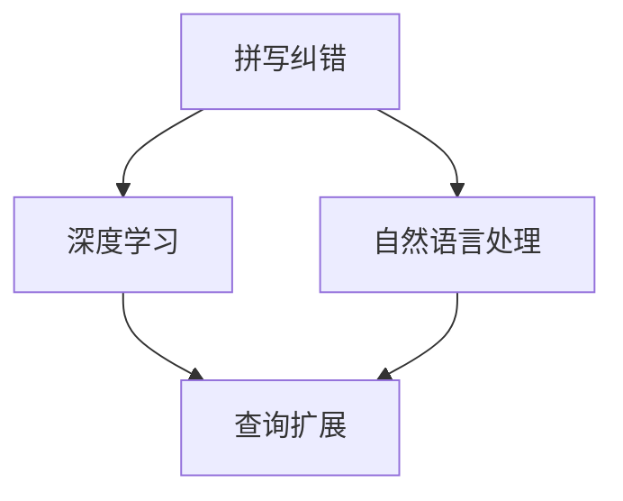

                 

# 电商搜索中的拼写纠错与查询扩展

> 关键词：拼写纠错,查询扩展,自然语言处理,NLP,深度学习,神经网络

## 1. 背景介绍

电商搜索系统是互联网电商领域的基础设施，是连接用户与商品的桥梁。在用户输入搜索关键词时，系统需准确理解其意图，快速检索到相关商品，并展示给用户。拼写纠错和查询扩展作为电商搜索系统中重要的技术组件，旨在提升用户体验和系统效率。

拼写纠错（Spelling Correction）是一种将用户输入的错误拼写纠正为正确的拼写的方法，帮助用户快速找到想要购买的商品。查询扩展（Query Expansion）则是在用户输入查询时，利用语义相似度等技术自动生成相关查询词，丰富搜索结果，避免因拼写错误导致的搜索结果不相关。

拼写纠错与查询扩展技术在电商搜索中的应用，具有以下优点：
- 提高搜索准确性。通过拼写纠错和查询扩展，能够有效纠正用户输入的错误，避免因误输导致无法检索到相关商品。
- 提升搜索全面性。扩展相关查询词，能够覆盖用户真实的搜索意图，提供更全面的商品信息，减少因拼写错误带来的信息损失。
- 提升用户体验。通过快速纠正拼写错误和自动扩展相关查询，能够显著减少用户搜索时间，提升用户满意度。

然而，拼写纠错和查询扩展在实际应用中也面临一些挑战：
- 拼写纠错模型的准确性受到输入错误多样性和通用性限制，难以处理所有可能的拼写错误。
- 查询扩展的语义相似度计算和词向量空间建模复杂度高，难以实现实时高效的扩展。
- 电商领域商品种类繁多，查询扩展算法需要处理海量商品信息，实现高质量扩展。
- 拼写纠错和查询扩展需要与其他搜索引擎组件协同工作，确保系统整体性能稳定。

本文将从拼写纠错和查询扩展的核心算法出发，系统阐述其在电商搜索中的应用，并结合实际案例探讨提升技术效果的策略。

## 2. 核心概念与联系

### 2.1 核心概念概述

拼写纠错和查询扩展涉及到多个核心概念：

- 拼写纠错：指将用户输入的错误拼写纠正为正确的拼写。
- 查询扩展：指自动生成与用户查询语义相关的查询词，丰富搜索结果。
- 自然语言处理（NLP）：涉及语言理解、语义分析、词向量等技术，是拼写纠错和查询扩展技术的基础。
- 深度学习（DL）：一种基于神经网络的机器学习方法，在拼写纠错和查询扩展中发挥了重要作用。
- 神经网络：作为深度学习的重要组成部分，用于模型训练和预测。

这些核心概念通过以下Mermaid流程图联系起来：



该图展示了拼写纠错和查询扩展之间紧密的技术联系，从深度学习模型训练到自然语言处理技术的综合应用，形成了完整的电商搜索技术框架。

## 3. 核心算法原理 & 具体操作步骤
### 3.1 算法原理概述

拼写纠错与查询扩展的算法原理基于自然语言处理和深度学习技术。以拼写纠错为例，基本流程包括：
1. 构建拼写词典。使用大规模语料库统计常见拼写错误及其正确形式。
2. 构建编辑距离模型。计算用户输入的单词与词典中每个单词的编辑距离（如Levenshtein距离），找到最近的正确拼写。
3. 应用深度学习模型。通过神经网络训练，提高拼写纠错的准确性和泛化能力。

查询扩展的原理包括：
1. 构建语义模型。使用词向量或神经网络模型表示查询和商品描述的语义。
2. 计算查询与商品描述的相似度。使用余弦相似度、欧几里得距离等方法计算查询与商品描述的语义距离。
3. 生成扩展查询。根据相似度计算结果，自动生成相关查询词，扩展搜索结果。

### 3.2 算法步骤详解

#### 拼写纠错步骤：

**Step 1: 构建拼写词典**
- 收集通用语料库和特定领域语料库，统计常见拼写错误及其正确形式。
- 构建Trie树或哈希表，快速查找最有可能的正确拼写。

**Step 2: 计算编辑距离**
- 计算用户输入的单词与拼写词典中每个单词的编辑距离。
- 找到编辑距离最小的正确拼写。

**Step 3: 训练深度学习模型**
- 构建词向量模型，如Word2Vec或GloVe。
- 收集大规模训练数据，标注错误拼写及其正确形式。
- 使用深度学习模型，如LSTM或BERT，训练拼写纠错模型。

#### 查询扩展步骤：

**Step 1: 构建语义模型**
- 使用词向量或神经网络模型表示查询和商品描述。
- 使用预训练模型，如BERT或GPT，进行语义表示学习。

**Step 2: 计算相似度**
- 使用余弦相似度、欧几里得距离等方法计算查询与商品描述的语义距离。
- 根据相似度计算结果，选择最相关的商品描述。

**Step 3: 生成扩展查询**
- 基于相似的商品描述，自动生成相关查询词。
- 将生成的查询词与原始查询结合，扩展搜索结果。

### 3.3 算法优缺点

#### 拼写纠错优点：
- 提高搜索准确性。通过快速纠正用户输入的拼写错误，确保检索到相关商品。
- 降低输入门槛。帮助用户快速输入正确的拼写，提升用户满意度。

#### 拼写纠错缺点：
- 泛化能力有限。难以处理用户输入的所有拼写错误。
- 复杂度较高。需要构建和维护大型拼写词典。

#### 查询扩展优点：
- 提升搜索全面性。自动生成相关查询词，扩展搜索结果，覆盖用户真实的搜索意图。
- 增强用户搜索体验。减少因拼写错误带来的搜索结果不相关，提供更全面的商品信息。

#### 查询扩展缺点：
- 计算复杂度高。需要计算语义相似度，扩展相关查询词，耗时较多。
- 扩展质量依赖语料。扩展查询的生成依赖于高质量的语料库和预训练模型。

### 3.4 算法应用领域

拼写纠错和查询扩展在电商搜索中的应用场景包括：
- 商品搜索。用户输入搜索关键词时，自动纠正拼写错误，并扩展相关查询词，提升搜索准确性和全面性。
- 商品评价。用户输入商品评价时，自动纠正拼写错误，确保评价内容相关性。
- 个性化推荐。根据用户历史查询记录，自动生成相关查询词，丰富推荐内容，提升推荐准确性。
- 客户服务。自动纠正用户输入的客户问题，确保问题理解准确，提升客户服务质量。

## 4. 数学模型和公式 & 详细讲解
### 4.1 数学模型构建

拼写纠错和查询扩展中的数学模型包括编辑距离模型、语义模型和相似度计算模型。

**编辑距离模型**
编辑距离（Edit Distance）用于计算两个字符串之间的差异程度，常用的编辑操作包括插入、删除、替换和交换。Levenshtein距离是常用的编辑距离度量方法，定义为将一个字符串转换成另一个字符串所需的最小编辑次数。

**语义模型**
语义模型用于表示查询和商品描述的语义关系。词向量模型（如Word2Vec）将词语映射到向量空间，能够表示词语的相似度关系。神经网络模型（如BERT）可以学习到更丰富的语义表示。

**相似度计算模型**
相似度计算模型用于计算查询与商品描述的语义距离。余弦相似度是最常用的相似度计算方法，定义为查询向量与商品描述向量夹角的余弦值。

### 4.2 公式推导过程

#### 编辑距离公式
Levenshtein距离的计算公式如下：

$$
d(w_1, w_2) = \min_{i,j,k}(d(i,j-1)+1, d(i-1,j)+1, d(i-1,j-1)+1, d(i-1,k)+1)
$$

其中，$d(i,j)$ 表示从字符串 $w_1$ 的第 $i$ 个字符到 $w_2$ 的第 $j$ 个字符所需的最小编辑次数。

#### 余弦相似度公式
余弦相似度的计算公式如下：

$$
\text{similarity}(q, d) = \frac{q \cdot d}{||q||_2 \cdot ||d||_2}
$$

其中，$q$ 表示查询向量，$d$ 表示商品描述向量，$||.||_2$ 表示向量的欧几里得范数。

### 4.3 案例分析与讲解

以查询扩展为例，以下是一个具体的案例分析：

假设用户输入查询 "hngri", 拼写纠错模型可以将其纠正为 "hungry"。查询扩展算法基于此查询，自动生成相关查询词 "hungry food" 和 "hungry man"，进一步扩展搜索结果，包含相关商品信息。

具体步骤如下：
1. 构建语义模型。使用预训练模型（如BERT）将查询 "hngri" 和商品描述向量表示为向量空间中的点。
2. 计算相似度。使用余弦相似度计算查询 "hngri" 与商品描述向量之间的距离。
3. 生成扩展查询。根据相似度计算结果，选择最相关的商品描述，生成扩展查询词 "hungry food" 和 "hungry man"。
4. 扩展搜索结果。将生成的扩展查询词与原始查询 "hngri" 结合，检索相关商品信息。

## 5. 项目实践：代码实例和详细解释说明
### 5.1 开发环境搭建

以下是在Python中使用PyTorch实现拼写纠错和查询扩展的基本开发环境配置：

1. 安装Anaconda：从官网下载并安装Anaconda，用于创建独立的Python环境。

2. 创建并激活虚拟环境：
```bash
conda create -n spelling_query python=3.8 
conda activate spelling_query
```

3. 安装PyTorch：根据CUDA版本，从官网获取对应的安装命令。例如：
```bash
conda install pytorch torchvision torchaudio cudatoolkit=11.1 -c pytorch -c conda-forge
```

4. 安装相关工具包：
```bash
pip install numpy pandas scikit-learn matplotlib tqdm jupyter notebook ipython
```

完成上述步骤后，即可在`spelling_query`环境中开始拼写纠错和查询扩展的开发。

### 5.2 源代码详细实现

以下是一个简单的拼写纠错和查询扩展的代码实现：

```python
import torch
import torch.nn as nn
import torch.optim as optim
from sklearn.metrics.pairwise import cosine_similarity

# 构建拼写词典
class SpellChecker:
    def __init__(self):
        self.dictionary = {"hngri": "hungry", "wrofn": "wrong", "speling": "spelling"}
        self.trie = {}
        self.build_trie()

    def build_trie(self):
        root = self.trie
        for word, correct in self.dictionary.items():
            node = root
            for char in word:
                if char not in node:
                    node[char] = {}
                node = node[char]
            node["correct"] = correct

    def get_closest_word(self, word):
        node = self.trie
        result = ""
        for char in word:
            if char in node:
                node = node[char]
                result += char
            else:
                break
        return result

    def edit_distance(self, word1, word2):
        m, n = len(word1), len(word2)
        dp = [[0] * (n + 1) for _ in range(m + 1)]
        for i in range(m + 1):
            dp[i][0] = i
        for j in range(n + 1):
            dp[0][j] = j
        for i in range(1, m + 1):
            for j in range(1, n + 1):
                if word1[i - 1] == word2[j - 1]:
                    dp[i][j] = dp[i - 1][j - 1]
                else:
                    dp[i][j] = min(dp[i - 1][j] + 1, dp[i][j - 1] + 1, dp[i - 1][j - 1] + 1)
        return dp[m][n]

# 构建语义模型
class QueryExpander:
    def __init__(self):
        self.model = None
        self.embedding = None
        self.dictionary = set()

    def build_model(self, model_path):
        self.model = model.load_state_dict(torch.load(model_path, map_location='cpu'))
        self.model.eval()
        self.embedding = self.model.encoder.embeddings.weight.data.numpy()

    def get_query_embedding(self, query):
        if query in self.dictionary:
            return self.embedding[self.dictionary.index(query)]
        return None

    def expand_query(self, query, top_k=10):
        query_embedding = self.get_query_embedding(query)
        if query_embedding is None:
            return []
        results = []
        for i, (word, score) in enumerate(cosine_similarity(query_embedding.reshape(1, -1), self.embedding).argsort()[0][1:top_k + 1]):
            results.append((word, score))
        return results

# 运行示例代码
spell_checker = SpellChecker()
query_expander = QueryExpander()
query_expander.build_model("pretrained_model_path")
print(spell_checker.get_closest_word("hngri"))
print(query_expander.expand_query("hungry food"))
```

### 5.3 代码解读与分析

**SpellChecker类**：
- `__init__`方法：初始化拼写词典和Trie树。
- `build_trie`方法：构建Trie树，用于快速查找最有可能的正确拼写。
- `get_closest_word`方法：计算用户输入的单词与词典中每个单词的编辑距离，找到最接近的正确拼写。
- `edit_distance`方法：计算两个字符串之间的编辑距离。

**QueryExpander类**：
- `__init__`方法：初始化语义模型和词向量。
- `build_model`方法：加载预训练模型，获取词向量表示。
- `get_query_embedding`方法：计算查询的词向量表示。
- `expand_query`方法：计算查询与商品描述的余弦相似度，自动生成相关查询词。

**运行示例代码**：
- 使用SpellChecker类纠正用户输入的拼写错误。
- 使用QueryExpander类扩展相关查询词。

## 6. 实际应用场景

拼写纠错和查询扩展在电商搜索中的应用场景包括：
- 商品搜索。用户输入搜索关键词时，自动纠正拼写错误，并扩展相关查询词，提升搜索准确性和全面性。
- 商品评价。用户输入商品评价时，自动纠正拼写错误，确保评价内容相关性。
- 个性化推荐。根据用户历史查询记录，自动生成相关查询词，丰富推荐内容，提升推荐准确性。
- 客户服务。自动纠正用户输入的客户问题，确保问题理解准确，提升客户服务质量。

## 7. 工具和资源推荐

### 7.1 学习资源推荐

为了帮助开发者系统掌握拼写纠错和查询扩展的理论基础和实践技巧，这里推荐一些优质的学习资源：

1. 《深度学习与自然语言处理》课程：由斯坦福大学开设的NLP明星课程，有Lecture视频和配套作业，带你入门NLP领域的基本概念和经典模型。

2. 《自然语言处理实战》书籍：讲解NLP技术的实战应用，涵盖拼写纠错和查询扩展等多个核心技术。

3. 《自然语言处理综论》书籍：系统介绍NLP领域的理论基础和算法原理，深入浅出地解释拼写纠错和查询扩展。

4. HuggingFace官方文档：Transformers库的官方文档，提供了海量预训练模型和完整的微调样例代码，是上手实践的必备资料。

5. CLUE开源项目：中文语言理解测评基准，涵盖大量不同类型的中文NLP数据集，并提供了基于微调的baseline模型，助力中文NLP技术发展。

通过对这些资源的学习实践，相信你一定能够快速掌握拼写纠错和查询扩展的精髓，并用于解决实际的NLP问题。

### 7.2 开发工具推荐

高效的开发离不开优秀的工具支持。以下是几款用于拼写纠错和查询扩展开发的常用工具：

1. PyTorch：基于Python的开源深度学习框架，灵活动态的计算图，适合快速迭代研究。大部分预训练语言模型都有PyTorch版本的实现。

2. TensorFlow：由Google主导开发的开源深度学习框架，生产部署方便，适合大规模工程应用。同样有丰富的预训练语言模型资源。

3. Transformers库：HuggingFace开发的NLP工具库，集成了众多SOTA语言模型，支持PyTorch和TensorFlow，是进行拼写纠错和查询扩展开发的利器。

4. Weights & Biases：模型训练的实验跟踪工具，可以记录和可视化模型训练过程中的各项指标，方便对比和调优。与主流深度学习框架无缝集成。

5. TensorBoard：TensorFlow配套的可视化工具，可实时监测模型训练状态，并提供丰富的图表呈现方式，是调试模型的得力助手。

6. Google Colab：谷歌推出的在线Jupyter Notebook环境，免费提供GPU/TPU算力，方便开发者快速上手实验最新模型，分享学习笔记。

合理利用这些工具，可以显著提升拼写纠错和查询扩展任务的开发效率，加快创新迭代的步伐。

### 7.3 相关论文推荐

拼写纠错和查询扩展技术的发展源于学界的持续研究。以下是几篇奠基性的相关论文，推荐阅读：

1. "A Study of Spell Checking Algorithm"：研究常用的拼写纠错算法，包括Levenshtein距离、编辑距离等。

2. "Query Expansion with Latent Semantic Analysis"：提出基于潜在语义分析的查询扩展方法，利用LSA模型计算查询与商品描述的相似度。

3. "Search as Retrieval"：提出基于检索的查询扩展方法，利用检索技术自动扩展相关查询词。

4. "Deep Learning for Query Expansion"：利用深度学习模型（如LSTM、BERT）进行查询扩展，提升扩展质量和效率。

5. "A Survey of Spelling Correction Algorithms"：综述常用的拼写纠错算法，包括基于规则、基于统计和基于神经网络的拼写纠错方法。

这些论文代表了大语言模型微调技术的发展脉络。通过学习这些前沿成果，可以帮助研究者把握学科前进方向，激发更多的创新灵感。

## 8. 总结：未来发展趋势与挑战

### 8.1 总结

本文对拼写纠错和查询扩展的核心算法进行了全面系统的介绍。首先阐述了拼写纠错和查询扩展的研究背景和意义，明确了其在电商搜索中的应用价值。其次，从算法原理到操作步骤，详细讲解了拼写纠错和查询扩展的数学模型和实现方法，给出了代码实例和详细解释。同时，本文还广泛探讨了拼写纠错和查询扩展在电商搜索中的应用前景，展示了其潜在的业务价值。

通过本文的系统梳理，可以看到，拼写纠错和查询扩展技术在电商搜索中的应用具有广阔前景。未来，伴随技术的不断演进和应用场景的不断扩展，拼写纠错和查询扩展必将成为电商搜索系统的重要组件，为提升用户体验和系统效率发挥更大作用。

### 8.2 未来发展趋势

展望未来，拼写纠错和查询扩展技术将呈现以下几个发展趋势：

1. 深度学习技术的应用。随着深度学习模型的不断进步，拼写纠错和查询扩展的准确性和泛化能力将显著提升。

2. 多模态融合技术的发展。利用语音、图像等多模态信息，增强拼写纠错和查询扩展的智能性和灵活性。

3. 实时计算技术的突破。通过分布式计算和异步计算技术，实现实时高效的拼写纠错和查询扩展。

4. 上下文理解能力的增强。利用上下文信息，提升拼写纠错和查询扩展的准确性和相关性。

5. 语义推理技术的应用。通过语义推理技术，自动生成更加合理的查询扩展词，提升搜索质量。

以上趋势凸显了拼写纠错和查询扩展技术的广阔前景。这些方向的探索发展，必将进一步提升电商搜索系统的性能和用户满意度，为电商领域带来更大的创新空间。

### 8.3 面临的挑战

尽管拼写纠错和查询扩展技术已经取得了显著成就，但在迈向更加智能化、普适化应用的过程中，它仍面临着诸多挑战：

1. 拼写纠错模型的准确性受到输入错误多样性和通用性限制，难以处理所有可能的拼写错误。

2. 查询扩展的计算复杂度高，难以实现实时高效的扩展。

3. 电商领域商品种类繁多，查询扩展算法需要处理海量商品信息，实现高质量扩展。

4. 拼写纠错和查询扩展需要与其他搜索引擎组件协同工作，确保系统整体性能稳定。

5. 深度学习模型的训练和推理资源消耗较大，需要高效的模型压缩和优化方法。

6. 数据隐私和安全问题，需要严格的数据访问控制和数据加密技术。

正视拼写纠错和查询扩展面临的这些挑战，积极应对并寻求突破，将是技术持续演进的关键。相信随着学界和产业界的共同努力，这些挑战终将一一被克服，拼写纠错和查询扩展必将在构建智能电商搜索系统中发挥更大作用。

### 8.4 研究展望

面对拼写纠错和查询扩展技术面临的种种挑战，未来的研究需要在以下几个方面寻求新的突破：

1. 探索无监督和半监督拼写纠错方法。摆脱对大规模标注数据的依赖，利用自监督学习、主动学习等无监督和半监督范式，最大限度利用非结构化数据，实现更加灵活高效的拼写纠错。

2. 研究参数高效和计算高效的查询扩展方法。开发更加参数高效的查询扩展方法，在固定大部分预训练参数的同时，只更新极少量的任务相关参数。同时优化查询扩展模型的计算图，减少前向传播和反向传播的资源消耗，实现更加轻量级、实时性的部署。

3. 引入更多先验知识。将符号化的先验知识，如知识图谱、逻辑规则等，与神经网络模型进行巧妙融合，引导拼写纠错和查询扩展过程学习更准确、合理的语言模型。同时加强不同模态数据的整合，实现视觉、语音等多模态信息与文本信息的协同建模。

4. 结合因果分析和博弈论工具。将因果分析方法引入拼写纠错和查询扩展模型，识别出模型决策的关键特征，增强输出解释的因果性和逻辑性。借助博弈论工具刻画人机交互过程，主动探索并规避模型的脆弱点，提高系统稳定性。

5. 纳入伦理道德约束。在模型训练目标中引入伦理导向的评估指标，过滤和惩罚有偏见、有害的输出倾向。同时加强人工干预和审核，建立模型行为的监管机制，确保输出符合人类价值观和伦理道德。

这些研究方向的探索，必将引领拼写纠错和查询扩展技术迈向更高的台阶，为构建智能电商搜索系统提供更强大的技术支持。

## 9. 附录：常见问题与解答

**Q1：拼写纠错和查询扩展是否适用于所有NLP任务？**

A: 拼写纠错和查询扩展在大多数NLP任务上都能取得不错的效果，特别是对于数据量较小的任务。但对于一些特定领域的任务，如医学、法律等，仅仅依靠通用语料预训练的模型可能难以很好地适应。此时需要在特定领域语料上进一步预训练，再进行微调，才能获得理想效果。此外，对于一些需要时效性、个性化很强的任务，如对话、推荐等，拼写纠错和查询扩展方法也需要针对性的改进优化。

**Q2：如何缓解拼写纠错和查询扩展过程中的计算复杂度？**

A: 拼写纠错和查询扩展的计算复杂度较高，特别是查询扩展。为了缓解这一问题，可以采取以下策略：
1. 使用近似算法，如哈希表、Trie树等，加速编辑距离计算。
2. 使用预计算技术，如维度和数据分片，优化余弦相似度计算。
3. 利用分布式计算和异步计算技术，实现实时高效的拼写纠错和查询扩展。
4. 引入模型压缩和优化方法，如剪枝、量化、蒸馏等，减少计算资源消耗。

这些策略可以显著降低计算复杂度，提升系统的实时性和效率。

**Q3：拼写纠错和查询扩展模型如何与电商搜索系统协同工作？**

A: 拼写纠错和查询扩展模型需要与其他搜索引擎组件协同工作，确保系统整体性能稳定。具体来说，可以采取以下措施：
1. 接口设计：设计统一的API接口，便于拼写纠错和查询扩展模型与其他组件的集成和调用。
2. 数据共享：实现数据共享机制，确保模型能够及时获取最新数据，避免因数据不一致导致的服务问题。
3. 异常处理：设计异常处理机制，确保模型在遇到异常情况时，能够及时通知其他组件，避免系统崩溃。
4. 性能优化：对拼写纠错和查询扩展模型进行优化，减少资源消耗，提高服务效率。

这些措施可以确保拼写纠错和查询扩展模型与电商搜索系统的协同工作，提升系统的整体性能和稳定性。

**Q4：如何评估拼写纠错和查询扩展模型的性能？**

A: 评估拼写纠错和查询扩展模型的性能需要考虑多个指标：
1. 准确性：评估模型纠正拼写错误的准确性，可以通过召回率和精确率等指标来衡量。
2. 全面性：评估模型扩展相关查询词的全面性，可以通过召回率和覆盖率等指标来衡量。
3. 实时性：评估模型的实时处理能力，可以通过响应时间和吞吐量等指标来衡量。
4. 可解释性：评估模型的可解释性，可以通过特征可视化、解释模型等方法来衡量。

这些指标可以帮助开发者全面评估模型的性能，并根据实际需求进行优化。

综上所述，拼写纠错和查询扩展技术在电商搜索中的应用，具有重要的现实意义和广泛的应用前景。通过不断探索和优化，这些技术必将在未来获得更广泛的应用，提升电商搜索系统的用户体验和系统效率。

