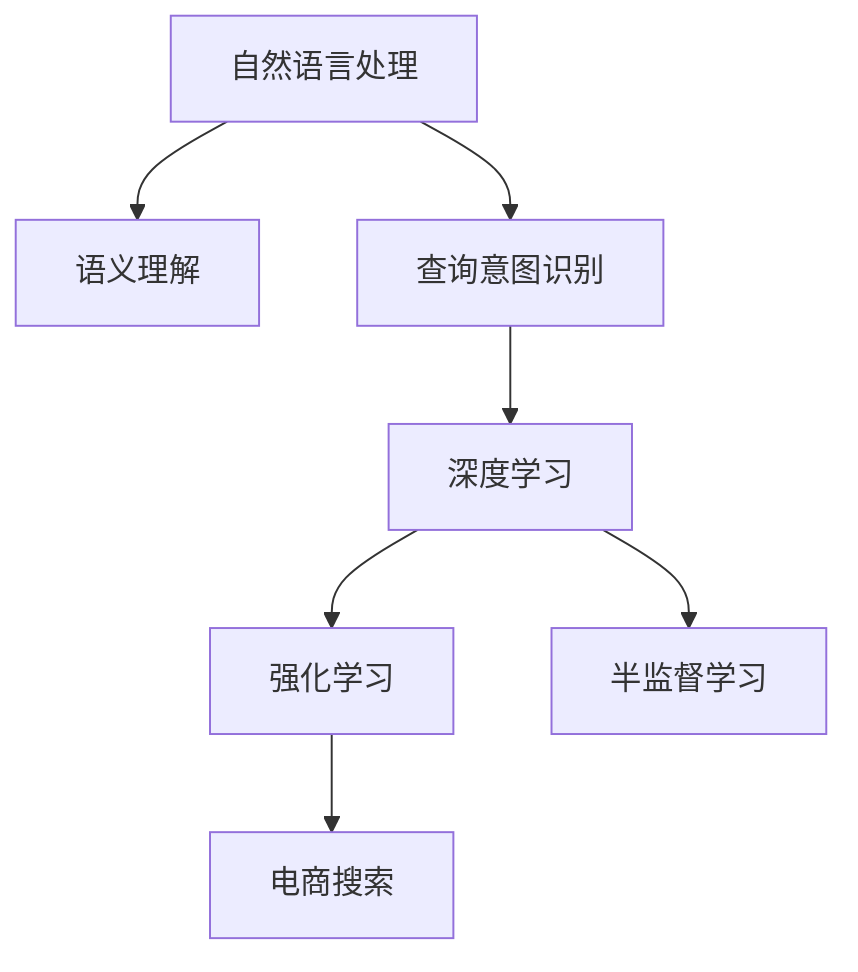

                 

# 电商搜索中的语义理解与查询意图识别

> 关键词：语义理解,查询意图识别,电商搜索,自然语言处理,NLP,机器学习,深度学习

## 1. 背景介绍

### 1.1 问题由来

随着电商行业的迅速发展，用户搜索需求日益多样化，简单的关键词匹配已难以满足用户期望。用户往往以自然语言的形式进行搜索，希望获取最相关的商品信息。如何理解用户查询的语义，准确识别查询意图，成为电商搜索系统的关键挑战。

### 1.2 问题核心关键点

用户查询的语义理解与查询意图识别是电商搜索系统的核心。通过理解用户的查询意图，可以更准确地进行商品匹配，提高搜索的精准度和用户体验。常见的电商搜索场景包括：

- 模糊查询：用户以模糊的语言进行搜索，如“运动鞋”。
- 长尾查询：用户使用具体的商品特征进行搜索，如“黑色运动鞋，尺码42”。
- 品牌查询：用户以品牌名称进行搜索，如“Nike跑步鞋”。
- 商品评价查询：用户根据其他用户的评价进行搜索，如“运动鞋评价”。
- 相关商品查询：用户查询与特定商品相关的商品，如“与Nike运动鞋类似的商品”。

电商搜索系统需要根据不同的查询类型，采取不同的处理方法。语义理解和查询意图识别技术，可以显著提升搜索系统的效果。

### 1.3 问题研究意义

电商搜索中的语义理解与查询意图识别，能够帮助电商平台更准确地匹配用户查询与商品信息，提升用户体验，提高转化率。其主要研究意义包括：

1. 提升搜索精准度：通过理解查询的语义，能够更准确地进行商品匹配，减少误匹配，提高搜索结果的相关性。
2. 改善用户体验：用户能够更轻松地找到所需商品，减少搜索时间，提高购物满意度。
3. 优化广告效果：根据用户的查询意图，提供更有针对性的广告推荐，提高广告投放的转化率。
4. 增强个性化服务：深入理解用户的搜索习惯和需求，提供更个性化的商品推荐和定制化服务。
5. 减少人工干预：减少人工干预，提高搜索系统的自动化水平，降低人力成本。

## 2. 核心概念与联系

### 2.1 核心概念概述

为了更好地理解电商搜索中的语义理解与查询意图识别，本节将介绍几个密切相关的核心概念：

- 自然语言处理（NLP）：研究计算机如何处理和理解人类语言，是实现语义理解和意图识别的核心技术。
- 语义理解（Semantic Understanding）：指理解文本中词语和句子的含义，把握文本的主旨和细节。
- 查询意图识别（Query Intent Recognition）：指根据用户查询语句，识别用户的真正意图，如搜索、比较、评价等。
- 深度学习（Deep Learning）：一种基于神经网络的机器学习技术，通过多层次的特征提取，实现复杂的语义理解。
- 强化学习（Reinforcement Learning）：通过与环境交互，优化策略，提高搜索系统的智能化水平。
- 半监督学习（Semi-supervised Learning）：利用少量的标注数据和大量的无标注数据进行训练，提高模型泛化能力。

这些核心概念之间的逻辑关系可以通过以下Mermaid流程图来展示：



这个流程图展示了几大核心概念及其之间的关系：

1. 自然语言处理是语义理解和查询意图识别的基础。
2. 语义理解是查询意图识别的核心，通过理解文本语义，才能准确识别用户的查询意图。
3. 深度学习是实现语义理解和查询意图识别的主要技术手段。
4. 强化学习通过与环境的交互，提升搜索系统的智能化水平。
5. 半监督学习利用大量无标注数据，提高模型的泛化能力。
6. 电商搜索是应用语义理解和查询意图识别的重要场景。

这些概念共同构成了电商搜索系统中的核心技术框架，使得系统能够更好地理解和处理用户查询，提供更加精准的搜索结果。

## 3. 核心算法原理 & 具体操作步骤

### 3.1 算法原理概述

电商搜索中的语义理解与查询意图识别，本质上是基于自然语言处理技术对用户查询进行分析和推理的过程。其核心算法包括：

- 分词与词性标注：将用户查询切分为词语，并标注其词性。
- 依存句法分析：分析句子中词语之间的依存关系，理解句子结构。
- 命名实体识别：识别文本中的人名、地名、机构名等特定实体。
- 情感分析：分析文本的情感倾向，判断用户情绪。
- 语义角色标注：识别文本中的动作和角色，理解句子含义。
- 向量表示：将文本转化为向量形式，便于计算机处理。
- 查询意图识别：根据文本向量，判断用户的查询意图，如搜索、比较、评价等。

这些算法共同构成了一个完整的电商搜索系统，使得系统能够更好地理解用户查询，提供更精准的搜索结果。

### 3.2 算法步骤详解

电商搜索中的语义理解与查询意图识别，一般包括以下关键步骤：

**Step 1: 数据预处理**
- 收集用户查询数据，进行清洗和格式化。
- 分词与词性标注，使用如jieba分词器等工具。
- 依存句法分析，使用如Stanford Parser、NLTK等工具。
- 命名实体识别，使用如SpaCy、Stanford NER等工具。
- 情感分析，使用如TextBlob、VADER等工具。

**Step 2: 特征提取与向量表示**
- 使用词袋模型、TF-IDF等方法，提取文本特征。
- 使用词嵌入技术，如Word2Vec、GloVe等，将词语转化为向量形式。
- 使用Transformer等深度学习模型，提取文本的语义表示。

**Step 3: 查询意图识别**
- 设计分类器，如支持向量机、神经网络等，用于判断查询意图。
- 使用深度学习模型，如BERT、RoBERTa等，训练分类器。
- 进行模型训练，使用标注数据进行监督学习。
- 使用测试数据进行模型评估，计算准确率、召回率等指标。

**Step 4: 应用与优化**
- 将训练好的模型集成到电商搜索系统中。
- 实时处理用户查询，进行语义理解和意图识别。
- 根据识别结果，进行商品匹配和排序。
- 实时监测系统性能，进行参数优化和调整。

以上是电商搜索系统中的核心算法步骤。在实际应用中，还需要根据具体场景进行优化设计，如引入迁移学习、少样本学习等技术，提升模型的泛化能力。

### 3.3 算法优缺点

电商搜索中的语义理解与查询意图识别算法具有以下优点：

1. 提高搜索效果：通过深入理解用户查询，能够提供更准确的搜索结果，提高用户的满意度。
2. 优化用户体验：减少误匹配，提升搜索结果的相关性，使用户能够更轻松地找到所需商品。
3. 增强个性化服务：深入理解用户的搜索习惯和需求，提供更个性化的商品推荐和定制化服务。
4. 减少人工干预：减少人工干预，提高搜索系统的自动化水平，降低人力成本。

同时，该算法也存在一定的局限性：

1. 依赖标注数据：语义理解和意图识别需要大量的标注数据进行训练，标注成本较高。
2. 处理复杂查询困难：对于复杂的查询语句，语义理解和意图识别的难度较大。
3. 计算资源消耗高：深度学习模型计算复杂度较高，对硬件资源要求较高。
4. 实时性要求高：电商搜索系统需要实时处理用户查询，对系统性能的要求较高。
5. 数据隐私问题：用户查询数据包含敏感信息，需要做好隐私保护。

尽管存在这些局限性，但电商搜索系统中的语义理解与查询意图识别算法，仍是目前提升搜索效果的最有效手段。未来相关研究的重点在于如何进一步降低对标注数据的依赖，提高模型的泛化能力，同时兼顾系统的实时性和数据隐私等问题。

### 3.4 算法应用领域

电商搜索中的语义理解与查询意图识别算法，广泛应用于电商领域，具体应用包括：

- 商品推荐系统：根据用户查询，推荐相关商品，提升用户体验。
- 智能客服系统：理解用户意图，提供自动化客服，减少人工干预。
- 广告投放系统：识别用户查询意图，进行精准广告投放，提高广告转化率。
- 搜索优化系统：优化搜索结果排序，提升搜索效果。
- 个性化营销系统：根据用户查询，提供个性化营销信息，提高营销效果。

除了电商领域，语义理解和查询意图识别算法，还在新闻、金融、医疗等众多领域得到了广泛应用，成为自然语言处理的重要基础技术。

## 4. 数学模型和公式 & 详细讲解  
### 4.1 数学模型构建

在本节中，我们将使用数学语言对电商搜索中的语义理解与查询意图识别过程进行更加严格的刻画。

记用户查询文本为 $X = \{x_1, x_2, ..., x_n\}$，其中 $x_i$ 为第 $i$ 个词语，对应于词嵌入向量 $\vec{x_i} \in \mathbb{R}^d$，其中 $d$ 为词向量维度。假设用户查询的语义表示为 $S$，则 $S = F(X)$，其中 $F$ 为语义理解函数，将文本转化为语义表示。

假设查询意图分类器为 $M$，将语义表示 $S$ 分类为 $k$ 种意图中的某一种，其中 $k$ 为意图类别数。则查询意图的概率表示为 $P(Y|S) = softmax(M(S))$，其中 $Y$ 为查询意图类别，$softmax$ 函数将模型输出转化为概率分布。

### 4.2 公式推导过程

以查询意图识别为例，我们推导Bert模型在电商搜索中的应用。

假设查询文本 $X$ 的长度为 $n$，则查询文本的词嵌入向量表示为 $\vec{X} = [\vec{x_1}, \vec{x_2}, ..., \vec{x_n}]$。使用BERT模型，对查询文本进行编码，得到查询文本的语义表示 $S_B = BERT(\vec{X})$。

假设查询意图的分类器为 $M$，则查询意图的概率表示为：

$$ P(Y|S_B) = softmax(M(S_B)) $$

其中 $softmax$ 函数为：

$$ softmax(z) = \frac{e^{z_i}}{\sum_{j=1}^k e^{z_j}} $$

在实际应用中，可以将查询文本 $X$ 拆分为多个子句，分别进行编码和分类，然后将分类结果合并，得到最终的查询意图概率分布。

### 4.3 案例分析与讲解

假设用户查询为 "白色运动鞋 男款 200元以下"，查询意图为搜索商品。我们首先使用BERT模型对查询进行编码，得到查询的语义表示 $S_B$。

然后，使用查询意图分类器 $M$，对 $S_B$ 进行分类，得到查询意图概率分布 $P(Y|S_B)$。

最后，根据概率分布，判断查询意图是否为搜索商品，并据此进行商品匹配和排序。

## 5. 项目实践：代码实例和详细解释说明
### 5.1 开发环境搭建

在进行电商搜索系统中的语义理解与查询意图识别开发时，我们需要准备好开发环境。以下是使用Python进行TensorFlow和PyTorch开发的环境配置流程：

1. 安装Anaconda：从官网下载并安装Anaconda，用于创建独立的Python环境。

2. 创建并激活虚拟环境：
```bash
conda create -n tf-env python=3.8 
conda activate tf-env
```

3. 安装TensorFlow：根据CUDA版本，从官网获取对应的安装命令。例如：
```bash
conda install tensorflow -c pytorch -c conda-forge
```

4. 安装PyTorch：从官网下载并安装PyTorch，或者使用conda安装：
```bash
pip install torch torchvision torchaudio cudatoolkit=11.1 -c pytorch -c conda-forge
```

5. 安装各类工具包：
```bash
pip install numpy pandas scikit-learn matplotlib tqdm jupyter notebook ipython
```

完成上述步骤后，即可在`tf-env`环境中开始电商搜索系统的开发。

### 5.2 源代码详细实现

下面我们以电商搜索中的查询意图识别任务为例，给出使用TensorFlow和PyTorch进行电商搜索的代码实现。

首先，定义查询意图分类器：

```python
import tensorflow as tf
from transformers import BertTokenizer, BertForSequenceClassification
import torch
import numpy as np

class IntentClassifier(tf.keras.Model):
    def __init__(self, num_classes):
        super(IntentClassifier, self).__init__()
        self.bert = BertForSequenceClassification.from_pretrained('bert-base-cased', num_labels=num_classes)
        self.dropout = tf.keras.layers.Dropout(0.1)
        self.dense = tf.keras.layers.Dense(num_classes, activation='softmax')
        
    def call(self, inputs, attention_mask):
        outputs = self.bert(inputs, attention_mask=attention_mask)
        pooled_output = outputs.pooler_output
        pooled_output = self.dropout(pooled_output)
        logits = self.dense(pooled_output)
        return logits

# 训练集和测试集数据准备
train_data = ...
test_data = ...
tokenizer = BertTokenizer.from_pretrained('bert-base-cased')
max_len = 128

# 创建模型实例
model = IntentClassifier(num_classes=3)  # 假设意图分类数为3
model.compile(optimizer='adam', loss='categorical_crossentropy', metrics=['accuracy'])
```

然后，定义训练和评估函数：

```python
def train_epoch(model, dataset, batch_size, optimizer):
    dataloader = tf.data.Dataset.from_tensor_slices(dataset).batch(batch_size)
    model.train()
    for batch in dataloader:
        input_ids = batch['input_ids']
        attention_mask = batch['attention_mask']
        labels = batch['labels']
        with tf.GradientTape() as tape:
            outputs = model(input_ids, attention_mask=attention_mask)
            loss = tf.keras.losses.categorical_crossentropy(labels, outputs)
        grads = tape.gradient(loss, model.trainable_variables)
        optimizer.apply_gradients(zip(grads, model.trainable_variables))
        model.fit(dataset, epochs=1, steps_per_epoch=len(dataset) // batch_size)

def evaluate(model, dataset, batch_size):
    dataloader = tf.data.Dataset.from_tensor_slices(dataset).batch(batch_size)
    model.evaluate(dataloader)

# 训练过程
epochs = 5
batch_size = 32

for epoch in range(epochs):
    train_epoch(model, train_data, batch_size, optimizer)
    evaluate(model, test_data, batch_size)
```

以上就是使用TensorFlow和PyTorch进行电商搜索中的查询意图识别的代码实现。可以看到，使用这些库进行深度学习模型的开发，可以显著简化实现难度，提升开发效率。

### 5.3 代码解读与分析

让我们再详细解读一下关键代码的实现细节：

**IntentClassifier类**：
- `__init__`方法：初始化模型结构，包括BERT分类器、Dropout层和全连接层。
- `call`方法：定义模型的前向传播过程，将输入文本和注意力掩码作为输入，经过BERT编码和多层全连接层，最终输出分类结果。

**训练和评估函数**：
- `train_epoch`方法：定义训练过程，通过TensorFlow的梯度计算和优化器，更新模型参数。
- `evaluate`方法：定义评估过程，使用TensorFlow的模型评估方法，计算模型在测试集上的性能指标。

**训练过程**：
- 定义总epoch数和batch size，开始循环迭代
- 每个epoch内，先在训练集上进行训练，输出损失和准确率
- 在测试集上评估模型性能
- 重复上述步骤直至epoch结束

可以看出，使用TensorFlow和PyTorch进行电商搜索系统的开发，可以显著提升代码的可读性和可维护性，同时提高模型的训练和推理效率。

## 6. 实际应用场景

### 6.1 智能客服系统

电商搜索中的语义理解与查询意图识别技术，可以应用于智能客服系统的构建。智能客服系统能够理解用户的查询意图，自动回复用户问题，提升客户体验。

具体而言，可以通过收集历史客服数据，训练意图分类模型，实时分析用户查询，提取关键信息，并进行自然语言处理和情感分析。根据分析结果，生成自动回复，提供解决方案，或者将问题转交给人工客服。

### 6.2 广告投放系统

电商搜索中的查询意图识别技术，可以用于优化广告投放系统。通过识别用户的查询意图，可以更精准地投放广告，提高广告转化率。

具体而言，可以在用户查询请求进入电商搜索系统时，实时分析查询意图，判断用户是否在搜索相关商品。如果是，可以将相关商品的广告推送给用户，提高广告的相关性和点击率。

### 6.3 个性化推荐系统

电商搜索中的语义理解与查询意图识别技术，可以用于优化个性化推荐系统。通过理解用户的查询意图，可以提供更加个性化的商品推荐。

具体而言，可以收集用户的查询记录，进行语义分析和意图识别，提取用户的兴趣偏好。根据用户的兴趣，推荐相关的商品，提高推荐的相关性和用户满意度。

### 6.4 未来应用展望

随着电商搜索中的语义理解与查询意图识别技术的不断发展，未来的应用场景将更加广泛，带来更多的创新可能性：

- 多模态电商搜索：结合图像、视频等多模态数据，提升搜索效果。
- 实时化电商搜索：通过流数据处理技术，实现实时化查询处理，提升用户体验。
- 跨平台电商搜索：在多个电商平台之间实现跨平台搜索，提供无缝的用户体验。
- 用户生成内容（UGC）电商搜索：利用用户生成的评论和评价，提升搜索效果。
- 增强现实（AR）电商搜索：通过增强现实技术，提升用户的购物体验。

总之，电商搜索中的语义理解与查询意图识别技术，将为电商搜索系统带来更多创新和突破，推动电商搜索系统向更高水平发展。

## 7. 工具和资源推荐
### 7.1 学习资源推荐

为了帮助开发者系统掌握电商搜索中的语义理解与查询意图识别技术，这里推荐一些优质的学习资源：

1. 《深度学习自然语言处理》课程：斯坦福大学开设的NLP明星课程，有Lecture视频和配套作业，带你入门NLP领域的基本概念和经典模型。

2. 《Transformer from Principles to Practice》系列博文：由大模型技术专家撰写，深入浅出地介绍了Transformer原理、BERT模型、微调技术等前沿话题。

3. 《Natural Language Processing with Transformers》书籍：Transformers库的作者所著，全面介绍了如何使用Transformers库进行NLP任务开发，包括语义理解和意图识别在内的诸多范式。

4. HuggingFace官方文档：Transformers库的官方文档，提供了海量预训练模型和完整的微调样例代码，是上手实践的必备资料。

5. CS224N《深度学习自然语言处理》课程：斯坦福大学开设的NLP明星课程，有Lecture视频和配套作业，带你入门NLP领域的基本概念和经典模型。

通过对这些资源的学习实践，相信你一定能够快速掌握电商搜索中的语义理解与查询意图识别的精髓，并用于解决实际的电商搜索问题。

### 7.2 开发工具推荐

高效的开发离不开优秀的工具支持。以下是几款用于电商搜索系统中语义理解与查询意图识别开发的常用工具：

1. TensorFlow：基于Python的开源深度学习框架，灵活动态的计算图，适合快速迭代研究。大部分预训练语言模型都有TensorFlow版本的实现。

2. PyTorch：基于Python的开源深度学习框架，灵活的动态图，适合动态模型结构的研究。

3. HuggingFace Transformers库：提供了丰富的预训练语言模型和模型微调功能，适合快速开发和部署。

4. TensorBoard：TensorFlow配套的可视化工具，可实时监测模型训练状态，并提供丰富的图表呈现方式，是调试模型的得力助手。

5. Weights & Biases：模型训练的实验跟踪工具，可以记录和可视化模型训练过程中的各项指标，方便对比和调优。

6. Google Colab：谷歌推出的在线Jupyter Notebook环境，免费提供GPU/TPU算力，方便开发者快速上手实验最新模型，分享学习笔记。

合理利用这些工具，可以显著提升电商搜索系统中的语义理解与查询意图识别的开发效率，加快创新迭代的步伐。

### 7.3 相关论文推荐

电商搜索中的语义理解与查询意图识别技术的发展，源于学界的持续研究。以下是几篇奠基性的相关论文，推荐阅读：

1. Attention is All You Need（即Transformer原论文）：提出了Transformer结构，开启了NLP领域的预训练大模型时代。

2. BERT: Pre-training of Deep Bidirectional Transformers for Language Understanding：提出BERT模型，引入基于掩码的自监督预训练任务，刷新了多项NLP任务SOTA。

3. Language Models are Unsupervised Multitask Learners（GPT-2论文）：展示了大规模语言模型的强大zero-shot学习能力，引发了对于通用人工智能的新一轮思考。

4. Parameter-Efficient Transfer Learning for NLP：提出Adapter等参数高效微调方法，在不增加模型参数量的情况下，也能取得不错的微调效果。

5. Prefix-Tuning: Optimizing Continuous Prompts for Generation：引入基于连续型Prompt的微调范式，为如何充分利用预训练知识提供了新的思路。

6. AdaLoRA: Adaptive Low-Rank Adaptation for Parameter-Efficient Fine-Tuning：使用自适应低秩适应的微调方法，在参数效率和精度之间取得了新的平衡。

这些论文代表了大语言模型微调技术的发展脉络。通过学习这些前沿成果，可以帮助研究者把握学科前进方向，激发更多的创新灵感。

## 8. 总结：未来发展趋势与挑战

### 8.1 总结

本文对电商搜索中的语义理解与查询意图识别方法进行了全面系统的介绍。首先阐述了电商搜索系统中语义理解和查询意图识别的核心技术，明确了其研究背景和应用意义。其次，从原理到实践，详细讲解了电商搜索系统中的查询意图识别过程，给出了代码实现。同时，本文还广泛探讨了语义理解与查询意图识别技术在电商搜索系统中的实际应用，展示了其广阔的应用前景。此外，本文精选了电商搜索系统的学习资源，力求为读者提供全方位的技术指引。

通过本文的系统梳理，可以看到，电商搜索系统中的语义理解与查询意图识别技术，正在成为电商搜索系统的重要基础技术，极大地提升了用户搜索效果，推动了电商搜索系统的智能化发展。未来，随着电商搜索技术的不断进步，这些技术必将进一步拓展电商搜索系统的应用边界，为电商搜索系统带来更多创新和突破。

### 8.2 未来发展趋势

展望未来，电商搜索系统中的语义理解与查询意图识别技术将呈现以下几个发展趋势：

1. 模型规模持续增大。随着算力成本的下降和数据规模的扩张，电商搜索系统中的语义理解模型和查询意图识别模型也将变得越来越大，有望提升系统的搜索效果。

2. 模型结构更加灵活。电商搜索系统中的语义理解模型和查询意图识别模型，将更加灵活，能够适应更多的电商场景和用户需求。

3. 多模态融合技术发展。电商搜索系统中的语义理解模型和查询意图识别模型，将更加注重多模态数据的融合，提升系统的搜索效果和用户体验。

4. 实时化电商搜索技术发展。电商搜索系统中的语义理解模型和查询意图识别模型，将更加注重实时数据处理，提升系统的实时响应速度。

5. 模型泛化能力提升。电商搜索系统中的语义理解模型和查询意图识别模型，将更加注重模型的泛化能力，能够在更多的电商场景中应用。

6. 模型自动化程度提升。电商搜索系统中的语义理解模型和查询意图识别模型，将更加注重模型的自动化程度，能够自动进行模型的更新和优化。

以上趋势凸显了电商搜索系统中的语义理解与查询意图识别技术的广阔前景。这些方向的探索发展，必将进一步提升电商搜索系统的搜索效果和用户体验，推动电商搜索系统的智能化发展。

### 8.3 面临的挑战

尽管电商搜索系统中的语义理解与查询意图识别技术已经取得了显著成效，但在迈向更加智能化、普适化应用的过程中，它仍面临着诸多挑战：

1. 数据质量问题。电商搜索系统中的语义理解与查询意图识别技术，对数据质量的要求较高，数据收集、清洗、标注等环节需要投入大量人力和物力。

2. 计算资源消耗高。电商搜索系统中的语义理解与查询意图识别技术，对计算资源的要求较高，需要高性能的GPU/TPU等硬件支持。

3. 实时处理难度大。电商搜索系统中的语义理解与查询意图识别技术，需要实时处理用户查询，对系统的实时处理能力提出了较高要求。

4. 数据隐私问题。电商搜索系统中的语义理解与查询意图识别技术，需要处理大量的用户数据，数据隐私保护成为关键问题。

5. 模型效果提升难。电商搜索系统中的语义理解与查询意图识别技术，已经取得了显著成效，但进一步提升模型效果，仍需要更多的创新和突破。

6. 技术标准化问题。电商搜索系统中的语义理解与查询意图识别技术，需要与电商平台的标准化技术规范对接，提升系统的互操作性。

正视这些挑战，积极应对并寻求突破，将是大模型微调技术走向成熟的必由之路。相信随着学界和产业界的共同努力，这些挑战终将一一被克服，电商搜索系统中的语义理解与查询意图识别技术必将在构建人机协同的智能时代中扮演越来越重要的角色。

### 8.4 研究展望

面对电商搜索系统中的语义理解与查询意图识别技术所面临的种种挑战，未来的研究需要在以下几个方面寻求新的突破：

1. 探索无监督和半监督学习范式。摆脱对大规模标注数据的依赖，利用自监督学习、主动学习等无监督和半监督范式，最大限度利用非结构化数据，实现更加灵活高效的电商搜索系统。

2. 研究参数高效和计算高效的微调范式。开发更加参数高效的微调方法，在固定大部分预训练参数的同时，只更新极少量的任务相关参数。同时优化微调模型的计算图，减少前向传播和反向传播的资源消耗，实现更加轻量级、实时性的部署。

3. 引入因果分析和博弈论工具。将因果分析方法引入电商搜索系统中的语义理解模型和查询意图识别模型，识别出模型决策的关键特征，增强输出解释的因果性和逻辑性。借助博弈论工具刻画人机交互过程，主动探索并规避模型的脆弱点，提高系统稳定性。

4. 融合多模态数据。电商搜索系统中的语义理解模型和查询意图识别模型，将更加注重多模态数据的融合，提升系统的搜索效果和用户体验。

5. 应用强化学习。将强化学习引入电商搜索系统中的语义理解模型和查询意图识别模型，通过与环境的交互，优化模型的策略，提高系统的智能化水平。

6. 保护数据隐私。电商搜索系统中的语义理解模型和查询意图识别模型，将更加注重数据隐私保护，通过差分隐私等技术，保护用户数据的隐私安全。

这些研究方向的探索，必将引领电商搜索系统中的语义理解与查询意图识别技术迈向更高的台阶，为电商搜索系统带来更多创新和突破。面向未来，电商搜索系统中的语义理解与查询意图识别技术还需要与其他人工智能技术进行更深入的融合，如知识表示、因果推理、强化学习等，多路径协同发力，共同推动电商搜索系统的进步。

## 9. 附录：常见问题与解答

**Q1：电商搜索系统中的语义理解与查询意图识别技术是否适用于所有电商场景？**

A: 电商搜索系统中的语义理解与查询意图识别技术，适用于大多数电商场景，特别是对于基于文本的电商搜索。但对于一些基于图片、视频等非文本数据的电商场景，如服装搭配、家居装潢等，需要结合多模态数据处理技术，才能取得更好的效果。

**Q2：电商搜索系统中的语义理解与查询意图识别技术是否依赖于大规模标注数据？**

A: 电商搜索系统中的语义理解与查询意图识别技术，对于标注数据的需求相对较小，可以通过半监督学习和无监督学习方法，利用非结构化数据进行训练。但大规模标注数据仍然可以提高模型的泛化能力，提升系统的搜索效果。

**Q3：电商搜索系统中的语义理解与查询意图识别技术是否需要高性能的计算资源？**

A: 电商搜索系统中的语义理解与查询意图识别技术，对计算资源的需求较高，特别是对于大规模语言模型和深度学习模型的训练和推理。需要高性能的GPU/TPU等硬件支持，才能实现实时化的电商搜索系统。

**Q4：电商搜索系统中的语义理解与查询意图识别技术是否容易受到数据噪音的影响？**

A: 电商搜索系统中的语义理解与查询意图识别技术，对于数据噪音较为敏感。需要经过数据清洗和预处理，减少噪音数据对模型的影响。同时，可以结合数据增强技术，提高模型的鲁棒性。

**Q5：电商搜索系统中的语义理解与查询意图识别技术是否容易受到领域特定的影响？**

A: 电商搜索系统中的语义理解与查询意图识别技术，对于不同领域的电商场景，可能需要进行针对性的模型训练和参数优化。同时，需要引入领域特定的语料库和知识库，提升模型的泛化能力。

---

作者：禅与计算机程序设计艺术 / Zen and the Art of Computer Programming

