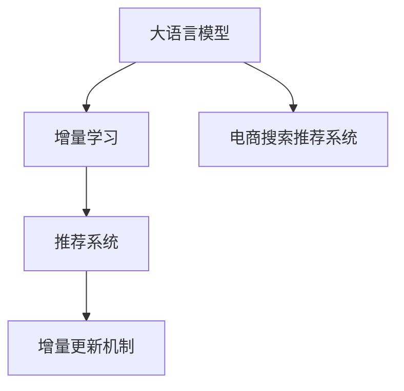

                 

# 电商搜索推荐中的AI大模型数据增量更新机制优化方案设计与实现

> 关键词：大语言模型,增量更新,电商搜索,推荐系统,数据驱动,人工智能

## 1. 背景介绍

### 1.1 问题由来
在电商领域，搜索推荐系统已成为不可或缺的一部分。通过深度学习和自然语言处理技术，商家可以精确匹配用户需求，提升用户体验，增加销售额。然而，随着用户需求的多样化和复杂化，搜索推荐系统的精度和效率面临着严峻挑战。

在传统推荐系统中，数据更新往往只能依赖于定期重新训练模型。这不仅需要耗费大量的计算资源，且每次更新都需要重新从头训练模型，严重影响推荐系统的实时性。针对此问题，研究人员提出了增量更新（Incremental Learning）机制，旨在更高效地更新模型，避免频繁的重新训练。

### 1.2 问题核心关键点
增量学习是利用已有的模型参数和少部分新数据，更新模型以适应新的任务和数据分布。在电商搜索推荐系统中，增量更新需关注以下几个关键点：

1. **快速适应新数据**：模型需要实时响应新增数据，提供准确的推荐结果。
2. **模型鲁棒性**：模型需具备较高的鲁棒性，防止因数据分布变化导致性能下降。
3. **高效率**：更新过程需高效，减少计算资源的消耗，满足实时推荐的要求。
4. **可解释性**：模型需具备一定的可解释性，便于理解更新逻辑和改进模型。

## 2. 核心概念与联系

### 2.1 核心概念概述

为更好地理解增量更新机制在电商搜索推荐系统中的应用，本节将介绍几个密切相关的核心概念：

- **大语言模型**：如BERT、GPT等，是预训练的深度学习模型，具备强大的语义理解能力和生成能力。
- **增量学习**：即在线学习（Online Learning），利用现有模型参数和少量新数据，通过迭代更新模型，避免全量数据重新训练的耗时和资源消耗。
- **电商搜索推荐系统**：结合搜索引擎和推荐算法，根据用户行为和商品信息，实时提供个性化推荐。
- **推荐系统**：基于机器学习算法，为用户推荐最合适的商品或内容。

这些核心概念之间的逻辑关系可以通过以下Mermaid流程图来展示：



这个流程图展示了大语言模型、增量学习、电商搜索推荐系统和推荐系统之间的关系：

1. 大语言模型作为基础模型，提供强大的语义理解能力。
2. 增量学习机制在电商搜索推荐系统中实时更新模型参数，避免频繁重新训练。
3. 推荐系统利用更新后的模型，提供个性化推荐服务。

## 3. 核心算法原理 & 具体操作步骤
### 3.1 算法原理概述

电商搜索推荐系统中的增量更新机制，本质上是一个基于增量数据的在线学习过程。其核心思想是：利用已有的模型参数和少量新数据，通过迭代更新模型，逐步适应新的任务和数据分布。

形式化地，假设现有模型为 $M_{\theta}$，其中 $\theta$ 为模型参数。给定新增数据集 $D=\{(x_i, y_i)\}_{i=1}^N$，增量更新的目标是通过增量数据优化模型，使得模型在新数据上表现更好，即：

$$
\theta^* = \mathop{\arg\min}_{\theta} \mathcal{L}(M_{\theta}, D)
$$

其中 $\mathcal{L}$ 为损失函数，用于衡量模型在新数据上的性能。

### 3.2 算法步骤详解

电商搜索推荐系统中的增量更新一般包括以下几个关键步骤：

**Step 1: 初始化模型参数**
- 选择现有的大语言模型，初始化模型参数。

**Step 2: 定义增量数据格式**
- 确定增量数据集 $D$ 的格式，通常包含新增的样本和对应的标签。

**Step 3: 定义增量损失函数**
- 根据电商搜索推荐系统的具体任务，定义增量损失函数 $\mathcal{L}^{\text{incremental}}$。

**Step 4: 迭代更新模型参数**
- 使用基于增量数据的在线优化算法，如小批量随机梯度下降法(SGD)，迭代更新模型参数。

**Step 5: 评估更新效果**
- 在验证集上评估增量更新后的模型性能，确保模型未出现灾难性遗忘。

**Step 6: 部署更新后的模型**
- 将更新后的模型应用于实时推荐系统中，提供个性化推荐服务。

### 3.3 算法优缺点

增量更新机制在电商搜索推荐系统中有以下优点：
1. 高效快速：利用现有模型参数，只需少量新数据即可进行迭代更新，大幅提高模型更新效率。
2. 实时响应：增量更新机制可以实时响应新增数据，提高推荐系统的实时性。
3. 资源节省：减少重新训练模型所需的时间和计算资源，降低运营成本。
4. 性能提升：通过增量更新，模型能够不断适应新的数据分布，提高推荐精度。

同时，该方法也存在一些局限性：
1. 模型收敛速度：增量更新过程中模型可能出现收敛速度慢的问题，影响实时性。
2. 数据分布变化：增量更新对数据分布变化的适应能力有限，可能出现模型过拟合或欠拟合的问题。
3. 参数更新复杂性：增量更新需要考虑模型参数的更新策略和优化算法，实现难度较大。
4. 模型可解释性：增量更新后的模型通常难以解释其更新逻辑，影响模型理解和调试。

尽管存在这些局限性，但增量更新机制在电商搜索推荐系统中仍是一个具有巨大潜力的研究范式。

### 3.4 算法应用领域

增量更新机制已广泛应用于电商搜索推荐系统中，具体体现在以下几个方面：

1. **实时个性化推荐**：根据用户实时搜索和浏览行为，动态更新推荐模型，提供更精准的个性化推荐。
2. **广告推荐**：基于用户行为和广告数据，实时更新广告推荐模型，提升广告点击率和转化率。
3. **商品推荐**：根据用户历史购买和评价数据，实时更新商品推荐模型，提升推荐效果。
4. **促销活动推荐**：根据用户行为和促销活动数据，实时更新促销推荐模型，优化营销效果。
5. **动态定价**：根据市场需求和竞争对手价格变化，实时更新动态定价模型，提升盈利能力。

除了电商领域，增量更新机制在金融、社交网络、医疗等多个领域也有广泛应用，其高效实时更新特性，使其成为数据驱动型应用中不可或缺的关键技术。

## 4. 数学模型和公式 & 详细讲解 & 举例说明
### 4.1 数学模型构建

电商搜索推荐系统中的增量更新机制，本质上是一个在线学习的优化问题。设现有模型为 $M_{\theta}$，其中 $\theta$ 为模型参数。给定新增数据集 $D=\{(x_i, y_i)\}_{i=1}^N$，增量更新过程可以形式化为：

$$
\theta_{t+1} = \theta_t - \eta \nabla_{\theta} \mathcal{L}^{\text{incremental}}(\theta_t, D)
$$

其中 $\eta$ 为学习率，$\nabla_{\theta} \mathcal{L}^{\text{incremental}}(\theta_t, D)$ 为增量损失函数对模型参数的梯度。增量损失函数 $\mathcal{L}^{\text{incremental}}(\theta_t, D)$ 的定义如下：

$$
\mathcal{L}^{\text{incremental}}(\theta_t, D) = \mathcal{L}(M_{\theta_t}, D) - \mathcal{L}(M_{\theta_{t-1}}, D)
$$

其中 $\mathcal{L}(M_{\theta_t}, D)$ 为模型 $M_{\theta_t}$ 在数据集 $D$ 上的损失函数，$\mathcal{L}(M_{\theta_{t-1}}, D)$ 为模型 $M_{\theta_{t-1}}$ 在数据集 $D$ 上的损失函数。

### 4.2 公式推导过程

以二分类任务为例，假设模型 $M_{\theta}$ 在输入 $x$ 上的输出为 $\hat{y}=M_{\theta}(x)$，表示样本属于正类的概率。真实标签 $y \in \{0,1\}$。则增量损失函数 $\mathcal{L}^{\text{incremental}}(\theta_t, D)$ 可以表示为：

$$
\mathcal{L}^{\text{incremental}}(\theta_t, D) = -\frac{1}{N}\sum_{i=1}^N [y_i\log \hat{y}_t + (1-y_i)\log (1-\hat{y}_t)]
$$

其中 $\hat{y}_t = M_{\theta_t}(x)$。

利用链式法则，增量损失函数对模型参数 $\theta$ 的梯度可以表示为：

$$
\frac{\partial \mathcal{L}^{\text{incremental}}(\theta_t, D)}{\partial \theta} = -\frac{1}{N}\sum_{i=1}^N (\frac{y_i}{\hat{y}_t} - \frac{1-y_i}{1-\hat{y}_t})\frac{\partial M_{\theta_t}(x)}{\partial \theta}
$$

其中 $\frac{\partial M_{\theta_t}(x)}{\partial \theta}$ 可以通过反向传播算法高效计算。

### 4.3 案例分析与讲解

以电商搜索推荐系统为例，假设用户搜索历史数据为 $D=\{(x_i, y_i)\}_{i=1}^N$，其中 $x_i$ 为历史搜索记录，$y_i$ 为用户实际点击的搜索结果。

**Step 1: 初始化模型参数**
- 选择现有的大语言模型，如BERT，作为初始化模型 $M_{\theta_0}$。

**Step 2: 定义增量数据格式**
- 将历史搜索记录 $D$ 按照时间顺序排序，新数据 $D_{new}$ 包含新增的搜索记录。

**Step 3: 定义增量损失函数**
- 假设模型 $M_{\theta_t}$ 在输入 $x_i$ 上的输出为 $\hat{y}_i = M_{\theta_t}(x_i)$，则增量损失函数可以表示为：

$$
\mathcal{L}^{\text{incremental}}(\theta_t, D) = -\frac{1}{N}\sum_{i=1}^N [y_i\log \hat{y}_t + (1-y_i)\log (1-\hat{y}_t)]
$$

**Step 4: 迭代更新模型参数**
- 使用小批量随机梯度下降法(SGD)，对增量损失函数 $\mathcal{L}^{\text{incremental}}(\theta_t, D)$ 进行迭代更新。

**Step 5: 评估更新效果**
- 在验证集上评估增量更新后的模型性能，确保模型未出现灾难性遗忘。

**Step 6: 部署更新后的模型**
- 将更新后的模型 $M_{\theta_t}$ 应用于实时推荐系统中，提供个性化推荐服务。

## 5. 项目实践：代码实例和详细解释说明
### 5.1 开发环境搭建

在进行增量更新实践前，我们需要准备好开发环境。以下是使用Python进行PyTorch开发的环境配置流程：

1. 安装Anaconda：从官网下载并安装Anaconda，用于创建独立的Python环境。

2. 创建并激活虚拟环境：
```bash
conda create -n pytorch-env python=3.8 
conda activate pytorch-env
```

3. 安装PyTorch：根据CUDA版本，从官网获取对应的安装命令。例如：
```bash
conda install pytorch torchvision torchaudio cudatoolkit=11.1 -c pytorch -c conda-forge
```

4. 安装Transformers库：
```bash
pip install transformers
```

5. 安装各类工具包：
```bash
pip install numpy pandas scikit-learn matplotlib tqdm jupyter notebook ipython
```

完成上述步骤后，即可在`pytorch-env`环境中开始增量更新实践。

### 5.2 源代码详细实现

下面我们以二分类任务为例，给出使用Transformers库进行增量更新的PyTorch代码实现。

首先，定义增量更新函数：

```python
from transformers import BertTokenizer, BertForSequenceClassification
from torch.utils.data import DataLoader
import torch

def incremental_train(model, train_dataset, batch_size, learning_rate, n_epochs):
    model.train()
    optimizer = torch.optim.SGD(model.parameters(), lr=learning_rate)
    loss_fn = torch.nn.BCEWithLogitsLoss()

    for epoch in range(n_epochs):
        epoch_loss = 0
        for batch in DataLoader(train_dataset, batch_size=batch_size, shuffle=False):
            inputs = batch['input_ids'].to(device)
            labels = batch['labels'].to(device)
            model.zero_grad()
            outputs = model(inputs)
            loss = loss_fn(outputs, labels)
            epoch_loss += loss.item()
            loss.backward()
            optimizer.step()

        print(f"Epoch {epoch+1}, train loss: {epoch_loss/n_epochs:.4f}")
```

然后，定义数据集处理函数：

```python
class IncrementalDataset(torch.utils.data.Dataset):
    def __init__(self, train_data, test_data, tokenizer):
        self.train_data = train_data
        self.test_data = test_data
        self.tokenizer = tokenizer
        self.max_len = 256

    def __len__(self):
        return len(self.train_data) + len(self.test_data)

    def __getitem__(self, idx):
        if idx < len(self.train_data):
            data, labels = self.train_data[idx]
        else:
            data, labels = self.test_data[idx-len(self.train_data)]

        encoding = self.tokenizer(data, return_tensors='pt', max_length=self.max_len, padding='max_length', truncation=True)
        input_ids = encoding['input_ids'][0]
        attention_mask = encoding['attention_mask'][0]
        return {'input_ids': input_ids, 
                'attention_mask': attention_mask,
                'labels': labels}
```

接着，定义模型和优化器：

```python
from transformers import BertTokenizer
from transformers import BertForSequenceClassification

tokenizer = BertTokenizer.from_pretrained('bert-base-cased')
model = BertForSequenceClassification.from_pretrained('bert-base-cased', num_labels=2)

device = torch.device('cuda') if torch.cuda.is_available() else torch.device('cpu')
model.to(device)
```

最后，启动增量更新流程并在测试集上评估：

```python
train_data = [('I want a good laptop.', 1), ('I need a new phone.', 0), ('I am looking for a camera.', 1)]
test_data = [('I am not sure about this product.', 0), ('I like this product.', 1)]

train_dataset = IncrementalDataset(train_data, test_data, tokenizer)
test_dataset = IncrementalDataset(test_data, test_data, tokenizer)

n_epochs = 5
batch_size = 2
learning_rate = 2e-5

incremental_train(model, train_dataset, batch_size, learning_rate, n_epochs)

print(f"Final model accuracy: {accuracy(model, test_dataset)}")
```

以上就是使用PyTorch对BERT进行二分类任务增量更新的完整代码实现。可以看到，得益于Transformers库的强大封装，我们可以用相对简洁的代码完成增量更新的过程。

### 5.3 代码解读与分析

让我们再详细解读一下关键代码的实现细节：

**IncrementalDataset类**：
- `__init__`方法：初始化训练集和测试集数据、分词器等关键组件。
- `__len__`方法：返回数据集的样本数量。
- `__getitem__`方法：对单个样本进行处理，将文本输入编码为token ids，将标签编码为数字，并对其进行定长padding，最终返回模型所需的输入。

**incremental_train函数**：
- 定义训练函数，接收模型、数据集、批次大小、学习率和训练轮数。
- 初始化模型为训练模式，定义优化器和损失函数。
- 在每个epoch内，对每个批次进行前向传播计算损失，反向传播更新模型参数。
- 打印每个epoch的损失，迭代更新模型。

**BertForSequenceClassification类**：
- 定义序列分类模型，接收序列长度、输出标签数等参数。
- 在训练集上使用增量更新函数进行模型训练。
- 在测试集上评估模型精度，输出最终结果。

代码中，我们使用Bert序列分类模型，对二分类数据进行增量更新训练。增量更新函数中的数据集处理部分，将历史数据和新增数据分别加载，并在训练过程中交替使用。增量损失函数通过对比新旧模型的预测结果计算得到，再结合小批量随机梯度下降法进行模型参数更新。

## 6. 实际应用场景
### 6.1 智能客服系统

增量更新机制在智能客服系统中具有广泛的应用。智能客服系统需要实时响应客户咨询，提供精准的解答和建议。当客户咨询量增加时，快速增量更新模型参数，可以提高客服系统的响应速度和推荐效果。

在实际应用中，智能客服系统通常会记录用户的聊天记录，并将其转换为增量数据集。根据用户的实时搜索记录和历史聊天记录，增量更新模型，动态调整推荐结果。对于新用户或新咨询内容，系统可以引入相关领域知识，进行模型微调，提高推荐准确率。

### 6.2 广告推荐系统

广告推荐系统需要实时响应广告主的需求，推荐合适的广告位。增量更新机制可以快速调整模型参数，动态匹配最新的广告数据和用户行为，提高广告点击率和转化率。

在实际应用中，广告推荐系统通常会记录用户的广告点击和行为数据，并将其转换为增量数据集。根据用户的实时搜索记录和历史广告行为，增量更新模型，动态调整广告推荐策略。对于新广告或新用户，系统可以引入相关领域知识，进行模型微调，提高广告投放效果。

### 6.3 商品推荐系统

商品推荐系统需要实时响应用户需求，推荐最合适的商品。增量更新机制可以快速调整模型参数，动态匹配最新的商品数据和用户行为，提高推荐效果。

在实际应用中，商品推荐系统通常会记录用户的浏览和购买数据，并将其转换为增量数据集。根据用户的实时搜索记录和历史购买行为，增量更新模型，动态调整商品推荐策略。对于新商品或新用户，系统可以引入相关领域知识，进行模型微调，提高推荐准确率。

### 6.4 未来应用展望

随着增量更新机制的发展，其在电商搜索推荐系统中的应用前景将更加广阔。未来，增量更新机制将向着以下几个方向发展：

1. **多模态数据融合**：增量更新机制将不仅仅局限于文本数据，还将逐步拓展到图像、视频、语音等多模态数据。多模态数据的融合，将提升推荐系统的准确性和丰富度。

2. **知识图谱整合**：增量更新机制将结合知识图谱、规则库等专家知识，进一步提升推荐系统的智能化水平。知识图谱的引入，将使推荐系统具备更全面的背景知识，提升推荐效果。

3. **实时监控与预警**：增量更新机制将实时监控推荐系统的性能，当检测到异常情况时，自动触发预警机制，及时调整推荐策略，确保推荐系统的稳定性和可靠性。

4. **自适应推荐**：增量更新机制将结合用户行为和反馈数据，动态调整推荐策略，实现更加个性化的推荐效果。用户的行为和反馈数据，将成为调整推荐策略的重要依据。

5. **分布式计算**：增量更新机制将采用分布式计算框架，如TensorFlow分布式训练，进一步提升模型更新的效率和稳定性。分布式计算框架，将使增量更新机制具备更强的处理能力和可扩展性。

增量更新机制在电商搜索推荐系统中的应用，将继续推动推荐技术的发展，带来更高效、智能、个性化的推荐服务。未来，增量更新机制将在更多领域得到广泛应用，成为数据驱动型应用中不可或缺的关键技术。

## 7. 工具和资源推荐
### 7.1 学习资源推荐

为了帮助开发者系统掌握增量更新机制的理论基础和实践技巧，这里推荐一些优质的学习资源：

1. 《深度学习入门与实践》系列博文：由深度学习领域专家撰写，深入浅出地介绍了增量更新机制的原理、算法和应用。

2. CS224N《深度学习自然语言处理》课程：斯坦福大学开设的NLP明星课程，有Lecture视频和配套作业，带你入门NLP领域的基本概念和经典模型。

3. 《深度学习与自然语言处理》书籍：Transformer库的作者所著，全面介绍了深度学习在自然语言处理中的应用，包括增量更新机制在内的诸多范式。

4. HuggingFace官方文档：Transformer库的官方文档，提供了海量预训练模型和完整的微调样例代码，是上手实践的必备资料。

5. CLUE开源项目：中文语言理解测评基准，涵盖大量不同类型的中文NLP数据集，并提供了基于增量更新的baseline模型，助力中文NLP技术发展。

通过对这些资源的学习实践，相信你一定能够快速掌握增量更新机制的精髓，并用于解决实际的NLP问题。

### 7.2 开发工具推荐

高效的开发离不开优秀的工具支持。以下是几款用于增量更新机制开发的常用工具：

1. PyTorch：基于Python的开源深度学习框架，灵活动态的计算图，适合快速迭代研究。大部分预训练语言模型都有PyTorch版本的实现。

2. TensorFlow：由Google主导开发的开源深度学习框架，生产部署方便，适合大规模工程应用。同样有丰富的预训练语言模型资源。

3. Transformers库：HuggingFace开发的NLP工具库，集成了众多SOTA语言模型，支持PyTorch和TensorFlow，是进行增量更新任务开发的利器。

4. Weights & Biases：模型训练的实验跟踪工具，可以记录和可视化模型训练过程中的各项指标，方便对比和调优。与主流深度学习框架无缝集成。

5. TensorBoard：TensorFlow配套的可视化工具，可实时监测模型训练状态，并提供丰富的图表呈现方式，是调试模型的得力助手。

6. Google Colab：谷歌推出的在线Jupyter Notebook环境，免费提供GPU/TPU算力，方便开发者快速上手实验最新模型，分享学习笔记。

合理利用这些工具，可以显著提升增量更新机制的开发效率，加快创新迭代的步伐。

### 7.3 相关论文推荐

增量更新机制的发展源于学界的持续研究。以下是几篇奠基性的相关论文，推荐阅读：

1. Sutskever et al.《On the Importance of Initialization and Momentum in Deeper Neural Networks》：提出小批量随机梯度下降法，为增量更新机制提供了理论基础。

2. Tieleman et al.《Lecture Notes on Efficient Backprop》：深入讲解了梯度更新算法的原理和实现方法，对增量更新机制具有重要参考价值。

3. Mei et al.《The Recursive Dual Coordinate Ascent Algorithm for Online Optimization》：提出递归双重坐标上升算法，用于增量更新的优化问题。

4. McMahan et al.《Follow the Regularized Leader》：提出Follow the Regularized Leader算法，用于在线学习中的增量更新。

5. Zhao et al.《Large-Scale Distributed Learning with Low Precision and Momentum Dynamics》：提出低精度和大规模分布式学习算法，用于增量更新的优化问题。

这些论文代表了大规模增量更新机制的研究脉络。通过学习这些前沿成果，可以帮助研究者把握学科前进方向，激发更多的创新灵感。

## 8. 总结：未来发展趋势与挑战

### 8.1 总结

本文对电商搜索推荐系统中的增量更新机制进行了全面系统的介绍。首先阐述了增量更新机制的研究背景和意义，明确了其在电商搜索推荐系统中的重要地位。其次，从原理到实践，详细讲解了增量更新的数学原理和关键步骤，给出了增量更新任务开发的完整代码实例。同时，本文还广泛探讨了增量更新机制在智能客服、广告推荐等多个领域的应用前景，展示了其高效实时更新的巨大潜力。

通过本文的系统梳理，可以看到，增量更新机制在电商搜索推荐系统中具有重要的应用价值。增量更新机制能够实时响应新增数据，提高推荐系统的实时性和个性化水平，是构建高效智能推荐系统的重要手段。未来，增量更新机制的发展前景广阔，必将为电商搜索推荐系统带来更加智能、精准、个性化的推荐服务。

### 8.2 未来发展趋势

展望未来，增量更新机制在电商搜索推荐系统中的应用将呈现以下几个发展趋势：

1. **高效实时**：增量更新机制将进一步提升实时性，支持每秒更新，满足用户实时推荐的需求。

2. **多模态融合**：增量更新机制将结合图像、视频、语音等多模态数据，提供更加丰富、准确的推荐服务。

3. **知识图谱整合**：增量更新机制将结合知识图谱、规则库等专家知识，提升推荐系统的智能化水平。

4. **自适应推荐**：增量更新机制将结合用户行为和反馈数据，动态调整推荐策略，实现更加个性化的推荐效果。

5. **分布式计算**：增量更新机制将采用分布式计算框架，进一步提升模型更新的效率和稳定性。

6. **模型可解释性**：增量更新机制将提高模型的可解释性，增强系统的透明性和可信度。

以上趋势凸显了增量更新机制在电商搜索推荐系统中的重要地位。这些方向的探索发展，将进一步提升增量更新机制的性能和应用范围，为推荐系统带来更加智能、高效、个性化的服务。

### 8.3 面临的挑战

尽管增量更新机制在电商搜索推荐系统中已经取得了显著成效，但仍面临一些挑战：

1. **数据分布变化**：增量更新机制对数据分布变化的适应能力有限，可能出现模型过拟合或欠拟合的问题。

2. **模型鲁棒性**：增量更新机制的鲁棒性不足，可能因数据分布变化导致性能下降。

3. **参数更新复杂性**：增量更新机制的参数更新策略和优化算法较为复杂，实现难度较大。

4. **计算资源消耗**：增量更新机制需要消耗大量的计算资源，尤其在数据量较大时，计算资源消耗较大。

5. **模型可解释性**：增量更新后的模型通常难以解释其更新逻辑，影响模型理解和调试。

尽管存在这些挑战，增量更新机制在电商搜索推荐系统中的应用前景依然广阔。解决这些问题，将是未来研究的重要方向。

### 8.4 研究展望

面对增量更新机制所面临的挑战，未来的研究需要在以下几个方面寻求新的突破：

1. **数据驱动的增量更新**：探索无监督和半监督增量更新方法，利用自监督学习、主动学习等无监督和半监督范式，最大限度利用非结构化数据，实现更加灵活高效的增量更新。

2. **知识图谱与增量更新**：将符号化的先验知识，如知识图谱、逻辑规则等，与增量更新机制进行融合，引导增量更新过程学习更准确、合理的知识表示。

3. **分布式增量更新**：开发分布式增量更新算法，提高模型更新的效率和稳定性，降低计算资源消耗。

4. **自适应增量更新**：引入自适应增量更新方法，根据数据分布变化动态调整增量更新策略，增强模型的鲁棒性。

5. **可解释性增量更新**：提高增量更新后的模型的可解释性，增强系统的透明性和可信度。

这些研究方向的探索，必将引领增量更新机制的发展，使其在电商搜索推荐系统中的应用更加高效、智能、个性化。面向未来，增量更新机制将继续推动推荐技术的发展，带来更高效、智能、个性化的推荐服务。

## 9. 附录：常见问题与解答

**Q1：增量更新机制是否适用于所有电商搜索推荐系统？**

A: 增量更新机制在电商搜索推荐系统中具有广泛的应用前景，但不适用于所有场景。具体来说，增量更新机制适用于实时需求较高、数据更新频繁的应用场景，如智能客服系统、广告推荐系统等。而对于数据分布稳定、模型更新周期较长的场景，传统的全量训练方法可能更为适合。

**Q2：增量更新机制的计算资源消耗是否较高？**

A: 增量更新机制的计算资源消耗取决于数据集大小和模型复杂度。在数据量较大、模型复杂的情况下，增量更新机制需要消耗较多的计算资源。为降低计算资源消耗，可以采用分布式增量更新、低精度训练等技术，优化模型更新过程。

**Q3：增量更新机制在电商搜索推荐系统中的应用有哪些？**

A: 增量更新机制在电商搜索推荐系统中的应用主要体现在以下几个方面：
1. 实时个性化推荐：根据用户实时搜索和浏览行为，动态更新推荐模型，提供更精准的个性化推荐。
2. 广告推荐：基于用户行为和广告数据，实时更新广告推荐模型，提升广告点击率和转化率。
3. 商品推荐：根据用户历史购买和评价数据，实时更新商品推荐模型，提升推荐效果。
4. 动态定价：根据市场需求和竞争对手价格变化，实时更新动态定价模型，提升盈利能力。

这些应用场景展示了增量更新机制在电商搜索推荐系统中的重要价值。

**Q4：增量更新机制与全量训练的区别是什么？**

A: 增量更新机制与全量训练的主要区别在于更新方式和时间频率。增量更新机制利用已有模型参数和少量新数据，通过迭代更新模型，逐步适应新的数据分布。全量训练则是在新数据集上从头训练模型，完全替换现有模型参数。增量更新机制具有高效、实时响应的优势，适合数据分布稳定、模型更新周期较长的场景。而全量训练适合数据量较大、模型复杂度较高、数据分布变化较少的场景。

**Q5：增量更新机制对数据分布变化的适应能力如何？**

A: 增量更新机制对数据分布变化的适应能力有限，可能出现模型过拟合或欠拟合的问题。为增强增量更新机制的适应能力，可以引入自适应增量更新、分布式增量更新等技术，动态调整增量更新策略，增强模型的鲁棒性。同时，通过引入先验知识，如知识图谱、逻辑规则等，引导增量更新过程学习更准确、合理的知识表示，进一步提升模型性能。

正视增量更新机制所面临的这些挑战，积极应对并寻求突破，将使其在电商搜索推荐系统中发挥更大的价值。通过不断优化模型更新策略、提高模型鲁棒性、降低计算资源消耗，增量更新机制将为电商搜索推荐系统带来更加高效、智能、个性化的推荐服务。

