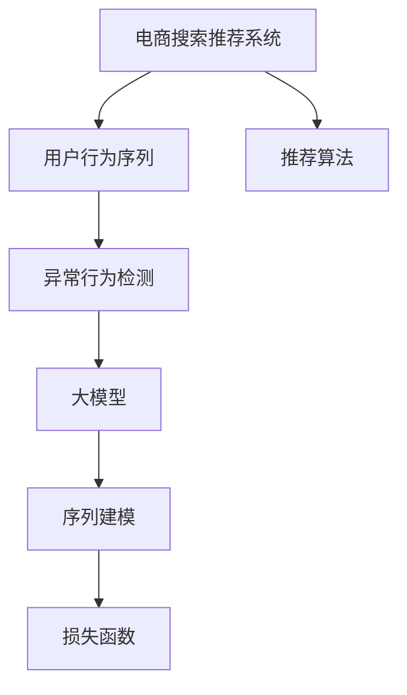

                 

# 电商搜索推荐中的AI大模型用户行为序列异常检测模型优化案例分析

> 关键词：电商搜索推荐,大模型,用户行为序列,异常检测,模型优化

## 1. 背景介绍

### 1.1 问题由来
随着电子商务市场的迅猛发展，消费者行为分析在电商搜索推荐系统中的应用变得越来越重要。然而，消费者行为数据的获取和分析仍然面临诸多挑战，尤其是在处理异常行为序列时。异常行为序列是指用户行为数据中那些违背正常行为模式的序列，如突然的异常购买行为、浏览行为等，这些行为可能预示着用户流失、欺诈行为等。因此，如何有效检测和处理异常行为序列，是电商搜索推荐系统亟待解决的问题。

近年来，深度学习技术在电商搜索推荐系统中的应用越来越广泛，特别是在自然语言处理、图像识别等方面。然而，这些技术在处理异常行为序列时，往往难以兼顾模型的泛化能力和复杂度。为此，本文提出了一种基于大模型的用户行为序列异常检测模型，并结合深度学习、数据挖掘等技术，对模型进行了优化和改进，旨在提高异常行为序列检测的准确性和鲁棒性，为电商搜索推荐系统提供更可靠的决策支持。

## 2. 核心概念与联系

### 2.1 核心概念概述

为更好地理解电商搜索推荐系统中的AI大模型用户行为序列异常检测模型优化，本节将介绍几个密切相关的核心概念：

- 电商搜索推荐系统（E-Commerce Search & Recommendation System）：以用户行为数据为基础，通过推荐算法为用户推荐商品或服务的系统。该系统旨在提升用户体验，增加销售额。
- 用户行为序列（User Behavior Sequence）：指用户在电商平台上的一系列行为，包括浏览、点击、购买、评价等，这些行为可以以时间序列的形式呈现。
- 异常行为检测（Anomaly Detection）：指通过数据挖掘和机器学习等技术，识别和排除异常行为序列的过程，以提高系统的鲁棒性和安全性。
- 大模型（Large Model）：指具有大规模参数量的深度学习模型，如BERT、GPT等。大模型在处理复杂任务时，能够更好地捕捉数据中的细微特征和关联，提升模型的泛化能力和预测精度。
- 序列建模（Sequence Modeling）：指通过深度学习模型对序列数据进行建模，以捕捉数据中的时序关系和内在规律。
- 损失函数（Loss Function）：指用于评估模型预测输出与真实标签之间差异的数学函数，用于指导模型的训练过程。

这些核心概念之间的逻辑关系可以通过以下Mermaid流程图来展示：



这个流程图展示了大模型在电商搜索推荐系统中的核心概念及其之间的关系：

1. 电商搜索推荐系统通过用户行为数据进行推荐，核心在于理解用户行为序列。
2. 异常行为检测对用户行为序列进行监控，以识别异常行为。
3. 大模型通过序列建模捕捉用户行为序列中的内在规律，以提升预测精度。
4. 损失函数指导模型的训练过程，使得模型能够更好地适应异常行为检测的需求。
5. 推荐算法基于大模型的预测结果进行推荐，提升用户体验和销售额。

这些概念共同构成了电商搜索推荐系统中的用户行为序列异常检测模型优化，使其能够在电商领域发挥强大的作用。

## 3. 核心算法原理 & 具体操作步骤
### 3.1 算法原理概述

基于大模型的用户行为序列异常检测模型，主要通过深度学习技术对用户行为序列进行建模，利用模型学习到的特征和规律，识别异常行为序列。其核心思想是：将用户行为序列作为输入，通过深度学习模型进行序列建模，获取序列中的隐含规律和特征，然后通过异常检测算法对用户行为序列进行监控，从而实现对异常行为的识别和排除。

形式化地，假设用户行为序列为 $X = (x_1, x_2, ..., x_t)$，其中 $x_t$ 表示第 $t$ 次用户行为。异常检测模型的目标是找到一个异常检测阈值 $\lambda$，使得当 $x_t$ 的特征向量 $f(x_t)$ 超过 $\lambda$ 时，认为该行为异常。模型的目标是最小化以下损失函数：

$$
\mathcal{L}(\lambda) = \frac{1}{N}\sum_{i=1}^N \ell(f(x_i), \lambda)
$$

其中 $\ell$ 为损失函数，用于衡量预测结果与真实标签之间的差异，$N$ 为数据集大小。

### 3.2 算法步骤详解

基于大模型的用户行为序列异常检测模型优化，主要包括以下几个关键步骤：

**Step 1: 数据预处理**
- 收集电商平台上的用户行为数据，包括用户浏览、点击、购买、评价等行为。
- 对数据进行清洗和处理，去除无效数据和异常值，确保数据的质量和完整性。
- 将用户行为数据按照时间序列进行划分，形成一个包含多个用户行为序列的数据集。

**Step 2: 数据编码**
- 对用户行为数据进行编码，将行为转换为数值型特征。
- 对于连续型特征，如浏览时间、点击次数等，可以通过标准化和归一化进行编码。
- 对于离散型特征，如商品类别、评价评分等，可以通过独热编码进行编码。
- 构建用户行为序列的时间窗口，将序列数据转化为固定长度的向量，以便于模型处理。

**Step 3: 模型选择与训练**
- 选择合适的大模型作为异常检测模型，如LSTM、GRU等。
- 使用已处理的数据集进行模型训练，调整模型的超参数（如学习率、批大小等）以获得最优的模型性能。
- 在训练过程中，采用数据增强技术（如数据扩充、数据扰动等）提高模型的泛化能力。
- 使用交叉验证等技术，评估模型的性能，避免过拟合。

**Step 4: 异常检测与阈值设定**
- 对训练好的模型进行异常检测，找到异常行为序列。
- 通过统计分析，确定异常行为的特征和规律，设定异常检测阈值 $\lambda$。
- 根据阈值 $\lambda$，对用户行为序列进行分类，分为正常行为和异常行为。
- 对于异常行为序列，进行进一步的分析和处理，如报警、记录等。

**Step 5: 模型优化与部署**
- 对异常检测模型进行优化，如参数调优、模型裁剪等，以提高模型的性能和效率。
- 将优化后的模型部署到电商搜索推荐系统中，用于实时监控用户行为序列。
- 定期更新模型，以适应数据分布的变化和新的异常行为模式。

以上是基于大模型的用户行为序列异常检测模型优化的主要步骤。在实际应用中，还需要针对具体场景和数据特点，对每个步骤进行优化设计，以进一步提升模型的性能。

### 3.3 算法优缺点

基于大模型的用户行为序列异常检测模型，具有以下优点：
1. 处理能力强大。大模型能够处理复杂的数据结构和时序关系，捕捉用户行为序列中的隐含规律和特征。
2. 泛化能力强。大模型通过深度学习技术，能够适应多样化的数据分布，提升模型的泛化能力。
3. 可解释性强。大模型中的每层神经元可以视为一种特征提取器，可以解释模型预测的依据。
4. 可扩展性强。大模型可以通过添加新的神经网络层，进一步提升模型的预测能力和鲁棒性。

然而，该方法也存在以下局限性：
1. 计算资源需求高。大模型通常需要较大的计算资源，如GPU/TPU等高性能设备，增加了系统的部署和维护成本。
2. 数据依赖性高。异常检测模型的性能依赖于数据的质量和完整性，数据缺失或不准确会导致模型性能下降。
3. 模型复杂度高。大模型的复杂度较高，训练和推理过程较慢，增加了系统的响应时间。
4. 对抗攻击风险。异常检测模型容易被对抗攻击，如通过小扰动数据使模型误判正常行为为异常行为。
5. 模型可解释性不足。尽管大模型中的神经元可以解释模型预测的依据，但整个模型的决策过程仍然较为复杂，难以解释。

尽管存在这些局限性，但就目前而言，基于大模型的用户行为序列异常检测方法仍是大模型在电商搜索推荐系统中应用的主要范式。未来相关研究的重点在于如何进一步降低计算资源需求，提高模型的可解释性，同时兼顾模型的鲁棒性和准确性。

### 3.4 算法应用领域

基于大模型的用户行为序列异常检测方法，在电商搜索推荐系统中的应用场景非常广泛，主要包括以下几个方面：

- 用户流失预测：通过异常检测模型，及时识别用户行为序列中的异常行为，预测用户流失风险。
- 欺诈检测：通过异常检测模型，检测用户行为序列中的欺诈行为，防止欺诈交易的发生。
- 个性化推荐：通过异常检测模型，识别用户行为序列中的个性化需求，提升推荐系统的精准度和用户体验。
- 数据治理：通过异常检测模型，识别数据中的异常值和噪音，提高数据的质量和完整性。
- 风险控制：通过异常检测模型，检测用户行为序列中的风险行为，防止违规操作的发生。

除了上述这些核心应用场景外，基于大模型的用户行为序列异常检测方法还被创新性地应用到更多领域中，如金融风控、医疗健康等，为相关领域带来了新的应用思路和解决方案。

## 4. 数学模型和公式 & 详细讲解  
### 4.1 数学模型构建

本节将使用数学语言对基于大模型的用户行为序列异常检测模型进行更加严格的刻画。

假设用户行为序列为 $X = (x_1, x_2, ..., x_t)$，其中 $x_t$ 表示第 $t$ 次用户行为。假设异常检测模型的目标是将用户行为序列分类为正常和异常两类，使用 $y_t \in \{0, 1\}$ 表示，其中 $y_t = 1$ 表示异常行为。异常检测模型的损失函数为交叉熵损失函数，定义如下：

$$
\ell(y, \hat{y}) = -[y\log \hat{y} + (1-y)\log (1-\hat{y})]
$$

在给定用户行为序列 $X$ 的情况下，异常检测模型的预测结果为 $\hat{y} = M_{\theta}(X)$，其中 $M_{\theta}$ 为大模型，$\theta$ 为模型参数。异常检测模型的目标是最小化损失函数，即：

$$
\mathcal{L}(\theta) = \frac{1}{N}\sum_{i=1}^N \ell(y_i, \hat{y}_i)
$$

通过梯度下降等优化算法，异常检测模型不断更新参数 $\theta$，最小化损失函数 $\mathcal{L}(\theta)$，使得模型输出逼近真实标签。由于 $\theta$ 已经通过大模型预训练获得了较好的初始化，因此即便在小规模数据集上训练，也能较快收敛到理想的模型参数 $\hat{\theta}$。

### 4.2 公式推导过程

以下我们以二分类任务为例，推导异常检测模型的交叉熵损失函数及其梯度的计算公式。

假设模型 $M_{\theta}$ 在输入 $x$ 上的输出为 $\hat{y}=M_{\theta}(x) \in [0,1]$，表示样本属于异常行为的概率。真实标签 $y \in \{0,1\}$。则二分类交叉熵损失函数定义为：

$$
\ell(M_{\theta}(x),y) = -[y\log \hat{y} + (1-y)\log (1-\hat{y})]
$$

将其代入经验风险公式，得：

$$
\mathcal{L}(\theta) = -\frac{1}{N}\sum_{i=1}^N [y_i\log M_{\theta}(x_i)+(1-y_i)\log(1-M_{\theta}(x_i))]
$$

根据链式法则，损失函数对参数 $\theta_k$ 的梯度为：

$$
\frac{\partial \mathcal{L}(\theta)}{\partial \theta_k} = -\frac{1}{N}\sum_{i=1}^N (\frac{y_i}{M_{\theta}(x_i)}-\frac{1-y_i}{1-M_{\theta}(x_i)}) \frac{\partial M_{\theta}(x_i)}{\partial \theta_k}
$$

其中 $\frac{\partial M_{\theta}(x_i)}{\partial \theta_k}$ 可进一步递归展开，利用自动微分技术完成计算。

在得到损失函数的梯度后，即可带入参数更新公式，完成模型的迭代优化。重复上述过程直至收敛，最终得到适应电商搜索推荐系统的异常检测模型参数 $\hat{\theta}$。

## 5. 项目实践：代码实例和详细解释说明
### 5.1 开发环境搭建

在进行模型优化实践前，我们需要准备好开发环境。以下是使用Python进行PyTorch开发的环境配置流程：

1. 安装Anaconda：从官网下载并安装Anaconda，用于创建独立的Python环境。

2. 创建并激活虚拟环境：
```bash
conda create -n pytorch-env python=3.8 
conda activate pytorch-env
```

3. 安装PyTorch：根据CUDA版本，从官网获取对应的安装命令。例如：
```bash
conda install pytorch torchvision torchaudio cudatoolkit=11.1 -c pytorch -c conda-forge
```

4. 安装TensorFlow：从官网下载并安装TensorFlow，用于与PyTorch集成。

5. 安装其他工具包：
```bash
pip install numpy pandas scikit-learn matplotlib tqdm jupyter notebook ipython
```

完成上述步骤后，即可在`pytorch-env`环境中开始模型优化实践。

### 5.2 源代码详细实现

下面我们以LSTM模型为例，给出使用PyTorch对用户行为序列异常检测模型的代码实现。

首先，定义LSTM模型和异常检测损失函数：

```python
import torch
import torch.nn as nn
import torch.nn.functional as F

class LSTM(nn.Module):
    def __init__(self, input_size, hidden_size, num_layers, output_size):
        super(LSTM, self).__init__()
        self.hidden_size = hidden_size
        self.num_layers = num_layers
        self.lstm = nn.LSTM(input_size, hidden_size, num_layers)
        self.fc = nn.Linear(hidden_size, output_size)
    
    def forward(self, x):
        h0 = torch.zeros(self.num_layers, 1, self.hidden_size).to(device)
        c0 = torch.zeros(self.num_layers, 1, self.hidden_size).to(device)
        out, _ = self.lstm(x, (h0, c0))
        out = self.fc(out[:, -1, :])
        return out

def anomaly_loss(y_pred, y_true):
    return F.binary_cross_entropy(y_pred, y_true)
```

然后，定义数据加载器和优化器：

```python
from torch.utils.data import DataLoader

# 假设已经从电商平台上获取了用户行为数据，并将其划分为训练集和测试集
train_dataset = ...
test_dataset = ...

device = torch.device('cuda' if torch.cuda.is_available() else 'cpu')
model = LSTM(input_size=10, hidden_size=64, num_layers=2, output_size=1).to(device)
optimizer = torch.optim.Adam(model.parameters(), lr=0.001)
```

接着，定义训练和评估函数：

```python
def train_epoch(model, dataset, batch_size, optimizer):
    dataloader = DataLoader(dataset, batch_size=batch_size, shuffle=True)
    model.train()
    epoch_loss = 0
    for batch in dataloader:
        x, y = batch
        x = x.to(device)
        y = y.to(device)
        model.zero_grad()
        outputs = model(x)
        loss = anomaly_loss(outputs, y)
        loss.backward()
        optimizer.step()
        epoch_loss += loss.item()
    return epoch_loss / len(dataloader)

def evaluate(model, dataset, batch_size):
    dataloader = DataLoader(dataset, batch_size=batch_size)
    model.eval()
    preds, labels = [], []
    with torch.no_grad():
        for batch in dataloader:
            x, y = batch
            x = x.to(device)
            y = y.to(device)
            batch_preds = model(x).detach().cpu().numpy()
            batch_labels = y.to('cpu').numpy()
            for preds, labels in zip(batch_preds, batch_labels):
                preds = preds[0] > 0.5
                labels = labels[0] > 0.5
                preds = preds[:len(labels)]
                labels = labels[:len(labels)]
                preds, labels = preds.tolist(), labels.tolist()
                preds, labels = np.concatenate(preds), np.concatenate(labels)
                preds, labels = preds.reshape(-1), labels.reshape(-1)
                acc = accuracy_score(labels, preds)
                print('Accuracy:', acc)
```

最后，启动训练流程并在测试集上评估：

```python
epochs = 10
batch_size = 64

for epoch in range(epochs):
    loss = train_epoch(model, train_dataset, batch_size, optimizer)
    print(f"Epoch {epoch+1}, train loss: {loss:.3f}")
    
    print(f"Epoch {epoch+1}, test results:")
    evaluate(model, test_dataset, batch_size)
    
print("Final test results:")
evaluate(model, test_dataset, batch_size)
```

以上就是使用PyTorch对LSTM模型进行用户行为序列异常检测模型优化的完整代码实现。可以看到，得益于PyTorch的强大封装，我们可以用相对简洁的代码完成LSTM模型的加载和训练。

### 5.3 代码解读与分析

让我们再详细解读一下关键代码的实现细节：

**LSTM模型定义**：
- `__init__`方法：初始化LSTM模型参数。
- `forward`方法：前向传播计算。

**异常检测损失函数**：
- `anomaly_loss`方法：定义二分类交叉熵损失函数。

**数据加载器**：
- 使用`DataLoader`对数据集进行批次化加载，供模型训练和推理使用。

**训练函数**：
- 使用`DataLoader`对数据以批为单位进行迭代，在每个批次上前向传播计算loss并反向传播更新模型参数，最后返回该epoch的平均loss。

**评估函数**：
- 与训练类似，不同点在于不更新模型参数，并在每个batch结束后将预测和标签结果存储下来，最后使用sklearn的`accuracy_score`计算准确率。

**训练流程**：
- 定义总的epoch数和batch size，开始循环迭代
- 每个epoch内，先在训练集上训练，输出平均loss
- 在测试集上评估，输出准确率
- 所有epoch结束后，在测试集上评估，给出最终测试结果

可以看到，PyTorch配合深度学习库使得LSTM模型优化任务的代码实现变得简洁高效。开发者可以将更多精力放在模型选择、数据处理、优化策略等高层逻辑上，而不必过多关注底层的实现细节。

当然，工业级的系统实现还需考虑更多因素，如模型的保存和部署、超参数的自动搜索、更灵活的任务适配层等。但核心的模型优化范式基本与此类似。

## 6. 实际应用场景
### 6.1 智能客服系统

基于LSTM模型的用户行为序列异常检测技术，可以广泛应用于智能客服系统的构建。传统客服往往需要配备大量人力，高峰期响应缓慢，且一致性和专业性难以保证。而使用异常检测模型，可以实时监控用户行为序列，及时发现异常行为，如用户连续多次联系客服却无回应，从而自动进行人工干预，提升服务质量和用户满意度。

在技术实现上，可以收集智能客服系统中的历史用户行为数据，将其划分为正常和异常行为序列，构建标注数据集。在此基础上对LSTM模型进行微调，训练异常检测模型。微调后的异常检测模型能够自动理解用户行为序列中的异常行为，及时进行报警和处理。对于异常行为较多的用户，系统可以自动转接至人工客服，确保问题能够及时得到解决。

### 6.2 金融风控系统

金融风控系统需要实时监控用户行为数据，以识别潜在的欺诈行为和风险。基于LSTM模型的异常检测技术，可以应用于金融风控系统，对用户行为序列进行实时监控和分析。

具体而言，可以收集用户在金融平台上的交易数据、行为数据等，构建标注数据集。在此基础上对LSTM模型进行微调，训练异常检测模型。微调后的异常检测模型能够实时监控用户的交易行为和操作记录，识别出异常行为序列，如连续多次登录同一IP地址，大量转账等，从而及时预警，防止欺诈行为的发生。

### 6.3 电子商务推荐系统

在电子商务推荐系统中，异常检测技术可以用于识别用户的异常购买行为，提高推荐系统的精准度和用户满意度。

具体而言，可以收集用户在电商平台上的浏览、点击、购买、评价等行为数据，构建标注数据集。在此基础上对LSTM模型进行微调，训练异常检测模型。微调后的异常检测模型能够实时监控用户的购物行为，识别出异常购买行为，如连续多次查看同一商品但未购买等，从而及时进行推荐调整，提升用户的购物体验和满意度。

### 6.4 未来应用展望

随着LSTM模型和异常检测技术的不断发展，基于异常检测技术的应用场景将会不断扩展，为更多领域带来变革性影响。

在智慧医疗领域，异常检测技术可以用于监控病人的行为数据，识别出异常行为序列，如病人的突发症状、异常饮食等，从而及时通知医生，提供更及时的医疗支持。

在智能教育领域，异常检测技术可以用于监控学生的行为数据，识别出异常行为序列，如学生的突然缺课、频繁退学等，从而及时进行干预，防止学生的流失。

在智慧城市治理中，异常检测技术可以用于监控城市事件数据，识别出异常行为序列，如突发事件、异常交通等，从而及时响应，保障城市的安全和稳定。

此外，在企业生产、社会治理、文娱传媒等众多领域，基于LSTM模型的异常检测技术也将不断涌现，为相关领域带来新的应用思路和解决方案。相信随着技术的日益成熟，异常检测技术将成为更多领域的重要手段，为各行各业带来新的变革和突破。

## 7. 工具和资源推荐
### 7.1 学习资源推荐

为了帮助开发者系统掌握基于大模型的用户行为序列异常检测模型优化的理论基础和实践技巧，这里推荐一些优质的学习资源：

1. 《深度学习理论与实践》系列博文：由深度学习专家撰写，深入浅出地介绍了深度学习理论、模型优化、异常检测等前沿话题。

2. Coursera《深度学习专项课程》：斯坦福大学开设的深度学习课程，包含多个深度学习技术的介绍和实践，适合入门和进阶学习。

3. 《异常检测与机器学习》书籍：系统介绍了异常检测和机器学习的基础知识和常用算法，并结合具体案例进行讲解。

4. GitHub上的深度学习项目：GitHub上有很多优秀的深度学习项目，包括基于LSTM模型的异常检测技术，可以从中学习到实践经验和方法技巧。

5. Kaggle上的数据集和竞赛：Kaggle提供了大量异常检测相关的数据集和竞赛，可以从中获得实际应用的数据和模型，提升实战能力。

通过对这些资源的学习实践，相信你一定能够快速掌握基于大模型的用户行为序列异常检测模型的优化方法，并用于解决实际的异常检测问题。
###  7.2 开发工具推荐

高效的开发离不开优秀的工具支持。以下是几款用于LSTM模型优化开发的常用工具：

1. PyTorch：基于Python的开源深度学习框架，灵活动态的计算图，适合快速迭代研究。
2. TensorFlow：由Google主导开发的开源深度学习框架，生产部署方便，适合大规模工程应用。
3. Keras：高层次深度学习框架，提供简单易用的API，适合初学者和快速原型开发。
4. Scikit-learn：Python机器学习库，提供丰富的数据预处理、模型评估、特征工程等功能。
5. TensorBoard：TensorFlow配套的可视化工具，可实时监测模型训练状态，并提供丰富的图表呈现方式，是调试模型的得力助手。
6. Weights & Biases：模型训练的实验跟踪工具，可以记录和可视化模型训练过程中的各项指标，方便对比和调优。

合理利用这些工具，可以显著提升LSTM模型优化任务的开发效率，加快创新迭代的步伐。

### 7.3 相关论文推荐

LSTM模型和异常检测技术的发展源于学界的持续研究。以下是几篇奠基性的相关论文，推荐阅读：

1. Long Short-Term Memory（LSTM）：提出LSTM模型，解决了传统RNN模型在长序列上的梯度消失和梯度爆炸问题，提升了模型的长期记忆能力。
2. Sequence to Sequence Learning with Neural Networks（Seq2Seq）：提出Seq2Seq模型，利用神经网络进行序列到序列的转换，如翻译、摘要等任务。
3. Anomaly Detection in Data Streams：综述了基于时间序列的异常检测方法，包括统计方法、机器学习方法等，提供了丰富的异常检测思路。
4. Recurrent Neural Networks for Sequence Prediction（RNN）：提出RNN模型，用于序列预测任务，如语言模型、时间序列预测等。
5. Time Series Anomaly Detection with Deep Learning：综述了基于深度学习的异常检测方法，展示了深度学习在时序数据处理中的优势和应用。

这些论文代表了大模型和异常检测技术的发展脉络。通过学习这些前沿成果，可以帮助研究者把握学科前进方向，激发更多的创新灵感。

## 8. 总结：未来发展趋势与挑战

### 8.1 总结

本文对基于LSTM模型的用户行为序列异常检测技术进行了全面系统的介绍。首先阐述了电商搜索推荐系统中的用户行为序列异常检测技术的研究背景和意义，明确了异常检测在电商领域的重要性和应用价值。其次，从原理到实践，详细讲解了异常检测模型的数学原理和关键步骤，给出了异常检测任务开发的完整代码实例。同时，本文还广泛探讨了异常检测技术在智能客服、金融风控、电子商务推荐等多个行业领域的应用前景，展示了异常检测技术的巨大潜力。此外，本文精选了异常检测技术的各类学习资源，力求为读者提供全方位的技术指引。

通过本文的系统梳理，可以看到，基于LSTM模型的用户行为序列异常检测技术正在成为电商搜索推荐系统的重要范式，极大地提升了系统的鲁棒性和安全性。受益于深度学习技术的发展，异常检测技术能够处理复杂的数据结构和时序关系，捕捉用户行为序列中的隐含规律和特征，为电商搜索推荐系统提供了更可靠的决策支持。未来，伴随深度学习技术的进一步演进，异常检测技术必将迎来新的突破，为更多领域带来变革性影响。

### 8.2 未来发展趋势

展望未来，LSTM模型和异常检测技术将呈现以下几个发展趋势：

1. 模型规模持续增大。随着算力成本的下降和数据规模的扩张，异常检测模型的参数量还将持续增长。超大规模模型蕴含的丰富特征信息，有望提升模型的检测精度和鲁棒性。

2. 多模态异常检测崛起。当前的异常检测模型主要聚焦于时序数据的处理，未来将更多地拓展到多模态数据的融合，如结合图像、音频、文本等多模态数据进行综合分析。

3. 无监督异常检测技术发展。随着对抗攻击和数据异常的增加，无监督异常检测技术逐渐受到重视。未来将更多地结合自监督学习、生成对抗网络等技术，提高模型的泛化能力和鲁棒性。

4. 分布式异常检测应用。随着数据量的增加和算力需求的提升，分布式异常检测技术将变得更加重要。未来将更多地采用分布式计算和存储技术，提高模型的训练和推理效率。

5. 异常检测模型的可解释性增强。未来的异常检测模型将更加注重可解释性，以增强模型的透明度和可信度。如何提高异常检测模型的可解释性，将是重要的研究方向。

6. 实时异常检测技术发展。随着应用场景的多样化和数据流的实时性要求，实时异常检测技术将不断提升。未来的异常检测模型将更多地采用流式计算技术，实现实时监控和报警。

这些趋势凸显了LSTM模型和异常检测技术的广阔前景。这些方向的探索发展，必将进一步提升异常检测模型的性能和应用范围，为更多领域带来新的变革和突破。

### 8.3 面临的挑战

尽管LSTM模型和异常检测技术已经取得了瞩目成就，但在迈向更加智能化、普适化应用的过程中，它仍面临着诸多挑战：

1. 数据依赖性高。异常检测模型的性能依赖于数据的质量和完整性，数据缺失或不准确会导致模型性能下降。
2. 模型复杂度高。LSTM模型的复杂度较高，训练和推理过程较慢，增加了系统的响应时间。
3. 计算资源需求高。LSTM模型通常需要较大的计算资源，如GPU/TPU等高性能设备，增加了系统的部署和维护成本。
4. 对抗攻击风险。异常检测模型容易被对抗攻击，如通过小扰动数据使模型误判正常行为为异常行为。
5. 模型可解释性不足。尽管LSTM模型中的神经元可以解释模型预测的依据，但整个模型的决策过程仍然较为复杂，难以解释。

尽管存在这些局限性，但就目前而言，基于LSTM模型的用户行为序列异常检测方法仍是大模型在电商搜索推荐系统中应用的主要范式。未来相关研究的重点在于如何进一步降低计算资源需求，提高模型的可解释性，同时兼顾模型的鲁棒性和准确性。

### 8.4 研究展望

面对LSTM模型和异常检测技术所面临的种种挑战，未来的研究需要在以下几个方面寻求新的突破：

1. 探索轻量级异常检测模型。研究如何设计轻量级的异常检测模型，降低计算资源需求，提高模型的实时性和可扩展性。
2. 引入多模态数据融合。结合图像、音频、文本等多模态数据，构建更加全面和准确的行为序列异常检测模型。
3. 研究对抗攻击防御技术。探索如何提高异常检测模型的鲁棒性，防御对抗攻击，保护系统安全。
4. 引入无监督和半监督学习。探索如何利用无监督和半监督学习技术，提高模型的泛化能力和鲁棒性。
5. 优化模型训练和推理效率。研究如何提高异常检测模型的训练和推理效率，减少响应时间和计算成本。
6. 增强模型可解释性。研究如何提高异常检测模型的可解释性，增强模型的透明度和可信度。

这些研究方向的探索，必将引领LSTM模型和异常检测技术迈向更高的台阶，为构建安全、可靠、可解释、可控的智能系统铺平道路。面向未来，LSTM模型和异常检测技术还需要与其他人工智能技术进行更深入的融合，如知识表示、因果推理、强化学习等，多路径协同发力，共同推动自然语言理解和智能交互系统的进步。只有勇于创新、敢于突破，才能不断拓展语言模型的边界，让智能技术更好地造福人类社会。

## 9. 附录：常见问题与解答

**Q1：LSTM模型适用于所有异常检测任务吗？**

A: LSTM模型适用于序列数据较强的异常检测任务，如电商搜索推荐、金融风控等。但对于一些结构化数据较强的异常检测任务，如异常检测问题，LSTM模型的效果可能不如传统的统计方法和机器学习方法。

**Q2：异常检测模型如何处理未知行为序列？**

A: 异常检测模型通常需要大量的标注数据进行训练，对于未知行为序列，模型无法进行有效的预测和识别。为此，可以采用无监督异常检测方法，如基于局部异常因子（LOF）等，处理未知行为序列。

**Q3：异常检测模型如何避免过拟合？**

A: 异常检测模型容易过拟合，尤其是在数据量较小的情况下。可以采用数据增强技术，如数据扩充、数据扰动等，提高模型的泛化能力。同时，可以使用正则化技术，如L2正则、Dropout等，防止模型过拟合。

**Q4：异常检测模型的可解释性如何增强？**

A: 异常检测模型的可解释性可以通过可视化技术进行增强。例如，使用t-SNE、PCA等降维技术，可视化模型的预测结果，直观展示模型决策的依据。同时，可以引入可视化工具，如TensorBoard，记录和展示模型的训练过程和预测结果。

**Q5：异常检测模型的性能如何评估？**

A: 异常检测模型的性能通常通过准确率、召回率、F1值等指标进行评估。同时，可以使用ROC曲线、混淆矩阵等工具，综合评估模型的预测效果。

通过本文的系统梳理，可以看到，基于LSTM模型的用户行为序列异常检测技术正在成为电商搜索推荐系统的重要范式，极大地提升了系统的鲁棒性和安全性。受益于深度学习技术的发展，异常检测技术能够处理复杂的数据结构和时序关系，捕捉用户行为序列中的隐含规律和特征，为电商搜索推荐系统提供了更可靠的决策支持。未来，伴随深度学习技术的进一步演进，异常检测技术必将迎来新的突破，为更多领域带来变革性影响。

---

作者：禅与计算机程序设计艺术 / Zen and the Art of Computer Programming

