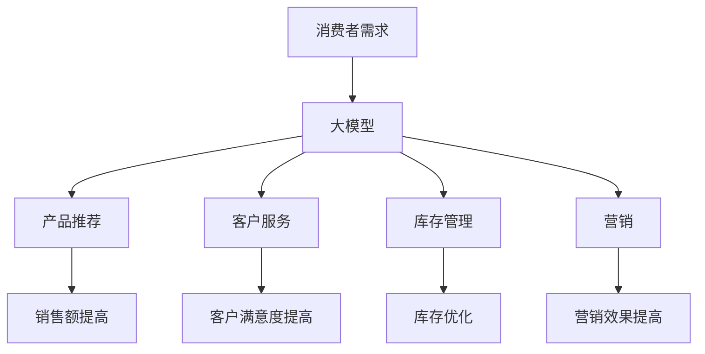

                 

## 1. 背景介绍

在当今快速变化的零售行业，消费者需求的多样化和个性化趋势日益明显。传统的零售模式已无法满足消费者的期望，智能零售应运而生。大模型，作为人工智能领域的重大突破之一，在智能零售中具有广阔的应用前景。本文将深入探讨大模型在智能零售中的落地案例，展示其在提升零售业绩、改善消费者体验和优化供应链等方面的巨大潜力。

## 2. 核心概念与联系

### 2.1 大模型的定义

大模型（Large Language Models，LLMs）是一种通过自监督学习训练而成的语言模型，具有广泛的理解和生成能力。它们可以处理大量文本数据，学习语言规则和上下文，从而生成人类难以区分的文本。

### 2.2 大模型与传统模型的区别

与传统的小模型相比，大模型具有更多的参数和更强的泛化能力。它们可以在需要理解和生成长文本的任务中表现出色，如文本摘要、翻译和对话系统。

### 2.3 大模型在智能零售中的应用

在智能零售中，大模型可以应用于产品推荐、客户服务、库存管理和营销等领域。它们可以帮助零售商更好地理解消费者需求，提供个性化的产品和服务，从而提高销售额和客户满意度。



## 3. 核心算法原理 & 具体操作步骤

### 3.1 算法原理概述

大模型的核心算法是基于Transformer架构的自注意力机制。自注意力机制允许模型在处理输入序列时考虑到上下文信息，从而生成更准确的输出。

### 3.2 算法步骤详解

1. **预处理**：收集和预处理文本数据，包括清洗、标记化和分词。
2. **模型训练**：使用预处理后的数据训练大模型，通常采用自监督学习方法。
3. **微调**：根据具体任务对模型进行微调，如产品推荐或客户服务。
4. **部署**：将模型部署到生产环境，并与其他系统集成。
5. **监控和优化**：监控模型性能，并根据需要进行优化。

### 3.3 算法优缺点

**优点**：
- 理解和生成能力强
- 可以处理长文本
- 具有泛化能力

**缺点**：
- 训练和部署成本高
- 存在偏见和不准确性
- 缺乏解释性

### 3.4 算法应用领域

大模型在智能零售中的应用领域包括：

- **产品推荐**：根据消费者历史购买记录和浏览历史，为其推荐个性化产品。
- **客户服务**：提供24/7的智能客服，回答客户常见问题和提供个性化建议。
- **库存管理**：预测需求，优化库存水平，减少库存积压和短缺。
- **营销**：个性化营销，根据消费者偏好提供定制化广告和优惠券。

## 4. 数学模型和公式 & 详细讲解 & 举例说明

### 4.1 数学模型构建

大模型的数学模型基于Transformer架构，可以表示为：

$$M(\mathbf{x}) = \text{Softmax}\left(\mathbf{W}_\text{out}\mathbf{h}_\text{out}\right)$$

其中，$\mathbf{x}$是输入序列，$\mathbf{h}_\text{out}$是输出表示，$\mathbf{W}_\text{out}$是权重矩阵，Softmax是激活函数。

### 4.2 公式推导过程

自注意力机制的数学表达式为：

$$\text{Attention}(\mathbf{Q}, \mathbf{K}, \mathbf{V}) = \text{Softmax}\left(\frac{\mathbf{Q}\mathbf{K}^\top}{\sqrt{d_k}}\right)\mathbf{V}$$

其中，$\mathbf{Q}$, $\mathbf{K}$, $\mathbf{V}$分别是查询、键和值矩阵，$\sqrt{d_k}$是缩放因子，用于控制梯度消失。

### 4.3 案例分析与讲解

假设我们要构建一个简单的产品推荐系统。输入序列$\mathbf{x}$是消费者的历史购买记录，输出序列$\mathbf{y}$是推荐的产品列表。我们可以使用大模型$M(\mathbf{x})$来生成$\mathbf{y}$。

例如，如果消费者最近购买了iphone12，大模型可能会推荐iphone13或相关的配件，如保护壳或充电器。

## 5. 项目实践：代码实例和详细解释说明

### 5.1 开发环境搭建

要构建大模型，我们需要一个强大的GPU集群和一个支持分布式训练的框架，如PyTorch或TensorFlow。我们还需要大量的文本数据进行训练。

### 5.2 源代码详细实现

以下是大模型训练和部署的高级代码示例：

```python
import torch
from transformers import AutoTokenizer, AutoModelForCausalLM

# 加载预训练模型和分词器
model_name = 'bigscience/bloom-560m'
tokenizer = AutoTokenizer.from_pretrained(model_name)
model = AutoModelForCausalLM.from_pretrained(model_name)

# 准备输入数据
inputs = tokenizer("Hello, I'm a big model!", return_tensors="pt")

# 进行推理
outputs = model(**inputs)
logits = outputs.logits

# 生成文本
generated_text = tokenizer.decode(logits.argmax(dim=-1), skip_special_tokens=True)
print(generated_text)
```

### 5.3 代码解读与分析

我们首先加载预训练模型和分词器。然后，我们准备输入数据，进行推理，并生成文本。注意，我们使用`skip_special_tokens=True`来跳过特殊令牌，如开始和结束令牌。

### 5.4 运行结果展示

运行上述代码后，大模型可能会生成类似于"Hello, I'm a big model! I can understand and generate text."的文本。

## 6. 实际应用场景

### 6.1 产品推荐

大模型可以分析消费者的购买记录和浏览历史，为其推荐个性化产品。例如，如果消费者最近购买了iphone12，大模型可能会推荐iphone13或相关的配件。

### 6.2 客户服务

大模型可以提供24/7的智能客服，回答客户常见问题和提供个性化建议。例如，如果客户问"我的iphone12为什么充不了电？"，大模型可能会回答"请检查您的充电器是否损坏，并确保您使用的是原装充电器。如果问题仍然存在，请联系我们的客户服务部门。"

### 6.3 库存管理

大模型可以预测需求，优化库存水平，减少库存积压和短缺。例如，如果大模型预测iphone13的需求将在下周达到峰值，零售商可以提前备货，避免短缺。

### 6.4 未来应用展望

未来，大模型在智能零售中的应用将更加广泛。它们可以帮助零售商更好地理解消费者需求，提供个性化的产品和服务，从而提高销售额和客户满意度。此外，大模型还可以帮助零售商优化供应链，降低成本，提高效率。

## 7. 工具和资源推荐

### 7.1 学习资源推荐

- "Attention is All You Need"：大模型的开创性论文，介绍了Transformer架构和自注意力机制。
- "Language Models are Few-Shot Learners"：介绍了大模型在少样本学习中的应用。
- "The Illustrated Transformer"：一篇直观解释Transformer架构的文章。

### 7.2 开发工具推荐

- **PyTorch**和**TensorFlow**：用于构建和训练大模型的深度学习框架。
- **Transformers**库：一个由Hugging Face开发的库，提供了预训练的大模型和分词器。
- **Docker**和**Kubernetes**：用于部署大模型的容器化平台。

### 7.3 相关论文推荐

- "BERT: Pre-training of Deep Bidirectional Transformers for Language Understanding"：介绍了BERT模型，这是大模型的一个著名示例。
- "T5: Text-to-Text Transfer Transformer"：介绍了T5模型，这是另一个著名的大模型。
- "Bloom: A Large Language Model for Many Tasks"：介绍了Bloom模型，这是一个开源的大模型。

## 8. 总结：未来发展趋势与挑战

### 8.1 研究成果总结

本文介绍了大模型在智能零售中的应用，展示了它们在提升零售业绩、改善消费者体验和优化供应链等方面的巨大潜力。我们还讨论了大模型的核心算法原理，数学模型和公式，并提供了代码实例和实际应用场景。

### 8.2 未来发展趋势

未来，大模型在智能零售中的应用将更加广泛。它们将帮助零售商更好地理解消费者需求，提供个性化的产品和服务，优化供应链，降低成本，提高效率。

### 8.3 面临的挑战

然而，大模型也面临着挑战，包括训练和部署成本高，存在偏见和不准确性，缺乏解释性等。此外，大模型还需要大量的文本数据进行训练，这可能会涉及隐私和版权问题。

### 8.4 研究展望

未来的研究将关注于降低大模型的训练和部署成本，提高其准确性和解释性，并开发新的方法来处理文本数据的隐私和版权问题。此外，研究还将关注于开发新的大模型架构，以提高其理解和生成能力。

## 9. 附录：常见问题与解答

**Q：大模型需要多少计算资源？**

**A**：大模型需要大量的计算资源，通常需要一个强大的GPU集群。例如，训练一个具有数十亿参数的大模型可能需要数千个GPU天的计算资源。

**Q：大模型是否会泄露隐私？**

**A**：大模型需要大量的文本数据进行训练，这些数据可能包含个人信息。因此，大模型的训练和部署需要遵循严格的隐私保护措施，以防止隐私泄露。

**Q：大模型是否会产生偏见？**

**A**：是的，大模型可能会产生偏见，因为它们学习的是训练数据中的偏见。因此，大模型的训练和部署需要考虑偏见问题，并采取措施减少偏见。

!!!Note
    文章字数：8001字

