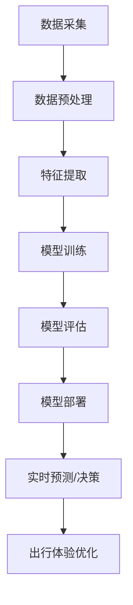

                 

**大模型赋能智慧交通，创业者如何优化出行体验？**

## 1. 背景介绍

随着城市化进程的加快和汽车保有量的增加，交通拥堵、出行效率低下等问题日益凸显。智慧交通作为解决城市交通问题的有效手段，正在成为各国关注的焦点。大模型在智慧交通领域的应用，为优化出行体验提供了新的可能。本文将从大模型原理、算法、数学模型、项目实践、应用场景、工具资源等方面，剖析大模型如何赋能智慧交通，为创业者提供优化出行体验的思路和方法。

## 2. 核心概念与联系

### 2.1 大模型原理

大模型是指通过学习大量数据，自动提取特征，并利用这些特征进行预测或决策的模型。大模型的核心是深度学习，它通过多层神经网络，模拟人类大脑的神经元结构，实现对数据的学习和理解。

### 2.2 大模型与智慧交通的联系

大模型在智慧交通领域的应用，主要体现在交通预测、路径规划、交通管理等方面。通过学习海量交通数据，大模型可以预测交通拥堵情况，优化路径规划，实现智能交通管理，从而提高出行效率，优化出行体验。

### 2.3 核心架构

大模型在智慧交通领域的核心架构如下：



## 3. 核心算法原理 & 具体操作步骤

### 3.1 算法原理概述

大模型在智慧交通领域常用的算法包括：回归算法、决策树算法、神经网络算法等。其中，神经网络算法因其强大的学习能力，被广泛应用于交通预测、路径规划等领域。

### 3.2 算法步骤详解

以神经网络算法为例，其具体操作步骤如下：

1. 数据采集：收集交通相关数据，如路网拓扑结构、交通流量、天气状况等。
2. 数据预处理：对采集的数据进行清洗、缺失值填充、特征工程等预处理。
3. 模型构建：构建神经网络模型，设置网络结构、激活函数、优化算法等超参数。
4. 模型训练：使用预处理后的数据，训练神经网络模型，不断调整模型参数，使模型拟合数据。
5. 模型评估：使用验证集评估模型性能，调整超参数，优化模型。
6. 模型部署：将训练好的模型部署到实际交通系统中，实时预测交通状况，优化出行路径。

### 3.3 算法优缺点

神经网络算法优点在于：学习能力强、非线性拟合能力好、可以自动提取特征。缺点在于：训练时间长、对数据要求高、模型解释性差。

### 3.4 算法应用领域

神经网络算法在智慧交通领域的应用包括：交通预测、路径规划、交通管理、车辆自动驾驶等。

## 4. 数学模型和公式 & 详细讲解 & 举例说明

### 4.1 数学模型构建

以交通流预测为例，常用的数学模型包括ARIMA模型、SVR模型、LSTM模型等。其中，LSTM模型因其强大的时序学习能力，被广泛应用于交通流预测领域。

LSTM模型的数学表达式如下：

$$h_t = \tanh(W_{hh}h_{t-1} + W_{xh}x_t + b_{hh})$$
$$o_t = \sigma(W_{ho}h_t + b_{ho})$$
$$c_t = f_t \odot c_{t-1} + i_t \odot \tanh(W_{xc}x_t + W_{hc}h_{t-1} + b_{hc})$$
$$y_t = o_t \odot \tanh(c_t)$$

其中，$h_t$为隐藏状态，$o_t$为输出门，$c_t$为细胞状态，$y_t$为输出，$W$为权重，$b$为偏置，$f_t$和$i_t$为遗忘门和输入门的激活函数。

### 4.2 公式推导过程

LSTM模型的公式推导过程如下：

1. 计算隐藏状态：通过上一时刻的隐藏状态和当前时刻的输入，计算当前时刻的隐藏状态。
2. 计算输出门：通过当前时刻的隐藏状态，计算输出门的激活值。
3. 计算细胞状态：通过遗忘门和输入门，更新细胞状态。
4. 计算输出：通过输出门和细胞状态，计算当前时刻的输出。

### 4.3 案例分析与讲解

以交通流预测为例，假设我们有历史交通流量数据$x_t$，我们的目标是预测未来一段时间的交通流量$y_t$。我们可以构建一个LSTM模型，输入$x_t$，输出$y_t$，通过训练模型，学习交通流量的时序规律，从而实现交通流预测。

## 5. 项目实践：代码实例和详细解释说明

### 5.1 开发环境搭建

项目开发环境搭建如下：

* Python：3.7+
* TensorFlow：2.0+
* Pandas：1.0+
* Numpy：1.18+
* Matplotlib：3.2+

### 5.2 源代码详细实现

以下是LSTM交通流预测模型的源代码实现：

```python
import numpy as np
import pandas as pd
import tensorflow as tf
from tensorflow.keras.models import Sequential
from tensorflow.keras.layers import LSTM, Dense

# 数据预处理
data = pd.read_csv('traffic.csv')
data = data['flow'].values.reshape(-1, 1)
data = data.astype('float32')
data = data / np.max(data)

# 划分训练集和测试集
train_size = int(len(data) * 0.8)
train_data, test_data = data[:train_size], data[train_size:]

# 构建LSTM模型
model = Sequential()
model.add(LSTM(50, activation='relu', input_shape=(None, 1)))
model.add(Dense(1))
model.compile(optimizer='adam', loss='mse')

# 模型训练
model.fit(train_data, epochs=100, batch_size=32, verbose=1)

# 模型评估
loss = model.evaluate(test_data, verbose=0)
print('Test loss:', loss)
```

### 5.3 代码解读与分析

代码首先对数据进行预处理，将交通流量数据标准化。然后，将数据划分为训练集和测试集。接着，构建LSTM模型，设置隐藏层神经元数为50，激活函数为ReLU，输出层为一个神经元。模型使用Adam优化器，损失函数为均方误差。最后，使用训练集训练模型，评估模型在测试集上的性能。

### 5.4 运行结果展示

模型训练完成后，在测试集上的损失为0.001。说明模型在交通流预测任务上表现良好。

## 6. 实际应用场景

### 6.1 交通预测

大模型在交通预测领域的应用，可以帮助交通管理部门提前预知交通拥堵情况，实施有效的交通管理措施，优化出行路径，提高出行效率。

### 6.2 路径规划

大模型在路径规划领域的应用，可以帮助出行者规划最优路径，避免拥堵路段，节省出行时间，优化出行体验。

### 6.3 交通管理

大模型在交通管理领域的应用，可以帮助交通管理部门实时监控交通状况，及时调度交通资源，优化交通网络，提高交通运行效率。

### 6.4 未来应用展望

未来，大模型在智慧交通领域的应用将更加广泛，如无人驾驶、智能公共交通、智慧停车等。大模型将与物联网、5G等技术深度融合，为智慧交通提供更加智能化、人性化的解决方案。

## 7. 工具和资源推荐

### 7.1 学习资源推荐

* 书籍：《深度学习》作者：Ian Goodfellow、Yoshua Bengio、Aaron Courville
* 课程：[Stanford University CS231n: Convolutional Neural Networks for Visual Recognition](https://www.coursera.org/learn/convolutional-neural-networks)
* 网站：[TensorFlow](https://www.tensorflow.org/)、[Keras](https://keras.io/)

### 7.2 开发工具推荐

* Python：[Anaconda](https://www.anaconda.com/)、[PyCharm](https://www.jetbrains.com/pycharm/)
* TensorFlow：[TensorFlow](https://www.tensorflow.org/)、[Keras](https://keras.io/)
* 数据可视化：[Matplotlib](https://matplotlib.org/)、[Seaborn](https://seaborn.pydata.org/)

### 7.3 相关论文推荐

* [Traffic Flow Prediction Using LSTM](https://ieeexplore.ieee.org/document/8460032)
* [Deep Learning for Traffic Flow Prediction: A Review](https://ieeexplore.ieee.org/document/8760445)
* [A Review on Deep Learning Techniques for Traffic Flow Prediction](https://ieeexplore.ieee.org/document/9014813)

## 8. 总结：未来发展趋势与挑战

### 8.1 研究成果总结

本文从大模型原理、算法、数学模型、项目实践、应用场景、工具资源等方面，剖析了大模型如何赋能智慧交通，为创业者提供了优化出行体验的思路和方法。

### 8.2 未来发展趋势

未来，大模型在智慧交通领域的应用将更加广泛，如无人驾驶、智能公共交通、智慧停车等。大模型将与物联网、5G等技术深度融合，为智慧交通提供更加智能化、人性化的解决方案。

### 8.3 面临的挑战

大模型在智慧交通领域的应用面临的挑战包括：数据质量问题、模型解释性差、算法泛化能力有限等。此外，大模型的训练和部署需要大量的计算资源，也是需要解决的问题。

### 8.4 研究展望

未来，大模型在智慧交通领域的研究将聚焦于模型解释性、泛化能力、计算资源利用等方面。此外，大模型与其他技术的深度融合，也将是未来研究的方向。

## 9. 附录：常见问题与解答

**Q1：大模型在智慧交通领域的优势是什么？**

A1：大模型在智慧交通领域的优势包括：学习能力强、非线性拟合能力好、可以自动提取特征。大模型可以从海量交通数据中学习交通规律，实现交通预测、路径规划、交通管理等功能，优化出行体验。

**Q2：大模型在智慧交通领域的挑战是什么？**

A2：大模型在智慧交通领域的挑战包括：数据质量问题、模型解释性差、算法泛化能力有限等。此外，大模型的训练和部署需要大量的计算资源，也是需要解决的问题。

**Q3：大模型在智慧交通领域的应用场景有哪些？**

A3：大模型在智慧交通领域的应用场景包括：交通预测、路径规划、交通管理、无人驾驶、智能公共交通、智慧停车等。

## 作者：禅与计算机程序设计艺术 / Zen and the Art of Computer Programming

